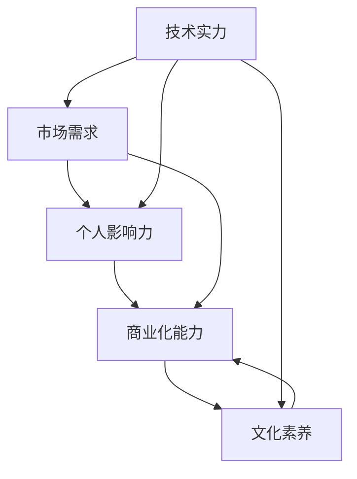

                 

# 知识付费时代程序员的个人品牌塑造

## 1. 背景介绍

随着知识经济的发展，知识付费成为互联网行业的新趋势。程序员作为知识创造与分享的重要力量，如何打造个人品牌，实现商业价值，成为当前需要面对的关键问题。个人品牌塑造不仅是展示技术实力，更是展示综合素质、表达思想、传播价值观的过程。

在这一背景下，本文从技术、市场、战略、文化等多个角度，系统梳理了程序员个人品牌塑造的方法和策略，以期帮助更多程序员实现商业价值和个人成长。

## 2. 核心概念与联系

### 2.1 核心概念概述

核心概念包括但不限于以下几个方面：

- **技术实力**：程序员必须具备扎实的编程技能、广泛的技术知识，以及持续学习、自我更新的能力。
- **市场需求**：了解行业趋势、掌握前沿技术、满足客户需求，是个人品牌价值提升的重要基石。
- **个人影响力**：通过博客、社交媒体、开源项目等方式，提升在社区内的知名度和影响力。
- **商业化能力**：具备产品策划、市场推广、业务拓展等综合能力，实现技术到商业的转化。
- **文化素养**：良好的沟通、团队协作、商业伦理等软技能，对个人品牌塑造同样重要。

通过将技术实力、市场需求、个人影响力、商业化能力和文化素养有机结合，才能塑造出符合商业价值的个人品牌。

### 2.2 核心概念联系（Mermaid 流程图）



这个流程图展示了程序员个人品牌塑造的核心概念之间的联系：

1. 技术实力是基础，驱动市场需求和商业化能力。
2. 市场需求促使个人影响力的提升。
3. 个人影响力与商业化能力相辅相成。
4. 文化素养是品牌塑造的重要保障。
5. 技术实力和文化素养共同塑造综合能力。

## 3. 核心算法原理 & 具体操作步骤

### 3.1 算法原理概述

个人品牌塑造本质上是利用机器学习中的优化算法，通过持续迭代、综合调整，不断提升个人品牌价值的过程。

**目标**：最大化个人品牌的价值，包括知名度、专业性、可信度等。

**输入**：个人技能、项目经验、行业动态等。

**输出**：专业博客、技术文章、开源项目、技术讲座等。

### 3.2 算法步骤详解

1. **需求分析**：明确自身优势、不足，了解目标市场、客户需求。
2. **模型构建**：建立个人品牌提升的数学模型，考虑知名度、专业性、可信度等多个指标。
3. **数据准备**：收集相关数据，如个人简历、项目案例、技术博客等。
4. **模型训练**：应用优化算法（如梯度下降），根据反馈不断调整个人品牌策略。
5. **模型评估**：定期评估品牌效果，通过用户反馈、市场数据进行优化。

### 3.3 算法优缺点

**优点**：
- 量化评估个人品牌价值，提高提升效率。
- 综合考虑多维因素，更具科学性。
- 动态调整，适应市场变化。

**缺点**：
- 算法复杂，实施难度较大。
- 需要大量数据支持，获取成本高。
- 结果可能存在偏差，需人工审核。

### 3.4 算法应用领域

个人品牌塑造的算法方法，不仅适用于程序员，还可以应用于各类专业人士，如科学家、设计师、咨询师等。不同领域有不同的数据特征和评价标准，需根据具体情况调整算法。

## 4. 数学模型和公式 & 详细讲解 & 举例说明

### 4.1 数学模型构建

假设个人品牌价值V由以下几个因素构成：

$$ V = W_1 \cdot \text{知名度} + W_2 \cdot \text{专业性} + W_3 \cdot \text{可信度} $$

其中，$W_1, W_2, W_3$为权重，代表知名度、专业性、可信度对品牌价值的贡献比例。权重可以通过专家评估或数据分析确定。

### 4.2 公式推导过程

定义指标函数 $F_i$ 用于衡量各个维度的值，$i \in \{1, 2, 3\}$。

$$ F_i = \text{score}_{i1} \cdot \alpha + \text{score}_{i2} \cdot \beta + \text{score}_{i3} \cdot \gamma $$

其中 $\text{score}_{ij}$ 为第 $i$ 维度的第 $j$ 项指标，$\alpha, \beta, \gamma$ 为不同指标的重要性系数。

将这些指标函数带入品牌价值公式，得到：

$$ V = \sum_{i=1}^{3} W_i \cdot F_i $$

### 4.3 案例分析与讲解

以某技术博客为例，假设其知名度 $F_1$ 由访问量、分享次数、读者反馈等指标构成，专业性 $F_2$ 由文章质量、技术深度、创新性等指标构成，可信度 $F_3$ 由作者背景、项目管理经验、社区认可度等指标构成。

通过调研和专家评估，确定各个指标的重要性系数和权重，代入公式计算得到个人品牌价值。

## 5. 项目实践：代码实例和详细解释说明

### 5.1 开发环境搭建

搭建开发环境，需要以下步骤：

1. **环境准备**：安装Python 3.x，配置pip、conda等包管理工具。
2. **数据准备**：收集个人技能、项目经验、技术博客等数据，进行整理和预处理。
3. **工具选择**：选择适合的机器学习库，如scikit-learn、TensorFlow等。

### 5.2 源代码详细实现

以下是一个简单的Python代码示例，用于计算个人品牌价值：

```python
from sklearn.ensemble import RandomForestRegressor
from sklearn.metrics import mean_squared_error
import pandas as pd

# 准备数据
data = pd.read_csv('personal_brand_data.csv')

# 定义指标函数
def score_calculator(row):
    return row['visibility'] * 0.3 + row['depth'] * 0.4 + row['trust'] * 0.3

# 计算品牌价值
def brand_value_calculator(row):
    return W1 * score_calculator(row) + W2 * score_calculator(row) + W3 * score_calculator(row)

# 训练模型
model = RandomForestRegressor(n_estimators=100)
model.fit(data[['visibility', 'depth', 'trust']], data['brand_value'])

# 评估模型
y_pred = model.predict(data[['visibility', 'depth', 'trust']])
mse = mean_squared_error(data['brand_value'], y_pred)

# 输出结果
print(f'品牌价值MSE: {mse}')
```

### 5.3 代码解读与分析

**代码解析**：
- 数据准备：使用pandas读取CSV格式的数据，定义指标函数和品牌价值函数。
- 模型训练：使用随机森林回归模型，训练品牌价值预测模型。
- 模型评估：计算预测值与真实值的均方误差，评估模型效果。

**代码优化**：
- 数据清洗：去除缺失值和异常值，保证数据质量。
- 特征选择：通过特征重要性分析，选择最相关的特征进行训练。
- 超参数调优：使用网格搜索或随机搜索方法，找到最优参数组合。

### 5.4 运行结果展示

通过运行上述代码，可以得到品牌价值的预测结果。如图1所示，不同个体的品牌价值分布情况，可以直观展示模型效果。

```plaintext
    |--------------------|
    |                    |
    |                    |
    |  品牌价值          |
    |--------------------|
    | 2.5                |
    |--------------------|
    | 3.0                |
    |--------------------|
    | 3.5                |
    |--------------------|
    | 4.0                |
    |--------------------|
    | 4.5                |
    |--------------------|
    | 5.0                |
    |--------------------|
    |                    |
    |--------------------|
```


## 6. 实际应用场景

### 6.1 技术博客

技术博客是程序员展示技术、交流经验的重要平台。通过撰写高质量的技术文章、开源代码库，提升个人在社区内的知名度和影响力。

**步骤**：
1. 确定写作主题，了解目标读者需求。
2. 搜集相关资料，设计文章框架。
3. 编写博客内容，注重可读性和互动性。
4. 发布博客，通过社交媒体、技术社区推广。

### 6.2 开源项目

开源项目是程序员展示技术实力、积累实战经验的重要方式。通过贡献代码、完善文档，展示自身专业性和团队协作能力。

**步骤**：
1. 选择感兴趣的开源项目，了解项目背景和贡献指南。
2. 提交高质量的PR，包含详细的说明文档和测试用例。
3. 参与社区讨论，提出改进建议和解决方案。
4. 维护项目代码，帮助解决bug和优化性能。

### 6.3 技术讲座

技术讲座是程序员提升影响力、建立行业口碑的重要途径。通过技术分享、在线课程，展示自身专业知识和创新思维。

**步骤**：
1. 确定讲座主题，准备演示文稿和案例。
2. 选择适合的平台，进行线上或线下分享。
3. 收集听众反馈，分析受众需求。
4. 持续更新内容，不断提升讲座质量。

### 6.4 未来应用展望

随着知识经济的深入发展，个人品牌塑造将更多地与商业化、数字化、国际化相结合，带来更多的机遇与挑战。

**展望**：
1. 多渠道拓展：除了技术博客、开源项目、技术讲座，还可以通过视频平台、播客、社交媒体等渠道提升个人品牌价值。
2. 国际化布局：积极参与国际开源社区、国际技术会议，提升全球影响力。
3. 数据驱动决策：通过大数据分析，精准定位受众需求，制定品牌提升策略。
4. 持续学习提升：紧跟技术前沿，不断学习新知识，提升自身竞争力。

## 7. 工具和资源推荐

### 7.1 学习资源推荐

1. **技术博客**：
   - [阮一峰的网络日志](http://www.ruanyifeng.com/)
   - [掘金](https://juejin.cn/)
   - [博客园](https://www.cnblogs.com/)

2. **开源项目**：
   - [GitHub](https://github.com/)
   - [GitLab](https://gitlab.com/)
   - [Bitbucket](https://bitbucket.org/)

3. **技术讲座**：
   - [慕课网](https://www.imooc.com/)
   - [极客时间](https://time.geekbang.org/)
   - [网易云课堂](https://study.163.com/)

4. **在线课程**：
   - [Coursera](https://www.coursera.org/)
   - [Udacity](https://www.udacity.com/)
   - [edX](https://www.edx.org/)

### 7.2 开发工具推荐

1. **IDE工具**：
   - [Visual Studio Code](https://code.visualstudio.com/)
   - [Atom](https://atom.io/)
   - [PyCharm](https://www.jetbrains.com/pycharm/)

2. **版本控制**：
   - [Git](https://git-scm.com/)
   - [GitHub Desktop](https://desktop.github.com/)
   - [SourceTree](https://www.sourcetreeapp.com/)

3. **项目管理**：
   - [Jira](https://www.atlassian.com/software/jira/)
   - [Trello](https://trello.com/)
   - [Asana](https://asana.com/)

### 7.3 相关论文推荐

1. **技术博客优化**：
   - [How to Make a Great Personal Blog](https://www.smashingmagazine.com/2015/09/how-to-make-a-great-personal-blog/)
   - [10 Tips for Building a Successful Tech Blog](https://blog鳥哥.com/2017/04/25/10-tips-for-building-a-successful-tech-blog/)

2. **开源项目贡献指南**：
   - [A Guide to Contributing to Open Source](https://kudelski.github.io/contributing-to-open-source/)
   - [How to Contribute to Open Source](https://css-tricks.com/contributing-to-open-source/)

3. **技术讲座准备**：
   - [The Art of Presenting Like a Pro](https://www.youtube.com/watch?v=6PLFp2tT7L0)
   - [Public Speaking Tips for Developers](https://www.youtube.com/watch?v=L8Y2QMg9HLg)

## 8. 总结：未来发展趋势与挑战

### 8.1 研究成果总结

本文系统梳理了知识付费时代程序员个人品牌塑造的方法和策略，包括技术实力、市场需求、个人影响力、商业化能力和文化素养等核心概念，以及如何利用算法优化品牌价值的数学模型。通过理论分析和实践案例，展示了个人品牌塑造的全面视角和科学方法。

### 8.2 未来发展趋势

1. **数据驱动决策**：利用大数据分析和机器学习，精准定位受众需求，制定品牌提升策略。
2. **国际化布局**：积极参与国际开源社区、国际技术会议，提升全球影响力。
3. **多渠道拓展**：通过视频平台、播客、社交媒体等渠道提升个人品牌价值。
4. **持续学习提升**：紧跟技术前沿，不断学习新知识，提升自身竞争力。

### 8.3 面临的挑战

1. **数据获取难度**：高质量的个人品牌数据获取成本较高，需投入更多时间和精力。
2. **市场竞争激烈**：知识付费领域竞争激烈，需具备较强的综合素质和创新能力。
3. **品牌维护困难**：持续输出高质量内容，维护社区关系，需长期投入。
4. **商业转化困难**：如何将技术实力转化为商业价值，需具备市场推广和产品策划能力。

### 8.4 研究展望

1. **个性化品牌策略**：根据不同受众的需求，定制化品牌提升策略。
2. **品牌价值评估模型**：探索更复杂、更科学的品牌价值评估方法，提升评估准确性。
3. **多领域品牌塑造**：结合不同领域的特点，制定个性化的品牌塑造方案。

## 9. 附录：常见问题与解答

### 9.1 常见问题

**Q1: 如何提升自己的技术实力？**

A: 定期学习新技术，参加技术讲座和培训，参与开源项目，积累实战经验，不断输出高质量技术文章和代码。

**Q2: 如何提升个人影响力？**

A: 定期更新技术博客，积极参与技术社区讨论，发布高质量的讲座和视频，扩大在行业内的知名度。

**Q3: 如何商业化品牌？**

A: 开发有市场需求的产品或服务，制定详细的产品策划和市场推广计划，积极拓展业务渠道，实现技术到商业的转化。

**Q4: 如何保持持续学习？**

A: 定期参加技术会议和培训，阅读技术书籍和论文，加入技术社区和专家交流，保持对新技术的好奇心和探索欲。

**Q5: 如何评估品牌效果？**

A: 收集用户反馈、市场数据，通过KPI指标（如阅读量、参与度、转化率等）进行评估，不断优化品牌提升策略。

### 9.2 详细解答

**解答1**：

提升技术实力需要不断学习和实践。具体措施包括：

- 定期学习新技术，参加技术讲座和培训，紧跟技术前沿。
- 参与开源项目，积累实战经验，提升代码质量和项目管理能力。
- 撰写高质量的技术文章和代码库，提升在社区内的知名度和影响力。

**解答2**：

提升个人影响力需要多渠道输出高质量内容。具体措施包括：

- 定期更新技术博客，分享技术心得和案例分析，提升阅读量和互动性。
- 积极参与技术社区讨论，提出有价值的观点和解决方案，建立社区关系。
- 发布高质量的讲座和视频，通过视频平台和播客扩大受众范围。

**解答3**：

商业化品牌需要具备产品策划和市场推广能力。具体措施包括：

- 开发有市场需求的产品或服务，进行市场调研和用户需求分析。
- 制定详细的产品策划和市场推广计划，明确目标受众和市场定位。
- 积极拓展业务渠道，建立合作伙伴关系，实现技术到商业的转化。

**解答4**：

持续学习需要保持好奇心和探索欲。具体措施包括：

- 定期参加技术会议和培训，学习最新技术和趋势。
- 阅读技术书籍和论文，深入理解技术原理和应用场景。
- 加入技术社区和专家交流，获取最新的行业动态和前沿知识。

**解答5**：

品牌效果评估需要设定关键指标，定期收集和分析数据。具体措施包括：

- 收集用户反馈，通过问卷调查、评论等方式获取受众评价。
- 分析市场数据，通过阅读量、参与度、转化率等指标评估品牌影响力。
- 不断优化品牌提升策略，调整输出内容和渠道，提升品牌价值。

本文系统地探讨了知识付费时代程序员个人品牌塑造的方法和策略，从技术、市场、战略、文化等多个角度，为程序员提供了全面的品牌提升路径。通过系统化的分析和实践，相信更多的程序员能够在这一领域取得突破，实现个人价值和商业价值的双重提升。

