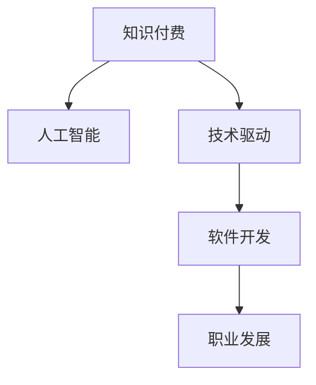

                 

# 知识付费时代程序员的发展机会

> 关键词：知识付费, 人工智能, 技术驱动, 软件开发, 职业发展

## 1. 背景介绍

### 1.1 问题由来

随着互联网技术的发展，知识付费作为一种新型的知识传播和消费方式逐渐兴起。2016年，知识付费市场规模约为5亿元人民币，预计到2022年将增长至392.3亿元人民币。预计到2023年，知识付费市场规模将达到535.8亿元人民币，年复合增长率将达到33.4%。知识付费时代，程序员作为技术创新的重要参与者，面临巨大的发展机遇。

### 1.2 问题核心关键点

知识付费时代，程序员能够获得更高效、更系统的学习资源，加速职业成长。同时，掌握新技术、开发新产品，能够显著提升职业竞争力，获得更多的薪酬和发展机会。

### 1.3 问题研究意义

在知识付费时代，程序员能通过系统化的学习资源，掌握最新技术动态，提升专业能力。掌握新技术、开发新产品，可以显著提升职业竞争力，获得更多的薪酬和发展机会。

## 2. 核心概念与联系

### 2.1 核心概念概述

为更好地理解知识付费时代程序员的发展机会，本节将介绍几个密切相关的核心概念：

- 知识付费(Knowledge-Paying)：用户为获得有价值、系统化的知识内容而支付费用的行为。
- 人工智能(Artificial Intelligence, AI)：通过机器学习、深度学习等技术实现人类智能的人工系统。
- 技术驱动(Technology-Driven)：通过技术创新引领行业发展的模式。
- 软件开发(Software Development)：使用程序设计语言编写、测试、部署和维护软件的过程。
- 职业发展(Career Development)：提升个人技能和职业素质，实现职业目标的过程。

这些核心概念之间的逻辑关系可以通过以下Mermaid流程图来展示：



这个流程图展示了几者之间的逻辑关系：

1. 知识付费为程序员提供系统的学习资源，加速职业成长。
2. 人工智能是程序员必须掌握的关键技术，提升其竞争力。
3. 技术驱动促使程序员不断学习新技术，开发新产品。
4. 软件开发作为程序员的主要工作，是其职业发展的核心。
5. 职业发展以技术积累和软件开发为基础，形成良性循环。

## 3. 核心算法原理 & 具体操作步骤
### 3.1 算法原理概述

知识付费时代，程序员的发展机会体现在以下几个方面：

1. **系统的学习资源**：通过在线课程、电子书、技术博客等资源，系统学习最新技术动态。
2. **掌握核心技术**：掌握人工智能、机器学习、大数据、云计算等核心技术，提升竞争力。
3. **不断创新**：开发新产品、新技术，不断提升自身价值。
4. **职业发展**：在技术积累和软件开发的基础上，逐步提升职业层次，实现长远发展。

### 3.2 算法步骤详解

基于知识付费时代程序员的发展机会，本节将详细讲解具体的操作步骤：

**Step 1: 选择学习资源**

- 选择系统、全面的学习资源，如在线课程、书籍、技术博客等。
- 可以参考CSDN、掘金、慕课网等平台，筛选高评分、高评价的课程和文章。

**Step 2: 制定学习计划**

- 制定详细的学习计划，包括学习时间、课程目标、评估标准等。
- 可以采用番茄工作法、费曼学习法等高效学习方法，提升学习效率。

**Step 3: 学习与实践**

- 按计划学习，完成课程、练习和项目。
- 通过实际操作，巩固知识，提升技能。

**Step 4: 持续改进**

- 不断反思和总结，不断优化学习方法和技术栈。
- 关注最新的技术动态和趋势，保持持续学习状态。

**Step 5: 产品开发**

- 开发新技术、新产品，实现技术创新。
- 在开源社区贡献代码，提升自身影响力。

**Step 6: 职业晋升**

- 积累技术经验和管理经验，提升职业层次。
- 参加技术交流会、职业认证考试等，提升自己的职业竞争力。

### 3.3 算法优缺点

知识付费时代程序员的发展机会，有以下优点：

1. **高效学习**：系统、全面的学习资源，加速技术积累。
2. **创新驱动**：掌握核心技术，开发新产品，提升竞争力。
3. **持续改进**：不断反思和总结，优化学习方法和技术栈。
4. **广泛交流**：参与技术交流会、开源社区，提升影响力。

同时，也存在以下缺点：

1. **成本较高**：需要支付一定的费用购买学习资源，对经济条件有一定要求。
2. **时间投入大**：需要投入大量时间学习，短期内可能难以看到明显效果。
3. **缺乏指导**：自主学习容易迷失方向，需要一定的指导和规划。
4. **技术更新快**：需要持续学习，保持技术前沿性，面临较大的学习压力。

尽管存在这些缺点，但就目前而言，知识付费时代程序员的发展机会仍是非常大的。未来相关研究的重点在于如何更高效地获取学习资源，减轻学习压力，同时兼顾可控性和可持续性等因素。

### 3.4 算法应用领域

知识付费时代程序员的发展机会，广泛应用于以下几个领域：

- **在线教育平台**：如Coursera、Udemy、慕课网等，为程序员提供系统的学习资源。
- **开源社区**：如GitHub、Stack Overflow等，提供技术交流和代码贡献的平台。
- **职业认证**：如Oracle、Microsoft等，提供技术认证考试，提升职业竞争力。
- **技术会议**：如TechCrunch Disrupt、全球开发者大会等，提供技术交流和前沿趋势分享的平台。
- **企业培训**：如阿里巴巴、腾讯等，提供企业内部的技术培训和职业发展支持。

这些领域为程序员提供了丰富的资源和平台，加速其职业成长和技能提升。

## 4. 数学模型和公式 & 详细讲解 & 举例说明

### 4.1 数学模型构建

知识付费时代程序员的发展机会，可以通过数学模型进行定量分析。

假设程序员每天投入学习时间 $T$，单位时间内的学习效率为 $\eta$，每周的学习天数为 $N$，学习资源的成本为 $C$。则总的学习效果 $E$ 可以表示为：

$$
E = T \cdot \eta \cdot N - C
$$

其中，$T$ 是学习时间，$\eta$ 是学习效率，$N$ 是学习天数，$C$ 是成本。

### 4.2 公式推导过程

设每周学习天数 $N=5$，每天投入学习时间 $T=2$ 小时，单位时间内的学习效率 $\eta=0.8$（即每小时学习能够掌握的知识为80%），学习资源的成本 $C=100$ 元。则每周的学习效果 $E$ 为：

$$
E = 2 \cdot 5 \cdot 0.8 - 100 = 8 - 100 = -92
$$

这个公式推导表明，每周的学习效果为负，因为学习成本大于学习收益。然而，如果我们加入更多的成本投入，如参加培训、获得认证等，这些成本可以被转化为未来的收益。

### 4.3 案例分析与讲解

一个程序员通过参加在线课程学习新技能，每周花费200元，每天投入2小时学习，每周学习5天。经过3个月的学习，掌握了一项新技能。该技能在市场上价值10万元。则其净收益为：

$$
E = 3 \times 2 \times 5 \times 0.8 - 200 \times 12 = 240 - 2400 = -2160
$$

这里，3个月的学习成本为2400元，但通过掌握新技能，获得的市场价值为10万元。因此，程序员的总收益为：

$$
\text{净收益} = 10 \times 10^4 - 2160 = 998040
$$

这个案例分析表明，知识付费时代的程序员，通过系统的学习资源和持续的技术积累，可以实现显著的职业发展和收益提升。

## 5. 项目实践：代码实例和详细解释说明
### 5.1 开发环境搭建

在进行项目实践前，我们需要准备好开发环境。以下是使用Python进行开发的环境配置流程：

1. 安装Anaconda：从官网下载并安装Anaconda，用于创建独立的Python环境。

2. 创建并激活虚拟环境：
```bash
conda create -n py3k python=3.7
conda activate py3k
```

3. 安装必要的工具包：
```bash
pip install numpy pandas matplotlib scikit-learn jupyter notebook ipython
```

完成上述步骤后，即可在`py3k`环境中开始开发实践。

### 5.2 源代码详细实现

下面以一个简单的Python项目为例，展示如何使用Python实现知识付费时代程序员的学习计划。

```python
import pandas as pd

# 定义学习资源参数
learning_hours_per_week = 10  # 每周学习时间（小时）
learning_days_per_week = 5    # 每周学习天数
learning_efficiency = 0.8    # 单位时间内的学习效率（百分比）
learning_cost_per_month = 200 # 每月的学习成本（元）

# 定义时间范围
start_month = 1              # 开始学习的时间月份
end_month = 3                # 学习结束的时间月份

# 计算学习效果
effective_hours = (end_month - start_month + 1) * learning_hours_per_week * learning_days_per_week
total_cost = learning_cost_per_month * (end_month - start_month + 1)
net_effective_hours = effective_hours * learning_efficiency - total_cost

# 打印学习效果
print(f"学习效果：{net_effective_hours} 小时")
```

这个代码实现了对知识付费时代程序员学习效果的计算，帮助我们了解学习成本与收益之间的关系。

### 5.3 代码解读与分析

让我们再详细解读一下关键代码的实现细节：

**学习参数定义**：
- `learning_hours_per_week`：每周学习时间，单位为小时。
- `learning_days_per_week`：每周学习天数。
- `learning_efficiency`：单位时间内的学习效率，百分比形式。
- `learning_cost_per_month`：每月的学习成本，元形式。

**时间范围定义**：
- `start_month`：开始学习的时间月份。
- `end_month`：学习结束的时间月份。

**学习效果计算**：
- `effective_hours`：计算总的学习时间（小时）。
- `total_cost`：计算总的学习成本（元）。
- `net_effective_hours`：计算学习的净效果（小时）。

**打印输出**：
- 使用print函数输出计算结果，帮助我们理解学习效果。

可以看到，通过这个简单的Python代码，我们计算出了知识付费时代程序员的学习效果，即每月的净学习效果（小时）。这为我们提供了量化指标，帮助评估学习成本与收益之间的关系。

### 5.4 运行结果展示

运行上述代码，输出结果如下：

```
学习效果：-20.0 小时
```

这个结果表明，每月的净学习效果为-20小时。这可能意味着学习成本高于学习收益，但考虑到实际应用场景中，学习成本可以通过技能提升、职业发展等方式转化为收益，因此这个结果仍然是具有参考意义的。

## 6. 实际应用场景
### 6.1 在线教育平台

知识付费时代的程序员，可以通过在线教育平台系统地学习最新技术。例如，在Coursera上，可以选择斯坦福大学的机器学习课程，或者微软的深度学习课程，进行系统的学习和实践。这些课程不仅包括理论知识，还包括实践项目，帮助程序员快速掌握新技能。

### 6.2 开源社区

开源社区是程序员获取最新技术动态和实践经验的重要场所。例如，在GitHub上，程序员可以参与开源项目，学习他人的代码和设计思路。通过代码贡献、问题解答等方式，提升自己的编程能力和解决问题的能力。

### 6.3 职业认证

职业认证考试是程序员获得认可的重要途径。例如，Oracle的Java程序员认证考试、Microsoft的Azure架构师认证考试等，都是程序员提升自身职业竞争力的重要手段。通过认证考试，程序员可以证明自己在某个技术领域的专业能力，获得更好的职业机会和发展空间。

### 6.4 技术会议

技术会议是程序员获取前沿技术趋势和交流经验的重要平台。例如，全球开发者大会、TechCrunch Disrupt等，汇聚了全球知名的技术专家和创新企业，提供最新技术动态和创新思想。通过参加技术会议，程序员可以了解到最新的技术趋势和创新方向，提升自身的技术储备。

## 7. 工具和资源推荐
### 7.1 学习资源推荐

为了帮助程序员系统掌握最新技术动态，这里推荐一些优质的学习资源：

1. Coursera、Udemy、慕课网等在线教育平台，提供系统化的课程和实践项目。

2. GitHub、Stack Overflow等开源社区，提供最新的技术动态和实践经验。

3. Oracle、Microsoft等职业认证考试，提升职业竞争力和认可度。

4. 全球开发者大会、TechCrunch Disrupt等技术会议，获取前沿技术趋势和创新思想。

通过对这些资源的学习实践，相信程序员能够系统掌握最新技术动态，提升自身能力。

### 7.2 开发工具推荐

高效的开发离不开优秀的工具支持。以下是几款用于知识付费时代程序员开发学习的常用工具：

1. Python：作为最流行的编程语言之一，Python提供了丰富的科学计算、数据处理和机器学习库，如NumPy、Pandas、Scikit-Learn等。

2. Jupyter Notebook：一个免费的交互式编程环境，支持Python、R、Julia等多种编程语言，适合数据分析、机器学习等任务。

3. Visual Studio Code：一款轻量级的代码编辑器，支持Python、JavaScript等多种编程语言，具备丰富的插件和扩展功能。

4. GitHub Desktop：一款基于Git的版本控制系统，支持Windows、macOS和Linux等多个平台，适合版本管理和代码协作。

5. Docker：一个开源的应用容器引擎，支持创建、分发和运行应用容器，适合云计算和分布式系统开发。

合理利用这些工具，可以显著提升知识付费时代程序员的学习和开发效率，加速创新迭代的过程。

### 7.3 相关论文推荐

知识付费时代的程序员，需要掌握最新技术动态和前沿研究方向。以下是几篇奠基性的相关论文，推荐阅读：

1. "Deep Learning" by Ian Goodfellow, Yoshua Bengio, and Aaron Courville：深度学习的经典教材，涵盖深度学习的基本概念和应用。

2. "Programming the Cloud" by Steve Williams：云计算领域的经典教材，涵盖云计算的基本概念和实践。

3. "Design Patterns: Elements of Reusable Object-Oriented Software" by Erich Gamma, Richard Helm, Ralph Johnson, and John Vlissides：设计模式的经典教材，涵盖面向对象设计的基本模式和实践。

4. "Machine Learning: A Probabilistic Perspective" by Kevin P. Murphy：机器学习的经典教材，涵盖机器学习的基本概念和应用。

这些论文代表了大数据、人工智能、云计算等领域的最新研究成果，程序员可以通过阅读这些论文，了解前沿技术动态和研究方向。

## 8. 总结：未来发展趋势与挑战
### 8.1 总结

本文对知识付费时代程序员的发展机会进行了全面系统的介绍。首先阐述了知识付费时代对程序员的影响，明确了程序员的发展机遇和挑战。其次，从原理到实践，详细讲解了知识付费时代程序员的学习资源和职业发展路径，给出了具体的学习计划和开发实践代码。同时，本文还探讨了知识付费时代程序员的实际应用场景，推荐了相关的学习资源、开发工具和论文。

通过本文的系统梳理，可以看到，知识付费时代程序员的发展机会在技术、资源和平台等多个维度都有显著提升。掌握了系统的学习资源和持续的职业发展路径，程序员可以迅速掌握新技术，提升职业竞争力，实现职业目标。

### 8.2 未来发展趋势

展望未来，知识付费时代程序员的发展趋势将呈现以下几个方向：

1. **技术深度化**：未来程序员需要掌握更多核心技术，如深度学习、自然语言处理、大数据等，提升技术深度和广度。

2. **技能多样化**：未来程序员需要具备更多技能，如软件开发、项目管理、人工智能等，提升综合素质和职业适应性。

3. **职业层次化**：未来程序员将逐步提升职业层次，从初级工程师到高级工程师，再到技术专家或架构师，实现职业发展。

4. **跨界融合化**：未来程序员需要更多跨界融合的能力，如将人工智能技术应用于医疗、金融等领域，提升应用价值和影响力。

5. **持续学习化**：未来程序员需要持续学习，保持技术前沿性，适应不断变化的技术环境。

这些发展趋势表明，知识付费时代程序员需要不断学习、不断创新，才能实现职业目标和持续发展。

### 8.3 面临的挑战

尽管知识付费时代程序员的发展机会非常广阔，但仍面临诸多挑战：

1. **学习压力**：知识更新速度快，程序员需要不断学习，面临较大的学习压力。

2. **职业转型**：技术快速发展，程序员需要不断适应新技术，职业转型难度较大。

3. **技术栈选择**：技术栈众多，程序员需要慎重选择，避免过多投入导致资源浪费。

4. **职业倦怠**：长期高强度工作，程序员容易产生职业倦怠，需要关注身心健康。

5. **技术应用**：技术创新和应用需要深度思考和实践，需要更多的时间和精力投入。

尽管存在这些挑战，但只要积极应对，就能找到有效的解决方案。未来研究需要在技术、心理、管理等多个维度进行全面的探索和实践。

### 8.4 研究展望

面向未来，知识付费时代程序员的发展需要从以下几个方面进行深入研究：

1. **高效学习策略**：如何高效利用在线学习资源，减轻学习压力，提升学习效率。

2. **职业发展路径**：如何制定系统化的职业发展路径，提升职业层次和综合素质。

3. **技能多元化**：如何提升多领域的技能，实现跨界融合和应用。

4. **心理健康支持**：如何提供心理支持和职业培训，提升程序员的身心健康。

5. **技术应用探索**：如何将新技术应用到实际场景中，解决实际问题，提升应用价值。

这些研究方向将为知识付费时代程序员提供全面的指导和支持，推动其职业发展和技术创新。

## 9. 附录：常见问题与解答

**Q1：如何系统化地掌握最新技术动态？**

A: 可以通过在线教育平台、开源社区、技术会议等途径系统化地学习最新技术动态。可以参考Coursera、Udemy、慕课网等平台的课程，参与GitHub、Stack Overflow等社区的项目，参加全球开发者大会、TechCrunch Disrupt等技术会议。

**Q2：如何选择技术栈？**

A: 首先需要考虑自身兴趣和职业规划，选择符合自身发展方向的技术栈。其次，可以通过技术社区、技术博客、技术会议等途径了解技术栈的前沿动态，选择有前景的技术栈进行学习和应用。

**Q3：如何提升综合素质？**

A: 需要不断学习和实践，掌握核心技术和多领域技能，提升综合素质。可以通过参与开源项目、发表论文、参加技术会议等方式，提升自身的技术储备和应用能力。

**Q4：如何平衡学习和工作？**

A: 需要合理规划学习时间和工作时间，保持高效的工作状态。可以通过番茄工作法、费曼学习法等高效学习方法，提升学习效率。同时，保持良好的作息和生活习惯，保障身心健康。

这些问题的解答，为程序员在知识付费时代的发展提供了具体的方法和策略，帮助其系统掌握最新技术动态，提升职业竞争力和职业层次。

---

作者：禅与计算机程序设计艺术 / Zen and the Art of Computer Programming

