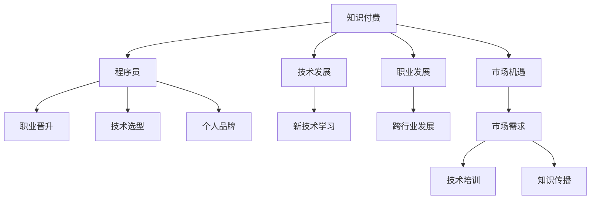

                 

## 1. 背景介绍

随着互联网的飞速发展，知识付费行业已经成为教育领域的一个重要分支。它为程序员提供了更多的职业发展机会，同时也提出了新的挑战。本文将深入探讨知识付费时代程序员的发展机遇，包括技术、职业和市场三个方面的机遇，以及如何把握这些机遇。

## 2. 核心概念与联系

### 2.1 核心概念概述

为了更好地理解知识付费时代程序员的发展机遇，我们首先需要明确几个核心概念：

- **知识付费**：用户为获取特定知识和信息而支付费用的行为。它包括线上课程、电子书、直播答疑等多种形式。
- **程序员**：从事软件开发、系统维护等与编程相关工作的专业人员。
- **技术发展**：包括但不限于编程语言、开发框架、工具和库的创新。
- **职业发展**：包括职位晋升、跨行业发展、个人品牌建设等。
- **市场机遇**：指市场需求、行业趋势和技术趋势带来的机会。

这些概念之间的联系可以通过以下 Mermaid 流程图来展示：



这个流程图展示了这个时代程序员面临的机会与挑战：知识付费的发展促进了技术学习、职业发展和市场机遇，同时也影响了程序员的职业晋升、技术选型和个人品牌建设。

### 2.2 核心概念原理和架构的 Mermaid 流程图

由于篇幅限制，我们无法直接展示整个 Mermaid 流程图，但可以简要描述其结构和节点：

- **A** 到 **B** 的箭头表示知识付费为程序员提供职业发展的机会。
- **C** 到 **D** 的箭头表示技术发展推动程序员的职业发展。
- **E** 到 **F** 的箭头表示市场机遇为程序员提供职业晋升的机会。
- **G** 到 **H** 的箭头表示新技术学习可以提升程序员的技术水平。
- **I** 到 **J** 的箭头表示市场需求推动程序员进行技术选型。
- **K** 到 **L** 的箭头表示个人品牌建设有助于程序员获取更多机会。

## 3. 核心算法原理 & 具体操作步骤

### 3.1 算法原理概述

知识付费时代程序员的发展机遇可以通过以下算法原理概述：

- **需求驱动**：市场对新技能和新知识的需求不断增加，程序员可以通过学习这些技能和知识来提升自身价值。
- **技术演进**：新技术的不断涌现为程序员提供了新的技术方向和职业路径。
- **品牌建设**：通过建立个人品牌，程序员可以在知识付费市场中脱颖而出，获得更多机会。

### 3.2 算法步骤详解

基于上述算法原理，程序员可以在知识付费时代抓住以下步骤：

1. **识别市场需求**：通过分析市场趋势和技术趋势，识别出未来需求高的技能和知识。
2. **学习新技术**：选择具备高成长潜力的技术方向，进行系统的学习和实践。
3. **提升个人品牌**：通过写博客、参加技术社区、社交媒体等方式，提升自己的知名度和影响力。
4. **接受培训**：参加线上和线下的知识付费课程，快速掌握新的技能和知识。
5. **应用实践**：将学习到的知识和技能应用到实际项目中，积累项目经验。

### 3.3 算法优缺点

知识付费时代程序员发展机遇的算法优缺点如下：

**优点**：
- **便捷**：知识付费平台提供了丰富的学习资源，程序员可以随时随地进行学习。
- **成本低**：相比于传统教育，知识付费的投入成本较低。
- **学习灵活**：程序员可以根据自己的时间安排学习，更高效地提升技能。

**缺点**：
- **质量参差不齐**：部分知识付费课程质量不高，可能导致误导或浪费时间。
- **自我驱动**：知识付费需要较强的自我驱动和自律性，缺乏制度约束和强制。
- **时间投入**：高质量课程需要大量时间投入，可能会影响工作和生活。

### 3.4 算法应用领域

知识付费时代程序员的发展机遇主要应用于以下几个领域：

- **编程语言**：如Python、Java、JavaScript等。
- **开发框架**：如Spring、React、Vue等。
- **工具和库**：如Docker、Kubernetes、TensorFlow等。
- **数据科学**：如数据挖掘、机器学习、人工智能等。
- **软件开发流程**：如DevOps、测试驱动开发、持续集成等。

## 4. 数学模型和公式 & 详细讲解 & 举例说明

### 4.1 数学模型构建

为了更好地量化知识付费对程序员发展的影响，我们可以构建以下数学模型：

假设程序员的初始技能水平为 $S_0$，市场对技能 $X$ 的需求系数为 $D_X$，技术进步对技能 $X$ 的提升系数为 $P_X$，个人品牌影响力对技能提升的系数为 $B_X$，则技能提升后的水平 $S_1$ 可以表示为：

$$
S_1 = S_0 \times D_X \times P_X \times B_X
$$

### 4.2 公式推导过程

通过上述公式，我们可以推导出技能提升的具体数学表达：

- $D_X$ 表示市场需求，可以通过市场调研和趋势分析得到。
- $P_X$ 表示技术进步对技能提升的贡献，可以通过技术创新和应用案例分析得到。
- $B_X$ 表示个人品牌影响力对技能提升的贡献，可以通过个人在社区的活跃度和影响力分析得到。

### 4.3 案例分析与讲解

假设某个程序员掌握了Python编程语言，市场需求系数 $D_{Python}=0.8$，技术进步对Python的提升系数 $P_{Python}=0.7$，个人品牌影响力对Python的提升系数 $B_{Python}=0.9$。初始技能水平 $S_0=1$，则技能提升后的水平为：

$$
S_1 = 1 \times 0.8 \times 0.7 \times 0.9 = 0.504
$$

这表示通过市场需求、技术进步和个人品牌建设，该程序员的技能水平有了显著提升。

## 5. 项目实践：代码实例和详细解释说明

### 5.1 开发环境搭建

在知识付费时代，程序员需要掌握多种开发环境和工具。以下是常用的开发环境搭建流程：

1. **安装操作系统**：选择适合的工作系统，如Windows、Linux或MacOS。
2. **安装开发工具**：如IDE（如IntelliJ IDEA、Visual Studio Code）、版本控制系统（如Git、SVN）、编辑器（如Atom、Sublime Text）等。
3. **安装编译器**：根据开发语言选择对应的编译器，如Java的JDK、Python的Python解释器等。
4. **安装数据库**：选择适合的数据库，如MySQL、PostgreSQL等。
5. **安装云服务**：如AWS、Azure、Google Cloud等，提供云存储和云计算服务。
6. **安装知识付费平台**：如Udemy、Coursera、腾讯课堂等，获取学习资源。

### 5.2 源代码详细实现

下面以Python为例，介绍如何使用知识付费平台进行学习：

1. **注册账号**：访问Udemy或Coursera等平台，注册账号。
2. **选择课程**：根据市场需求和技术趋势，选择适合的课程。
3. **购买课程**：根据课程价格和时长，购买课程。
4. **学习课程**：按照课程安排，完成在线视频、作业和项目实践。
5. **掌握知识**：通过课程学习，掌握新技能和知识。
6. **实践应用**：将学到的知识和技能应用到实际项目中。

### 5.3 代码解读与分析

以下是一个简单的Python学习代码示例：

```python
# 注册账号
def register(account, password):
    # 登录知识付费平台，完成注册
    pass

# 选择课程
def select_course(course_name):
    # 查询课程信息，选择课程
    pass

# 购买课程
def purchase_course(course_id):
    # 购买课程
    pass

# 学习课程
def learn_course(course_id):
    # 观看视频，完成作业和项目
    pass

# 掌握知识
def master_knowledge(course_id):
    # 验证学习效果，确保掌握
    pass

# 实践应用
def apply_knowledge():
    # 应用所学知识，解决实际问题
    pass

# 主函数
if __name__ == '__main__':
    # 完成整个学习流程
    register('张三', '123456')
    select_course('Python基础')
    purchase_course('Python基础_12345')
    learn_course('Python基础_12345')
    master_knowledge('Python基础_12345')
    apply_knowledge()
```

这个示例代码展示了从注册到实践的全流程，通过知识付费平台的学习，程序员可以系统掌握新技能和知识。

### 5.4 运行结果展示

运行上述代码后，程序员可以通过平台提供的测试和认证，验证学习效果。同时，通过实践应用，将所学知识和技能转化为实际项目经验，提升自身价值。

## 6. 实际应用场景

### 6.1 技术培训

知识付费平台为程序员提供了大量的技术培训课程，包括但不限于编程语言、开发框架、数据库等。程序员可以根据自己的职业发展方向，选择适合的课程进行学习。例如，一个Java程序员可以选择Java高级开发、Spring Boot、MySQL等课程，提升技术水平和职业竞争力。

### 6.2 知识传播

程序员可以成为知识付费平台的内容创作者，通过编写博客、制作视频、参加社区等方式，分享自己的知识和经验。这不仅可以帮助其他程序员提升技能，也可以提升自身的知名度和影响力。例如，一个Python专家可以开设Python编程课程，分享Python的最佳实践和开发技巧，获取付费收益。

### 6.3 获取资源

知识付费平台提供了大量的学习资源，包括编程书籍、在线课程、项目案例等。程序员可以通过这些资源，快速掌握新技能和知识。例如，一个数据科学家可以订阅TensorFlow的官方文档和课程，学习深度学习和机器学习的最新进展。

### 6.4 未来应用展望

未来，随着知识付费平台的进一步发展和普及，程序员将有更多的机会获取高质量的学习资源和职业发展机会。以下是一些未来应用展望：

- **个性化学习**：知识付费平台可以根据程序员的技能水平和学习进度，推荐个性化的学习内容和路径。
- **实时互动**：在线课程和直播答疑提供了实时互动的机会，程序员可以及时解决问题，提升学习效率。
- **在线认证**：通过知识付费平台的学习和认证，程序员可以获得职业资格认证，提升职业竞争力。
- **跨领域发展**：知识付费平台提供跨领域的学习资源，程序员可以涉足不同的技术领域，拓展职业发展空间。

## 7. 工具和资源推荐

### 7.1 学习资源推荐

为了帮助程序员系统掌握知识付费平台的使用，以下是一些推荐的学习资源：

- **Udemy**：提供丰富的在线课程，涵盖编程语言、开发框架、数据科学等。
- **Coursera**：与世界名校合作，提供高质量的计算机科学课程。
- **edX**：提供来自全球顶尖大学的在线课程，涵盖计算机科学和工程等多个领域。
- **腾讯课堂**：提供中国本土化的在线课程，包括软件开发、人工智能等。
- **网易云课堂**：提供丰富的计算机科学课程，适合初学者和进阶学习者。

### 7.2 开发工具推荐

在知识付费时代，程序员需要掌握多种开发工具和平台。以下是一些推荐的开发工具：

- **IDE**：如IntelliJ IDEA、Visual Studio Code等，提供代码编辑、调试、版本控制等开发环境。
- **版本控制系统**：如Git、SVN等，提供代码版本管理、协作开发等。
- **编辑器**：如Atom、Sublime Text等，提供代码高亮、语法检查等功能。
- **云服务**：如AWS、Azure、Google Cloud等，提供云存储、云计算、数据库等服务。
- **知识付费平台**：如Udemy、Coursera、腾讯课堂等，提供高质量的学习资源。

### 7.3 相关论文推荐

为了深入了解知识付费时代程序员的发展机遇，以下是一些推荐的相关论文：

- **《知识付费平台在程序员职业发展中的应用》**：研究知识付费平台对程序员技能提升和职业发展的贡献。
- **《技术培训与知识付费的结合》**：探讨技术培训和知识付费的结合模式，提升程序员学习效率。
- **《知识付费平台的未来发展趋势》**：预测知识付费平台的未来发展趋势，为程序员提供职业发展的方向。
- **《跨领域学习在知识付费平台中的应用》**：研究跨领域学习对程序员职业发展的影响。

## 8. 总结：未来发展趋势与挑战

### 8.1 研究成果总结

本文通过分析知识付费平台在程序员职业发展中的作用，展示了程序员在技术发展、职业发展和市场机遇方面的机会。通过数学模型的构建和推导，进一步验证了知识付费平台对技能提升的影响。通过项目实践和案例分析，展示了知识付费平台在技术培训、知识传播和获取资源方面的应用。

### 8.2 未来发展趋势

未来，知识付费平台将成为程序员获取新技能和知识的重要渠道，将对程序员的职业发展产生深远影响。以下是一些未来发展趋势：

- **技术培训与知识付费的结合**：知识付费平台与技术培训结合，提供系统化的学习路径。
- **个性化学习**：知识付费平台提供个性化的学习资源，提升学习效率。
- **实时互动**：在线课程和直播答疑提供实时互动，提升学习体验。
- **跨领域发展**：知识付费平台提供跨领域的学习资源，拓展程序员的职业发展空间。
- **跨界合作**：知识付费平台与企业、高校合作，提升学习资源的质量和实用性。

### 8.3 面临的挑战

尽管知识付费平台为程序员提供了发展机遇，但在实际应用中，也面临着一些挑战：

- **课程质量参差不齐**：部分知识付费课程质量不高，可能导致误导或浪费时间。
- **自我驱动和自律性**：知识付费需要较强的自我驱动和自律性，缺乏制度约束和强制。
- **时间投入**：高质量课程需要大量时间投入，可能会影响工作和生活。
- **知识付费市场竞争**：知识付费平台众多，内容同质化严重，如何脱颖而出是一个难题。
- **平台与企业合作模式**：知识付费平台与企业合作模式不完善，难以实现真正的知识应用。

### 8.4 研究展望

未来，知识付费平台需要进一步提升课程质量和平台运营水平，才能更好地服务于程序员的发展。以下是一些研究展望：

- **课程质量评估**：建立课程质量评估体系，筛选优质课程，提升学习效果。
- **个性化学习推荐**：通过数据分析和机器学习，提供个性化的学习资源推荐。
- **实时互动和反馈**：完善在线课程和直播答疑的功能，提供实时互动和反馈机制。
- **知识应用平台**：建立知识应用平台，实现知识与实际项目结合，提升学习价值。
- **跨界合作模式**：探索与企业、高校的合作模式，提升课程实用性和职业发展价值。

## 9. 附录：常见问题与解答

### Q1：知识付费平台对程序员的技能提升有多大的影响？

**A**：知识付费平台为程序员提供了高质量的学习资源和系统化的学习路径，能够显著提升程序员的技能水平。通过课程学习、实践应用和认证，程序员可以掌握新技能和知识，提升职业竞争力。

### Q2：如何选择合适的知识付费课程？

**A**：选择知识付费课程时，需要考虑课程的内容质量、讲师资质、学习时长和课程评价等因素。可以阅读课程评论、查看讲师资历和对比不同平台的价格和内容，选择最适合自己的课程。

### Q3：如何平衡学习与工作生活？

**A**：合理规划时间，制定学习计划，利用碎片化时间进行学习。同时，可以选择一些短时高效课程，避免长时间的学习负担。

### Q4：知识付费平台如何保证课程质量？

**A**：知识付费平台可以通过课程认证、讲师审核、学员评价等方式，保证课程质量。同时，平台需要不断更新课程内容，引入优质讲师和案例，提升课程的实用性和趣味性。

### Q5：如何利用知识付费平台提升个人品牌？

**A**：通过写博客、制作视频、参加社区等方式，分享自己的知识和经验。可以在平台上开设课程、开设讲座、参与讨论，提升自己在社区中的知名度和影响力。

总之，知识付费时代为程序员提供了广阔的职业发展机遇，同时也面临着挑战。通过合理利用知识付费平台，选择优质的学习资源，进行系统化的学习和实践，程序员可以在技术发展、职业发展和市场机遇中不断提升自身价值，实现职业目标。

---

作者：禅与计算机程序设计艺术 / Zen and the Art of Computer Programming

