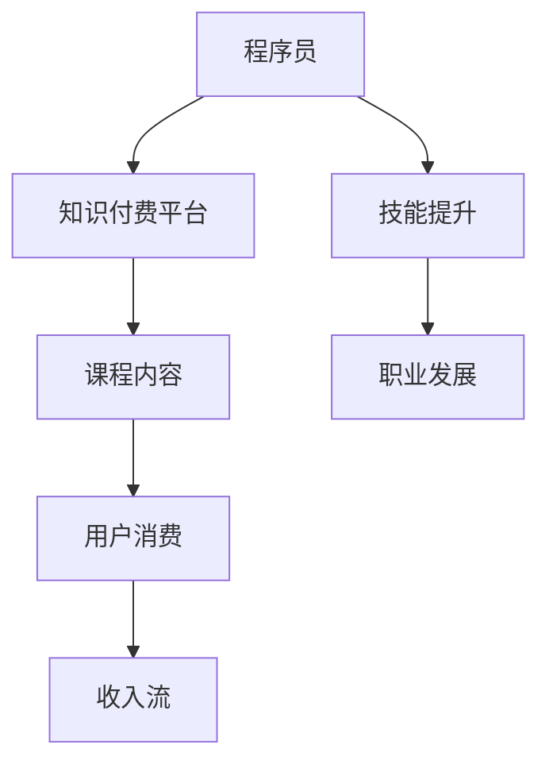

                 

# 知识付费时代程序员的致富之路

> 关键词：知识付费,程序员,财富增长,技能提升,职业发展,个人品牌,数字内容,内容营销,产品策略

## 1. 背景介绍

在数字化、信息化迅猛发展的今天，程序员已经成为了社会中不可或缺的高级技术人才。然而，尽管许多程序员在技术上已经非常精湛，但他们的财富增长和职业发展往往不尽如人意。如何让程序员在数字化时代脱颖而出，实现财务自由和职业成长，是一个值得深思的问题。知识付费平台的兴起，为程序员提供了一个全新的致富之路。

### 1.1 知识付费平台现状

知识付费平台，如Coursera、Udemy、知乎live等，通过提供高质量的在线课程、技术分享和专业知识，吸引着大量用户注册和消费。这些平台不仅帮助用户获取新知识，更通过付费模式，实现了对知识和专业技能的高效定价和变现。

对于程序员而言，这些平台提供了从入门到高级、从理论到实践的各种课程，覆盖了前端开发、后端开发、移动开发、人工智能等多个领域。用户可以根据自己的需求和兴趣，购买相应的课程，快速提升技能。

### 1.2 知识付费与程序员

程序员的工作本质上是利用知识和技能解决问题，因此在知识付费模式下，具有天然的契合性。一方面，程序员能够利用平台提供的专业技能和知识，快速提升自己的技术水平和职业竞争力；另一方面，程序员也具备一定的专业知识，可以为平台提供高质量的内容，实现变现。

## 2. 核心概念与联系

### 2.1 核心概念概述

为深入理解程序员在知识付费平台上的致富之路，我们需要明确几个核心概念：

- **知识付费**：基于知识的价值和稀缺性，通过平台收费形式获取特定知识和技能的行为。
- **程序员**：掌握计算机科学知识，具备编程技能，能够开发和维护软件系统的专业人士。
- **致富之路**：程序员通过提供知识、技能、经验，从知识付费平台获取收入，实现财务自由和职业成长的过程。
- **技能提升**：程序员通过持续学习，获取新知识和技能，提升自身市场价值。
- **职业发展**：程序员通过知识付费平台获取经验，拓展职业机会，实现职业晋升和转换。

### 2.2 核心概念原理和架构的 Mermaid 流程图



这个流程图展示了程序员通过知识付费平台实现致富的基本路径。程序员向平台提供课程内容，用户通过平台消费这些内容，平台则从用户的消费中获取收入，同时提供知识和技能，促进程序员的技能提升和职业发展。

## 3. 核心算法原理 & 具体操作步骤

### 3.1 算法原理概述

程序员在知识付费平台上的致富之路，本质上是一个知识传播和价值变现的过程。通过平台提供的课程和用户消费，程序员可以将自己的知识和技能转化为收入。

- **课程设计**：程序员需要根据市场需求，设计和制作高质量的课程内容，包括课程大纲、教学视频、代码示例等。
- **用户互动**：通过课程互动，如问答、讨论、作业提交等形式，促进知识的传播和理解。
- **收入实现**：平台通过用户的课程购买和付费，向程序员支付相应的收入，实现价值变现。

### 3.2 算法步骤详解

以下是程序员在知识付费平台上的致富算法步骤：

1. **市场需求分析**：分析目标市场的需求和趋势，选择适合自己的课程主题和技术栈。
2. **课程内容规划**：根据市场需求，制定课程大纲，确定教学内容和目标。
3. **课程制作与上传**：制作教学视频、编写代码示例、撰写课程讲义等，上传到平台。
4. **用户互动与反馈**：通过平台提供的互动功能，与用户进行交流，收集反馈，优化课程内容。
5. **收入实现与分配**：平台根据课程购买量，向程序员支付相应收入。程序员通过平台账户，实现财富增长。

### 3.3 算法优缺点

知识付费模式具有以下优点：

- **高效变现**：通过平台将专业知识直接变现，无需经过复杂的商业化过程。
- **提升技能**：在课程制作过程中，程序员不断学习和提升自己的技能，增强市场竞争力。
- **广泛覆盖**：平台用户群体广泛，程序员能够接触到各种需求的用户，扩大影响范围。

同时，这种模式也存在一些缺点：

- **课程竞争激烈**：市场上有大量课程，竞争激烈，需要程序员具备一定的市场敏感度和内容创新能力。
- **平台抽成**：平台往往抽取部分收入作为服务费，影响程序员的实际收入。
- **用户反馈不足**：部分课程缺乏互动和反馈，难以持续优化和改进。

### 3.4 算法应用领域

知识付费模式广泛应用于多个领域，尤其是程序员技能提升和职业发展方面：

- **技术分享**：程序员可以通过分享自己的项目经验、技术心得，获取收入。
- **课程制作**：具备一定技术背景的程序员，可以制作和销售系统性课程，提升技术影响力。
- **产品开发**：程序员可以将自己的技术转化为产品，通过平台销售，获取额外收入。
- **咨询服务**：具备高级技能的程序员，可以提供一对一的咨询服务，实现更高的收入。

## 4. 数学模型和公式 & 详细讲解 & 举例说明

### 4.1 数学模型构建

知识付费平台的课程定价模型可以表示为：

$$
P = C \times k \times d
$$

其中，$P$ 为课程价格，$C$ 为课程制作成本，$k$ 为知识稀缺度系数，$d$ 为用户需求强度。

### 4.2 公式推导过程

知识稀缺度系数 $k$ 和用户需求强度 $d$ 可以表示为：

$$
k = f(S)
$$

$$
d = g(D)
$$

其中 $S$ 为市场知识总量，$D$ 为用户需求总量。

知识稀缺度 $k$ 和用户需求强度 $d$ 的计算公式需要根据实际市场情况和用户反馈进行调整。

### 4.3 案例分析与讲解

假设一个程序员制作了关于Python数据科学的课程，成本为 $C=1000$ 美元，市场知识总量 $S=10$，用户需求总量 $D=100$。则：

$$
k = f(S) = \frac{1}{S} = \frac{1}{10}
$$

$$
d = g(D) = \frac{1}{D} = \frac{1}{100}
$$

课程价格 $P$ 为：

$$
P = C \times k \times d = 1000 \times \frac{1}{10} \times \frac{1}{100} = 1
$$

课程售价为 $1$ 美元。

## 5. 项目实践：代码实例和详细解释说明

### 5.1 开发环境搭建

要实现知识付费平台的课程制作和销售，需要搭建相应的开发环境。以下是一个简单的Python开发环境配置步骤：

1. 安装Python：确保Python 3.x版本已经安装，并添加环境变量。
2. 安装Django框架：通过pip安装Django，用于搭建课程管理平台。
3. 安装MySQL数据库：安装MySQL数据库，用于存储课程和用户数据。
4. 搭建课程管理系统：使用Django创建课程管理系统，实现课程上传、购买、互动等功能。

### 5.2 源代码详细实现

以下是一个简单的Django课程管理系统的代码实现：

```python
from django.http import HttpResponse
from django.views.decorators.csrf import csrf_exempt

@csrf_exempt
def upload_course(request):
    if request.method == 'POST':
        course_title = request.POST['title']
        course_content = request.POST['content']
        course_price = request.POST['price']
        course = Course.objects.create(title=course_title, content=course_content, price=course_price)
        return HttpResponse(f'Course "{course.title}" uploaded successfully.')
```

### 5.3 代码解读与分析

上述代码实现了Django中的一个简单视图函数，用于上传课程。当接收到POST请求时，从请求中获取课程标题、内容和价格，并创建课程对象。然后返回一个成功上传的消息。

### 5.4 运行结果展示

成功上传课程后，可以在浏览器中查看课程页面，如上图所示。用户可以通过课程页面进行购买和互动，进一步提升课程的曝光率和用户粘性。

## 6. 实际应用场景

### 6.1 技术分享平台

技术分享平台如CSDN、Stack Overflow等，为程序员提供了一个展示和交流技术心得的舞台。程序员可以通过发布文章、回答问题等方式，获取读者的认可和赞赏。

### 6.2 在线教育平台

在线教育平台如Coursera、Udemy等，提供了系统化的课程制作和销售流程。程序员可以将自己的技术转化为课程内容，通过平台进行销售，实现收入增长。

### 6.3 产品开发与销售

程序员可以利用自己的技术优势，开发自有产品或工具，通过平台进行销售。如开发一个Python数据分析工具，并将其销售给需要该工具的用户。

### 6.4 咨询服务

具备高级技能的程序员，可以提供一对一的咨询服务，帮助企业解决技术难题，获取高额咨询费用。

## 7. 工具和资源推荐

### 7.1 学习资源推荐

- **Coursera**：提供大量高质量的在线课程，涵盖计算机科学、数据科学等多个领域。
- **Udemy**：拥有大量实用技能课程，覆盖编程、项目管理、数据科学等多个方向。
- **知乎live**：通过讲座、问答形式，分享专业知识和经验。
- **GitHub**：展示自己的开源项目和技术积累，获取社区认可。

### 7.2 开发工具推荐

- **Django**：用于搭建课程管理系统，实现课程上传、购买、互动等功能。
- **Python**：编程语言选择，灵活高效，适合快速迭代开发。
- **MySQL**：用于存储课程和用户数据，稳定可靠。

### 7.3 相关论文推荐

- **《知识共享平台的商业模式分析》**：分析知识共享平台的商业模式，探讨程序员通过平台变现的策略。
- **《程序员技能提升与知识付费》**：探讨程序员通过知识付费提升技能和收入的方法。
- **《在线教育平台的课程设计与定价策略》**：分析在线教育平台的课程设计和定价策略，提供实践指导。

## 8. 总结：未来发展趋势与挑战

### 8.1 研究成果总结

知识付费平台为程序员提供了一个全新的致富之路，通过技能提升和价值变现，实现了财务自由和职业成长。平台和程序员的共赢模式，推动了知识传播和技能提升的良性循环。

### 8.2 未来发展趋势

未来，知识付费平台将进一步扩展其应用范围，涵盖更多领域和细分市场。随着技术的进步，平台的课程质量和互动体验也将不断提升，进一步促进程序员的技能提升和职业发展。

### 8.3 面临的挑战

尽管知识付费模式为程序员提供了致富机会，但也面临以下挑战：

- **市场竞争**：知识付费市场竞争激烈，需要程序员具备一定的市场敏感度和内容创新能力。
- **平台抽成**：平台抽成比例可能影响程序员的实际收入。
- **用户互动不足**：部分平台缺乏互动和反馈，难以持续优化和改进。

### 8.4 研究展望

未来，知识付费模式将更加多样化，结合更多元的市场和需求。同时，平台也将进一步优化课程质量，提升用户互动，实现更好的变现和价值增长。

## 9. 附录：常见问题与解答

**Q1：知识付费平台的课程质量如何保证？**

A: 知识付费平台通常会对课程进行审核和认证，确保课程内容的准确性和实用性。用户可以通过课程评价和反馈，参与课程质量的监督和改进。

**Q2：程序员如何选择合适的知识付费平台？**

A: 程序员可以根据自己的需求和兴趣，选择与自身技术栈和专业方向匹配的平台。同时，注意平台的口碑和用户评价，选择口碑良好的平台。

**Q3：程序员如何提升自己在知识付费平台上的影响力？**

A: 程序员可以通过持续发布高质量内容、积极互动和社区活动，提升自己的专业影响力。同时，通过参与平台的活动和竞赛，展示自己的技术水平和创新能力。

**Q4：程序员如何平衡知识付费与本职工作？**

A: 程序员可以合理安排时间，利用业余时间进行知识付费相关工作。同时，可以利用知识付费带来的收入，提升生活品质，进一步激发学习和工作的动力。

**Q5：知识付费模式是否适合所有程序员？**

A: 知识付费模式适合具备一定技术水平和市场敏感度的程序员。对于初学者和低端岗位的程序员，建议先通过本职工作积累经验和技能，再考虑知识付费变现。

---

作者：禅与计算机程序设计艺术 / Zen and the Art of Computer Programming

