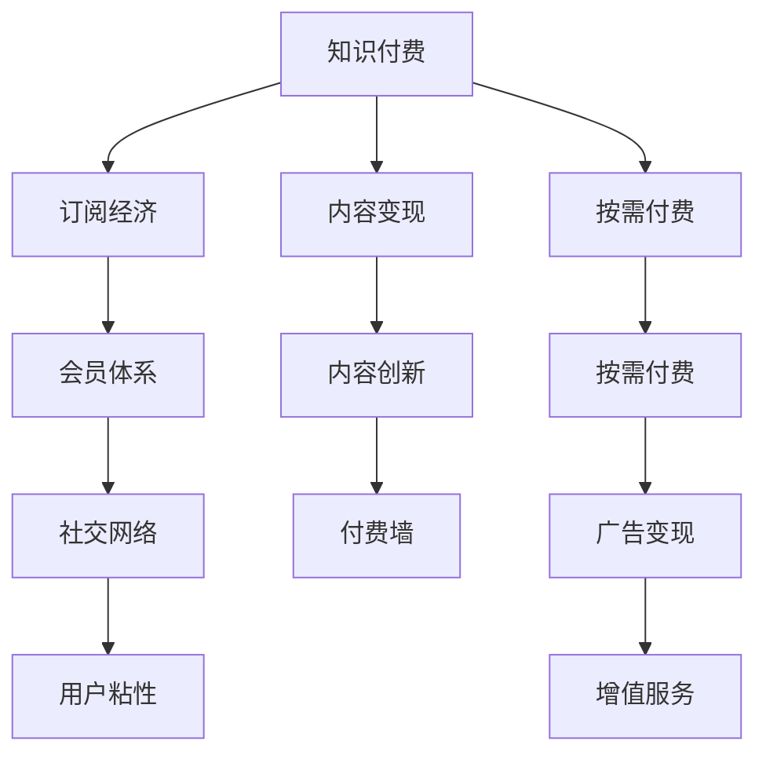

                 

# 知识付费的商业模式与盈利秘诀探究

> 关键词：知识付费, 盈利模式, 内容变现, 订阅经济, 按需付费, 会员体系, 社交网络, 用户粘性, 付费墙, 盈利模型优化, 内容创新

## 1. 背景介绍

### 1.1 问题由来
知识付费作为互联网经济的新型模式，近年来在教育、娱乐、科技等领域迅速崛起。知识付费的本质，是通过高质量的内容输出，满足用户的学习需求，并为其提供有价值的信息服务。随着信息过载和知识获取成本的上升，用户愿意为有价值的内容买单，知识付费市场迎来了快速发展的契机。

### 1.2 问题核心关键点
知识付费的核心在于如何构建可持续的商业模式，实现内容的有效变现。在商业化运作过程中，内容创作者、平台运营商、用户三方利益的平衡，成为亟待解决的问题。本文将深入探讨知识付费的商业模式与盈利秘诀，为相关从业者提供有价值的见解和建议。

## 2. 核心概念与联系

### 2.1 核心概念概述

在深入探讨知识付费的商业模式之前，首先需要明确几个核心概念：

- **知识付费**：指用户通过付费购买或订阅，获取高质量内容的经济行为。其关键在于内容的稀缺性和独特性，能满足用户的学习和娱乐需求。

- **盈利模式**：指平台或内容创作者通过售卖内容、广告、增值服务等实现收入的方式。盈利模式的设计直接决定知识付费市场的生存和发展。

- **内容变现**：指将知识、技能、经验等无形资产转化为有形收入的过程。内容变现的成功关键在于内容的价值感和用户获取的便捷性。

- **订阅经济**：基于订阅制的商业模式，用户定期支付费用，获得连续性的内容服务。其核心在于培养用户的粘性，提升用户的忠诚度。

- **按需付费**：用户按需购买单篇内容或单次服务，根据实际需求灵活选择，更符合用户的消费习惯。

- **会员体系**：通过构建会员制度，提供专属权益和优质服务，吸引用户成为付费会员。

- **社交网络**：知识付费平台往往具备社交属性，用户可以通过分享、讨论、评论等互动方式，增强社区感，提升平台的用户活跃度。

这些核心概念共同构成了知识付费的商业模式基础，为深入分析其盈利秘诀提供了理论支撑。

### 2.2 核心概念原理和架构的 Mermaid 流程图



这个流程图展示了知识付费商业模式的几个关键环节：

1. 平台提供知识服务，通过订阅经济和按需付费实现内容变现。
2. 构建会员体系，提供专属权益和优质服务，吸引用户成为付费会员。
3. 通过社交网络，增强用户粘性，提升平台活跃度。
4. 内容创新是持续吸引用户的关键，可通过内容质量、形式创新、个性化推荐等手段实现。
5. 搭建付费墙，保护优质内容，引导用户进行有价值的付费。
6. 通过广告和增值服务，实现平台的多元化收入来源。

## 3. 核心算法原理 & 具体操作步骤

### 3.1 算法原理概述

知识付费的盈利模型设计，本质上是将用户价值最大化和成本最小化的平衡。其核心在于通过科学的用户行为分析，实现精准推荐和个性化服务，提升用户满意度和忠诚度，从而带动内容的付费转化率。

### 3.2 算法步骤详解

构建知识付费盈利模型，通常需要以下关键步骤：

**Step 1: 用户需求分析**
- 通过问卷调查、用户行为数据分析，了解用户的学习需求、消费习惯和付费意愿。
- 细分用户群体，根据不同用户的需求设计有针对性的内容和服务。

**Step 2: 内容生产与选择**
- 引进优质内容创作者，提供创作激励和版权保护。
- 精选符合用户需求的内容，设计多样化的内容形式（如视频、音频、文字等），满足用户的不同学习方式。

**Step 3: 定价与营销策略**
- 基于内容价值、生产成本和市场定位，制定合理的定价策略。
- 通过优惠活动、免费试用等手段，吸引用户尝试付费内容。
- 利用社交媒体、搜索引擎等渠道进行精准营销，提升内容曝光率和用户转化率。

**Step 4: 会员体系设计**
- 设计会员等级制度，提供会员专属权益，如优先推荐、折扣优惠、内容更新等。
- 通过会员体系培养用户的长期粘性，提升平台忠诚度。

**Step 5: 用户行为分析与个性化推荐**
- 收集用户行为数据（如浏览历史、搜索记录、购买行为等），进行分析建模。
- 基于用户画像和行为特征，进行个性化内容推荐，提升用户满意度。

**Step 6: 数据驱动的持续优化**
- 利用A/B测试、用户反馈等方式，不断优化产品设计和用户体验。
- 通过数据监控和分析，及时发现问题，调整策略，提升平台的运营效率和盈利能力。

### 3.3 算法优缺点

知识付费的盈利模型具有以下优点：
1. 精准定位用户需求，提供定制化服务，提升用户粘性。
2. 通过会员体系和个性化推荐，实现持续的盈利增长。
3. 广告和增值服务的多元化收入来源，降低对内容变现的依赖。

同时，该模型也存在一定的局限性：
1. 内容质量和技术实现难度较高，需持续投入研发资源。
2. 用户数据隐私和安全问题需要严格管控，以避免法律风险。
3. 定价策略和营销手段需科学设计，避免过度依赖短期促销。
4. 平台需要具备较强的用户行为分析和预测能力，以确保个性化推荐的精准性。

尽管存在这些局限性，知识付费的盈利模型仍被广泛采用，并在实践中被不断优化和改进。

### 3.4 算法应用领域

知识付费的盈利模型在教育、出版、科技、娱乐等多个领域都有广泛应用：

- **教育培训**：如在线课程、学习社区等，提供高质量的教育资源，通过订阅和按需付费实现内容变现。
- **出版传媒**：如电子书、在线阅读、小说付费等，提供独家内容，吸引用户进行付费订阅。
- **科技研发**：如技术文章、编程课程、软件工具等，提供专业的技术支持，通过广告和增值服务实现盈利。
- **娱乐文化**：如音乐、电影、游戏等，提供优质的娱乐内容，通过会员体系和付费墙提升用户粘性。

## 4. 数学模型和公式 & 详细讲解

### 4.1 数学模型构建

知识付费的盈利模型构建，可以借助经济学的供需模型进行描述。假设知识付费平台的总用户数为 $U$，订阅用户数为 $S$，按需付费用户数为 $P$，单次订阅费用为 $A$，单次付费费用为 $B$，总内容价值为 $C$。则平台的总收益 $R$ 可以表示为：

$$
R = S \times A + P \times B
$$

其中 $A$ 和 $B$ 应根据市场和用户反馈进行调整，以保证用户粘性和满意度。

### 4.2 公式推导过程

为了简化问题，我们假设内容价值 $C$ 与用户群体规模 $U$ 成正比，即 $C = kU$，其中 $k$ 为比例系数。因此，平台的目标是最大化收益 $R$：

$$
R = (S + P) \times (A + B) - C
$$

通过求导可得最优解为：

$$
\frac{\partial R}{\partial S} = A - k \quad \text{和} \quad \frac{\partial R}{\partial P} = B - k
$$

当 $A > k$ 和 $B > k$ 时，最大化收益的条件为：

$$
S = \frac{A - k}{k} \quad \text{和} \quad P = \frac{B - k}{k}
$$

这表示，当订阅费用和单次付费费用均高于平台内容价值的平均水平时，平台可以获得最大的总收益。

### 4.3 案例分析与讲解

以Coursera平台为例，其在知识付费的盈利模型设计中取得了成功。Coursera采用订阅制和按需付费相结合的方式，提供大量的在线课程和专项训练，吸引了全球数百万用户。其订阅费用按月或年收取，单次付费课程的价格则较为灵活，根据课程难度和学习时长不同而异。Coursera还通过广告、合作项目、企业培训等多种方式，实现了多元化的收入来源。

通过合理设计定价策略和会员体系，Coursera在用户获取、内容生产、收入分配等方面取得了显著成效，成为知识付费市场的领军平台之一。

## 5. 项目实践：代码实例和详细解释说明

### 5.1 开发环境搭建

项目实践前，首先需要搭建开发环境。以下是基于Python和Flask的开发环境配置步骤：

1. 安装Python：从官网下载并安装Python 3.6及以上版本。

2. 安装Flask：通过pip安装Flask框架，代码如下：

   ```bash
   pip install flask
   ```

3. 安装SQLAlchemy：Flask常用的ORM框架，通过pip安装：

   ```bash
   pip install sqlalchemy
   ```

4. 安装Flask-RESTful：用于构建RESTful API的扩展，通过pip安装：

   ```bash
   pip install flask-restful
   ```

5. 安装Flask-SQLAlchemy：用于在Flask中集成SQLAlchemy，通过pip安装：

   ```bash
   pip install flask-sqlalchemy
   ```

6. 安装Flask-WTF：用于表单验证，通过pip安装：

   ```bash
   pip install flask-wtf
   ```

### 5.2 源代码详细实现

以下是一个简化的知识付费平台API示例，用于实现用户注册、订阅、支付和内容获取等功能。

```python
from flask import Flask, render_template, request
from flask_sqlalchemy import SQLAlchemy
from flask_wtf import FlaskForm
from wtforms import StringField, SubmitField
from wtforms.validators import DataRequired

app = Flask(__name__)
app.config['SQLALCHEMY_DATABASE_URI'] = 'sqlite:///users.db'
db = SQLAlchemy(app)

class User(db.Model):
    id = db.Column(db.Integer, primary_key=True)
    username = db.Column(db.String(80), unique=True, nullable=False)
    password = db.Column(db.String(120), nullable=False)
    email = db.Column(db.String(120), unique=True, nullable=False)
    subscription = db.Column(db.Boolean, default=False)

class UserForm(FlaskForm):
    username = StringField('Username', validators=[DataRequired()])
    password = StringField('Password', validators=[DataRequired()])
    email = StringField('Email', validators=[DataRequired()])
    submit = SubmitField('Submit')

@app.route('/')
def index():
    return render_template('index.html')

@app.route('/register', methods=['GET', 'POST'])
def register():
    form = UserForm(request.form)
    if form.validate_on_submit():
        user = User(username=form.username.data, password=form.password.data, email=form.email.data)
        db.session.add(user)
        db.session.commit()
        return redirect('/')
    return render_template('register.html', form=form)

@app.route('/subscribe', methods=['GET', 'POST'])
def subscribe():
    if request.method == 'POST':
        user = User.query.filter_by(username=request.form.get('username')).first()
        if user:
            user.subscription = True
            db.session.commit()
            return 'Subscription successful'
        else:
            return 'User not found'
    return render_template('subscribe.html')

@app.route('/get_content')
def get_content():
    user = User.query.filter_by(username=request.args.get('username')).first()
    if user:
        return f'Welcome, {user.username}! Here is your content.'
    else:
        return 'User not found'

if __name__ == '__main__':
    app.run(debug=True)
```

### 5.3 代码解读与分析

该示例代码实现了基本的用户注册、订阅和内容获取功能。

**User类**：
- 定义了用户表结构，包含用户名、密码、邮箱和订阅状态。

**UserForm类**：
- 定义了用户注册表单，包含用户名、密码和邮箱字段，通过Flask-WTF进行表单验证。

**register路由**：
- 实现用户注册功能，将用户信息存储到数据库中。

**subscribe路由**：
- 实现用户订阅功能，将用户标记为已订阅，并更新数据库。

**get_content路由**：
- 根据用户输入的用户名，从数据库中查询用户信息，返回欢迎信息和特定内容。

### 5.4 运行结果展示

通过运行上述代码，可以在本地启动Flask应用，访问浏览器中的http://127.0.0.1:5000/，看到注册页面。注册完成后，访问http://127.0.0.1:5000/subscribe，进行用户订阅，最后访问http://127.0.0.1:5000/get_content，获取特定用户的内容。

## 6. 实际应用场景

### 6.1 教育培训

知识付费在教育培训领域的应用最为广泛。Coursera、Udacity、edX等平台通过在线课程、专项训练、证书考试等方式，为用户提供高质量的教育资源。用户可以按月或按年订阅，享受持续的学习服务，并获得认证证书。

此外，知识付费还被应用于K-12教育、职业培训、技能提升等细分领域，满足了不同层次和需求的用户学习需求。

### 6.2 出版传媒

出版传媒领域也是知识付费的重要应用场景。电子书、在线阅读、小说付费等形式，吸引了大量用户进行付费订阅。如Kindle Unlimited、网易蜗牛阅读等平台，通过提供海量图书资源和优质内容，吸引了大量用户注册和使用。

### 6.3 科技研发

科技研发领域同样受益于知识付费模式的兴起。技术文章、编程课程、软件工具等资源，通过订阅或单次付费的方式，实现了快速传播和商业化。如Github、Stack Overflow等平台，通过提供高质量的编程资源和社区支持，实现了良好的商业效果。

### 6.4 娱乐文化

娱乐文化领域也是知识付费的重要应用领域。音乐、电影、游戏等娱乐内容，通过会员体系和付费墙，实现了内容的精准推荐和用户粘性提升。如Spotify、Netflix等平台，通过多样化的内容形式和个性化的推荐系统，获得了大量的付费用户和广告收入。

## 7. 工具和资源推荐

### 7.1 学习资源推荐

为了帮助开发者系统掌握知识付费的商业模式与盈利秘诀，这里推荐一些优质的学习资源：

1. 《知识付费：从0到1构建知识付费平台》系列博文：深入浅出地介绍了知识付费平台的构建原理和盈利模式。

2. Coursera《教育经济》课程：介绍教育经济的理论基础和实际应用，帮助理解知识付费的市场需求和发展趋势。

3. 《知识付费与内容变现》书籍：全面介绍了知识付费的内容策略、营销手段和盈利模型，是知识付费从业者的必读书籍。

4. Udacity《知识付费商业模式》课程：探讨知识付费商业模式的本质和创新点，提供实用的商业策略和案例分析。

5. EdX《知识付费市场分析》课程：通过数据分析和案例研究，帮助理解知识付费市场的发展规律和用户行为。

通过对这些资源的学习实践，相信你一定能够快速掌握知识付费的商业模式与盈利秘诀，并用于解决实际的商业问题。

### 7.2 开发工具推荐

高效的工具支持是知识付费项目开发的关键。以下是几款常用的开发工具：

1. Jupyter Notebook：强大的交互式开发环境，支持Python、R等多种语言，便于数据分析和实验。

2. Postman：流行的API测试工具，支持HTTP请求、断言和自动化测试，方便API接口的开发和测试。

3. GitLab：集成了代码托管、CI/CD、项目管理等功能，支持多人协作开发，是知识付费平台开发的首选工具。

4. MongoDB：高性能的文档型数据库，适合存储复杂结构化的用户数据和内容元数据。

5. Docker：容器化部署平台，便于知识付费平台的打包和发布，支持多环境部署和扩展。

合理利用这些工具，可以显著提升知识付费项目的开发效率，加快创新迭代的步伐。

### 7.3 相关论文推荐

知识付费的研究方向涉及到多个领域，包括经济学、社会学、心理学等。以下是几篇奠基性的相关论文，推荐阅读：

1. B. Wattenberg 和 C. R. Eckles《知识付费：教育市场的革命》：探讨了知识付费在教育市场中的作用和影响。

2. E. Carlini《知识付费的经济学分析》：通过经济学原理，分析了知识付费的供需关系和市场效率。

3. K. N. Lewis《知识付费的心理学分析》：从心理学角度，探讨了用户进行知识付费的心理动机和行为模式。

4. C. V. Völker《知识付费的社会学分析》：分析了知识付费在社会文化中的角色和影响，探讨了其对知识传播和公共利益的影响。

这些论文代表了大规模知识付费市场的研究脉络，为深入理解知识付费提供了理论支撑。

## 8. 总结：未来发展趋势与挑战

### 8.1 总结

本文对知识付费的商业模式与盈利秘诀进行了全面系统的介绍。首先阐述了知识付费的背景和重要性，明确了其核心在于通过高质量的内容输出，满足用户的学习需求，并为其提供有价值的信息服务。其次，从原理到实践，详细讲解了知识付费的数学模型和操作步骤，给出了平台开发和运营的完整代码实现。同时，本文还广泛探讨了知识付费在教育、出版、科技、娱乐等多个领域的应用前景，展示了知识付费市场的广阔发展空间。最后，本文精选了知识付费的技术资源和研究论文，力求为读者提供全方位的技术指引。

通过本文的系统梳理，可以看到，知识付费作为互联网经济的新型模式，不仅满足了用户对高质量内容的需求，还为平台和内容创作者提供了丰富的盈利渠道。未来，伴随技术的不断进步和市场的进一步成熟，知识付费将迎来更多创新和突破，为知识传播和智能交互系统的进步注入新的动力。

### 8.2 未来发展趋势

展望未来，知识付费领域将呈现以下几个发展趋势：

1. **个性化推荐系统的优化**：随着用户数据的不断积累，个性化推荐系统的精确性和智能化程度将进一步提升，为内容分发提供更精准的解决方案。

2. **多模态内容的融合**：文本、视频、音频、图像等多模态内容的融合，将丰富知识付费的内容形式，提升用户体验和粘性。

3. **AI驱动的内容创作**：利用AI技术生成高质量内容，如自动生成文章、视频讲解等，降低内容创作的成本和难度，提升内容的生产和传播效率。

4. **数据隐私和安全的提升**：随着用户隐私意识的增强，平台需加强数据隐私保护，提升用户信任度，构建安全可靠的知识付费环境。

5. **跨境知识付费的拓展**：随着全球化的加速，知识付费市场将拓展至更多国家和地区，提升全球知识传播的覆盖面和影响力。

6. **社交网络和社区的构建**：通过社区建设和用户互动，提升平台粘性和用户活跃度，构建知识分享和学习的生态系统。

### 8.3 面临的挑战

尽管知识付费市场前景广阔，但其发展过程中仍面临诸多挑战：

1. **内容质量与版权问题**：高质量内容的制作和版权保护成本较高，需持续投入资源进行内容生产和维护。

2. **用户粘性和流失问题**：用户获取和保留成本高，需要精准的用户行为分析和营销策略，防止用户流失。

3. **定价策略和市场竞争**：市场竞争激烈，需科学制定定价策略，避免过度依赖价格战。

4. **数据隐私和安全风险**：用户数据隐私和安全问题需严格管控，防止数据泄露和滥用。

5. **用户体验和反馈机制**：需持续优化用户体验，建立有效的用户反馈机制，及时发现和解决问题。

6. **全球化和本地化挑战**：知识付费平台的全球化扩展需考虑文化差异和本地化需求，提升平台的用户适应性和满意度。

这些挑战将直接影响知识付费市场的健康发展和盈利能力的提升，亟需从业者共同努力，不断创新和优化。

### 8.4 研究展望

面对知识付费领域的发展趋势和挑战，未来的研究需要在以下几个方面寻求新的突破：

1. **用户行为和偏好的深入研究**：通过大数据分析和机器学习技术，深入理解用户行为和需求，提升个性化推荐系统的准确性和智能化水平。

2. **内容生成技术的创新**：探索基于AI的内容生成技术，如自然语言处理、图像生成、音乐创作等，降低内容创作难度，提升内容传播效率。

3. **知识图谱的构建和应用**：通过知识图谱技术，将零散的知识进行系统化和结构化，提升内容搜索和知识关联的效率和精度。

4. **社交网络和社区的深化**：构建更加活跃和稳定的知识社区，通过用户互动和知识分享，提升平台粘性和用户满意度。

5. **数据隐私和安全技术的研究**：开发高效的数据隐私保护和加密技术，保障用户数据的安全性，提升平台信任度。

6. **全球化和本地化策略的优化**：结合不同国家和地区的文化差异和市场特点，制定适应性强的全球化和本地化策略，提升平台的国际竞争力。

这些研究方向的探索，必将引领知识付费市场的创新和突破，为知识传播和智能交互系统的进步注入新的动力。

## 9. 附录：常见问题与解答

**Q1: 知识付费的盈利模式主要有哪些？**

A: 知识付费的盈利模式主要包括订阅经济和按需付费两种。订阅模式是指用户按月或按年支付固定费用，获取持续的内容服务；按需付费模式则是指用户根据实际需求，按次支付单篇内容或单次服务的费用。

**Q2: 知识付费平台如何设计定价策略？**

A: 知识付费平台的定价策略需综合考虑内容价值、制作成本、市场竞争等因素。一般建议采用动态定价策略，根据市场需求和用户反馈进行调整，以实现盈利最大化。

**Q3: 知识付费平台如何提升用户粘性？**

A: 知识付费平台提升用户粘性的关键在于提供高质量的内容和服务，建立会员制度，提供专属权益和优质服务，通过个性化推荐和社区建设，增强用户互动和社区感。

**Q4: 知识付费平台如何应对数据隐私和安全问题？**

A: 知识付费平台需严格保护用户数据隐私和安全，采用数据加密、匿名化、访问控制等技术手段，防止数据泄露和滥用。建立完善的用户隐私政策和投诉机制，保障用户权益。

**Q5: 知识付费平台如何实现全球化和本地化？**

A: 知识付费平台实现全球化和本地化，需充分考虑不同国家和地区的文化差异、市场特点和政策法规，制定适应性强的本地化策略，提供本地化的内容和客服支持，提升平台的国际竞争力。

通过解答这些问题，相信读者对知识付费的商业模式与盈利秘诀有了更深入的了解，能够更好地应用于实际项目开发和运营。

---

作者：禅与计算机程序设计艺术 / Zen and the Art of Computer Programming

