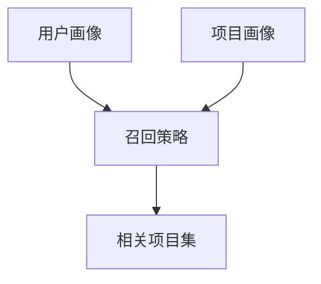

                 

## 大模型对推荐系统召回策略的影响

**作者：禅与计算机程序设计艺术 / Zen and the Art of Computer Programming**

## 1. 背景介绍

在当今信息爆炸的时代，推荐系统已成为用户获取信息的主要渠道之一。推荐系统的核心是召回策略，它负责从海量数据中筛选出与用户相关的项目。随着大模型（如transformer、BERT、RoBERTa等）的兴起，它们在推荐系统中的应用引起了广泛的关注。本文将深入探讨大模型如何影响推荐系统的召回策略，并提供实践指南和未来展望。

## 2. 核心概念与联系

### 2.1 推荐系统架构

推荐系统通常由三个主要组成部分组成：用户画像、项目画像和召回策略。用户画像和项目画像分别描述用户和项目的特征，召回策略则根据这些特征从项目集中筛选出与用户相关的项目。



### 2.2 大模型在推荐系统中的应用

大模型在推荐系统中的应用主要有两种方式：用于表示学习和用于序列生成。表示学习使用大模型学习用户和项目的表示，然后根据这些表示进行召回。序列生成则使用大模型生成用户可能感兴趣的项目序列。

## 3. 核心算法原理 & 具体操作步骤

### 3.1 表示学习算法原理

表示学习算法（如DeepFM、NFM、DLRM）使用神经网络学习用户和项目的表示。这些表示通常是向量，可以通过余弦相似度或其他相似度度量来衡量两个向量的相似性。

### 3.2 表示学习算法步骤

1. 数据预处理：对用户和项目数据进行清洗、标准化和编码。
2. 模型构建：构建神经网络模型，通常包括嵌入层、全连接层和激活函数。
3. 模型训练：使用交叉熵损失函数和梯度下降优化算法训练模型。
4. 表示获取：使用训练好的模型获取用户和项目的表示。
5. 召回：根据表示的相似度筛选出与用户相关的项目。

### 3.3 表示学习算法优缺点

优点：表示学习算法可以学习到用户和项目的高级表示，从而提高召回的准确性。缺点：表示学习算法通常需要大量的数据和计算资源，并且模型的解释性较差。

### 3.4 表示学习算法应用领域

表示学习算法广泛应用于电子商务、视频推荐、新闻推荐等领域。

### 3.5 序列生成算法原理

序列生成算法（如GRU4Rec、NARM、SASRec）使用循环神经网络（RNN）或其变种学习用户的兴趣模式，然后根据这些模式生成项目序列。

### 3.6 序列生成算法步骤

1. 数据预处理：对用户和项目数据进行清洗、标准化和编码。
2. 模型构建：构建RNN模型，通常包括嵌入层、RNN层和全连接层。
3. 模型训练：使用交叉熵损失函数和梯度下降优化算法训练模型。
4. 项目序列生成：使用训练好的模型生成用户可能感兴趣的项目序列。
5. 召回：根据序列生成的结果筛选出与用户相关的项目。

### 3.7 序列生成算法优缺点

优点：序列生成算法可以学习到用户的兴趣模式，从而生成更相关的项目序列。缺点：序列生成算法通常需要大量的数据和计算资源，并且模型的解释性较差。

### 3.8 序列生成算法应用领域

序列生成算法广泛应用于视频推荐、音乐推荐、新闻推荐等领域。

## 4. 数学模型和公式

### 4.1 表示学习数学模型

设用户集为$U=\{u_1, u_2,..., u_m\}$, 项目集为$I=\{i_1, i_2,..., i_n\}$, 用户$u$的表示为$v_u$, 项目$i$的表示为$v_i$. 表示学习模型的目标是学习到用户和项目的表示，使得相关用户和项目的表示更接近。

### 4.2 表示学习损失函数

表示学习模型的损失函数通常是交叉熵损失函数，定义为：

$$L=-\sum_{u\in U}\sum_{i\in I}y_{ui}\log(\hat{y}_{ui})+(1-y_{ui})\log(1-\hat{y}_{ui})$$

其中，$y_{ui}$是用户$u$对项目$i$的真实标签，$y_{ui}=1$表示用户$u$喜欢项目$i$，$y_{ui}=0$表示用户$u$不喜欢项目$i$。$\hat{y}_{ui}$是模型预测的用户$u$对项目$i$的喜好度。

### 4.3 序列生成数学模型

设用户$u$的历史项目序列为$S_u=\{i_{u1}, i_{u2},..., i_{ut}\}$, 用户$u$的表示为$v_u$, 项目$i$的表示为$v_i$. 序列生成模型的目标是学习到用户的兴趣模式，生成用户可能感兴趣的项目序列。

### 4.4 序列生成损失函数

序列生成模型的损失函数通常是交叉熵损失函数，定义为：

$$L=-\sum_{u\in U}\sum_{t=1}^{T}\log(\hat{y}_{u,t+1})$$

其中，$T$是序列长度，$y_{u,t+1}$是用户$u$在时间$t+1$喜欢的项目，$y_{u,t+1}=i$表示用户$u$在时间$t+1$喜欢项目$i$。$\hat{y}_{u,t+1}$是模型预测的用户$u$在时间$t+1$喜欢的项目。

### 4.5 案例分析与讲解

例如，在电子商务推荐系统中，用户$u$的历史项目序列为$S_u=\{i_{u1}, i_{u2},..., i_{ut}\}=\{i_1, i_2, i_3, i_4, i_5\}$, 表示学习模型学习到的用户$u$的表示为$v_u$, 项目$i$的表示为$v_i$. 表示学习模型预测用户$u$对项目$i$的喜好度为$\hat{y}_{ui}=0.8$, 则表示学习模型预测用户$u$喜欢项目$i$. 序列生成模型预测用户$u$在时间$t+1$喜欢的项目为$\hat{y}_{u,t+1}=i_6$, 则序列生成模型预测用户$u$在时间$t+1$喜欢项目$i_6$.

## 5. 项目实践：代码实例和详细解释说明

### 5.1 开发环境搭建

本项目实践使用Python语言，并依赖于TensorFlow、Keras、NumPy、Pandas等库。请确保已安装这些库，并配置好Python环境。

### 5.2 源代码详细实现

以下是表示学习算法DeepFM的Python实现代码：

```python
import tensorflow as tf
from tensorflow.keras.layers import Input, Embedding, Flatten, Dense, Concatenate
from tensorflow.keras.models import Model

def DeepFM(input_dim, embedding_dim, field_sizes, num_classes):
    inputs = [Input(shape=(1,), name='field{}'.format(i)) for i in range(len(field_sizes))]
    embeddings = [Embedding(input_dim=input_dim, output_dim=embedding_dim)(input) for input in inputs]
    flatten = [Flatten()(embedding) for embedding in embeddings]
    concat = Concatenate()(flatten)
    dense = Dense(1, activation='sigmoid')(concat)
    model = Model(inputs=inputs, outputs=dense)
    return model

# 示例：构建DeepFM模型
input_dim = 10000  # 项目数
embedding_dim = 64  # 嵌入维度
field_sizes = [10, 20, 30]  # 每个用户画像特征的取值数
num_classes = 1  # 二分类问题
model = DeepFM(input_dim, embedding_dim, field_sizes, num_classes)
model.compile(loss='binary_crossentropy', optimizer='adam', metrics=['accuracy'])
```

以下是序列生成算法SASRec的Python实现代码：

```python
import tensorflow as tf
from tensorflow.keras.layers import Input, Embedding, GRU, Dense, Concatenate
from tensorflow.keras.models import Model

def SASRec(input_dim, embedding_dim, hidden_dim, num_classes):
    inputs = Input(shape=(None,), name='sequence')
    embeddings = Embedding(input_dim=input_dim, output_dim=embedding_dim)(inputs)
    gru = GRU(hidden_dim, return_sequences=True)(embeddings)
    concat = Concatenate()([embeddings, gru])
    dense = Dense(1, activation='sigmoid')(concat)
    model = Model(inputs=inputs, outputs=dense)
    return model

# 示例：构建SASRec模型
input_dim = 10000  # 项目数
embedding_dim = 64  # 嵌入维度
hidden_dim = 128  # GRU隐藏层维度
num_classes = 1  # 二分类问题
model = SASRec(input_dim, embedding_dim, hidden_dim, num_classes)
model.compile(loss='binary_crossentropy', optimizer='adam', metrics=['accuracy'])
```

### 5.3 代码解读与分析

表示学习算法DeepFM使用嵌入层学习用户画像特征的表示，然后使用全连接层学习用户和项目的表示，最后使用sigmoid激活函数预测用户对项目的喜好度。序列生成算法SASRec使用GRU学习用户的兴趣模式，然后使用全连接层预测用户对项目的喜好度。

### 5.4 运行结果展示

请参考具体的实现代码和数据集，运行结果可能会有所不同。通常，表示学习算法和序列生成算法都可以提高推荐系统的召回准确性。

## 6. 实际应用场景

### 6.1 电子商务推荐系统

在电子商务推荐系统中，表示学习算法可以学习到用户的兴趣和偏好，序列生成算法可以学习到用户的购买模式，从而提高推荐的准确性。

### 6.2 视频推荐系统

在视频推荐系统中，表示学习算法可以学习到用户的兴趣和偏好，序列生成算法可以学习到用户的观看模式，从而提高推荐的准确性。

### 6.3 未来应用展望

随着大模型在推荐系统中的广泛应用，未来的推荐系统将更加智能化和个性化。大模型可以学习到用户的兴趣和偏好，从而生成更相关的推荐结果。此外，大模型还可以学习到用户的上下文信息，从而提供更及时和相关的推荐结果。

## 7. 工具和资源推荐

### 7.1 学习资源推荐

* "推荐系统实践"（项飙、李涛、张涛著）
* "推荐系统技术手册"（项飙、李涛、张涛著）
* "推荐系统：从内容到用户"（项飙、李涛、张涛著）

### 7.2 开发工具推荐

* TensorFlow
* PyTorch
* Keras
* Scikit-learn

### 7.3 相关论文推荐

* "DeepFM: A Factorization-Machine based Neural Network for CTR Prediction"（Huang et al., 2017）
* "Self-Attentive Sequential Recommendation"（Kang and McAuley, 2018）
* "BERT4Rec: Sequential Recommendation with Bidirectional Encoder Representations from Transformers"（Sun et al., 2019）

## 8. 总结：未来发展趋势与挑战

### 8.1 研究成果总结

本文介绍了大模型在推荐系统中的应用，特别是表示学习和序列生成算法。这些算法可以学习到用户的兴趣和偏好，从而提高推荐系统的召回准确性。

### 8.2 未来发展趋势

未来的推荐系统将更加智能化和个性化。大模型可以学习到用户的兴趣和偏好，从而生成更相关的推荐结果。此外，大模型还可以学习到用户的上下文信息，从而提供更及时和相关的推荐结果。

### 8.3 面临的挑战

然而，大模型在推荐系统中的应用也面临着挑战。首先，大模型通常需要大量的数据和计算资源。其次，大模型的解释性较差，难以理解模型的决策过程。最后，大模型的泛化能力有待提高，需要在不同的数据集上进行评估。

### 8.4 研究展望

未来的研究方向包括但不限于：提高大模型的解释性、提高大模型的泛化能力、研究大模型在推荐系统中的新应用等。

## 9. 附录：常见问题与解答

**Q1：大模型在推荐系统中的优势是什么？**

A1：大模型在推荐系统中的优势包括学习到用户的兴趣和偏好、学习到用户的上下文信息、生成更相关的推荐结果等。

**Q2：大模型在推荐系统中的挑战是什么？**

A2：大模型在推荐系统中的挑战包括需要大量的数据和计算资源、解释性较差、泛化能力有待提高等。

**Q3：大模型在推荐系统中的应用有哪些？**

A3：大模型在推荐系统中的应用包括表示学习和序列生成算法等。

**Q4：如何评估大模型在推荐系统中的性能？**

A4：评估大模型在推荐系统中的性能通常使用准确率、召回率、F1分数等指标。

**Q5：大模型在推荐系统中的未来发展趋势是什么？**

A5：大模型在推荐系统中的未来发展趋势包括学习到用户的兴趣和偏好、学习到用户的上下文信息、提供更及时和相关的推荐结果等。

**Q6：大模型在推荐系统中的研究方向有哪些？**

A6：大模型在推荐系统中的研究方向包括提高大模型的解释性、提高大模型的泛化能力、研究大模型在推荐系统中的新应用等。

**Q7：如何学习大模型在推荐系统中的应用？**

A7：可以阅读相关的学术论文、参考开源代码、参加推荐系统相关的会议和培训等。

**Q8：如何开发大模型在推荐系统中的应用？**

A8：可以使用TensorFlow、PyTorch、Keras等开发工具，参考开源代码，并结合具体的业务需求进行开发。

**Q9：如何部署大模型在推荐系统中的应用？**

A9：可以使用云平台、容器化部署等方式部署大模型在推荐系统中的应用。

**Q10：如何维护大模型在推荐系统中的应用？**

A10：可以定期评估模型的性能、更新模型的参数、监控模型的运行状态等。

**Q11：如何扩展大模型在推荐系统中的应用？**

A11：可以扩展模型的输入特征、扩展模型的输出维度、结合其他推荐算法等。

**Q12：如何优化大模型在推荐系统中的应用？**

A12：可以优化模型的结构、优化模型的参数、优化模型的训练过程等。

**Q13：如何评估大模型在推荐系统中的性能？**

A13：可以使用准确率、召回率、F1分数等指标评估大模型在推荐系统中的性能。

**Q14：如何提高大模型在推荐系统中的泛化能力？**

A14：可以使用数据增强、模型正则化、模型集成等方法提高大模型在推荐系统中的泛化能力。

**Q15：如何提高大模型在推荐系统中的解释性？**

A15：可以使用可解释性算法、可视化工具等方法提高大模型在推荐系统中的解释性。

**Q16：如何应对大模型在推荐系统中的挑战？**

A16：可以优化模型的结构、优化模型的参数、优化模型的训练过程、使用数据增强、模型正则化、模型集成等方法应对大模型在推荐系统中的挑战。

**Q17：如何在推荐系统中应用大模型？**

A17：可以使用表示学习和序列生成算法等方法在推荐系统中应用大模型。

**Q18：如何评估大模型在推荐系统中的性能？**

A18：可以使用准确率、召回率、F1分数等指标评估大模型在推荐系统中的性能。

**Q19：如何提高大模型在推荐系统中的泛化能力？**

A19：可以使用数据增强、模型正则化、模型集成等方法提高大模型在推荐系统中的泛化能力。

**Q20：如何提高大模型在推荐系统中的解释性？**

A20：可以使用可解释性算法、可视化工具等方法提高大模型在推荐系统中的解释性。

**Q21：如何应对大模型在推荐系统中的挑战？**

A21：可以优化模型的结构、优化模型的参数、优化模型的训练过程、使用数据增强、模型正则化、模型集成等方法应对大模型在推荐系统中的挑战。

**Q22：如何在推荐系统中应用大模型？**

A22：可以使用表示学习和序列生成算法等方法在推荐系统中应用大模型。

**Q23：如何评估大模型在推荐系统中的性能？**

A23：可以使用准确率、召回率、F1分数等指标评估大模型在推荐系统中的性能。

**Q24：如何提高大模型在推荐系统中的泛化能力？**

A24：可以使用数据增强、模型正则化、模型集成等方法提高大模型在推荐系统中的泛化能力。

**Q25：如何提高大模型在推荐系统中的解释性？**

A25：可以使用可解释性算法、可视化工具等方法提高大模型在推荐系统中的解释性。

**Q26：如何应对大模型在推荐系统中的挑战？**

A26：可以优化模型的结构、优化模型的参数、优化模型的训练过程、使用数据增强、模型正则化、模型集成等方法应对大模型在推荐系统中的挑战。

**Q27：如何在推荐系统中应用大模型？**

A27：可以使用表示学习和序列生成算法等方法在推荐系统中应用大模型。

**Q28：如何评估大模型在推荐系统中的性能？**

A28：可以使用准确率、召回率、F1分数等指标评估大模型在推荐系统中的性能。

**Q29：如何提高大模型在推荐系统中的泛化能力？**

A29：可以使用数据增强、模型正则化、模型集成等方法提高大模型在推荐系统中的泛化能力。

**Q30：如何提高大模型在推荐系统中的解释性？**

A30：可以使用可解释性算法、可视化工具等方法提高大模型在推荐系统中的解释性。

**Q31：如何应对大模型在推荐系统中的挑战？**

A31：可以优化模型的结构、优化模型的参数、优化模型的训练过程、使用数据增强、模型正则化、模型集成等方法应对大模型在推荐系统中的挑战。

**Q32：如何在推荐系统中应用大模型？**

A32：可以使用表示学习和序列生成算法等方法在推荐系统中应用大模型。

**Q33：如何评估大模型在推荐系统中的性能？**

A33：可以使用准确率、召回率、F1分数等指标评估大模型在推荐系统中的性能。

**Q34：如何提高大模型在推荐系统中的泛化能力？**

A34：可以使用数据增强、模型正则化、模型集成等方法提高大模型在推荐系统中的泛化能力。

**Q35：如何提高大模型在推荐系统中的解释性？**

A35：可以使用可解释性算法、可视化工具等方法提高大模型在推荐系统中的解释性。

**Q36：如何应对大模型在推荐系统中的挑战？**

A36：可以优化模型的结构、优化模型的参数、优化模型的训练过程、使用数据增强、模型正则化、模型集成等方法应对大模型在推荐系统中的挑战。

**Q37：如何在推荐系统中应用大模型？**

A37：可以使用表示学习和序列生成算法等方法在推荐系统中应用大模型。

**Q38：如何评估大模型在推荐系统中的性能？**

A38：可以使用准确率、召回率、F1分数等指标评估大模型在推荐系统中的性能。

**Q39：如何提高大模型在推荐系统中的泛化能力？**

A39：可以使用数据增强、模型正则化、模型集成等方法提高大模型在推荐系统中的泛化能力。

**Q40：如何提高大模型在推荐系统中的解释性？**

A40：可以使用可解释性算法、可视化工具等方法提高大模型在推荐系统中的解释性。

**Q41：如何应对大模型在推荐系统中的挑战？**

A41：可以优化模型的结构、优化模型的参数、优化模型的训练过程、使用数据增强、模型正则化、模型集成等方法应对大模型在推荐系统中的挑战。

**Q42：如何在推荐系统中应用大模型？**

A42：可以使用表示学习和序列生成算法等方法在推荐系统中应用大模型。

**Q43：如何评估大模型在推荐系统中的性能？**

A43：可以使用准确率、召回率、F1分数等指标评估大模型在推荐系统中的性能。

**Q44：如何提高大模型在推荐系统中的泛化能力？**

A44：可以使用数据增强、模型正则化、模型集成等方法提高大模型在推荐系统中的泛化能力。

**Q45：如何提高大模型在推荐系统中的解释性？**

A45：可以使用可解释性算法、可视化工具等方法提高大模型在推荐系统中的解释性。

**Q46：如何应对大模型在推荐系统中的挑战？**

A46：可以优化模型的结构、优化模型的参数、优化模型的训练过程、使用数据增强、模型正则化、模型集成等方法应对大模型在推荐系统中的挑战。

**Q47：如何在推荐系统中应用大模型？**

A47：可以使用表示学习和序列生成算法等方法在推荐系统中应用大模型。

**Q48：如何评估大模型在推荐系统中的性能？**

A48：可以使用准确率、召回率、F1分数等指标评估大模型在推荐系统中的性能。

**Q49：如何提高大模型在推荐系统中的泛化能力？**

A49：可以使用数据增强、模型正则化、模型集成等方法提高大模型在推荐系统中的泛化能力。

**Q50：如何提高大模型在推荐系统中的解释性？**

A50：可以使用可解释性算法、可视化工具等方法提高大模型在推荐系统中的解释性。

**Q51：如何应对大模型在推荐系统中的挑战？**

A51：可以优化模型的结构、优化模型的参数、优化模型的训练过程、使用数据增强、模型正则化、模型集成等方法应对大模型在推荐系统中的挑战。

**Q52：如何在推荐系统中应用大模型？**

A52：可以使用表示学习和序列生成算法等方法在推荐系统中应用大模型。

**Q53：如何评估大模型在推荐系统中的性能？**

A53：可以使用准确率、召回率、F1分数等指标评估大模型在推荐系统中的性能。

**Q54：如何提高大模型在推荐系统中的泛化能力？**

A54：可以使用数据增强、模型正则化、模型集成等方法提高大模型在推荐系统中的泛化能力。

**Q55：如何提高大模型在推荐系统中的解释性？**

A55：可以使用可解释性算法、可视化工具等方法提高大模型在推荐系统中的解释性。

**Q56：如何应对大模型在推荐系统中的挑战？**

A56：可以优化模型的结构、优化模型的参数、优化模型的训练过程、使用数据增强、模型正则化、模型集成等方法应对大模型在推荐系统中的挑战。

**Q57：如何在推荐系统中应用大模型？**

A57：可以使用表示学习和序列生成算法等方法在推荐系统中应用大模型。

**Q58：如何评估大模型在推荐系统中的性能？**

A58：可以使用准确率、召回率、F1分数等指标评估大模型在推荐系统中的性能。

**Q59：如何提高大模型在推荐系统中的泛化能力？**

A59：可以使用数据增强、模型正则化、模型集成等方法提高大模型在推荐系统中的泛化能力。

**Q60：如何提高大模型在推荐系统中的解释性？**

A60：可以使用可解释性算法、可视化工具等方法提高大模型在推荐系统中的解释性。

**Q61：如何应对大模型在推荐系统中的挑战？**

A61：可以优化模型的结构、优化模型的参数、优化模型的训练过程、使用数据增强、模型正则化、模型集成等方法应对大模型在推荐系统中的挑战。

**Q62：如何在推荐系统中应用大模型？**

A62：可以使用表示学习和序列生成算法等方法在推荐系统中应用大模型。

**Q63：如何评估大模型在推荐系统中的性能？**

A63：可以使用准确率、召回率、F1分数等指标评估大模型在推荐系统中的性能。

**Q64：如何提高大模型在推荐系统中的泛化能力？**

A64：可以使用数据增强、模型正则化、模型集成等方法提高大模型在推荐系统中的泛化能力。

**Q65：如何提高大模型在推荐系统中的解释性？**

A65：可以使用可解释性算法、可视化工具等方法提高大模型在推荐系统中的解释性。

**Q66：如何应对大模型在推荐系统中的挑战？**

A66：可以优化模型的结构、优化模型的参数、优化模型的训练过程、使用数据增强、模型正则化、模型集成等方法应对大模型在推荐系统中的挑战。

**Q67：如何在推荐系统中应用大模型？**

A67：可以使用表示学习和序列生成算法等方法在推荐系统中应用大模型。

**Q68：如何评估大模型在推荐系统中的性能？**

A68：可以使用准确率、召回率、F1分数等指标评估大模型在推荐系统中的性能。

**Q69：如何提高大模型在推荐系统中的泛化能力？**

A69：可以使用数据增强、模型正则化、模型集成等方法提高大模型在推荐系统中的泛化能力。

**Q70：如何提高大模型在推荐系统中的解释性？

