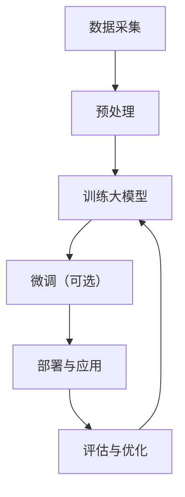

                 

**大模型对知识付费行业的影响**

**作者：禅与计算机程序设计艺术 / Zen and the Art of Computer Programming**

## 1. 背景介绍

在信息爆炸的数字时代，知识付费行业应运而生，为用户提供了获取有价值信息的新渠道。然而，随着大模型的崛起，这个行业正面临着巨大的变革。本文将深入探讨大模型对知识付费行业的影响，分析其核心概念、算法原理，并提供项目实践和工具推荐。

## 2. 核心概念与联系

### 2.1 大模型的定义

大模型（Large Language Models，LLMs）是一种通过处理大量文本数据训练而来的语言模型，具有强大的理解、生成和推理能力。它们的核心是Transformer架构，使用自注意力机制（Self-Attention）和Transformer编码器/解码器结构。

### 2.2 大模型与知识付费行业的联系

大模型可以生成人类可读的文本，这使得它们可以创建各种形式的内容，从新闻报道到学术论文。在知识付费行业，大模型可以用于生成高质量的内容，为用户提供有价值的信息。此外，大模型还可以帮助用户更好地理解和消化复杂的信息，从而提高知识付费产品的价值。

### 2.3 核心概念原理与架构的 Mermaid 流程图



## 3. 核心算法原理 & 具体操作步骤

### 3.1 算法原理概述

大模型的核心是Transformer架构，其关键组件是自注意力机制。自注意力机制允许模型在处理输入序列时考虑其上下文，从而更好地理解和生成文本。

### 3.2 算法步骤详解

1. **数据采集**：收集大量的文本数据，如书籍、新闻文章、维基百科等。
2. **预处理**：清洗、标记和分词数据，并将其转换为模型可以处理的格式。
3. **训练大模型**：使用预处理后的数据训练Transformer模型，优化其参数以最小化预测误差。
4. **微调（可选）**：在特定领域或任务上进一步训练模型，以提高其性能。
5. **部署与应用**：将训练好的模型部署到生产环境，并开发应用程序以利用其能力。
6. **评估与优化**：评估模型的性能，并根据需要进行优化。

### 3.3 算法优缺点

**优点**：大模型可以理解和生成人类语言，具有强大的推理和理解能力。它们可以处理大量数据，并从中学习复杂的模式。

**缺点**：大模型需要大量的计算资源和数据，训练和部署成本高。它们也可能受到数据偏见和过度拟合的影响。

### 3.4 算法应用领域

大模型在各种领域都有应用，包括自然语言处理（NLP）、机器翻译、搜索引擎、内容生成和知识图谱构建等。在知识付费行业，它们可以用于生成高质量的内容，帮助用户更好地理解复杂信息，并提供个性化的学习体验。

## 4. 数学模型和公式 & 详细讲解 & 举例说明

### 4.1 数学模型构建

大模型的数学模型基于Transformer架构。给定输入序列$x=(x_1, x_2,..., x_n)$，模型的目标是预测下一个单词$y$。模型的输出是一个分布$P(y|x)$，表示每个可能单词被选中的概率。

### 4.2 公式推导过程

Transformer模型使用自注意力机制和位置编码来处理输入序列。自注意力机制的公式如下：

$$Attention(Q, K, V) = softmax\left(\frac{QK^T}{\sqrt{d_k}}\right)V$$

其中，$Q$, $K$, $V$分别是查询、键和值矩阵，分别来自输入序列的不同表示。$d_k$是键矩阵的维度。

位置编码的公式如下：

$$PE_{(pos, 2i)} = \sin\left(\frac{pos}{10000^{2i/d_{model}}}\right)$$
$$PE_{(pos, 2i+1)} = \cos\left(\frac{pos}{10000^{2i/d_{model}}}\right)$$

其中，$pos$是位置，$i$是维度，$d_{model}$是模型的维度。

### 4.3 案例分析与讲解

假设我们想使用大模型生成一篇关于人工智能历史的文章。我们首先需要收集相关数据，如学术论文、新闻报道和维基百科条目。然后，我们预处理数据，训练大模型，并微调其参数以提高其在人工智能领域的性能。最后，我们使用模型生成文章，并对其进行编辑和润色。

## 5. 项目实践：代码实例和详细解释说明

### 5.1 开发环境搭建

要训练大模型，我们需要一个强大的GPU集群和适当的软件环境。我们推荐使用Python和PyTorch或TensorFlow框架。我们还需要安装-transformers库，它提供了预训练的大模型和训练/推理代码。

### 5.2 源代码详细实现

以下是使用-transformers库训练大模型的示例代码：

```python
from transformers import AutoTokenizer, AutoModelForCausalLM, Trainer, TrainingArguments

# 加载预训练模型和分词器
model_name = "bigscience/bloom-560m"
tokenizer = AutoTokenizer.from_pretrained(model_name)
model = AutoModelForCausalLM.from_pretrained(model_name)

# 加载数据
train_dataset = load_your_dataset()

# 定义训练参数
training_args = TrainingArguments(
    output_dir="./results",
    num_train_epochs=3,
    per_device_train_batch_size=16,
    per_device_eval_batch_size=64,
    warmup_steps=500,
    weight_decay=0.01,
    logging_dir="./logs",
)

# 定义训练器
trainer = Trainer(
    model=model,
    args=training_args,
    train_dataset=train_dataset,
)

# 训练模型
trainer.train()
```

### 5.3 代码解读与分析

我们首先加载预训练的大模型和分词器。然后，我们加载我们的训练数据集。我们定义训练参数，如训练 epoch 数、批处理大小和学习率。最后，我们创建训练器并开始训练模型。

### 5.4 运行结果展示

训练完成后，我们可以使用模型生成文本。以下是一个示例：

```python
inputs = tokenizer("Once upon a time", return_tensors="pt")
outputs = model.generate(inputs["input_ids"], max_length=50)
print(tokenizer.decode(outputs[0]))
```

这将生成一个以"Once upon a time"开头的故事。

## 6. 实际应用场景

### 6.1 个性化学习路径

大模型可以帮助用户创建个性化的学习路径。它们可以根据用户的学习水平和兴趣生成定制的学习内容。

### 6.2 复杂信息的理解

大模型可以帮助用户理解复杂的信息。它们可以生成解释性文本，并提供互动式学习体验。

### 6.3 未来应用展望

未来，大模型将在知识付费行业扮演更重要的角色。它们可以帮助创建更丰富、更个性化的学习体验，并提高用户的学习效果。

## 7. 工具和资源推荐

### 7.1 学习资源推荐

- "Attention is All You Need" 论文：<https://arxiv.org/abs/1706.03762>
- "Language Models are Few-Shot Learners" 论文：<https://arxiv.org/abs/2005.14165>
- Hugging Face Transformers库：<https://huggingface.co/transformers/>

### 7.2 开发工具推荐

- Google Colab：<https://colab.research.google.com/>
- Kaggle Notebooks：<https://www.kaggle.com/notebooks>
- Jupyter Notebook：<https://jupyter.org/>

### 7.3 相关论文推荐

- "Emergent Abilities of Large Language Models" 论文：<https://arxiv.org/abs/2206.11763>
- "Chain-of-Thought Prompting Elicits Reasoning in Large Language Models" 论文：<https://arxiv.org/abs/2201.11903>

## 8. 总结：未来发展趋势与挑战

### 8.1 研究成果总结

本文介绍了大模型的核心概念、算法原理，并提供了项目实践和工具推荐。我们展示了大模型如何帮助知识付费行业创建更丰富、更个性化的学习体验。

### 8.2 未来发展趋势

未来，大模型将变得更大、更智能，并能够理解和生成更复杂的文本。它们将在各种领域得到广泛应用，包括知识付费行业。

### 8.3 面临的挑战

大模型面临的挑战包括数据偏见、过度拟合和计算资源需求。此外，它们也需要更好的评估方法，以衡量其理解和生成能力。

### 8.4 研究展望

未来的研究将关注大模型的解释性能力、个性化学习和多模式学习。我们还需要开发新的评估方法，以更好地衡量大模型的能力。

## 9. 附录：常见问题与解答

**Q：大模型需要多少计算资源？**

**A**：大模型需要大量的计算资源，包括GPU和内存。例如，训练一个100亿参数的大模型需要数千个GPU小时。

**Q：大模型是否会取代人类？**

**A**：大模型可以执行各种任务，但它们并不能取代人类。它们更像是人类的助手，帮助我们处理复杂的信息和任务。

**Q：大模型是否会泄露隐私？**

**A**：大模型是通过处理大量文本数据训练而来的，这些数据中可能包含隐私信息。因此，我们需要开发新的方法来保护隐私，并监管大模型的使用。

**Q：大模型是否会受到数据偏见的影响？**

**A**：是的，大模型可能会受到数据偏见的影响。如果训练数据不平衡或存在偏见，大模型可能会生成偏见的输出。因此，我们需要注意数据收集和预处理的过程。

## 结束语

大模型正在改变知识付费行业，为用户提供更丰富、更个性化的学习体验。然而，它们也面临着挑战，需要更好的评估方法和隐私保护措施。未来，大模型将在各种领域得到广泛应用，为我们带来更智能、更个性化的体验。

**作者：禅与计算机程序设计艺术 / Zen and the Art of Computer Programming**

