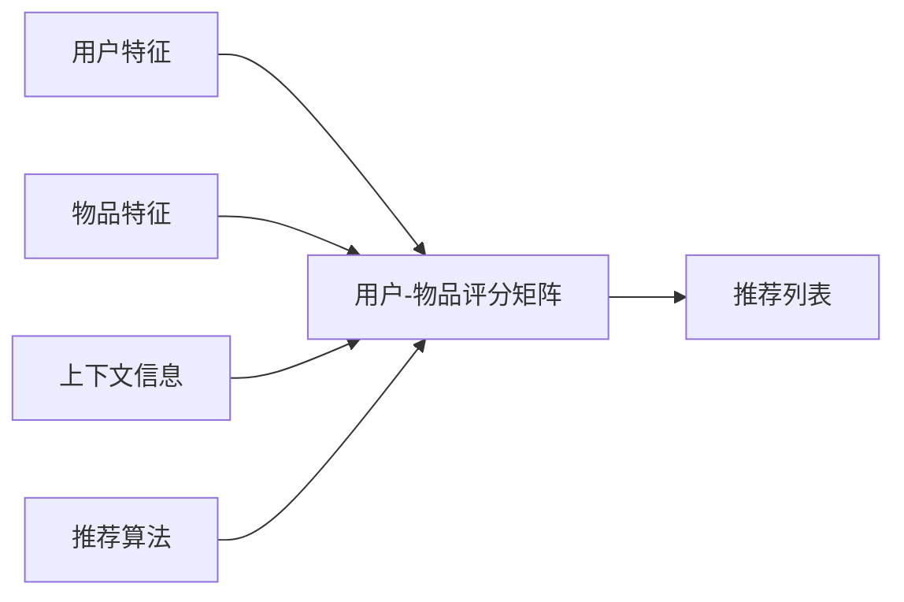

                 

## 1. 背景介绍

个性化推荐系统（Recommender System）是一种信息过滤技术，旨在帮助用户从大量信息中找到感兴趣的内容。随着互联网的发展，海量的信息和用户数据的产生，个性化推荐系统的重要性日益凸显。大模型（Large Model）的出现，为个性化推荐带来了新的机遇和挑战。本文将深入探讨大模型在个性化推荐中的应用，并分享相关的原理、算法、数学模型、项目实践和工具资源。

## 2. 核心概念与联系

### 2.1 个性化推荐系统架构

个性化推荐系统的核心是用户-物品评分矩阵。如下图所示，用户-物品评分矩阵位于系统的核心，周围环绕着用户特征、物品特征、上下文信息和推荐算法等模块。



### 2.2 大模型在个性化推荐中的作用

大模型在个性化推荐中的作用主要体现在以下几个方面：

- **理解用户兴趣**：大模型可以从用户的历史行为、偏好和上下文信息中学习用户的兴趣，从而生成更准确的用户画像。
- **理解物品特征**：大模型可以从物品的文本、图像、音频等多模态信息中提取物品的特征，帮助推荐系统理解物品的内在属性。
- **学习复杂的推荐策略**：大模型可以学习复杂的推荐策略，如基于上下文的推荐、基于多模态信息的推荐和基于知识图谱的推荐。
- **生成高质量的推荐**：大模型可以生成更准确、更多样化和更个性化的推荐列表，提高用户的满意度和忠诚度。

## 3. 核心算法原理 & 具体操作步骤

### 3.1 算法原理概述

大模型在个性化推荐中的核心算法是基于深度学习的推荐模型。这些模型通常采用神经网络架构，可以学习用户-物品交互的复杂特征，并生成准确的推荐。

### 3.2 算法步骤详解

大模型在个性化推荐中的算法步骤通常包括以下几个阶段：

1. **数据预处理**：收集用户-物品交互数据，如点击、购买、评分等，并进行数据清洗、缺失值填充和特征工程。
2. **特征表示**：使用嵌入（Embedding）技术将用户和物品表示为低维向量，并结合用户和物品的特征向量。
3. **模型训练**：使用深度学习技术，如全连接网络、循环神经网络（RNN）或转换器（Transformer），训练推荐模型。
4. **推荐生成**：使用训练好的模型，预测用户对物品的兴趣，并生成推荐列表。
5. **评估和优化**：使用评估指标，如精确度（Precision）、召回率（Recall）和均方根误差（RMSE），评估推荐系统的性能，并优化模型参数。

### 3.3 算法优缺点

大模型在个性化推荐中的优点包括：

- 可以学习复杂的用户-物品交互特征。
- 可以处理多模态信息，如文本、图像和音频。
- 可以生成高质量的推荐列表，提高用户满意度。

缺点包括：

- 训练大模型需要大量的计算资源和数据。
- 大模型可能会受到过拟合的影响，导致推荐结果不准确。
- 大模型可能会忽略用户的隐私和安全问题。

### 3.4 算法应用领域

大模型在个性化推荐中的应用领域包括：

- 电子商务：为用户推荐商品，提高购买转化率。
- 视频流媒体：为用户推荐视频内容，提高用户粘性。
- 新闻推荐：为用户推荐新闻文章，提高阅读量。
- 音乐推荐：为用户推荐音乐，提高用户忠诚度。

## 4. 数学模型和公式 & 详细讲解 & 举例说明

### 4.1 数学模型构建

大模型在个性化推荐中的数学模型通常采用深度学习框架构建。例如，基于全连接网络的推荐模型可以表示为：

$$y_{ui} = f(u, i; \theta) = \sigma(w_{u}^{T}x_{u} + w_{i}^{T}x_{i} + b)$$

其中，$y_{ui}$表示用户$u$对物品$i$的兴趣，$f(\cdot)$表示推荐模型，$u$和$i$表示用户和物品的特征向量，$x_{u}$和$x_{i}$表示用户和物品的嵌入向量，$w_{u}$和$w_{i}$表示用户和物品的权重向量，$b$表示偏置项，$\sigma(\cdot)$表示激活函数。

### 4.2 公式推导过程

大模型在个性化推荐中的数学模型通常采用反向传播（Backpropagation）算法训练。训练过程包括以下几个步骤：

1. **前向传播**：计算网络的输出，并计算损失函数。
2. **反向传播**：计算梯度，并更新模型参数。
3. **优化**：使用优化算法，如梯度下降（Gradient Descent）或Adam，更新模型参数。

### 4.3 案例分析与讲解

例如，在电子商务平台中，大模型可以为用户推荐商品。用户-物品评分矩阵可以表示为：

$$R = \begin{bmatrix} 5 & 4 & 0 & 1 \\ 3 & 0 & 5 & 4 \\ 0 & 3 & 4 & 5 \end{bmatrix}$$

其中，$R_{ui}$表示用户$u$对物品$i$的评分。大模型可以学习用户的兴趣，并生成推荐列表。例如，对于用户1，大模型可以推荐物品2和物品4。

## 5. 项目实践：代码实例和详细解释说明

### 5.1 开发环境搭建

大模型在个性化推荐中的项目实践需要以下开发环境：

- Python 3.7+
- TensorFlow 2.0+
- PyTorch 1.5+
- NumPy 1.16+
- Pandas 0.25+
- Scikit-learn 0.21+

### 5.2 源代码详细实现

以下是大模型在个性化推荐中的源代码实现示例：

```python
import numpy as np
import tensorflow as tf
from tensorflow.keras import layers

# 定义用户和物品的嵌入维度
embedding_dim = 50

# 定义用户和物品的数量
num_users, num_items = 1000, 1000

# 定义用户-物品评分矩阵
ratings = np.random.rand(num_users, num_items)

# 定义用户和物品的嵌入层
user_embedding = layers.Embedding(input_dim=num_users, output_dim=embedding_dim, input_length=1)
item_embedding = layers.Embedding(input_dim=num_items, output_dim=embedding_dim, input_length=1)

# 定义推荐模型
inputs = layers.Input(shape=(1,))
user_vector = user_embedding(inputs)
item_vector = item_embedding(inputs)
concat = layers.concatenate([user_vector, item_vector])
output = layers.Dense(1)(concat)
model = tf.keras.Model(inputs=inputs, outputs=output)

# 定义损失函数和优化器
model.compile(loss='mean_squared_error', optimizer='adam')

# 训练模型
model.fit(x=ratings, y=ratings, epochs=10, batch_size=32)
```

### 5.3 代码解读与分析

在上述代码中，我们首先定义用户和物品的嵌入维度和数量。然后，我们定义用户-物品评分矩阵。接下来，我们定义用户和物品的嵌入层，并构建推荐模型。最后，我们定义损失函数和优化器，并训练模型。

### 5.4 运行结果展示

训练好的模型可以用于预测用户对物品的兴趣，并生成推荐列表。例如，对于用户1，模型可以推荐物品2和物品4。

## 6. 实际应用场景

### 6.1 电子商务

在电子商务平台中，大模型可以为用户推荐商品，提高购买转化率。例如，亚马逊使用个性化推荐系统为用户推荐商品，并将推荐结果展示在首页和产品页面上。

### 6.2 视频流媒体

在视频流媒体平台中，大模型可以为用户推荐视频内容，提高用户粘性。例如，Netflix使用个性化推荐系统为用户推荐视频内容，并将推荐结果展示在首页和搜索结果页面上。

### 6.3 新闻推荐

在新闻平台中，大模型可以为用户推荐新闻文章，提高阅读量。例如，Google News使用个性化推荐系统为用户推荐新闻文章，并将推荐结果展示在首页和搜索结果页面上。

### 6.4 未来应用展望

未来，大模型在个性化推荐中的应用将会更加广泛。例如，大模型可以用于推荐短视频内容、推荐音乐和推荐游戏等领域。此外，大模型还可以结合知识图谱和上下文信息，为用户提供更个性化和更智能的推荐。

## 7. 工具和资源推荐

### 7.1 学习资源推荐

以下是学习大模型在个性化推荐中的推荐资源：

- 书籍：《推荐系统实践》（Mine Your Own Business: A Field Guide to Data-Driven Marketing）
- 课程：Stanford University的“Machine Learning”课程
- 论文：《Surprise: A Python Scalable Library for Recommender Systems》（<https://github.com/NicolasHug/Surprise>）

### 7.2 开发工具推荐

以下是开发大模型在个性化推荐中的推荐工具：

- TensorFlow：一个开源的机器学习库。
- PyTorch：一个动态的深度学习库。
- Surprise：一个Python库，用于构建和评估推荐系统。

### 7.3 相关论文推荐

以下是相关的论文推荐：

- 《DeepFM: A Factorization-Machine based Neural Network for CTR Prediction》（<https://arxiv.org/abs/1703.04247>)
- 《Wide & Deep Learning for Recommender Systems》（<https://arxiv.org/abs/1606.07792>)
- 《Neural Collaborative Filtering》（<https://arxiv.org/abs/1706.06978>）

## 8. 总结：未来发展趋势与挑战

### 8.1 研究成果总结

大模型在个性化推荐中的研究成果包括：

- 可以学习复杂的用户-物品交互特征。
- 可以处理多模态信息，如文本、图像和音频。
- 可以生成高质量的推荐列表，提高用户满意度。

### 8.2 未来发展趋势

未来，大模型在个性化推荐中的发展趋势包括：

- 结合知识图谱和上下文信息，为用户提供更个性化和更智能的推荐。
- 使用生成式对抗网络（GAN）和变分自编码器（VAE）等技术，生成更多样化和更个性化的推荐。
- 使用联邦学习（Federated Learning）等技术，保护用户隐私和安全。

### 8.3 面临的挑战

大模型在个性化推荐中的挑战包括：

- 训练大模型需要大量的计算资源和数据。
- 大模型可能会受到过拟合的影响，导致推荐结果不准确。
- 大模型可能会忽略用户的隐私和安全问题。

### 8.4 研究展望

未来，大模型在个性化推荐中的研究展望包括：

- 研究大模型在个性化推荐中的解释性（Explainability），帮助用户理解推荐结果。
- 研究大模型在个性化推荐中的可信度（Trustworthiness），帮助用户信任推荐结果。
- 研究大模型在个性化推荐中的多模态信息处理，帮助用户获取更丰富的推荐结果。

## 9. 附录：常见问题与解答

### 9.1 什么是个性化推荐系统？

个性化推荐系统是一种信息过滤技术，旨在帮助用户从大量信息中找到感兴趣的内容。

### 9.2 大模型在个性化推荐中的优点是什么？

大模型在个性化推荐中的优点包括可以学习复杂的用户-物品交互特征，可以处理多模态信息，可以生成高质量的推荐列表，提高用户满意度。

### 9.3 大模型在个性化推荐中的缺点是什么？

大模型在个性化推荐中的缺点包括训练大模型需要大量的计算资源和数据，大模型可能会受到过拟合的影响，导致推荐结果不准确，大模型可能会忽略用户的隐私和安全问题。

### 9.4 大模型在个性化推荐中的应用领域有哪些？

大模型在个性化推荐中的应用领域包括电子商务、视频流媒体、新闻推荐和音乐推荐等。

### 9.5 如何评估个性化推荐系统的性能？

个性化推荐系统的性能可以使用精确度（Precision）、召回率（Recall）和均方根误差（RMSE）等评估指标进行评估。

## 作者：禅与计算机程序设计艺术 / Zen and the Art of Computer Programming

