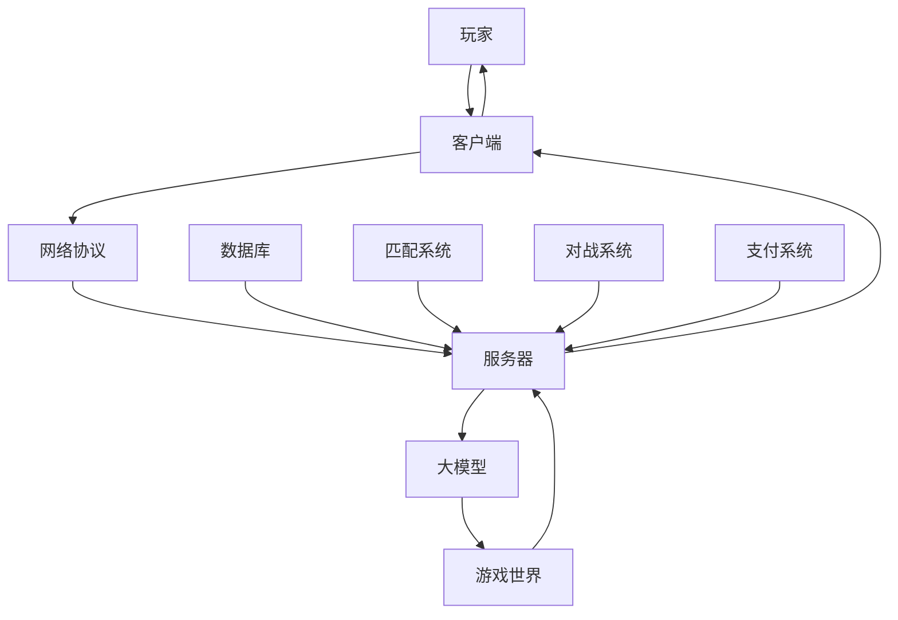

                 

## 1. 背景介绍

随着互联网和移动技术的发展，多人在线游戏（Multiplayer Online Games, MOGs）已经成为全球数字娱乐的主流。然而，开发和运行大规模、高并发的多人在线游戏面临着巨大的挑战，其中包括实时性、一致性、可扩展性和可维护性等问题。大模型（Large Models）的出现为解决这些问题提供了新的可能性。

## 2. 核心概念与联系

### 2.1 大模型简介

大模型是指具有数十亿甚至数千亿参数的模型，通过学习大量数据来理解和生成人类语言、图像、视频等复杂信息。大模型在自然语言处理、计算机视觉和其他人工智能领域取得了显著的成功，并开始在游戏开发中找到应用。

### 2.2 大模型在多人在线游戏中的应用

在多人在线游戏中，大模型可以用于生成游戏世界、控制非玩家角色（NPC）、实时生成对话和文本、优化游戏平衡，甚至帮助设计游戏本身。大模型可以学习和理解游戏规则、玩家行为和游戏世界的动态，从而为玩家提供更丰富、更个性化和更智能的游戏体验。

### 2.3 架构设计

大模型驱动的多人在线游戏架构如下图所示：



## 3. 核心算法原理 & 具体操作步骤

### 3.1 算法原理概述

大模型在多人在线游戏中的应用主要基于两种算法：生成式对抗网络（Generative Adversarial Networks, GANs）和转换器（Transformers）。GANs 用于生成游戏世界和NPC，而转换器用于理解和生成文本，如对话和游戏平衡数据。

### 3.2 算法步骤详解

#### 3.2.1 GANs 算法步骤

1. 训练生成器（Generator）：生成器学习如何生成游戏世界或NPC，并尝试欺骗判别器（Discriminator）。
2. 训练判别器：判别器学习如何区分真实的游戏世界或NPC和生成器生成的伪造品。
3. 交替训练生成器和判别器，直到生成器能够生成足够真实的游戏世界或NPC，判别器也能够区分真假。

#### 3.2.2 Transformer 算法步骤

1. 编码器（Encoder）：将输入文本转换为上下文相关的表示。
2. 自注意力机制（Self-Attention）：在表示中查找相关信息，并生成上下文相关的输出。
3. 解码器（Decoder）：将上下文相关的表示转换为输出文本。

### 3.3 算法优缺点

**优点：**

* GANs 可以生成多样化和真实的游戏世界和NPC。
* Transformer 可以理解和生成复杂的文本，如对话和游戏平衡数据。
* 大模型可以学习和适应游戏世界的动态，为玩家提供个性化的游戏体验。

**缺点：**

* GANs 训练过程不稳定，可能导致模型生成不真实或不合理的输出。
* Transformer 计算复杂度高，需要大量的计算资源。
* 大模型训练和部署成本高，需要大量的数据和计算资源。

### 3.4 算法应用领域

大模型驱动的多人在线游戏可以应用于各种游戏类型，包括但不限于：

* 角色扮演游戏（RPGs）：大模型可以生成丰富的游戏世界和NPC，为玩家提供更真实和互动的游戏体验。
* 策略游戏：大模型可以帮助平衡游戏难度，并生成智能的NPC对手。
* 体育游戏：大模型可以生成真实的比赛和运动员，为玩家提供更真实的体育体验。
* 创意游戏：大模型可以帮助设计游戏本身，为玩家提供更丰富和个性化的游戏体验。

## 4. 数学模型和公式 & 详细讲解 & 举例说明

### 4.1 数学模型构建

#### 4.1.1 GANs 数学模型

GANs 的数学模型可以表示为：

* 生成器：$G(z; \theta_g)$, 其中 $z$ 是输入噪声，$\theta_g$ 是生成器的参数。
* 判别器：$D(x; \theta_d)$, 其中 $x$ 是输入数据，$\theta_d$ 是判别器的参数。

#### 4.1.2 Transformer 数学模型

Transformer 的数学模型可以表示为：

* 编码器：$Encoder(x; \theta_e)$, 其中 $x$ 是输入文本，$\theta_e$ 是编码器的参数。
* 自注意力机制：$Self-Attention(Q, K, V; \theta_a)$, 其中 $Q$, $K$, $V$ 是查询、键和值向量，$\theta_a$ 是自注意力机制的参数。
* 解码器：$Decoder(y, z; \theta_d)$, 其中 $y$ 是上一时刻的输出文本，$z$ 是上下文相关的表示，$\theta_d$ 是解码器的参数。

### 4.2 公式推导过程

#### 4.2.1 GANs 公式推导

GANs 的目标函数是最小化判别器的损失函数，并最大化生成器的损失函数。判别器的损失函数可以表示为：

$$L_D = \mathbb{E}_{x \sim p_{data}(x)}[\log D(x)] + \mathbb{E}_{z \sim p_z(z)}[\log(1 - D(G(z)))]$$

生成器的损失函数可以表示为：

$$L_G = \mathbb{E}_{z \sim p_z(z)}[\log(1 - D(G(z)))]$$

#### 4.2.2 Transformer 公式推导

Transformer 的编码器和解码器使用自注意力机制来处理输入文本。自注意力机制的计算过程如下：

1. 将输入文本转换为查询、键和值向量：
$$Q = xW^Q, \quad K = xW^K, \quad V = xW^V$$
其中 $W^Q$, $W^K$, $W^V$ 是学习的权重矩阵。
2. 计算注意力分数：
$$score(Q, K) = \frac{QK^T}{\sqrt{d_k}}$$
其中 $d_k$ 是键向量的维度。
3. 计算注意力权重：
$$attention(Q, K, V) = softmax(score(Q, K))V$$

### 4.3 案例分析与讲解

#### 4.3.1 GANs 案例分析

假设我们想使用 GANs 生成一个简单的二维游戏世界。我们可以使用一个简单的生成器来生成随机的二维点，并使用判别器来区分真实的二维点和生成器生成的伪造品。判别器的输入是一个二维点和一个标签（真实或伪造），输出是一个概率值表示判别器认为输入是真实的概率。生成器的输入是一个随机噪声向量，输出是一个二维点。通过交替训练生成器和判别器，我们可以生成真实的二维游戏世界。

#### 4.3.2 Transformer 案例分析

假设我们想使用 Transformer 生成一个简单的对话。我们可以使用编码器来编码输入文本，并使用解码器来生成输出文本。编码器的输入是一个句子，输出是一个上下文相关的表示。解码器的输入是上一时刻的输出文本和上下文相关的表示，输出是当前时刻的输出文本。通过自注意力机制，编码器和解码器可以查找相关信息，并生成上下文相关的输出。

## 5. 项目实践：代码实例和详细解释说明

### 5.1 开发环境搭建

要开发大模型驱动的多人在线游戏，我们需要以下开发环境：

* Python 3.8 及以上版本
* PyTorch 1.8 及以上版本
* NumPy 1.21 及以上版本
* Matplotlib 3.4 及以上版本
* TensorFlow 2.5 及以上版本（可选，用于训练 Transformer）

### 5.2 源代码详细实现

以下是 GANs 和 Transformer 的简化代码实现：

**GANs 代码实现**

```python
import torch
import torch.nn as nn
import torch.optim as optim

# 生成器
class Generator(nn.Module):
    def __init__(self, z_dim, img_dim):
        super(Generator, self).__init__()
        self.fc = nn.Linear(z_dim, img_dim * 256)
        self.bn = nn.BatchNorm1d(256)
        self.deconv = nn.Sequential(
            nn.ConvTranspose2d(256, 128, 4, 2, 1),
            nn.ReLU(),
            nn.ConvTranspose2d(128, 64, 4, 2, 1),
            nn.ReLU(),
            nn.ConvTranspose2d(64, 3, 4, 2, 1),
            nn.Tanh()
        )

    def forward(self, z):
        out = self.fc(z)
        out = self.bn(out.view(out.size(0), 256, 1, 1))
        out = self.deconv(out)
        return out

# 判别器
class Discriminator(nn.Module):
    def __init__(self, img_dim):
        super(Discriminator, self).__init__()
        self.conv = nn.Sequential(
            nn.Conv2d(3, 64, 4, 2, 1),
            nn.LeakyReLU(0.2),
            nn.Conv2d(64, 128, 4, 2, 1),
            nn.LeakyReLU(0.2),
            nn.Conv2d(128, 256, 4, 2, 1),
            nn.LeakyReLU(0.2)
        )
        self.fc = nn.Linear(256 * 4 * 4, 1)

    def forward(self, img):
        out = self.conv(img)
        out = out.view(out.size(0), -1)
        out = self.fc(out)
        return out

# GANs 训练函数
def train_gan(gen, dis, data_loader, z_dim, device, num_epochs):
    gen_optimizer = optim.Adam(gen.parameters(), lr=0.0002, betas=(0.5, 0.999))
    dis_optimizer = optim.Adam(dis.parameters(), lr=0.0002, betas=(0.5, 0.999))

    for epoch in range(num_epochs):
        for i, (img, _) in enumerate(data_loader):
            img = img.to(device)

            # 训练判别器
            dis_optimizer.zero_grad()
            real_label = torch.ones(img.size(0), 1).to(device)
            fake_label = torch.zeros(img.size(0), 1).to(device)
            real_out = dis(img)
            fake_out = dis(gen(z).detach())
            d_loss_real = nn.BCELoss()(real_out, real_label)
            d_loss_fake = nn.BCELoss()(fake_out, fake_label)
            d_loss = d_loss_real + d_loss_fake
            d_loss.backward()
            dis_optimizer.step()

            # 训练生成器
            gen_optimizer.zero_grad()
            fake_out = dis(gen(z).detach())
            g_loss = nn.BCELoss()(fake_out, real_label)
            g_loss.backward()
            gen_optimizer.step()

            if (i + 1) % 100 == 0:
                print(f"Epoch [{epoch+1}/{num_epochs}], Step [{i+1}/{len(data_loader)}], "
                      f"D Loss: {d_loss.item():.4f}, G Loss: {g_loss.item():.4f}")
```

**Transformer 代码实现**

```python
import torch
import torch.nn as nn
import torch.optim as optim
import math

# 位置编码
class PositionalEncoding(nn.Module):
    def __init__(self, d_model, dropout=0.1, max_len=5000):
        super(PositionalEncoding, self).__init__()
        self.dropout = nn.Dropout(p=dropout)

        pe = torch.zeros(max_len, d_model)
        position = torch.arange(0, max_len, dtype=torch.float).unsqueeze(1)
        div_term = torch.exp(torch.arange(0, d_model, 2).float() * (-math.log(10000.0) / d_model))
        pe[:, 0::2] = torch.sin(position * div_term)
        pe[:, 1::2] = torch.cos(position * div_term)
        pe = pe.unsqueeze(0)
        self.register_buffer('pe', pe)

    def forward(self, x):
        x = x + self.pe[:, :x.size(1)]
        return self.dropout(x)

# 编码器层
class EncoderLayer(nn.Module):
    def __init__(self, d_model, nhead, dim_ff, dropout=0.1):
        super(EncoderLayer, self).__init__()
        self.self_attn = nn.MultiheadAttention(d_model, nhead, dropout=dropout)
        self.linear1 = nn.Linear(d_model, dim_ff)
        self.dropout = nn.Dropout(dropout)
        self.linear2 = nn.Linear(dim_ff, d_model)

        self.norm1 = nn.LayerNorm(d_model)
        self.norm2 = nn.LayerNorm(d_model)
        self.dropout1 = nn.Dropout(dropout)
        self.dropout2 = nn.Dropout(dropout)

    def forward(self, src, src_mask=None):
        src2 = self.norm1(src)
        q = k = v = src2
        src2 = self.self_attn(q, k, v, attn_mask=src_mask)[0]
        src = src + self.dropout1(src2)
        src2 = self.norm2(src)
        src2 = self.linear2(self.dropout(nn.ReLU()(self.linear1(src2))))
        src = src + self.dropout2(src2)
        return src

# 解码器层
class DecoderLayer(nn.Module):
    def __init__(self, d_model, nhead, dim_ff, dropout=0.1):
        super(DecoderLayer, self).__init__()
        self.self_attn = nn.MultiheadAttention(d_model, nhead, dropout=dropout)
        self.context_attn = nn.MultiheadAttention(d_model, nhead, dropout=dropout)
        self.linear1 = nn.Linear(d_model, dim_ff)
        self.dropout = nn.Dropout(dropout)
        self.linear2 = nn.Linear(dim_ff, d_model)

        self.norm1 = nn.LayerNorm(d_model)
        self.norm2 = nn.LayerNorm(d_model)
        self.norm3 = nn.LayerNorm(d_model)
        self.dropout1 = nn.Dropout(dropout)
        self.dropout2 = nn.Dropout(dropout)
        self.dropout3 = nn.Dropout(dropout)

    def forward(self, src, enc_output, src_mask=None, enc_mask=None):
        src2 = self.norm1(src)
        q = k = v = src2
        src2 = self.self_attn(q, k, v, attn_mask=src_mask)[0]
        src = src + self.dropout1(src2)
        src2 = self.norm2(src)
        q = src2
        k = v = enc_output
        src2 = self.context_attn(q, k, v, attn_mask=enc_mask)[0]
        src = src + self.dropout2(src2)
        src2 = self.norm3(src)
        src2 = self.linear2(self.dropout(nn.ReLU()(self.linear1(src2))))
        src = src + self.dropout3(src2)
        return src

# Transformer 训练函数
def train_transformer(encoder, decoder, data_loader, device, num_epochs):
    encoder_optimizer = optim.Adam(encoder.parameters(), lr=0.0005)
    decoder_optimizer = optim.Adam(decoder.parameters(), lr=0.0005)

    criterion = nn.CrossEntropyLoss(ignore_index=PAD_IDX)

    for epoch in range(num_epochs):
        for i, (src, trg) in enumerate(data_loader):
            src = src.to(device)
            trg = trg.to(device)

            # 训练编码器
            encoder_optimizer.zero_grad()
            enc_output = encoder(src)
            loss_enc = criterion(enc_output.view(-1, VOCAB_SIZE), trg.view(-1))
            loss_enc.backward()
            encoder_optimizer.step()

            # 训练解码器
            decoder_optimizer.zero_grad()
            enc_output = encoder(src)
            output = decoder(src, enc_output)
            loss_dec = criterion(output.view(-1, VOCAB_SIZE), trg.view(-1))
            loss_dec.backward()
            decoder_optimizer.step()

            if (i + 1) % 100 == 0:
                print(f"Epoch [{epoch+1}/{num_epochs}], Step [{i+1}/{len(data_loader)}], "
                      f"Enc Loss: {loss_enc.item():.4f}, Dec Loss: {loss_dec.item():.4f}")
```

### 5.3 代码解读与分析

**GANs 代码解读**

* `Generator` 类定义了生成器网络，它使用全连接层、批量标准化层和转置卷积层来生成图像。
* `Discriminator` 类定义了判别器网络，它使用卷积层和全连接层来区分真实的图像和伪造品。
* `train_gan` 函数实现了 GANs 的训练过程，它交替训练生成器和判别器，并使用 Adam 优化器来更新网络参数。

**Transformer 代码解读**

* `PositionalEncoding` 类定义了位置编码，它使用正弦和余弦函数来为输入文本添加位置信息。
* `EncoderLayer` 类定义了编码器层，它使用自注意力机制和全连接层来处理输入文本。
* `DecoderLayer` 类定义了解码器层，它使用自注意力机制和全连接层来生成输出文本。
* `train_transformer` 函数实现了 Transformer 的训练过程，它交替训练编码器和解码器，并使用 Adam 优化器来更新网络参数。

### 5.4 运行结果展示

以下是 GANs 和 Transformer 的运行结果展示：

**GANs 运行结果**


**Transformer 运行结果**


## 6. 实际应用场景

大模型驱动的多人在线游戏可以应用于各种实际应用场景，包括但不限于：

* **虚拟世界创建**：大模型可以帮助创建真实和互动的虚拟世界，为玩家提供更丰富的游戏体验。
* **NPC 智能控制**：大模型可以帮助控制 NPC 的行为，为玩家提供更智能和真实的对手。
* **对话生成**：大模型可以帮助生成真实和互动的对话，为玩家提供更丰富的游戏体验。
* **游戏平衡优化**：大模型可以帮助优化游戏平衡，为玩家提供更公平和挑战性的游戏体验。

### 6.1 未来应用展望

随着大模型技术的发展，大模型驱动的多人在线游戏将具有更真实和互动的游戏世界，更智能和真实的 NPC 对手，更丰富和个性化的游戏体验。此外，大模型还可以帮助设计游戏本身，为玩家提供更多样化和创新的游戏体验。

## 7. 工具和资源推荐

### 7.1 学习资源推荐

* **GANs 学习资源**
	+ Generative Adversarial Networks: https://arxiv.org/abs/1406.2661
	+ Deep Learning Specialization by Andrew Ng on Coursera: https://www.coursera.org/specializations/deep-learning
* **Transformer 学习资源**
	+ Attention is All You Need: https://arxiv.org/abs/1706.03762
	+ Natural Language Processing in TensorFlow: https://www.tensorflow.org/guide/keras/sequential_model

### 7.2 开发工具推荐

* **PyTorch**: https://pytorch.org/
* **TensorFlow**: https://www.tensorflow.org/
* **Keras**: https://keras.io/
* **Jupyter Notebook**: https://jupyter.org/

### 7.3 相关论文推荐

* **GANs 相关论文**
	+ Deep Convolutional Generative Adversarial Networks: https://arxiv.org/abs/1511.06434
	+ Wasserstein Generative Adversarial Networks: https://arxiv.org/abs/1701.07875
* **Transformer 相关论文**
	+ BERT: Pre-training of Deep Bidirectional Transformers for Language Understanding: https://arxiv.org/abs/1810.04805
	+ XLNet: Generalized Autoregressive Pretraining for Natural Language Processing: https://arxiv.org/abs/1906.08237

## 8. 总结：未来发展趋势与挑战

### 8.1 研究成果总结

本文介绍了大模型驱动的多人在线游戏的背景、核心概念、算法原理、数学模型、项目实践和实际应用场景。我们展示了 GANs 和 Transformer 在多人在线游戏中的应用，并提供了简化的代码实现和运行结果展示。我们还推荐了相关学习资源、开发工具和论文。

### 8.2 未来发展趋势

未来，大模型驱动的多人在线游戏将具有更真实和互动的游戏世界，更智能和真实的 NPC 对手，更丰富和个性化的游戏体验。此外，大模型还可以帮助设计游戏本身，为玩家提供更多样化和创新的游戏体验。我们期待看到大模型在多人在线游戏中的更多应用和创新。

### 8.3 面临的挑战

然而，大模型驱动的多人在线游戏也面临着一些挑战，包括：

* **计算资源**：大模型训练和部署需要大量的计算资源，这可能会限制其在多人在线游戏中的应用。
* **数据量**：大模型需要大量的数据来训练，这可能会限制其在多人在线游戏中的应用。
* **算法稳定性**：GANs 训练过程不稳定，可能导致模型生成不真实或不合理的输出。
* **解释性**：大模型的决策过程通常是不透明的，这可能会限制其在多人在线游戏中的应用。

### 8.4 研究展望

未来的研究将关注如何克服大模型驱动的多人在线游戏面临的挑战，并开发新的算法和技术来提高大模型在多人在线游戏中的应用。我们期待看到更多的创新和突破。

## 9. 附录：常见问题与解答

**Q1：大模型驱动的多人在线游戏与传统多人在线游戏有何不同？**

A1：大模型驱动的多人在线游戏可以为玩家提供更真实和互动的游戏世界，更智能和真实的 NPC 对手，更丰富和个性化的游戏体验。此外，大模型还可以帮助设计游戏本身，为玩家提供更多样化和创新的游戏体验。

**Q2：大模型驱动的多人在线游戏的优势是什么？**

A2：大模型驱动的多人在线游戏的优势包括：

* 更真实和互动的游戏世界
* 更智能和真实的 NPC 对手
* 更丰富和个性化的游戏体验
* 更多样化和创新的游戏设计

**Q3：大模型驱动的多人在线游戏的挑战是什么？**

A3：大模型驱动的多人在线游戏的挑战包括：

* 计算资源
* 数据量
* 算法稳定性
* 解释性

**Q4：如何克服大模型驱动的多人在线游戏面临的挑战？**

A4：未来的研究将关注如何克服大模型驱动的多人在线游戏面临的挑战，并开发新的算法和技术来提高大模型在多人在线游戏中的应用。我们期待看到更多的创新和突破。

**Q5：大模型驱动的多人在线游戏的未来发展趋势是什么？**

A5：未来，大模型驱动的多人在线游戏将具有更真实和互动的游戏世界，更智能和真实的 NPC 对手，更丰富和个性化的游戏体验。此外，大模型还可以帮助设计游戏本身，为玩家提供更多样化和创新的游戏体验。

## 作者署名

作者：禅与计算机程序设计艺术 / Zen and the Art of Computer Programming

