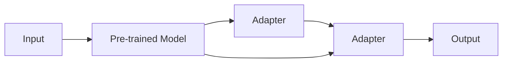

                 

大语言模型（LLM）、Adapter、微调（Fine-tuning）、自然语言处理（NLP）、预训练模型（Pre-trained model）、参数效率（Parameter efficiency）、计算效率（Computational efficiency）

## 1. 背景介绍

随着大语言模型在各种自然语言处理（NLP）任务中的成功应用，预训练模型已经成为当前主流的方法。然而，将预训练模型适应特定领域或任务的挑战仍然存在。传统的微调方法需要大量的计算资源和标记数据，并且可能导致过拟合。 Adapter 方法提供了一种高效的微调方法，可以在保持预训练模型参数不变的情况下，适应特定任务的需求。

## 2. 核心概念与联系

Adapter 方法的核心概念是引入可学习的适配器模块，这些模块插入到预训练模型的特定位置，以适应特定任务的需求。如下图所示，Adapter 模块插入到预训练模型的自注意力块之间。



Adapter 模块由两个可学习的线性层组成，分别在输入和输出处理器上应用。在微调过程中，只有 Adapter 模块的参数被更新，预训练模型的参数保持不变。这种参数效率（Parameter efficiency）和计算效率（Computational efficiency）的组合使得 Adapter 方法成为一种高效的微调方法。

## 3. 核心算法原理 & 具体操作步骤

### 3.1 算法原理概述

Adapter 方法的核心原理是引入可学习的适配器模块，这些模块插入到预训练模型的特定位置，以适应特定任务的需求。Adapter 模块由两个可学习的线性层组成，分别在输入和输出处理器上应用。在微调过程中，只有 Adapter 模块的参数被更新，预训练模型的参数保持不变。

### 3.2 算法步骤详解

1. 选择预训练模型：选择一个预训练的大语言模型作为基础模型。
2. 插入 Adapter 模块：在预训练模型的自注意力块之间插入可学习的 Adapter 模块。
3. 微调：使用特定任务的标记数据微调 Adapter 模块的参数，预训练模型的参数保持不变。
4. 推理：在推理过程中，使用微调后的模型生成输出。

### 3.3 算法优缺点

优点：

* 参数效率：只有 Adapter 模块的参数需要微调，预训练模型的参数保持不变。
* 计算效率：由于只需要微调少量参数，计算开销显著减小。
* 通用性：Adapter 模块可以插入到各种预训练模型中，适应不同的任务需求。

缺点：

* 微调数据需求：虽然Adapter 方法可以减少微调数据的需求，但仍然需要一定量的标记数据。
* 微调时间：虽然计算开销减小，但微调过程仍然需要一定的时间。

### 3.4 算法应用领域

Adapter 方法可以应用于各种 NLP 任务，包括但不限于文本分类、命名实体识别、问答系统等。此外，Adapter 方法还可以应用于跨语言任务，如机器翻译等。

## 4. 数学模型和公式 & 详细讲解 & 举例说明

### 4.1 数学模型构建

给定预训练模型 $f_{\theta}(x)$，其中 $x$ 是输入， $\theta$ 是预训练模型的参数。在插入 Adapter 模块后，模型变为 $f_{\theta, \phi}(x)$，其中 $\phi$ 是 Adapter 模块的参数。数学模型可以表示为：

$$f_{\theta, \phi}(x) = f_{\theta}(x) + g_{\phi}(f_{\theta}(x))$$

其中 $g_{\phi}(f_{\theta}(x))$ 是 Adapter 模块的输出，它接受预训练模型的输出作为输入，并生成适应特定任务的输出。

### 4.2 公式推导过程

在微调过程中，我们需要最小化损失函数 $L(f_{\theta, \phi}(x), y)$，其中 $y$ 是标签。由于预训练模型的参数 $\theta$ 保持不变，我们只需要更新 Adapter 模块的参数 $\phi$。因此，我们需要计算梯度 $\nabla_{\phi}L(f_{\theta, \phi}(x), y)$，并使用梯度下降法更新参数 $\phi$。

### 4.3 案例分析与讲解

例如，假设我们想要使用 Adapter 方法微调预训练模型以适应文本分类任务。我们首先选择一个预训练的大语言模型作为基础模型。然后，我们在预训练模型的自注意力块之间插入可学习的 Adapter 模块。在微调过程中，我们使用文本分类任务的标记数据更新 Adapter 模块的参数，预训练模型的参数保持不变。最后，我们使用微调后的模型生成文本分类输出。

## 5. 项目实践：代码实例和详细解释说明

### 5.1 开发环境搭建

要实现 Adapter 方法，我们需要一个支持 PyTorch 的开发环境。我们推荐使用 Python 3.7 或更高版本，并安装以下库：

* PyTorch
* Hugging Face Transformers
* NumPy
* Matplotlib

### 5.2 源代码详细实现

以下是使用 Hugging Face Transformers 库实现 Adapter 方法的示例代码：

```python
from transformers import AutoModel, AutoTokenizer, AutoModelForSequenceClassification
from transformers import Trainer, TrainingArguments
import numpy as np

# Load pre-trained model and tokenizer
model_name = "bert-base-uncased"
model = AutoModel.from_pretrained(model_name)
tokenizer = AutoTokenizer.from_pretrained(model_name)

# Insert adapter modules
adapter_dim = 64
model.insert_adapter("adapter", adapter_dim)

# Prepare dataset
dataset =...

# Define training arguments
training_args = TrainingArguments(
    output_dir="./results",
    num_train_epochs=3,
    per_device_train_batch_size=16,
    per_device_eval_batch_size=64,
    warmup_steps=500,
    weight_decay=0.01,
    logging_dir="./logs",
)

# Define trainer
trainer = Trainer(
    model=model,
    args=training_args,
    train_dataset=dataset["train"],
    eval_dataset=dataset["validation"],
)

# Train model
trainer.train()

# Save model
model.save_pretrained("./adapter_model")
```

### 5.3 代码解读与分析

在上述代码中，我们首先加载预训练模型和分词器。然后，我们插入可学习的 Adapter 模块，并指定 Adapter 模块的维度。我们使用 Hugging Face Transformers 库的 `insert_adapter` 方法插入 Adapter 模块。之后，我们准备训练数据集，并定义训练参数。我们使用 `Trainer` 类来训练模型，并保存微调后的模型。

### 5.4 运行结果展示

在训练过程中，我们可以监控损失函数的值，并观察其如何随着训练步数的增加而减小。在训练结束后，我们可以使用微调后的模型生成输出，并评估其性能。

## 6. 实际应用场景

Adapter 方法可以应用于各种实际应用场景，包括但不限于：

* 个性化推荐：使用 Adapter 方法微调预训练模型以适应用户的偏好，从而提供个性化推荐。
* 问答系统：使用 Adapter 方法微调预训练模型以适应特定领域的问答任务，如医疗问答等。
* 机器翻译：使用 Adapter 方法微调预训练模型以适应特定语言对的机器翻译任务。

### 6.4 未来应用展望

随着大语言模型在各种 NLP 任务中的成功应用，预训练模型已经成为当前主流的方法。然而，将预训练模型适应特定领域或任务的挑战仍然存在。Adapter 方法提供了一种高效的微调方法，可以在保持预训练模型参数不变的情况下，适应特定任务的需求。我们期待未来在更多的实际应用场景中看到 Adapter 方法的成功应用。

## 7. 工具和资源推荐

### 7.1 学习资源推荐

* "Adapter: Scaling Contextualized String Embeddings"：https://arxiv.org/abs/1902.10184
* "AdapterFusion: Towards Generalization in Few-shot Learning with Adapters"：https://arxiv.org/abs/2005.00231
* "AdapterHub: A Repository of Adapters for Parameter-Efficient Transfer Learning"：https://arxiv.org/abs/2104.08051

### 7.2 开发工具推荐

* Hugging Face Transformers：https://huggingface.co/transformers/
* PyTorch：https://pytorch.org/
* NumPy：https://numpy.org/
* Matplotlib：https://matplotlib.org/

### 7.3 相关论文推荐

* "Adapter: Scaling Contextualized String Embeddings"：https://arxiv.org/abs/1902.10184
* "AdapterFusion: Towards Generalization in Few-shot Learning with Adapters"：https://arxiv.org/abs/2005.00231
* "AdapterHub: A Repository of Adapters for Parameter-Efficient Transfer Learning"：https://arxiv.org/abs/2104.08051

## 8. 总结：未来发展趋势与挑战

### 8.1 研究成果总结

Adapter 方法提供了一种高效的微调方法，可以在保持预训练模型参数不变的情况下，适应特定任务的需求。Adapter 方法的参数效率和计算效率使其成为一种有吸引力的微调方法，并且已经在各种实际应用场景中取得了成功。

### 8.2 未来发展趋势

我们期待未来在更多的实际应用场景中看到 Adapter 方法的成功应用。此外，我们期待看到更多的研究工作致力于改进 Adapter 方法，以提高其微调效果和泛化能力。

### 8.3 面临的挑战

虽然 Adapter 方法已经取得了成功，但仍然存在一些挑战。例如，如何在保持预训练模型参数不变的情况下，有效地适应特定任务的需求仍然是一个挑战。此外，如何在计算资源有限的情况下，高效地微调 Adapter 模块也是一个挑战。

### 8.4 研究展望

我们期待未来的研究工作致力于改进 Adapter 方法，以克服当前面临的挑战。我们期待看到更多的研究工作致力于开发新的微调方法，以提高预训练模型的适应能力和泛化能力。

## 9. 附录：常见问题与解答

**Q：Adapter 方法与传统微调方法有何不同？**

A：与传统微调方法不同，Adapter 方法只需要微调少量的参数，预训练模型的参数保持不变。这使得 Adapter 方法具有参数效率和计算效率的优势。

**Q：Adapter 方法适用于哪些 NLP 任务？**

A：Adapter 方法可以应用于各种 NLP 任务，包括但不限于文本分类、命名实体识别、问答系统等。此外，Adapter 方法还可以应用于跨语言任务，如机器翻译等。

**Q：如何插入 Adapter 模块？**

A：在预训练模型的自注意力块之间插入可学习的 Adapter 模块。Adapter 模块由两个可学习的线性层组成，分别在输入和输出处理器上应用。

**Q：如何微调 Adapter 模块？**

A：使用特定任务的标记数据微调 Adapter 模块的参数，预训练模型的参数保持不变。在微调过程中，我们需要最小化损失函数，并使用梯度下降法更新参数。

**Q：Adapter 方法的优缺点是什么？**

A：优点包括参数效率、计算效率和通用性。缺点包括微调数据需求和微调时间。

## 作者：禅与计算机程序设计艺术 / Zen and the Art of Computer Programming

