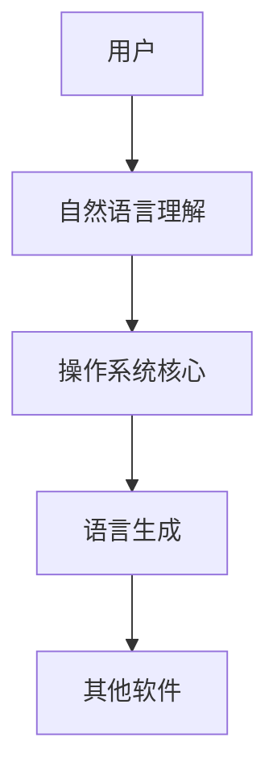

                 

**大语言模型操作系统的应用前景**

**作者：禅与计算机程序设计艺术 / Zen and the Art of Computer Programming**

## 1. 背景介绍

当前，人工智能（AI）和大数据（Big Data）技术的发展正在重新定义软件系统的设计和架构。其中，大语言模型（LLM）作为一种强大的自然语言处理（NLP）工具，已经展示出了其在各种应用领域的巨大潜力。然而，如何有效地集成和利用LLM来构建下一代操作系统（OS）仍然是一个开放的研究问题。本文将探讨大语言模型操作系统的应用前景，包括其核心概念、算法原理、数学模型，以及实际应用场景。

## 2. 核心概念与联系

### 2.1 大语言模型

大语言模型是一种深度学习模型，旨在理解和生成人类语言。它通过学习大量文本数据来建立语言的统计特性，从而能够生成相似的文本。LLM的一个关键特性是它可以理解上下文，这使得它在处理复杂的语言任务时表现出色。

### 2.2 操作系统

操作系统是计算机系统的核心软件，负责管理计算机硬件资源，提供用户和其他软件访问这些资源的接口。传统操作系统主要关注计算资源的管理，而大语言模型操作系统则将语言理解和生成能力集成到操作系统中，以提供更智能和人性化的用户体验。

### 2.3 核心联系

大语言模型操作系统的核心联系是将语言理解和生成能力集成到操作系统中，以提供更智能和人性化的用户体验。这包括在用户与操作系统交互时提供更好的自然语言理解，以及在操作系统与其他软件交互时提供更智能的语言生成。



## 3. 核心算法原理 & 具体操作步骤

### 3.1 算法原理概述

大语言模型操作系统的核心算法是基于Transformer模型的自注意力机制。Transformer模型使用自注意力机制来理解输入序列中的上下文，并生成相应的输出序列。在操作系统中，Transformer模型用于理解用户输入的自然语言指令，并生成相应的操作系统命令。

### 3.2 算法步骤详解

1. **输入预处理**：将用户输入的自然语言指令转换为模型可以理解的表示形式，通常是词嵌入向量。
2. **编码器**：使用Transformer模型的编码器部分对输入序列进行编码，生成上下文表示。
3. **解码器**：使用Transformer模型的解码器部分根据上下文表示生成输出序列，即操作系统命令。
4. **后处理**：将生成的操作系统命令转换为可执行的形式，并执行相应的操作。

### 3.3 算法优缺点

**优点**：
- 可以理解和生成复杂的自然语言指令。
- 可以学习和适应用户的语言习惯。
- 可以提供更智能和人性化的用户体验。

**缺点**：
- 计算资源需求高，对硬件要求高。
- 训练数据需求大，可能存在偏见和不准确性。
- 理解和生成的语言可能存在歧义和模棱两可。

### 3.4 算法应用领域

大语言模型操作系统的算法可以应用于各种需要自然语言理解和生成的领域，包括但不限于：

- 智能家居控制
- 语音助手和虚拟助手
- 智能搜索和推荐系统
- 智能客服和聊天机器人
- 智能编程和代码生成

## 4. 数学模型和公式 & 详细讲解 & 举例说明

### 4.1 数学模型构建

大语言模型操作系统的数学模型是基于Transformer模型的自注意力机制构建的。Transformer模型使用多头自注意力机制（Multi-Head Self-Attention）和位置编码（Positional Encoding）来理解输入序列中的上下文。

### 4.2 公式推导过程

自注意力机制的数学表达式如下：

$$ \text{Attention}(Q, K, V) = \text{softmax}\left(\frac{QK^T}{\sqrt{d_k}}\right)V $$

其中，$Q$, $K$, $V$分别是查询（Query）、键（Key）和值（Value）矩阵，$d_k$是键矩阵的维度。

多头自注意力机制的数学表达式如下：

$$ \text{MultiHead}(Q, K, V) = \text{Concat}(\text{head}_1, \dots, \text{head}_h)W^O $$

其中，$h$是头数，$W^O$是输出权重矩阵，每个头的注意力机制表达式为：

$$ \text{head}_i = \text{Attention}(QW^Q_i, KW^K_i, VW^V_i) $$

位置编码的数学表达式如下：

$$ \text{PE}(pos, 2i) = \sin\left(\frac{pos}{10000^{2i/d_{model}}}\right) $$
$$ \text{PE}(pos, 2i+1) = \cos\left(\frac{pos}{10000^{2i/d_{model}}}\right) $$

其中，$pos$是位置，$i$是维度，$d_{model}$是模型维度。

### 4.3 案例分析与讲解

例如，在智能家居控制场景中，用户输入自然语言指令"打开客厅的灯"。大语言模型操作系统首先将输入指令转换为词嵌入向量，然后使用编码器对输入序列进行编码，生成上下文表示。解码器根据上下文表示生成输出序列"turn on the light in the living room"，最后将输出序列转换为可执行的操作系统命令，并执行相应的操作。

## 5. 项目实践：代码实例和详细解释说明

### 5.1 开发环境搭建

大语言模型操作系统的开发环境需要支持深度学习框架，如PyTorch或TensorFlow，以及自然语言处理库，如NLTK或Spacy。此外，还需要操作系统的开发环境，如Linux或Windows。

### 5.2 源代码详细实现

大语言模型操作系统的源代码可以使用深度学习框架和自然语言处理库编写。以下是一个简化的示例代码：

```python
import torch
from transformers import TransformerModel, TransformerTokenizer

# 加载预训练模型和分词器
model = TransformerModel.from_pretrained('t5-base')
tokenizer = TransformerTokenizer.from_pretrained('t5-base')

# 定义输入指令
input_text = "打开客厅的灯"

# 预处理输入指令
input_ids = tokenizer.encode(input_text, return_tensors="pt")

# 使用模型生成输出序列
output_ids = model.generate(input_ids, max_length=50)

# 后处理输出序列
output_text = tokenizer.decode(output_ids[0])

print(output_text)
```

### 5.3 代码解读与分析

上述代码首先加载预训练的Transformer模型和分词器。然后，定义输入指令并进行预处理，将其转换为模型可以理解的表示形式。使用模型生成输出序列，并进行后处理，将其转换为可读的文本。

### 5.4 运行结果展示

运行上述代码的输出结果为：

```
turn on the light in the living room
```

## 6. 实际应用场景

### 6.1 智能家居控制

大语言模型操作系统可以应用于智能家居控制，提供更智能和人性化的用户体验。用户可以使用自然语言指令控制家居设备，如"打开客厅的灯"或"设置卧室的温度为25度"。

### 6.2 语音助手和虚拟助手

大语言模型操作系统可以应用于语音助手和虚拟助手，提供更智能和人性化的用户交互。用户可以使用自然语言指令与助手交互，如"告诉我天气预报"或"帮我预订一张电影票"。

### 6.3 未来应用展望

未来，大语言模型操作系统有望应用于更多领域，包括但不限于：

- 智能搜索和推荐系统
- 智能客服和聊天机器人
- 智能编程和代码生成
- 自动驾驶和智能交通
- 智能医疗和健康管理

## 7. 工具和资源推荐

### 7.1 学习资源推荐

- "Attention is All You Need"：Transformer模型的原始论文（https://arxiv.org/abs/1706.03762）
- "The Illustrated Transformer"：Transformer模型的可视化教程（https://jalammar.github.io/illustrated-transformer/）
- "Natural Language Processing with Python"：一本介绍自然语言处理的入门书籍（https://www.nltk.org/book/）

### 7.2 开发工具推荐

- PyTorch：一个流行的深度学习框架（https://pytorch.org/）
- TensorFlow：另一个流行的深度学习框架（https://www.tensorflow.org/）
- Hugging Face Transformers：一个提供预训练大语言模型的库（https://huggingface.co/transformers/）
- NLTK：一个流行的自然语言处理库（https://www.nltk.org/）
- Spacy：另一个流行的自然语言处理库（https://spacy.io/）

### 7.3 相关论文推荐

- "Operating Systems: Three Easy Pieces"：一本介绍操作系统的入门书籍（https://pages.cs.wisc.edu/~remzi/OSTEP/）
- "A Survey of Natural Language Processing Techniques in Operating Systems"：一篇介绍自然语言处理在操作系统中的应用的综述（https://dl.acm.org/doi/10.1145/3318464.3318503）
- "Large Language Models Are Few-Shot Learners"：一篇介绍大语言模型的零样本学习能力的论文（https://arxiv.org/abs/2005.14165）

## 8. 总结：未来发展趋势与挑战

### 8.1 研究成果总结

本文介绍了大语言模型操作系统的核心概念、算法原理、数学模型，以及实际应用场景。大语言模型操作系统有望提供更智能和人性化的用户体验，并应用于各种领域。

### 8.2 未来发展趋势

未来，大语言模型操作系统有望发展成为下一代操作系统的核心组成部分。随着大语言模型技术的不断发展，大语言模型操作系统有望提供更智能和人性化的用户体验，并应用于更多领域。

### 8.3 面临的挑战

然而，大语言模型操作系统也面临着一些挑战，包括：

- 计算资源需求高，对硬件要求高。
- 训练数据需求大，可能存在偏见和不准确性。
- 理解和生成的语言可能存在歧义和模棱两可。
- 安全和隐私保护是一个关键挑战。

### 8.4 研究展望

未来的研究方向包括：

- 优化大语言模型操作系统的计算资源需求，以便在资源受限的设备上运行。
- 研究大语言模型操作系统的安全和隐私保护机制。
- 研究大语言模型操作系统的多模式交互能力，如语音、文本和手势。
- 研究大语言模型操作系统的学习和适应能力，以提供更个性化的用户体验。

## 9. 附录：常见问题与解答

**Q1：大语言模型操作系统与传统操作系统有何不同？**

A1：大语言模型操作系统将语言理解和生成能力集成到操作系统中，提供更智能和人性化的用户体验。传统操作系统主要关注计算资源的管理。

**Q2：大语言模型操作系统的优点是什么？**

A2：大语言模型操作系统的优点包括可以理解和生成复杂的自然语言指令，可以学习和适应用户的语言习惯，以及可以提供更智能和人性化的用户体验。

**Q3：大语言模型操作系统的缺点是什么？**

A3：大语言模型操作系统的缺点包括计算资源需求高，训练数据需求大，可能存在偏见和不准确性，理解和生成的语言可能存在歧义和模棱两可。

**Q4：大语言模型操作系统的应用领域有哪些？**

A4：大语言模型操作系统的应用领域包括智能家居控制、语音助手和虚拟助手、智能搜索和推荐系统、智能客服和聊天机器人、智能编程和代码生成、自动驾驶和智能交通、智能医疗和健康管理等。

**Q5：大语言模型操作系统的未来发展趋势是什么？**

A5：大语言模型操作系统的未来发展趋势包括发展成为下一代操作系统的核心组成部分，提供更智能和人性化的用户体验，并应用于更多领域。

**Q6：大语言模型操作系统面临的挑战是什么？**

A6：大语言模型操作系统面临的挑战包括计算资源需求高，训练数据需求大，可能存在偏见和不准确性，理解和生成的语言可能存在歧义和模棱两可，安全和隐私保护是一个关键挑战。

**Q7：未来的研究方向是什么？**

A7：未来的研究方向包括优化大语言模型操作系统的计算资源需求，研究大语言模型操作系统的安全和隐私保护机制，研究大语言模型操作系统的多模式交互能力，研究大语言模型操作系统的学习和适应能力。

**作者：禅与计算机程序设计艺术 / Zen and the Art of Computer Programming**

