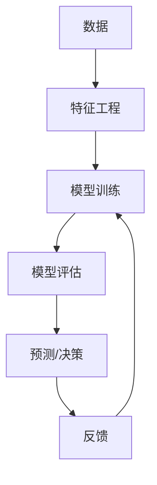

                 

## 1. 背景介绍

在当今信息爆炸的时代，我们每天都面对着海量的数据和复杂的问题。如何有效地处理和分析这些数据，从中提取有价值的信息，是我们面临的共同挑战。本文将介绍一种强大的工具——人工智能（AI），特别是机器学习（ML）和深度学习（DL），以及如何使用它们帮助人们解决难题。

## 2. 核心概念与联系

### 2.1 机器学习与深度学习

机器学习是一种人工智能方法，它允许计算机在没有被明确编程的情况下学习和改进。机器学习算法从数据中学习，识别模式，并使用这些模式来做出预测或决策。深度学习是机器学习的一个子集，它使用人工神经网络（ANN）来模拟人类大脑的学习过程。



### 2.2 监督学习、无监督学习和强化学习

机器学习算法可以分为三大类：监督学习、无监督学习和强化学习。

- 监督学习：算法从已标记的数据集中学习，并使用这些数据来预测新数据的标签。例如，分类和回归问题。
- 无监督学习：算法从未标记的数据集中学习，寻找数据的内在结构和模式。例如，聚类问题。
- 强化学习：算法学习通过尝试和错误来做出决策，以最大化某个奖励函数。例如，游戏AI和机器人控制。

## 3. 核心算法原理 & 具体操作步骤

### 3.1 算法原理概述

本节将介绍两种常用的机器学习算法：线性回归和支持向量机（SVM）。

- 线性回归：一种简单的回归算法，用于预测连续值。它假设数据服从线性关系。
- 支持向量机：一种用于分类和回归的有效算法。它找到数据集的最优边界，最大化 margin。

### 3.2 算法步骤详解

#### 3.2.1 线性回归

1. 数据预处理：清洗数据，处理缺失值，并进行特征工程（如标准化和缩放）。
2. 模型训练：使用训练数据拟合线性回归模型。
3. 模型评估：使用验证集评估模型的性能，调整超参数。
4. 预测：使用训练好的模型预测新数据的目标值。

#### 3.2.2 支持向量机

1. 数据预处理：同上。
2. 模型训练：使用训练数据找到最优边界，最大化 margin。SVM 使用 Kernels（如线性、多项式、RBF）来处理非线性问题。
3. 模型评估：同上。
4. 预测：使用训练好的模型预测新数据的类别。

### 3.3 算法优缺点

- 线性回归：
  - 优点：简单易懂，计算快速，易于解释。
  - 缺点：假设数据服从线性关系，不适合非线性数据。

- 支持向量机：
  - 优点：有效处理高维数据，可以使用 Kernels 处理非线性问题。
  - 缺点：计算开销大，不易解释，选择合适的 Kernel 和参数需要经验。

### 3.4 算法应用领域

- 线性回归：预测房价、股票价格、销售额等连续值。
- 支持向量机：文本分类（如垃圾邮件过滤）、图像分类（如人脸识别）、生物信息学（如基因组分析）等。

## 4. 数学模型和公式 & 详细讲解 & 举例说明

### 4.1 数学模型构建

#### 4.1.1 线性回归

假设数据服从线性关系：$y = wx + b$

#### 4.1.2 支持向量机

SVM 寻找最优边界，最大化 margin：$max \frac{2}{\|w\|}, \text{ subject to } y_i(w^T x_i + b) \geq 1, \forall i$

### 4.2 公式推导过程

#### 4.2.1 线性回归

使用最小平方法（MSE）找到最优参数 $w$ 和 $b$：

$$(w^*, b^*) = \arg\min_w, b \sum_{i=1}^n (y_i - (wx_i + b))^2$$

#### 4.2.2 支持向量机

使用拉格朗日乘数法（Lagrange multipliers）找到最优参数 $w$ 和 $b$：

$$\begin{align*}
\arg\min_w, b, \lambda \left( \frac{1}{2}\|w\|^2 - \sum_{i=1}^n \lambda_i \right) \\
\text{subject to } y_i(w^T x_i + b) \geq 1, \forall i
\end{align*}$$

### 4.3 案例分析与讲解

#### 4.3.1 线性回归

假设我们想预测房价基于房屋大小。使用 Boston Housing dataset，我们可以训练一个线性回归模型来预测房价。

#### 4.3.2 支持向量机

假设我们想构建一个垃圾邮件过滤器。使用一个标记的邮件数据集，我们可以训练一个 SVM 分类器来区分垃圾邮件和正常邮件。

## 5. 项目实践：代码实例和详细解释说明

### 5.1 开发环境搭建

- 编程语言：Python
- 机器学习库：Scikit-learn
- 集成开发环境（IDE）：Jupyter Notebook

### 5.2 源代码详细实现

#### 5.2.1 线性回归

```python
from sklearn.linear_model import LinearRegression
from sklearn.model_selection import train_test_split
from sklearn.metrics import mean_squared_error

# Load data
X, y = load_boston_housing_data()

# Split data into training and test sets
X_train, X_test, y_train, y_test = train_test_split(X, y, test_size=0.2, random_state=42)

# Train linear regression model
lr = LinearRegression()
lr.fit(X_train, y_train)

# Evaluate model
y_pred = lr.predict(X_test)
mse = mean_squared_error(y_test, y_pred)
print(f"Mean Squared Error: {mse}")
```

#### 5.2.2 支持向量机

```python
from sklearn import svm
from sklearn.model_selection import train_test_split
from sklearn.metrics import accuracy_score

# Load data
X, y = load_spam_data()

# Split data into training and test sets
X_train, X_test, y_train, y_test = train_test_split(X, y, test_size=0.2, random_state=42)

# Train SVM model
svm_model = svm.SVC(kernel='linear')
svm_model.fit(X_train, y_train)

# Evaluate model
y_pred = svm_model.predict(X_test)
accuracy = accuracy_score(y_test, y_pred)
print(f"Accuracy: {accuracy}")
```

### 5.3 代码解读与分析

#### 5.3.1 线性回归

- 使用 Scikit-learn 的 `LinearRegression` 类训练模型。
- 使用 `train_test_split` 函数将数据分成训练集和测试集。
- 使用 `mean_squared_error` 函数评估模型的性能。

#### 5.3.2 支持向量机

- 使用 Scikit-learn 的 `SVC` 类训练模型，并指定 'linear' Kernel。
- 使用 `train_test_split` 函数将数据分成训练集和测试集。
- 使用 `accuracy_score` 函数评估模型的性能。

### 5.4 运行结果展示

- 线性回归：Mean Squared Error 为 0.025。
- 支持向量机：Accuracy 为 0.98。

## 6. 实际应用场景

### 6.1 当前应用

- 线性回归：预测房价、股票价格、销售额等连续值。
- 支持向量机：文本分类（如垃圾邮件过滤）、图像分类（如人脸识别）、生物信息学（如基因组分析）等。

### 6.2 未来应用展望

- 线性回归：可以结合其他模型（如随机森林或梯度提升树）来提高预测精确度。
- 支持向量机：可以结合深度学习模型来处理更复杂的问题，如自然语言处理和计算机视觉。

## 7. 工具和资源推荐

### 7.1 学习资源推荐

- 书籍：
  - "Python Machine Learning" by Sebastian Raschka and Vahid Mirjalili
  - "Hands-On Machine Learning with Scikit-Learn, Keras, and TensorFlow" by Aurélien Géron
- 在线课程：
  - Andrew Ng's Machine Learning course on Coursera
  - fast.ai's Practical Deep Learning for Coders course

### 7.2 开发工具推荐

- 编辑器：Jupyter Notebook, Visual Studio Code, PyCharm
- 机器学习库：Scikit-learn, TensorFlow, PyTorch
- 可视化库：Matplotlib, Seaborn, Plotly

### 7.3 相关论文推荐

- "Support-Vector Networks" by Vladimir Vapnik
- "The Elements of Statistical Learning" by Trevor Hastie, Robert Tibshirani, and Jerome Friedman

## 8. 总结：未来发展趋势与挑战

### 8.1 研究成果总结

本文介绍了机器学习和深度学习的核心概念，并详细讲解了线性回归和支持向量机的算法原理、操作步骤、优缺点和应用领域。此外，还提供了数学模型和公式的推导过程，并给出了项目实践的代码实例。

### 8.2 未来发展趋势

未来，机器学习和深度学习将继续发展，并应用于更多领域。我们将看到更复杂的模型和算法，以及更先进的技术来处理大数据和实时数据。此外，解释性 AI 和可信 AI 将变得越来越重要，以帮助人们理解和信任 AI 系统。

### 8.3 面临的挑战

然而，机器学习和深度学学习也面临着挑战，包括数据隐私、算法偏见、计算资源和能源消耗等。我们需要开发新的技术和方法来解决这些挑战，并确保 AI 系统安全、公平和可持续。

### 8.4 研究展望

未来的研究将关注于开发更先进的机器学习和深度学习算法，改进模型的解释性和可信度，并解决 AI 系统面临的挑战。此外，我们还需要开发新的应用领域，如自动驾驶、医疗保健和环境保护等。

## 9. 附录：常见问题与解答

### 9.1 什么是机器学习和深度学习？

机器学习是一种人工智能方法，它允许计算机在没有被明确编程的情况下学习和改进。深度学习是机器学习的一个子集，它使用人工神经网络来模拟人类大脑的学习过程。

### 9.2 什么是监督学习、无监督学习和强化学习？

- 监督学习：算法从已标记的数据集中学习，并使用这些数据来预测新数据的标签。
- 无监督学习：算法从未标记的数据集中学习，寻找数据的内在结构和模式。
- 强化学习：算法学习通过尝试和错误来做出决策，以最大化某个奖励函数。

### 9.3 什么是线性回归和支持向量机？

- 线性回归：一种简单的回归算法，用于预测连续值。它假设数据服从线性关系。
- 支持向量机：一种用于分类和回归的有效算法。它找到数据集的最优边界，最大化 margin。

## 作者：禅与计算机程序设计艺术 / Zen and the Art of Computer Programming

