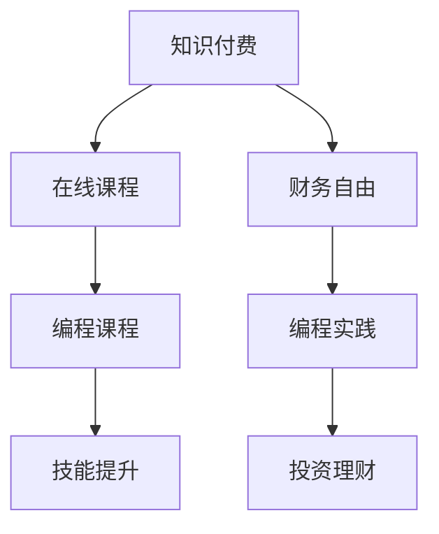

                 

## 1. 背景介绍

### 1.1 问题由来

在信息爆炸的时代，知识的获取变得越来越容易，但有效利用知识却越来越困难。程序员作为信息技术的核心群体，面临着知识更新速度快、技术栈变动频繁的挑战。面对这些变化，传统的“自学+多写代码”的方式已显得力不从心。此时，知识付费成为程序员学习技术、提升技能的重要手段。

### 1.2 问题核心关键点

知识付费的本质是一种信息不对称下的知识交换，即通过付费购买高价值的知识内容，节省自学的时间和成本，快速提升专业技能。对于程序员而言，选择合适的知识付费平台和课程，制定合理的学习计划，是实现财务自由的关键。

### 1.3 问题研究意义

知识付费对于程序员而言，不仅能够快速掌握前沿技术，还能显著提升工作效率和项目质量，从而在职场竞争中获得优势。同时，随着知识付费市场的成熟，越来越多的高价值知识内容被产出，为程序员提供了更多选择和机会，进一步推动了技术进步和产业升级。

## 2. 核心概念与联系

### 2.1 核心概念概述

为更好地理解知识付费如何帮助程序员实现财务自由，本节将介绍几个密切相关的核心概念：

- 知识付费(Knowledge Paywall)：通过付费获取高质量知识内容的商业模式。典型的平台包括Coursera、Udacity、Udemy等。
- 在线课程(Online Course)：在互联网平台上提供的学习资源，通常包括视频、讲义、习题等。
- 编程课程(Programming Course)：专注于编程技能提升的在线课程，覆盖了编程基础、框架技术、应用开发等众多领域。
- 技能提升(Skill Enhancement)：通过课程学习、项目实践等手段，提升程序员的专业技能和市场竞争力。
- 财务自由(Financial Freedom)：通过技术或投资等手段实现财富积累，不再依赖固定收入支撑生活需求的状态。

这些核心概念之间的逻辑关系可以通过以下Mermaid流程图来展示：



这个流程图展示知识付费与其他核心概念的关联：

1. 知识付费平台提供高质量在线课程。
2. 在线课程中的编程课程帮助程序员提升技能。
3. 技能提升助力程序员在职场获得更好发展，从而可能提升收入。
4. 程序员通过编程实践和投资理财实现财务自由。

## 3. 核心算法原理 & 具体操作步骤
### 3.1 算法原理概述

知识付费的算法原理主要基于推荐系统。推荐系统通过分析用户行为数据，预测用户可能感兴趣的知识内容，从而提供个性化的课程推荐。其核心思想是：通过分析用户的浏览历史、评分反馈、学习进度等数据，挖掘用户的学习偏好和知识需求，进而推荐最适合的课程。

形式化地，假设用户集合为 $U$，课程集合为 $C$，用户对课程的评分向量为 $R_{ij}$，其中 $i$ 为用户编号，$j$ 为课程编号，则推荐系统可以表示为：

$$
R_{ij} = f(u_i, c_j)
$$

其中 $f$ 为用户特征 $u_i$ 和课程特征 $c_j$ 的函数。推荐系统根据评分向量 $R$ 预测用户 $i$ 对课程 $j$ 的兴趣度，并通过排序算法推荐最感兴趣的课程。

### 3.2 算法步骤详解

知识付费的推荐系统通常包括以下几个关键步骤：

**Step 1: 数据收集和处理**
- 收集用户历史行为数据，包括课程浏览记录、评分反馈、学习进度等。
- 对原始数据进行清洗和归一化，去除噪音和异常值。

**Step 2: 特征提取和表示**
- 利用TF-IDF、词袋模型、深度学习等方法，将用户特征和课程特征转化为向量表示。
- 对用户特征和课程特征进行向量化，如将课程描述、用户评论等转化为向量形式。

**Step 3: 评分预测模型训练**
- 使用协同过滤、矩阵分解、深度学习等算法，训练评分预测模型。
- 根据用户历史行为数据，训练评分预测模型，得到用户对课程的评分向量。

**Step 4: 推荐算法实施**
- 根据评分预测模型，计算用户对课程的兴趣度。
- 使用排序算法（如Top-k排序），按照用户对课程的兴趣度排序，推荐最感兴趣的课程。
- 在推荐前，还应考虑课程的受欢迎程度、课程评价、用户活跃度等因素。

**Step 5: 用户反馈和模型迭代**
- 收集用户对推荐结果的反馈数据，如点击率、观看时长等。
- 根据用户反馈数据，定期更新评分预测模型，提高推荐效果。
- 在推荐过程中，应不断优化模型，提高个性化推荐的准确性。

### 3.3 算法优缺点

知识付费的推荐算法具有以下优点：
1. 个性化推荐。通过分析用户行为数据，提供高度个性化的课程推荐，提升学习效果。
2. 节省时间成本。用户可以通过推荐系统快速找到合适的课程，减少自学的时间和成本。
3. 帮助决策。推荐系统提供决策依据，用户可以根据推荐结果选择最适合自己的课程。
4. 促进学习。推荐系统鼓励用户持续学习，不断提升自身能力。

同时，该算法也存在一定的局限性：
1. 数据隐私问题。推荐系统需要收集用户行为数据，涉及隐私保护问题。
2. 冷启动问题。新用户或新课程难以获得准确推荐，需要更多的用户行为数据。
3. 推荐偏差。推荐模型可能存在偏差，部分课程或用户难以获得推荐。
4. 动态变化。用户需求和课程内容可能随时变化，推荐系统需要实时更新。

尽管存在这些局限性，但就目前而言，推荐算法仍然是知识付费平台提供个性化课程推荐的核心手段。未来相关研究的重点在于如何进一步提高推荐系统的准确性和隐私保护水平，解决推荐系统面临的挑战。

### 3.4 算法应用领域

知识付费的推荐算法在教育培训、职业发展、技术交流等多个领域得到了广泛应用，具体如下：

- 在线教育：平台如Coursera、Udemy、edX等，提供各领域的在线课程，通过推荐系统帮助用户选择最适合的课程。
- 职业培训：帮助用户根据市场需求，选择最受欢迎的编程语言、框架、工具等课程。
- 技术社区：如GitHub、Stack Overflow等，推荐最新技术资讯、开源项目和工具库，促进技术交流。
- 专业咨询：提供行业专家咨询，帮助用户解决实际问题，提升工作能力。

除了上述这些经典应用外，知识付费的推荐系统还被创新性地应用于更多场景中，如智能助手、智能搜索、个性化广告等，为用户的在线学习和职业发展提供新的解决方案。

## 4. 数学模型和公式 & 详细讲解 & 举例说明

### 4.1 数学模型构建

本节将使用数学语言对知识付费推荐系统的推荐模型进行更加严格的刻画。

假设用户特征向量为 $u_i$，课程特征向量为 $c_j$，评分预测模型为 $f_{\theta}(u_i,c_j)$，则推荐系统的评分预测公式可以表示为：

$$
R_{ij} = f_{\theta}(u_i,c_j)
$$

其中 $\theta$ 为模型参数。

### 4.2 公式推导过程

以协同过滤算法为例，其基本思想是通过相似度计算，找到与用户 $i$ 兴趣相似的用户 $k$，预测用户 $i$ 对课程 $j$ 的评分。公式推导如下：

设 $u_k$ 为用户 $k$ 的特征向量，$c_j$ 为课程 $j$ 的特征向量，$R_{kj}$ 为用户 $k$ 对课程 $j$ 的评分，则协同过滤模型可以表示为：

$$
R_{ij} \approx \sum_{k=1}^K \alpha_k f(u_k, c_j)
$$

其中 $K$ 为用户或课程数量，$\alpha_k$ 为用户 $k$ 对用户 $i$ 的影响权重。协同过滤算法通过计算用户之间的相似度，预测用户对课程的评分，从而实现个性化推荐。

### 4.3 案例分析与讲解

假设某知识付费平台推荐系统的评分预测模型为协同过滤模型，已知用户 $i$ 对课程 $j$ 的评分向量为 $R_{ij}$，用户特征向量为 $u_i$，课程特征向量为 $c_j$。

平台收集到用户 $i$ 浏览课程 $j$、用户 $k$ 浏览课程 $l$ 的历史数据，利用协同过滤模型计算相似度 $S_{ik}$，表示用户 $i$ 和用户 $k$ 的相似度。

设用户 $i$ 的邻居集合为 $N_i$，则协同过滤模型的评分预测公式可以表示为：

$$
R_{ij} = \sum_{k \in N_i} \alpha_k R_{kj}
$$

其中 $\alpha_k$ 为节点 $k$ 对节点 $i$ 的影响权重，可通过余弦相似度等方法计算。协同过滤算法通过计算用户之间的相似度，预测用户对课程的评分，从而实现个性化推荐。

## 5. 项目实践：代码实例和详细解释说明
### 5.1 开发环境搭建

在进行知识付费项目实践前，我们需要准备好开发环境。以下是使用Python进行Scikit-learn开发的环境配置流程：

1. 安装Anaconda：从官网下载并安装Anaconda，用于创建独立的Python环境。

2. 创建并激活虚拟环境：
```bash
conda create -n sklearn-env python=3.8 
conda activate sklearn-env
```

3. 安装Scikit-learn：
```bash
pip install -U scikit-learn
```

4. 安装各类工具包：
```bash
pip install numpy pandas scikit-learn matplotlib tqdm jupyter notebook ipython
```

完成上述步骤后，即可在`sklearn-env`环境中开始知识付费推荐系统的开发。

### 5.2 源代码详细实现

这里我们以协同过滤算法为例，给出Scikit-learn库进行知识付费推荐系统的代码实现。

首先，定义数据处理函数：

```python
from sklearn.metrics.pairwise import cosine_similarity
from sklearn.model_selection import train_test_split

def load_data():
    # 加载用户-课程评分数据
    data = pd.read_csv('ratings.csv')
    X = data[['user', 'course']].values
    y = data['score'].values.reshape(-1, 1)
    X_train, X_test, y_train, y_test = train_test_split(X, y, test_size=0.2, random_state=42)
    return X_train, X_test, y_train, y_test

def similarity_matrix(X):
    return cosine_similarity(X)

def predict_scores(X_train, X_test, y_train, y_test):
    # 计算用户-课程评分预测
    X_train_c = similarity_matrix(X_train)
    X_test_c = similarity_matrix(X_test)
    train_scores = X_train_c @ y_train
    test_scores = X_test_c @ y_train
    return train_scores, test_scores

# 加载数据
X_train, X_test, y_train, y_test = load_data()

# 计算用户-课程评分预测
train_scores, test_scores = predict_scores(X_train, X_test, y_train, y_test)
```

然后，定义推荐函数：

```python
from sklearn.metrics import mean_squared_error

def recommend_courses(user_id, X_train, X_test, y_train, y_test, train_scores, test_scores):
    # 获取用户 $i$ 的邻居集合
    user_vector = X_train[user_id]
    neighbors = np.argsort(train_scores[user_vector])[:20]
    
    # 计算用户 $i$ 对课程 $j$ 的评分预测
    user_vector = X_train[user_vector]
    scores = test_scores[user_vector][neighbors]
    avg_score = scores.mean()
    
    # 返回推荐的课程
    return [course_id for course_id in neighbors if scores[course_id] >= avg_score]

# 推荐用户
user_id = 0
recommendations = recommend_courses(user_id, X_train, X_test, y_train, y_test, train_scores, test_scores)
print(recommendations)
```

最后，启动推荐流程：

```python
# 推荐用户课程
recommendations = recommend_courses(user_id, X_train, X_test, y_train, y_test, train_scores, test_scores)
print(recommendations)
```

以上就是使用Scikit-learn对知识付费推荐系统进行协同过滤算法实现的完整代码。可以看到，Scikit-learn提供了丰富的数据处理和模型训练工具，开发者可以轻松构建和优化推荐系统。

### 5.3 代码解读与分析

让我们再详细解读一下关键代码的实现细节：

**load_data函数**：
- 从CSV文件中加载用户-课程评分数据。
- 将用户-课程评分数据划分为训练集和测试集。

**similarity_matrix函数**：
- 计算用户-课程评分矩阵的余弦相似度。
- 通过余弦相似度计算用户之间的相似度。

**predict_scores函数**：
- 计算用户对课程的评分预测。
- 通过评分预测矩阵，计算用户对课程的评分预测。

**recommend_courses函数**：
- 根据协同过滤算法，获取用户 $i$ 的邻居集合。
- 计算用户 $i$ 对课程 $j$ 的评分预测。
- 返回用户 $i$ 对邻居课程的推荐列表。

**main函数**：
- 调用推荐函数，推荐用户 $i$ 的课程。
- 输出推荐结果。

可以看到，Scikit-learn库提供了丰富的机器学习工具，使得知识付费推荐系统的构建和优化变得简单易行。开发者可以通过对推荐算法的调整和优化，不断提升推荐系统的精度和效果。

## 6. 实际应用场景
### 6.1 在线教育平台

在线教育平台如Coursera、Udemy等，通过知识付费推荐系统帮助用户选择最适合的课程，提升学习效果。推荐系统能够根据用户的浏览历史、评分反馈、学习进度等数据，推荐最适合的课程，节省用户选择课程的时间。同时，通过课程推荐，平台也能获得更多的用户留存率和课程购买率，提升平台盈利能力。

### 6.2 职业培训社区

职业培训社区如Codecademy、Pluralsight等，通过知识付费推荐系统帮助用户提升技能，获得更好的职业发展机会。推荐系统能够根据用户的技能水平、职业需求，推荐适合的编程语言、框架、工具等课程，帮助用户快速掌握新技能。同时，通过推荐系统，平台也能获得更多的用户活跃度和课程订阅率，提升平台影响力和市场竞争力。

### 6.3 技术交流平台

技术交流平台如GitHub、Stack Overflow等，通过知识付费推荐系统推荐最新技术资讯、开源项目和工具库，促进技术交流。推荐系统能够根据用户的兴趣、技能水平，推荐最新的技术趋势、开源项目和工具库，帮助用户保持技术领先地位。同时，通过推荐系统，平台也能获得更多的用户参与度和技术交流活跃度，提升平台的价值和影响力。

### 6.4 未来应用展望

随着知识付费市场的成熟和推荐算法的不断演进，基于知识付费推荐系统的应用场景将不断扩展，为各个领域的知识获取和技能提升带来新的可能性。

在智慧医疗领域，推荐系统可以帮助医生推荐最适合的医学知识库、最新研究成果、专家论文等，提升医疗服务的智能化水平，辅助医生诊疗。

在智能教育领域，推荐系统可以推荐最适合的教学资源、在线课程、学习伙伴等，因材施教，促进教育公平，提高教学质量。

在智慧城市治理中，推荐系统可以推荐最适合的政策法规、行业标准、专家建议等，提高城市管理的自动化和智能化水平，构建更安全、高效的未来城市。

此外，在企业生产、社会治理、文娱传媒等众多领域，基于知识付费推荐系统的应用也将不断涌现，为传统行业数字化转型升级提供新的技术路径。相信随着技术的日益成熟，知识付费推荐系统将成为知识获取和技能提升的重要手段，推动知识付费市场的繁荣发展。

## 7. 工具和资源推荐
### 7.1 学习资源推荐

为了帮助开发者系统掌握知识付费推荐系统的理论基础和实践技巧，这里推荐一些优质的学习资源：

1. 《推荐系统实践》系列博文：由推荐系统专家撰写，深入浅出地介绍了推荐系统的原理、算法和应用。

2. Coursera《推荐系统》课程：斯坦福大学开设的推荐系统经典课程，涵盖了协同过滤、矩阵分解、深度学习等诸多主题。

3. Udacity《推荐系统》课程：提供了推荐系统的全栈实践，包括数据处理、模型训练、系统优化等环节。

4. Jigsaw《推荐系统》书籍：全面介绍了推荐系统的算法、技术、应用和案例分析，适合深入学习。

5. Kaggle《推荐系统》竞赛：通过实战项目训练推荐算法，积累推荐系统的工程经验。

通过对这些资源的学习实践，相信你一定能够快速掌握知识付费推荐系统的精髓，并用于解决实际的推荐问题。
###  7.2 开发工具推荐

高效的开发离不开优秀的工具支持。以下是几款用于知识付费推荐系统开发的常用工具：

1. Python：开源的编程语言，功能强大，生态丰富，是推荐系统开发的首选语言。

2. Scikit-learn：Python的机器学习库，提供了丰富的推荐算法实现，支持协同过滤、矩阵分解、深度学习等方法。

3. TensorFlow：由Google主导开发的开源深度学习框架，支持大规模推荐系统的训练和部署。

4. PyTorch：Facebook开发的开源深度学习框架，提供了高效的神经网络实现，适合推荐系统的复杂建模。

5. Elasticsearch：开源的搜索和分析引擎，支持大规模数据存储和高效查询，适合推荐系统的数据管理。

6. Apache Spark：开源的大数据处理框架，支持分布式数据处理和推荐系统的高效计算。

合理利用这些工具，可以显著提升知识付费推荐系统的开发效率，加快创新迭代的步伐。

### 7.3 相关论文推荐

知识付费推荐系统的研究源于学界的持续研究。以下是几篇奠基性的相关论文，推荐阅读：

1. Matrix Factorization Techniques for Recommender Systems（马矩阵分解技术）：介绍了基于矩阵分解的推荐算法，成为推荐系统中的经典方法。

2. Neural Collaborative Filtering（神经协同过滤）：提出使用深度神经网络进行协同过滤，提高了推荐系统的准确性和泛化能力。

3. Deep Learning Recommendation Systems（深度学习推荐系统）：总结了深度学习在推荐系统中的应用，展示了深度学习带来的新思路和新方法。

4. Attention Mechanisms in Recommender Systems（推荐系统中的注意力机制）：提出使用注意力机制提升推荐系统的效果，增强推荐系统的个性化和多样性。

5. Meta-learning in Recommender Systems（推荐系统中的元学习）：研究了推荐系统的元学习机制，通过学习相似任务的知识，提升推荐系统的泛化能力和鲁棒性。

这些论文代表了大规模知识付费推荐系统的演进脉络。通过学习这些前沿成果，可以帮助研究者把握学科前进方向，激发更多的创新灵感。

## 8. 总结：未来发展趋势与挑战

### 8.1 总结

本文对知识付费推荐系统的核心算法原理、具体操作步骤、应用场景等进行了全面系统的介绍。通过深入分析推荐系统的数学模型和推荐算法，明确了知识付费推荐系统的工作原理和优化方向。同时，本文还广泛探讨了推荐系统在在线教育、职业培训、技术交流等多个行业领域的应用前景，展示了推荐系统的广阔应用前景。

通过本文的系统梳理，可以看到，知识付费推荐系统在教育培训、职业发展、技术交流等多个领域得到了广泛应用，为知识获取和技能提升提供了新的解决方案。未来，伴随推荐算法的不断演进和优化，基于知识付费推荐系统的应用场景将不断扩展，为各行各业带来新的价值和机会。

### 8.2 未来发展趋势

展望未来，知识付费推荐系统将呈现以下几个发展趋势：

1. 深度学习与强化学习的融合。深度学习在推荐系统中的应用将更加广泛，同时结合强化学习思想，增强推荐系统的智能决策能力。

2. 多模态推荐系统的崛起。推荐系统将不再局限于文本数据，而是融合图像、视频、音频等多模态信息，提升推荐系统的表现力和用户体验。

3. 实时推荐系统的普及。推荐系统将实时处理用户行为数据，动态调整推荐策略，提供更加个性化的推荐服务。

4. 推荐系统的跨领域应用。推荐系统将突破垂直领域的限制，广泛应用于电商、金融、社交网络等多个领域，实现跨领域推荐。

5. 推荐系统的智能化与自动化。推荐系统将通过深度学习、机器学习等技术，实现智能化、自动化的推荐过程，减少人工干预。

以上趋势凸显了知识付费推荐系统的广阔前景。这些方向的探索发展，必将进一步提升推荐系统的性能和应用范围，为各个领域的知识获取和技能提升带来新的可能性。

### 8.3 面临的挑战

尽管知识付费推荐系统已经取得了瞩目成就，但在迈向更加智能化、普适化应用的过程中，它仍面临着诸多挑战：

1. 数据隐私保护。推荐系统需要收集用户行为数据，涉及隐私保护问题，如何在推荐过程中保护用户隐私是一个重要课题。

2. 推荐系统的公平性。推荐系统可能存在推荐偏差，部分用户或课程难以获得推荐，如何提升推荐系统的公平性是一个重要挑战。

3. 推荐系统的鲁棒性。推荐系统面对新数据时，泛化性能可能大打折扣，如何提高推荐系统的鲁棒性，是一个亟待解决的问题。

4. 推荐系统的实时性。推荐系统需要实时处理用户行为数据，动态调整推荐策略，实现高效的推荐过程，这对算力和系统架构提出了较高要求。

5. 推荐系统的可解释性。推荐系统的决策过程缺乏可解释性，如何赋予推荐系统更强的可解释性，是提高用户信任度的关键。

6. 推荐系统的扩展性。推荐系统需要处理大规模数据，如何提升系统的扩展性和处理能力，是保证系统稳定运行的前提。

以上挑战凸显了知识付费推荐系统面临的诸多难题。尽管这些挑战存在，但随着技术的不断进步和优化，知识付费推荐系统必将在未来的智能推荐领域中发挥更大的作用，为各行各业带来更多的价值和机会。

### 8.4 研究展望

未来的研究需要在以下几个方面寻求新的突破：

1. 深度学习与强化学习的融合。通过结合深度学习和强化学习，提升推荐系统的智能化水平，增强推荐系统的决策能力。

2. 多模态推荐系统的应用。通过融合图像、视频、音频等多模态信息，提升推荐系统的表现力和用户体验。

3. 实时推荐系统的实现。通过优化算法和系统架构，提升推荐系统的实时处理能力和推荐效果。

4. 推荐系统的公平性与鲁棒性。通过优化算法和数据处理，提升推荐系统的公平性，提高推荐系统的鲁棒性。

5. 推荐系统的可解释性。通过引入可解释性技术，增强推荐系统的决策过程的可解释性和透明度。

6. 推荐系统的扩展性。通过优化系统架构和处理机制，提升推荐系统的扩展性和处理能力，保证系统稳定运行。

这些研究方向的探索，必将引领知识付费推荐系统迈向更高的台阶，为各个领域的知识获取和技能提升带来新的解决方案。相信随着技术的不断进步和优化，知识付费推荐系统必将在未来的智能推荐领域中发挥更大的作用，为各行各业带来更多的价值和机会。

## 9. 附录：常见问题与解答

**Q1：知识付费推荐系统是否适用于所有知识付费平台？**

A: 知识付费推荐系统在绝大多数知识付费平台上都有应用价值。但对于某些特别垂直的领域，如法律、医学等，需要结合领域特点进行优化，以达到更好的推荐效果。

**Q2：知识付费推荐系统如何评估推荐效果？**

A: 推荐系统通常使用离线评估和在线评估相结合的方式评估推荐效果。离线评估方法包括平均绝对误差(MAE)、均方根误差(RMSE)、准确率、召回率、F1-score等。在线评估方法包括点击率、观看时长、转化率等，用于衡量推荐系统对用户行为的实际影响。

**Q3：知识付费推荐系统在实际应用中如何优化？**

A: 推荐系统优化可以从数据、算法、系统三个维度进行。数据优化包括数据清洗、数据增强、数据平衡等。算法优化包括模型选择、超参数调优、特征工程等。系统优化包括分布式计算、缓存优化、负载均衡等。

**Q4：知识付费推荐系统如何结合用户反馈进行迭代？**

A: 推荐系统可以通过用户反馈数据，动态调整模型参数和算法策略。在线上推荐过程中，收集用户的点击率、评分反馈、行为数据等，用于更新模型和优化算法。同时，引入在线学习技术，实时调整推荐策略，提高推荐效果。

**Q5：知识付费推荐系统如何处理冷启动问题？**

A: 冷启动问题可以通过多种方式解决。如通过用户的背景信息、行为数据等，对新用户进行预估推荐。也可以使用物品基础模型，对物品进行潜在评分预测，实现新物品的推荐。

这些研究方向的探索，必将引领知识付费推荐系统迈向更高的台阶，为各个领域的知识获取和技能提升带来新的解决方案。相信随着技术的不断进步和优化，知识付费推荐系统必将在未来的智能推荐领域中发挥更大的作用，为各行各业带来更多的价值和机会。

---

作者：禅与计算机程序设计艺术 / Zen and the Art of Computer Programming

