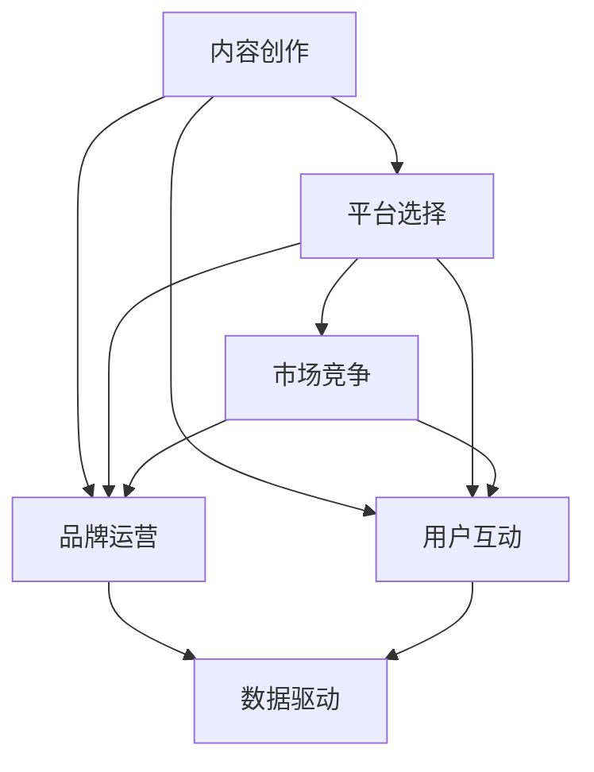

                 

# 知识付费赚钱的关键：打造个人IP与品牌

## 1. 背景介绍

### 1.1 问题由来
随着互联网技术的飞速发展，知识付费成为互联网经济的新蓝海，越来越多的用户愿意为获取优质内容付费。知识付费不仅为用户提供了便捷的学习渠道，也为内容创作者提供了变现途径。在知识付费的浪潮中，如何打造个人IP与品牌，成为内容创作者赚钱的根本关键。

### 1.2 问题核心关键点
打造个人IP与品牌，需要创作者具备综合的能力，包括但不限于内容创作、市场营销、用户运营等。本文将从内容创作、平台选择、品牌运营、用户互动等方面，系统性地探讨如何通过知识付费实现变现，并建立长期可持续发展的个人IP与品牌。

### 1.3 问题研究意义
打造个人IP与品牌，对于知识付费变现至关重要。良好的个人品牌能够提升内容的影响力，吸引更多用户关注和付费。通过系统性地打造和运营个人IP与品牌，创作者可以提升自身的市场竞争力，实现长期稳定发展。同时，成功的个人IP与品牌建设，可以为创作者带来更广泛的社会认可与商业机会，甚至形成跨界合作的强大网络效应。

## 2. 核心概念与联系

### 2.1 核心概念概述

为了更好地理解知识付费变现的策略，本节将介绍几个密切相关的核心概念：

- **内容创作（Content Creation）**：创作者通过平台提供的工具和资源，制作有价值的内容，并根据用户需求进行调整和优化。
- **平台选择（Platform Selection）**：创作者需要选择合适的知识付费平台，如微信读书、得到、知乎等，以便最大化自身的流量和收益。
- **品牌运营（Brand Operation）**：通过建立品牌形象，提升内容的商业价值，吸引更多的用户关注和付费。
- **用户互动（User Interaction）**：与用户建立良好互动关系，提升用户粘性和忠诚度。
- **市场竞争（Market Competition）**：知识付费市场中，存在着众多竞争对手，如何差异化自身内容，吸引更多用户，是品牌成功的重要因素。
- **数据驱动（Data-Driven）**：利用数据分析工具，优化内容策略和运营方案，提高收益。

这些概念之间的逻辑关系可以通过以下Mermaid流程图来展示：



这个流程图展示了一系列相关概念的逻辑关系：

1. 创作者需要创作有价值的内容，并选择合适的平台进行发布。
2. 通过品牌运营提升内容的商业价值，吸引更多用户。
3. 利用数据驱动优化内容策略和运营方案。
4. 与用户建立良好互动关系，提升用户粘性。
5. 关注市场竞争动态，差异化自身内容。

## 3. 核心算法原理 & 具体操作步骤
### 3.1 算法原理概述

知识付费变现的核心算法原理，是利用高质量的内容和有效的运营策略，提升内容的商业价值，并最大化收益。具体来说，包括以下几个步骤：

1. **内容创作**：制作高质量、有价值的内容，满足用户需求。
2. **平台选择**：选择与自身内容匹配度高的平台，最大化流量和收益。
3. **品牌运营**：建立独特的品牌形象，提升内容的商业价值，吸引更多用户。
4. **用户互动**：与用户建立良好互动关系，提升用户粘性和忠诚度。
5. **市场竞争**：关注市场竞争动态，差异化自身内容。
6. **数据驱动**：利用数据分析工具，优化内容策略和运营方案。

### 3.2 算法步骤详解

基于上述算法原理，知识付费变现的具体操作步骤如下：

**Step 1: 内容创作**
- **识别用户需求**：通过市场调研、用户反馈等方式，识别用户的需求和痛点。
- **制作内容**：根据用户需求，制作有价值的内容，如电子书、在线课程、音频、视频等。
- **内容优化**：根据用户反馈，持续优化和改进内容。

**Step 2: 平台选择**
- **平台调研**：了解不同知识付费平台的特点和优劣势，如用户数量、内容质量、分发机制等。
- **平台入驻**：选择合适的平台进行入驻，并根据平台要求上传和管理内容。

**Step 3: 品牌运营**
- **建立品牌形象**：通过设计独特的LOGO、标语、风格等，建立独特的品牌形象。
- **内容营销**：在社交媒体、个人博客、视频平台等渠道推广品牌，提升知名度。
- **用户互动**：积极与用户互动，如通过留言、私信等方式获取反馈，提升用户满意度。

**Step 4: 用户互动**
- **建立社群**：在社交媒体、知识付费平台等建立社群，与用户进行互动交流。
- **在线课程**：开设在线课程，与用户进行实时互动，解答问题。
- **反馈机制**：建立用户反馈机制，及时响应用户需求和意见。

**Step 5: 市场竞争**
- **关注行业动态**：通过订阅行业报告、参与行业会议等方式，关注市场竞争动态。
- **差异化策略**：根据市场调研结果，制定差异化的内容策略，如细分领域、个性化服务等。
- **跨界合作**：与其他领域的创作者进行合作，扩大品牌影响力。

**Step 6: 数据驱动**
- **数据分析**：利用数据分析工具，如Google Analytics、百度统计等，分析用户行为和内容表现。
- **优化策略**：根据数据分析结果，优化内容策略和运营方案，提升收益。
- **持续改进**：根据市场变化和用户反馈，持续改进内容和运营策略。

### 3.3 算法优缺点

知识付费变现的算法有以下优点：

- **内容多样化**：能够覆盖更多用户需求，满足不同用户的需求和偏好。
- **高收益**：通过高质量的内容和有效的运营策略，实现高收益。
- **品牌提升**：通过建立品牌形象，提升内容的影响力和商业价值。
- **用户粘性**：与用户建立良好互动关系，提升用户粘性和忠诚度。

同时，该算法也存在一定的局限性：

- **投入高**：内容创作和品牌运营需要大量的时间和资源投入。
- **市场竞争激烈**：知识付费市场中，存在着众多竞争对手，获取流量和用户需要付出大量努力。
- **用户需求变化快**：用户需求和市场趋势变化快，需要创作者持续跟踪和调整。

尽管存在这些局限性，但就目前而言，知识付费变现仍然是最主流和有效的变现方式之一。未来相关研究的重点在于如何进一步降低内容和运营成本，提高用户粘性和转化率，同时兼顾可扩展性和可操作性等因素。

### 3.4 算法应用领域

知识付费变现的方法在诸多领域都有应用，包括但不限于：

- **教育**：通过在线课程和电子书，提供高质量的教育资源，满足不同学习者的需求。
- **健康**：通过健康类内容，如营养餐谱、运动指导等，提升用户健康水平。
- **理财**：通过理财类内容，如投资技巧、财务规划等，帮助用户实现财富增值。
- **情感**：通过心理咨询、情感指导等内容，帮助用户解决情感问题。
- **职业技能**：通过职业技能培训内容，如编程、设计等，提升用户的职业技能。

除了上述这些经典领域，知识付费变现也被创新性地应用到更多场景中，如亲子教育、职场发展、游戏指导等，为知识变现提供了更广阔的应用空间。

## 4. 数学模型和公式 & 详细讲解  
### 4.1 数学模型构建

知识付费变现的数学模型，通常涉及以下几个关键变量：

- **内容价值（Content Value）**：内容的有用性和受欢迎程度，可通过用户反馈、阅读量、评分等方式衡量。
- **平台流量（Platform Traffic）**：平台提供的流量和曝光度，可通过访问量、注册用户数等衡量。
- **用户转化率（User Conversion Rate）**：用户从浏览到付费的转化率，可通过付费用户数、付费金额等衡量。
- **市场竞争程度（Market Competition）**：市场竞争程度，可通过竞争对手数量、市场份额等衡量。

假设知识付费变现的收益（Revenue）为R，内容价值为C，平台流量为T，用户转化率为U，市场竞争程度为M，则收益模型可以表示为：

$$
R = C \times T \times U \times (1 - M)
$$

其中，(1 - M)表示由于竞争而导致的收益减少比例。

### 4.2 公式推导过程

在上述收益模型的基础上，我们可以通过以下步骤推导内容价值、平台流量和用户转化率之间的关系：

1. **内容价值与平台流量**：
   - 内容价值高，能吸引更多用户，平台流量增加。
   - 平台流量增加，有助于内容的传播和推广，提升内容价值。

2. **内容价值与用户转化率**：
   - 内容价值高，用户更有可能进行付费，用户转化率增加。
   - 用户转化率增加，有助于提升收益。

3. **用户转化率与市场竞争程度**：
   - 市场竞争程度低，用户转化率较高，收益较高。
   - 市场竞争程度高，用户转化率较低，收益较低。

综合以上分析，我们可以得出以下推论：

- 内容价值、平台流量和用户转化率之间存在正向关系。
- 市场竞争程度对收益有负向影响。

### 4.3 案例分析与讲解

**案例1：知乎Live**
- **内容价值**：知乎Live邀请多位行业专家进行在线讲解，内容价值较高。
- **平台流量**：知乎平台拥有庞大的用户群体，提供大量曝光。
- **用户转化率**：由于专家品牌效应，用户转化率较高。
- **市场竞争**：知乎Live在知识付费市场中的竞争相对较低，收益相对较高。

**案例2：得到App**
- **内容价值**：得到App汇集了多位知名作家的书籍解读、在线课程等，内容价值较高。
- **平台流量**：得到App通过用户口碑传播，流量增长较快。
- **用户转化率**：得到App通过持续优化内容和用户运营，用户转化率较高。
- **市场竞争**：得到App面临众多竞争对手，需要不断创新和改进，以保持竞争力。

## 5. 项目实践：代码实例和详细解释说明
### 5.1 开发环境搭建

在进行知识付费变现的实践前，我们需要准备好开发环境。以下是使用Python进行代码开发的环境配置流程：

1. 安装Python：确保系统中已经安装Python，如Python 3.8及以上版本。
2. 安装Flask框架：通过pip命令安装Flask，用于搭建Web应用程序。
3. 安装SQLite数据库：通过pip命令安装SQLite，用于存储用户信息和交易数据。
4. 安装Jupyter Notebook：通过pip命令安装Jupyter Notebook，用于编写和测试代码。
5. 安装PyTorch：通过conda命令安装PyTorch，用于制作和优化内容。

完成上述步骤后，即可在本地环境中开始知识付费变现的实践。

### 5.2 源代码详细实现

下面以知乎Live为例，给出使用Flask和SQLite进行知识付费变现的代码实现。

首先，定义知乎Live的内容模型：

```python
from flask_sqlalchemy import SQLAlchemy

db = SQLAlchemy(app)

class Lecture(db.Model):
    id = db.Column(db.Integer, primary_key=True)
    title = db.Column(db.String(255))
    description = db.Column(db.Text)
    salary = db.Column(db.Float)
    comments = db.Column(db.Text)
    lecturer = db.Column(db.String(255))
    created_at = db.Column(db.DateTime, default=datetime.datetime.utcnow)
    updated_at = db.Column(db.DateTime, default=datetime.datetime.utcnow)
```

然后，定义知乎Live的路由和视图函数：

```python
from flask import render_template, request, redirect, url_for

@app.route('/')
def index():
    lectures = Lecture.query.all()
    return render_template('index.html', lectures=lectures)

@app.route('/lectures/<int:id>')
def lecture(id):
    lecture = Lecture.query.get(id)
    return render_template('lecture.html', lecture=lecture)

@app.route('/register', methods=['GET', 'POST'])
def register():
    if request.method == 'POST':
        lecturer = request.form.get('lecturer')
        title = request.form.get('title')
        description = request.form.get('description')
        salary = request.form.get('salary')
        comments = request.form.get('comments')
        lecture = Lecture(title=title, description=description, salary=salary, comments=comments, lecturer=lecturer)
        db.session.add(lecture)
        db.session.commit()
        return redirect(url_for('index'))
    return render_template('register.html')

@app.route('/logout')
def logout():
    session.pop('username', None)
    return redirect(url_for('index'))
```

最后，启动Flask服务：

```python
if __name__ == '__main__':
    app.run(debug=True)
```

以上就是使用Flask和SQLite进行知乎Live知识付费变现的完整代码实现。可以看到，Flask框架使得知乎Live的搭建变得简洁高效。

### 5.3 代码解读与分析

让我们再详细解读一下关键代码的实现细节：

**Lecture模型**：
- `id`：内容ID，自动生成。
- `title`：内容标题。
- `description`：内容描述。
- `salary`：内容售价。
- `comments`：用户评论。
- `lecturer`：讲师名称。
- `created_at`：内容创建时间。
- `updated_at`：内容更新时间。

**Flask路由**：
- `@app.route('/')`：首页路由，显示所有内容。
- `@app.route('/lectures/<int:id>')`：内容详情页路由，显示单个内容。
- `@app.route('/register', methods=['GET', 'POST'])`：内容创建路由，创建新内容。
- `@app.route('/logout')`：登出路由，清除会话信息。

**模板文件**：
- `index.html`：首页模板，显示所有内容列表。
- `lecture.html`：内容详情模板，显示单个内容信息。
- `register.html`：内容创建模板，提供内容创建的表单。

在实际应用中，还需要考虑更多的因素，如用户认证、支付接口、内容审核等。但核心的知识付费变现流程基本与此类似。

## 6. 实际应用场景
### 6.1 教育行业

知识付费在教育行业的应用，可以为学生提供个性化、灵活的学习资源。通过在线课程、电子书、视频等形式，满足不同学习者的需求。

**实际应用**：某在线教育平台通过知识付费变现，为学生提供高质量的在线课程和电子书，覆盖从小学到大学的各个学科和领域。平台通过邀请知名教师进行课程录制，吸引大量学生付费学习。同时，平台通过数据分析和用户反馈，不断优化课程内容和教学方法，提升用户体验和满意度。

**效果**：平台累计注册用户超过百万，月付费用户数稳定增长，收益逐年提升。平台品牌形象显著提升，在教育行业的市场份额不断扩大。

### 6.2 健康行业

知识付费在健康行业的应用，可以为用户提供专业的健康指导和知识普及。通过健康类内容，如营养餐谱、运动指导等，提升用户的健康水平。

**实际应用**：某健康类知识付费平台通过内容付费，提供全面的健康知识和指导，如营养餐谱、运动指导、心理疏导等。平台通过与专业医疗机构合作，推出专业课程和健康咨询，吸引大量用户付费学习。同时，平台通过数据分析和用户反馈，不断优化内容和运营策略，提升用户粘性和满意度。

**效果**：平台累计注册用户超过50万，月付费用户数持续增长，收益显著提升。平台品牌形象显著提升，在健康行业的市场份额不断扩大。

### 6.3 职场发展

知识付费在职场发展中的应用，可以为职场人提供职业技能培训和职业规划指导。通过职业技能培训内容，如编程、设计等，提升用户的职业技能。

**实际应用**：某职场发展类知识付费平台通过内容付费，提供全面的职业技能培训和职业规划指导。平台通过邀请行业专家进行课程录制，吸引大量职场人付费学习。同时，平台通过数据分析和用户反馈，不断优化课程内容和职业规划方法，提升用户体验和满意度。

**效果**：平台累计注册用户超过30万，月付费用户数稳定增长，收益逐年提升。平台品牌形象显著提升，在职场发展行业的市场份额不断扩大。

### 6.4 未来应用展望

随着知识付费市场的不断成熟，知识付费变现的应用场景将进一步扩展，覆盖更多行业和领域。

- **亲子教育**：通过亲子教育类内容，如早教课程、亲子阅读指导等，满足家长和孩子的需求。
- **游戏指导**：通过游戏指导类内容，如游戏攻略、电竞技巧等，提升游戏玩家的水平。
- **职业咨询**：通过职业咨询类内容，如求职指导、职业规划等，提升用户的职业竞争力。
- **旅游攻略**：通过旅游攻略类内容，如目的地介绍、旅行建议等，提升用户的旅行体验。

## 7. 工具和资源推荐
### 7.1 学习资源推荐

为了帮助创作者系统掌握知识付费变现的理论基础和实践技巧，这里推荐一些优质的学习资源：

1. **《知识付费变现：从0到1》**：系统介绍了知识付费变现的策略和实战案例，涵盖内容创作、平台选择、品牌运营等多个方面。
2. **《知识付费变现实战指南》**：详细讲解了知识付费变现的详细步骤和工具，提供了丰富的代码示例和实战经验。
3. **《内容变现之道：从内容到收入》**：深入探讨了内容创作的价值和变现模式，提供了实用的内容创作策略。
4. **《知识付费变现：案例分析》**：精选了多个知识付费变现的优秀案例，展示了不同行业的成功经验。
5. **《知识付费变现：数据驱动》**：详细讲解了数据分析在知识付费变现中的应用，提供了实用的数据分析工具和技巧。

通过对这些资源的学习实践，相信你一定能够快速掌握知识付费变现的精髓，并用于解决实际的变现问题。

### 7.2 开发工具推荐

高效的开发离不开优秀的工具支持。以下是几款用于知识付费变现开发的常用工具：

1. **Flask框架**：轻量级Web框架，支持动态路由、模板渲染、数据库集成等功能，适合快速迭代研究。
2. **SQLite数据库**：轻量级关系型数据库，支持Python编程语言，适合快速开发和测试。
3. **Jupyter Notebook**：交互式编程环境，支持Python、R、SQL等多种语言，适合数据处理和算法开发。
4. **PyTorch**：深度学习框架，支持动态图和静态图，适合深度学习模型的开发和优化。
5. **Google Analytics**：数据分析工具，支持网站流量、用户行为等数据的详细分析。

合理利用这些工具，可以显著提升知识付费变现任务的开发效率，加快创新迭代的步伐。

### 7.3 相关论文推荐

知识付费变现的研究源于学界的持续研究。以下是几篇奠基性的相关论文，推荐阅读：

1. **《知识付费：从模式到市场》**：探讨了知识付费的市场模式、用户需求和内容价值，提供了系统的市场分析框架。
2. **《知识付费变现策略研究》**：深入分析了知识付费变现的策略和工具，提供了实用的变现建议。
3. **《内容创作与知识付费变现》**：探讨了内容创作在知识付费变现中的作用和价值，提供了实用的内容创作策略。
4. **《数据分析在知识付费变现中的应用》**：详细讲解了数据分析在知识付费变现中的应用，提供了实用的数据分析方法。

这些论文代表了大语言模型微调技术的发展脉络。通过学习这些前沿成果，可以帮助研究者把握学科前进方向，激发更多的创新灵感。

## 8. 总结：未来发展趋势与挑战
### 8.1 总结

本文对知识付费变现的策略进行了全面系统的介绍。首先阐述了知识付费变现的研究背景和意义，明确了变现策略在内容创作、平台选择、品牌运营、用户互动等方面的重要性。其次，从算法原理到具体操作步骤，详细讲解了知识付费变现的数学模型和实际应用流程，提供了详细的代码实例和解读。同时，本文还广泛探讨了知识付费变现在教育、健康、职场等多个领域的应用前景，展示了变现策略的巨大潜力。

通过本文的系统梳理，可以看到，知识付费变现已经成为内容创作者的重要变现手段，能够通过高质量的内容和有效的运营策略，实现高收益。未来，随着知识付费市场的不断成熟，知识付费变现的应用场景将进一步扩展，覆盖更多行业和领域，为内容创作者提供更多商业机会。

### 8.2 未来发展趋势

展望未来，知识付费变现将呈现以下几个发展趋势：

1. **内容多元化**：能够覆盖更多用户需求，满足不同用户的需求和偏好。
2. **高收益**：通过高质量的内容和有效的运营策略，实现高收益。
3. **品牌提升**：通过建立品牌形象，提升内容的影响力和商业价值。
4. **用户粘性**：与用户建立良好互动关系，提升用户粘性和忠诚度。

### 8.3 面临的挑战

尽管知识付费变现已经取得了瞩目成就，但在迈向更加智能化、普适化应用的过程中，它仍面临着诸多挑战：

1. **内容创作成本高**：高质量内容的制作需要大量时间和资源投入，如何降低内容创作成本，提升创作效率，将是重要的研究方向。
2. **平台竞争激烈**：知识付费市场中，存在着众多竞争对手，获取流量和用户需要付出大量努力。如何差异化自身内容，吸引更多用户，是品牌成功的重要因素。
3. **用户需求变化快**：用户需求和市场趋势变化快，需要创作者持续跟踪和调整。如何及时响应用户需求，保持内容的时效性和相关性，是运营的关键。
4. **用户付费意愿低**：部分用户对知识付费的付费意愿较低，如何提升用户付费意愿，增强平台粘性，是变现的重要因素。
5. **数据分析复杂**：知识付费变现涉及大量数据分析工作，如何高效进行数据分析，提供科学决策依据，是运营的重要保障。

尽管存在这些挑战，但就目前而言，知识付费变现仍然是最主流和有效的变现方式之一。未来相关研究的重点在于如何进一步降低内容创作和运营成本，提高用户粘性和转化率，同时兼顾可扩展性和可操作性等因素。

### 8.4 研究展望

面对知识付费变现所面临的种种挑战，未来的研究需要在以下几个方面寻求新的突破：

1. **降低内容创作成本**：开发更加自动化、高效的内容创作工具，提升创作效率。
2. **差异化内容策略**：根据市场需求和用户反馈，制定差异化的内容策略，提升内容竞争力和市场份额。
3. **用户画像分析**：利用数据分析工具，构建用户画像，精准定位用户需求，提升内容适配性。
4. **个性化推荐**：通过推荐系统，推荐用户可能感兴趣的内容，提高用户粘性和转化率。
5. **数据驱动运营**：利用数据分析工具，优化内容策略和运营方案，提高收益。

这些研究方向的探索，必将引领知识付费变现技术迈向更高的台阶，为内容创作者提供更加高效、可靠、可持续的变现路径。面向未来，知识付费变现需要从内容创作、平台运营、品牌建设等多个维度协同发力，共同推动知识付费变现技术的进步。

## 9. 附录：常见问题与解答
----------------------------------------------------------------
> 1. **如何选择合适的知识付费平台？**
   - **平台用户量**：选择用户量大的平台，能够提供更多曝光机会。
   - **平台特色**：选择与自身内容匹配度高的平台，最大化流量和收益。
   - **平台规则**：了解平台的规则和要求，避免违规操作。

> 2. **如何提高内容创作效率？**
   - **自动化工具**：使用内容创作自动化工具，如Grammarly、Hemingway等，提升内容质量。
   - **模板和框架**：使用内容创作模板和框架，快速生成高质量内容。
   - **批量生产**：通过批量生成内容，提升创作效率。

> 3. **如何提升用户付费意愿？**
   - **高质量内容**：提供高质量、有价值的内容，满足用户需求。
   - **用户互动**：与用户建立良好互动关系，提升用户满意度和粘性。
   - **优惠和奖励**：提供优惠和奖励，激励用户付费。

> 4. **如何提升用户粘性？**
   - **社群建设**：在社交媒体、知识付费平台等建立社群，与用户进行互动交流。
   - **课程更新**：持续更新内容，保持内容的时效性和相关性。
   - **用户反馈**：积极响应用户反馈，不断优化内容和服务。

> 5. **如何优化数据分析？**
   - **数据采集工具**：使用Google Analytics、百度统计等数据采集工具，获取用户行为和内容表现数据。
   - **数据分析模型**：利用数据分析模型，如聚类、回归等，分析用户行为和内容效果。
   - **可视化工具**：使用Tableau、Power BI等可视化工具，呈现数据分析结果，提供科学决策依据。

通过以上解答，相信你一定能够更好地掌握知识付费变现的策略和技巧，实现变现目标，并建立长期可持续发展的个人IP与品牌。

---

作者：禅与计算机程序设计艺术 / Zen and the Art of Computer Programming

