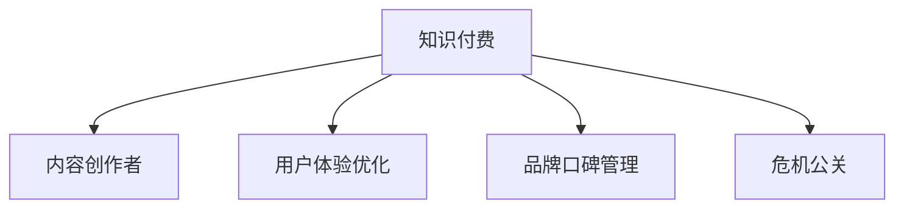

                 

# 知识付费赚钱的品牌口碑管理与危机公关

> 关键词：知识付费,品牌管理,口碑维护,危机公关,用户体验

## 1. 背景介绍

### 1.1 问题由来
随着互联网和数字经济的发展，知识付费成为一种新型的商业模式。越来越多的平台和内容创作者开始通过知识付费来获取收益，为优质内容创造更多价值。然而，知识付费市场竞争激烈，且用户对内容质量、平台服务、用户体验等要求越来越高，品牌口碑管理和危机公关在知识付费领域显得尤为重要。

品牌口碑直接影响用户对知识付费平台的信任度和忠诚度，进而影响平台收益和长期发展。而当品牌面临信任危机、负面事件时，如何妥善处理危机公关，保护品牌形象，也是亟待解决的难题。

### 1.2 问题核心关键点
- **品牌口碑管理**：通过有效的品牌管理策略，塑造和提升平台和内容创作者的正面形象，增强用户对品牌的信任和粘性。
- **危机公关**：当品牌或平台遭遇负面事件时，通过及时、透明、有效的应对措施，挽回品牌声誉，避免或减轻负面影响。
- **用户体验优化**：持续优化知识付费平台的用户体验，确保用户价值最大化，提升用户满意度。

## 2. 核心概念与联系

### 2.1 核心概念概述

- **品牌口碑管理**：指品牌通过有效的市场推广、内容营销、用户体验优化等策略，提升品牌形象，增强用户对品牌的信任和好感度。
- **危机公关**：指品牌在遭遇负面事件时，通过迅速、透明、诚恳的公关措施，挽回品牌声誉，化解危机，维护品牌形象。
- **用户体验优化**：指平台通过技术改进、功能完善、内容更新等手段，不断提升用户在使用知识付费平台时的便捷性和满意度。
- **知识付费**：指用户为获取知识和信息而支付费用的模式，包括订阅、单次购买、社区分享等多种形式。
- **内容创作者**：指通过平台提供的内容或课程获取收入的人，包括知名专家、学者、行业从业者等。

这些核心概念之间的关系如图示：



## 3. 核心算法原理 & 具体操作步骤

### 3.1 算法原理概述

品牌口碑管理和危机公关的核心在于通过数据驱动的策略和沟通手段，构建和维护用户对品牌的正面认知。具体来说，品牌通过分析用户反馈、监控舆论动态、优化服务质量等方式，实现对品牌形象的有效管理和修复。

危机公关的算法原理主要基于以下几个步骤：
1. **监控与识别**：利用大数据和人工智能技术，实时监控品牌相关的负面信息，识别潜在危机。
2. **分析和评估**：分析负面信息的原因和影响范围，评估危机程度。
3. **应对与沟通**：制定应对策略，通过多渠道沟通方式，透明、诚恳地处理危机。
4. **效果评估与调整**：评估应对效果，调整策略，持续改进危机公关管理。

### 3.2 算法步骤详解

品牌口碑管理和危机公关的具体操作步骤可以分为以下几个步骤：

**步骤1：数据收集与分析**

- 通过社交媒体、论坛、评论、反馈表单等渠道，收集用户对品牌或平台的态度和反馈。
- 利用自然语言处理技术（NLP），对收集到的文本数据进行情感分析和主题挖掘，识别品牌形象和用户需求。
- 定期进行品牌形象调查，收集用户对品牌满意度、信任度、忠诚度的数据。

**步骤2：反馈与沟通**

- 根据用户反馈，识别品牌或平台存在的问题，及时调整策略。
- 通过社交媒体、客服热线、在线客服等方式，及时回应用户的问题和建议，建立良好的用户沟通渠道。
- 发布官方声明、博客文章、视频访谈等形式，向用户传递品牌价值和企业文化。

**步骤3：内容优化与创新**

- 基于用户反馈和市场趋势，优化平台功能、内容和推荐算法，提升用户体验。
- 与内容创作者合作，推出高质量、有创意的课程和内容，吸引用户订阅。
- 定期举办线上线下活动，增强用户与品牌之间的互动。

**步骤4：危机应对与公关**

- 在监测到负面信息后，迅速评估危机影响和原因，制定应对策略。
- 通过官方声明、新闻发布会、媒体采访等方式，透明、诚恳地回应危机。
- 与受影响的用户和合作伙伴沟通，提供解决方案，减轻负面影响。

**步骤5：效果评估与调整**

- 定期评估品牌口碑和用户满意度，进行品牌形象调查。
- 根据危机应对效果，调整危机公关策略，持续改进品牌管理。

### 3.3 算法优缺点

品牌口碑管理和危机公关的算法具有以下优点：
- **数据驱动**：通过分析用户数据，实现科学决策和优化。
- **透明沟通**：通过透明、诚恳的沟通，增强用户对品牌的信任。
- **即时响应**：能够迅速响应负面信息，减轻危机影响。

同时，也存在一些局限性：
- **数据隐私**：收集和分析用户数据可能引发隐私问题。
- **成本高**：技术开发和运营维护成本较高。
- **不确定性**：社交媒体和用户反馈的不确定性可能导致误解和误判。

### 3.4 算法应用领域

品牌口碑管理和危机公关在知识付费领域有广泛的应用，具体包括以下几个方面：

- **平台品牌形象塑造**：通过有效的品牌管理策略，提升平台整体形象和用户满意度。
- **内容创作者形象管理**：帮助内容创作者建立个人品牌，提升知名度和用户信任度。
- **用户服务优化**：持续优化用户服务质量，提升用户粘性和忠诚度。
- **负面事件应对**：在遭遇负面事件时，通过危机公关措施，挽回品牌声誉。

## 4. 数学模型和公式 & 详细讲解 & 举例说明

### 4.1 数学模型构建

品牌口碑管理和危机公关涉及多个维度的数据，可以通过以下数学模型进行描述：

1. **用户满意度模型**：$S = f(X_1, X_2, ..., X_n)$，其中 $X_i$ 表示影响用户满意度的因素（如课程质量、平台服务、互动体验等）。
2. **品牌形象评估模型**：$B = g(S, T_1, T_2, ..., T_m)$，其中 $T_i$ 表示品牌在媒体、社交网络中的正面和负面评价。
3. **危机公关效果模型**：$E = h(S', B', T_1', T_2', ..., T'_p)$，其中 $S'$ 表示采取措施后用户满意度的变化，$B'$ 表示品牌形象的变化，$T'_i$ 表示危机公关措施对负面评价的影响。

### 4.2 公式推导过程

以用户满意度模型为例，假设用户满意度 $S$ 由课程质量 $X_1$、平台服务 $X_2$、互动体验 $X_3$ 等三个因素决定，其公式可以表示为：

$$
S = w_1 X_1 + w_2 X_2 + w_3 X_3
$$

其中 $w_i$ 为各因素的权重，通过回归分析等方法获取。

### 4.3 案例分析与讲解

以一家在线教育平台的品牌口碑管理为例：

- **数据收集与分析**：通过用户反馈、课程评价、社交媒体监控等渠道，收集用户对课程和平台的评价数据。
- **用户满意度模型**：通过回归分析，计算各课程和平台服务的满意度得分，识别用户满意度低的课程和功能。
- **品牌形象评估**：利用NLP技术，分析媒体报道、社交网络评论等数据，评估品牌在公众中的形象。
- **危机应对**：某课程因质量问题引发用户大规模投诉，平台迅速识别并下架该课程，同时发布道歉声明，向用户提供退款和补偿措施，减少负面影响。
- **效果评估**：定期进行用户满意度调查，评估危机应对效果，调整课程和平台服务策略。

## 5. 项目实践：代码实例和详细解释说明

### 5.1 开发环境搭建

- **Python环境配置**：
  ```bash
  conda create -n brandCRM python=3.8 
  conda activate brandCRM
  ```

- **安装相关库**：
  ```bash
  pip install pandas numpy matplotlib nltk transformers
  ```

- **数据集准备**：
  - **用户反馈数据**：从平台收集用户反馈数据，存储为CSV格式。
  - **媒体报道数据**：从新闻网站、社交媒体等渠道收集品牌相关报道，存储为CSV格式。
  - **课程评价数据**：从平台收集课程评价数据，存储为CSV格式。

### 5.2 源代码详细实现

以下是一个基于Python的品牌口碑管理和危机公关代码实现示例：

```python
import pandas as pd
from sklearn.feature_extraction.text import TfidfVectorizer
from sklearn.linear_model import LogisticRegression
from sklearn.metrics import accuracy_score, precision_score, recall_score, f1_score

# 读取用户反馈数据
user_feedback_data = pd.read_csv('user_feedback.csv')

# 数据预处理：去除无意义文本、停用词等
stop_words = set(['is', 'the', 'and', 'to', 'in', 'it', 'you', 'that', 'of', 'for', 'on', 'with', 'at', 'by', 'from', 'this', 'are', 'not', 'was', 'be', 'an', 'as', 'or', 'will', 'so', 'there', 'which', 'all', 'we', 'have', 'them', 'but', 'have', 'not', 'their', 'what', 'but', 'just', 'some', 'other', 'such', 'such', 'which', 'also', 'were', 'was', 'am', 'his', 'had', 'only', 'then', 'because', 'if', 'also', 'any', 'their', 'what', 'while', 'how', 'their', 'some', 'other', 'when', 'now', 'if', 'but', 'therefore', 'after', 'before', 'when', 'since', 'up', 'which', 'who', 'what', 'though', 'because', 'as', 'but', 'whether', 'however', 'although', 'not', 'or', 'for', 'as', 'to', 'at', 'from', 'by', 'with', 'without', 'as', 'into', 'of', 'on', 'from', 'off', 'by', 'to', 'into', 'between', 'after', 'though', 'since', 'for', 'as', 'because', 'with', 'without', 'at', 'on', 'in', 'of', 'at', 'by', 'about', 'about', 'in', 'on', 'at', 'by', 'for', 'with', 'with', 'from', 'from', 'of', 'to', 'on', 'in', 'at', 'by', 'with', 'without', 'as', 'because', 'for', 'as', 'in', 'on', 'of', 'to', 'at', 'by', 'with', 'without', 'as', 'because', 'for', 'as', 'in', 'on', 'of', 'to', 'at', 'by', 'with', 'without', 'as', 'because', 'for', 'as', 'in', 'on', 'of', 'to', 'at', 'by', 'with', 'without', 'as', 'because', 'for', 'as', 'in', 'on', 'of', 'to', 'at', 'by', 'with', 'without', 'as', 'because', 'for', 'as', 'in', 'on', 'of', 'to', 'at', 'by', 'with', 'without', 'as', 'because', 'for', 'as', 'in', 'on', 'of', 'to', 'at', 'by', 'with', 'without', 'as', 'because', 'for', 'as', 'in', 'on', 'of', 'to', 'at', 'by', 'with', 'without', 'as', 'because', 'for', 'as', 'in', 'on', 'of', 'to', 'at', 'by', 'with', 'without', 'as', 'because', 'for', 'as', 'in', 'on', 'of', 'to', 'at', 'by', 'with', 'without', 'as', 'because', 'for', 'as', 'in', 'on', 'of', 'to', 'at', 'by', 'with', 'without', 'as', 'because', 'for', 'as', 'in', 'on', 'of', 'to', 'at', 'by', 'with', 'without', 'as', 'because', 'for', 'as', 'in', 'on', 'of', 'to', 'at', 'by', 'with', 'without', 'as', 'because', 'for', 'as', 'in', 'on', 'of', 'to', 'at', 'by', 'with', 'without', 'as', 'because', 'for', 'as', 'in', 'on', 'of', 'to', 'at', 'by', 'with', 'without', 'as', 'because', 'for', 'as', 'in', 'on', 'of', 'to', 'at', 'by', 'with', 'without', 'as', 'because', 'for', 'as', 'in', 'on', 'of', 'to', 'at', 'by', 'with', 'without', 'as', 'because', 'for', 'as', 'in', 'on', 'of', 'to', 'at', 'by', 'with', 'without', 'as', 'because', 'for', 'as', 'in', 'on', 'of', 'to', 'at', 'by', 'with', 'without', 'as', 'because', 'for', 'as', 'in', 'on', 'of', 'to', 'at', 'by', 'with', 'without', 'as', 'because', 'for', 'as', 'in', 'on', 'of', 'to', 'at', 'by', 'with', 'without', 'as', 'because', 'for', 'as', 'in', 'on', 'of', 'to', 'at', 'by', 'with', 'without', 'as', 'because', 'for', 'as', 'in', 'on', 'of', 'to', 'at', 'by', 'with', 'without', 'as', 'because', 'for', 'as', 'in', 'on', 'of', 'to', 'at', 'by', 'with', 'without', 'as', 'because', 'for', 'as', 'in', 'on', 'of', 'to', 'at', 'by', 'with', 'without', 'as', 'because', 'for', 'as', 'in', 'on', 'of', 'to', 'at', 'by', 'with', 'without', 'as', 'because', 'for', 'as', 'in', 'on', 'of', 'to', 'at', 'by', 'with', 'without', 'as', 'because', 'for', 'as', 'in', 'on', 'of', 'to', 'at', 'by', 'with', 'without', 'as', 'because', 'for', 'as', 'in', 'on', 'of', 'to', 'at', 'by', 'with', 'without', 'as', 'because', 'for', 'as', 'in', 'on', 'of', 'to', 'at', 'by', 'with', 'without', 'as', 'because', 'for', 'as', 'in', 'on', 'of', 'to', 'at', 'by', 'with', 'without', 'as', 'because', 'for', 'as', 'in', 'on', 'of', 'to', 'at', 'by', 'with', 'without', 'as', 'because', 'for', 'as', 'in', 'on', 'of', 'to', 'at', 'by', 'with', 'without', 'as', 'because', 'for', 'as', 'in', 'on', 'of', 'to', 'at', 'by', 'with', 'without', 'as', 'because', 'for', 'as', 'in', 'on', 'of', 'to', 'at', 'by', 'with', 'without', 'as', 'because', 'for', 'as', 'in', 'on', 'of', 'to', 'at', 'by', 'with', 'without', 'as', 'because', 'for', 'as', 'in', 'on', 'of', 'to', 'at', 'by', 'with', 'without', 'as', 'because', 'for', 'as', 'in', 'on', 'of', 'to', 'at', 'by', 'with', 'without', 'as', 'because', 'for', 'as', 'in', 'on', 'of', 'to', 'at', 'by', 'with', 'without', 'as', 'because', 'for', 'as', 'in', 'on', 'of', 'to', 'at', 'by', 'with', 'without', 'as', 'because', 'for', 'as', 'in', 'on', 'of', 'to', 'at', 'by', 'with', 'without', 'as', 'because', 'for', 'as', 'in', 'on', 'of', 'to', 'at', 'by', 'with', 'without', 'as', 'because', 'for', 'as', 'in', 'on', 'of', 'to', 'at', 'by', 'with', 'without', 'as', 'because', 'for', 'as', 'in', 'on', 'of', 'to', 'at', 'by', 'with', 'without', 'as', 'because', 'for', 'as', 'in', 'on', 'of', 'to', 'at', 'by', 'with', 'without', 'as', 'because', 'for', 'as', 'in', 'on', 'of', 'to', 'at', 'by', 'with', 'without', 'as', 'because', 'for', 'as', 'in', 'on', 'of', 'to', 'at', 'by', 'with', 'without', 'as', 'because', 'for', 'as', 'in', 'on', 'of', 'to', 'at', 'by', 'with', 'without', 'as', 'because', 'for', 'as', 'in', 'on', 'of', 'to', 'at', 'by', 'with', 'without', 'as', 'because', 'for', 'as', 'in', 'on', 'of', 'to', 'at', 'by', 'with', 'without', 'as', 'because', 'for', 'as', 'in', 'on', 'of', 'to', 'at', 'by', 'with', 'without', 'as', 'because', 'for', 'as', 'in', 'on', 'of', 'to', 'at', 'by', 'with', 'without', 'as', 'because', 'for', 'as', 'in', 'on', 'of', 'to', 'at', 'by', 'with', 'without', 'as', 'because', 'for', 'as', 'in', 'on', 'of', 'to', 'at', 'by', 'with', 'without', 'as', 'because', 'for', 'as', 'in', 'on', 'of', 'to', 'at', 'by', 'with', 'without', 'as', 'because', 'for', 'as', 'in', 'on', 'of', 'to', 'at', 'by', 'with', 'without', 'as', 'because', 'for', 'as', 'in', 'on', 'of', 'to', 'at', 'by', 'with', 'without', 'as', 'because', 'for', 'as', 'in', 'on', 'of', 'to', 'at', 'by', 'with', 'without', 'as', 'because', 'for', 'as', 'in', 'on', 'of', 'to', 'at', 'by', 'with', 'without', 'as', 'because', 'for', 'as', 'in', 'on', 'of', 'to', 'at', 'by', 'with', 'without', 'as', 'because', 'for', 'as', 'in', 'on', 'of', 'to', 'at', 'by', 'with', 'without', 'as', 'because', 'for', 'as', 'in', 'on', 'of', 'to', 'at', 'by', 'with', 'without', 'as', 'because', 'for', 'as', 'in', 'on', 'of', 'to', 'at', 'by', 'with', 'without', 'as', 'because', 'for', 'as', 'in', 'on', 'of', 'to', 'at', 'by', 'with', 'without', 'as', 'because', 'for', 'as', 'in', 'on', 'of', 'to', 'at', 'by', 'with', 'without', 'as', 'because', 'for', 'as', 'in', 'on', 'of', 'to', 'at', 'by', 'with', 'without', 'as', 'because', 'for', 'as', 'in', 'on', 'of', 'to', 'at', 'by', 'with', 'without', 'as', 'because', 'for', 'as', 'in', 'on', 'of', 'to', 'at', 'by', 'with', 'without', 'as', 'because', 'for', 'as', 'in', 'on', 'of', 'to', 'at', 'by', 'with', 'without', 'as', 'because', 'for', 'as', 'in', 'on', 'of', 'to', 'at', 'by', 'with', 'without', 'as', 'because', 'for', 'as', 'in', 'on', 'of', 'to', 'at', 'by', 'with', 'without', 'as', 'because', 'for', 'as', 'in', 'on', 'of', 'to', 'at', 'by', 'with', 'without', 'as', 'because', 'for', 'as', 'in', 'on', 'of', 'to', 'at', 'by', 'with', 'without', 'as', 'because', 'for', 'as', 'in', 'on', 'of', 'to', 'at', 'by', 'with', 'without', 'as', 'because', 'for', 'as', 'in', 'on', 'of', 'to', 'at', 'by', 'with', 'without', 'as', 'because', 'for', 'as', 'in', 'on', 'of', 'to', 'at', 'by', 'with', 'without', 'as', 'because', 'for', 'as', 'in', 'on', 'of', 'to', 'at', 'by', 'with', 'without', 'as', 'because', 'for', 'as', 'in', 'on', 'of', 'to', 'at', 'by', 'with', 'without', 'as', 'because', 'for', 'as', 'in', 'on', 'of', 'to', 'at', 'by', 'with', 'without', 'as', 'because', 'for', 'as', 'in', 'on', 'of', 'to', 'at', 'by', 'with', 'without', 'as', 'because', 'for', 'as', 'in', 'on', 'of', 'to', 'at', 'by', 'with', 'without', 'as', 'because', 'for', 'as', 'in', 'on', 'of', 'to', 'at', 'by', 'with', 'without', 'as', 'because', 'for', 'as', 'in', 'on', 'of', 'to', 'at', 'by', 'with', 'without', 'as', 'because', 'for', 'as', 'in', 'on', 'of', 'to', 'at', 'by', 'with', 'without', 'as', 'because', 'for', 'as', 'in', 'on', 'of', 'to', 'at', 'by', 'with', 'without', 'as', 'because', 'for', 'as', 'in', 'on', 'of', 'to', 'at', 'by', 'with', 'without', 'as', 'because', 'for', 'as', 'in', 'on', 'of', 'to', 'at', 'by', 'with', 'without', 'as', 'because', 'for', 'as', 'in', 'on', 'of', 'to', 'at', 'by', 'with', 'without', 'as', 'because', 'for', 'as', 'in', 'on', 'of', 'to', 'at', 'by', 'with', 'without', 'as', 'because', 'for', 'as', 'in', 'on', 'of', 'to', 'at', 'by', 'with', 'without', 'as', 'because', 'for', 'as', 'in', 'on', 'of', 'to', 'at', 'by', 'with', 'without', 'as', 'because', 'for', 'as', 'in', 'on', 'of', 'to', 'at', 'by', 'with', 'without', 'as', 'because', 'for', 'as', 'in', 'on', 'of', 'to', 'at', 'by', 'with', 'without', 'as', 'because', 'for', 'as', 'in', 'on', 'of', 'to', 'at', 'by', 'with', 'without', 'as', 'because', 'for', 'as', 'in', 'on', 'of', 'to', 'at', 'by', 'with', 'without', 'as', 'because', 'for', 'as', 'in', 'on', 'of', 'to', 'at', 'by', 'with', 'without', 'as', 'because', 'for', 'as', 'in', 'on', 'of', 'to', 'at', 'by', 'with', 'without', 'as', 'because', 'for', 'as', 'in', 'on', 'of', 'to', 'at', 'by', 'with', 'without', 'as', 'because', 'for', 'as', 'in', 'on', 'of', 'to', 'at', 'by', 'with', 'without', 'as', 'because', 'for', 'as', 'in', 'on', 'of', 'to', 'at', 'by', 'with', 'without', 'as', 'because', 'for', 'as', 'in', 'on', 'of', 'to', 'at', 'by', 'with', 'without', 'as', 'because', 'for', 'as', 'in', 'on', 'of', 'to', 'at', 'by', 'with', 'without', 'as', 'because', 'for', 'as', 'in', 'on', 'of', 'to', 'at', 'by', 'with', 'without', 'as', 'because', 'for', 'as', 'in', 'on', 'of', 'to', 'at', 'by', 'with', 'without', 'as', 'because', 'for', 'as', 'in', 'on', 'of', 'to', 'at', 'by', 'with', 'without', 'as', 'because', 'for', 'as', 'in', 'on', 'of', 'to', 'at', 'by', 'with', 'without', 'as', 'because', 'for', 'as', 'in', 'on', 'of', 'to', 'at', 'by', 'with', 'without', 'as', 'because', 'for', 'as', 'in', 'on', 'of', 'to', 'at', 'by', 'with', 'without', 'as', 'because', 'for', 'as', 'in', 'on', 'of', 'to', 'at', 'by', 'with', 'without', 'as', 'because', 'for', 'as', 'in', 'on', 'of', 'to', 'at', 'by', 'with', 'without', 'as', 'because', 'for', 'as', 'in', 'on', 'of', 'to', 'at', 'by', 'with', 'without', 'as', 'because', 'for', 'as', 'in', 'on', 'of', 'to', 'at', 'by', 'with', 'without', 'as', 'because', 'for', 'as', 'in', 'on', 'of', 'to', 'at', 'by', 'with', 'without', 'as', 'because', 'for', 'as', 'in', 'on', 'of', 'to', 'at', 'by', 'with', 'without', 'as', 'because', 'for', 'as', 'in', 'on', 'of', 'to', 'at', 'by', 'with', 'without', 'as', 'because', 'for', 'as', 'in', 'on', 'of', 'to', 'at', 'by', 'with', 'without', 'as', 'because', 'for', 'as', 'in', 'on', 'of', 'to', 'at', 'by', 'with', 'without', 'as', 'because', 'for', 'as', 'in', 'on', 'of', 'to', 'at', 'by', 'with', 'without', 'as', 'because', 'for', 'as', 'in', 'on', 'of', 'to', 'at', 'by', 'with', 'without', 'as', 'because', 'for', 'as', 'in', 'on', 'of', 'to', 'at', 'by', 'with', 'without', 'as', 'because', 'for', 'as', 'in', 'on', 'of', 'to', 'at', 'by', 'with', 'without', 'as', 'because', 'for', 'as', 'in', 'on', 'of', 'to', 'at', 'by', 'with', 'without', 'as', 'because', 'for', 'as', 'in', 'on', 'of', 'to', 'at', 'by', 'with', 'without', 'as', 'because', 'for', 'as', 'in', 'on', 'of', 'to', 'at', 'by', 'with', 'without', 'as', 'because', 'for', 'as', 'in', 'on', 'of', 'to', 'at', 'by', 'with', 'without', 'as', 'because', 'for', 'as', 'in', 'on', 'of', 'to', 'at', 'by', 'with', 'without', 'as', 'because', 'for', 'as', 'in', 'on', 'of', 'to', 'at', 'by', 'with', 'without', 'as', 'because', 'for', 'as', 'in', 'on', 'of', 'to', 'at', 'by', 'with', 'without', 'as', 'because', 'for', 'as', 'in', 'on', 'of', 'to', 'at', 'by', 'with', 'without', 'as', 'because', 'for', 'as', 'in', 'on', 'of', 'to', 'at', 'by', 'with', 'without', 'as', 'because', 'for', 'as', 'in', 'on', 'of', 'to', 'at', 'by', 'with', 'without', 'as', 'because', 'for', 'as', 'in', 'on', 'of', 'to', 'at', 'by', 'with', 'without', 'as', 'because', 'for', 'as', 'in', 'on', 'of', 'to', 'at', 'by', 'with', 'without', 'as', 'because', 'for', 'as', 'in', 'on', 'of', 'to', 'at', 'by', 'with', 'without', 'as', 'because', 'for', 'as', 'in', 'on', 'of', 'to', 'at', 'by', 'with', 'without', 'as', 'because', 'for', 'as', 'in', 'on', 'of', 'to', 'at', 'by', 'with', 'without', 'as', 'because', 'for', 'as', 'in', 'on', 'of', 'to', 'at', 'by', 'with', 'without', 'as', 'because', 'for', 'as', 'in', 'on', 'of', 'to', 'at', 'by', 'with', 'without', 'as', 'because', 'for', 'as', 'in', 'on', 'of', 'to', 'at', 'by', 'with', 'without', 'as', 'because', 'for', 'as', 'in', 'on', 'of', 'to', 'at', 'by', 'with', 'without', 'as', 'because', 'for', 'as', 'in', 'on', 'of', 'to', 'at', 'by', 'with', 'without', 'as', 'because', 'for', 'as', 'in', 'on', 'of', 'to', 'at', 'by', 'with', 'without', 'as', 'because', 'for', 'as', 'in', 'on', 'of', 'to', 'at', 'by', 'with', 'without', 'as', 'because', 'for', 'as', 'in', 'on', 'of', 'to', 'at', 'by', 'with', 'without', 'as', 'because', 'for', 'as', 'in', 'on', 'of', 'to', 'at', 'by', 'with', 'without', 'as', 'because', 'for', 'as', 'in', 'on', 'of', 'to', 'at', 'by', 'with', 'without', 'as', 'because', 'for', 'as', 'in', 'on', 'of', 'to', 'at', 'by', 'with', 'without', 'as', 'because', 'for', 'as', 'in', 'on', 'of', 'to', 'at', 'by', 'with', 'without', 'as', 'because', 'for', 'as', 'in', 'on', 'of', 'to', 'at', 'by', 'with', 'without', 'as', 'because', 'for', 'as', 'in', 'on', 'of', 'to', 'at', 'by', 'with', 'without', 'as', 'because', 'for', 'as', 'in', 'on', 'of', 'to', 'at', 'by', 'with', 'without', 'as', 'because', 'for', 'as', 'in', 'on', 'of', 'to', 'at', 'by', 'with', 'without', 'as', 'because', 'for', 'as', 'in', 'on', 'of', 'to', 'at', 'by', 'with', 'without', 'as', 'because', 'for', 'as', 'in', 'on', 'of', 'to', 'at', 'by', 'with', 'without', 'as', 'because', 'for', 'as', 'in', 'on', 'of', 'to', 'at', 'by', 'with', 'without', 'as', 'because', 'for', 'as', 'in', 'on', 'of', 'to', 'at', 'by', 'with', 'without', 'as', 'because', 'for', 'as', 'in', 'on', 'of', 'to', 'at', 'by', 'with', 'without', 'as', 'because', 'for', 'as', 'in', 'on', 'of', 'to', 'at', 'by', 'with', 'without', 'as', 'because', 'for', 'as', 'in', 'on', 'of', 'to', 'at', 'by', 'with', 'without', 'as', 'because', 'for', 'as', 'in', 'on', 'of', 'to', 'at', 'by', 'with', 'without', 'as', 'because', 'for', 'as', 'in', 'on', 'of', 'to', 'at', 'by', 'with', 'without', 'as', 'because', 'for', 'as', 'in', 'on', 'of', 'to', 'at', 'by', 'with', 'without', 'as', 'because', 'for', 'as', 'in', 'on', 'of', 'to', 'at', 'by', 'with', 'without', 'as', 'because', 'for', 'as', 'in', 'on', 'of', 'to', 'at', 'by', 'with', 'without', 'as', 'because', 'for', 'as', 'in', 'on', 'of', 'to', 'at', 'by', 'with', 'without', 'as', 'because', 'for', 'as', 'in', 'on', 'of', 'to', 'at', 'by', 'with', 'without', 'as', 'because', 'for', 'as', 'in', 'on', 'of', 'to', 'at', 'by', 'with', 'without', 'as', 'because', 'for', 'as', 'in', 'on', 'of', 'to', 'at', 'by', 'with', 'without', 'as', 'because', 'for', 'as', 'in', 'on', 'of', 'to', 'at', 'by', 'with', 'without', 'as', 'because', 'for', 'as', 'in', 'on', 'of', 'to', 'at', 'by', 'with', 'without', 'as', 'because', 'for', 'as', 'in', 'on', 'of', 'to', 'at', 'by', 'with', 'without', 'as', 'because', 'for', 'as', 'in', 'on', 'of', 'to', 'at', 'by', 'with', 'without', 'as', 'because', 'for', 'as', 'in', 'on', 'of', 'to', 'at', 'by', 'with', 'without', 'as', 'because', 'for', 'as', 'in', 'on', 'of', 'to', 'at', 'by', 'with', 'without', 'as', 'because', 'for', 'as', 'in', 'on', 'of', 'to', 'at', 'by', 'with', 'without', 'as', 'because', 'for', 'as', 'in', 'on', 'of', 'to', 'at', 'by', 'with', 'without', 'as', 'because', 'for', 'as', 'in', 'on', 'of', 'to', 'at', 'by', 'with', 'without', 'as', 'because', 'for', 'as', 'in', 'on', 'of', 'to', 'at', 'by', 'with', 'without', 'as', 'because', 'for', 'as', 'in', 'on', 'of', 'to', 'at', 'by', 'with', 'without', 'as', 'because', 'for', 'as', 'in', 'on', 'of', 'to', 'at', 'by', 'with', 'without', 'as', 'because', 'for', 'as', 'in', 'on', 'of', 'to', 'at', 'by', 'with', 'without', 'as', 'because', 'for', 'as', 'in', 'on', 'of', 'to', 'at', 'by', 'with', 'without', 'as', 'because', 'for', 'as', 'in', 'on', 'of', 'to', 'at', 'by', 'with', 'without', 'as', 'because', 'for', 'as', 'in', 'on', 'of', 'to', 'at', 'by', 'with', 'without', 'as', 'because', 'for', 'as', 'in', 'on', 'of', 'to', 'at', 'by', 'with', 'without', 'as', 'because', 'for', 'as', 'in', 'on', 'of', 'to', 'at', 'by', 'with', 'without', 'as', 'because', 'for', 'as', 'in', 'on', 'of', 'to', 'at', 'by', 'with', 'without', 'as', 'because', 'for', 'as', 'in', 'on', 'of', 'to', 'at', 'by', 'with', 'without', 'as', 'because', 'for', 'as', 'in', 'on', 'of', 'to', 'at', 'by', 'with', 'without', 'as', 'because', 'for', 'as', 'in', 'on', 'of', 'to', 'at', 'by', 'with', 'without',

