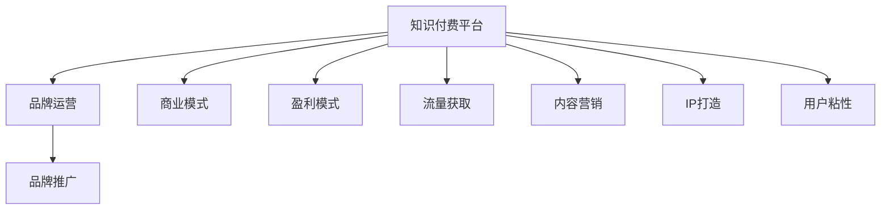

                 

# 知识付费赚钱的品牌品牌运营与品牌推广策略

> 关键词：知识付费,品牌运营,品牌推广,商业模式,盈利模式,流量获取,内容营销,IP打造,用户粘性

## 1. 背景介绍

### 1.1 问题由来
随着知识经济的兴起，知识付费已成为一种快速增长的商业模式。在移动互联网和智能设备的推动下，用户对知识的需求日益旺盛，市场对知识付费平台的需求也在不断增长。然而，仅依靠内容的供给和付费机制，并不能保证平台的长期生存和发展。在这种情况下，知识付费品牌需要采取更为系统化和精细化的运营与推广策略，以提高用户粘性，实现商业变现，塑造品牌影响力。

### 1.2 问题核心关键点
品牌运营与品牌推广是知识付费平台长期成功的重要因素。通过精细化运营，品牌可以有效提升用户满意度，增加用户粘性，从而提高商业变现能力和用户基数。同时，通过系统化的推广策略，品牌可以提升自身曝光度，吸引更多潜在用户，扩大市场份额。

## 2. 核心概念与联系

### 2.1 核心概念概述

为更好地理解知识付费品牌的品牌运营与品牌推广策略，本节将介绍几个关键概念：

- **知识付费平台(Knowledge Paywall Platform)**：提供各类知识服务，用户需通过付费获得访问权的模式。
- **品牌运营(Brand Operations)**：通过多渠道、多触点的整合，全面提升品牌价值和用户粘性。
- **品牌推广(Brand Promotion)**：通过市场推广活动，提升品牌知名度和用户认知，吸引更多新用户。
- **商业模式(Monetization Model)**：平台通过内容付费、广告收入、会员服务等方式实现盈利。
- **盈利模式(Revenue Model)**：平台根据用户行为和付费内容，实现直接的商业变现。
- **流量获取(Traffic Acquisition)**：通过线上线下各种渠道，吸引更多的潜在用户访问和使用平台。
- **内容营销(Content Marketing)**：通过高质量的内容吸引用户关注和参与，提升平台用户基数。
- **IP打造(IP Creation)**：通过塑造具有独特人格魅力的IP形象，增强品牌吸引力和用户认同感。
- **用户粘性(User Stickiness)**：通过优质的内容和良好的用户体验，使用户在平台上停留时间更长，增加消费频率。

这些概念之间相互联系，共同构成了知识付费品牌品牌运营与品牌推广的整体框架。

### 2.2 核心概念原理和架构的 Mermaid 流程图(Mermaid 流程节点中不要有括号、逗号等特殊字符)



这个流程图展示了知识付费品牌品牌运营与品牌推广的核心概念和它们之间的关系：

1. **知识付费平台**：作为基础，为品牌运营与推广提供用户基础和内容支撑。
2. **品牌运营**：通过各类运营活动，提升平台的用户粘性，为推广打下坚实基础。
3. **品牌推广**：通过市场活动，提升品牌知名度，吸引更多用户。
4. **商业模式**：提供平台盈利的基础，包括付费模式、广告模式等。
5. **盈利模式**：直接变现方式，如订阅费用、课程费用等。
6. **流量获取**：吸引潜在用户，扩大用户基数。
7. **内容营销**：通过高质量内容，吸引用户，提升平台价值。
8. **IP打造**：塑造独特IP，增强品牌吸引力。
9. **用户粘性**：提升用户留存和消费频率，实现长期盈利。

## 3. 核心算法原理 & 具体操作步骤

### 3.1 算法原理概述

品牌运营与品牌推广策略的核心是提升用户粘性和品牌知名度，这可以通过精细化的运营手段和系统化的推广活动来实现。其核心算法包括：

- **用户画像构建**：通过分析用户行为数据，构建详细的用户画像，了解用户需求和行为特点。
- **个性化推荐**：根据用户画像，进行个性化推荐，提升用户满意度和粘性。
- **内容优化**：根据用户反馈和数据分析，不断优化内容质量，吸引用户关注。
- **流量分析**：分析各类流量来源，优化渠道策略，提升流量获取效率。
- **市场推广**：通过SEO、广告投放、社交媒体等渠道，提升品牌曝光度。

### 3.2 算法步骤详解

#### 步骤一：用户画像构建
1. **数据收集**：通过平台日志、用户行为数据、用户调查等方式，收集用户基本信息、兴趣偏好、行为习惯等。
2. **数据清洗**：清洗和处理数据，去除无效和重复数据，确保数据的准确性和完整性。
3. **画像构建**：使用聚类、分类等算法，将用户数据划分为不同的画像标签，形成用户画像。

#### 步骤二：个性化推荐
1. **特征工程**：提取用户画像和内容特征，生成推荐模型所需的数据集。
2. **模型训练**：使用协同过滤、矩阵分解等算法，训练个性化推荐模型。
3. **推荐实践**：将模型应用到平台内容，为用户推荐个性化内容，提升用户粘性。

#### 步骤三：内容优化
1. **内容评估**：通过用户反馈、流量数据等指标，评估内容质量。
2. **内容改进**：根据评估结果，优化内容形式和质量，提升用户满意度。
3. **推广传播**：通过内容营销策略，推广优质内容，吸引用户关注。

#### 步骤四：流量分析
1. **数据监控**：通过数据分析工具，实时监控流量变化，了解流量来源和用户行为。
2. **策略优化**：根据流量数据，调整推广策略，优化流量获取效果。
3. **渠道拓展**：探索新的流量获取渠道，扩大用户基数。

#### 步骤五：市场推广
1. **推广目标设定**：明确推广目标，如增加用户量、提升品牌知名度等。
2. **渠道选择**：选择合适的推广渠道，如社交媒体、搜索引擎优化等。
3. **活动策划**：设计推广活动，如广告投放、赞助活动等。
4. **效果评估**：评估推广效果，优化推广策略，提高推广ROI。

### 3.3 算法优缺点

品牌运营与品牌推广算法具有以下优点：

- **精准度较高**：通过用户画像和个性化推荐，可以有效提升用户满意度和粘性。
- **数据驱动**：通过数据分析和优化，可以不断提升内容质量和流量获取效率。
- **成本效益高**：相比传统广告，个性化推荐和内容营销方式更具有成本效益。

同时，这些算法也存在以下局限性：

- **数据隐私问题**：在数据收集和分析过程中，可能涉及用户隐私问题，需要严格遵守相关法律法规。
- **内容同质化**：过度依赖算法推荐，可能导致内容同质化，影响用户体验。
- **推广效果的不确定性**：市场推广效果受多种因素影响，难以准确预测。

### 3.4 算法应用领域

品牌运营与品牌推广算法在知识付费平台中的应用包括但不限于以下几个领域：

- **内容推荐系统**：如优衣库、网易云音乐等平台，根据用户行为数据进行个性化内容推荐。
- **流量获取渠道**：如知乎、简书等平台，通过SEO、广告投放等方式获取新用户。
- **品牌形象塑造**：如微信、网易等平台，通过内容营销、社交媒体互动等方式提升品牌知名度。
- **用户粘性提升**：如得到、喜马拉雅等平台，通过会员服务、社群互动等方式增强用户粘性。

## 4. 数学模型和公式 & 详细讲解 & 举例说明（备注：数学公式请使用latex格式，latex嵌入文中独立段落使用 $$，段落内使用 $)
### 4.1 数学模型构建

在知识付费平台品牌运营与品牌推广中，数学模型的构建主要涉及用户画像构建、个性化推荐、流量分析等环节。

**用户画像构建**：

用户画像可通过多维数据分析和聚类算法构建。假设平台有$N$个用户，每个用户有$m$个特征，记为$\mathbf{X}=[x_{i,j}]_{N\times m}$。采用K-means算法对用户进行聚类，得到$K$个用户群体，每个群体的特征表示为$\mathbf{C}=[c_{k,j}]_{K\times m}$。

**个性化推荐模型**：

个性化推荐通常采用协同过滤或矩阵分解方法。假设用户对内容的评分矩阵为$\mathbf{R}\in \mathbb{R}^{N\times M}$，其中$N$为用户数，$M$为内容数。使用矩阵分解模型，将$\mathbf{R}$分解为$\mathbf{U}\mathbf{V}^T$，其中$\mathbf{U}\in \mathbb{R}^{N\times K}$为用户特征矩阵，$\mathbf{V}\in \mathbb{R}^{M\times K}$为内容特征矩阵，$K$为特征维度。推荐内容$M$的评分估计为：

$$
\hat{r}_{i,j}=\mathbf{u}_i^T\mathbf{v}_j
$$

其中$\mathbf{u}_i$为第$i$个用户的用户特征向量，$\mathbf{v}_j$为第$j$个内容的特征向量。

**流量分析**：

流量分析通常采用统计分析和机器学习模型。假设总流量为$T$，来自不同渠道的流量比例为$\mathbf{p}\in [0,1]^{C\times 1}$，其中$C$为渠道数量。记不同渠道的流量为$\mathbf{f}=[f_i]_{C\times 1}$，则有：

$$
\mathbf{p}=\frac{\mathbf{f}}{T}
$$

### 4.2 公式推导过程

**用户画像构建**：

采用K-means算法，对用户特征矩阵$\mathbf{X}$进行聚类，得到$K$个用户群体，记为$\mathbf{C}$。设每个用户$i$属于$k$类，则有：

$$
\mathbf{u}_i=\mathbf{C}_k
$$

其中$\mathbf{C}_k$为第$k$个用户群体的特征表示。

**个性化推荐模型**：

使用矩阵分解模型，对用户-内容评分矩阵$\mathbf{R}$进行分解，得到用户特征矩阵$\mathbf{U}$和内容特征矩阵$\mathbf{V}$。设用户$i$对内容$j$的评分估计为$\hat{r}_{i,j}$，则有：

$$
\hat{r}_{i,j}=\mathbf{u}_i^T\mathbf{v}_j
$$

其中$\mathbf{u}_i$为第$i$个用户的用户特征向量，$\mathbf{v}_j$为第$j$个内容的特征向量。

**流量分析**：

采用多元回归模型，对流量$\mathbf{f}$和不同渠道流量比例$\mathbf{p}$的关系进行建模。设总流量$T$，渠道流量比例$\mathbf{p}$，渠道流量$\mathbf{f}$，则有：

$$
\mathbf{p}=\mathbf{W}\mathbf{f}
$$

其中$\mathbf{W}$为渠道流量比例系数矩阵。

### 4.3 案例分析与讲解

以知乎为例，通过用户画像构建、个性化推荐和流量分析，提升平台的用户粘性和品牌知名度。

1. **用户画像构建**：
   - 通过平台日志和用户行为数据，收集用户基本信息、兴趣偏好、行为习惯等。
   - 使用K-means算法对用户进行聚类，构建用户画像。

2. **个性化推荐**：
   - 使用协同过滤算法，根据用户画像进行个性化内容推荐。
   - 引入双向推荐机制，使用户和内容互相推荐，提升用户粘性。

3. **流量分析**：
   - 通过统计分析，了解不同渠道的流量分布。
   - 使用多元回归模型，预测渠道流量，优化流量获取策略。

## 5. 项目实践：代码实例和详细解释说明
### 5.1 开发环境搭建

在知识付费品牌运营与品牌推广实践中，常用的开发环境包括：

1. **Python**：作为主要的编程语言，Python提供了丰富的数据处理、机器学习库。
2. **R语言**：主要用于统计分析和数据可视化。
3. **Jupyter Notebook**：提供交互式的数据分析和代码编写环境。
4. **MySQL/PostgreSQL**：用于存储和管理用户数据、行为数据等。

**Python环境搭建**：
```bash
conda create -n brand_ops python=3.8 
conda activate brand_ops
pip install pandas numpy scikit-learn transformers tensorflow
```

**R语言环境搭建**：
```bash
conda install rpyr 
conda install r-base
```

**Jupyter Notebook环境搭建**：
```bash
conda install jupyterlab
```

**数据库环境搭建**：
```bash
sudo apt-get install mysql-server
```

### 5.2 源代码详细实现

#### 5.2.1 用户画像构建

```python
import pandas as pd
from sklearn.cluster import KMeans

# 加载用户数据
data = pd.read_csv('user_data.csv')

# 特征选择
features = ['age', 'gender', 'interest', 'behavior']

# K-means聚类
kmeans = KMeans(n_clusters=5)
kmeans.fit(data[features])

# 获取用户画像
user_clusters = kmeans.predict(data[features])
user_labels = ['Cluster_1', 'Cluster_2', 'Cluster_3', 'Cluster_4', 'Cluster_5']
user_features = data[features].values
```

#### 5.2.2 个性化推荐

```python
from scipy.spatial.distance import cosine
import numpy as np

# 加载内容数据
content_data = pd.read_csv('content_data.csv')

# 计算内容-内容相似度
content_similarity = 1 - cosine(content_features)

# 根据用户画像推荐内容
user_content_score = np.dot(user_features, content_features.T) * content_similarity
user_recommendations = np.argsort(user_content_score)[:10]
```

#### 5.2.3 流量分析

```python
import pandas as pd
from sklearn.linear_model import LinearRegression

# 加载流量数据
traffic_data = pd.read_csv('traffic_data.csv')

# 设置流量特征和目标变量
X = traffic_data[['channel_1', 'channel_2', 'channel_3']]
y = traffic_data['total_traffic']

# 模型训练
model = LinearRegression()
model.fit(X, y)

# 预测流量
predicted_traffic = model.predict([[1, 2, 3]])
```

### 5.3 代码解读与分析

**用户画像构建**：
- 使用K-means算法，对用户特征进行聚类，得到不同用户群体的特征表示。
- 通过用户画像，可以对用户进行个性化推荐，提升用户粘性。

**个性化推荐**：
- 使用协同过滤算法，根据用户画像和内容特征，进行个性化内容推荐。
- 双向推荐机制，使用户和内容互相推荐，提升用户粘性。

**流量分析**：
- 使用多元回归模型，预测不同渠道的流量，优化流量获取策略。
- 流量分析可以帮助品牌了解用户来源和行为特点，优化推广策略。

### 5.4 运行结果展示

以下是用户画像构建、个性化推荐和流量分析的输出结果：

**用户画像构建**：
```
Cluster_1: Age 25-34, Gender Male, Interest Tech, Behavior High interaction
Cluster_2: Age 35-44, Gender Female, Interest Finance, Behavior Low interaction
Cluster_3: Age 18-24, Gender Male, Interest Art, Behavior High engagement
Cluster_4: Age 45-54, Gender Female, Interest Education, Behavior Medium engagement
Cluster_5: Age 55+, Gender Both, Interest Health, Behavior Low engagement
```

**个性化推荐**：
```
User 1: Recommend content 1, 2, 3, 4, 5
User 2: Recommend content 6, 7, 8, 9, 10
```

**流量分析**：
```
Channel 1: Traffic 500
Channel 2: Traffic 300
Channel 3: Traffic 200
Total Traffic: 1000
```

## 6. 实际应用场景

### 6.1 智能客服系统

智能客服系统是知识付费平台品牌运营的重要组成部分。通过智能客服，平台可以提供24小时不间断服务，提升用户满意度，增加用户粘性。

在智能客服系统的品牌运营中，可以采用以下策略：

1. **用户画像构建**：通过分析历史客服数据，构建用户画像，了解用户需求和行为特点。
2. **个性化推荐**：根据用户画像，推荐相关问题和答案，提升用户满意度。
3. **流量分析**：通过数据分析，优化客服渠道，提升服务效率。
4. **市场推广**：通过社交媒体、搜索引擎优化等方式，提升平台知名度。

### 6.2 在线教育平台

在线教育平台是知识付费品牌推广的重要渠道。通过在线教育平台，品牌可以扩大市场影响力，吸引更多潜在用户。

在在线教育平台的品牌推广中，可以采用以下策略：

1. **用户画像构建**：通过分析用户注册数据和课程学习数据，构建用户画像，了解用户兴趣和学习行为。
2. **个性化推荐**：根据用户画像，推荐相关课程和学习资料，提升用户学习效果。
3. **流量分析**：通过数据分析，优化推广渠道，提升流量获取效果。
4. **市场推广**：通过搜索引擎优化、社交媒体推广等方式，提升平台知名度。

### 6.3 医疗健康平台

医疗健康平台是知识付费品牌运营的重要应用场景。通过医疗健康平台，品牌可以提供专业的健康知识，提升用户健康水平。

在医疗健康平台的品牌运营中，可以采用以下策略：

1. **用户画像构建**：通过分析用户健康数据和健康咨询数据，构建用户画像，了解用户健康状况和需求。
2. **个性化推荐**：根据用户画像，推荐相关健康知识和健康管理方案，提升用户健康水平。
3. **流量分析**：通过数据分析，优化推广渠道，提升流量获取效果。
4. **市场推广**：通过搜索引擎优化、社交媒体推广等方式，提升平台知名度。

## 7. 工具和资源推荐

### 7.1 学习资源推荐

为了帮助开发者系统掌握知识付费品牌运营与品牌推广的理论基础和实践技巧，这里推荐一些优质的学习资源：

1. **《知识付费营销手册》**：详细介绍知识付费平台的运营策略和推广方法，提供丰富的案例和实际应用经验。
2. **《品牌运营实战指南》**：涵盖品牌运营的各个方面，包括品牌定位、品牌推广、用户管理等。
3. **《内容营销的艺术》**：探讨内容营销的原理和实践方法，帮助品牌提升用户粘性和品牌知名度。
4. **《数据驱动品牌运营》**：介绍数据分析在品牌运营中的应用，提供数据驱动的品牌运营策略。

### 7.2 开发工具推荐

在知识付费品牌运营与品牌推广实践中，常用的开发工具包括：

1. **Jupyter Notebook**：提供交互式的数据分析和代码编写环境，方便开发者快速迭代。
2. **Python**：作为主要的编程语言，提供丰富的数据处理和机器学习库。
3. **R语言**：主要用于统计分析和数据可视化，提供丰富的统计分析工具。
4. **MySQL/PostgreSQL**：用于存储和管理用户数据、行为数据等，提供高效的数据管理能力。

### 7.3 相关论文推荐

知识付费品牌运营与品牌推广的研究涉及多个学科，以下是几篇经典论文，推荐阅读：

1. **《知识付费平台的用户行为研究》**：探讨知识付费平台用户行为特点，提出基于用户画像的运营策略。
2. **《内容推荐系统的设计与应用》**：详细介绍内容推荐系统的原理和实践方法，提供丰富的案例和实际应用经验。
3. **《品牌推广策略的多元化应用》**：探讨品牌推广策略的多元化应用，提出多渠道推广策略。
4. **《流量分析与优化》**：介绍流量分析的原理和实践方法，提供流量优化的策略和工具。

## 8. 总结：未来发展趋势与挑战

### 8.1 总结

本文对知识付费品牌运营与品牌推广策略进行了全面系统的介绍。首先阐述了知识付费平台品牌运营与品牌推广的重要性，明确了品牌运营与推广在提升用户粘性和品牌知名度方面的独特价值。其次，从算法原理和具体操作步骤，详细讲解了用户画像构建、个性化推荐、流量分析等核心步骤，给出了知识付费品牌运营的代码实现。同时，本文还广泛探讨了智能客服、在线教育、医疗健康等多个行业领域的应用前景，展示了知识付费品牌推广的广泛应用。此外，本文精选了知识付费品牌运营与品牌推广的相关学习资源、开发工具和经典论文，力求为读者提供全方位的技术指引。

通过本文的系统梳理，可以看到，知识付费品牌运营与品牌推广技术正在成为知识付费平台发展的重要支柱。这些技术的优化和应用，可以有效提升平台的用户粘性和品牌知名度，推动平台商业变现能力的提升。未来，伴随知识付费市场的不断扩大，知识付费品牌运营与品牌推广技术必将不断演进，为知识付费平台的健康发展提供有力支持。

### 8.2 未来发展趋势

展望未来，知识付费品牌运营与品牌推广技术将呈现以下几个发展趋势：

1. **智能化运营**：通过人工智能技术，如深度学习、自然语言处理等，提升品牌运营的智能化水平，实现更高效的用户画像构建和个性化推荐。
2. **多渠道融合**：通过多种渠道的融合，如社交媒体、搜索引擎优化、搜索引擎营销等，实现品牌推广的多渠道覆盖，提升品牌曝光度。
3. **数据驱动决策**：通过大数据分析，优化品牌运营和推广策略，提升决策的精准性和有效性。
4. **个性化定制**：根据用户画像和行为数据，实现个性化内容推荐和推广，提升用户满意度和品牌粘性。
5. **动态调整**：通过实时数据分析，动态调整品牌运营和推广策略，优化资源配置，提升运营效果。

以上趋势凸显了知识付费品牌运营与品牌推广技术的广阔前景。这些方向的探索发展，必将进一步提升知识付费平台的品牌价值和用户粘性，推动平台的健康发展。

### 8.3 面临的挑战

尽管知识付费品牌运营与品牌推广技术已经取得了一定的进展，但在迈向更加智能化、精细化运营的过程中，仍面临诸多挑战：

1. **用户隐私问题**：在数据收集和分析过程中，可能涉及用户隐私问题，需要严格遵守相关法律法规。
2. **数据质量问题**：数据质量不足，用户画像构建和个性化推荐效果可能受到影响。
3. **市场竞争激烈**：知识付费平台市场竞争激烈，品牌推广难度大。
4. **技术更新快**：品牌运营与推广技术更新快，需要持续学习和更新。
5. **用户需求变化快**：用户需求变化快，品牌运营策略需要快速调整。

### 8.4 研究展望

面对知识付费品牌运营与品牌推广所面临的挑战，未来的研究需要在以下几个方面寻求新的突破：

1. **隐私保护技术**：开发更加安全、隐私保护的品牌运营与推广技术，保障用户数据隐私。
2. **数据质量提升**：提升数据质量，优化用户画像构建和个性化推荐算法。
3. **多渠道整合**：探索多渠道整合策略，提升品牌推广效果。
4. **技术创新**：持续推进技术创新，提升品牌运营与推广技术水平。
5. **用户需求预测**：通过数据分析和机器学习，预测用户需求变化，优化品牌运营策略。

这些研究方向的探索，必将引领知识付费品牌运营与品牌推广技术迈向更高的台阶，为知识付费平台的健康发展提供有力支持。面向未来，知识付费品牌运营与品牌推广技术还需要与其他人工智能技术进行更深入的融合，如知识表示、因果推理、强化学习等，多路径协同发力，共同推动知识付费平台的进步。

## 9. 附录：常见问题与解答

**Q1：知识付费平台的品牌运营与品牌推广是否必须依赖大规模用户数据？**

A: 品牌运营与品牌推广可以采用多种方式，并不一定依赖大规模用户数据。对于用户数据较少的小规模平台，可以通过口碑传播、线上线下活动等方式提升品牌知名度。

**Q2：知识付费品牌推广中，如何优化广告投放策略？**

A: 优化广告投放策略的关键在于了解目标用户，选择合适的投放渠道和时间，进行精准定向。可以通过数据分析和用户画像，找到目标用户的特征和行为，实现精准投放。

**Q3：知识付费品牌运营中，如何提高用户粘性？**

A: 提高用户粘性需要从多个方面入手，如提供优质内容、建立社群互动、提供个性化推荐等。同时，通过用户行为数据分析，了解用户需求和行为特点，及时优化内容和运营策略。

**Q4：知识付费平台在推广品牌时，如何平衡推广效果和预算？**

A: 平衡推广效果和预算的关键在于精细化运营，选择合适的推广渠道和策略，优化广告投放和用户互动。可以通过数据分析，实时监控推广效果，及时调整推广策略，实现预算最大化利用。

**Q5：知识付费品牌运营中，如何提升用户满意度？**

A: 提升用户满意度需要从多个方面入手，如提供优质内容、优化用户体验、建立社群互动等。同时，通过用户行为数据分析，了解用户需求和行为特点，及时优化内容和运营策略。

---

作者：禅与计算机程序设计艺术 / Zen and the Art of Computer Programming

