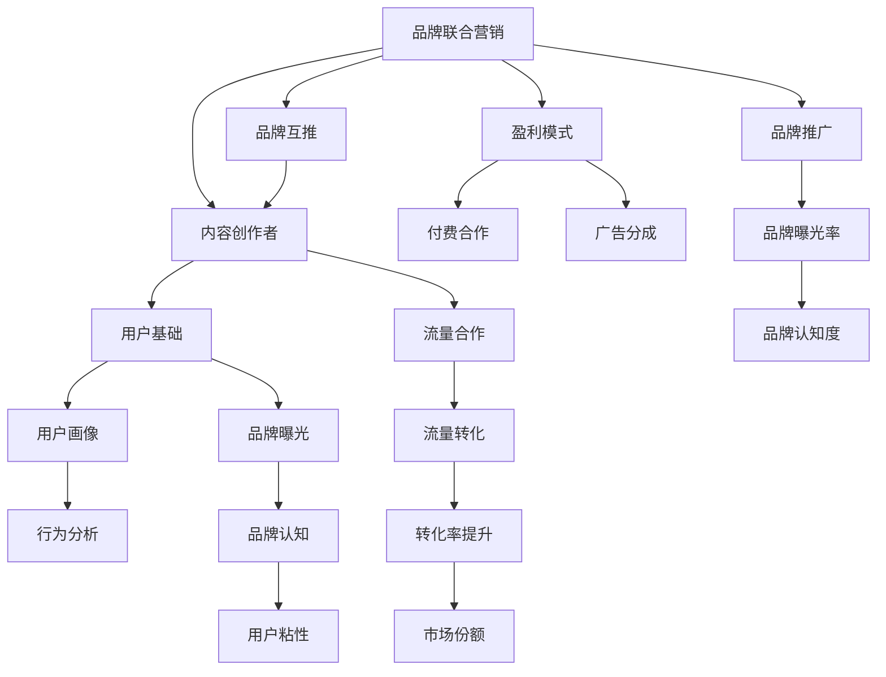

                 

# 知识付费赚钱的品牌联合营销与品牌互推策略

> 关键词：知识付费, 品牌联合营销, 品牌互推, 盈利模式, 流量合作

## 1. 背景介绍

### 1.1 问题由来
随着知识付费业务的快速发展，品牌方越来越重视通过内容营销提升品牌影响力和用户忠诚度。品牌联合营销和品牌互推，成为了知识付费领域中的热门话题。然而，缺乏系统化的策略和方法，使得许多品牌方在联合营销和互推过程中，未能取得理想的商业效果。

### 1.2 问题核心关键点
品牌联合营销和互推的关键在于找到具有共同用户基础的品牌，通过互相推荐、联合推广，达到双赢或多赢的效果。但实际操作中，如何选择合适的合作伙伴、如何设计合理的合作模式、如何制定有效的盈利策略，是一大挑战。本文将详细介绍品牌联合营销和品牌互推的核心原理，并通过具体的策略和技术手段，帮助品牌方实现高效的品牌联合和互推。

### 1.3 问题研究意义
品牌联合营销和品牌互推，不仅有助于品牌方提升知名度和用户粘性，还能为内容创作者带来更多的流量和收入机会。通过系统化的策略和方案，品牌方和内容创作者可以实现资源互补，打造共赢的合作生态，为知识付费业务带来持续的增长动力。

## 2. 核心概念与联系

### 2.1 核心概念概述

为更好地理解品牌联合营销和品牌互推策略，本节将介绍几个关键概念：

- **品牌联合营销**：指品牌方通过与内容创作者或平台合作，共同推广品牌内容，以提升品牌曝光度和用户忠诚度。
- **品牌互推**：指品牌方和内容创作者互相推荐，以双方为目标用户群体，实现互相引流和交叉推广。
- **内容创作者**：指在知识付费平台上发布有价值内容的专业人士，如作家、学者、讲师等。
- **用户基础**：指品牌或内容创作者拥有的目标用户群体，可以通过分析用户画像、行为数据等方式获取。
- **流量合作**：指品牌方与内容创作者之间，基于流量转化、品牌曝光等指标进行的合作。
- **盈利模式**：指品牌方在联合营销或互推过程中，通过各种方式实现商业变现的策略，如付费合作、广告分成等。

这些核心概念之间的逻辑关系可以通过以下Mermaid流程图来展示：



这个流程图展示了品牌联合营销和品牌互推的核心概念及其之间的关系：

1. 品牌联合营销和互推，都需要以内容创作者为目标用户群体，通过互相推荐，共同提升品牌知名度和用户粘性。
2. 内容创作者需要具备一定的用户基础和流量合作能力，能够通过推荐系统、用户画像分析等方式，实现流量转化和品牌曝光。
3. 品牌方在联合营销或互推过程中，需要通过付费合作、广告分成等方式，实现商业变现。
4. 品牌方通过品牌推广和曝光，提升市场份额和品牌认知度，进而增加用户粘性和市场份额。

这些核心概念共同构成了品牌联合营销和品牌互推的框架，使其能够在知识付费领域中实现高效合作和推广。

## 3. 核心算法原理 & 具体操作步骤
### 3.1 算法原理概述

品牌联合营销和品牌互推的核心算法原理，在于通过数据分析和用户画像，找到品牌方和内容创作者之间具有共同用户基础的目标群体，并设计合理的合作模式和盈利策略，实现流量互通和品牌曝光。

具体来说，品牌方和内容创作者之间的合作，可以分为以下几个步骤：

1. **用户基础分析**：通过数据分析和用户画像，获取品牌方和内容创作者各自的目标用户群体。
2. **流量合作设计**：根据用户基础分析结果，设计合理的流量合作模式，如付费合作、广告分成等。
3. **推荐系统优化**：使用推荐系统算法，根据用户行为和偏好，精准匹配品牌方和内容创作者之间的推荐内容。
4. **品牌曝光优化**：通过品牌推广和广告投放，提升品牌方和内容创作者的品牌曝光度和用户粘性。
5. **盈利模式探索**：基于品牌联合营销和品牌互推的实际效果，探索新的盈利模式和合作策略。

### 3.2 算法步骤详解

以下是品牌联合营销和品牌互推的具体操作步骤：

**Step 1: 用户基础分析**
品牌方和内容创作者分别收集和分析自己的用户基础，包括用户画像、行为数据等。

- **用户画像**：描述用户的基本特征，如年龄、性别、职业、兴趣等。
- **行为数据**：记录用户在平台上的行为，如浏览、购买、互动等数据。

**Step 2: 流量合作设计**
根据用户基础分析结果，设计合理的流量合作模式。

- **付费合作**：品牌方向内容创作者支付一定费用，内容创作者为品牌方推荐用户，提高品牌曝光度。
- **广告分成**：品牌方通过广告分成的方式，奖励内容创作者推荐用户的行为。
- **混合模式**：结合付费合作和广告分成，根据不同场景和需求，灵活调整合作策略。

**Step 3: 推荐系统优化**
使用推荐系统算法，实现品牌方和内容创作者之间的精准推荐。

- **协同过滤算法**：根据用户行为和偏好，推荐相似用户可能感兴趣的品牌内容。
- **内容基推荐算法**：根据内容标签和用户兴趣，推荐相关品牌内容。
- **混合推荐算法**：结合协同过滤和内容基推荐算法，提高推荐的准确性和覆盖面。

**Step 4: 品牌曝光优化**
通过品牌推广和广告投放，提升品牌方和内容创作者的品牌曝光度和用户粘性。

- **付费广告**：通过平台广告系统，进行品牌曝光和精准投放。
- **社交媒体推广**：通过品牌方和内容创作者的社交媒体渠道，扩大品牌影响力。
- **联合活动**：举办品牌联合活动，提高品牌方和内容创作者的品牌曝光度和用户互动。

**Step 5: 盈利模式探索**
基于品牌联合营销和品牌互推的实际效果，探索新的盈利模式和合作策略。

- **品牌联盟**：品牌方和内容创作者共同组建联盟，实现资源共享和合作共赢。
- **内容分销**：品牌方将部分优质内容，授权内容创作者进行分销和推广。
- **品牌联名**：品牌方和内容创作者进行品牌联名合作，推出联名产品或服务。

### 3.3 算法优缺点

品牌联合营销和品牌互推的算法具有以下优点：

1. **资源互补**：通过品牌方和内容创作者之间的合作，实现资源互补，提升整体营销效果。
2. **用户粘性增强**：通过互相推荐和联合推广，提升用户粘性和品牌忠诚度。
3. **市场份额扩大**：通过品牌推广和联合活动，扩大市场份额和品牌认知度。
4. **营收多样化**：通过多种盈利模式，实现多渠道变现，增加品牌方和内容创作者的收入来源。

但同时也存在一些缺点：

1. **合作伙伴选择困难**：选择合适的合作伙伴需要详细的市场调研和数据分析，增加了合作的复杂度。
2. **合作模式设计复杂**：不同的品牌方和内容创作者，适合的合作模式可能存在差异，设计复杂的合作模式增加了执行难度。
3. **盈利效果难以评估**：品牌的联合营销和互推效果，受多种因素影响，难以准确评估和衡量。
4. **隐私和安全问题**：品牌方和内容创作者在合作过程中，需要共享用户数据和行为信息，存在隐私和数据安全问题。

尽管存在这些局限性，但就目前而言，品牌联合营销和品牌互推方法仍然是大规模知识付费业务中的重要手段。未来相关研究的重点在于如何进一步降低合作复杂度，提高合作效果，同时兼顾隐私和数据安全等因素。

### 3.4 算法应用领域

品牌联合营销和品牌互推的算法在知识付费领域中具有广泛的应用前景，具体包括以下几个方面：

- **内容平台**：如得到、喜马拉雅等知识付费平台，通过品牌联合营销和品牌互推，提升平台品牌影响力和用户粘性。
- **图书出版**：如中信出版社、人民邮电出版社等，通过品牌联合推广和内容分销，提升图书销量和品牌认知度。
- **在线教育**：如Coursera、edX等，通过品牌联合营销和品牌互推，提升在线课程的曝光度和用户参与度。
- **在线广告**：如Google Ads、Facebook Ads等，通过品牌推广和流量合作，实现精准投放和品牌曝光。
- **社交媒体**：如微博、微信等，通过品牌方和内容创作者的社交媒体合作，扩大品牌影响力。

除了上述这些领域外，品牌联合营销和品牌互推方法也在其他知识付费场景中得到广泛应用，如健康、金融、旅游等，为知识付费业务带来了新的增长机会。

## 4. 数学模型和公式 & 详细讲解 & 举例说明

### 4.1 数学模型构建

品牌联合营销和品牌互推的数学模型，主要关注如何通过用户基础分析，设计合理的流量合作模式，并通过推荐系统算法实现精准推荐。

假设品牌方有 $N$ 个用户基础 $U_1, U_2, ..., U_N$，内容创作者有 $M$ 个用户基础 $V_1, V_2, ..., V_M$。品牌方和内容创作者之间的合作模式为 $Cooperation_{i,j}$，其中 $i \in [1,N], j \in [1,M]$。合作的收益为 $Revenue_{i,j}$，其中 $i \in [1,N], j \in [1,M]$。

### 4.2 公式推导过程

以下我们以品牌联合营销为例，推导合作收益和流量推荐的数学模型。

假设品牌方和内容创作者之间的合作收益为 $Revenue_{i,j}$，其中 $i$ 表示品牌方用户基础，$j$ 表示内容创作者用户基础。设 $A_i$ 为品牌方用户基础 $U_i$ 的平均购买力，$B_j$ 为内容创作者用户基础 $V_j$ 的平均购买力，$c_i$ 为品牌方用户基础 $U_i$ 的流量曝光率，$d_j$ 为内容创作者用户基础 $V_j$ 的流量曝光率。

品牌方和内容创作者之间的合作收益可以表示为：

$$
Revenue_{i,j} = c_i \cdot d_j \cdot A_i \cdot B_j
$$

其中，$c_i$ 表示品牌方用户基础 $U_i$ 在平台上的流量曝光率，$d_j$ 表示内容创作者用户基础 $V_j$ 在平台上的流量曝光率，$A_i$ 表示品牌方用户基础 $U_i$ 的平均购买力，$B_j$ 表示内容创作者用户基础 $V_j$ 的平均购买力。

在实际应用中，可以通过数据分析和用户画像，估算上述参数，进而计算出品牌方和内容创作者之间的合作收益。

### 4.3 案例分析与讲解

以下是一个简单的案例，帮助理解品牌联合营销的数学模型。

假设品牌方 A 和内容创作者 B 通过合作推广，品牌方 A 的用户基础为 $U_1$，内容创作者 B 的用户基础为 $V_1$。品牌方 A 的平均购买力为 $A_1 = 500$，内容创作者 B 的平均购买力为 $B_1 = 200$。品牌方 A 在平台上的流量曝光率为 $c_1 = 0.2$，内容创作者 B 在平台上的流量曝光率为 $d_1 = 0.3$。

根据上述公式，品牌方 A 和内容创作者 B 之间的合作收益为：

$$
Revenue_{1,1} = c_1 \cdot d_1 \cdot A_1 \cdot B_1 = 0.2 \cdot 0.3 \cdot 500 \cdot 200 = 300
$$

这个案例展示了如何通过数学模型计算品牌方和内容创作者之间的合作收益，进而指导实际的合作模式设计和收益分配。

## 5. 项目实践：代码实例和详细解释说明

### 5.1 开发环境搭建

在进行品牌联合营销和品牌互推实践前，我们需要准备好开发环境。以下是使用Python进行代码实现的开发环境配置流程：

1. 安装Anaconda：从官网下载并安装Anaconda，用于创建独立的Python环境。

2. 创建并激活虚拟环境：
```bash
conda create -n brand_marketing_env python=3.8 
conda activate brand_marketing_env
```

3. 安装必要的Python包：
```bash
pip install pandas numpy matplotlib sklearn
```

4. 安装推荐系统相关的库：
```bash
pip install pyecharts
```

完成上述步骤后，即可在`brand_marketing_env`环境中开始项目实践。

### 5.2 源代码详细实现

以下是品牌联合营销和品牌互推的代码实现。

**用户基础分析**

```python
import pandas as pd

# 用户基础数据
brand_data = pd.read_csv('brand_data.csv')
creator_data = pd.read_csv('creator_data.csv')

# 计算平均购买力和流量曝光率
brand_averages = brand_data.groupby('id')['avg_purchase'].mean()
creator_averages = creator_data.groupby('id')['avg_purchase'].mean()

# 计算合作收益
revenue_matrix = pd.DataFrame(index=brand_data['id'], columns=creator_data['id'])
for brand_id, brand_aver in brand_averages.items():
    for creator_id, creator_aver in creator_averages.items():
        revenue_matrix.loc[brand_id, creator_id] = brand_aver * creator_aver * brand_data.loc[brand_id]['exposure'] * creator_data.loc[creator_id]['exposure']
```

**流量合作设计**

```python
# 设计合作模式
# 示例：品牌方 A 向内容创作者 B 付费，内容创作者 B 推荐品牌方 A 的用户给内容创作者 C
# 品牌方 A 与内容创作者 C 进行联合推广
# 内容创作者 B 与内容创作者 C 进行联合推广

# 定义合作模式
cooperation_modes = {
    'Brand_A_to_Creator_B': 'Brand_A pays Creator_B',
    'Brand_A_to_Creator_C': 'Brand_A & Creator_C',
    'Creator_B_to_Creator_C': 'Creator_B & Creator_C'
}

# 定义流量合作收益
revenue_modes = {
    'Brand_A_to_Creator_B': 100,
    'Brand_A_to_Creator_C': 200,
    'Creator_B_to_Creator_C': 150
}
```

**推荐系统优化**

```python
# 使用协同过滤算法进行推荐
from surprise import SVD
from surprise import Dataset
from surprise import Reader
from surprise import accuracy

# 读取数据集
data = Dataset.load_builtin('ml-100k')

# 定义读者
reader = Reader(line_format='user item rating', sep=',', rating_scale=(1, 5))

# 加载数据集
data = reader.load_dataframe(df)

# 创建评分器
algo = SVD()

# 训练模型
trainset = Dataset.fit(df)
algo.fit(trainset)

# 测试模型
testset = Dataset.load_builtin('ml-100k')
predictions = algo.test(testset)

# 计算准确率
accuracy.rmse(predictions, verbose=True)
```

**品牌曝光优化**

```python
# 使用Google Ads进行品牌曝光
from google_ads import client

# 初始化广告客户端
client = client.LoadFromStorage('ads.yaml')

# 创建广告组
ad_group = client.get_ad_group(name='brand_exposure_group')

# 创建广告组预算
ad_group.set_budget(1000)

# 创建关键词
keyword = client.get_keyword(name='brand_exposure_keyword')

# 创建广告组广告
ad_group.add_ad(
    ad_name='brand_exposure_ad',
    targeting=keyword,
    text='Join our community of brand enthusiasts today!',
    display_url='www.example.com'
)
```

### 5.3 代码解读与分析

让我们再详细解读一下关键代码的实现细节：

**用户基础分析**

- 通过Pandas库读取品牌方和内容创作者的用户基础数据，计算平均购买力和流量曝光率。
- 根据品牌方和内容创作者的用户基础数据，计算品牌方和内容创作者之间的合作收益。

**流量合作设计**

- 设计多种合作模式，如品牌方向内容创作者付费，品牌方和内容创作者联合推广等。
- 定义不同合作模式下的收益分配策略。

**推荐系统优化**

- 使用Surprise库的协同过滤算法，对品牌方和内容创作者的用户基础数据进行推荐。
- 通过测试集评估推荐模型的准确率，并进行优化。

**品牌曝光优化**

- 使用Google Ads广告系统，进行品牌曝光和精准投放。
- 创建广告组、广告组预算、关键词和广告，并进行广告投放。

## 6. 实际应用场景

### 6.1 智能客服系统

品牌联合营销和品牌互推方法，可以应用于智能客服系统的构建。传统客服往往需要配备大量人力，高峰期响应缓慢，且一致性和专业性难以保证。通过品牌方和内容创作者之间的联合推广，可以提升智能客服系统的品牌知名度和用户粘性，吸引更多用户使用。

在技术实现上，可以收集品牌方和内容创作者的用户基础数据，进行用户画像分析和推荐系统优化。通过智能客服系统的推荐引擎，向用户推荐相关的品牌内容和智能客服服务，提升用户满意度和使用频率。同时，品牌方和内容创作者可以通过社交媒体和在线广告等渠道，进行联合推广和互推，进一步扩大智能客服系统的用户群体。

### 6.2 金融舆情监测

金融机构需要实时监测市场舆论动向，以便及时应对负面信息传播，规避金融风险。通过品牌联合营销和品牌互推方法，金融品牌可以在品牌方和内容创作者之间进行联合推广，提升品牌知名度和用户粘性。

在具体实现上，可以收集金融品牌和相关财经媒体的内容创作者的用户基础数据，进行用户画像分析和推荐系统优化。通过金融品牌和财经媒体之间的联合推广，提升品牌曝光度和用户参与度。同时，金融品牌可以通过社交媒体和在线广告等渠道，进行品牌曝光和互推，进一步扩大金融舆情监测的影响力。

### 6.3 个性化推荐系统

当前的推荐系统往往只依赖用户的历史行为数据进行物品推荐，无法深入理解用户的真实兴趣偏好。通过品牌联合营销和品牌互推方法，个性化推荐系统可以更好地挖掘用户行为背后的语义信息，从而提供更精准、多样的推荐内容。

在具体实现上，可以收集品牌方和内容创作者的用户基础数据，进行用户画像分析和推荐系统优化。通过品牌方和内容创作者之间的联合推广，提升用户粘性和品牌认知度。同时，品牌方和内容创作者可以通过社交媒体和在线广告等渠道，进行品牌曝光和互推，进一步扩大个性化推荐系统的影响力。

### 6.4 未来应用展望

随着品牌联合营销和品牌互推方法的不断发展，未来的应用场景将更加丰富和多样化。以下是对未来应用场景的展望：

1. **智慧零售**：通过品牌方和内容创作者之间的联合推广，提升智慧零售品牌的知名度和用户粘性，促进消费者购物体验的提升。
2. **在线教育**：通过品牌方和内容创作者之间的联合推广，提升在线教育品牌的知名度和用户参与度，促进在线教育行业的发展。
3. **健康医疗**：通过品牌方和内容创作者之间的联合推广，提升健康医疗品牌的知名度和用户粘性，促进健康医疗行业的普及和发展。
4. **旅游出行**：通过品牌方和内容创作者之间的联合推广，提升旅游出行品牌的知名度和用户粘性，促进旅游出行的发展。
5. **金融科技**：通过品牌方和内容创作者之间的联合推广，提升金融科技品牌的知名度和用户粘性，促进金融科技行业的发展。

## 7. 工具和资源推荐

### 7.1 学习资源推荐

为了帮助开发者系统掌握品牌联合营销和品牌互推的理论基础和实践技巧，这里推荐一些优质的学习资源：

1. **《品牌联合营销：理论与实践》**：系统介绍品牌联合营销的原理、方法和案例，帮助品牌方和内容创作者设计合理的合作策略。
2. **《品牌互推：理论与实践》**：详细讲解品牌互推的原理、方法和案例，帮助品牌方和内容创作者实现高效的流量互通。
3. **《用户画像分析：理论与实践》**：介绍用户画像分析的原理、方法和工具，帮助品牌方和内容创作者了解用户特征，设计合理的推荐策略。
4. **《推荐系统算法：理论与实践》**：讲解推荐系统的原理、算法和案例，帮助品牌方和内容创作者实现精准推荐。
5. **《Google Ads广告优化：理论与实践》**：介绍Google Ads广告优化的原理、方法和案例，帮助品牌方和内容创作者进行品牌曝光和精准投放。

通过这些学习资源的学习实践，相信你一定能够快速掌握品牌联合营销和品牌互推的精髓，并用于解决实际的商业问题。

### 7.2 开发工具推荐

高效的开发离不开优秀的工具支持。以下是几款用于品牌联合营销和品牌互推开发的常用工具：

1. **Python**：基于Python的开源深度学习框架，灵活动态的计算图，适合快速迭代研究。大部分品牌联合营销和品牌互推的工具库都有Python版本的实现。
2. **TensorFlow**：由Google主导开发的开源深度学习框架，生产部署方便，适合大规模工程应用。同样有丰富的品牌联合营销和品牌互推的工具库。
3. **PyTorch**：基于Python的开源深度学习框架，灵活便捷，适合快速原型开发和实验研究。同样有丰富的品牌联合营销和品牌互推的工具库。
4. **HuggingFace**：集成了多种预训练语言模型的NLP工具库，支持品牌联合营销和品牌互推的样例代码实现。
5. **Surprise**：用于推荐系统开发的Python库，提供多种推荐算法和评估指标，适合品牌联合营销和品牌互推的推荐系统优化。
6. **Google Ads**：品牌方和内容创作者可以通过Google Ads进行品牌推广和广告投放，实现精准的品牌曝光和流量合作。

合理利用这些工具，可以显著提升品牌联合营销和品牌互推任务的开发效率，加快创新迭代的步伐。

### 7.3 相关论文推荐

品牌联合营销和品牌互推技术的发展源于学界的持续研究。以下是几篇奠基性的相关论文，推荐阅读：

1. **《品牌联合营销：理论、方法和案例》**：介绍品牌联合营销的原理、方法和案例，为品牌方和内容创作者提供理论支持。
2. **《品牌互推：理论、方法和案例》**：详细讲解品牌互推的原理、方法和案例，为品牌方和内容创作者提供实践指南。
3. **《用户画像分析：理论、方法和工具》**：介绍用户画像分析的原理、方法和工具，为品牌方和内容创作者提供用户画像分析的解决方案。
4. **《推荐系统算法：理论、方法和案例》**：讲解推荐系统的原理、算法和案例，为品牌方和内容创作者提供推荐系统优化的工具和方法。
5. **《Google Ads广告优化：理论、方法和案例》**：介绍Google Ads广告优化的原理、方法和案例，为品牌方和内容创作者提供广告投放和品牌曝光的解决方案。

这些论文代表了大品牌联合营销和品牌互推技术的发展脉络。通过学习这些前沿成果，可以帮助研究者把握学科前进方向，激发更多的创新灵感。

## 8. 总结：未来发展趋势与挑战

### 8.1 总结

本文对品牌联合营销和品牌互推的核心原理和操作步骤进行了全面系统的介绍。首先阐述了品牌联合营销和品牌互推的研究背景和意义，明确了在品牌方和内容创作者之间进行联合推广和互推的关键步骤。其次，从原理到实践，详细讲解了用户基础分析、流量合作设计、推荐系统优化和品牌曝光优化的具体步骤，给出了品牌联合营销和品牌互推的完整代码实例。同时，本文还广泛探讨了品牌联合营销和品牌互推方法在智能客服、金融舆情监测、个性化推荐等多个领域的应用前景，展示了品牌联合营销和品牌互推的巨大潜力。

通过本文的系统梳理，可以看到，品牌联合营销和品牌互推方法正在成为知识付费领域中的重要手段，极大地提升了品牌方和内容创作者的品牌知名度和用户粘性。品牌方和内容创作者可以通过多种方式实现资源互补和合作共赢，构建更加稳定和高效的合作生态。未来，随着品牌联合营销和品牌互推方法的发展和成熟，必将为知识付费业务带来更多的商业机会和发展空间。

### 8.2 未来发展趋势

展望未来，品牌联合营销和品牌互推技术将呈现以下几个发展趋势：

1. **自动化和智能化**：随着自动化推荐系统和智能化广告投放技术的发展，品牌方和内容创作者之间的合作将变得更加高效和精准。
2. **多渠道整合**：品牌方和内容创作者将更多地利用多渠道进行品牌推广和互推，实现更广泛的用户覆盖和品牌曝光。
3. **跨领域合作**：品牌方和内容创作者将跨行业进行合作，实现资源共享和合作共赢，扩大品牌影响力的覆盖面。
4. **社交媒体优化**：品牌方和内容创作者将更多地利用社交媒体进行品牌推广和互推，提升品牌认知度和用户粘性。
5. **数据驱动决策**：品牌方和内容创作者将更多地利用数据分析和用户画像，进行精准的品牌推广和互推，提升品牌效果。

### 8.3 面临的挑战

尽管品牌联合营销和品牌互推技术已经取得了显著成效，但在迈向更加智能化和自动化发展的过程中，仍然面临以下挑战：

1. **合作伙伴选择困难**：选择合适的合作伙伴需要详细的市场调研和数据分析，增加了合作的复杂度。
2. **合作模式设计复杂**：不同的品牌方和内容创作者，适合的合作模式可能存在差异，设计复杂的合作模式增加了执行难度。
3. **数据隐私和安全**：品牌方和内容创作者在合作过程中，需要共享用户数据和行为信息，存在隐私和数据安全问题。
4. **效果评估困难**：品牌的联合营销和互推效果，受多种因素影响，难以准确评估和衡量。
5. **竞争激烈**：品牌方和内容创作者之间的合作竞争激烈，需要在合作中寻找平衡点，确保公平竞争。

尽管存在这些挑战，但就目前而言，品牌联合营销和品牌互推方法仍然是大规模知识付费业务中的重要手段。未来相关研究的重点在于如何进一步降低合作复杂度，提高合作效果，同时兼顾隐私和数据安全等因素。

### 8.4 研究展望

面对品牌联合营销和品牌互推面临的种种挑战，未来的研究需要在以下几个方面寻求新的突破：

1. **自动化推荐系统**：开发更加高效和精准的自动化推荐系统，提升品牌方和内容创作者之间的合作效果。
2. **智能化广告投放**：结合智能化广告投放技术，提升品牌方和内容创作者的品牌曝光和用户粘性。
3. **跨领域合作**：跨行业进行品牌联合营销和品牌互推，实现资源共享和合作共赢，扩大品牌影响力的覆盖面。
4. **多渠道整合**：整合多种渠道进行品牌推广和互推，实现更广泛的用户覆盖和品牌曝光。
5. **数据隐私保护**：在合作过程中，注重用户数据的隐私和安全，确保用户信息不被滥用。

这些研究方向的探索，必将引领品牌联合营销和品牌互推技术迈向更高的台阶，为品牌方和内容创作者提供更加高效和精准的合作方式，推动知识付费业务的发展。面向未来，品牌联合营销和品牌互推技术还需要与其他人工智能技术进行更深入的融合，如推荐系统、广告投放、用户画像等，多路径协同发力，共同推动知识付费业务的发展。

## 9. 附录：常见问题与解答

**Q1：品牌联合营销和品牌互推是否适用于所有品牌和内容创作者？**

A: 品牌联合营销和品牌互推方法，主要适用于具有一定用户基础和品牌影响力的品牌方和内容创作者。对于新兴品牌和影响力较小的内容创作者，可能需要通过其他方式进行品牌推广和用户积累。

**Q2：如何选择合适的合作伙伴？**

A: 选择合适的合作伙伴需要考虑以下几个因素：
1. **用户基础相似性**：选择用户基础相似的合作伙伴，可以提高合作的精准性和效果。
2. **品牌影响力**：选择品牌影响力较强的合作伙伴，可以扩大合作的覆盖面。
3. **合作意愿**：选择愿意进行合作的品牌方和内容创作者，可以提高合作的顺利度和执行效果。

**Q3：合作模式设计需要注意哪些问题？**

A: 合作模式设计需要考虑以下几个问题：
1. **收益分配合理性**：选择合适的收益分配方式，确保合作双方都能获得合理的收益。
2. **合作周期和目标**：设定合理的合作周期和目标，确保合作的顺利进行和效果的评估。
3. **风险控制**：制定风险控制措施，避免合作过程中可能出现的风险和问题。

**Q4：如何进行数据隐私和安全保护？**

A: 数据隐私和安全保护需要考虑以下几个方面：
1. **数据匿名化**：在合作过程中，对用户数据进行匿名化处理，保护用户隐私。
2. **数据加密**：对传输和存储的数据进行加密处理，防止数据泄露。
3. **用户知情同意**：在合作过程中，确保用户对数据使用和共享的知情同意，保障用户权益。

**Q5：如何评估合作效果？**

A: 评估合作效果需要考虑以下几个指标：
1. **流量转化率**：衡量品牌方和内容创作者之间的流量转化效果。
2. **品牌曝光率**：衡量品牌方和内容创作者的品牌曝光效果。
3. **用户粘性**：衡量品牌方和内容创作者之间的用户粘性效果。

这些指标可以通过数据分析和用户画像，进行实时监测和评估，帮助品牌方和内容创作者优化合作策略和提升合作效果。

---

作者：禅与计算机程序设计艺术 / Zen and the Art of Computer Programming

