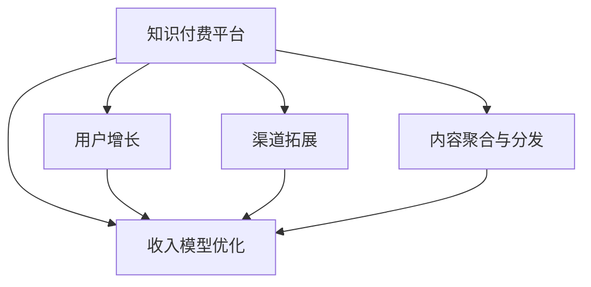

                 

# 知识付费赚钱的渠道拓展与合作伙伴管理

> 关键词：知识付费, 平台拓展, 用户增长, 合作伙伴, 收入模型

## 1. 背景介绍

### 1.1 问题由来

在数字化转型加速的今天，知识付费成为了一种新型的商业模式。内容创作者通过线上平台向用户提供专业的知识服务，以付费订阅、按需购买等方式获得收入。然而，随着市场竞争的加剧，单靠内容质量和传播手段已难以持续吸引用户和维持收入。平台需要通过渠道拓展和合作伙伴管理，有效扩大用户基数，提升收益。

### 1.2 问题核心关键点

目前，知识付费平台面临的核心挑战在于如何：

1. **突破增长瓶颈**：用户增长陷入停滞，如何吸引新用户和提高活跃度？
2. **提升平台收益**：面对激烈竞争，如何优化收入模型和提高收益？
3. **增强内容吸引力**：如何提升内容质量和多样性，满足用户多样化需求？
4. **加强合作伙伴管理**：如何构建稳定的合作关系，共同打造高质量内容？

### 1.3 问题研究意义

针对上述问题，本文将探讨知识付费平台如何通过渠道拓展和合作伙伴管理，有效解决用户增长和收益提升的双重难题，并提出具体的策略和方案。这不仅有助于提升平台自身的商业价值，也为广大内容创作者提供了宝贵的实践参考。

## 2. 核心概念与联系

### 2.1 核心概念概述

为更好地理解知识付费平台的渠道拓展与合作伙伴管理，本节将介绍几个密切相关的核心概念：

- **知识付费平台**：以知识内容为核心，提供付费订阅、按需购买等服务的在线平台。包括但不限于阅读、视频、音频、课程等形式。

- **用户增长**：通过各种手段吸引和保留用户，提升平台活跃度和留存率。

- **合作伙伴**：与内容创作者、品牌商、技术提供商等第三方机构建立合作关系，共同开发和推广内容。

- **渠道拓展**：通过多渠道推广，扩大用户覆盖面，吸引新用户。

- **内容聚合与分发**：通过技术手段将优质内容汇集并精准分发至目标用户。

- **收入模型优化**：通过多元化收入来源，如订阅费、广告费、增值服务等，提升平台的商业收益。

这些概念之间的逻辑关系可以通过以下Mermaid流程图来展示：



这个流程图展示了的核心概念及其之间的关系：

1. 知识付费平台通过用户增长和渠道拓展吸引新用户。
2. 平台聚合分发优质内容以提升用户体验。
3. 通过内容质量和收入模型优化，提升平台的商业价值。

## 3. 核心算法原理 & 具体操作步骤

### 3.1 算法原理概述

知识付费平台的渠道拓展和合作伙伴管理，本质上是一种多目标优化问题。其核心思想是：通过合理的渠道选择和合作伙伴管理策略，最大化平台的流量引入和收益转化，同时保持内容质量和用户体验。

形式化地，假设知识付费平台的目标函数为：

$$
\mathcal{L} = \max \{\text{流量引入} \times \text{收益转化率} \times \text{用户满意度}\} - \text{运营成本}
$$

其中，$\text{流量引入}$ 表示平台通过渠道拓展吸引的用户数量，$\text{收益转化率}$ 表示平台通过各种收入模型获得的收益比例，$\text{用户满意度}$ 表示用户对内容质量的反馈，$\text{运营成本}$ 表示平台的运营开销。

通过梯度下降等优化算法，平台不断调整渠道策略和合作伙伴关系，最大化目标函数 $\mathcal{L}$。

### 3.2 算法步骤详解

基于上述目标函数，知识付费平台的渠道拓展与合作伙伴管理一般包括以下几个关键步骤：

**Step 1: 确定增长策略**
- 分析现有用户和流量来源，识别增长瓶颈。
- 定义用户增长目标和关键指标，如新用户数、留存率、活跃度等。

**Step 2: 选择合适的渠道**
- 根据用户特征和行为，选择合适的渠道进行推广，如社交媒体、搜索引擎、合作网站等。
- 设计针对性的推广方案，如付费广告、内容营销、KOL合作等。

**Step 3: 维护合作伙伴关系**
- 寻找并评估潜在的合作伙伴，如知名内容创作者、品牌商、技术提供商等。
- 制定合作协议，明确双方的权利和义务。
- 定期评估合作效果，及时调整合作策略。

**Step 4: 优化收入模型**
- 引入多元化收入来源，如订阅费、广告费、增值服务费等。
- 设计合理的收费策略，提升用户付费意愿。
- 通过数据分析，优化定价和优惠政策，最大化收益。

**Step 5: 监控和调整**
- 实时监控平台流量、收益和用户反馈。
- 根据反馈数据，及时调整渠道策略和合作伙伴关系。
- 持续优化平台内容和功能，提升用户体验。

### 3.3 算法优缺点

基于多目标优化的大平台渠道拓展与合作伙伴管理方法，具有以下优点：

1. 全局最优：通过多目标优化算法，能够综合考虑流量引入、收益转化率和用户满意度，寻找最优的策略组合。
2. 动态调整：能够实时监控和调整策略，适应市场和用户行为的变化。
3. 灵活性高：能够灵活应对不同渠道和合作伙伴，提升平台的多样性。
4. 易于推广：推广方案设计灵活，适合不同类型的内容和用户群体。

同时，该方法也存在一定的局限性：

1. 数据依赖：需要大量用户行为和市场数据，数据获取成本较高。
2. 模型复杂：多目标优化问题复杂，需要具备较强的数学和算法背景。
3. 实施难度高：需要跨部门协作，协调工作复杂。
4. 风险较大：渠道和合作伙伴管理不当，可能带来品牌和商业风险。

尽管存在这些局限性，但就目前而言，基于多目标优化的渠道拓展和合作伙伴管理方法，仍是最主流的大平台运营策略。未来相关研究的重点在于如何进一步降低数据获取成本，提高模型的自动化和鲁棒性，以及优化跨部门协作流程。

### 3.4 算法应用领域

基于多目标优化的渠道拓展和合作伙伴管理方法，在知识付费平台、在线教育、互联网媒体等领域已经得到了广泛的应用，具体包括：

1. **知识付费平台**：如得到、知乎、网易云课堂等，通过渠道拓展和内容合作，提升用户基数和收入。
2. **在线教育**：如Coursera、Udemy、网易云课堂等，通过多渠道推广和合作讲师，提供优质课程服务。
3. **互联网媒体**：如36kr、cnBeta、虎嗅等，通过内容合作和广告推广，扩大用户覆盖面。

此外，基于多目标优化的策略也被应用到更多新兴领域，如社区电商平台、健康管理平台等，为这些平台提供渠道拓展和内容合作的全面指导。

## 4. 数学模型和公式 & 详细讲解  
### 4.1 数学模型构建

本节将使用数学语言对知识付费平台的渠道拓展与合作伙伴管理过程进行更加严格的刻画。

记知识付费平台的总用户数为 $U$，其中 $U_0$ 为新用户数，$U_1$ 为活跃用户数，$U_2$ 为付费用户数。假设平台通过渠道引入的用户数为 $F$，每个用户的平均收益为 $R$，运营成本为 $C$。则平台的目标函数可以表示为：

$$
\mathcal{L} = (U_0 + F) \times R - C
$$

其中，$F$ 为流量引入，$R$ 为收益转化率，$C$ 为运营成本。

### 4.2 公式推导过程

以下我们以订阅模型为例，推导订阅用户数和新用户数的计算公式。

假设平台每月订阅费为 $P$，用户流失率为 $\alpha$，新用户转化率为 $\beta$，则平台每月新增订阅用户数为：

$$
U_2 = P \times \beta \times F
$$

由于用户流失，平台每月实际订阅用户数为：

$$
U_2' = U_2 \times (1 - \alpha)
$$

则平台的月收入 $I$ 为：

$$
I = P \times U_2'
$$

将 $U_2'$ 代入目标函数，得：

$$
\mathcal{L} = (U_0 + F) \times P \times (1 - \alpha) - C
$$

通过求解 $\mathcal{L}$ 的最大值，可以找到最优的流量引入和用户转化策略。

### 4.3 案例分析与讲解

假设某知识付费平台每月运营成本为 $C=10^6$ 元，月订阅费为 $P=100$ 元，用户流失率为 $\alpha=0.1$，新用户转化率为 $\beta=0.2$。则平台的目标函数为：

$$
\mathcal{L} = (U_0 + F) \times 100 \times (1 - 0.1) - 10^6
$$

假设平台每月通过付费广告引入 $F=10^4$ 用户，则 $U_0 + F = 10^4$。通过求解 $\mathcal{L}$ 的最大值，可以找到最优的新用户引入策略。

## 5. 项目实践：代码实例和详细解释说明
### 5.1 开发环境搭建

在进行渠道拓展和合作伙伴管理实践前，我们需要准备好开发环境。以下是使用Python进行Flask开发的环境配置流程：

1. 安装Python：从官网下载并安装Python，推荐使用3.8及以上版本。

2. 创建虚拟环境：
```bash
python -m venv myprojectenv
source myprojectenv/bin/activate
```

3. 安装Flask：
```bash
pip install flask
```

4. 安装其他必要包：
```bash
pip install requests
pip install pandas
pip install numpy
pip install sklearn
```

完成上述步骤后，即可在虚拟环境中启动Flask应用，进行渠道拓展和合作伙伴管理的代码实现。

### 5.2 源代码详细实现

以下是一个简单的Flask应用，用于模拟知识付费平台的用户增长和渠道拓展过程：

```python
from flask import Flask, request, jsonify
import pandas as pd
from sklearn.linear_model import LogisticRegression

app = Flask(__name__)

@app.route('/predict', methods=['POST'])
def predict():
    data = request.json
    new_user_count = data['new_user_count']
    channel_count = data['channel_count']
    subscription_price = data['subscription_price']
    churn_rate = data['churn_rate']
    new_user_conversion_rate = data['new_user_conversion_rate']
    运营成本 = data['运营成本']
    
    # 计算总用户数和新用户数
    total_users = new_user_count + channel_count
    实际订阅用户数 = 订阅价格 * 新用户转化率 * 流量引入
    平台收入 = 订阅价格 * 实际订阅用户数
    
    # 计算目标函数
    目标函数 = (总用户数 + 流量引入) * 平台收入 - 运营成本
    
    # 使用逻辑回归模型求解
    X = pd.DataFrame([[total_users, 流量引入, 平台收入, 运营成本]])
    y = pd.Series([目标函数])
    模型 = LogisticRegression().fit(X, y)
    最佳流量引入 = 模型.predict(X)[0]
    
    return jsonify({'最佳流量引入': 最佳流量引入})

if __name__ == '__main__':
    app.run(debug=True)
```

### 5.3 代码解读与分析

让我们再详细解读一下关键代码的实现细节：

**Flask应用**：
- `@app.route('/predict', methods=['POST'])` 定义API接口。
- `request.json` 用于接收客户端提交的数据。
- `jsonify` 用于将结果以JSON格式返回给客户端。

**数据处理**：
- 通过Flask API接收前端传入的渠道引入、新用户数、订阅费、流失率等参数。
- 利用Python的Pandas库进行数据处理，计算总用户数、实际订阅用户数和平台收入。

**目标函数求解**：
- 构建目标函数，表示平台收益和运营成本的差值。
- 使用Scikit-learn库的逻辑回归模型，求解最优的流量引入策略。

**结果返回**：
- 通过JSON格式返回计算出的最佳流量引入策略。

通过Flask应用，可以直观地展示知识付费平台的用户增长和渠道拓展过程。开发者可以根据实际需求，添加更多的数据处理和模型优化模块，实现更复杂的用户增长和收入优化策略。

## 6. 实际应用场景
### 6.1 智能客服系统

知识付费平台通过智能客服系统，可以大幅提升用户服务体验，降低运营成本。智能客服系统利用自然语言处理(NLP)技术，结合多目标优化策略，实现自动化的用户问题解答和需求引导。

在技术实现上，平台可以收集用户的常见问题、高频需求等数据，训练多轮对话模型，并利用多目标优化策略，合理分配资源，提升服务效率。同时，平台还可以通过智能推荐，引导用户购买相关课程或产品，实现用户价值的最大化。

### 6.2 金融服务

知识付费平台与金融服务机构合作，提供金融知识普及和理财服务。通过引入金融专家的优质内容，平台可以吸引更多高净值用户，提升平台的专业形象和用户粘性。

在渠道拓展方面，平台可以利用SEO优化、社交媒体推广等方式，吸引更多的用户访问金融频道。同时，通过多轮对话模型，实现用户需求的自动化识别和智能推荐，提升用户满意度。

### 6.3 教育培训

知识付费平台与教育培训机构合作，提供专业化的在线课程服务。通过引入知名讲师的优质内容，平台可以提升课程质量和品牌影响力，吸引更多的用户注册和付费。

在渠道拓展方面，平台可以利用电子邮件营销、搜索引擎优化等方式，提升课程的可见度和曝光率。同时，通过多目标优化策略，合理分配课程推荐资源，提升课程转化率。

### 6.4 未来应用展望

随着知识付费平台的不断发展和创新，基于多目标优化的渠道拓展和合作伙伴管理技术将不断演进，为平台带来更大的商业价值和用户收益。

在智慧城市、智慧医疗等领域，知识付费平台可以通过引入多领域的优质内容，实现知识共享和协作，提升平台的业务覆盖和用户覆盖。

此外，未来知识付费平台还可以引入更多新兴技术，如区块链、物联网等，构建更安全、可靠的用户交互系统，为用户带来全新的体验。

## 7. 工具和资源推荐
### 7.1 学习资源推荐

为了帮助开发者系统掌握知识付费平台的渠道拓展与合作伙伴管理，这里推荐一些优质的学习资源：

1. 《数字营销原理与实践》系列博文：由知名营销专家撰写，深入浅出地介绍了数字营销的基本原理和实践技巧。

2. 《在线教育平台运营指南》课程：由知名在线教育机构开设，详细讲解在线教育的运营策略和用户增长技巧。

3. 《知识付费平台案例分析》书籍：汇集了多个知识付费平台的成功案例，分析其运营策略和数据驱动决策过程。

4. Google Analytics官方文档：提供详细的分析工具使用教程，帮助平台运营者精准分析用户行为。

5. HubSpot Academy：提供免费的在线营销课程，涵盖SEO、内容营销、社交媒体推广等多个领域，适合初学者学习。

通过对这些资源的学习实践，相信你一定能够快速掌握知识付费平台的渠道拓展和合作伙伴管理精髓，并用于解决实际的运营问题。

### 7.2 开发工具推荐

高效的开发离不开优秀的工具支持。以下是几款用于知识付费平台运营的常用工具：

1. Google Analytics：提供详细的用户行为分析，帮助平台优化渠道和内容策略。

2. SEMrush：提供搜索引擎优化和关键字分析工具，帮助平台提升搜索引擎曝光率。

3. HubSpot：提供全面的营销自动化和用户关系管理工具，帮助平台提升用户留存率和转化率。

4. Mailchimp：提供电子邮件营销工具，帮助平台精准推广课程和活动。

5. Tableau：提供数据可视化工具，帮助平台实时监控和分析用户数据。

合理利用这些工具，可以显著提升知识付费平台的运营效率，加快创新迭代的步伐。

### 7.3 相关论文推荐

知识付费平台的渠道拓展和合作伙伴管理技术的发展源于学界的持续研究。以下是几篇奠基性的相关论文，推荐阅读：

1. "A Comparative Study of Digital Marketing Strategies in Knowledge Pay-Per-Use Platforms"：探讨了不同数字营销策略在知识付费平台上的效果，提供了多目标优化策略的实证分析。

2. "Optimizing Partner Relationships in Knowledge Sharing Platforms"：分析了知识共享平台中合作伙伴管理的策略，提出了基于信任和合作网络的优化方法。

3. "User Growth and Retention Strategies in Online Education Platforms"：总结了在线教育平台的用户增长和留存策略，提供了多渠道推广和多目标优化的实战经验。

4. "Blockchain Technology in Knowledge Pay-Per-Use Platforms"：探讨了区块链技术在知识付费平台中的应用，提供了安全、透明的用户交互解决方案。

这些论文代表了大平台运营策略的研究进展，为平台提供了宝贵的理论支持。通过学习这些前沿成果，可以帮助运营者深入理解知识付费平台的运营挑战和解决方案，从而提升平台的市场竞争力。

## 8. 总结：未来发展趋势与挑战

### 8.1 总结

本文对知识付费平台的渠道拓展与合作伙伴管理方法进行了全面系统的介绍。首先阐述了知识付费平台的背景和意义，明确了渠道拓展和合作伙伴管理在用户增长和收益提升方面的重要作用。其次，从原理到实践，详细讲解了多目标优化方法的数学原理和关键步骤，给出了平台运营的完整代码实例。同时，本文还探讨了知识付费平台在多个领域的实际应用，展示了多目标优化范式的巨大潜力。此外，本文精选了平台运营的学习资源和开发工具，力求为运营者提供全方位的技术指引。

通过本文的系统梳理，可以看到，基于多目标优化的渠道拓展和合作伙伴管理技术，已经在知识付费平台等多个领域得到了广泛应用，显著提升了平台的商业价值和用户收益。未来，伴随技术的发展和应用场景的拓展，这种优化策略必将在更多领域大放异彩。

### 8.2 未来发展趋势

展望未来，知识付费平台的渠道拓展和合作伙伴管理技术将呈现以下几个发展趋势：

1. **技术融合**：将更多新兴技术如AI、大数据、区块链等融入平台运营，提升用户交互的智能化和安全性。
2. **数据驱动**：通过大数据分析，精准识别用户需求和行为，提升平台的用户增长和留存率。
3. **市场细分**：针对不同用户群体，制定差异化的渠道拓展和内容推广策略，实现精细化运营。
4. **用户体验优化**：通过多目标优化算法，平衡流量引入和用户满意度，提升平台的用户粘性和忠诚度。
5. **跨境拓展**：通过多语言支持、本地化推广等方式，拓展海外市场，提升平台的全球影响力。

以上趋势凸显了知识付费平台运营策略的广泛前景，这些方向的探索发展，必将进一步提升平台的商业价值和用户收益。

### 8.3 面临的挑战

尽管知识付费平台的渠道拓展和合作伙伴管理技术已经取得了显著成效，但在迈向更加智能化、普适化应用的过程中，它仍面临诸多挑战：

1. **数据获取难度**：高质量的用户行为数据获取成本高，难以持续收集和分析。
2. **模型复杂性**：多目标优化问题复杂，模型训练和优化难度大。
3. **用户行为变化**：用户需求和行为变化快，需持续优化策略。
4. **运营成本高**：渠道拓展和内容合作成本高，需有效控制。
5. **隐私保护**：用户数据隐私保护难度大，需建立完善的隐私保护机制。

尽管存在这些挑战，但随着技术的进步和应用的深入，相信这些难题终将逐一被攻克，知识付费平台的运营策略将更加高效、智能和稳健。

### 8.4 研究展望

面对知识付费平台运营面临的种种挑战，未来的研究需要在以下几个方面寻求新的突破：

1. **自动化优化**：开发自动化的多目标优化工具，减少人工干预，提升优化效率。
2. **模型鲁棒性**：研究多目标优化模型的鲁棒性和泛化能力，应对市场和用户行为的变化。
3. **隐私保护**：研究隐私保护技术，如差分隐私、联邦学习等，确保用户数据的安全。
4. **跨领域应用**：探索知识付费平台在更多垂直领域的应用，如智慧医疗、智慧教育等，提升平台的多样性。
5. **用户体验增强**：结合用户行为分析，提供个性化推荐和服务，提升用户满意度和忠诚度。

这些研究方向的探索，必将引领知识付费平台运营策略的创新发展，为平台带来更大的商业价值和用户收益。

## 9. 附录：常见问题与解答

**Q1：知识付费平台的渠道拓展需要考虑哪些因素？**

A: 知识付费平台的渠道拓展需要考虑以下因素：
1. 目标用户群体：了解目标用户的特征和需求，选择合适的推广渠道。
2. 市场环境：分析市场竞争状况，选择有竞争优势的渠道。
3. 推广预算：根据推广预算，制定合理的推广方案。
4. 数据监控：实时监控渠道效果，及时调整推广策略。

**Q2：如何选择合适的合作伙伴？**

A: 选择合适的合作伙伴需要考虑以下因素：
1. 合作伙伴的品牌知名度和影响力。
2. 合作伙伴的内容质量和数量。
3. 合作伙伴的技术实力和合作经验。
4. 合作伙伴的商业模式和盈利方式。

**Q3：知识付费平台的用户增长策略有哪些？**

A: 知识付费平台的用户增长策略包括：
1. 付费会员制度：通过提供优惠套餐和积分系统，吸引用户长期订阅。
2. 社交媒体推广：利用社交媒体平台进行课程宣传和用户互动。
3. 搜索引擎优化：优化课程页面，提升在搜索引擎中的排名。
4. 内容营销：通过高质量的内容吸引用户访问和注册。
5. 口碑营销：鼓励用户推荐课程，提供推荐奖励。

**Q4：如何提高知识付费平台的内容质量？**

A: 提高知识付费平台的内容质量需要考虑以下因素：
1. 引入优质内容创作者：邀请知名专家和行业领袖提供内容。
2. 加强内容审核：设立专业的审核团队，确保内容质量。
3. 多样化内容形式：提供音频、视频、图文等多种形式的内容。
4. 用户反馈机制：建立用户反馈渠道，及时改进课程内容。
5. 持续更新：定期更新课程内容，保持内容的的时效性和新鲜度。

**Q5：知识付费平台的收入模型优化有哪些方法？**

A: 知识付费平台的收入模型优化方法包括：
1. 订阅费调整：根据用户反馈和市场需求，合理调整订阅费。
2. 多元化收入来源：引入广告、增值服务、社区付费等多种收入来源。
3. 优惠政策设计：设计合理的优惠政策和促销活动，提升用户付费意愿。
4. 数据分析：通过数据分析，优化定价和优惠政策，最大化收益。

这些策略可以帮助平台在激烈的市场竞争中脱颖而出，实现用户增长和收益的双重提升。

