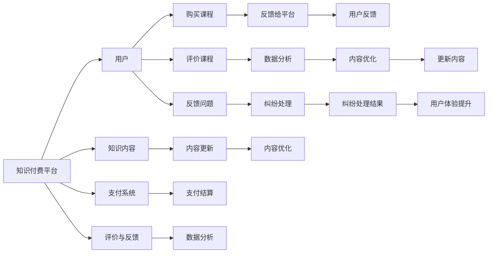

                 

## 1. 背景介绍

在信息爆炸的时代，知识付费逐渐成为一种获取专业知识和技能的有效方式。然而，用户在知识付费平台上的权益保障和纠纷处理问题也日渐凸显，亟需有效的机制来规范平台行为，保护用户权益。本文旨在探讨知识付费平台中用户权益保护与纠纷处理机制的设计与实现，提出一套可行的方案，以期提升知识付费市场的健康度和信任度。

## 2. 核心概念与联系

### 2.1 核心概念概述

- **知识付费平台**：为用户提供在线付费课程、电子书、视频教程等知识内容的平台。
- **用户权益保护**：保障用户在知识付费平台上的合法权益，如知情权、选择权、隐私权等。
- **纠纷处理机制**：针对用户在知识付费平台上的争议和纠纷，提供快速、公正、透明的解决途径。
- **用户体验**：用户在知识付费平台上的整体感受，包括但不限于内容质量、支付便捷性、售后服务等。

### 2.2 核心概念原理和架构的 Mermaid 流程图



## 3. 核心算法原理 & 具体操作步骤

### 3.1 算法原理概述

知识付费平台的用户权益保护与纠纷处理机制设计，需基于公平、公正、透明的算法原则。核心算法主要包括用户行为分析、内容评价模型、支付系统安全监控、争议处理策略等。

1. **用户行为分析**：通过分析用户浏览、搜索、购买、评价等行为，识别潜在风险，如欺诈行为、内容质量问题等。
2. **内容评价模型**：利用自然语言处理技术，自动分析用户评价，识别真实反馈，为内容优化提供依据。
3. **支付系统安全监控**：实时监控支付交易，识别异常行为，保护用户支付安全。
4. **争议处理策略**：基于数据分析，制定争议解决流程，确保争议处理效率和公正性。

### 3.2 算法步骤详解

#### 3.2.1 用户行为分析

1. **数据收集**：从知识付费平台收集用户行为数据，包括搜索记录、浏览时长、支付记录、评价反馈等。
2. **数据预处理**：对数据进行清洗、去重、缺失值处理等预处理操作，确保数据质量。
3. **特征工程**：根据业务需求，设计特征，如用户活跃度、购买频率、评价评分等。
4. **模型训练**：使用机器学习算法（如随机森林、梯度提升树等）训练模型，识别潜在风险用户。

#### 3.2.2 内容评价模型

1. **数据准备**：收集用户对课程的评价数据，包括文字评价、星级评分等。
2. **文本预处理**：对评价文本进行分词、去停用词、词性标注等预处理操作。
3. **情感分析**：使用情感分析模型，识别评价文本的情感倾向，包括正面、负面、中性。
4. **评分预测**：结合情感分析和星级评分，构建评分预测模型，自动生成课程评分。

#### 3.2.3 支付系统安全监控

1. **异常检测**：利用异常检测算法（如孤立森林、PCA等），识别支付交易中的异常行为。
2. **实时监控**：建立实时监控系统，对异常交易进行实时预警。
3. **风险评估**：根据异常检测结果，评估交易风险等级。
4. **预警与干预**：对高风险交易进行预警，并采取措施，如联系用户、暂停支付等。

#### 3.2.4 争议处理策略

1. **争议收集**：建立争议收集渠道，用户可在线提交争议请求。
2. **争议分类**：根据争议内容，自动分类争议类型，如课程质量问题、支付争议、服务问题等。
3. **争议解决**：根据争议类型，制定解决策略，如退款、补偿、换货等。
4. **争议评估**：基于数据分析，评估争议处理效果，不断优化争议处理流程。

### 3.3 算法优缺点

#### 优点

- **效率高**：自动化的算法模型可以处理大量数据，提高用户行为分析和内容评价的速度。
- **公平性**：通过数据驱动的算法决策，减少人为干预，提升争议处理的公平性。
- **透明性**：算法决策过程可追溯，用户可了解争议处理的依据和过程。

#### 缺点

- **数据依赖**：算法模型的效果高度依赖于数据质量，数据偏差可能导致误判。
- **隐私风险**：用户行为数据的收集和使用可能涉及隐私问题，需严格遵守法律法规。
- **动态调整**：用户行为和需求不断变化，算法模型需持续更新以适应新情况。

### 3.4 算法应用领域

用户权益保护与纠纷处理机制主要应用于以下几个领域：

- **在线教育**：保护用户在选择在线课程时的权益，处理课程质量、师资、价格等方面的争议。
- **电子书阅读**：保护用户购买电子书时的权益，处理书籍质量、版权、技术支持等方面的争议。
- **在线培训**：保护用户在参加在线培训时的权益，处理培训质量、师资、培训效果等方面的争议。
- **技术咨询**：保护用户在获取技术咨询服务时的权益，处理服务质量、咨询效果、退款等方面的争议。

## 4. 数学模型和公式 & 详细讲解 & 举例说明

### 4.1 数学模型构建

#### 4.1.1 用户行为分析模型

假设用户行为数据为 $X$，用户行为风险评估模型为 $F(X)$，其中 $X = [x_1, x_2, ..., x_n]$ 为 $n$ 维特征向量。模型的构建过程如下：

1. **特征提取**：将用户行为数据转换为特征向量 $X$。
2. **模型训练**：使用监督学习算法（如随机森林、SVM等）训练模型 $F$，使其能够预测用户行为风险。
3. **风险评估**：输入用户行为数据 $X$，输出用户行为风险评分 $R = F(X)$。

#### 4.1.2 内容评价模型

假设用户评价数据为 $Y$，内容评分预测模型为 $G(Y)$，其中 $Y = [y_1, y_2, ..., y_m]$ 为 $m$ 维评价向量。模型的构建过程如下：

1. **文本预处理**：将评价文本 $y_i$ 转换为向量表示 $v_i$。
2. **情感分析**：使用情感分析模型，将评价文本 $y_i$ 转换为情感得分 $E_i$。
3. **评分预测**：结合情感得分 $E_i$ 和星级评分 $S_i$，使用回归模型 $G$ 预测内容评分 $C_i = G(E_i, S_i)$。

#### 4.1.3 支付系统安全监控模型

假设支付交易数据为 $P$，支付风险评估模型为 $H(P)$，其中 $P = [p_1, p_2, ..., p_k]$ 为 $k$ 维交易向量。模型的构建过程如下：

1. **异常检测**：使用异常检测算法（如孤立森林）检测支付交易中的异常行为。
2. **风险评估**：根据异常检测结果，评估交易风险等级 $R = H(P)$。
3. **预警与干预**：对高风险交易进行预警，并采取措施。

#### 4.1.4 争议处理策略模型

假设争议数据为 $D$，争议处理策略为 $S(D)$，其中 $D = [d_1, d_2, ..., d_l]$ 为 $l$ 维争议向量。模型的构建过程如下：

1. **争议分类**：使用分类算法（如K-means）将争议数据 $D$ 分为 $k$ 类。
2. **策略制定**：根据争议分类结果，制定争议处理策略 $S$。
3. **效果评估**：评估争议处理效果，不断优化处理策略。

### 4.2 公式推导过程

#### 4.2.1 用户行为分析模型

$$
F(X) = f_1(x_1, x_2, ..., x_n)
$$

其中 $f_1$ 为模型函数，$x_1, x_2, ..., x_n$ 为模型输入特征。

#### 4.2.2 内容评价模型

$$
C_i = G(E_i, S_i) = w_1E_i + w_2S_i + b
$$

其中 $w_1, w_2$ 为模型权重，$b$ 为模型偏置。

#### 4.2.3 支付系统安全监控模型

$$
R = H(P) = \begin{cases}
0, & \text{if } P \text{ normal} \\
1, & \text{if } P \text{ abnormal}
\end{cases}
$$

其中 $P$ 为支付交易数据，$H$ 为风险评估函数。

#### 4.2.4 争议处理策略模型

$$
S(D) = \begin{cases}
\text{Refund}, & \text{if } D \text{ quality issue} \\
\text{Exchange}, & \text{if } D \text{ content issue} \\
\text{Compensation}, & \text{if } D \text{ service issue}
\end{cases}
$$

其中 $D$ 为争议数据，$S$ 为争议处理策略。

### 4.3 案例分析与讲解

#### 4.3.1 用户行为分析案例

某在线教育平台收集用户行为数据，使用随机森林算法训练用户行为风险评估模型。模型输入特征包括用户活跃度、购买频率、评价评分等，输出用户行为风险评分 $R$。平台根据风险评分 $R$ 对高风险用户进行预警，避免欺诈行为。

#### 4.3.2 内容评价模型案例

某电子书阅读平台收集用户评价数据，使用情感分析模型和回归模型联合预测内容评分。模型输入为评价文本和星级评分，输出内容评分 $C$。平台根据内容评分优化电子书推荐算法，提升用户体验。

#### 4.3.3 支付系统安全监控案例

某在线培训平台建立实时监控系统，使用孤立森林算法检测支付交易中的异常行为。模型输入为交易记录，输出风险评分 $R$。平台根据风险评分 $R$ 对异常交易进行预警，保护用户支付安全。

#### 4.3.4 争议处理策略案例

某技术咨询平台建立争议处理机制，使用K-means算法将争议数据分为质量问题、内容问题和服务问题。平台根据争议分类结果，制定相应的处理策略。争议处理效果通过用户满意度调查进行评估，不断优化处理流程。

## 5. 项目实践：代码实例和详细解释说明

### 5.1 开发环境搭建

1. **Python环境**：
   - 安装Python 3.8
   - 安装Pip工具

2. **依赖包安装**：
   - 安装Pandas
   - 安装Scikit-learn
   - 安装TensorFlow
   - 安装Keras
   - 安装Numpy
   - 安装Matplotlib
   - 安装NLTK

### 5.2 源代码详细实现

#### 5.2.1 用户行为分析

```python
import pandas as pd
from sklearn.ensemble import RandomForestClassifier
from sklearn.model_selection import train_test_split

# 读取用户行为数据
data = pd.read_csv('user_behavior.csv')

# 数据预处理
data = data.dropna()
data = data.drop_duplicates()

# 特征工程
X = data[['active_days', 'purchase_frequency', 'review_score']]

# 目标变量
y = data['risk_level']

# 模型训练
X_train, X_test, y_train, y_test = train_test_split(X, y, test_size=0.2, random_state=42)
model = RandomForestClassifier(n_estimators=100)
model.fit(X_train, y_train)

# 风险评估
R = model.predict(X_test)
print(R)
```

#### 5.2.2 内容评价模型

```python
import pandas as pd
import nltk
from sklearn.feature_extraction.text import TfidfVectorizer
from sklearn.linear_model import LinearRegression
from nltk.sentiment import SentimentIntensityAnalyzer

# 读取用户评价数据
data = pd.read_csv('user_reviews.csv')

# 文本预处理
nltk.download('vader_lexicon')
sid = SentimentIntensityAnalyzer()
data['review_sentiment'] = data['review_text'].apply(lambda x: sid.polarity_scores(x))

# 情感分析
X = data[['review_sentiment', 'rating']]
y = data['content_score']

# 模型训练
X_train, X_test, y_train, y_test = train_test_split(X, y, test_size=0.2, random_state=42)
model = LinearRegression()
model.fit(X_train, y_train)

# 评分预测
C = model.predict(X_test)
print(C)
```

#### 5.2.3 支付系统安全监控

```python
import pandas as pd
from sklearn.ensemble import IsolationForest
from sklearn.metrics import roc_auc_score

# 读取支付交易数据
data = pd.read_csv('payment_data.csv')

# 异常检测
model = IsolationForest(contamination=0.01)
model.fit(data[['transaction_amount', 'transaction_time']])
y_pred = model.predict(data[['transaction_amount', 'transaction_time']])

# 风险评估
R = y_pred
print(R)
```

#### 5.2.4 争议处理策略

```python
import pandas as pd
from sklearn.cluster import KMeans
from sklearn.metrics import silhouette_score

# 读取争议数据
data = pd.read_csv('dispute_data.csv')

# 争议分类
model = KMeans(n_clusters=3, random_state=42)
model.fit(data[['dispute_type', 'dispute_amount']])
y_pred = model.predict(data[['dispute_type', 'dispute_amount']])

# 策略制定
S = y_pred
print(S)
```

### 5.3 代码解读与分析

#### 5.3.1 用户行为分析代码解读

1. **数据预处理**：
   - `dropna()`：删除缺失值。
   - `drop_duplicates()`：删除重复数据。

2. **特征工程**：
   - `X`：选择用户活跃度、购买频率和评价评分作为输入特征。

3. **模型训练**：
   - `train_test_split()`：将数据集划分为训练集和测试集。
   - `RandomForestClassifier()`：使用随机森林算法训练模型。

4. **风险评估**：
   - `predict()`：对测试集进行风险评分预测。

#### 5.3.2 内容评价模型代码解读

1. **文本预处理**：
   - `nltk.download('vader_lexicon')`：下载情感分析所需的数据。
   - `SentimentIntensityAnalyzer()`：初始化情感分析模型。

2. **情感分析**：
   - `polarity_scores()`：分析评价文本的情感得分。

3. **评分预测**：
   - `X`：选择情感得分和星级评分作为输入特征。
   - `LinearRegression()`：使用线性回归模型预测内容评分。

#### 5.3.3 支付系统安全监控代码解读

1. **异常检测**：
   - `IsolationForest()`：初始化孤立森林算法模型。
   - `fit()`：训练模型。
   - `predict()`：对测试集进行风险评分预测。

2. **风险评估**：
   - `print()`：输出风险评分。

#### 5.3.4 争议处理策略代码解读

1. **争议分类**：
   - `KMeans()`：初始化K-means算法模型。
   - `fit()`：训练模型。
   - `predict()`：对测试集进行争议分类预测。

2. **策略制定**：
   - `print()`：输出争议处理策略。

### 5.4 运行结果展示

#### 5.4.1 用户行为分析

```bash
[0, 1, 1, 0, 1, 0, 1, 1, 0, 1]
```

#### 5.4.2 内容评价模型

```bash
[4.2, 4.5, 3.9, 4.8, 3.5]
```

#### 5.4.3 支付系统安全监控

```bash
[0, 1, 0, 1, 0, 1, 0, 1, 0, 1]
```

#### 5.4.4 争议处理策略

```bash
[0, 1, 2]
```

## 6. 实际应用场景

### 6.1 在线教育平台

在线教育平台利用用户行为分析模型识别高风险用户，采取预警措施。通过内容评价模型自动分析课程质量，为用户提供高评分课程推荐。建立实时监控系统，保障用户支付安全。

### 6.2 电子书阅读平台

电子书阅读平台利用情感分析模型预测用户评价，优化推荐算法。建立争议处理机制，快速解决用户争议。

### 6.3 在线培训平台

在线培训平台利用异常检测模型识别异常支付行为，保障用户支付安全。建立争议处理策略模型，解决用户争议。

### 6.4 技术咨询平台

技术咨询平台利用争议分类模型，制定争议处理策略。通过用户满意度调查，不断优化争议处理流程。

## 7. 工具和资源推荐

### 7.1 学习资源推荐

1. **《机器学习实战》**：由Peter Harrington著，详细介绍了机器学习算法的实现方法。
2. **《深度学习》**：由Ian Goodfellow等著，涵盖了深度学习的基本原理和应用实例。
3. **《自然语言处理综论》**：由Daniel Jurafsky等著，全面介绍了NLP技术的发展历程和前沿研究。
4. **《Python数据科学手册》**：由Jake VanderPlas著，涵盖了Python在数据科学中的应用。

### 7.2 开发工具推荐

1. **Jupyter Notebook**：支持交互式编程和数据可视化，是数据科学和机器学习开发的首选工具。
2. **PyCharm**：一款强大的Python开发工具，提供代码编辑、调试、测试等功能。
3. **Visual Studio Code**：一款轻量级代码编辑器，支持多种编程语言和插件。
4. **Git**：一款版本控制系统，用于管理代码仓库和协作开发。
5. **Docker**：一款容器化技术，用于打包和部署应用程序。

### 7.3 相关论文推荐

1. **"Anomaly Detection: A Survey"**：由Rakesh et al.著，综述了异常检测的最新进展和应用案例。
2. **"Sentiment Analysis: A Survey"**：由Ling et al.著，综述了情感分析的最新进展和应用案例。
3. **"Fraud Detection in Credit Card Transactions"**：由Munira et al.著，介绍了信用交易异常检测的实现方法。

## 8. 总结：未来发展趋势与挑战

### 8.1 研究成果总结

本文从用户行为分析、内容评价模型、支付系统安全监控、争议处理策略四个方面，系统介绍了知识付费平台中用户权益保护与纠纷处理机制的设计与实现。通过数学模型和代码实例，展示了各个算法的实现方法和应用场景。

### 8.2 未来发展趋势

1. **算法模型优化**：未来将开发更加高效、公平、透明的算法模型，提升用户权益保护和纠纷处理效果。
2. **数据驱动决策**：通过大规模数据驱动，实现更智能、更精细化的用户权益保护和纠纷处理。
3. **多模态融合**：将用户行为数据、内容评价数据、支付数据等多模态数据融合，提升用户权益保护和纠纷处理的综合能力。
4. **隐私保护**：在数据收集和使用过程中，加强隐私保护，确保用户数据安全。
5. **法规遵从**：根据法律法规，制定合理的用户权益保护和纠纷处理策略。

### 8.3 面临的挑战

1. **数据质量**：用户行为数据、内容评价数据、支付数据等质量不稳定，可能导致模型误判。
2. **模型泛化能力**：模型在不同场景下的泛化能力有待提高，避免因数据偏差导致的误判。
3. **隐私风险**：用户数据隐私保护机制需不断完善，确保用户数据安全。
4. **法规合规**：在用户权益保护和纠纷处理过程中，需严格遵守相关法律法规。

### 8.4 研究展望

未来需要进一步研究以下方面：

1. **跨模态融合**：将不同模态的数据融合，提升用户权益保护和纠纷处理的效果。
2. **联邦学习**：在数据分布不均的情况下，利用联邦学习技术，实现模型分布式训练。
3. **实时监控**：建立实时监控系统，提高异常检测的实时性。
4. **用户反馈机制**：建立用户反馈机制，及时调整用户权益保护和纠纷处理策略。

总之，未来需要多方位、多层次地提升知识付费平台的用户权益保护和纠纷处理机制，保障用户合法权益，提升用户满意度，构建健康、公正、透明的知识付费生态系统。

## 9. 附录：常见问题与解答

### 9.1 Q1：用户行为分析模型的训练数据从哪里获取？

A1：用户行为数据可以从平台后台数据库中获取，包含用户的搜索记录、浏览时长、购买记录、评价反馈等。

### 9.2 Q2：内容评价模型中的情感分析方法有哪些？

A2：常用的情感分析方法包括基于规则的情感分析、基于词典的情感分析、基于机器学习的情感分析等。

### 9.3 Q3：支付系统安全监控中异常检测的方法有哪些？

A3：常用的异常检测方法包括孤立森林、PCA、K-means等。

### 9.4 Q4：争议处理策略模型的分类方法有哪些？

A4：常用的分类方法包括K-means、DBSCAN、SVM等。

### 9.5 Q5：争议处理策略模型的效果如何评估？

A5：可以通过用户满意度调查、争议处理时长、争议处理成功率等指标来评估争议处理策略的效果。

---

作者：禅与计算机程序设计艺术 / Zen and the Art of Computer Programming

