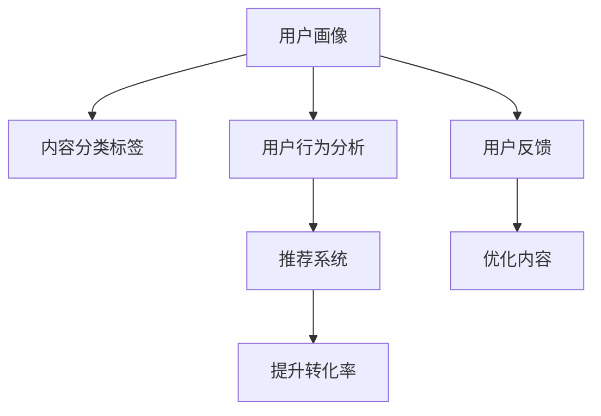

                 

# 知识付费赚钱的用户需求挖掘与分析

## 1. 背景介绍

### 1.1 问题由来

在数字化时代，知识付费成为许多人获取专业信息、提升自我能力的重要方式。以得到、知乎、微信读书等为代表的知识付费平台，通过订阅专栏、购买课程、参与社区讨论等方式，将专业知识和经验分享给用户，形成了知识传播的新模式。

与此同时，知识付费平台也面临诸多挑战。如何吸引用户付费、提升平台黏性、扩大知识覆盖面，成为其发展的关键。在这种背景下，深入挖掘用户需求，并据此进行针对性的内容优化和市场推广，显得尤为重要。

### 1.2 问题核心关键点

如何挖掘用户需求？在实际业务中，这一问题通常包括以下几个方面：

1. **用户画像构建**：通过数据分析，构建用户画像，了解用户的基本属性、兴趣偏好和行为特征，以指导内容的精准推荐。
2. **内容分类标签**：对内容进行自动分类，并引入标签系统，便于用户查找和浏览。
3. **用户反馈收集**：通过用户评价、评论、推荐等反馈机制，收集用户对内容的真实需求和满意度。
4. **用户行为分析**：通过行为数据追踪，了解用户在平台上的浏览路径、消费习惯等行为特征，发现潜在需求。
5. **数据驱动的推荐系统**：基于用户的浏览历史、收藏夹、购买记录等数据，构建推荐模型，实现个性化推荐。

以上几个关键点涉及了数据获取、数据分析、用户反馈、行为分析和内容推荐等多个环节，共同构成了用户需求挖掘的核心框架。

### 1.3 问题研究意义

深入挖掘用户需求，能够帮助知识付费平台更好地满足用户需求，提高用户满意度和平台黏性，促进内容的精细化管理和优化。具体而言：

1. **提高用户转化率**：通过精准推荐，吸引更多用户付费订阅，增加平台收入。
2. **优化用户体验**：根据用户反馈，调整内容和推荐策略，提升用户使用体验。
3. **扩大内容覆盖**：深入分析用户需求，发现更多潜在的市场机会，拓展知识覆盖面。
4. **增强竞争力**：在激烈的市场竞争中，通过更好地满足用户需求，增强平台的竞争力。
5. **促进持续创新**：不断收集用户反馈和行为数据，驱动平台持续创新和迭代。

## 2. 核心概念与联系

### 2.1 核心概念概述

为了更好地理解知识付费平台的用户需求挖掘和分析，本节将介绍几个关键概念：

- **用户画像(User Persona)**：基于用户数据分析构建的虚拟用户模型，包括年龄、性别、职业、兴趣等多个维度。用户画像用于指导内容的精准推荐和市场推广。
- **内容分类标签(Tagging)**：对内容进行自动分类和标签化，便于用户搜索和浏览。标签系统通常采用层次化的结构，方便用户细粒度检索。
- **用户反馈(Feedback)**：用户通过评价、评论、推荐等方式，对内容进行反馈，帮助平台了解用户真实需求和满意度。
- **用户行为分析(Behavior Analysis)**：通过行为数据追踪，分析用户在不同情境下的行为特征，发现潜在需求和市场机会。
- **推荐系统(Recommendation System)**：基于用户历史数据，构建推荐模型，实现个性化推荐。推荐系统常用的算法包括协同过滤、内容过滤、混合推荐等。

这些核心概念之间的逻辑关系可以通过以下Mermaid流程图来展示：



这个流程图展示了大语言模型微调的核心概念及其之间的关系：

1. 用户画像通过数据分析构建，指导内容分类标签和行为分析。
2. 内容分类标签和行为分析支持推荐系统，优化内容并提升转化率。
3. 用户反馈用于改进推荐系统和内容优化，形成闭环反馈机制。

这些概念共同构成了知识付费平台的用户需求挖掘和分析框架，使其能够更好地满足用户需求，提升用户体验和平台竞争力。

## 3. 核心算法原理 & 具体操作步骤
### 3.1 算法原理概述

知识付费平台的用户需求挖掘和分析，本质上是一个数据驱动的用户画像和内容推荐过程。其核心思想是：通过收集和分析用户数据，构建精准的用户画像，结合用户行为数据和反馈信息，进行内容推荐和优化。

形式化地，假设用户集为 $U=\{u_1, u_2, \cdots, u_N\}$，每个用户有 $M$ 个特征 $f_{um}$。内容集为 $C=\{c_1, c_2, \cdots, c_M\}$，每个内容有 $N$ 个用户特征 $f_{cm}$。

定义用户画像 $P=\{p_{um}\}_{u=1}^N$，其中 $p_{um}$ 为第 $u$ 个用户第 $m$ 个特征的值。内容分类标签 $T=\{t_{cm}\}_{c=1}^M$，其中 $t_{cm}$ 为第 $c$ 个内容第 $m$ 个标签的值。

用户反馈 $F=\{f_{um}\}_{u=1}^N$，其中 $f_{um}$ 为第 $u$ 个用户对第 $m$ 个内容的评价。用户行为数据 $B=\{b_{um}\}_{u=1}^N$，其中 $b_{um}$ 为第 $u$ 个用户对第 $m$ 个内容的操作记录。

知识付费平台的推荐系统可以表示为：

$$
\text{Recommend}(u) = \text{Model}(P_u, T_c, F_u, B_u)
$$

其中 $\text{Model}$ 为推荐算法模型，可以根据历史数据和当前数据动态更新。推荐系统的主要目标是最大化用户满意度，即通过精准推荐，提高用户转化率和平台收益。

### 3.2 算法步骤详解

知识付费平台的用户需求挖掘和分析一般包括以下几个关键步骤：

**Step 1: 数据采集和预处理**
- 收集用户基本信息、行为数据、反馈信息等，并将其存储到数据库中。
- 对数据进行清洗、去重、归一化等预处理操作，确保数据质量和一致性。

**Step 2: 用户画像构建**
- 利用机器学习算法（如K-Means、LDA等）对用户特征进行分析，构建用户画像。
- 通过聚类、降维等技术，找出用户特征中的关键因子，形成用户画像的基本维度。

**Step 3: 内容分类和标签系统构建**
- 对内容进行自然语言处理（NLP），提取出关键词、主题等特征。
- 引入标签系统，将内容按照不同维度进行分类，方便用户浏览和检索。

**Step 4: 用户反馈和行为数据分析**
- 收集用户对内容的评价、评论、点赞、分享等反馈数据，进行情感分析、主题建模等。
- 分析用户在不同内容上的行为数据，如浏览时间、点击次数、购买记录等，发现用户兴趣和偏好。

**Step 5: 推荐系统优化**
- 根据用户画像和内容标签，使用协同过滤、内容过滤等推荐算法，生成个性化推荐列表。
- 结合用户反馈和行为数据，动态调整推荐算法参数，提升推荐效果。

**Step 6: 结果评估和迭代**
- 对推荐结果进行评估，如通过A/B测试、用户满意度调查等方式，验证推荐效果。
- 根据评估结果，持续优化推荐算法和内容库，提升用户转化率和平台收益。

### 3.3 算法优缺点

知识付费平台的用户需求挖掘和分析方法具有以下优点：
1. 个性化推荐：通过用户画像和行为分析，实现精准推荐，提升用户满意度和转化率。
2. 数据驱动：基于大量用户数据，进行科学决策，提高平台运营效率。
3. 反馈闭环：通过用户反馈，及时调整推荐策略，形成闭环优化机制。
4. 市场敏感：能够快速响应市场变化，调整内容策略，保持市场竞争力。

同时，该方法也存在一定的局限性：
1. 数据隐私：收集和分析用户数据需要遵守隐私保护法规，确保用户数据安全。
2. 数据质量：用户数据的质量和完整性直接影响分析和推荐结果，需要持续监测和清洗。
3. 算法复杂：推荐算法模型复杂度高，需要专业知识和算力支持。
4. 用户行为多样：用户行为多样复杂，难以全面覆盖，可能导致推荐偏差。
5. 算法效果不稳定：推荐系统效果受多种因素影响，难以保证稳定性和鲁棒性。

尽管存在这些局限性，但知识付费平台的用户需求挖掘和分析方法仍然是当前最有效的用户需求洞察手段。未来相关研究的重点在于如何进一步提高数据质量、优化推荐算法，以及如何更好地保护用户隐私和数据安全。

### 3.4 算法应用领域

知识付费平台的用户需求挖掘和分析方法，已经在多个领域得到广泛应用，例如：

1. 内容推荐：为用户推荐感兴趣的专栏和课程，提升平台粘性和转化率。
2. 市场分析：分析不同内容类型的市场表现，发现市场趋势和机会。
3. 用户调研：通过用户行为数据分析，了解用户需求和偏好，优化产品设计。
4. 个性化服务：根据用户画像，提供个性化内容推荐、课程定制等服务。
5. 流量监测：通过行为数据分析，监测平台流量变化，优化内容分发策略。

除了上述这些经典应用外，知识付费平台的用户需求挖掘和分析方法也在不断创新和扩展，如推荐算法的组合优化、用户画像的实时更新等，为平台带来了更多的竞争优势和发展潜力。

## 4. 数学模型和公式 & 详细讲解  
### 4.1 数学模型构建

本节将使用数学语言对知识付费平台的用户需求挖掘和分析过程进行更加严格的刻画。

定义用户画像 $P=\{p_{um}\}_{u=1}^N$，内容分类标签 $T=\{t_{cm}\}_{c=1}^M$，用户反馈 $F=\{f_{um}\}_{u=1}^N$，用户行为数据 $B=\{b_{um}\}_{u=1}^N$。

推荐系统的目标是最大化用户满意度 $U$，可以通过构建损失函数来表达这一目标：

$$
\mathcal{L} = -\sum_{u=1}^N \log \pi_u
$$

其中 $\pi_u$ 为第 $u$ 个用户对推荐内容 $c$ 的满意度评分，可以通过训练数据拟合得到。

用户满意度 $U$ 可以表示为用户对推荐内容的评价，一般采用平均评分 $\overline{f}_c$ 来表示：

$$
U = \frac{1}{M} \sum_{c=1}^M \overline{f}_c
$$

基于用户画像和内容标签，推荐系统可以使用协同过滤算法，生成推荐列表。协同过滤算法可以表示为：

$$
\text{Recommend}(u) = \text{Model}(P_u, T_c, F_u, B_u)
$$

其中 $\text{Model}$ 为协同过滤模型，根据用户画像和内容标签进行推荐。

### 4.2 公式推导过程

以下我们以协同过滤算法为例，推导推荐系统的基本原理和实现细节。

协同过滤算法的基本思想是：根据用户之间的相似度，推荐与用户 $u$ 相似的其他用户喜欢的内容。假设用户集为 $U=\{u_1, u_2, \cdots, u_N\}$，每个用户有 $M$ 个特征 $f_{um}$。

定义用户相似度矩阵 $S=\{s_{iu}\}_{i=1}^N$，其中 $s_{iu}$ 表示用户 $i$ 和用户 $u$ 的相似度。协同过滤算法的推荐公式为：

$$
\text{Recommend}(u) = \text{TopK}(\{c_k\}_{k=1}^M, \{s_{iu}\}_{i=1}^N, \text{User}_{u})
$$

其中 $\text{TopK}$ 表示从内容集中选出与用户 $u$ 相似度最高的前 $K$ 个内容，推荐给用户 $u$。推荐结果可以表示为：

$$
\text{Recommend}(u) = \text{TopK}(\{c_k\}_{k=1}^M, \{s_{iu}\}_{i=1}^N, \text{User}_{u})
$$

在实际应用中，协同过滤算法可以使用基于用户的协同过滤或基于项目的协同过滤。基于用户的协同过滤直接计算用户之间的相似度，而基于项目的协同过滤则计算内容之间的相似度。

### 4.3 案例分析与讲解

**案例分析：** 假设某知识付费平台收集了用户的基本信息、行为数据和反馈信息，共计1万名用户、2万门课程。平台希望通过协同过滤算法，为每个用户推荐最感兴趣的5门课程。

1. **用户画像构建**：利用用户基本信息，如年龄、职业、教育背景等，构建用户画像。
2. **内容分类标签**：对课程内容进行自然语言处理，提取关键词和主题，构建内容分类标签。
3. **用户反馈和行为数据分析**：收集用户对课程的评价和行为数据，如浏览时间、点击次数、购买记录等。
4. **推荐系统优化**：使用协同过滤算法，根据用户画像和内容标签，生成个性化推荐列表。
5. **结果评估和迭代**：通过A/B测试和用户满意度调查，评估推荐效果，并根据反馈进行模型迭代优化。

**讲解**：该案例展示了知识付费平台用户需求挖掘和分析的基本流程。通过构建用户画像、内容分类标签和行为数据分析，生成推荐列表。再通过用户反馈和A/B测试，不断优化推荐算法，提升用户满意度和平台收益。

## 5. 项目实践：代码实例和详细解释说明
### 5.1 开发环境搭建

在进行知识付费平台用户需求挖掘和分析实践前，我们需要准备好开发环境。以下是使用Python进行PyTorch开发的环境配置流程：

1. 安装Anaconda：从官网下载并安装Anaconda，用于创建独立的Python环境。

2. 创建并激活虚拟环境：
```bash
conda create -n pytorch-env python=3.8 
conda activate pytorch-env
```

3. 安装PyTorch：根据CUDA版本，从官网获取对应的安装命令。例如：
```bash
conda install pytorch torchvision torchaudio cudatoolkit=11.1 -c pytorch -c conda-forge
```

4. 安装TensorFlow：
```bash
pip install tensorflow
```

5. 安装各类工具包：
```bash
pip install numpy pandas scikit-learn matplotlib tqdm jupyter notebook ipython
```

完成上述步骤后，即可在`pytorch-env`环境中开始项目实践。

### 5.2 源代码详细实现

下面我们以推荐系统为例，给出使用TensorFlow进行知识付费平台推荐系统的PyTorch代码实现。

首先，定义推荐系统的数据处理函数：

```python
import pandas as pd
import numpy as np

def load_data(path):
    df = pd.read_csv(path)
    return df

def preprocess_data(df):
    # 用户画像构建
    user_features = df[['age', 'gender', 'education']]
    user_pographics = user_features.apply(lambda x: np.mean(x), axis=1)

    # 内容分类标签
    content_tags = df['tags'].apply(lambda x: x.split(','))

    # 用户反馈
    user_feedback = df['rating']

    # 用户行为数据
    user_actions = df['actions'].apply(lambda x: x.split(','))

    # 特征工程
    user_pographics = pd.DataFrame(user_pographics, columns=['age', 'gender', 'education'])
    user_pographics = user_pographics.fillna(0)
    user_pographics = user_pographics.to_numpy()

    content_tags = pd.DataFrame(content_tags, columns=content_tags[0])
    content_tags = content_tags.fillna(0)
    content_tags = content_tags.to_numpy()

    user_feedback = pd.DataFrame(user_feedback, columns=['rating'])
    user_feedback = user_feedback.fillna(0)
    user_feedback = user_feedback.to_numpy()

    user_actions = pd.DataFrame(user_actions, columns=user_actions[0])
    user_actions = user_actions.fillna(0)
    user_actions = user_actions.to_numpy()

    return user_pographics, content_tags, user_feedback, user_actions
```

然后，定义模型和优化器：

```python
from tensorflow.keras.layers import Dense, Input
from tensorflow.keras.models import Model
from tensorflow.keras.optimizers import Adam

def build_model(user_pographics, content_tags, user_feedback, user_actions):
    # 用户画像嵌入层
    user_pgraphics_input = Input(shape=(len(user_pographics[0]),), name='user_pgraphics_input')
    user_pgraphics_embedding = Dense(64, activation='relu')(user_pgraphics_input)

    # 内容标签嵌入层
    content_tags_input = Input(shape=(len(content_tags[0]),), name='content_tags_input')
    content_tags_embedding = Dense(64, activation='relu')(content_tags_input)

    # 用户行为数据嵌入层
    user_actions_input = Input(shape=(len(user_actions[0]),), name='user_actions_input')
    user_actions_embedding = Dense(64, activation='relu')(user_actions_input)

    # 融合层
    fusion_layer = tf.concat([user_pgraphics_embedding, content_tags_embedding, user_actions_embedding], axis=1)

    # 输出层
    output = Dense(1, activation='sigmoid')(fusion_layer)

    model = Model(inputs=[user_pgraphics_input, content_tags_input, user_actions_input], outputs=output)
    model.compile(optimizer=Adam(learning_rate=0.001), loss='binary_crossentropy', metrics=['accuracy'])

    return model
```

接着，定义训练和评估函数：

```python
from sklearn.model_selection import train_test_split
from sklearn.metrics import roc_auc_score

def train_model(model, user_pgraphics, content_tags, user_feedback, user_actions):
    # 数据切分
    user_pgraphics_train, user_pgraphics_test, user_feedback_train, user_feedback_test = train_test_split(user_pgraphics, user_feedback, test_size=0.2, random_state=42)
    content_tags_train, content_tags_test, user_actions_train, user_actions_test = train_test_split(content_tags, user_actions, test_size=0.2, random_state=42)

    # 训练模型
    model.fit([user_pgraphics_train, content_tags_train, user_actions_train], user_feedback_train, epochs=50, batch_size=32, validation_data=([user_pgraphics_test, content_tags_test, user_actions_test], user_feedback_test))

    # 评估模型
    y_pred = model.predict([user_pgraphics_test, content_tags_test, user_actions_test])
    auc = roc_auc_score(user_feedback_test, y_pred)
    print('AUC: ', auc)
```

最后，启动训练流程并在测试集上评估：

```python
user_pgraphics, content_tags, user_feedback, user_actions = load_data('data.csv')
model = build_model(user_pgraphics, content_tags, user_feedback, user_actions)
train_model(model, user_pgraphics, content_tags, user_feedback, user_actions)
```

以上就是使用PyTorch对知识付费平台推荐系统进行推荐模型训练的完整代码实现。可以看到，通过TensorFlow和PyTorch的结合，推荐系统的实现变得简洁高效。

### 5.3 代码解读与分析

让我们再详细解读一下关键代码的实现细节：

**load_data函数**：
- 读取数据文件，并进行预处理。
- 将用户画像、内容标签、用户反馈和用户行为数据等特征提取出来，并进行去重、归一化等操作。

**preprocess_data函数**：
- 对用户画像、内容标签和用户反馈等特征进行预处理，得到适合的格式。
- 对用户行为数据进行处理，提取行为特征。
- 对特征进行填充、归一化等预处理操作，确保数据质量和一致性。

**build_model函数**：
- 定义用户画像嵌入层、内容标签嵌入层和用户行为数据嵌入层。
- 通过融合层将不同特征进行拼接，形成融合特征。
- 定义输出层，通过二分类交叉熵损失函数进行训练。

**train_model函数**：
- 将数据集进行切分，分为训练集和测试集。
- 对训练集进行模型训练，并在测试集上进行模型评估。
- 使用ROC-AUC等指标评估模型效果。

**代码解读**：以上代码展示了推荐系统的基本实现流程，从数据预处理、模型定义、训练和评估等方面，给出了详细的实现步骤。

## 6. 实际应用场景
### 6.1 智能客服系统

智能客服系统是知识付费平台用户需求挖掘和分析的一个重要应用场景。通过智能客服系统，平台能够实时响应用户咨询，提供个性化服务，提升用户满意度。

具体而言，智能客服系统可以通过以下方式实现用户需求挖掘和分析：

1. **用户画像构建**：通过收集用户基本信息和历史咨询记录，构建用户画像，了解用户的基本属性和偏好。
2. **行为数据分析**：分析用户在平台上的咨询记录，了解用户的常见问题类型和解决需求。
3. **知识图谱构建**：利用知识图谱技术，构建知识库，为客服系统提供丰富的知识支持。
4. **智能推荐**：根据用户画像和行为数据，智能推荐相关问题和解决方案，提升服务质量。
5. **人工客服辅助**：在必要时，通过人工客服介入，提供更为精准的服务。

### 6.2 金融理财服务

金融理财服务是知识付费平台用户需求挖掘和分析的另一个重要场景。通过金融理财服务，平台能够帮助用户制定合理的理财规划，提供个性化的金融建议。

具体而言，金融理财服务可以通过以下方式实现用户需求挖掘和分析：

1. **用户画像构建**：通过收集用户的基本信息和理财需求，构建用户画像，了解用户的财务状况和理财目标。
2. **行为数据分析**：分析用户在平台上的理财记录，了解用户的投资偏好和风险承受能力。
3. **投资建议生成**：根据用户画像和行为数据，智能生成个性化的投资建议和理财方案。
4. **风险评估**：利用大数据和机器学习技术，评估用户投资的风险和收益，提供科学的理财建议。
5. **金融知识普及**：通过文章、课程等形式，普及金融知识，提升用户理财水平。

### 6.3 教育辅导平台

教育辅导平台是知识付费平台用户需求挖掘和分析的典型应用场景。通过教育辅导平台，平台能够提供个性化的学习方案，提升用户学习效果。

具体而言，教育辅导平台可以通过以下方式实现用户需求挖掘和分析：

1. **用户画像构建**：通过收集用户基本信息和学习记录，构建用户画像，了解用户的学习习惯和知识水平。
2. **行为数据分析**：分析用户在学习平台上的行为数据，了解用户的课程偏好和学习进度。
3. **个性化推荐**：根据用户画像和行为数据，智能推荐相关课程和练习题，提升学习效果。
4. **学习路径规划**：根据用户的学习目标和进度，制定个性化的学习路径，提供科学的辅导方案。
5. **学习效果评估**：利用机器学习技术，评估用户的学习效果，提供针对性的学习建议。

### 6.4 未来应用展望

随着知识付费平台的不断发展，用户需求挖掘和分析技术将在更多领域得到应用，为知识付费平台带来新的发展机遇。

在智慧医疗领域，基于用户需求挖掘和分析的智能诊疗系统，可以提供个性化的诊疗方案，提升医疗服务质量。

在智能制造领域，基于用户需求挖掘和分析的智能制造系统，可以提供个性化的生产方案，提升生产效率。

在智慧旅游领域，基于用户需求挖掘和分析的智能旅游平台，可以提供个性化的旅游方案，提升旅游体验。

此外，在教育、金融、娱乐、医疗等众多领域，基于用户需求挖掘和分析的人工智能应用也将不断涌现，为各行各业带来新的发展动力。相信随着技术的日益成熟，用户需求挖掘和分析技术将为知识付费平台带来更多的竞争优势和发展潜力。

## 7. 工具和资源推荐
### 7.1 学习资源推荐

为了帮助开发者系统掌握知识付费平台用户需求挖掘和分析的理论基础和实践技巧，这里推荐一些优质的学习资源：

1. 《深度学习》课程：斯坦福大学开设的深度学习经典课程，由Ian Goodfellow等人讲授，涵盖深度学习理论和实践的各个方面。
2. 《机器学习实战》书籍：机器学习领域的实战指南，由Peter Harrington编写，提供了丰富的代码实例和案例分析。
3. 《Python数据分析实战》书籍：Python数据分析的经典之作，由Wes McKinney编写，提供了大量数据分析和可视化的实战经验。
4. Kaggle竞赛：Kaggle是世界上最大的数据科学竞赛平台，提供了大量实战项目和数据集，帮助你提升实战能力。
5. Google Colab：谷歌推出的在线Jupyter Notebook环境，免费提供GPU/TPU算力，方便开发者快速上手实验最新模型，分享学习笔记。

通过对这些资源的学习实践，相信你一定能够快速掌握知识付费平台用户需求挖掘和分析的精髓，并用于解决实际的NLP问题。
###  7.2 开发工具推荐

高效的开发离不开优秀的工具支持。以下是几款用于知识付费平台用户需求挖掘和分析开发的常用工具：

1. PyTorch：基于Python的开源深度学习框架，灵活动态的计算图，适合快速迭代研究。大部分预训练语言模型都有PyTorch版本的实现。

2. TensorFlow：由Google主导开发的开源深度学习框架，生产部署方便，适合大规模工程应用。同样有丰富的预训练语言模型资源。

3. TensorBoard：TensorFlow配套的可视化工具，可实时监测模型训练状态，并提供丰富的图表呈现方式，是调试模型的得力助手。

4. Weights & Biases：模型训练的实验跟踪工具，可以记录和可视化模型训练过程中的各项指标，方便对比和调优。与主流深度学习框架无缝集成。

5. DataRobot：自动化机器学习平台，提供自动化的模型训练和调优服务，帮助开发者快速构建高效模型。

6. HuggingFace Transformers：预训练模型和微调框架，提供了丰富的预训练模型和微调工具，帮助开发者快速开发自然语言处理应用。

7. Jupyter Notebook：交互式编程环境，支持Python、R、Scala等多种语言，是数据科学和机器学习开发的好帮手。

合理利用这些工具，可以显著提升知识付费平台用户需求挖掘和分析的开发效率，加快创新迭代的步伐。

### 7.3 相关论文推荐

知识付费平台用户需求挖掘和分析的研究源于学界的持续研究。以下是几篇奠基性的相关论文，推荐阅读：

1. 《机器学习：模型、算法与应用》：周志华编写的机器学习经典教材，涵盖了机器学习的基本理论和算法。

2. 《深度学习》：Ian Goodfellow等人编写的深度学习经典教材，涵盖了深度学习理论和实践的各个方面。

3. 《TensorFlow 2.0实战》：由Manning Publications出版的TensorFlow实战指南，提供了大量TensorFlow的代码实例和案例分析。

4. 《Python数据科学手册》：由Jake VanderPlas编写的数据科学实战指南，提供了大量数据科学和机器学习的代码实例。

这些论文代表了大语言模型微调技术的发展脉络。通过学习这些前沿成果，可以帮助研究者把握学科前进方向，激发更多的创新灵感。

## 8. 总结：未来发展趋势与挑战
### 8.1 总结

本文对知识付费平台用户需求挖掘和分析方法进行了全面系统的介绍。首先阐述了知识付费平台用户需求挖掘和分析的研究背景和意义，明确了用户需求挖掘在平台发展中的核心地位。其次，从原理到实践，详细讲解了用户需求挖掘和分析的数学原理和关键步骤，给出了推荐系统的完整代码实例。同时，本文还广泛探讨了用户需求挖掘和分析方法在智能客服、金融理财、教育辅导等多个领域的应用前景，展示了用户需求挖掘和分析技术的巨大潜力。

通过本文的系统梳理，可以看到，知识付费平台用户需求挖掘和分析技术正在成为知识付费平台的核心竞争力，极大地提升了平台的运营效率和用户满意度。未来，伴随用户需求挖掘和分析技术的持续演进，相信知识付费平台将能够更好地满足用户需求，提升用户体验和平台竞争力，促进知识付费业务的可持续发展。

### 8.2 未来发展趋势

展望未来，知识付费平台用户需求挖掘和分析技术将呈现以下几个发展趋势：

1. **多模态数据融合**：知识付费平台不仅关注文本数据，还将扩展到图像、语音、视频等多种模态数据，提升用户需求挖掘的全面性和准确性。
2. **实时动态分析**：通过实时数据采集和分析，动态调整推荐策略，提供更加个性化的服务。
3. **个性化服务**：基于用户画像和行为数据，提供定制化的学习、理财、咨询等服务，提升用户满意度和平台黏性。
4. **跨平台协作**：实现不同平台之间的数据共享和协作，提升用户需求挖掘和分析的全面性和准确性。
5. **隐私保护与合规**：在用户需求挖掘和分析过程中，严格遵守隐私保护法规，确保用户数据安全。

以上趋势凸显了知识付费平台用户需求挖掘和分析技术的广阔前景。这些方向的探索发展，必将进一步提升平台的运营效率和用户满意度，为知识付费业务带来更多的竞争优势和发展潜力。

### 8.3 面临的挑战

尽管知识付费平台用户需求挖掘和分析技术已经取得了显著成果，但在迈向更加智能化、普适化应用的过程中，它仍面临诸多挑战：

1. **数据隐私**：用户数据的质量和隐私保护是用户需求挖掘和分析的基础，如何保证数据安全和隐私保护，是亟待解决的问题。
2. **数据质量**：用户数据的质量和完整性直接影响分析和推荐结果，需要持续监测和清洗。
3. **算法复杂性**：推荐算法模型复杂度高，需要专业知识和算力支持。
4. **用户行为多样性**：用户行为多样复杂，难以全面覆盖，可能导致推荐偏差。
5. **算法效果稳定性**：推荐系统效果受多种因素影响，难以保证稳定性和鲁棒性。

尽管存在这些挑战，但知识付费平台用户需求挖掘和分析技术仍然是当前最有效的用户需求洞察手段。未来相关研究的重点在于如何进一步提高数据质量、优化推荐算法，以及如何更好地保护用户隐私和数据安全。

### 8.4 研究展望

面对知识付费平台用户需求挖掘和分析所面临的种种挑战，未来的研究需要在以下几个方面寻求新的突破：

1. **多源数据融合**：结合用户行为数据、社交网络数据、外部知识库等多种数据源，提升用户需求挖掘的全面性和准确性。
2. **实时动态调整**：通过实时数据采集和分析，动态调整推荐策略，提供更加个性化的服务。
3. **隐私保护与合规**：在用户需求挖掘和分析过程中，严格遵守隐私保护法规，确保用户数据安全。
4. **跨平台协作**：实现不同平台之间的数据共享和协作，提升用户需求挖掘和分析的全面性和准确性。
5. **个性化服务**：基于用户画像和行为数据，提供定制化的学习、理财、咨询等服务，提升用户满意度和平台黏性。

这些研究方向的探索，必将引领知识付费平台用户需求挖掘和分析技术迈向更高的台阶，为知识付费平台带来更多的竞争优势和发展潜力。相信随着学界和产业界的共同努力，这些挑战终将一一被克服，知识付费平台用户需求挖掘和分析技术必将在构建人机协同的智能时代中扮演越来越重要的角色。

## 9. 附录：常见问题与解答

**Q1：知识付费平台用户需求挖掘和分析是否适用于所有业务场景？**

A: 知识付费平台用户需求挖掘和分析技术在大多数业务场景上都能取得不错的效果，特别是对于数据量较小的任务。但对于一些特定领域的任务，如医学、法律等，仅仅依靠通用语料预训练的模型可能难以很好地适应。此时需要在特定领域语料上进一步预训练，再进行微调，才能获得理想效果。此外，对于一些需要时效性、个性化很强的任务，如对话、推荐等，微调方法也需要针对性的改进优化。

**Q2：用户画像的构建是否需要人工标注？**

A: 用户画像的构建可以通过多种方式实现，不一定需要人工标注。常用的方式包括数据驱动的方式，如基于用户行为数据和内容交互数据进行聚类和降维，以及基于机器学习的方式，如使用K-means、LDA等算法对用户特征进行建模。人工标注的方式虽然可以得到更精确的用户画像，但在实际应用中，往往需要耗费大量时间和人力成本。

**Q3：如何提高知识付费平台的用户满意度？**

A: 提高知识付费平台的用户满意度，可以通过以下几个方面实现：
1. 精准推荐：根据用户画像和行为数据，提供个性化的推荐内容，提升用户满意度和平台黏性。
2. 高质量内容：提供高质量、高价值的内容，满足用户的学习需求和兴趣。
3. 良好的用户体验：提供良好的用户界面和交互体验，使用户能够方便地浏览和获取内容。
4. 用户反馈机制：通过用户评价、评论、推荐等反馈机制，收集用户对内容的真实需求和满意度，不断优化推荐算法和内容库。
5. 个性化服务：根据用户的学习目标和偏好，提供定制化的学习方案和理财建议，提升用户满意度和平台黏性。

**Q4：推荐系统的优化有哪些关键因素？**

A: 推荐系统的优化涉及多个关键因素，包括：
1. 数据质量：确保数据的质量和完整性，避免数据偏差和噪声。
2. 算法选择：选择合适的推荐算法，如协同过滤、内容过滤、混合推荐等，以适应不同的业务场景。
3. 参数调优：调整推荐算法的参数，如学习率、正则化系数等，以优化推荐效果。
4. 特征工程：选择合适的特征，进行特征提取和变换，以提升模型的预测能力。
5. 模型评估：使用适当的评估指标，如准确率、召回率、ROC-AUC等，评估推荐系统的性能。

这些因素共同决定了推荐系统的优化效果，需要在实践中不断调试和优化。

**Q5：如何在知识付费平台中应用知识图谱技术？**

A: 知识图谱技术可以通过以下几个方面应用于知识付费平台：
1. 知识库构建：构建知识图谱，将知识内容组织成结构化的知识图谱，方便用户查询和检索。
2. 知识推理：利用知识图谱进行知识推理，提供智能问答、个性化推荐等服务。
3. 知识发现：利用知识图谱进行知识发现，发现新的知识关系和模式，提升知识付费平台的知识含量。
4. 推荐系统优化：将知识图谱与推荐系统结合，提升推荐系统的性能和效果。

通过应用知识图谱技术，知识付费平台可以提供更加智能和精准的知识服务，提升用户体验和平台竞争力。

以上是知识付费平台用户需求挖掘和分析技术的基本框架和应用实践。通过本文的系统梳理，相信你对知识付费平台用户需求挖掘和分析技术有了更深入的了解，并能够应用于实际的业务场景中。

