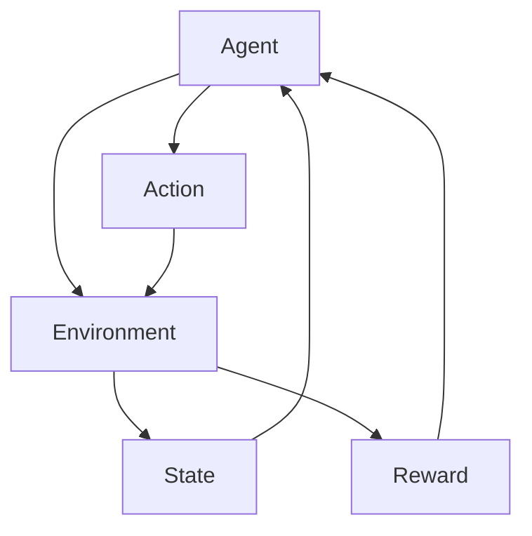

                 

**强化学习：在航空航天中的应用**

**作者：禅与计算机程序设计艺术 / Zen and the Art of Computer Programming**

## 1. 背景介绍

强化学习（Reinforcement Learning, RL）是一种机器学习方法，其中智能体（agent）通过与环境（environment）的交互学习，以最大化累积回报（cumulative reward）为目标。航空航天领域面临着复杂的动态环境和高风险任务，强化学习因其适应性和自动化特性而成为一种有前途的控制和决策方法。

## 2. 核心概念与联系

### 2.1 核心概念

- **智能体（Agent）**：学习并做出决策的主体。
- **环境（Environment）**：智能体所处的外部世界。
- **状态（State）**：环境的当前情况。
- **动作（Action）**：智能体可采取的行为。
- **回报（Reward）**：环境提供的反馈，指导智能体学习。

### 2.2 Mermaid 流程图



## 3. 核心算法原理 & 具体操作步骤

### 3.1 算法原理概述

强化学习算法旨在学习一组最优动作，以最大化累积回报。常见的强化学习算法包括动态规划（Dynamic Programming）、Q-学习（Q-Learning）、SARSA（State-Action-Reward-State-Action）、深度强化学习（Deep Reinforcement Learning）等。

### 3.2 算法步骤详解

1. 初始化智能体的状态。
2. 智能体根据当前状态选择动作。
3. 环境根据动作转移到新状态，并提供回报。
4. 智能体更新其决策策略，基于新状态和回报。
5. 重复步骤2-4，直到智能体学习到最优策略。

### 3.3 算法优缺点

**优点**：自动化学习、适应性强、可用于复杂环境。

**缺点**：数据效率低、收敛缓慢、需要大量资源。

### 3.4 算法应用领域

强化学习在航空航天领域的应用包括自动驾驶、航天器控制、任务规划等。

## 4. 数学模型和公式 & 详细讲解 & 举例说明

### 4.1 数学模型构建

强化学习的数学模型包括状态转移函数（$T(s, a, s') = P(S_{t+1} = s' | S_t = s, A_t = a)$）、回报函数（$R(s, a, s') = E[R_{t+1} | S_t = s, A_t = a, S_{t+1} = s']$）和回报序列（$R_1, R_2,..., R_T$）。

### 4.2 公式推导过程

强化学习的目标是学习一组最优动作，以最大化累积回报。最优策略（$\pi^*$)定义为：

$$\pi^*(s) = \arg\max_a \sum_{t=0}^{\infty} \gamma^t R_{t+1}$$

其中，$\gamma$是折扣因子（discount factor），控制未来回报的重要性。

### 4.3 案例分析与讲解

例如，在航天器控制任务中，状态可以表示为航天器的位置和速度，动作可以表示为推进器的推力，回报可以表示为燃料消耗或到达目标的奖励。

## 5. 项目实践：代码实例和详细解释说明

### 5.1 开发环境搭建

强化学习项目通常需要Python环境，配合深度学习框架如TensorFlow或PyTorch，并使用强化学习库如Stable Baselines3或RLlib。

### 5.2 源代码详细实现

以下是一个简单的Q-学习算法实现示例：

```python
import numpy as np

class QLearning:
    def __init__(self, states, actions, learning_rate=0.1, discount_factor=0.9, exploration_rate=1.0, exploration_decay=0.995):
        self.q_table = np.zeros((states, actions))
        self.learning_rate = learning_rate
        self.discount_factor = discount_factor
        self.exploration_rate = exploration_rate
        self.exploration_decay = exploration_decay

    def choose_action(self, state):
        if np.random.uniform(0, 1) < self.exploration_rate:
            return np.random.choice(self.actions)
        else:
            return np.argmax(self.q_table[state])

    def update_q_table(self, state, action, reward, next_state):
        old_value = self.q_table[state, action]
        next_max = np.max(self.q_table[next_state])
        new_value = (1 - self.learning_rate) * old_value + self.learning_rate * (reward + self.discount_factor * next_max)
        self.q_table[state, action] = new_value
```

### 5.3 代码解读与分析

`QLearning`类初始化了Q表格、学习率、折扣因子和探索率。`choose_action`方法根据当前状态选择动作，`update_q_table`方法更新Q表格。

### 5.4 运行结果展示

通过训练`QLearning`对象，智能体将学习到最优策略，并能够在环境中获得最大累积回报。

## 6. 实际应用场景

### 6.1 当前应用

强化学习已成功应用于自动驾驶、无人机控制、航天器姿态控制等领域。

### 6.2 未来应用展望

未来，强化学习有望在更复杂的任务中得到应用，如太空探索、自主维修等。

## 7. 工具和资源推荐

### 7.1 学习资源推荐

- 书籍：《强化学习：机器学习序列》作者：Richard S. Sutton, Andrew G. Barto
- 在线课程：[Coursera - Reinforcement Learning](https://www.coursera.org/learn/reinforcement-learning)

### 7.2 开发工具推荐

- 强化学习库：Stable Baselines3、RLlib
- 深度学习框架：TensorFlow、PyTorch

### 7.3 相关论文推荐

- [Deep Reinforcement Learning Hands-On](https://www.oreilly.com/library/view/deep-reinforcement-learning/9781492031857/)
- [Mastering Chess and Shogi by Self-Play with a General Reinforcement Learning Algorithm](https://arxiv.org/abs/1712.01815)

## 8. 总结：未来发展趋势与挑战

### 8.1 研究成果总结

强化学习在航空航天领域已取得显著成果，但仍面临挑战。

### 8.2 未来发展趋势

未来，强化学习将朝着更复杂环境、多智能体系统和更强大的算法方向发展。

### 8.3 面临的挑战

- 数据效率低
- 算法收敛缓慢
- 算法可解释性差

### 8.4 研究展望

未来的研究将关注提高强化学习算法的数据效率、收敛速度和可解释性。

## 9. 附录：常见问题与解答

**Q：强化学习与监督学习有何区别？**

**A**：强化学习是无监督学习，智能体通过与环境的交互学习，而不需要预先标记的数据。监督学习则需要预先标记的数据。

**Q：强化学习如何处理连续动作空间？**

**A**：强化学习算法通常使用函数逼近（如深度神经网络）或策略梯度方法处理连续动作空间。

## 结束语

强化学习在航空航天领域具有广阔的应用前景，但仍面临挑战。通过不断的研究和创新，强化学习有望在更复杂的任务中取得成功。

