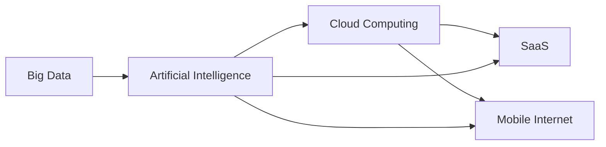

                 

## 1. 背景介绍

在互联网发展的早期，大多数业务都是在线下进行的。然而，随着互联网技术的发展和普及，越来越多的业务开始转移到线上。这种转变带来了巨大的机遇和挑战，也对技术提出了新的要求。本文将深入探讨从线下到线上的转变，重点关注核心概念、算法原理、数学模型、项目实践和实际应用场景等方面。

## 2. 核心概念与联系

### 2.1 核心概念

从线下到线上的转变涉及多个核心概念，包括但不限于：

- **云计算（Cloud Computing）**：提供动态可扩展的共享物理资源，如处理器、存储和网络，作为服务提供给最终用户。
- **软件即服务（SaaS）**：软件通过互联网以服务的形式提供给用户，无需安装在本地计算机上。
- **移动互联网（Mobile Internet）**：通过移动设备（如智能手机和平板电脑）访问互联网的能力。
- **大数据（Big Data）**：规模巨大、复杂度高、速度快的数据集，超出了传统数据库软件工具的处理能力。
- **人工智能（Artificial Intelligence）**：模拟人类智能的计算机系统，能够学习、推理和解决问题。

### 2.2 核心概念联系

这些核心概念密切相关，共同构成了从线下到线上的转变的技术基础。例如，云计算为SaaS提供了基础设施，移动互联网扩展了SaaS的访问范围，大数据为人工智能提供了数据源，而人工智能又可以优化云计算、SaaS和移动互联网等。



## 3. 核心算法原理 & 具体操作步骤

### 3.1 算法原理概述

从线下到线上的转变涉及多种算法，如机器学习算法、搜索算法和路由算法等。本节将重点关注分布式系统中的一致性算法，如 Paxos和Raft。

### 3.2 算法步骤详解

#### Paxos算法

Paxos算法是一种分布式一致性算法，用于选举领导者（leader）和达成一致。算法包含三个主要角色：客户端（client）、领导者（leader）和后备（replica）。算法步骤如下：

1. 客户端发送一个请求给后备。
2. 后备选举一个领导者。
3. 领导者处理请求并将结果发送给后备。
4. 后备确认领导者的结果。

#### Raft算法

Raft算法是Paxos的替代方案，旨在简化Paxos算法并提供更好的可用性。Raft算法包含三个主要角色：客户端（client）、领导者（leader）和跟随者（follower）。算法步骤如下：

1. 客户端发送一个请求给领导者。
2. 领导者处理请求并将结果发送给跟随者。
3. 跟随者确认领导者的结果。
4. 如果领导者故障，跟随者选举一个新的领导者。

### 3.3 算法优缺点

| 算法 | 优点 | 缺点 |
| --- | --- | --- |
| Paxos | - 简单易懂<br>- 保证一致性 | - 选举过程复杂<br>- 可用性不高 |
| Raft | - 简单易懂<br>- 可用性高<br>- 选举过程简单 | - 保证一致性的开销较大<br>- 可能出现分裂问题 |

### 3.4 算法应用领域

这两种算法广泛应用于分布式系统中，如数据库、消息队列和分布式文件系统等。它们确保分布式系统中的数据一致性，并提供高可用性。

## 4. 数学模型和公式 & 详细讲解 & 举例说明

### 4.1 数学模型构建

在分布式系统中，一致性模型是描述分布式系统数据一致性级别的数学模型。常见的分布式一致性模型包括：

- **强一致性（Strong Consistency）**：所有客户端在任何时刻看到的数据都是最新的。
- **弱一致性（Weak Consistency）**：客户端看到的数据可能是过期的，但最终会看到最新的数据。
- **最终一致性（Eventual Consistency）**：客户端最终会看到最新的数据，但不保证数据的时效性。

### 4.2 公式推导过程

在分布式系统中，数据一致性可以用以下公式描述：

$$C = f(P, R, N)$$

其中，$C$表示一致性模型，$P$表示分布式系统的属性（如网络延迟和故障率），$R$表示分布式系统的规模（如节点数和数据量），$N$表示分布式系统的网络拓扑。

### 4.3 案例分析与讲解

例如，考虑一个分布式数据库系统，其属性为网络延迟为100ms，故障率为0.01，规模为100个节点和1TB的数据量，网络拓扑为环形拓扑。使用上述公式，可以推导出该分布式数据库系统的最佳一致性模型为最终一致性模型。

## 5. 项目实践：代码实例和详细解释说明

### 5.1 开发环境搭建

要实现分布式一致性算法，需要搭建以下开发环境：

- **编程语言**：Go语言，由于其内置的并发支持和网络编程库。
- **开发环境**：Go语言的开发环境，包括Go语言本身和一个集成开发环境（IDE），如Visual Studio Code。
- **测试环境**：一个模拟分布式系统的测试环境，如Minikube或Docker。

### 5.2 源代码详细实现

以下是Raft算法的简化实现示例：

```go
type Raft struct {
	CurrentTerm int
	VotedFor    int
	Logs        []Log
	CommitIndex int
	LastApplied int
}

func (r *Raft) Start() {
	// 选举领导者
	if r.shouldStartElection() {
		r.startElection()
	}
	// 处理客户端请求
	r.handleClientRequests()
	// 同步日志
	r.syncLogs()
	// 提交日志
	r.commitLogs()
}

func (r *Raft) startElection() {
	// 发送投票请求给跟随者
	r.sendVoteRequest()
	// 等待投票结果
	r.waitForVotes()
	// 如果获胜，成为领导者
	if r.hasWonElection() {
		r.becomeLeader()
	}
}

func (r *Raft) handleClientRequests() {
	// 处理客户端请求并发送给跟随者
	r.handleRequest()
	r.sendAppendEntries()
}

func (r *Raft) syncLogs() {
	// 同步日志给跟随者
	r.syncLogsWithFollowers()
}

func (r *Raft) commitLogs() {
	// 提交日志给客户端
	r.commitLogsToClients()
}
```

### 5.3 代码解读与分析

上述代码实现了Raft算法的核心逻辑，包括选举领导者、处理客户端请求、同步日志和提交日志等。每个方法都对应Raft算法的一个步骤，并使用Go语言的并发支持和网络编程库实现。

### 5.4 运行结果展示

在模拟分布式系统的测试环境中运行上述代码，可以观察到Raft算法的运行结果。例如，可以监控领导者的选举过程、日志同步和提交过程等。

## 6. 实际应用场景

### 6.1 当前应用

分布式一致性算法广泛应用于各种分布式系统中，如：

- **数据库**：如Cassandra、MongoDB和CockroachDB等分布式数据库系统使用分布式一致性算法保证数据一致性。
- **消息队列**：如Kafka和RabbitMQ等消息队列系统使用分布式一致性算法保证消息的顺序性和一致性。
- **分布式文件系统**：如HDFS和Ceph等分布式文件系统使用分布式一致性算法保证数据的完整性和一致性。

### 6.2 未来应用展望

随着分布式系统规模的不断扩大和复杂性的不断提高，分布式一致性算法的应用将更加广泛。未来，分布式一致性算法将应用于更多领域，如自动驾驶、物联网和边缘计算等。

## 7. 工具和资源推荐

### 7.1 学习资源推荐

- **书籍**：《分布式系统观察》和《分布式系统：概念和设计》等书籍。
- **在线课程**：如Coursera和Udacity等平台上的分布式系统课程。
- **博客**：如Distributed Systems Observations和Distributed Systems Reading List等博客。

### 7.2 开发工具推荐

- **编程语言**：Go语言，由于其内置的并发支持和网络编程库。
- **开发环境**：Go语言的开发环境，包括Go语言本身和一个集成开发环境（IDE），如Visual Studio Code。
- **测试环境**：一个模拟分布式系统的测试环境，如Minikube或Docker。

### 7.3 相关论文推荐

- **Paxos算法**：Paxos Made Simple和Paxos Made Practical。
- **Raft算法**：In Search of an Understandable Consensus Algorithm。

## 8. 总结：未来发展趋势与挑战

### 8.1 研究成果总结

本文介绍了从线下到线上的转变，重点关注了核心概念、算法原理、数学模型、项目实践和实际应用场景等方面。通过分析Paxos和Raft算法，我们了解了分布式一致性算法的原理和应用。通过实现Raft算法的示例，我们学习了分布式一致性算法的开发过程。

### 8.2 未来发展趋势

未来，分布式系统的规模和复杂性将进一步提高，对分布式一致性算法的要求也将更高。新的分布式一致性算法和技术将不断涌现，以满足新的挑战和需求。

### 8.3 面临的挑战

分布式一致性算法面临的挑战包括：

- **网络延迟**：分布式系统中的网络延迟会影响算法的性能和一致性。
- **故障率**：分布式系统中的故障率会影响算法的可用性和一致性。
- **规模**：分布式系统的规模会影响算法的性能和复杂性。

### 8.4 研究展望

未来的研究方向包括：

- **新的分布式一致性算法**：开发新的分布式一致性算法，以满足新的挑战和需求。
- **分布式一致性算法的优化**：优化现有的分布式一致性算法，以提高性能和可用性。
- **分布式一致性算法的实践**：在实际应用中评估和改进分布式一致性算法。

## 9. 附录：常见问题与解答

**Q1：什么是分布式一致性算法？**

A1：分布式一致性算法是一种用于保证分布式系统中数据一致性的算法。

**Q2：Paxos和Raft算法有什么区别？**

A2：Paxos和Raft算法都是分布式一致性算法，但Raft算法旨在简化Paxos算法并提供更好的可用性。

**Q3：如何实现分布式一致性算法？**

A3：可以使用Go语言等支持并发和网络编程的语言实现分布式一致性算法。本文提供了Raft算法的简化实现示例。

**Q4：分布式一致性算法有哪些应用？**

A4：分布式一致性算法广泛应用于各种分布式系统中，如数据库、消息队列和分布式文件系统等。

**Q5：未来分布式一致性算法的发展趋势是什么？**

A5：未来，分布式系统的规模和复杂性将进一步提高，对分布式一致性算法的要求也将更高。新的分布式一致性算法和技术将不断涌现，以满足新的挑战和需求。

## 作者：禅与计算机程序设计艺术 / Zen and the Art of Computer Programming

