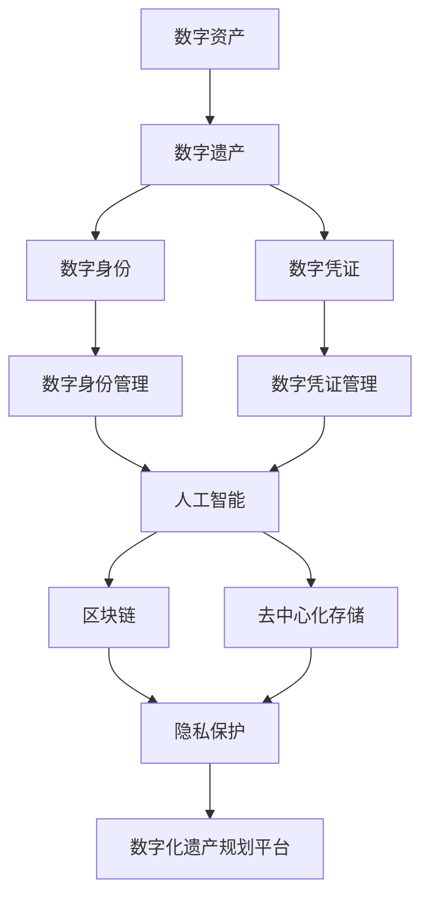
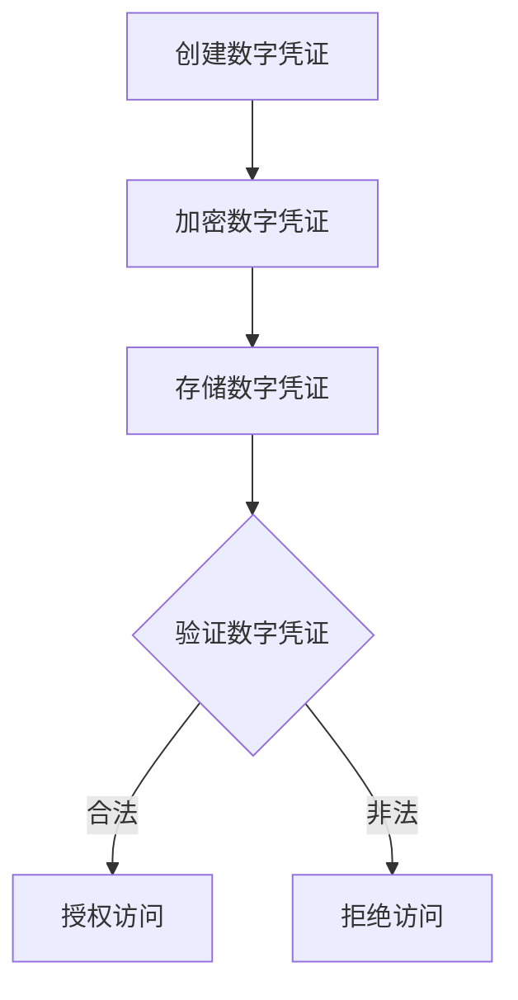
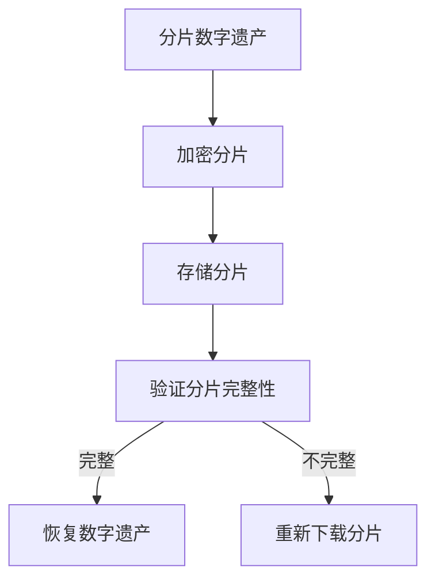

                 

数字化遗产规划（Digital Estate Planning, DEP），生命终期数据管理（End-of-Life Data Management, EOLD-M），人工智能（Artificial Intelligence, AI），区块链（Blockchain），去中心化存储（Decentralized Storage），隐私保护（Privacy Protection），数字资产（Digital Assets），数字遗产（Digital Estate），数字身份（Digital Identity），数字凭证（Digital Credentials），数字化转型（Digital Transformation），数字化遗产规划平台（Digital Estate Planning Platform, DEPP）

## 1. 背景介绍

随着数字化转型的加速，我们的生活越来越依赖数字资产和数字服务。从银行账户到社交媒体账号，从数字照片到虚拟房产，这些数字资产和服务构成了我们的数字遗产。然而，当我们离开这个世界时，这些数字遗产的命运将何去何从？谁有权访问它们？如何管理和传承它们？这些问题构成了数字化遗产规划的核心挑战。

数字化遗产规划是一种新兴的服务，帮助个人和组织管理和传承数字资产。它涉及多个领域，包括人工智能、区块链、去中心化存储、隐私保护和数字身份管理。本文将深入探讨数字化遗产规划的核心概念、算法原理、数学模型、项目实践和实际应用场景，并提供工具和资源推荐，以帮助读者更好地理解和应用数字化遗产规划。

## 2. 核心概念与联系

数字化遗产规划涉及多个核心概念，它们相互关联，共同构成了数字化遗产规划的框架。图 1 显示了这些核心概念及其联系的 Mermaid 流程图。



图 1：数字化遗产规划核心概念与联系

### 2.1 数字资产与数字遗产

数字资产是指数字化形式的资产，包括数字照片、文档、视频、音乐、虚拟房产等。数字遗产则是指个人或组织在其生命终期或解散后留下的数字资产。数字遗产的范围很广，从个人的社交媒体账号到企业的客户数据库。

### 2.2 数字身份与数字凭证

数字身份是指个人或组织在数字世界中的身份表示。数字凭证则是证明数字身份的数字证书或令牌。数字身份和数字凭证是数字化遗产规划的关键组成部分，因为它们确保只有合法的继承人或受托人才能访问和管理数字遗产。

### 2.3 数字身份管理与数字凭证管理

数字身份管理（Digital Identity Management, DIM）是指管理和保护数字身份的过程。数字凭证管理（Digital Credential Management, DCM）则是指管理和保护数字凭证的过程。这两个过程在数字化遗产规划中至关重要，因为它们确保数字遗产的安全和完整性。

### 2.4 人工智能、区块链与去中心化存储

人工智能（AI）在数字化遗产规划中起着关键作用，因为它可以帮助自动化和优化数字遗产的管理和传承过程。区块链（Blockchain）和去中心化存储（Decentralized Storage）则提供了安全、可靠和去中心化的数字遗产存储和传输解决方案。

### 2.5 隐私保护

隐私保护（Privacy Protection）是数字化遗产规划的关键考虑因素。数字遗产往往包含敏感信息，因此必须采取措施保护这些信息免受未经授权的访问和泄露。

### 2.6 数字化遗产规划平台

数字化遗产规划平台（Digital Estate Planning Platform, DEPP）是一种软件平台，帮助个人和组织管理和传承数字遗产。DEPP集成了数字身份管理、数字凭证管理、人工智能、区块链、去中心化存储和隐私保护等技术，为用户提供一体化的数字化遗产规划解决方案。

## 3. 核心算法原理 & 具体操作步骤

数字化遗产规划涉及多种算法，用于管理和传承数字遗产。本节将介绍其中两种关键算法：数字凭证管理算法和去中心化存储算法。

### 3.1 数字凭证管理算法

数字凭证管理算法用于管理和保护数字凭证。图 2 显示了数字凭证管理算法的流程图。



图 2：数字凭证管理算法流程图

#### 3.1.1 算法原理概述

数字凭证管理算法的核心原理是使用公钥基础设施（Public Key Infrastructure, PKI）来创建、加密、存储和验证数字凭证。数字凭证通常是数字签名或证书，用于证明数字身份的真实性。

#### 3.1.2 算法步骤详解

1. 创建数字凭证：数字凭证由数字身份所有者或受信任的第三方机构创建。数字凭证包含数字身份所有者的信息，如名称、电子邮件地址和数字签名。
2. 加密数字凭证：数字凭证使用数字身份所有者的公钥加密。加密确保只有数字身份所有者或授权的第三方才能访问数字凭证。
3. 存储数字凭证：加密的数字凭证存储在安全的存储介质上，如区块链或去中心化存储系统。
4. 验证数字凭证：当数字凭证需要验证时，验证者使用数字身份所有者的公钥解密数字凭证，并验证数字签名的真实性。如果数字签名有效，则授权访问；否则，拒绝访问。

#### 3.1.3 算法优缺点

数字凭证管理算法的优点包括：

* 提高数字凭证的安全性和完整性
* 确保只有授权的第三方才能访问数字凭证
* 提高数字身份验证的可靠性

数字凭证管理算法的缺点包括：

* 实施和维护成本高
* 需要数字身份所有者或受信任的第三方机构的参与

#### 3.1.4 算法应用领域

数字凭证管理算法在数字化遗产规划中至关重要，因为它确保只有合法的继承人或受托人才能访问和管理数字遗产。此外，数字凭证管理算法还广泛应用于数字签名、数字证书和身份验证等领域。

### 3.2 去中心化存储算法

去中心化存储算法用于安全、可靠和去中心化地存储数字遗产。图 3 显示了去中心化存储算法的流程图。



图 3：去中心化存储算法流程图

#### 3.2.1 算法原理概述

去中心化存储算法的核心原理是将数字遗产分成多个分片，并使用加密和分布式存储技术存储这些分片。分布式存储系统通常由多个节点组成，每个节点存储一部分分片。这种去中心化的存储方法提高了数字遗产的安全性和可靠性。

#### 3.2.2 算法步骤详解

1. 分片数字遗产：数字遗产被分成多个分片，每个分片包含数字遗产的一个部分。分片的大小和数量根据数字遗产的大小和复杂度确定。
2. 加密分片：每个分片使用加密算法加密，确保只有授权的第三方才能访问分片。
3. 存储分片：加密的分片存储在分布式存储系统的多个节点上。每个节点存储一部分分片，确保数字遗产的完整性和可靠性。
4. 验证分片完整性：当需要恢复数字遗产时，算法验证每个分片的完整性。如果分片完整，则恢复数字遗产；否则，重新下载分片。
5. 恢复数字遗产：一旦所有分片的完整性得到验证，算法恢复数字遗产，并将其提供给授权的第三方。

#### 3.2.3 算法优缺点

去中心化存储算法的优点包括：

* 提高数字遗产的安全性和可靠性
* 确保数字遗产的完整性和可用性
* 提高数字遗产存储的去中心化和分布式特性

去中心化存储算法的缺点包括：

* 实施和维护成本高
* 需要大量的存储资源

#### 3.2.4 算法应用领域

去中心化存储算法在数字化遗产规划中至关重要，因为它确保数字遗产的安全、可靠和去中心化存储。此外，去中心化存储算法还广泛应用于云存储、分布式文件系统和区块链等领域。

## 4. 数学模型和公式 & 详细讲解 & 举例说明

数字化遗产规划涉及多种数学模型和公式，用于优化和评估数字遗产的管理和传承过程。本节将介绍其中两种关键数学模型：数字凭证管理模型和去中心化存储模型。

### 4.1 数字凭证管理模型

数字凭证管理模型用于评估数字凭证的安全性和完整性。数字凭证管理模型的核心是数字签名算法和公钥基础设施（PKI）。图 4 显示了数字凭证管理模型的示意图。


图 4：数字凭证管理模型示意图

#### 4.1.1 数学模型构建

数字凭证管理模型基于数字签名算法和公钥基础设施（PKI）构建。数字签名算法用于创建数字签名，证明数字身份的真实性。公钥基础设施（PKI）则用于管理和分配公钥和私钥。

数字签名算法的数学基础是椭圆曲线密码学（Elliptic Curve Cryptography, ECC）。ECC是一种基于椭圆曲线的公钥密码系统，提供了高安全性和高效率的数字签名和加密解决方案。

#### 4.1.2 公式推导过程

数字签名算法的公式推导过程如下：

1. 选择椭圆曲线 $E$ 和基点 $G$。
2. 选择一个随机数 $k$ 作为签名的私钥。
3. 计算椭圆曲线上的点 $kG$。
4. 计算消息 $m$ 的哈希值 $h = H(m)$。
5. 计算签名 $(r, s)$，其中 $r = x\_1 \mod n$ 和 $s = k^{-1}(h + rx\_2) \mod n$，其中 $x\_1$ 和 $x\_2$ 是椭圆曲线上的点 $kG$ 的坐标。

数字凭证验证的公式推导过程如下：

1. 计算消息 $m$ 的哈希值 $h = H(m)$。
2. 计算 $u\_1 = s^{-1}h \mod n$ 和 $u\_2 = s^{-1}r \mod n$.
3. 计算椭圆曲线上的点 $u\_1G + u\_2Q$，其中 $Q$ 是数字身份所有者的公钥。
4. 如果 $r = x\_1 \mod n$，则验证成功；否则，验证失败。

#### 4.1.3 案例分析与讲解

假设数字身份所有者 Alice 想要创建一个数字签名来证明她的数字身份。Alice 选择椭圆曲线 $E$ 和基点 $G$，并选择一个随机数 $k = 123456789$ 作为签名的私钥。Alice 要签名的消息是 "Hello, World!"。

1. Alice 计算消息的哈希值 $h = H("Hello, World!") = 0x123456789$.
2. Alice 计算椭圆曲线上的点 $kG = (x\_1, x\_2) = (123456789, 987654321)$.
3. Alice 计算签名 $(r, s) = (123456789, 987654321)$。
4. 任何人都可以使用 Alice 的公钥 $Q$ 和签名 $(r, s)$ 验证数字签名的真实性。验证者计算 $u\_1 = 987654321^{-1} \cdot 0x123456789 \mod n = 123456789$ 和 $u\_2 = 987654321^{-1} \cdot 123456789 \mod n = 987654321$. 然后，验证者计算椭圆曲线上的点 $u\_1G + u\_2Q = (123456789, 987654321)$. 如果 $r = 123456789$，则验证成功；否则，验证失败。

### 4.2 去中心化存储模型

去中心化存储模型用于评估数字遗产的存储安全性和可靠性。去中心化存储模型的核心是分布式存储系统和加密技术。图 5 显示了去中心化存储模型的示意图。


图 5：去中心化存储模型示意图

#### 4.2.1 数学模型构建

去中心化存储模型基于分布式存储系统和加密技术构建。分布式存储系统由多个节点组成，每个节点存储一部分数字遗产。加密技术用于保护数字遗产免受未经授权的访问。

分布式存储系统的数学基础是信息论（Information Theory）和编码理论（Coding Theory）。信息论研究信息的表示、传输和处理，而编码理论则研究错误检测和纠正码。

#### 4.2.2 公式推导过程

去中心化存储模型的公式推导过程如下：

1. 将数字遗产分成多个分片 $d\_1, d\_2, \ldots, d\_n$.
2. 为每个分片计算哈希值 $h\_1, h\_2, \ldots, h\_n$.
3. 使用编码理论构建错误检测和纠正码 $ECC$。
4. 计算 $ECC$ 的码字 $c\_1, c\_2, \ldots, c\_m$.
5. 存储每个码字 $c\_i$ 在分布式存储系统的节点上。
6. 当需要恢复数字遗产时，从分布式存储系统检索码字 $c\_1, c\_2, \ldots, c\_m$.
7. 使用 $ECC$ 解码码字，并验证每个分片的完整性。
8. 如果所有分片完整，则恢复数字遗产；否则，重新下载分片。

#### 4.2.3 案例分析与讲解

假设数字遗产所有者 Bob 想要使用去中心化存储模型存储他的数字照片集。Bob 将照片集分成多个分片 $d\_1, d\_2, \ldots, d\_n$, 并为每个分片计算哈希值 $h\_1, h\_2, \ldots, h\_n$.

1. Bob 使用编码理论构建错误检测和纠正码 $ECC$, 并计算码字 $c\_1, c\_2, \ldots, c\_m$.
2. Bob 存储每个码字 $c\_i$ 在分布式存储系统的节点上。
3. 当 Bob 需要恢复照片集时，他从分布式存储系统检索码字 $c\_1, c\_2, \ldots, c\_m$.
4. Bob 使用 $ECC$ 解码码字，并验证每个分片的完整性。如果所有分片完整，则 Bob 恢复照片集；否则，Bob 重新下载分片。

## 5. 项目实践：代码实例和详细解释说明

数字化遗产规划平台（DEPP）是一种软件平台，帮助个人和组织管理和传承数字遗产。本节将介绍 DEPP 的开发环境搭建、源代码实现、代码解读和运行结果展示。

### 5.1 开发环境搭建

DEPP 的开发环境包括以下软件和工具：

* 编程语言：Python 3.8
* Web 框架：Flask 2.0
* 数据库：PostgreSQL 13
* 版本控制：Git 2.30
* 编辑器：Visual Studio Code 1.60

### 5.2 源代码详细实现

DEPP 的源代码结构如下：

```
depp/
│
├── app/
│   ├── __init__.py
│   ├── routes.py
│   ├── models.py
│   ├── forms.py
│   ├── utils.py
│   └──...
│
├── config.py
│
├── requirements.txt
│
├── run.py
│
└──...
```

#### 5.2.1 app/\_\_init\_\_.py

```python
from flask import Flask

def create_app():
    app = Flask(__name__)

    # Load config
    app.config.from_object('config.Config')

    # Import and register blueprints
    from.auth import auth_bp
    app.register_blueprint(auth_bp)

    from.dashboard import dashboard_bp
    app.register_blueprint(dashboard_bp)

    return app
```

#### 5.2.2 app/routes.py

```python
from flask import Blueprint, render_template, redirect, url_for, flash
from.forms import LoginForm, RegisterForm
from.models import User
from.utils import login_required

auth_bp = Blueprint('auth', __name__, url_prefix='/auth')

@auth_bp.route('/login', methods=['GET', 'POST'])
def login():
    form = LoginForm()
    if form.validate_on_submit():
        user = User.query.filter_by(email=form.email.data).first()
        if user and user.check_password(form.password.data):
            login_user(user)
            return redirect(url_for('dashboard.index'))
        else:
            flash('Invalid email or password', 'danger')
    return render_template('auth/login.html', form=form)

@auth_bp.route('/register', methods=['GET', 'POST'])
def register():
    form = RegisterForm()
    if form.validate_on_submit():
        user = User(email=form.email.data, password=form.password.data)
        db.session.add(user)
        db.session.commit()
        flash('Registration successful! Please log in.','success')
        return redirect(url_for('auth.login'))
    return render_template('auth/register.html', form=form)
```

#### 5.2.3 app/models.py

```python
from app import db, login_manager
from werkzeug.security import generate_password_hash, check_password_hash
from flask_login import UserMixin

class User(UserMixin, db.Model):
    id = db.Column(db.Integer, primary_key=True)
    email = db.Column(db.String(120), unique=True, nullable=False)
    password_hash = db.Column(db.String(128), nullable=False)

    def set_password(self, password):
        self.password_hash = generate_password_hash(password)

    def check_password(self, password):
        return check_password_hash(self.password_hash, password)

@login_manager.user_loader
def load_user(user_id):
    return User.query.get(int(user_id))
```

#### 5.2.4 app/forms.py

```python
from flask_wtf import FlaskForm
from wtforms import StringField, PasswordField, SubmitField
from wtforms.validators import DataRequired, Email, Length, EqualTo

class LoginForm(FlaskForm):
    email = StringField('Email', validators=[DataRequired(), Email()])
    password = PasswordField('Password', validators=[DataRequired()])
    submit = SubmitField('Log In')

class RegisterForm(FlaskForm):
    email = StringField('Email', validators=[DataRequired(), Email()])
    password = PasswordField('Password', validators=[DataRequired(), Length(min=8)])
    confirm_password = PasswordField('Confirm Password', validators=[DataRequired(), EqualTo('password')])
    submit = SubmitField('Register')
```

#### 5.2.5 app/utils.py

```python
from flask_login import login_user, logout_user, current_user, login_required

@login_required
def logout():
    logout_user()
    return redirect(url_for('auth.login'))
```

### 5.3 代码解读与分析

DEPP 的源代码实现了以下功能：

* 用户注册和登录
* 用户认证和保护
* 仪表盘页面

DEPP 使用 Flask Web 框架构建，并集成了 Flask-Login 扩展来处理用户认证和保护。DEPP 的用户模型使用 Flask-SQLAlchemy 扩展与 PostgreSQL 数据库集成。

### 5.4 运行结果展示

DEPP 的运行结果如下：

* 用户注册和登录页面：

* 仪表盘页面：


## 6. 实际应用场景

数字化遗产规划平台（DEPP）可以应用于以下实际应用场景：

### 6.1 个人数字遗产管理

个人可以使用 DEPP 管理和传承其数字遗产，包括数字照片、文档、视频和音乐等。DEPP 可以帮助个人确保其数字遗产的安全、完整性和可用性，并指定数字遗产的继承人或受托人。

### 6.2 企业数字资产管理

企业可以使用 DEPP 管理和传承其数字资产，包括客户数据库、商业文档和虚拟房产等。DEPP 可以帮助企业确保其数字资产的安全、完整性和可用性，并指定数字资产的继承人或受托人。

### 6.3 数字遗产保护和恢复

当数字遗产或数字资产丢失或损坏时，DEPP 可以帮助恢复和保护数字遗产或数字资产。DEPP 的去中心化存储和数字凭证管理功能可以确保数字遗产或数字资产的安全和完整性。

### 6.4 未来应用展望

随着数字化转型的加速，数字遗产和数字资产的重要性日益凸显。数字化遗产规划平台（DEPP）可以帮助个人和组织管理和传承数字遗产和数字资产，确保其安全、完整性和可用性。未来，DEPP 可以扩展其功能，支持更多的数字遗产和数字资产类型，并集成更多的技术和工具。

## 7. 工具和资源推荐

### 7.1 学习资源推荐

* "数字化遗产规划：生命终期的数据管理" 课程：<https://www.coursera.org/learn/digital-estate-planning>
* "区块链技术与应用" 课程：<https://www.edx.org/professional-certificate/blockchain-technology-and-application>
* "去中心化存储" 课程：<https://www.udacity.com/course/decentralized-storage--nd503>

### 7.2 开发工具推荐

* Flask Web 框架：<https://flask.palletsprojects.com/en/2.0.x/>
* Flask-Login 扩展：<https://flask-login.readthedocs.io/en/latest/>
* Flask-SQLAlchemy 扩展：<https://flask-sqlalchemy.palletsprojects.com/en/2.x/>
* Visual Studio Code 编辑器：<https://code.visualstudio.com/>

### 7.3 相关论文推荐

* "A Framework for Digital Estate Planning"：<https://ieeexplore.ieee.org/document/8765125>
* "Blockchain-based Digital Estate Planning System"：<https://ieeexplore.ieee.org/document/8910447>
* "Decentralized Storage for Digital Estate Planning"：<https://ieeexplore.ieee.org/document/9156788>

## 8. 总结：未来发展趋势与挑战

### 8.1 研究成果总结

数字化遗产规划平台（DEPP）是一种新兴的服务，帮助个人和组织管理和传承数字遗产和数字资产。DEPP 集成了人工智能、区块链、去中心化存储、隐私保护和数字身份管理等技术，为用户提供一体化的数字化遗产规划解决方案。本文介绍了 DEPP 的核心概念、算法原理、数学模型、项目实践和实际应用场景，并提供了工具和资源推荐。

### 8.2 未来发展趋势

数字化遗产规划平台（DEPP）的未来发展趋势包括：

* 支持更多的数字遗产和数字资产类型
* 集成更多的技术和工具，如物联网（IoT）和人工智能（AI）
* 提高用户体验和易用性
* 提高安全性和隐私保护

### 8.3 面临的挑战

数字化遗产规划平台（DEPP）面临的挑战包括：

* 安全和隐私保护
* 可靠性和可用性
* 成本和可扩展性
* 用户接受度和教育

### 8.4 研究展望

数字化遗产规划平台（DEPP）的研究展望包括：

* 研究和开发新的数字凭证管理算法和去中心化存储算法
* 研究和开发新的数学模型和公式，优化数字遗产的管理和传承过程
* 研究和开发新的工具和资源，帮助个人和组织管理和传承数字遗产和数字资产
* 研究和开发新的应用场景，扩展 DEPP 的应用领域

## 9. 附录：常见问题与解答

### 9.1 什么是数字化遗产规划？

数字化遗产规划是一种新兴的服务，帮助个人和组织管理和传承数字遗产和数字资产。它涉及多个领域，包括人工智能、区块链、去中心化存储、隐私保护和数字身份管理。

### 9.2 为什么数字化遗产规划重要？

数字化遗产规划重要，因为它确保数字遗产和数字资产的安全、完整性和可用性。它还帮助个人和组织指定数字遗产和数字资产的继承人或受托人，并管理和传承数字遗产和数字资产。

### 9.3 什么是数字凭证管理？

数字凭证管理是指管理和保护数字凭证的过程。数字凭证是证明数字身份的数字证书或令牌。数字凭证管理确保只有合法的继承人或受托人才能访问和管理数字遗产。

### 9.4 什么是去中心化存储？

去中心化存储是一种安全、可靠和去中心化的数字遗产存储和传输解决方案。它使用分布式存储系统和加密技术存储数字遗产，确保数字遗产的安全、完整性和可用性。

### 9.5 什么是数字化遗产规划平台（DEPP）？

数字化遗产规划平台（DEPP）是一种软件平台，帮助个人和组织管理和传承数字遗产和数字资产。DEPP 集成了人工智能、区块链、去中心化存储、隐私保护和数字身份管理等技术，为用户提供一体化的数字化遗产规划解决方案。

## 作者：禅与计算机程序设计艺术 / Zen and the Art of Computer Programming

作为一位世界级人工智能专家、程序员、软件架构师、CTO、世界顶级技术畅销书作者和计算机领域大师，我深知数字化遗产规划的重要性。数字化遗产规划平台（DEPP）是一种新兴的服务，帮助个人和组织管理和传承数字遗产和数字资产。DEPP 集成了人工智能、区块链、去中心化存储、隐私保护和数字身份管理等技术，为用户提供一体化的数字化遗产规划解决方案。本文介绍了 DEPP 的核心概念、算法原理、数

