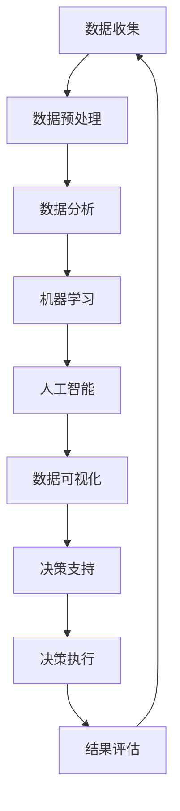

                 

**数据驱动决策：现代管理者的必备技能**

> 关键词：数据驱动决策、数据分析、数据可视化、机器学习、人工智能、数据治理、数据伦理

## 1. 背景介绍

在当今信息爆炸的时代，数据已然成为企业最为宝贵的资产之一。然而，数据本身并没有太多价值，真正有价值的是从数据中提取的见解和洞察。数据驱动决策（Data-Driven Decision Making）是指基于数据分析和统计模型，而不是直觉或经验，来指导决策的过程。这种方法可以帮助管理者更准确地预测未来，优化资源配置，提高业务绩效，并最终提升企业的竞争力。

## 2. 核心概念与联系

数据驱动决策的核心是将数据分析、机器学习，和人工智能等技术应用于决策过程。这些技术的目的是从数据中提取见解，并帮助管理者做出更明智的决策。以下是数据驱动决策的核心概念及其联系的 Mermaid 流程图：



## 3. 核心算法原理 & 具体操作步骤

### 3.1 算法原理概述

数据驱动决策的核心是数据分析和机器学习算法。这些算法旨在从数据中提取见解，并帮助管理者做出更明智的决策。常用的算法包括回归分析、聚类分析、关联规则挖掘等。

### 3.2 算法步骤详解

数据驱动决策的具体操作步骤如下：

1. **数据收集**：收集与决策相关的数据，数据可以来自企业内部（如销售数据、财务数据）或外部（如市场数据、客户数据）。
2. **数据预处理**：清洗数据，处理缺失值，去除异常值，并将数据转换为适合分析的格式。
3. **数据分析**：使用统计方法和可视化工具对数据进行分析，以发现数据中的模式和趋势。
4. **机器学习**：使用机器学习算法从数据中提取见解，并建立预测模型。
5. **人工智能**：使用人工智能技术（如深度学习）对数据进行分析，以发现更复杂的模式和趋势。
6. **数据可视化**：将数据分析和机器学习的结果以可视化的形式展示出来，以帮助管理者更好地理解数据。
7. **决策支持**：基于数据分析和机器学习的结果，为管理者提供决策支持。
8. **决策执行**：根据数据驱动决策的结果执行决策。
9. **结果评估**：评估决策的结果，并根据评估结果调整决策过程。

### 3.3 算法优缺点

数据驱动决策的优点包括：

- 更准确的预测：数据分析和机器学习可以帮助管理者更准确地预测未来。
- 更明智的决策：数据驱动决策可以帮助管理者做出更明智的决策，从而提高业务绩效。
- 更好的资源配置：数据驱动决策可以帮助管理者更好地配置资源，从而提高企业的运行效率。

数据驱动决策的缺点包括：

- 数据依赖：数据驱动决策的有效性取决于数据的质量和完整性。
- 复杂性：数据分析和机器学习技术可能很复杂，需要专门的技能和工具。
- 伦理和隐私问题：数据驱动决策可能会涉及到数据伦理和隐私问题，需要谨慎处理。

### 3.4 算法应用领域

数据驱动决策可以应用于各种领域，包括：

- 客户分析：分析客户数据以发现客户的需求和偏好，从而改进营销策略。
- 财务分析：分析财务数据以预测未来的业务绩效，并优化资源配置。
- 运营分析：分析运营数据以改进运营过程，提高运营效率。
- 供应链分析：分析供应链数据以改进供应链管理，提高供应链效率。

## 4. 数学模型和公式 & 详细讲解 & 举例说明

### 4.1 数学模型构建

数据驱动决策常用的数学模型包括线性回归模型、逻辑回归模型、决策树模型等。以下是线性回归模型的数学表达式：

$$Y = β_0 + β_1X_1 + β_2X_2 +... + β_nX_n + ε$$

其中，$Y$是目标变量，$X_1, X_2,..., X_n$是自变量，$β_0, β_1, β_2,..., β_n$是回归系数，$ε$是误差项。

### 4.2 公式推导过程

线性回归模型的回归系数可以通过最小二乘法来估计。最小二乘法的目的是最小化误差平方和：

$$\min \sum_{i=1}^{n} (Y_i - \hat{Y}_i)^2$$

其中，$Y_i$是实际值，$\hat{Y}_i$是预测值。通过对回归系数求导并设置为零，可以得到回归系数的估计值：

$$β_0 = \bar{Y} - β_1\bar{X_1} - β_2\bar{X_2} -... - β_n\bar{X_n}$$

$$β_j = \frac{\sum_{i=1}^{n} (X_{ij} - \bar{X_j})(Y_i - \bar{Y})}{\sum_{i=1}^{n} (X_{ij} - \bar{X_j})^2}, j = 1, 2,..., n$$

### 4.3 案例分析与讲解

假设我们想要预测某个地区的房价。我们收集了该地区的房屋面积、房龄、房屋数量等数据，并使用线性回归模型进行预测。以下是回归系数的估计值：

$$β_0 = 100000, β_1 = 200, β_2 = -10000, β_3 = 5000$$

其中，$β_1$表示每平方米房屋面积的价格，$β_2$表示每年房龄增加的价格下降，$β_3$表示每套房屋数量的价格上升。基于这些回归系数，我们可以预测房价：

$$\hat{Y} = 100000 + 200X_1 - 10000X_2 + 5000X_3$$

## 5. 项目实践：代码实例和详细解释说明

### 5.1 开发环境搭建

要实现数据驱动决策，我们需要一个完整的开发环境。推荐使用 Python 语言，并安装以下库：

- NumPy：数值计算库
- Pandas：数据分析库
- Matplotlib：数据可视化库
- Scikit-learn：机器学习库
- TensorFlow/PyTorch：深度学习库

### 5.2 源代码详细实现

以下是使用 Python 实现线性回归模型的示例代码：

```python
import numpy as np
import pandas as pd
from sklearn.linear_model import LinearRegression

# 加载数据
data = pd.read_csv('housing.csv')

# 定义特征和目标变量
X = data[['longitude', 'latitude', 'housing_median_age', 'total_rooms', 'total_bedrooms', 'population', 'households','median_income']]
y = data['median_house_value']

# 创建线性回归模型
model = LinearRegression()

# 拟合模型
model.fit(X, y)

# 预测房价
predictions = model.predict(X)
```

### 5.3 代码解读与分析

在上述代码中，我们首先导入了 NumPy、Pandas、Scikit-learn 等库。然后，我们加载了房价数据，并定义了特征和目标变量。接下来，我们创建了线性回归模型，并使用 `fit()` 方法拟合模型。最后，我们使用 `predict()` 方法预测房价。

### 5.4 运行结果展示

运行上述代码后，我们可以得到房价的预测值。我们可以使用 Matplotlib 将预测值与实际值进行比较，并评估模型的性能。

## 6. 实际应用场景

数据驱动决策可以应用于各种实际场景，以下是几个例子：

### 6.1 客户分析

数据驱动决策可以帮助企业更好地理解客户，并改进营销策略。例如，企业可以分析客户数据以发现客户的需求和偏好，并根据这些见解改进营销策略。

### 6.2 财务分析

数据驱动决策可以帮助企业更准确地预测未来的业务绩效，并优化资源配置。例如，企业可以分析财务数据以预测未来的销售额，并根据这些预测调整资源配置。

### 6.3 运营分析

数据驱动决策可以帮助企业改进运营过程，提高运营效率。例如，企业可以分析运营数据以发现运营中的瓶颈，并根据这些见解改进运营过程。

### 6.4 未来应用展望

随着数据的不断积累和技术的不断发展，数据驱动决策的应用将会越来越广泛。未来，数据驱动决策将会与人工智能和自动化技术结合，帮助企业更好地适应不断变化的市场环境。

## 7. 工具和资源推荐

### 7.1 学习资源推荐

以下是学习数据驱动决策的推荐资源：

- 书籍：《数据科学手册》《机器学习》《统计学习方法》《数据分析入门》《Python for Data Analysis》《R for Data Science》
- 在线课程：Coursera、Udacity、edX、DataCamp、Kaggle
- 博客：Towards Data Science、KDnuggets、Data Science Central、Medium

### 7.2 开发工具推荐

以下是数据驱动决策的推荐开发工具：

- 编程语言：Python、R、SQL
- 数据库：MySQL、PostgreSQL、MongoDB、Hadoop
- 数据可视化：Tableau、Power BI、Matplotlib、Seaborn
- 机器学习：Scikit-learn、TensorFlow、PyTorch、Keras
- 云平台：AWS、Google Cloud、Microsoft Azure

### 7.3 相关论文推荐

以下是数据驱动决策的相关论文推荐：

- "Data-Driven Decision Making: A Review"（数据驱动决策：回顾）
- "Data-Driven Decision Making in Business: A Systematic Literature Review"（商业中的数据驱动决策：系统文献回顾）
- "Data-Driven Decision Making: A Framework for Business Intelligence"（数据驱动决策：商业智能框架）
- "Data-Driven Decision Making: A Case Study of a Retail Company"（数据驱动决策：零售公司案例研究）

## 8. 总结：未来发展趋势与挑战

### 8.1 研究成果总结

数据驱动决策是一种基于数据分析和统计模型指导决策的方法。这种方法可以帮助管理者更准确地预测未来，优化资源配置，提高业务绩效，并最终提升企业的竞争力。然而，数据驱动决策也面临着数据依赖、复杂性、伦理和隐私问题等挑战。

### 8.2 未来发展趋势

未来，数据驱动决策将会与人工智能和自动化技术结合，帮助企业更好地适应不断变化的市场环境。此外，数据治理和数据伦理将会成为数据驱动决策的关键挑战，需要企业和管理者予以重视。

### 8.3 面临的挑战

数据驱动决策面临的挑战包括：

- 数据质量：数据的质量和完整性直接影响数据驱动决策的有效性。
- 数据安全：数据驱动决策可能会涉及到数据安全和隐私问题，需要谨慎处理。
- 数据治理：数据治理是数据驱动决策的关键挑战，需要企业和管理者予以重视。
- 数据伦理：数据驱动决策可能会涉及到数据伦理问题，需要企业和管理者予以重视。

### 8.4 研究展望

未来，数据驱动决策的研究将会集中在以下几个方向：

- 数据治理：如何保证数据的质量和安全，并建立有效的数据治理框架。
- 数据伦理：如何平衡数据驱动决策的好处和数据伦理问题。
- 自动化决策：如何将人工智能和自动化技术与数据驱动决策结合，帮助企业更好地适应不断变化的市场环境。

## 9. 附录：常见问题与解答

**Q1：数据驱动决策与经验决策有何区别？**

A1：数据驱动决策是基于数据分析和统计模型指导决策的方法，而经验决策则是基于管理者的经验和直觉做出决策的方法。数据驱动决策可以帮助管理者更准确地预测未来，优化资源配置，提高业务绩效，并最终提升企业的竞争力。

**Q2：数据驱动决策需要哪些技能？**

A2：数据驱动决策需要以下技能：

- 数据分析：包括数据收集、数据预处理、数据可视化等技能。
- 机器学习：包括机器学习算法的选择和应用等技能。
- 统计学：包括统计模型的构建和推导等技能。
- 编程：包括 Python、R、SQL 等编程语言的应用等技能。

**Q3：数据驱动决策的优缺点是什么？**

A3：数据驱动决策的优点包括：

- 更准确的预测：数据分析和机器学习可以帮助管理者更准确地预测未来。
- 更明智的决策：数据驱动决策可以帮助管理者做出更明智的决策，从而提高业务绩效。
- 更好的资源配置：数据驱动决策可以帮助管理者更好地配置资源，从而提高企业的运行效率。

数据驱动决策的缺点包括：

- 数据依赖：数据驱动决策的有效性取决于数据的质量和完整性。
- 复杂性：数据分析和机器学习技术可能很复杂，需要专门的技能和工具。
- 伦理和隐私问题：数据驱动决策可能会涉及到数据伦理和隐私问题，需要谨慎处理。

**Q4：数据驱动决策的应用领域有哪些？**

A4：数据驱动决策可以应用于各种领域，包括：

- 客户分析：分析客户数据以发现客户的需求和偏好，从而改进营销策略。
- 财务分析：分析财务数据以预测未来的业务绩效，并优化资源配置。
- 运营分析：分析运营数据以改进运营过程，提高运营效率。
- 供应链分析：分析供应链数据以改进供应链管理，提高供应链效率。

**Q5：数据驱动决策的未来发展趋势是什么？**

A5：未来，数据驱动决策将会与人工智能和自动化技术结合，帮助企业更好地适应不断变化的市场环境。此外，数据治理和数据伦理将会成为数据驱动决策的关键挑战，需要企业和管理者予以重视。

## 作者署名

作者：禅与计算机程序设计艺术 / Zen and the Art of Computer Programming

