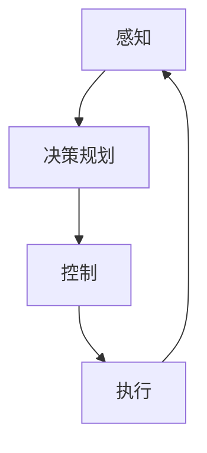

                 

**无人驾驶创业：重塑交通与物流的未来**

**作者：禅与计算机程序设计艺术 / Zen and the Art of Computer Programming**

## 1. 背景介绍

无人驾驶技术的发展正在重塑交通和物流行业，为我们带来了更安全、高效、可持续的出行和物流解决方案。本文将深入探讨无人驾驶创业的核心概念、关键算法、数学模型，并提供项目实践和工具推荐，最终展望未来发展趋势和挑战。

## 2. 核心概念与联系

无人驾驶系统（Autonomous Driving System,ADS）的核心概念包括感知、决策规划和控制。这些概念通过感知传感器、决策规划算法和控制器之间的信息流连接起来。



## 3. 核心算法原理 & 具体操作步骤

### 3.1 算法原理概述

无人驾驶算法的核心是模仿人类驾驶员的决策过程。主要包括以下步骤：

1. **感知**：使用传感器（如摄像头、雷达、激光雷达）收集环境数据。
2. **预测**：根据感知到的数据，预测其他车辆和行人的行为。
3. **决策规划**：根据预测结果，规划最佳路径和动作。
4. **控制**：将决策转化为控制指令，控制车辆的加速、转向和制动。

### 3.2 算法步骤详解

无人驾驶算法的具体操作步骤如下：

1. **感知**：使用深度学习模型（如YOLO、Faster R-CNN）检测和跟踪环境中的物体。
2. **预测**：使用预测模型（如Social Force Model、Deep Deterministic Policy Gradient, DDPG）预测其他物体的运动轨迹。
3. **决策规划**：使用路径规划算法（如A\*、Rapidly-exploring Random Tree, RRT）规划最佳路径。
4. **控制**：使用控制算法（如Proportional-Integral-Derivative, PID、Model Predictive Control, MPC）生成控制指令。

### 3.3 算法优缺点

优点：

- 更安全：无人驾驶系统可以避免人为错误导致的事故。
- 更高效：无人驾驶系统可以优化路径，减少等待时间。
- 更可持续：无人驾驶系统可以优化燃油消耗，减少排放。

缺点：

- 成本高：无人驾驶系统的开发和维护成本高昂。
- 技术挑战：无人驾驶系统需要解决感知、预测和决策等复杂问题。
- 法律和道德挑战：无人驾驶系统需要解决法律和道德问题，如责任归属和自动驾驶汽车的“道德算法”。

### 3.4 算法应用领域

无人驾驶算法的应用领域包括：

- 自动驾驶汽车：如Waymo、Tesla Autopilot。
- 自动驾驶卡车：如Uber ATG、TuSimple。
- 自动驾驶公共交通：如Cruise、Didi Autonomous Driving。

## 4. 数学模型和公式 & 详细讲解 & 举例说明

### 4.1 数学模型构建

无人驾驶系统的数学模型可以表示为：

$$ADS = \{P, F, D, C\}$$

其中，$P$表示感知模块，$F$表示预测模块，$D$表示决策规划模块，$C$表示控制模块。

### 4.2 公式推导过程

感知模块的数学模型可以表示为：

$$P = \{S, L, T\}$$

其中，$S$表示传感器，$L$表示目标检测算法，$T$表示目标跟踪算法。感知模块的输出是环境中的物体列表：

$$O_P = \{o_1, o_2,..., o_n\}$$

预测模块的数学模型可以表示为：

$$F = \{M, P_T\}$$

其中，$M$表示运动模型，$P_T$表示预测时间。预测模块的输出是其他物体的预测轨迹：

$$O_F = \{t_1, t_2,..., t_n\}$$

决策规划模块的数学模型可以表示为：

$$D = \{R, C_T\}$$

其中，$R$表示路径规划算法，$C_T$表示决策时间。决策规划模块的输出是最佳路径：

$$O_D = \{p\}$$

控制模块的数学模型可以表示为：

$$C = \{U, K\}$$

其中，$U$表示控制指令，$K$表示控制器。控制模块的输出是控制指令：

$$O_C = \{u\}$$

### 4.3 案例分析与讲解

例如，在一个简单的场景中，无人驾驶系统需要避免与另一辆车相撞。感知模块检测到另一辆车，预测模块预测另一辆车的运动轨迹，决策规划模块规划最佳路径，控制模块生成控制指令，避免与另一辆车相撞。

## 5. 项目实践：代码实例和详细解释说明

### 5.1 开发环境搭建

无人驾驶项目的开发环境包括：

- 编程语言：Python、C++。
- 深度学习框架：TensorFlow、PyTorch。
- 机器学习库：scikit-learn、Keras。
- 无人驾驶仿真平台：Carla、Gazebo。

### 5.2 源代码详细实现

以下是一个简单的无人驾驶算法的源代码示例：

```python
import numpy as np
import cv2

# 传感器数据
sensor_data = np.random.rand(100, 100)

# 目标检测
targets = detect_objects(sensor_data)

# 目标跟踪
tracked_targets = track_targets(targets)

# 运动预测
predicted_trajectories = predict_trajectories(tracked_targets)

# 路径规划
best_path = plan_path(predicted_trajectories)

# 控制指令生成
control_command = generate_control_command(best_path)

# 执行控制指令
execute_control_command(control_command)
```

### 5.3 代码解读与分析

上述代码实现了无人驾驶系统的感知、预测、决策规划和控制功能。感知模块使用目标检测算法检测环境中的物体，目标跟踪算法跟踪物体的运动。预测模块使用运动预测算法预测物体的运动轨迹。决策规划模块使用路径规划算法规划最佳路径。控制模块使用控制算法生成控制指令，并执行控制指令。

### 5.4 运行结果展示

无人驾驶系统的运行结果可以通过仿真平台或真实路测试来展示。例如，使用Carla仿真平台，可以展示无人驾驶汽车在各种场景下的表现，如城市街道、高速公路和停车场。

## 6. 实际应用场景

### 6.1 当前应用

无人驾驶技术已经在多个领域得到应用，包括：

- 自动驾驶汽车：如Waymo、Tesla Autopilot。
- 自动驾驶卡车：如Uber ATG、TuSimple。
- 自动驾驶公共交通：如Cruise、Didi Autonomous Driving。

### 6.2 未来应用展望

未来无人驾驶技术的应用将扩展到：

- 自动驾驶飞机：无人机和自动驾驶飞机将在物流和运输领域得到广泛应用。
- 自动驾驶轮船：自动驾驶轮船将在海运和航运领域得到应用。
- 自动驾驶建筑：自动驾驶建筑将在建筑行业得到应用，如自动驾驶挖掘机和自动驾驶起重机。

## 7. 工具和资源推荐

### 7.1 学习资源推荐

无人驾驶技术的学习资源包括：

- 书籍：《无人驾驶汽车：从原理到实践》《自动驾驶：从感知到决策》。
- 在线课程：Udacity自动驾驶工程师纳米学位、Coursera自动驾驶课程。
- 研究论文：arXiv、IEEE Xplore、Springer。

### 7.2 开发工具推荐

无人驾驶项目的开发工具包括：

- 编程语言：Python、C++。
- 深度学习框架：TensorFlow、PyTorch。
- 机器学习库：scikit-learn、Keras。
- 无人驾驶仿真平台：Carla、Gazebo。
- 无人驾驶开发平台：Autoware、Apollo。

### 7.3 相关论文推荐

无人驾驶技术的相关论文包括：

- Deep Learning for Self-Driving Cars：A Survey（深度学习在自动驾驶汽车中的应用：综述）
- End-to-End Deep Learning for Self-Driving Cars（端到端深度学习在自动驾驶汽车中的应用）
- A Survey of Deep Learning Techniques for Autonomous Vehicles（自动驾驶汽车中深度学习技术的综述）

## 8. 总结：未来发展趋势与挑战

### 8.1 研究成果总结

无人驾驶技术已经取得了显著的研究成果，包括感知、预测、决策规划和控制算法的开发，以及无人驾驶系统的集成和测试。

### 8.2 未来发展趋势

未来无人驾驶技术的发展趋势包括：

- 端到端学习：使用深度学习算法直接从感知数据到控制指令学习。
- 多模式感知：结合视觉、雷达和激光雷达等多种传感器数据，提高感知的准确性和可靠性。
- 多agent系统：研究无人驾驶系统与其他交通参与者（如行人、自行车）的协作和交互。

### 8.3 面临的挑战

无人驾驶技术面临的挑战包括：

- 成本高：无人驾驶系统的开发和维护成本高昂。
- 技术挑战：无人驾驶系统需要解决感知、预测和决策等复杂问题。
- 法律和道德挑战：无人驾驶系统需要解决法律和道德问题，如责任归属和“道德算法”。

### 8.4 研究展望

未来无人驾驶技术的研究展望包括：

- 智能交通系统：研究无人驾驶系统与交通基础设施（如交通信号灯、路面标志）的交互和协作。
- 可解释的人工智能：研究无人驾驶系统的决策过程，提高决策的可解释性和可靠性。
- 多模式交通：研究无人驾驶系统在多模式交通（如公共交通、共享单车）中的应用。

## 9. 附录：常见问题与解答

**Q1：无人驾驶系统的感知模块需要哪些传感器？**

A1：无人驾驶系统的感知模块需要视觉传感器（如摄像头）、雷达和激光雷达等传感器，以收集环境数据。

**Q2：无人驾驶系统的预测模块需要哪些算法？**

A2：无人驾驶系统的预测模块需要运动预测算法，如Social Force Model和Deep Deterministic Policy Gradient。

**Q3：无人驾驶系统的决策规划模块需要哪些算法？**

A3：无人驾驶系统的决策规划模块需要路径规划算法，如A\*和Rapidly-exploring Random Tree。

**Q4：无人驾驶系统的控制模块需要哪些算法？**

A4：无人驾驶系统的控制模块需要控制算法，如Proportional-Integral-Derivative和Model Predictive Control。

**Q5：无人驾驶系统的“道德算法”是什么？**

A5：无人驾驶系统的“道德算法”指的是在无人驾驶系统面临两难选择时，如何做出决策的算法。例如，在无法避免与行人或其他车辆相撞的情况下，如何选择最小化伤害的方案。

## 结束语

无人驾驶技术的发展正在重塑交通和物流行业，为我们带来了更安全、高效、可持续的出行和物流解决方案。本文介绍了无人驾驶系统的核心概念、关键算法、数学模型，并提供了项目实践和工具推荐，最终展望了未来发展趋势和挑战。我们期待无人驾驶技术的进一步发展，为我们带来更美好的出行和物流体验。

**作者：禅与计算机程序设计艺术 / Zen and the Art of Computer Programming**

（完）

