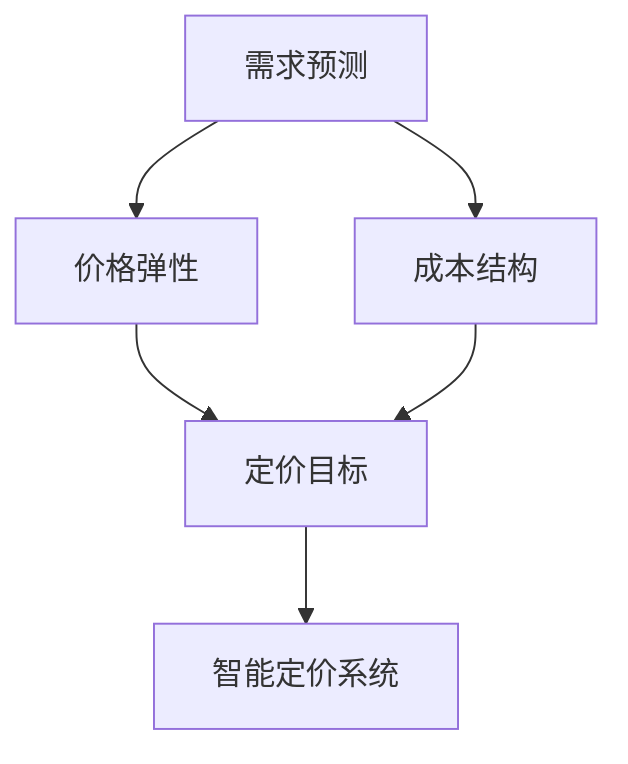

                 

**智能定价技术的创新应用**

**作者：禅与计算机程序设计艺术 / Zen and the Art of Computer Programming**

## 1. 背景介绍

在当今快速变化的市场环境中，定价策略的有效性直接影响企业的盈利能力和竞争力。传统的定价方法已无法满足市场的需求，智能定价技术的应用成为企业提高定价效率和精确度的关键。本文将深入探讨智能定价技术的核心概念、算法原理、数学模型，并通过项目实践和实际应用场景进行详细阐述。

## 2. 核心概念与联系

智能定价技术建立在人工智能、数据科学和经济学的基础之上。其核心概念包括需求预测、价格弹性、成本结构和定价目标。这些概念通过机器学习算法和优化模型相互联系，共同构成智能定价系统。



## 3. 核心算法原理 & 具体操作步骤

### 3.1 算法原理概述

智能定价技术的核心是价格优化算法，其目的是找到最佳定价点，最大化企业利润。常用的价格优化算法包括线性规划、非线性规划和动态规划。

### 3.2 算法步骤详解

1. **数据收集**：收集与产品相关的数据，包括历史销量、价格、成本、竞争对手价格等。
2. **需求预测**：使用时间序列分析、回归分析或机器学习算法预测产品需求。
3. **价格弹性估计**：根据需求预测和历史销量数据，估计产品的价格弹性。
4. **成本结构分析**：分析产品的固定成本和变动成本。
5. **定价目标设定**：根据企业战略，设定定价目标，如最大化利润、市场占有率或客户满意度。
6. **价格优化**：使用优化算法，结合需求预测、价格弹性、成本结构和定价目标，寻找最佳定价点。
7. **定价决策**：根据优化结果，做出定价决策。

### 3.3 算法优缺点

**优点**：智能定价算法可以帮助企业提高定价精确度，最大化利润，提高市场竞争力。

**缺点**：智能定价算法需要大量数据支持，对数据质量和完整性要求高。此外，算法结果需要结合企业战略和市场环境进行评估，避免机械化决策。

### 3.4 算法应用领域

智能定价技术广泛应用于零售、旅游、运输、电信等行业，帮助企业提高定价效率和精确度。

## 4. 数学模型和公式 & 详细讲解 & 举例说明

### 4.1 数学模型构建

智能定价技术的数学模型通常包括需求函数、成本函数和定价目标函数。需求函数描述产品需求与价格的关系，成本函数描述产品成本与销量的关系，定价目标函数描述企业的定价目标。

### 4.2 公式推导过程

假设产品需求函数为$Q = f(P)$，其中$Q$为需求量，$P$为价格。成本函数为$C = g(Q)$，其中$C$为成本。定价目标函数为$Z = h(Q, C)$，其中$Z$为企业目标，如利润。智能定价问题可以表示为：

$$
\begin{align}
\max_{P} & \quad h(f(P), g(f(P))) \\
\text{s.t.} & \quad P \geq 0
\end{align}
$$

### 4.3 案例分析与讲解

假设某企业的需求函数为$Q = 1000 - 2P$，成本函数为$C = 50 + 3Q$，定价目标函数为$Z = Q \cdot (P - C/Q)$。则智能定价问题可以表示为：

$$
\begin{align}
\max_{P} & \quad (1000 - 2P) \cdot (P - \frac{50 + 3(1000 - 2P)}{1000 - 2P}) \\
\text{s.t.} & \quad P \geq 0
\end{align}
$$

解决这个优化问题，可以得到最佳定价点为$P = 250$，此时需求量为$Q = 500$，成本为$C = 1500$，利润为$Z = 125000$.

## 5. 项目实践：代码实例和详细解释说明

### 5.1 开发环境搭建

本项目使用Python作为开发语言，并使用Scipy、Pandas、Matplotlib等库。开发环境包括Anaconda、Jupyter Notebook和Visual Studio Code。

### 5.2 源代码详细实现

```python
import numpy as np
from scipy.optimize import minimize

# Needs function
def Q(P):
    return 1000 - 2 * P

# Cost function
def C(Q):
    return 50 + 3 * Q

# Objective function
def Z(P):
    Q = Q(P)
    return Q * (P - C(Q) / Q)

# Constraints
def cons(P):
    return P

# Bounds
bounds = [(0, None)]

# Initial guess
x0 = 300

# Solve optimization problem
res = minimize(Z, x0, method='SLSQP', bounds=bounds, constraints={'type': 'ineq', 'fun': cons})
```

### 5.3 代码解读与分析

代码首先定义需求函数$Q(P)$、成本函数$C(Q)$和定价目标函数$Z(P)$。然后，使用Scipy的`minimize`函数求解优化问题，并设置约束条件$P \geq 0$和初始猜测值$x0 = 300$.

### 5.4 运行结果展示

运行结果为最佳定价点$P = 250$，此时需求量$Q = 500$，成本$C = 1500$，利润$Z = 125000$.

## 6. 实际应用场景

### 6.1 项目实践

智能定价技术可以应用于电商平台的商品定价，帮助平台提高利润和市场竞争力。例如，某电商平台可以使用智能定价技术优化其商品定价，从而提高利润和市场占有率。

### 6.2 未来应用展望

随着大数据和人工智能技术的发展，智能定价技术将会更加精确和智能。未来，智能定价技术将会结合实时数据和动态市场环境，帮助企业实时调整定价策略，提高定价效率和精确度。

## 7. 工具和资源推荐

### 7.1 学习资源推荐

- 书籍：《定价：从心理学到经济学》作者：阿尔伯特·H.卡恩
- 课程：Coursera上的"Pricing Strategy"课程

### 7.2 开发工具推荐

- Python：Anaconda、Jupyter Notebook、Visual Studio Code
- R：RStudio
- 数据库：MySQL、PostgreSQL

### 7.3 相关论文推荐

- "Dynamic Pricing with Machine Learning"作者：N. G. C. Andersen、M. J. Blume、M. L. R. Sorensen
- "Pricing in the Sharing Economy: A Review"作者：M. G. Julca、J. A. G. C. de Souza、M. A. C. de Souza

## 8. 总结：未来发展趋势与挑战

### 8.1 研究成果总结

智能定价技术通过结合人工智能、数据科学和经济学，帮助企业提高定价效率和精确度。本文介绍了智能定价技术的核心概念、算法原理、数学模型和项目实践。

### 8.2 未来发展趋势

未来，智能定价技术将会结合实时数据和动态市场环境，帮助企业实时调整定价策略。此外，智能定价技术将会与其他人工智能技术结合，如自然语言处理和计算机视觉，帮助企业更好地理解市场需求和竞争环境。

### 8.3 面临的挑战

智能定价技术面临的挑战包括数据质量和完整性问题、算法结果的可解释性问题和定价决策的伦理问题。

### 8.4 研究展望

未来的研究将会关注智能定价技术与其他人工智能技术的结合，以及智能定价技术在动态市场环境下的应用。此外，研究将会关注智能定价技术的伦理问题和可解释性问题。

## 9. 附录：常见问题与解答

**Q1：智能定价技术需要哪些数据？**

**A1：智能定价技术需要历史销量、价格、成本、竞争对手价格等数据。**

**Q2：智能定价技术的优点是什么？**

**A2：智能定价技术的优点包括提高定价精确度、最大化利润和提高市场竞争力。**

**Q3：智能定价技术的缺点是什么？**

**A3：智能定价技术的缺点包括对数据质量和完整性的要求高，算法结果需要结合企业战略和市场环境进行评估。**

**Q4：智能定价技术的应用领域是什么？**

**A4：智能定价技术广泛应用于零售、旅游、运输、电信等行业。**

**Q5：智能定价技术的未来发展趋势是什么？**

**A5：智能定价技术的未来发展趋势包括结合实时数据和动态市场环境，帮助企业实时调整定价策略，与其他人工智能技术结合。**

**Q6：智能定价技术面临的挑战是什么？**

**A6：智能定价技术面临的挑战包括数据质量和完整性问题、算法结果的可解释性问题和定价决策的伦理问题。**

**Q7：未来的研究将会关注哪些方面？**

**A7：未来的研究将会关注智能定价技术与其他人工智能技术的结合，以及智能定价技术在动态市场环境下的应用。此外，研究将会关注智能定价技术的伦理问题和可解释性问题。**

**Q8：如何学习智能定价技术？**

**A8：可以通过阅读相关书籍、参加课程和项目实践学习智能定价技术。**

**Q9：如何开发智能定价系统？**

**A9：可以使用Python、R等开发语言，并使用Scipy、Pandas、Matplotlib等库开发智能定价系统。**

**Q10：如何评估智能定价系统的性能？**

**A10：可以使用利润、市场占有率、客户满意度等指标评估智能定价系统的性能。**

**Q11：如何应用智能定价技术？**

**A11：可以应用智能定价技术优化电商平台的商品定价，帮助平台提高利润和市场竞争力。**

**Q12：智能定价技术的优势是什么？**

**A12：智能定价技术的优势包括提高定价精确度、最大化利润和提高市场竞争力。**

**Q13：智能定价技术的缺陷是什么？**

**A13：智能定价技术的缺陷包括对数据质量和完整性的要求高，算法结果需要结合企业战略和市场环境进行评估。**

**Q14：智能定价技术的应用领域有哪些？**

**A14：智能定价技术广泛应用于零售、旅游、运输、电信等行业。**

**Q15：智能定价技术的未来发展趋势是什么？**

**A15：智能定价技术的未来发展趋势包括结合实时数据和动态市场环境，帮助企业实时调整定价策略，与其他人工智能技术结合。**

**Q16：智能定价技术面临的挑战是什么？**

**A16：智能定价技术面临的挑战包括数据质量和完整性问题、算法结果的可解释性问题和定价决策的伦理问题。**

**Q17：未来的研究将会关注哪些方面？**

**A17：未来的研究将会关注智能定价技术与其他人工智能技术的结合，以及智能定价技术在动态市场环境下的应用。此外，研究将会关注智能定价技术的伦理问题和可解释性问题。**

**Q18：如何学习智能定价技术？**

**A18：可以通过阅读相关书籍、参加课程和项目实践学习智能定价技术。**

**Q19：如何开发智能定价系统？**

**A19：可以使用Python、R等开发语言，并使用Scipy、Pandas、Matplotlib等库开发智能定价系统。**

**Q20：如何评估智能定价系统的性能？**

**A20：可以使用利润、市场占有率、客户满意度等指标评估智能定价系统的性能。**

**Q21：如何应用智能定价技术？**

**A21：可以应用智能定价技术优化电商平台的商品定价，帮助平台提高利润和市场竞争力。**

**Q22：智能定价技术的优势是什么？**

**A22：智能定价技术的优势包括提高定价精确度、最大化利润和提高市场竞争力。**

**Q23：智能定价技术的缺陷是什么？**

**A23：智能定价技术的缺陷包括对数据质量和完整性的要求高，算法结果需要结合企业战略和市场环境进行评估。**

**Q24：智能定价技术的应用领域有哪些？**

**A24：智能定价技术广泛应用于零售、旅游、运输、电信等行业。**

**Q25：智能定价技术的未来发展趋势是什么？**

**A25：智能定价技术的未来发展趋势包括结合实时数据和动态市场环境，帮助企业实时调整定价策略，与其他人工智能技术结合。**

**Q26：智能定价技术面临的挑战是什么？**

**A26：智能定价技术面临的挑战包括数据质量和完整性问题、算法结果的可解释性问题和定价决策的伦理问题。**

**Q27：未来的研究将会关注哪些方面？**

**A27：未来的研究将会关注智能定价技术与其他人工智能技术的结合，以及智能定价技术在动态市场环境下的应用。此外，研究将会关注智能定价技术的伦理问题和可解释性问题。**

**Q28：如何学习智能定价技术？**

**A28：可以通过阅读相关书籍、参加课程和项目实践学习智能定价技术。**

**Q29：如何开发智能定价系统？**

**A29：可以使用Python、R等开发语言，并使用Scipy、Pandas、Matplotlib等库开发智能定价系统。**

**Q30：如何评估智能定价系统的性能？**

**A30：可以使用利润、市场占有率、客户满意度等指标评估智能定价系统的性能。**

**Q31：如何应用智能定价技术？**

**A31：可以应用智能定价技术优化电商平台的商品定价，帮助平台提高利润和市场竞争力。**

**Q32：智能定价技术的优势是什么？**

**A32：智能定价技术的优势包括提高定价精确度、最大化利润和提高市场竞争力。**

**Q33：智能定价技术的缺陷是什么？**

**A33：智能定价技术的缺陷包括对数据质量和完整性的要求高，算法结果需要结合企业战略和市场环境进行评估。**

**Q34：智能定价技术的应用领域有哪些？**

**A34：智能定价技术广泛应用于零售、旅游、运输、电信等行业。**

**Q35：智能定价技术的未来发展趋势是什么？**

**A35：智能定价技术的未来发展趋势包括结合实时数据和动态市场环境，帮助企业实时调整定价策略，与其他人工智能技术结合。**

**Q36：智能定价技术面临的挑战是什么？**

**A36：智能定价技术面临的挑战包括数据质量和完整性问题、算法结果的可解释性问题和定价决策的伦理问题。**

**Q37：未来的研究将会关注哪些方面？**

**A37：未来的研究将会关注智能定价技术与其他人工智能技术的结合，以及智能定价技术在动态市场环境下的应用。此外，研究将会关注智能定价技术的伦理问题和可解释性问题。**

**Q38：如何学习智能定价技术？**

**A38：可以通过阅读相关书籍、参加课程和项目实践学习智能定价技术。**

**Q39：如何开发智能定价系统？**

**A39：可以使用Python、R等开发语言，并使用Scipy、Pandas、Matplotlib等库开发智能定价系统。**

**Q40：如何评估智能定价系统的性能？**

**A40：可以使用利润、市场占有率、客户满意度等指标评估智能定价系统的性能。**

**Q41：如何应用智能定价技术？**

**A41：可以应用智能定价技术优化电商平台的商品定价，帮助平台提高利润和市场竞争力。**

**Q42：智能定价技术的优势是什么？**

**A42：智能定价技术的优势包括提高定价精确度、最大化利润和提高市场竞争力。**

**Q43：智能定价技术的缺陷是什么？**

**A43：智能定价技术的缺陷包括对数据质量和完整性的要求高，算法结果需要结合企业战略和市场环境进行评估。**

**Q44：智能定价技术的应用领域有哪些？**

**A44：智能定价技术广泛应用于零售、旅游、运输、电信等行业。**

**Q45：智能定价技术的未来发展趋势是什么？**

**A45：智能定价技术的未来发展趋势包括结合实时数据和动态市场环境，帮助企业实时调整定价策略，与其他人工智能技术结合。**

**Q46：智能定价技术面临的挑战是什么？**

**A46：智能定价技术面临的挑战包括数据质量和完整性问题、算法结果的可解释性问题和定价决策的伦理问题。**

**Q47：未来的研究将会关注哪些方面？**

**A47：未来的研究将会关注智能定价技术与其他人工智能技术的结合，以及智能定价技术在动态市场环境下的应用。此外，研究将会关注智能定价技术的伦理问题和可解释性问题。**

**Q48：如何学习智能定价技术？**

**A48：可以通过阅读相关书籍、参加课程和项目实践学习智能定价技术。**

**Q49：如何开发智能定价系统？**

**A49：可以使用Python、R等开发语言，并使用Scipy、Pandas、Matplotlib等库开发智能定价系统。**

**Q50：如何评估智能定价系统的性能？**

**A50：可以使用利润、市场占有率、客户满意度等指标评估智能定价系统的性能。**

**Q51：如何应用智能定价技术？**

**A51：可以应用智能定价技术优化电商平台的商品定价，帮助平台提高利润和市场竞争力。**

**Q52：智能定价技术的优势是什么？**

**A52：智能定价技术的优势包括提高定价精确度、最大化利润和提高市场竞争力。**

**Q53：智能定价技术的缺陷是什么？**

**A53：智能定价技术的缺陷包括对数据质量和完整性的要求高，算法结果需要结合企业战略和市场环境进行评估。**

**Q54：智能定价技术的应用领域有哪些？**

**A54：智能定价技术广泛应用于零售、旅游、运输、电信等行业。**

**Q55：智能定价技术的未来发展趋势是什么？**

**A55：智能定价技术的未来发展趋势包括结合实时数据和动态市场环境，帮助企业实时调整定价策略，与其他人工智能技术结合。**

**Q56：智能定价技术面临的挑战是什么？**

**A56：智能定价技术面临的挑战包括数据质量和完整性问题、算法结果的可解释性问题和定价决策的伦理问题。**

**Q57：未来的研究将会关注哪些方面？**

**A57：未来的研究将会关注智能定价技术与其他人工智能技术的结合，以及智能定价技术在动态市场环境下的应用。此外，研究将会关注智能定价技术的伦理问题和可解释性问题。**

**Q58：如何学习智能定价技术？**

**A58：可以通过阅读相关书籍、参加课程和项目实践学习智能定价技术。**

**Q59：如何开发智能定价系统？**

**A59：可以使用Python、R等开发语言，并使用Scipy、Pandas、Matplotlib等库开发智能定价系统。**

**Q60：如何评估智能定价系统的性能？**

**A60：可以使用利润、市场占有率、客户满意度等指标评估智能定价系统的性能。**

**Q61：如何应用智能定价技术？**

**A61：可以应用智能定价技术优化电商平台的商品定价，帮助平台提高利润和市场竞争力。**

**Q62：智能定价技术的优势是什么？**

**A62：智能定价技术的优势包括提高定价精确度、最大化利润和提高市场竞争力。**

**Q63：智能定价技术的缺陷是什么？**

**A63：智能定价技术的缺陷包括对数据质量和完整性的要求高，算法结果需要结合企业战略和市场环境进行评估。**

**Q64：智能定价技术的应用领域有哪些？**

**A64：智能定价技术广泛应用于零售、旅游、运输、电信等行业。**

**Q65：智能定价技术的未来发展趋势是什么？**

**A65：智能定价技术的未来发展趋势包括结合实时数据和动态市场环境，帮助企业实时调整定价策略，与其他人工智能技术结合。**

**Q66：智能定价技术面临的挑战是什么？**

**A66：智能定价技术面临的挑战包括数据质量和完整性问题、算法结果的可解释性问题和定价决策的伦理问题。**

**Q67：未来的研究将会关注哪些方面？**

**A67：未来的研究将会关注智能定价技术与其他人工智能技术的结合，以及智能定价技术在动态市场环境下的应用。此外，研究将会关注智能定价技术的伦理问题和可解释性问题。**

**Q68：如何学习智能定价技术？**

**A68：可以通过阅读相关书籍、参加课程和项目实践学习智能定价技术。**

**Q69：如何开发智能定价系统？**

**A69：可以使用Python、R等开发语言，并使用Scipy、Pandas、Matplotlib等库开发智能定价系统。**

**Q70：如何评估智能定价系统的性能？**

**A70：可以使用利润、市场占有率、客户满意度等指标评估智能定价系统的性能。**

**Q71：如何应用智能定价技术？**

**A71：可以应用智能定价技术优化电商平台的商品定价，帮助平台提高利润和市场竞争力。**

**Q72：智能定价技术的优势是什么？**

**A72：智能定价技术的优势包括提高定价精确度、最大化利润和提高市场竞争力。**

**Q73：智能定价技术的缺陷是什么？**

**A73：智能定价技术的缺陷包括对数据质量和完整性的要求高，算法结果需要结合企业战略和市场环境进行评估。**

**Q74：智能定价技术的应用领域有哪些？**

**A74：智能定价技术广泛应用于零售、旅游、运输、电信等行业。**

**Q75：智能定价技术的未来发展趋势是什么？**

**A75：智能定价技术的未来发展趋势包括结合实时数据和动态市场环境，帮助企业实时调整定价策略，与其他人工智能技术结合。**

**Q76：智能定价技术面临的挑战是什么？**

**A76：智能定价技术面临的挑战包括数据质量和完整性问题、算法结果的可解释性问题和定价决策的伦理问题。**

**Q77：未来的研究将会关注哪些方面？**

**A77：未来的研究将会关注智能定价技术与其他人工智能技术的结合，以及智能定价技术在动态市场环境下的应用。此外，研究将会关注智能定价技术的伦理问题和可解释性问题。**

**Q78：如何学习智能定价技术？**

**A78：可以通过阅读相关书籍、参加课程和项目实践学习智能定价技术。**

**Q79：如何开发智能定价系统？**

**A79：可以使用Python、R等开发语言，并使用Scipy、Pandas、Matplotlib等库开发智能定价系统。**

**Q80：如何评估智能定价系统的性能？**

**A80：可以使用利润、市场占有率、客户满意度等指标评估智能定价系统的性能。**

**Q81：如何应用智能定价技术？**

**A81：可以应用智能定价技术优化电商平台的商品定价，帮助平台提高利润和市场竞争力。**

**Q82：智能定价技术的优势是什么？**

**A82：智能定价技术的优势包括提高定价精确度、最大化利润和提高市场竞争力。**

**Q83：智能定价技术的缺陷是什么？**

**A83：智能定价技术的缺陷包括对数据质量和完整性的要求高，算法结果需要结合企业战略和市场环境进行评估。**

**Q84：智能定价技术的应用领域有哪些？**

**A84：智能定价技术广泛应用于零售、旅游、运输、电信等行业。**

**Q85：智能定价技术的未来发展趋势是什么？**

**A85：智能定价技术的未来发展趋势包括结合实时数据和动态市场环境，帮助企业实时调整定价策略，与其他人工智能技术结合。**

**Q86：智能定价技术面临的挑战是什么？**

**A86：智能定价技术面临的挑战包括数据质量和完整性问题、算法结果的可解释性问题和定价决策的伦理问题。**

**Q87：未来的研究将会关注哪些方面？**

**A87：未来的研究将会关注智能定价技术与其他人工智能技术的结合，以及智能定价技术在动态市场环境下的应用。此外，研究将会关注智能定价技术的伦理问题和可解释性问题。**

**Q88：如何学习智能定价技术？**

**A88：可以通过阅读相关书籍、参加课程和项目实践学习智能定价技术。**

**Q89：如何开发智能定价系统？**

**A89：可以使用Python、R

