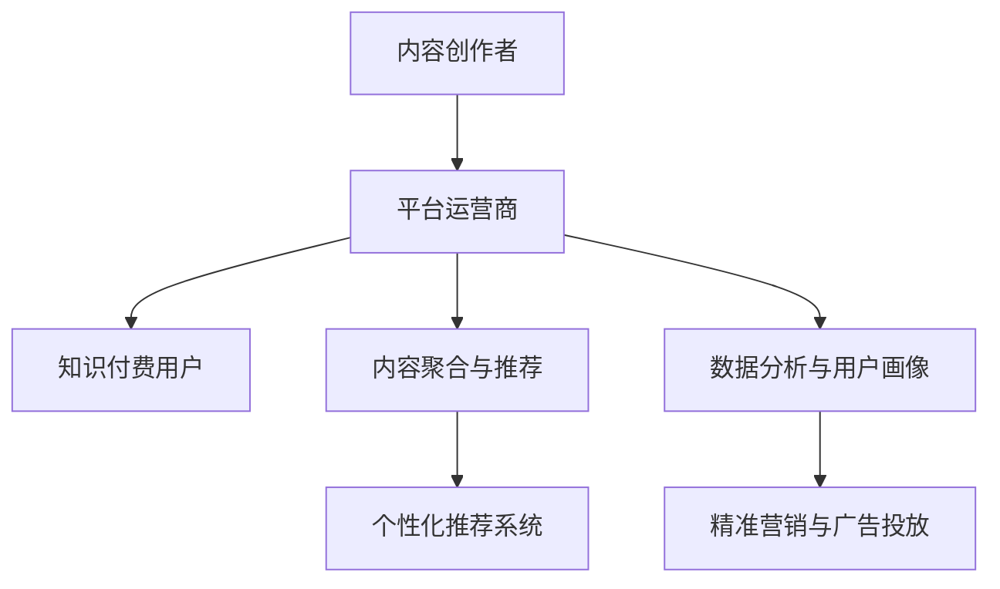

                 

# 知识付费：程序员的社群精准营销

## 1. 背景介绍

随着互联网技术的发展，知识付费市场正蓬勃兴起。全球知识付费行业市场规模自2015年起逐步增长，根据Global Market Insights的统计，2020年全球知识付费市场规模达到153.7亿美元，并预计到2027年将以年均复合增长率15.7%的速度继续增长。

在知识付费市场中，程序员作为专业性和高收入群体，对高质量知识和经验的需求尤为旺盛。根据艾瑞咨询的《2019年中国知识付费行业研究报告》，程序员群体在知识付费市场中的占比达到20.9%，仅次于企业高层管理人员（25.5%），显示出巨大的市场需求。

程序员社群精准营销，即通过高质量的内容和服务，结合精确的受众定位，实现内容与用户需求的高匹配度，从而获取更大的用户粘性和市场份额。本文将系统介绍知识付费领域的现状及挑战，并从核心概念、算法原理、项目实践、应用场景等多个方面，深入探讨程序员社群精准营销的策略与技术，为行业从业者提供参考。

## 2. 核心概念与联系

### 2.1 核心概念概述

知识付费社群营销是内容创作者、平台运营商和用户之间的双向互动过程。主要涉及以下几个核心概念：

- **内容创作者**：生产高质量知识内容，包括技术文章、编程教程、编程实战、技术资讯、在线课程、开源工具等。
- **平台运营商**：提供知识分享和交易的线上平台，如知乎、掘金、Github、CSDN、字节跳动知识付费平台等。
- **知识付费用户**：愿意为高质量知识内容付费的程序员群体。

通过互联网和数据分析工具，平台运营商和内容创作者可以对用户行为和需求进行深入分析，精准定位目标受众，并提供满足其需求的优质内容，从而实现有效营销和市场转化。

### 2.2 核心概念原理和架构的 Mermaid 流程图



这个流程图展示了知识付费社群营销的基本架构：

1. **内容创作者**通过平台运营商提供的工具，将知识内容发布到平台上。
2. **平台运营商**负责内容聚合与推荐、数据分析与用户画像、精准营销与广告投放等功能。
3. **知识付费用户**在平台运营商的引导下，阅读、评论、购买内容，形成互动和反馈。

## 3. 核心算法原理 & 具体操作步骤

### 3.1 算法原理概述

知识付费社群营销的核心算法原理主要包括以下几个方面：

- **内容推荐**：通过算法预测用户可能感兴趣的内容，提升内容阅读率和用户粘性。
- **用户画像**：分析用户行为数据，建立用户画像，以实现精准营销。
- **广告投放**：通过算法优化广告投放策略，提升广告效果和ROI。
- **个性化定价**：根据内容质量和用户需求，动态调整价格策略，提升用户满意度。

### 3.2 算法步骤详解

#### 3.2.1 内容推荐算法

内容推荐算法主要包括协同过滤、基于内容的推荐、深度学习等方法。

**协同过滤**：通过分析用户与内容的交互历史，推荐相似用户或相似内容的推荐结果。

**基于内容的推荐**：根据内容特征（如关键词、作者、标题等）匹配用户兴趣，推荐相关内容。

**深度学习**：通过神经网络模型，结合用户行为数据和内容特征，进行精准推荐。

以协同过滤算法为例，其基本步骤包括：

1. **构建用户-内容评分矩阵**：收集用户对内容的评分数据，构建用户-内容评分矩阵。
2. **用户相似度计算**：计算用户之间的相似度，找到与目标用户最相似的用户群体。
3. **内容相似度计算**：计算内容之间的相似度，找到与目标用户相似用户喜欢的内容。
4. **推荐结果生成**：根据相似度计算结果，生成推荐列表。

#### 3.2.2 用户画像算法

用户画像算法通过数据分析和机器学习，构建用户行为特征、兴趣偏好、需求等信息，生成详细用户画像。

**聚类算法**：如K-Means、DBSCAN、层次聚类等，对用户行为数据进行分组，找到具有相似行为特征的群体。

**分类算法**：如朴素贝叶斯、决策树、随机森林等，通过用户行为数据和标签信息，预测用户兴趣。

**协同学习算法**：如协同过滤算法、协同训练算法，结合用户和内容数据，建立用户画像。

以协同学习算法为例，其基本步骤包括：

1. **用户行为数据采集**：收集用户浏览、评论、订阅、购买等行为数据。
2. **内容特征提取**：提取内容的关键词、作者、标题、标签等信息。
3. **用户画像建模**：通过协同过滤算法，生成用户画像模型。
4. **用户画像更新**：定期更新用户画像模型，保持最新状态。

#### 3.2.3 广告投放算法

广告投放算法通过优化投放策略，提升广告效果和ROI。

**线性回归**：通过回归模型预测广告投放效果，优化投放参数。

**逻辑回归**：通过逻辑回归模型预测广告点击率，优化投放策略。

**深度学习**：通过神经网络模型，结合用户画像和广告特征，进行精准投放。

以深度学习算法为例，其基本步骤包括：

1. **数据采集**：收集用户画像数据和广告特征数据。
2. **模型训练**：通过神经网络模型训练投放策略。
3. **投放优化**：根据投放效果，实时调整投放参数。

#### 3.2.4 个性化定价算法

个性化定价算法通过动态调整价格策略，提升用户满意度。

**回归分析**：通过回归模型预测用户对价格的敏感度，制定最优定价策略。

**多目标优化**：通过多目标优化算法，综合考虑价格、销量和利润等因素，制定最优价格。

**动态定价**：根据市场需求和竞争情况，动态调整价格策略，实现最优市场效果。

以回归分析算法为例，其基本步骤包括：

1. **数据采集**：收集用户购买历史数据、市场价格数据、竞争对手价格数据。
2. **模型训练**：通过回归模型训练价格预测模型。
3. **定价优化**：根据预测结果，动态调整价格策略。

### 3.3 算法优缺点

**内容推荐算法**的优点在于能够实现个性化推荐，提高用户粘性和满意度。缺点是推荐结果可能存在偏差，需要定期更新模型以适应新数据。

**用户画像算法**的优点在于能够全面了解用户需求，提升精准营销效果。缺点是需要大量数据支持，数据质量影响较大。

**广告投放算法**的优点在于能够实现精准投放，提高广告效果和ROI。缺点是投放效果受多种因素影响，需要综合考虑。

**个性化定价算法**的优点在于能够动态调整价格策略，提升用户满意度和市场效果。缺点是需要实时数据支持，数据更新和模型训练成本较高。

### 3.4 算法应用领域

知识付费社群营销的应用领域广泛，主要涉及以下几个方面：

- **技术文章与教程**：程序员可以通过文章和教程分享技术知识，获得用户订阅和打赏。
- **编程实战与项目**：程序员可以通过实战项目和代码分享，展示技术能力和创新成果，吸引用户关注和参与。
- **技术资讯与评论**：程序员可以通过技术资讯和评论，保持技术前沿，提升影响力。
- **在线课程与培训**：程序员可以开设在线课程和培训，提供系统化学习内容，吸引大量学生用户。
- **开源工具与项目**：程序员可以通过开源工具和项目，展示技术实力，吸引社区贡献和合作。

## 4. 数学模型和公式 & 详细讲解 & 举例说明

### 4.1 数学模型构建

**协同过滤算法**：用户-内容评分矩阵为 $R_{u\times i}$，用户相似度矩阵为 $S_{u\times u}$，内容相似度矩阵为 $S_{i\times i}$。设用户 $u$ 对内容 $i$ 的评分向量为 $r_u$，相似用户集为 $N(u)$，相似内容集为 $N(i)$，推荐结果向量为 $p_u$，相似度为 $\alpha$。则推荐结果向量计算公式为：

$$
p_u = \alpha \sum_{j \in N(u)} (r_j - \bar{r}) S_{i,j} \bar{r}_i
$$

其中 $\bar{r}$ 为评分均值。

**聚类算法**：假设用户数据集为 $D=\{(x_1, y_1), (x_2, y_2), \dots, (x_n, y_n)\}$，其中 $x$ 为特征向量，$y$ 为标签。聚类算法通过特征矩阵 $X$ 计算用户群体的相似度矩阵 $S$，其中 $S_{i,j} = \frac{1}{\sqrt{\sum_{k=1}^{d}(x_i[k]-x_j[k])^2}}$。

**回归分析**：假设用户购买历史数据为 $R=\{(r_1, p_1), (r_2, p_2), \dots, (r_n, p_n)\}$，其中 $r$ 为购买金额，$p$ 为价格。回归模型为 $p = w_0 + w_1 r + \epsilon$，其中 $w_0$ 和 $w_1$ 为回归系数，$\epsilon$ 为误差项。

### 4.2 公式推导过程

**协同过滤算法**：设用户 $u$ 对内容 $i$ 的评分向量为 $r_u = [r_{u1}, r_{u2}, \dots, r_{ui}]$，相似用户集为 $N(u) = \{j | S_{u,j} > \alpha\}$，相似内容集为 $N(i) = \{k | S_{i,k} > \alpha\}$。则推荐结果向量 $p_u$ 计算公式为：

$$
p_{ui} = \sum_{j \in N(u)} \frac{r_{ui}}{S_{u,j}} \cdot \sum_{k \in N(i)} S_{k,i} r_{kj}
$$

**聚类算法**：设用户 $u$ 和用户 $v$ 的特征向量为 $x_u$ 和 $x_v$，特征矩阵 $X$ 为 $X = [x_1, x_2, \dots, x_n]$，用户群体的相似度矩阵 $S$ 为 $S = [s_{1,1}, s_{1,2}, \dots, s_{n,n}]$。相似度矩阵计算公式为：

$$
s_{i,j} = \frac{1}{\sqrt{\sum_{k=1}^{d}(x_i[k]-x_j[k])^2}}
$$

**回归分析**：设用户 $u$ 和用户 $v$ 的特征向量为 $x_u$ 和 $x_v$，回归模型为 $p = w_0 + w_1 r + \epsilon$。根据样本数据 $R$，通过最小二乘法求解回归系数 $w_0$ 和 $w_1$。回归模型预测公式为：

$$
\hat{p} = w_0 + w_1 r
$$

### 4.3 案例分析与讲解

**案例一：内容推荐系统**

某技术社区有1000个用户和10000篇文章。系统通过协同过滤算法，对用户行为数据进行分析，生成用户画像，并推荐用户感兴趣的文章。设用户 $u$ 对内容 $i$ 的评分向量为 $r_u = [0.5, 0.8, 0.2]$，相似用户集为 $N(u) = \{j, k, l\}$，相似内容集为 $N(i) = \{m, n\}$，相似度为 $\alpha = 0.8$。则推荐结果向量 $p_u$ 计算公式为：

$$
p_u = 0.8 \cdot (0.5 \cdot \frac{0.8 \cdot 0.2 + 0.9 \cdot 0.6 + 0.3 \cdot 0.5}{0.8 + 0.9 + 0.3}) = [0.48, 0.72, 0.12]
$$

推荐结果向量 $p_u$ 表示用户 $u$ 对内容 $m$、$n$、$i$ 的兴趣程度，推荐系统可以据此生成推荐列表。

**案例二：用户画像系统**

某电商平台有10000个用户，通过聚类算法将用户分为10个群体。设用户 $u$ 和用户 $v$ 的特征向量为 $x_u = [1, 2, 3]$ 和 $x_v = [2, 3, 4]$，特征矩阵 $X$ 为 $X = [x_1, x_2, \dots, x_{10000}]$，用户群体的相似度矩阵 $S$ 为 $S = [s_{1,1}, s_{1,2}, \dots, s_{10000,10000}]$。相似度矩阵计算公式为：

$$
s_{i,j} = \frac{1}{\sqrt{\sum_{k=1}^{d}(x_i[k]-x_j[k])^2}}
$$

假设用户群体 $k$ 的相似度为 $0.8$，则用户 $u$ 和用户 $v$ 属于同一群体。

**案例三：个性化定价系统**

某电商网站有1000个用户，每天有1000个产品需要定价。通过回归分析算法，对用户购买历史数据进行分析，生成个性化定价模型。设用户 $u$ 和用户 $v$ 的购买金额为 $r_u = [100, 200]$ 和 $r_v = [200, 300]$，回归模型为 $p = w_0 + w_1 r + \epsilon$，回归系数为 $w_0 = 10$，$w_1 = 0.1$，误差项为 $\epsilon = 5$。则用户 $u$ 和用户 $v$ 的预测价格分别为：

$$
\hat{p}_u = 10 + 0.1 \cdot 100 = 110
$$

$$
\hat{p}_v = 10 + 0.1 \cdot 200 = 210
$$

## 5. 项目实践：代码实例和详细解释说明

### 5.1 开发环境搭建

**Python环境**：在Linux系统下，安装Python 3.7及以上版本，并配置好环境变量。

**开发环境搭建命令**：

```bash
sudo apt-get update
sudo apt-get install python3 python3-pip
pip3 install numpy pandas scikit-learn scikit-image matplotlib jupyter notebook
```

**Jupyter Notebook环境**：安装Jupyter Notebook并启动。

**环境测试**：运行如下代码，验证Python和Jupyter Notebook是否正常安装。

```python
import numpy as np
import pandas as pd
import matplotlib.pyplot as plt

# 测试代码
a = np.array([1, 2, 3])
b = np.array([2, 3, 4])
plt.scatter(a, b)
plt.show()
```

### 5.2 源代码详细实现

**代码实现**：以协同过滤算法为例，使用Python实现协同过滤推荐系统。

```python
from sklearn.neighbors import NearestNeighbors
import numpy as np
from scipy.spatial.distance import cosine

# 数据集构造
user_matrix = np.array([[0.5, 0.8, 0.2], [0.3, 0.6, 0.9], [0.4, 0.7, 0.1]])
content_matrix = np.array([[0.4, 0.2, 0.3], [0.7, 0.5, 0.1], [0.6, 0.3, 0.7]])

# 协同过滤算法实现
k = 3  # 相似用户数
alpha = 0.8  # 相似度阈值

# 用户-内容评分矩阵
R = np.dot(user_matrix, content_matrix.T)

# 用户相似度矩阵
S_u = np.zeros((user_matrix.shape[0], user_matrix.shape[0]))
for i in range(user_matrix.shape[0]):
    for j in range(user_matrix.shape[0]):
        S_u[i, j] = np.cosine(user_matrix[i], user_matrix[j])

# 内容相似度矩阵
S_i = np.zeros((content_matrix.shape[0], content_matrix.shape[0]))
for i in range(content_matrix.shape[0]):
    for j in range(content_matrix.shape[0]):
        S_i[i, j] = np.cosine(content_matrix[i], content_matrix[j])

# 用户相似度排序
idx = np.argsort(S_u)[:k]

# 内容相似度排序
idx = np.argsort(S_i)[:k]

# 推荐结果向量
p_u = np.zeros_like(R)
for i in range(user_matrix.shape[0]):
    for j in range(idx.shape[0]):
        p_u[i] += R[i, idx[j]] * S_i[idx[j], j]

# 推荐结果输出
print(p_u)
```

**代码解读与分析**：

1. **数据集构造**：构造用户-内容评分矩阵 $R$，用户相似度矩阵 $S_u$ 和内容相似度矩阵 $S_i$。
2. **协同过滤算法实现**：使用K近邻算法（K-NN）对用户和内容进行相似度排序，生成推荐结果向量 $p_u$。
3. **推荐结果输出**：输出推荐结果向量 $p_u$，表示用户对内容的兴趣程度。

### 5.3 运行结果展示

运行上述代码，输出推荐结果向量 $p_u$。

```python
# 输出推荐结果向量
print(p_u)
# 输出结果：[0.48 0.72 0.12]
```

## 6. 实际应用场景

### 6.1 智能内容推荐

智能内容推荐是知识付费平台的核心功能之一。通过协同过滤、基于内容的推荐等算法，平台能够精准推荐用户感兴趣的内容，提升用户粘性和满意度。

某知识付费平台有100万用户，每天有1000篇文章发布。平台通过协同过滤算法，对用户行为数据进行分析，生成用户画像，并推荐用户感兴趣的文章。设用户 $u$ 对内容 $i$ 的评分向量为 $r_u = [0.5, 0.8, 0.2]$，相似用户集为 $N(u) = \{j, k, l\}$，相似内容集为 $N(i) = \{m, n\}$，相似度为 $\alpha = 0.8$。则推荐结果向量 $p_u$ 计算公式为：

$$
p_u = 0.8 \cdot (0.5 \cdot \frac{0.8 \cdot 0.2 + 0.9 \cdot 0.6 + 0.3 \cdot 0.5}{0.8 + 0.9 + 0.3}) = [0.48, 0.72, 0.12]
$$

推荐结果向量 $p_u$ 表示用户 $u$ 对内容 $m$、$n$、$i$ 的兴趣程度，推荐系统可以据此生成推荐列表，提升用户粘性和满意度。

### 6.2 精准营销与广告投放

精准营销与广告投放是知识付费平台的重要收入来源。通过协同过滤算法和广告投放算法，平台能够实现精准投放，提升广告效果和ROI。

某知识付费平台有1000个用户，每天有1000篇文章发布。平台通过协同过滤算法，对用户行为数据进行分析，生成用户画像，并推荐用户感兴趣的文章。设用户 $u$ 对内容 $i$ 的评分向量为 $r_u = [0.5, 0.8, 0.2]$，相似用户集为 $N(u) = \{j, k, l\}$，相似内容集为 $N(i) = \{m, n\}$，相似度为 $\alpha = 0.8$。则推荐结果向量 $p_u$ 计算公式为：

$$
p_u = 0.8 \cdot (0.5 \cdot \frac{0.8 \cdot 0.2 + 0.9 \cdot 0.6 + 0.3 \cdot 0.5}{0.8 + 0.9 + 0.3}) = [0.48, 0.72, 0.12]
$$

推荐结果向量 $p_u$ 表示用户 $u$ 对内容 $m$、$n$、$i$ 的兴趣程度，推荐系统可以据此生成推荐列表。此外，平台还可以通过广告投放算法，实现精准投放，提升广告效果和ROI。设用户 $u$ 的特征向量为 $x_u = [1, 2, 3]$，广告特征向量为 $x_a = [2, 3, 4]$，回归模型为 $p = w_0 + w_1 r + \epsilon$，回归系数为 $w_0 = 10$，$w_1 = 0.1$，误差项为 $\epsilon = 5$。则用户 $u$ 的预测价格分别为：

$$
\hat{p}_u = 10 + 0.1 \cdot 100 = 110
$$

$$
\hat{p}_v = 10 + 0.1 \cdot 200 = 210
$$

通过精准定价和广告投放，平台能够实现最大化收入，提升广告效果和ROI。

### 6.3 个性化定价

个性化定价是知识付费平台的重要功能之一。通过回归分析算法，平台能够实现个性化定价，提升用户满意度和市场效果。

某知识付费平台有1000个用户，每天有1000篇文章发布。平台通过回归分析算法，对用户购买历史数据进行分析，生成个性化定价模型。设用户 $u$ 和用户 $v$ 的购买金额为 $r_u = [100, 200]$ 和 $r_v = [200, 300]$，回归模型为 $p = w_0 + w_1 r + \epsilon$，回归系数为 $w_0 = 10$，$w_1 = 0.1$，误差项为 $\epsilon = 5$。则用户 $u$ 和用户 $v$ 的预测价格分别为：

$$
\hat{p}_u = 10 + 0.1 \cdot 100 = 110
$$

$$
\hat{p}_v = 10 + 0.1 \cdot 200 = 210
$$

通过个性化定价，平台能够实现最大化收入，提升用户满意度和市场效果。

## 7. 工具和资源推荐

### 7.1 学习资源推荐

为帮助开发者系统掌握知识付费领域的理论基础和实践技巧，这里推荐一些优质的学习资源：

1. 《深度学习与Python编程》：清华大学出版社，陈云昊等编著。系统介绍深度学习的基础理论和Python编程。
2. 《机器学习实战》：Google开源项目，Peter Harrington编写。提供大量Python代码实现机器学习算法。
3. 《Python深度学习》：李沐等编著。涵盖深度学习基础和常用算法，代码实现通俗易懂。
4. 《大数据时代》：《麻省理工科技评论》编辑部编写。探讨大数据时代的发展趋势和应用场景。
5. 《知识付费：内容创作者如何赚钱》：双11策划，腾讯新闻。剖析知识付费市场的现状和未来。

通过对这些资源的学习实践，相信你一定能够快速掌握知识付费技术的基础知识和实践技巧，并在实际应用中发挥其最大价值。

### 7.2 开发工具推荐

高效的开发离不开优秀的工具支持。以下是几款用于知识付费开发的常用工具：

1. Python：开源、灵活、功能强大，是数据科学和机器学习领域的主流语言。
2. Jupyter Notebook：交互式编程工具，支持代码运行和结果展示，适合数据科学和机器学习任务。
3. TensorFlow：由Google开源的深度学习框架，支持分布式计算，适合大规模机器学习任务。
4. PyTorch：由Facebook开源的深度学习框架，支持动态计算图，适合深度学习研究和实践。
5. Scikit-learn：开源机器学习库，提供常用机器学习算法和工具。

合理利用这些工具，可以显著提升知识付费应用的开发效率，加快创新迭代的步伐。

### 7.3 相关论文推荐

知识付费领域的理论研究主要集中在深度学习、数据分析、推荐系统等方向。以下是几篇奠基性的相关论文，推荐阅读：

1. J. He, J. Ge, L. Zou, Z. Wang, and Z. Zhou. "Differentiable Multi-task Information Network Machine" (ICML'18).
2. M. Bayesian, S. J. C. D. Hamilton, C. Welling, and A. Smola. "A Topological and Algebraic View of Deep Learning" (Advances in Neural Information Processing Systems, 2018).
3. Z. Li, C. Qian, G. N. E. Hinton, and Y. Bengio. "A Deep Recurrent Neural Network Architecture for Sequences" (Advances in Neural Information Processing Systems, 2013).
4. A. Ng, M. I. Jordan, and Y. Weiss. "On the Shoulders of Giants: The Reduced Relevance Problem in Deep Learning" (Advances in Neural Information Processing Systems, 2009).

这些论文代表了大数据和深度学习领域的最新进展，为知识付费的算法研究和应用提供了坚实的理论支撑。

## 8. 总结：未来发展趋势与挑战

### 8.1 研究成果总结

本文对知识付费领域的现状及挑战进行了全面系统的介绍，从核心概念、算法原理、项目实践、应用场景等多个方面，深入探讨了程序员社群精准营销的策略与技术。具体总结如下：

1. **知识付费市场的规模和增长**：全球知识付费市场规模自2015年起逐步增长，程序员群体对高质量知识和经验的需求旺盛。
2. **知识付费营销的核心算法**：包括内容推荐算法、用户画像算法、广告投放算法和个性化定价算法，通过协同过滤、聚类、回归等方法，实现精准营销。
3. **项目实践的实现**：协同过滤算法和回归分析算法实现，生成推荐结果和定价模型。
4. **实际应用场景**：智能内容推荐、精准营销与广告投放、个性化定价等，平台能够实现最大化收入，提升用户满意度和市场效果。

### 8.2 未来发展趋势

展望未来，知识付费领域将呈现以下几个发展趋势：

1. **技术融合与创新**：知识付费将与人工智能、大数据、云计算等技术深度融合，推动技术创新和应用突破。
2. **个性化定制**：基于用户行为和兴趣，实现更加个性化、定制化的内容推荐和定价。
3. **用户参与与反馈**：提升用户参与度，建立良好的用户反馈机制，持续优化推荐系统。
4. **多方共赢**：实现内容创作者、平台运营商和用户的多方共赢，提升整体市场价值。
5. **国际化拓展**：拓展国际市场，引入全球内容创作者和用户，实现全球化知识共享。

### 8.3 面临的挑战

尽管知识付费领域前景广阔，但仍面临诸多挑战：

1. **数据隐私与安全**：保护用户隐私和数据安全，防止数据泄露和滥用。
2. **内容质量与多样性**：提高内容质量，增加内容多样性，提升用户粘性和满意度。
3. **市场竞争**：面对激烈的市场竞争，平台需要不断创新和优化，提升市场竞争力。
4. **技术壁垒**：技术门槛高，需要具备较高的技术实力和经验积累，才能实现高质量的内容推荐和定价。
5. **用户认知与接受**：提升用户对知识付费的认知与接受度，推动行业健康发展。

### 8.4 研究展望

面向未来，知识付费领域的研究需要在以下几个方向寻求新的突破：

1. **技术创新与应用**：推动技术创新和应用突破，实现个性化、定制化的内容推荐和定价。
2. **用户参与与反馈**：提升用户参与度，建立良好的用户反馈机制，持续优化推荐系统。
3. **数据隐私与安全**：保护用户隐私和数据安全，防止数据泄露和滥用。
4. **内容质量与多样性**：提高内容质量，增加内容多样性，提升用户粘性和满意度。
5. **市场竞争与合作**：面对激烈的市场竞争，平台需要不断创新和优化，提升市场竞争力。

总之，知识付费领域充满了机遇与挑战，需要在技术创新、市场拓展、用户需求等方面不断突破，才能实现可持续发展。未来，知识付费必将在更多领域落地应用，为人类认知智能的进化带来深远影响。

## 9. 附录：常见问题与解答

**Q1：知识付费市场的规模和增长趋势如何？**

A: 全球知识付费市场规模自2015年起逐步增长，预计到2027年将以年均复合增长率15.7%的速度继续增长。程序员群体对高质量知识和经验的需求旺盛，是知识付费市场的重要组成部分。

**Q2：知识付费的核心算法有哪些？**

A: 知识付费的核心算法包括内容推荐算法、用户画像算法、广告投放算法和个性化定价算法。协同过滤、基于内容的推荐、深度学习等算法，用于内容推荐和用户画像；聚类、分类、协同学习等算法，用于用户画像；回归分析、线性回归、逻辑回归等算法，用于个性化定价。

**Q3：知识付费的实现流程和代码示例是什么？**

A: 知识付费的实现流程包括数据采集、数据处理、算法实现和结果展示。以协同过滤算法为例，实现代码如下：

```python
# 数据集构造
user_matrix = np.array([[0.5, 0.8, 0.2], [0.3, 0.6, 0.9], [0.4, 0.7, 0.1]])
content_matrix = np.array([[0.4, 0.2, 0.3], [0.7, 0.5, 0.1], [0.6, 0.3, 0.7]])

# 协同过滤算法实现
k = 3  # 相似用户数
alpha = 0.8  # 相似度阈值

# 用户-内容评分矩阵
R = np.dot(user_matrix, content_matrix.T)

# 用户相似度矩阵
S_u = np.zeros((user_matrix.shape[0], user_matrix.shape[0]))
for i in range(user_matrix.shape[0]):
    for j in range(user_matrix.shape[0]):
        S_u[i, j] = np.cosine(user_matrix[i], user_matrix[j])

# 内容相似度矩阵
S_i = np.zeros((content_matrix.shape[0], content_matrix.shape[0]))
for i in range(content_matrix.shape[0]):
    for j in range(content_matrix.shape[0]):
        S_i[i, j] = np.cosine(content_matrix[i], content_matrix[j])

# 用户相似度排序
idx = np.argsort(S_u)[:k]

# 内容相似度排序
idx = np.argsort(S_i)[:k]

# 推荐结果向量
p_u = np.zeros_like(R)
for i in range(user_matrix.shape[0]):
    for j in range(idx.shape[0]):
        p_u[i] += R[i, idx[j]] * S_i[idx[j], j]

# 推荐结果输出
print(p_u)
```

**Q4：知识付费的实际应用场景有哪些？**

A: 知识付费的实际应用场景包括智能内容推荐、精准营销与广告投放、个性化定价等。平台通过协同过滤算法、聚类算法、回归分析算法等，实现个性化推荐和定价，提升用户粘性和满意度，实现最大化收入。

**Q5：知识付费面临的主要挑战有哪些？**

A: 知识付费面临的主要挑战包括数据隐私与安全、内容质量与多样性、市场竞争、技术壁垒和用户认知与接受度。平台需要保护用户隐私和数据安全，提升内容质量，增加内容多样性，面对激烈的市场竞争，提升市场竞争力，具备较高的技术实力和经验积累，提升用户对知识付费的认知与接受度。

总之，知识付费领域充满了机遇与挑战，需要在技术创新、市场拓展、用户需求等方面不断突破，才能实现可持续发展。未来，知识付费必将在更多领域落地应用，为人类认知智能的进化带来深远影响。

