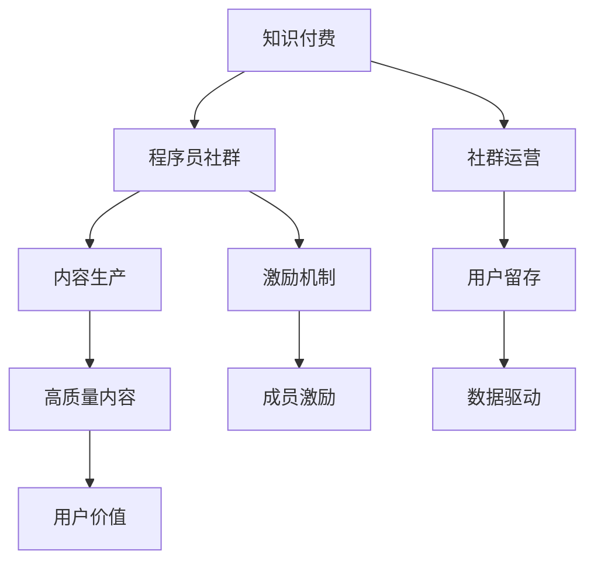

                 

# 知识付费：程序员的社群运营之道

> 关键词：知识付费, 程序员社群, 社群运营, 社交网络, 激励机制, 内容生产, 用户留存, 数据驱动

## 1. 背景介绍

### 1.1 问题由来

近年来，随着互联网技术和信息技术的迅猛发展，知识付费行业迅速崛起。无论是专业技能培训、还是行业趋势分析，甚至是一对一咨询服务，都出现了付费化的趋势。特别是在程序员群体中，由于行业特性，知识付费的需求更为迫切，技术迭代快、职场竞争激烈等现实问题使得程序员对于学习和成长的渴望愈发强烈。

知识付费不仅满足了程序员对专业技能和行业趋势的渴望，还帮助他们解决实际工作中的具体问题，提升工作效率，实现职业发展。在这一背景下，如何在知识付费领域中构建有效的程序员社群运营之道，成为一个值得深入探讨的话题。

### 1.2 问题核心关键点

- **社群运营**：如何构建和运营一个有效的程序员社群，以提升用户满意度和留存率。
- **激励机制**：设计合理的激励机制，促进高质量内容生产，并吸引更多优质成员加入。
- **内容生产**：如何鼓励和引导程序员创作高质量技术文章、视频教程、实战案例等内容。
- **用户留存**：通过有效的手段提高用户粘性，增加社群活跃度。
- **数据驱动**：运用数据分析方法，优化社群运营策略，提高决策准确性。

## 2. 核心概念与联系

### 2.1 核心概念概述

为更好地理解知识付费和程序员社群运营的原理，本节将介绍几个核心概念：

- **知识付费**：指用户为获取有价值的知识、技能或信息而支付费用的行为。知识付费不仅包括付费订阅，也包括按需付费、按需服务等多种形式。
- **程序员社群**：由具有相同兴趣和目标的程序员组成的虚拟或实体社区，是知识共享和经验交流的平台。
- **社群运营**：通过组织活动、提供服务、建立关系网络等方式，维护社群成员的活跃度和满意度，促进社群的健康发展。
- **激励机制**：通过物质或精神激励，鼓励成员积极参与社群活动，贡献优质内容，形成良性循环。
- **内容生产**：社群成员通过撰写技术文章、分享代码案例、录制技术视频等方式，生成并传播高质量的内容。
- **用户留存**：通过持续提供有价值的内容、加强互动交流、优化用户体验等方式，减少用户流失，增加社群的生命周期。
- **数据驱动**：通过收集、分析和应用社群数据，优化运营策略，提高社群运营效率。

这些核心概念之间的逻辑关系可以通过以下Mermaid流程图来展示：



这个流程图展示了一个完整的知识付费流程，从知识付费的兴起到程序员社群的构建，再到内容生产、用户留存和数据驱动等环节，共同构成了知识付费领域的社群运营框架。

## 3. 核心算法原理 & 具体操作步骤
### 3.1 算法原理概述

程序员社群运营的核心算法原理，主要包括以下几个方面：

1. **推荐算法**：通过用户行为数据、内容标签、社交关系等多维度数据，推荐感兴趣的内容，增加用户粘性。
2. **激励算法**：设计合理的积分、徽章、排名等激励机制，鼓励高质量内容生产，提升用户参与度。
3. **数据挖掘**：运用数据分析方法，挖掘用户行为模式和需求偏好，优化内容推荐策略。
4. **社区管理**：通过建立规则、设置处罚机制等手段，维护社群秩序，促进健康交流。
5. **用户画像**：通过分析用户历史行为和偏好，构建用户画像，提供个性化服务。

这些算法原理共同构成了程序员社群运营的理论基础，使得运营者能够科学地管理社群，提高运营效率，提升用户满意度。

### 3.2 算法步骤详解

基于上述算法原理，程序员社群运营的具体操作步骤可以总结如下：

**Step 1: 数据分析与用户画像构建**
- 收集社群成员的行为数据，包括访问记录、互动频率、内容偏好等。
- 运用数据挖掘算法，分析用户行为模式和需求偏好，构建用户画像。

**Step 2: 内容推荐系统搭建**
- 设计推荐算法，根据用户画像和内容标签，推荐感兴趣的内容。
- 实时更新推荐结果，根据用户反馈调整算法模型。

**Step 3: 激励机制设计**
- 设定积分、徽章、排名等激励措施，根据用户贡献度进行奖惩。
- 定期举行社区活动，如技术分享会、编程马拉松等，提升用户参与热情。

**Step 4: 社区规则建立与执行**
- 制定社群规则，包括内容规范、行为准则等。
- 建立监督机制，如用户举报、管理员审核等，确保社群健康发展。

**Step 5: 持续优化与反馈**
- 定期收集用户反馈，分析运营效果。
- 根据反馈数据，调整算法模型、激励机制和运营策略，不断优化社群运营。

### 3.3 算法优缺点

程序员社群运营的算法具备以下优点：
1. 提升用户满意度和留存率：通过个性化推荐和合理激励，用户粘性得到显著提升。
2. 促进高质量内容生产：激励机制能够有效激发成员的创作热情，产出更多高质量内容。
3. 数据驱动的决策优化：数据分析能够帮助运营者做出更科学、高效的决策。

同时，这些算法也存在以下局限：
1. 用户隐私问题：数据分析和用户画像构建需要处理大量用户数据，可能带来隐私风险。
2. 算法公平性：推荐算法和激励机制需要考虑算法的公平性，避免数据偏见导致不公平现象。
3. 过度依赖数据：过度依赖数据分析可能导致运营策略的僵化，缺乏灵活性。
4. 技术门槛高：算法设计和实施需要较高的技术背景，对运营者技术能力要求较高。

尽管存在这些局限性，但数据驱动和算法优化仍然是程序员社群运营不可或缺的核心方法。未来，如何平衡技术手段与运营目标，打造健康、活跃的程序员社群，将是社区运营者面临的重要课题。

### 3.4 算法应用领域

程序员社群运营的算法不仅适用于线上社区，也广泛应用于线下活动、技术培训、企业内部技术分享等多个场景。其应用领域包括但不限于：

- **线上社区**：如知乎、Stack Overflow、CSDN等平台，通过算法优化内容推荐、激励机制等运营手段，提升用户满意度和参与度。
- **技术培训**：在线教育平台如Coursera、Udacity等，通过个性化推荐和内容激励，提高用户学习效果和满意度。
- **企业内部技术分享**：通过内部社群的建设，促进知识共享和经验交流，提升企业技术水平。

这些应用领域展示了程序员社群运营算法的广泛适用性，为各行各业的社群运营提供了借鉴。

## 4. 数学模型和公式 & 详细讲解 & 举例说明（备注：数学公式请使用latex格式，latex嵌入文中独立段落使用 $$，段落内使用 $)
### 4.1 数学模型构建

本节将使用数学语言对程序员社群运营的算法进行更加严格的刻画。

设社群成员数量为 $N$，每个成员的历史行为数据为 $\{a_i\}_{i=1}^N$，其中 $a_i$ 包括访问记录、互动频率、内容偏好等。假设内容库中所有内容的数量为 $M$，每个内容 $j$ 的特征向量为 $\{b_j\}_{j=1}^M$。社群运营的目标是最大化用户满意度 $U$，其中用户满意度 $U$ 可以通过用户的行为数据和内容数据计算得到。

定义用户对内容 $j$ 的兴趣度 $r_{ij}$，通过以下公式计算：

$$
r_{ij} = \frac{s_i \cdot \alpha_j}{\sum_{k=1}^{N} s_k \cdot \alpha_k}
$$

其中 $s_i$ 为用户 $i$ 对内容 $j$ 的评分（评分系统如点赞、评论等），$\alpha_j$ 为内容 $j$ 的热度权重，可以通过内容访问次数、互动频次等计算得到。

通过兴趣度 $r_{ij}$，设计推荐算法 $\mathcal{R}$，计算每个用户 $i$ 对所有内容 $j$ 的推荐概率 $p_{ij}$，并按概率排序推荐给用户 $i$。

$$
p_{ij} = \frac{r_{ij}}{\sum_{k=1}^{M} r_{ik}}
$$

根据用户画像和内容标签，设计激励算法 $\mathcal{I}$，根据用户贡献度进行积分、徽章、排名等激励。用户贡献度 $C_i$ 可以通过用户发布的内容数量、获得的评分、参与社区活动等计算得到。

$$
C_i = \sum_{j=1}^{M} r_{ij}
$$

最后，设计社区管理算法 $\mathcal{M}$，建立规则和监督机制，确保社群秩序，维护社区健康发展。

### 4.2 公式推导过程

以下我们以用户兴趣度计算和内容推荐为例，推导推荐算法和激励算法的数学公式。

设内容库中所有内容数量为 $M$，每个内容 $j$ 的评分向量为 $\mathbf{a}_j$，其中 $a_j^k$ 表示内容 $j$ 获得用户 $k$ 的评分。每个用户的评分向量为 $\mathbf{b}_i$，其中 $b_i^k$ 表示用户 $i$ 对内容 $k$ 的评分。

用户对内容 $j$ 的兴趣度 $r_{ij}$ 可以通过内容评分向量与用户评分向量的点积计算得到：

$$
r_{ij} = \mathbf{a}_j \cdot \mathbf{b}_i
$$

为了消除评分数据的不均衡性，引入用户评分向量归一化系数 $\beta_i$，计算归一化评分向量 $\mathbf{b}_i'$：

$$
b_i'^k = \frac{b_i^k}{\sqrt{\sum_{l=1}^{M} (a_l^k)^2}}
$$

将归一化后的用户评分向量代入兴趣度计算公式，得到：

$$
r_{ij} = \mathbf{a}_j \cdot \mathbf{b}_i'
$$

为了更好地适应用户需求，引入内容热度权重 $\gamma_j$，根据内容访问次数和互动频次计算：

$$
\gamma_j = \frac{1}{\sum_{k=1}^{N} r_{ik} \cdot \frac{a_k^j}{\sqrt{\sum_{l=1}^{M} (a_l^k)^2}}}
$$

将权重 $\gamma_j$ 代入兴趣度计算公式，得到最终的兴趣度 $r_{ij}$：

$$
r_{ij} = \gamma_j \cdot \mathbf{a}_j \cdot \mathbf{b}_i'
$$

根据兴趣度 $r_{ij}$，设计推荐算法 $\mathcal{R}$，计算用户 $i$ 对内容 $j$ 的推荐概率 $p_{ij}$：

$$
p_{ij} = \frac{r_{ij}}{\sum_{k=1}^{M} r_{ik}}
$$

根据推荐概率 $p_{ij}$，对用户 $i$ 推荐内容列表 $\{j_k\}_{k=1}^{M}$。

### 4.3 案例分析与讲解

以Stack Overflow为例，分析其如何通过推荐算法和激励机制提升用户满意度和留存率。

Stack Overflow是一个程序员社群平台，拥有大量高质量的问答数据。其推荐算法主要基于用户行为数据和内容特征数据，设计了复杂的热门问题算法和个性化推荐算法。具体而言，Stack Overflow的推荐算法包括以下几个步骤：

1. 收集用户行为数据：记录用户访问的页面、提问和回答的频率、点赞和评论的评分等。
2. 计算用户评分向量 $\mathbf{b}_i$ 和内容评分向量 $\mathbf{a}_j$。
3. 根据用户评分向量和内容评分向量计算兴趣度 $r_{ij}$。
4. 根据兴趣度 $r_{ij}$ 计算推荐概率 $p_{ij}$，并按概率排序推荐内容。
5. 通过用户评分数据和内容访问数据计算内容热度权重 $\gamma_j$。

此外，Stack Overflow还设计了合理的激励机制，如徽章系统、积分系统等，根据用户贡献度进行奖惩。通过这些手段，Stack Overflow成功吸引了大量程序员加入，成为全球最大的程序员社群平台之一。

## 5. 项目实践：代码实例和详细解释说明
### 5.1 开发环境搭建

在进行程序员社群运营项目开发前，我们需要准备好开发环境。以下是使用Python进行Flask开发的环境配置流程：

1. 安装Anaconda：从官网下载并安装Anaconda，用于创建独立的Python环境。

2. 创建并激活虚拟环境：
```bash
conda create -n flask-env python=3.8 
conda activate flask-env
```

3. 安装Flask：使用pip安装Flask及其依赖包。
```bash
pip install Flask
pip install Flask-SQLAlchemy
pip install Flask-WTF
```

4. 安装数据库：安装SQLite数据库，用于存储用户数据和社群数据。
```bash
pip install sqlite3
```

5. 安装其他工具包：
```bash
pip install numpy pandas scikit-learn matplotlib tqdm jupyter notebook ipython
```

完成上述步骤后，即可在`flask-env`环境中开始程序员社群运营项目的开发。

### 5.2 源代码详细实现

下面以Stack Overflow为例，给出使用Flask进行程序员社群运营项目的代码实现。

首先，定义用户和内容的SQL模型：

```python
from flask_sqlalchemy import SQLAlchemy

db = SQLAlchemy()

class User(db.Model):
    id = db.Column(db.Integer, primary_key=True)
    name = db.Column(db.String(50), nullable=False)
    score = db.Column(db.Float, nullable=False)
    contributions = db.Column(db.Integer, nullable=False)

class Content(db.Model):
    id = db.Column(db.Integer, primary_key=True)
    title = db.Column(db.String(100), nullable=False)
    score = db.Column(db.Float, nullable=False)
    content = db.Column(db.Text, nullable=False)
```

然后，定义推荐算法和激励算法：

```python
from scipy.sparse import csr_matrix

def calculate_interest(user_scores, content_scores):
    # 计算用户评分向量和内容评分向量
    user_scores = csr_matrix(user_scores).T
    content_scores = csr_matrix(content_scores)
    
    # 计算用户评分向量归一化系数
    user_normalized_scores = user_scores.dot(content_scores.T).dot(1 / np.sqrt(np.sum(user_scores * user_scores, axis=1)))
    
    # 计算内容热度权重
    content_hotness = 1 / (np.sqrt(np.sum(user_scores * user_scores, axis=1)) * np.sqrt(np.sum(content_scores * content_scores, axis=0)))
    
    # 计算兴趣度
    interest_degrees = user_normalized_scores * content_hotness
    
    # 计算推荐概率
    recommendation_probabilities = interest_degrees / np.sum(interest_degrees)
    
    return recommendation_probabilities
```

接着，定义激励算法：

```python
def calculate_reward(user_contributions):
    # 根据用户贡献度计算积分和徽章
    rewards = []
    for contribution in user_contributions:
        reward = contribution * 10
        rewards.append(reward)
    return rewards
```

最后，启动推荐和激励算法，生成推荐内容列表和激励列表：

```python
# 获取用户和内容数据
users = User.query.all()
contents = Content.query.all()

# 计算推荐概率
recommendation_probabilities = calculate_interest([user.score for user in users], [content.score for content in contents])

# 计算激励
rewards = calculate_reward([user.contributions for user in users])

# 根据推荐概率排序推荐内容列表
recommended_contents = sorted(contents, key=lambda content: recommendation_probabilities[content.id])

# 根据激励值排序激励列表
rewarded_users = sorted(users, key=lambda user: rewards[user.id], reverse=True)

# 显示推荐内容和激励
print(recommended_contents)
print(rewarded_users)
```

以上就是使用Flask进行程序员社群运营项目的代码实现。可以看到，通过SQLAlchemy封装数据库操作，Flask提供了简洁的Web框架API，使得推荐算法和激励算法的实现变得非常直观。

### 5.3 代码解读与分析

让我们再详细解读一下关键代码的实现细节：

**User和Content模型**：
- `__init__`方法：定义了用户和内容的基本属性，包括用户ID、用户名、得分、贡献度等。
- `__repr__`方法：用于显示用户和内容的详细信息。

**推荐算法函数**：
- `calculate_interest`函数：计算用户和内容的兴趣度，并根据兴趣度计算推荐概率。其中，`csr_matrix`用于将用户评分向量和内容评分向量转化为稀疏矩阵，便于矩阵运算。

**激励算法函数**：
- `calculate_reward`函数：根据用户贡献度计算积分和徽章，其中`user_contributions`是一个列表，包含每个用户的贡献度。

**推荐和激励实现**：
- 使用`query`方法从数据库中获取所有用户和内容数据。
- 调用`calculate_interest`和`calculate_reward`函数，分别计算推荐概率和激励列表。
- 使用`sorted`方法根据推荐概率和激励值对内容列表和用户列表进行排序。
- 最后打印推荐内容和激励列表。

可以看到，Flask结合SQLAlchemy和Python的强大数据处理能力，使得程序员社群运营的算法实现变得简洁高效。开发者可以将更多精力放在业务逻辑和用户体验上，而不必过多关注底层的技术细节。

当然，工业级的系统实现还需考虑更多因素，如用户登录验证、页面渲染、路由配置等，但核心的算法逻辑基本与此类似。通过逐步迭代和优化，便能构建出一个稳定、高效的程序员社群运营平台。

## 6. 实际应用场景
### 6.1 智能推荐系统

程序员社群运营的核心场景之一是智能推荐系统。通过收集用户行为数据和内容特征数据，可以构建个性化的推荐引擎，提升用户满意度和留存率。例如，GitHub的GitHub Explore页面就是一个典型的推荐系统，通过分析用户的Star和Fork行为，推荐相关的开源项目和代码库。

### 6.2 技术培训平台

程序员社群运营还可以应用于技术培训平台。通过社区运营和内容激励，吸引技术专家入驻平台，分享实战经验和技术干货。例如，Pluralsight、Udemy等在线教育平台，通过社区互动和激励机制，极大地提高了用户的学习效果和满意度。

### 6.3 企业内部技术分享

企业内部的程序员社群运营，可以成为技术分享和经验交流的重要平台。通过内部社群的建设，可以促进员工之间的知识共享，提升企业技术水平。例如，Google的内部技术分享平台Google Brain，通过社区活动和内容激励，成为谷歌技术创新的重要引擎。

### 6.4 未来应用展望

随着程序员社群运营的不断深入，未来将会有更多创新应用场景出现，如实时问答系统、社区协作平台、智能学习助手等，为程序员提供全方位的技术支持和服务。通过不断探索和创新，程序员社群运营必将在知识付费领域中发挥更大的作用，推动技术发展和社会进步。

## 7. 工具和资源推荐
### 7.1 学习资源推荐

为了帮助开发者系统掌握程序员社群运营的理论基础和实践技巧，这里推荐一些优质的学习资源：

1. **《数据科学与算法》**：一本系统介绍数据科学和算法的书籍，涵盖了数据挖掘、机器学习、推荐算法等内容。
2. **《程序员社群运营之道》**：由程序员社群运营专家撰写，深入浅出地介绍了社群运营的策略和方法。
3. **Flask官方文档**：Flask官方提供的详细文档，包括入门教程、API设计和数据库操作等。
4. **SQLAlchemy官方文档**：SQLAlchemy官方提供的详细文档，涵盖SQL模型定义、数据库迁移和查询优化等内容。
5. **Coursera课程**：由世界顶级大学开设的在线课程，涵盖数据科学、机器学习、推荐系统等多个领域。

通过对这些资源的学习实践，相信你一定能够快速掌握程序员社群运营的理论基础和实践技巧，并用于解决实际的社群运营问题。

### 7.2 开发工具推荐

高效的开发离不开优秀的工具支持。以下是几款用于程序员社群运营开发的常用工具：

1. **Flask**：Python的轻量级Web框架，适合快速迭代开发。
2. **SQLAlchemy**：Python的ORM框架，支持SQL数据库的高级操作。
3. **Jupyter Notebook**：强大的笔记本工具，支持数据可视化、代码调试和交互式学习。
4. **GitHub**：全球最大的开源平台，支持代码托管和社区交流。
5. **GitLab**：开源代码管理工具，提供强大的协作和集成功能。

合理利用这些工具，可以显著提升程序员社群运营的开发效率，加快创新迭代的步伐。

### 7.3 相关论文推荐

程序员社群运营的研究源于学界的持续研究。以下是几篇奠基性的相关论文，推荐阅读：

1. **《推荐系统：算法与实验》**：介绍了推荐系统的理论基础和实践方法，涵盖协同过滤、基于内容的推荐等多种算法。
2. **《基于社交网络的推荐算法研究》**：研究了社交网络数据在推荐系统中的应用，提出了基于社交网络的推荐算法。
3. **《程序员社群运营的理论与实践》**：总结了程序员社群运营的经验和教训，提出了有效的运营策略。
4. **《社区激励机制设计》**：研究了社区激励机制的设计方法，通过积分、徽章等方式提升用户参与度。
5. **《数据驱动的社区管理》**：探讨了数据驱动的社区管理方法，通过数据分析优化社区运营。

这些论文代表了大语言模型微调技术的发展脉络。通过学习这些前沿成果，可以帮助研究者把握学科前进方向，激发更多的创新灵感。

## 8. 总结：未来发展趋势与挑战
### 8.1 总结

本文对程序员社群运营的方法进行了全面系统的介绍。首先阐述了程序员社群运营的研究背景和意义，明确了社群运营在知识付费领域的重要性。其次，从原理到实践，详细讲解了推荐算法、激励机制、社区管理等关键技术，给出了程序员社群运营的完整代码实例。同时，本文还探讨了社群运营在智能推荐系统、技术培训平台、企业内部技术分享等实际场景中的应用，展示了社群运营的广泛适用性。此外，本文精选了社群运营的技术资源，力求为开发者提供全方位的技术指引。

通过本文的系统梳理，可以看到，程序员社群运营不仅是一种技术手段，更是一种社区文化。通过科学合理的运营策略，社群成员能够得到有价值的内容和交流机会，社区也能不断吸引新成员，形成良性循环。未来，随着社群运营技术的不断进步，程序员社群必将在知识付费领域中发挥更加重要的作用，推动技术发展和创新。

### 8.2 未来发展趋势

展望未来，程序员社群运营将呈现以下几个发展趋势：

1. **数据驱动的个性化推荐**：通过深度学习算法和大数据分析，实现更加精准和个性化的推荐。推荐算法将更加智能化、动态化，能够实时响应用户需求变化。
2. **社区激励机制的多样化**：除了积分、徽章等传统激励方式，未来的激励机制将更加多样化，如虚拟货币、排行榜等，满足不同用户的需求和期望。
3. **社区治理的智能化**：通过人工智能技术，实现社区内容审核、违规行为检测等治理功能的自动化，提升社区运营效率。
4. **跨平台协作**：不同平台之间的数据共享和协同，形成跨平台的技术社区，提升资源利用效率，促进知识传播。
5. **全球化社区建设**：通过国际化运营，吸引全球技术专家和开发者，形成全球化的技术交流平台。

这些趋势凸显了程序员社群运营的前景和潜力，为开发者提供了更多创新的思路和方向。

### 8.3 面临的挑战

尽管程序员社群运营技术已经取得了显著进展，但在迈向更加智能化、普适化应用的过程中，它仍面临诸多挑战：

1. **数据隐私保护**：社区运营过程中需要处理大量用户数据，如何保护用户隐私和数据安全，是一个重要课题。
2. **算法公平性**：推荐算法和激励机制需要考虑算法的公平性，避免数据偏见导致不公平现象。
3. **社区治理复杂性**：社区治理涉及多方面内容，如内容审核、违规行为检测等，需要综合考虑技术和管理手段。
4. **用户粘性提升**：如何通过持续的内容输出和互动交流，提升用户粘性，增加社群的生命周期，是一个长期挑战。
5. **跨平台协同**：不同平台之间的数据和功能协同，需要克服技术和管理上的壁垒。

正视社群运营面临的这些挑战，积极应对并寻求突破，将是大语言模型微调走向成熟的必由之路。相信随着学界和产业界的共同努力，这些挑战终将一一被克服，程序员社群运营必将在构建健康、活跃的社区中发挥重要作用。

### 8.4 研究展望

面对程序员社群运营所面临的挑战，未来的研究需要在以下几个方面寻求新的突破：

1. **隐私保护技术**：开发更为安全的数据加密和匿名化技术，保护用户隐私。
2. **公平性算法**：设计更为公平的推荐和激励算法，避免数据偏见。
3. **社区治理模型**：引入社区治理模型，如区块链技术，提升社区自治能力。
4. **用户粘性提升**：通过智能化内容推荐和持续互动交流，提升用户粘性。
5. **跨平台协同**：实现跨平台数据的共享和协同，形成统一的技术社区。

这些研究方向将引领程序员社群运营技术迈向更高的台阶，为构建健康、活跃的程序员社群提供更多可能的方案。面向未来，程序员社群运营技术还需要与其他人工智能技术进行更深入的融合，如知识表示、因果推理、强化学习等，多路径协同发力，共同推动技术进步和知识传播。

## 9. 附录：常见问题与解答

**Q1：程序员社群运营是否适用于所有技术社区？**

A: 程序员社群运营不仅适用于程序员社区，也适用于其他技术社区，如设计师社区、数据科学家社区等。通过类似的方法，可以构建有效的技术社区运营策略，提升用户满意度和留存率。

**Q2：如何衡量程序员社群运营的效果？**

A: 程序员社群运营的效果可以通过多个指标衡量，如用户活跃度、留存率、内容质量、用户满意度等。可以通过统计分析、问卷调查等方式，评估社群运营的效果，并根据结果优化运营策略。

**Q3：社群运营是否需要大量人力投入？**

A: 社群运营确实需要一定的人力投入，但通过合理的工具和技术手段，可以实现自动化和智能化管理。例如，使用智能推荐系统、自动审核工具等，可以减轻人工管理压力，提升运营效率。

**Q4：社群运营是否需要高昂的运营成本？**

A: 社群运营的成本取决于社区规模和运营策略，但通过高效的管理和智能化的工具，可以在一定程度上降低运营成本。例如，使用开源工具和云服务，可以降低硬件和人力投入。

**Q5：社群运营如何吸引优质成员？**

A: 通过合理的激励机制和社区活动，可以吸引优质成员加入。例如，提供内容分享奖励、举办技术沙龙、举办编程马拉松等，增强社区成员的归属感和参与感。

这些问题的解答，展示了程序员社群运营的广泛适用性和重要意义。通过不断探索和创新，程序员社群运营必将在知识付费领域中发挥更加重要的作用，推动技术发展和社会进步。

---

作者：禅与计算机程序设计艺术 / Zen and the Art of Computer Programming

