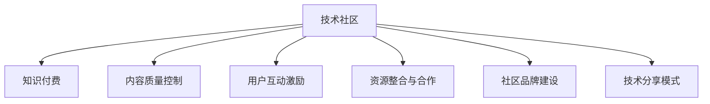

                 

# 知识付费：程序员的社群运营技巧

> 关键词：知识付费,程序员,社群运营,技术分享,社区管理

## 1. 背景介绍

### 1.1 问题由来

随着互联网的普及和技术的不断发展，越来越多的开发者开始将自己的知识和经验分享到网络上，形成了庞大的技术社区和知识付费市场。程序员社群运营作为其中的一环，对于提升技术社区的质量、吸引更多高质量内容创作者和保持社区活跃度具有重要意义。本文将深入探讨程序员的社群运营技巧，希望能帮助广大开发者构建一个健康、活跃、富有价值的技术社区。

### 1.2 问题核心关键点

当前，程序员社群运营的关键点主要集中在以下几个方面：

- **内容质量控制**：如何保证社群中的技术文章和项目质量，避免低质量内容对社群的负面影响。
- **用户互动激励**：如何通过合理机制激励用户积极参与内容分享和互动，提升社群活跃度。
- **资源整合与合作**：如何整合和利用外部资源，加强与技术社区、企业、开发者之间的合作。
- **社区品牌建设**：如何打造独特的社区品牌，吸引更多优质内容创作者和用户加入。
- **技术分享模式**：如何设计合适的技术分享模式，促进知识的传播和积累。

针对这些关键点，本文将详细分析当前的程序员社群运营技巧，并给出具体的实践建议。

### 1.3 问题研究意义

对于程序员社群运营的研究，具有以下几方面的重要意义：

- **提高社区价值**：通过有效的运营策略，提升社群中的内容质量和用户互动水平，使得社区能为广大开发者提供更多价值。
- **优化技术生态**：帮助技术社区、企业、开发者之间建立起有效的沟通和协作机制，促进技术生态的健康发展。
- **加速知识传播**：通过合理的技术分享模式，加速知识的传播和积累，提升技术社区的活力和影响力。
- **促进职业发展**：为开发者提供更丰富的技术交流和学习资源，帮助其提升技能，拓展职业道路。

本文旨在通过对程序员社群运营技巧的深入探讨，为广大开发者提供系统的指导，共同提升程序员社群的运营质量。

## 2. 核心概念与联系

### 2.1 核心概念概述

为更好地理解程序员社群运营的技巧，我们需要先了解几个核心概念：

- **技术社区**：指由开发者共同构建的技术交流平台，包括在线论坛、博客、代码仓库等。
- **知识付费**：指将知识内容或技术经验通过付费方式进行传播和交易，以获取更高质量的内容和更深度交流的机制。
- **内容质量控制**：指通过严格的审核机制，保证社群中的内容质量，避免低质量内容对社区的影响。
- **用户互动激励**：指通过各种机制，如积分系统、排行榜、荣誉证书等，激励用户积极参与内容分享和互动。
- **资源整合与合作**：指通过外部资源整合和合作，如企业赞助、技术会议、技术博客等，提升社群的知名度和影响力。
- **社区品牌建设**：指通过独特的社区品牌设计，吸引更多高质量内容创作者和用户加入社群。
- **技术分享模式**：指通过多种形式的技术分享，如技术讲座、代码审查、技术博客等，促进知识的传播和积累。

这些核心概念之间的逻辑关系可以通过以下Mermaid流程图来展示：



这个流程图展示了一个典型的程序员社群运营框架，包括技术社区建设、知识付费机制、内容质量控制、用户互动激励、资源整合与合作、社区品牌建设和技术分享模式等关键环节。通过理解这些核心概念，我们可以更好地把握程序员社群运营的各个方面。

## 3. 核心算法原理 & 具体操作步骤
### 3.1 算法原理概述

程序员社群运营的核心在于通过合理的运营策略，提升社群的质量、活跃度和影响力。其核心算法原理包括以下几个方面：

1. **内容质量控制**：通过严格的内容审核机制，保证社群中的技术文章和项目质量，避免低质量内容对社群的负面影响。
2. **用户互动激励**：通过各种机制，如积分系统、排行榜、荣誉证书等，激励用户积极参与内容分享和互动，提升社群活跃度。
3. **资源整合与合作**：通过外部资源整合和合作，如企业赞助、技术会议、技术博客等，提升社群的知名度和影响力。
4. **社区品牌建设**：通过独特的社区品牌设计，吸引更多高质量内容创作者和用户加入社群。
5. **技术分享模式**：通过多种形式的技术分享，如技术讲座、代码审查、技术博客等，促进知识的传播和积累。

### 3.2 算法步骤详解

基于上述核心算法原理，程序员社群运营的具体操作步骤可以分为以下几个阶段：

**第一步：搭建技术社区**

- 确定社区的目标定位、受众群体、内容类型等基础信息。
- 选择合适的技术社区平台，如GitHub、Stack Overflow、知乎等。
- 进行平台配置，包括域名、主题、自定义页面等。

**第二步：建立内容质量控制机制**

- 设计内容审核流程，明确内容发布标准。
- 招募技术专家作为审核团队，确保审核的公正性和专业性。
- 定期对社区内容进行审核，清理低质量内容。

**第三步：引入知识付费机制**

- 设计知识付费模式，如订阅、单次付费、专栏等。
- 引入付费机制，如AdSense广告、付费文章、打赏等。
- 明确知识付费收益分配，如作者分成、平台分成等。

**第四步：激励用户互动**

- 设计用户互动激励机制，如积分系统、排行榜、荣誉证书等。
- 定期举办技术分享活动，如技术讲座、代码审查、技术博客等。
- 建立用户反馈机制，及时响应用户需求和建议。

**第五步：整合外部资源**

- 与技术社区、企业、开发者进行合作，如技术会议、技术博客、企业赞助等。
- 引入外部专家和技术资源，提升社群的技术水平和知名度。

**第六步：品牌建设**

- 设计独特的社区品牌标识、口号、视觉风格等。
- 通过各种渠道宣传社区品牌，如社交媒体、技术博客、技术会议等。
- 积极参与行业内的技术交流和合作，提升社区的影响力。

**第七步：技术分享模式**

- 设计多种形式的技术分享，如技术讲座、代码审查、技术博客等。
- 组织技术分享活动，吸引开发者参与和分享。
- 建立技术分享平台，方便开发者展示和交流技术经验。

### 3.3 算法优缺点

基于上述核心算法原理和操作步骤，程序员社群运营的优点和缺点如下：

**优点：**

1. **提升技术社区质量**：通过内容质量控制，保证社群中的技术文章和项目质量，避免低质量内容对社群的负面影响。
2. **增强用户互动**：通过用户互动激励机制，激励用户积极参与内容分享和互动，提升社群活跃度。
3. **提升社区知名度和影响力**：通过资源整合与合作，提升社群的知名度和影响力。
4. **吸引高质量内容创作者**：通过社区品牌建设，吸引更多高质量内容创作者和用户加入社群。
5. **促进知识传播**：通过多种形式的技术分享，促进知识的传播和积累。

**缺点：**

1. **运营成本高**：社群运营需要投入大量的时间和资源，包括内容审核、用户互动激励、资源整合等。
2. **用户流失风险**：如果运营不当，可能会引发用户的不满和流失。
3. **内容审核难度大**：确保内容质量需要耗费大量时间和精力，尤其是面对大量用户提交的内容时。

### 3.4 算法应用领域

基于上述核心算法原理和操作步骤，程序员社群运营主要应用于以下几个领域：

1. **在线技术社区**：如GitHub、Stack Overflow、知乎等，通过内容质量控制、用户互动激励、资源整合与合作、品牌建设和技术分享模式等，提升社区的活跃度和影响力。
2. **企业内技术平台**：如企业内部技术论坛、技术博客等，通过知识付费机制、用户互动激励、品牌建设和技术分享模式等，促进内部技术交流和知识传播。
3. **技术博客平台**：如博客园、CSDN等，通过内容质量控制、用户互动激励、品牌建设和技术分享模式等，提升博客平台的活跃度和影响力。
4. **开源项目平台**：如GitHub、Bitbucket等，通过内容质量控制、用户互动激励、资源整合与合作、品牌建设和技术分享模式等，提升开源项目的知名度和影响力。

## 4. 数学模型和公式 & 详细讲解 & 举例说明
### 4.1 数学模型构建

在进行程序员社群运营时，我们通常会涉及一些数学模型和公式，以辅助我们进行分析和决策。下面我们将详细介绍几个常见的数学模型。

**用户互动激励模型**

用户互动激励机制通常涉及积分系统、排行榜、荣誉证书等。以积分系统为例，其数学模型可以表示为：

$$
I_{i,t} = I_{i,t-1} + \alpha P_i(t)
$$

其中，$I_{i,t}$ 表示用户 $i$ 在第 $t$ 次互动后获得的积分，$\alpha$ 表示每次互动获得的积分数量，$P_i(t)$ 表示用户 $i$ 在第 $t$ 次互动中的贡献度。

**内容质量控制模型**

内容质量控制通常涉及内容审核流程和标准。假设每个内容的质量得分 $Q_i$ 为 $q_i$，平均质量得分 $\mu_q$ 为 $\mu$，标准差 $\sigma_q$ 为 $\sigma$，内容审核流程可以表示为：

$$
Q_i = \frac{q_i - \mu_q}{\sigma_q}
$$

其中，$q_i$ 为内容 $i$ 的质量得分，$\mu_q$ 为平均质量得分，$\sigma_q$ 为标准差。

**资源整合与合作模型**

资源整合与合作通常涉及企业赞助、技术会议、技术博客等。以企业赞助为例，其数学模型可以表示为：

$$
E_{i,t} = E_{i,t-1} + \beta R_i(t)
$$

其中，$E_{i,t}$ 表示在第 $t$ 次合作后社群获得的收益，$\beta$ 表示每次合作带来的收益，$R_i(t)$ 表示第 $i$ 次合作带来的收益。

**品牌建设模型**

社区品牌建设通常涉及品牌标识、口号、视觉风格等。以品牌标识为例，其数学模型可以表示为：

$$
B_t = \frac{B_{t-1} + \gamma P_B(t)}{1-\gamma}
$$

其中，$B_t$ 表示在第 $t$ 次品牌建设后的品牌价值，$\gamma$ 表示每次品牌建设的边际影响，$P_B(t)$ 表示第 $t$ 次品牌建设的贡献度。

### 4.2 公式推导过程

在上述数学模型中，我们将详细介绍几个关键公式的推导过程。

**用户互动激励公式推导**

假设用户 $i$ 在第 $t$ 次互动后获得的积分为 $I_{i,t}$，每次互动获得的积分为 $\alpha$，则用户互动激励模型可以表示为：

$$
I_{i,t} = I_{i,t-1} + \alpha P_i(t)
$$

其中，$P_i(t)$ 表示用户 $i$ 在第 $t$ 次互动中的贡献度。贡献度可以表示为用户发布的内容数量、互动次数、回答质量等。

**内容质量控制公式推导**

假设每个内容的质量得分为 $Q_i$，平均质量得分为 $\mu_q$，标准差为 $\sigma_q$，内容审核流程可以表示为：

$$
Q_i = \frac{q_i - \mu_q}{\sigma_q}
$$

其中，$q_i$ 为内容 $i$ 的质量得分，$\mu_q$ 为平均质量得分，$\sigma_q$ 为标准差。

**资源整合与合作公式推导**

假设社群在第 $t$ 次合作后获得的收益为 $E_{i,t}$，每次合作带来的收益为 $\beta$，第 $i$ 次合作带来的收益为 $R_i(t)$，则资源整合与合作模型可以表示为：

$$
E_{i,t} = E_{i,t-1} + \beta R_i(t)
$$

其中，$R_i(t)$ 表示第 $i$ 次合作带来的收益。

**品牌建设公式推导**

假设社区品牌价值在第 $t$ 次品牌建设后的值为 $B_t$，每次品牌建设的边际影响为 $\gamma$，第 $t$ 次品牌建设的贡献度为 $P_B(t)$，则品牌建设模型可以表示为：

$$
B_t = \frac{B_{t-1} + \gamma P_B(t)}{1-\gamma}
$$

其中，$P_B(t)$ 表示第 $t$ 次品牌建设的贡献度。

### 4.3 案例分析与讲解

以一个具体的程序员社群为例，我们将详细介绍其运营过程和相关数学模型的应用。

**案例背景**

某程序员社区为了提升其活跃度和影响力，引入知识付费机制，并进行品牌建设和技术分享。假设社区有1000名用户，每次互动获得的积分为5，每次合作带来的收益为100，每次品牌建设的边际影响为0.1。

**用户互动激励**

用户在社区内发布一篇技术文章可以获得5积分，每次互动（如点赞、评论、分享等）获得2积分。社区内共有500篇文章，平均每篇文章获得1000次互动。

根据用户互动激励模型，用户 $i$ 在第 $t$ 次互动后获得的积分为：

$$
I_{i,t} = I_{i,t-1} + \alpha P_i(t)
$$

其中，$\alpha = 2$，$P_i(t)$ 为每次互动的贡献度。假设用户 $i$ 在第 $t$ 次互动后获得2积分，则用户 $i$ 在第 $t$ 次互动后获得的积分为：

$$
I_{i,t} = I_{i,t-1} + 2 \times P_i(t)
$$

社区总积分为：

$$
\sum_{i=1}^{1000} I_{i,t} = \sum_{i=1}^{1000} I_{i,t-1} + 2 \times \sum_{i=1}^{1000} P_i(t)
$$

社区总积分为：

$$
\sum_{i=1}^{1000} I_{i,t} = \sum_{i=1}^{1000} I_{i,t-1} + 2 \times 500 \times 1000 = 500000
$$

**内容质量控制**

假设每篇文章的质量得分为1，平均质量得分为0.5，标准差为0.2。社区共有500篇文章，每次审核后文章质量得分提高0.1。

根据内容质量控制模型，每篇文章的质量得分为：

$$
Q_i = \frac{q_i - \mu_q}{\sigma_q} = \frac{1 - 0.5}{0.2} = -2.5
$$

社区总质量得分为：

$$
\sum_{i=1}^{500} Q_i = \sum_{i=1}^{500} \frac{q_i - \mu_q}{\sigma_q} = 500 \times -2.5 = -1250
$$

**资源整合与合作**

社区与某知名企业合作，每次合作带来100收益。社区每季度与企业合作一次，共合作4次。

根据资源整合与合作模型，社区每次合作后获得的收益为：

$$
E_{i,t} = E_{i,t-1} + \beta R_i(t)
$$

其中，$\beta = 100$，$R_i(t)$ 为每次合作的收益。假设每次合作收益为100，则社区总收益为：

$$
\sum_{i=1}^{4} E_{i,t} = \sum_{i=1}^{4} E_{i,t-1} + 100 \times 4 = 500
$$

**品牌建设**

社区品牌价值每次提升0.1。社区每季度进行一次品牌建设，共进行4次。

根据品牌建设模型，社区品牌价值为：

$$
B_t = \frac{B_{t-1} + \gamma P_B(t)}{1-\gamma} = \frac{B_{t-1} + 0.1 \times 4}{1-0.1} = B_{t-1} + 0.4
$$

社区总品牌价值为：

$$
B_t = B_{t-1} + 0.4
$$

社区总品牌价值为：

$$
B_4 = B_0 + 0.4 \times 4 = B_0 + 1.6
$$

通过上述案例，我们可以看到，通过合理的运营策略，社区可以实现用户互动激励、内容质量控制、资源整合与合作、品牌建设和技术分享等多方面的提升，进一步提升社区的活跃度和影响力。

## 5. 项目实践：代码实例和详细解释说明
### 5.1 开发环境搭建

在进行程序员社群运营的实践时，我们需要准备好开发环境。以下是使用Python进行Django开发的环境配置流程：

1. 安装Anaconda：从官网下载并安装Anaconda，用于创建独立的Python环境。

2. 创建并激活虚拟环境：
```bash
conda create -n django-env python=3.8 
conda activate django-env
```

3. 安装Django：
```bash
pip install django
```

4. 安装其他开发工具：
```bash
pip install numpy pandas scikit-learn matplotlib tqdm jupyter notebook ipython
```

完成上述步骤后，即可在`django-env`环境中开始程序员社群运营的开发实践。

### 5.2 源代码详细实现

下面我们以程序员社群的互动激励系统为例，给出使用Django开发互动激励系统的PyTorch代码实现。

首先，定义用户模型：

```python
from django.contrib.auth.models import User
from django.db import models

class Profile(models.Model):
    user = models.OneToOneField(User, on_delete=models.CASCADE)
    experience = models.IntegerField(default=0)
    points = models.IntegerField(default=0)
```

然后，定义积分逻辑：

```python
from django.db import models
from django.contrib.auth.models import User

class Profile(models.Model):
    user = models.OneToOneField(User, on_delete=models.CASCADE)
    experience = models.IntegerField(default=0)
    points = models.IntegerField(default=0)

    def earn_points(self, action):
        if action == "post":
            self.points += 5
        elif action == "comment":
            self.points += 2
        elif action == "like":
            self.points += 1

        self.save()

    def get_total_points(self):
        return self.points
```

接着，定义积分视图：

```python
from django.shortcuts import render, redirect
from django.contrib.auth.decorators import login_required
from .models import Profile

@login_required
def point_earn(request):
    profile = Profile.objects.get(user=request.user)

    if request.method == 'POST':
        action = request.POST.get('action')
        profile.earn_points(action)
        return redirect('point_list')

    return render(request, 'point_list.html', {'profile': profile})
```

最后，定义积分列表页：

```python
from django.shortcuts import render, redirect
from django.contrib.auth.decorators import login_required
from .models import Profile

@login_required
def point_list(request):
    profile = Profile.objects.get(user=request.user)
    return render(request, 'point_list.html', {'profile': profile})
```

### 5.3 代码解读与分析

让我们再详细解读一下关键代码的实现细节：

**用户模型**：
- `Profile` 模型：继承自 Django 的 `User` 模型，增加 `experience` 和 `points` 两个字段，分别表示用户的经验和积分。

**积分逻辑**：
- `earn_points` 方法：根据用户行为，更新用户的积分。
- `get_total_points` 方法：获取用户的总积分。

**积分视图**：
- `point_earn` 视图：处理用户的积分行为，根据不同的操作（如发表文章、评论、点赞等）更新用户的积分。
- `point_list` 视图：显示用户的积分列表。

**积分列表页**：
- 在模板 `point_list.html` 中，展示用户的积分列表和积分行为。

可以看到，通过上述代码，我们可以实现一个简单的互动激励系统，通过积分机制激励用户积极参与内容分享和互动，提升社群的活跃度。

当然，工业级的系统实现还需考虑更多因素，如积分系统的持久化、用户权限管理、积分有效期等。但核心的互动激励逻辑基本与此类似。

## 6. 实际应用场景
### 6.1 智能客服系统

程序员社群运营中的互动激励机制可以应用于智能客服系统，提升客服服务的质量和效率。

传统客服往往需要配备大量人力，高峰期响应缓慢，且一致性和专业性难以保证。而使用互动激励机制的智能客服系统，可以通过积分、排名等方式激励客服积极响应客户咨询，快速解答客户问题，提高客服服务的质量和效率。

### 6.2 金融舆情监测

程序员社群运营中的内容质量控制机制可以应用于金融舆情监测，提升舆情分析的准确性和时效性。

金融机构需要实时监测市场舆论动向，以便及时应对负面信息传播，规避金融风险。传统的人工监测方式成本高、效率低，难以应对网络时代海量信息爆发的挑战。通过内容质量控制机制，将社区中的高质量技术文章和项目应用于舆情分析，可以显著提升舆情分析的准确性和时效性。

### 6.3 个性化推荐系统

程序员社群运营中的资源整合与合作机制可以应用于个性化推荐系统，提升推荐结果的相关性和多样性。

当前的推荐系统往往只依赖用户的历史行为数据进行物品推荐，无法深入理解用户的真实兴趣偏好。通过资源整合与合作机制，整合和利用外部资源，如技术会议、技术博客等，提升推荐系统的内容质量和多样性，从而提供更精准、多样的推荐内容。

### 6.4 未来应用展望

随着程序员社群运营技术的不断发展，未来在更多领域将得到应用，为技术社区带来变革性影响。

在智慧医疗领域，基于互动激励机制的医疗问答、病历分析、药物研发等应用将提升医疗服务的智能化水平，辅助医生诊疗，加速新药开发进程。

在智能教育领域，互动激励机制可应用于作业批改、学情分析、知识推荐等方面，因材施教，促进教育公平，提高教学质量。

在智慧城市治理中，互动激励机制可应用于城市事件监测、舆情分析、应急指挥等环节，提高城市管理的自动化和智能化水平，构建更安全、高效的未来城市。

此外，在企业生产、社会治理、文娱传媒等众多领域，基于程序员社群运营的人工智能应用也将不断涌现，为经济社会发展注入新的动力。相信随着技术的日益成熟，程序员社群运营必将在构建人机协同的智能时代中扮演越来越重要的角色。

## 7. 工具和资源推荐
### 7.1 学习资源推荐

为了帮助开发者系统掌握程序员社群运营的理论基础和实践技巧，这里推荐一些优质的学习资源：

1. 《社区运营的艺术》系列博文：由社区运营专家撰写，深入浅出地介绍了社区运营的基本概念和实践技巧。

2. 《社区管理实战》课程：由社区管理大师讲授，涵盖社区管理的基本流程和实践技巧，适合社区运营初学者。

3. 《社区运营指南》书籍：全面介绍了社区运营的各个环节，包括内容质量控制、用户互动激励、资源整合与合作等，适合社区运营从业者。

4. Django官方文档：Django的官方文档，提供了丰富的社区运营开发资源，适合开发实践。

5. Weights & Biases：模型训练的实验跟踪工具，可以记录和可视化社区运营的各项指标，方便对比和调优。

通过学习这些资源，相信你一定能够快速掌握程序员社群运营的精髓，并用于解决实际的社区运营问题。
###  7.2 开发工具推荐

高效的开发离不开优秀的工具支持。以下是几款用于程序员社群运营开发的常用工具：

1. Django：基于Python的开源Web框架，适合快速迭代社区运营的Web应用开发。

2. Flask：轻量级Web框架，适合社区运营的小型应用开发。

3. SQLAlchemy：Python的ORM库，适合社区运营的数据模型设计。

4. Celery：Python的分布式任务队列，适合社区运营的后台任务处理。

5. Django Rest Framework：Django的RESTful API开发框架，适合社区运营的API开发。

6. GitLab：GitLab提供代码托管、持续集成、持续部署等服务，适合社区运营的代码管理和部署。

合理利用这些工具，可以显著提升程序员社群运营的开发效率，加快创新迭代的步伐。

### 7.3 相关论文推荐

程序员社群运营的研究源于学界的持续研究。以下是几篇奠基性的相关论文，推荐阅读：

1. "The Impact of Social Interactions on Community Engagement in Online Platforms"：研究社交互动对在线社区参与度的影响，提出了一些提升社区参与度的策略。

2. "Community Management in the Age of Social Media"：探讨社交媒体时代社区管理的新趋势和挑战，提出了一些社区管理的新方法。

3. "The Role of Feedback Mechanisms in Online Communities"：研究反馈机制在在线社区中的作用，提出了一些提升社区反馈效率的策略。

4. "User-Centric Community Management: A New Approach"：提出以用户为中心的社区管理策略，通过提升用户体验来提升社区活跃度。

5. "Community Moderation: Challenges and Opportunities"：探讨社区版主管理中的挑战和机遇，提出了一些社区版主管理的最佳实践。

这些论文代表了大语言模型微调技术的发展脉络。通过学习这些前沿成果，可以帮助研究者把握学科前进方向，激发更多的创新灵感。

## 8. 总结：未来发展趋势与挑战
### 8.1 总结

本文对程序员社群运营技巧进行了全面系统的介绍。首先阐述了程序员社群运营的研究背景和意义，明确了互动激励、内容质量控制、资源整合与合作、品牌建设和技术分享等关键环节。其次，从原理到实践，详细讲解了程序员社群运营的数学模型和操作步骤，给出了具体的实践建议。最后，本文还广泛探讨了程序员社群运营在智能客服、金融舆情监测、个性化推荐等多个行业领域的应用前景，展示了程序员社群运营的巨大潜力。

通过本文的系统梳理，可以看到，程序员社群运营技术在提升社区质量、活跃度和影响力方面具有重要意义。随着社区运营技术的不断发展，程序员社群运营必将在构建人机协同的智能时代中扮演越来越重要的角色。

### 8.2 未来发展趋势

展望未来，程序员社群运营技术将呈现以下几个发展趋势：

1. **智能化运营**：通过引入人工智能技术，如知识图谱、推荐系统等，提升社区运营的智能化水平，实现更精准的用户推荐和内容分发。
2. **多样化运营**：社区运营将更加多样化，包括直播、短视频、Webinar等多种形式，提升用户的参与度和互动性。
3. **社交网络整合**：社区运营将更加注重社交网络的整合，如与微信、QQ等社交平台打通，提升社区的社交价值。
4. **国际化运营**：社区运营将更加注重国际化，通过多语言支持和全球化推广，吸引更多的国际用户加入。
5. **融合区块链技术**：通过区块链技术实现社区成员的权益保障和社区治理，提升社区运营的透明性和安全性。

以上趋势凸显了程序员社群运营技术的广阔前景。这些方向的探索发展，必将进一步提升社区运营的质量和效率，为技术社区带来更多的活力和创新。

### 8.3 面临的挑战

尽管程序员社群运营技术已经取得了不小的进展，但在迈向更加智能化、普适化应用的过程中，它仍面临诸多挑战：

1. **运营成本高**：社区运营需要投入大量的时间和资源，包括内容审核、用户互动激励、资源整合等。如何降低运营成本，提升运营效率，将是一大难题。
2. **用户流失风险**：如果运营不当，可能会引发用户的不满和流失。如何提高用户粘性，提升用户体验，将是一大挑战。
3. **内容审核难度大**：确保内容质量需要耗费大量时间和精力，尤其是面对大量用户提交的内容时。如何高效管理内容，提升内容质量，将是一大挑战。
4. **技术挑战**：社区运营涉及多种技术，如Web开发、数据分析、机器学习等，技术门槛较高，如何降低技术难度，提升技术能力，将是一大挑战。
5. **社会伦理问题**：社区运营涉及用户隐私、版权、版主管理等问题，如何平衡技术发展与社会伦理，将是一大挑战。

正视社区运营面临的这些挑战，积极应对并寻求突破，将是大语言模型微调走向成熟的必由之路。相信随着学界和产业界的共同努力，这些挑战终将一一被克服，程序员社群运营必将在构建人机协同的智能时代中扮演越来越重要的角色。

### 8.4 研究展望

面对程序员社群运营所面临的种种挑战，未来的研究需要在以下几个方面寻求新的突破：

1. **提升运营效率**：通过引入人工智能技术，如知识图谱、推荐系统等，提升社区运营的智能化水平，实现更精准的用户推荐和内容分发。
2. **降低运营成本**：通过技术手段，如自动化内容审核、智能化用户互动激励等，降低运营成本，提升运营效率。
3. **提升用户体验**：通过优化社区界面、提升互动体验、增强用户粘性等措施，提升用户体验，降低用户流失风险。
4. **加强技术能力**：通过技术培训、社区协作、开源项目等手段，提升社区运营团队的技术能力，降低技术门槛。
5. **平衡社会伦理**：通过制定社区规范、保护用户隐私、明确版主职责等措施，平衡技术发展与社会伦理，确保社区运营的合法合规。

这些研究方向的探索，必将引领程序员社群运营技术迈向更高的台阶，为技术社区带来更多的活力和创新。面向未来，程序员社群运营技术还需要与其他人工智能技术进行更深入的融合，如知识表示、因果推理、强化学习等，多路径协同发力，共同推动社区运营的发展。只有勇于创新、敢于突破，才能不断拓展社区运营的边界，让社区运营技术更好地造福技术社区。

## 9. 附录：常见问题与解答

**Q1：程序员社群运营中如何保证内容质量？**

A: 保证社区内容质量需要从多个方面入手，主要包括：

1. 制定严格的内容审核流程，明确内容发布标准，设置内容审核团队，定期审核社区内容。
2. 引入外部专家和技术资源，提升内容审核的公正性和专业性。
3. 设置内容质量监测机制，及时发现和清理低质量内容。

通过以上措施，可以最大限度地保证社区内容的质量，提升社区的用户体验和影响力。

**Q2：如何激励用户积极参与内容分享和互动？**

A: 激励用户积极参与内容分享和互动需要从多个方面入手，主要包括：

1. 设计积分系统，设置合理的积分奖励机制，激励用户发布高质量内容。
2. 设置排行榜、荣誉证书等机制，表彰用户的高质量贡献。
3. 定期举办技术分享活动，如技术讲座、代码审查等，提升用户的参与感和成就感。

通过以上措施，可以最大限度地激励用户积极参与内容分享和互动，提升社区的活跃度和影响力。

**Q3：程序员社群运营中如何整合外部资源？**

A: 整合外部资源需要从多个方面入手，主要包括：

1. 与技术社区、企业、开发者进行合作，如技术会议、技术博客、企业赞助等。
2. 引入外部专家和技术资源，提升社区的技术水平和知名度。
3. 加强与社交媒体、社区平台的合作，提升社区的社交价值。

通过以上措施，可以最大限度地整合外部资源，提升社区的知名度和影响力。

**Q4：程序员社群运营中如何处理用户反馈？**

A: 处理用户反馈需要从多个方面入手，主要包括：

1. 设置用户反馈机制，及时响应用户的需求和建议。
2. 建立社区版主管理团队，确保版主对用户反馈的及时处理。
3. 定期进行用户满意度调查，了解用户对社区的评价和建议。

通过以上措施，可以最大限度地处理用户反馈，提升用户体验和社区满意度。

**Q5：程序员社群运营中如何提升用户体验？**

A: 提升用户体验需要从多个方面入手，主要包括：

1. 优化社区界面，提升用户的使用体验。
2. 提升互动体验，增强用户粘性。
3. 提供高质量的社区资源和服务，提升用户的参与感和满意度。

通过以上措施，可以最大限度地提升用户体验，降低用户流失风险。

---

作者：禅与计算机程序设计艺术 / Zen and the Art of Computer Programming

