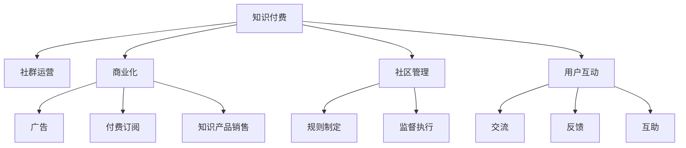

                 

# 知识付费：程序员的社群运营攻略

## 1. 背景介绍

### 1.1 问题由来

随着互联网技术的发展，知识付费成为一种快速发展的商业模式，尤其是在技术类社群中，通过知识付费，程序员可以分享自己的专业知识和经验，获得社区成员的支持和回报。然而，如何运营好一个程序员社群，吸引更多人参与并从中获益，是一个复杂而富有挑战性的问题。本文将深入探讨知识付费的原理与实践，为程序员提供一套系统的社群运营攻略。

### 1.2 问题核心关键点

知识付费的核心在于通过优质内容吸引用户，通过合理的商业模式实现社区的可持续发展。这一过程需要考虑内容质量、社区管理、用户互动等多个方面。同时，知识付费的商业化也需要谨慎，避免过度商业化导致社区氛围变差，影响用户体验和内容质量。

## 2. 核心概念与联系

### 2.1 核心概念概述

为更好地理解知识付费和社群运营，本节将介绍几个关键概念：

- **知识付费**：指通过付费获取知识服务的模式，用户为获取专家知识、技能、经验等内容支付费用。知识付费能够激励优质内容的生产，促进知识的传播和分享。
- **社群运营**：指通过管理和组织社群成员，维护社群健康和活跃，促进知识共享和价值实现的过程。
- **商业化**：指将知识付费模式和商业利益相结合，通过广告、付费订阅、知识产品销售等方式实现社区的经济收益。
- **社区管理**：指通过制定规则、监督执行、维护秩序等方式，保证社群环境的健康和有序。
- **用户互动**：指社群成员之间的交流、反馈、互助，形成良好的互动氛围，促进社群的积极发展。

这些概念之间的逻辑关系可以通过以下Mermaid流程图来展示：



这个流程图展示了两方面的核心概念及其之间的关系：

1. 知识付费是社群运营的基础，需要高质量的内容支撑。
2. 商业化是知识付费可持续发展的动力，而社区管理是保证高质量内容的必要手段。
3. 用户互动则是社群健康和活跃的关键，是社区管理的核心目标。

这些概念共同构成了知识付费和社群运营的基础框架，使得知识付费模式可以在社群中有效运行。

## 3. 核心算法原理 & 具体操作步骤

### 3.1 算法原理概述

知识付费和社群运营的算法原理主要围绕以下几个核心步骤：

1. **内容创造与筛选**：高质量内容是知识付费和社群运营的基础，需要筛选和激励高质量内容的创造。
2. **用户需求匹配**：通过用户画像和推荐算法，将高质量内容匹配给有需求的用户，提高用户满意度。
3. **社区管理**：通过规则制定、监督执行等方式，维护社区环境的健康和有序。
4. **商业化策略**：通过合理的商业模式，实现社区的经济收益，促进社群的可持续发展。
5. **用户互动**：通过互动机制，促进社群成员之间的交流、反馈、互助，形成良好的互动氛围。

### 3.2 算法步骤详解

以下我们将详细介绍每个核心步骤的算法实现：

#### 3.2.1 内容创造与筛选

**内容创造**：
1. **创作者招募**：通过社区内的达人、专家、热心用户等形式招募内容创作者。
2. **内容激励**：通过积分、证书、奖金等方式激励内容创作者，提高其积极性。
3. **内容审核**：建立内容审核机制，确保内容的质量和合规性。

**内容筛选**：
1. **算法推荐**：使用协同过滤、基于内容的推荐、深度学习等算法，筛选出高质量内容。
2. **用户评价**：建立用户评价机制，通过投票、评分等方式筛选出受欢迎的内容。
3. **热门榜单**：定期发布热门榜单，引导用户关注和阅读优质内容。

#### 3.2.2 用户需求匹配

**用户画像**：
1. **基本信息收集**：收集用户的姓名、职业、技术栈、学习需求等信息。
2. **行为数据分析**：分析用户的行为数据，如浏览记录、学习时长、付费行为等。

**推荐算法**：
1. **协同过滤**：根据用户的历史行为数据和相似用户的偏好，推荐相关内容。
2. **基于内容的推荐**：分析内容的特征，根据用户的兴趣和需求，推荐相关内容。
3. **深度学习**：使用神经网络等深度学习算法，预测用户需求，推荐高质量内容。

#### 3.2.3 社区管理

**规则制定**：
1. **社区规章**：制定社区规章，明确禁止内容，如广告、违规言论等。
2. **行为规范**：建立行为规范，引导用户行为，如遵守讨论规则、尊重他人等。

**监督执行**：
1. **规则执行**：通过社区管理员、用户监督等方式，执行社区规章和行为规范。
2. **违规处理**：对违规用户进行警告、禁言、删除账号等处理。

#### 3.2.4 商业化策略

**广告合作**：
1. **选择合适的广告商**：选择与社区内容相关、用户感兴趣的广告商。
2. **广告位置**：合理布置广告位置，如频道栏、文章末尾等。

**付费订阅**：
1. **付费模式**：提供免费和付费订阅两种模式，满足不同用户的需求。
2. **会员权益**：为付费用户提供专属权益，如高级权限、专属内容等。

**知识产品销售**：
1. **课程销售**：开发和销售高质量的在线课程，提供系统性的学习内容。
2. **电子书销售**：发布和销售高质量的电子书和技术文档，满足用户的自学需求。

#### 3.2.5 用户互动

**交流机制**：
1. **讨论组**：建立讨论组，鼓励用户分享知识、讨论技术问题。
2. **问答平台**：建立问答平台，解决用户的技术难题。

**反馈机制**：
1. **用户反馈**：收集用户对内容的反馈，改进内容质量。
2. **社区建议**：收集用户对社区管理的建议，改进社区运营。

**互助机制**：
1. **专家答疑**：邀请社区内的专家、达人等定期答疑，提供技术支持。
2. **互助小组**：建立互助小组，鼓励用户互相帮助、分享资源。

### 3.3 算法优缺点

知识付费和社群运营的算法具有以下优点：
1. **高质量内容**：通过内容筛选和激励机制，可以确保社区内内容的优质性和专业性。
2. **用户满意度提升**：通过推荐算法和用户反馈机制，可以提升用户满意度和粘性。
3. **商业化效果显著**：通过合理的商业化策略，可以保证社区的可持续发展。

同时，这些算法也存在以下缺点：
1. **内容多样性不足**：如果过度依赖算法推荐，可能会导致内容多样性不足，用户容易产生审美疲劳。
2. **用户隐私风险**：在收集用户数据和行为分析过程中，可能存在用户隐私风险，需要严格保护。
3. **运营成本高**：高质量内容的制作和审核需要较高成本，商业化过程中也存在营销成本。

尽管存在这些缺点，但就目前而言，知识付费和社群运营的算法仍是目前较为成熟和有效的运营模式。未来相关研究的重点在于如何进一步优化算法，提升用户体验，降低运营成本。

### 3.4 算法应用领域

知识付费和社群运营的算法应用广泛，涵盖以下几个领域：

1. **技术教育**：如在线编程课程、技术博客、技术文档等。通过付费订阅、课程销售等方式，获取稳定收益。
2. **企业培训**：如企业内部培训、技术分享会等。通过知识付费和社群运营，提升员工技术水平和企业竞争力。
3. **开源社区**：如GitHub、Stack Overflow等。通过商业化和社区管理，促进开源项目的健康发展和社区成员的积极参与。
4. **在线问答**：如CSDN问答、知乎等。通过知识付费和用户互动，提供高效的技术支持和服务。
5. **技术会议**：如TechCrunch Disrupt、全球开发者大会等。通过商业化和用户互动，提升会议的影响力和参与度。

这些领域的应用展示了知识付费和社群运营的广泛前景，同时也为技术社群的运营提供了丰富的实践经验和借鉴。

## 4. 数学模型和公式 & 详细讲解 & 举例说明

### 4.1 数学模型构建

本节将使用数学语言对知识付费和社群运营的算法进行更加严格的刻画。

设社区用户总数为 $N$，内容总数为 $M$。设用户 $i$ 的兴趣向量为 $\vec{r}_i$，内容 $j$ 的特征向量为 $\vec{d}_j$。设用户 $i$ 对内容 $j$ 的评分向量为 $\vec{s}_{ij}$，社区管理行为向量为 $\vec{c}_{ij}$，商业化行为向量为 $\vec{b}_{ij}$。则知识付费和社群运营的数学模型可以表示为：

$$
\begin{align*}
\max_{\vec{r}_i,\vec{d}_j,\vec{s}_{ij},\vec{c}_{ij},\vec{b}_{ij}} & \sum_{i=1}^N \sum_{j=1}^M (\vec{r}_i^T \vec{d}_j) \cdot (\vec{s}_{ij})^T \\
\text{s.t.} & \sum_{j=1}^M (\vec{d}_j^T \vec{c}_{ij}) \leq C \\
& \sum_{i=1}^N \sum_{j=1}^M (\vec{r}_i^T \vec{b}_{ij}) \leq B \\
& \vec{r}_i \in [0,1]^D \\
& \vec{d}_j \in [0,1]^D \\
& \vec{s}_{ij} \in [0,1] \\
& \vec{c}_{ij} \in [0,1] \\
& \vec{b}_{ij} \in [0,1]
\end{align*}
$$

其中，$C$ 为社区管理成本，$B$ 为商业化成本，$D$ 为兴趣和特征向量的维度。

### 4.2 公式推导过程

以下是知识付费和社群运营中常见数学模型的推导过程。

**协同过滤推荐算法**：
设用户 $i$ 对内容 $j$ 的评分向量为 $\vec{s}_{ij}$，内容 $j$ 的特征向量为 $\vec{d}_j$。用户 $i$ 的兴趣向量为 $\vec{r}_i$，内容 $j$ 的评分向量为 $\vec{s}_{ij}$。则协同过滤推荐算法可以表示为：

$$
\vec{s}_{ij} \approx \vec{r}_i^T \vec{d}_j
$$

**基于内容的推荐算法**：
设用户 $i$ 的兴趣向量为 $\vec{r}_i$，内容 $j$ 的特征向量为 $\vec{d}_j$。用户 $i$ 对内容 $j$ 的评分向量为 $\vec{s}_{ij}$。则基于内容的推荐算法可以表示为：

$$
\vec{s}_{ij} \approx \vec{r}_i^T \vec{d}_j
$$

**深度学习推荐算法**：
设用户 $i$ 的兴趣向量为 $\vec{r}_i$，内容 $j$ 的特征向量为 $\vec{d}_j$。用户 $i$ 对内容 $j$ 的评分向量为 $\vec{s}_{ij}$。则深度学习推荐算法可以表示为：

$$
\vec{s}_{ij} \approx f(\vec{r}_i, \vec{d}_j)
$$

其中，$f$ 为深度神经网络模型，如神经协同过滤(NCF)、注意力机制(Attention)等。

### 4.3 案例分析与讲解

**案例1: 技术教育平台知识付费**

某技术教育平台通过知识付费运营模式，吸引了大量用户订阅高质量的在线课程和视频。平台采用协同过滤推荐算法，根据用户的历史行为数据和相似用户的偏好，推荐相关课程。同时，平台还通过广告合作和课程销售等方式实现商业化。此外，平台还建立了一套完善的社区管理机制，确保内容的优质性和社区的健康氛围。

**案例2: 开源社区Github**

开源社区Github通过知识付费和社群运营，吸引了大量开发者参与开源项目。Github采用基于内容的推荐算法，根据用户对项目的兴趣和评价，推荐相关项目和内容。同时，Github还通过广告合作、企业赞助等方式实现商业化。此外，Github还建立了严格的社区管理机制，确保社区的健康发展和内容的合规性。

## 5. 项目实践：代码实例和详细解释说明

### 5.1 开发环境搭建

在进行知识付费和社群运营实践前，我们需要准备好开发环境。以下是使用Python进行PyTorch开发的环境配置流程：

1. 安装Anaconda：从官网下载并安装Anaconda，用于创建独立的Python环境。

2. 创建并激活虚拟环境：
```bash
conda create -n pytorch-env python=3.8 
conda activate pytorch-env
```

3. 安装PyTorch：根据CUDA版本，从官网获取对应的安装命令。例如：
```bash
conda install pytorch torchvision torchaudio cudatoolkit=11.1 -c pytorch -c conda-forge
```

4. 安装TensorFlow：由Google主导开发的开源深度学习框架，生产部署方便，适合大规模工程应用。同样有丰富的预训练语言模型资源。

5. 安装各类工具包：
```bash
pip install numpy pandas scikit-learn matplotlib tqdm jupyter notebook ipython
```

完成上述步骤后，即可在`pytorch-env`环境中开始知识付费和社群运营实践。

### 5.2 源代码详细实现

这里我们以技术教育平台为例，给出使用PyTorch进行知识付费和社群运营的PyTorch代码实现。

首先，定义用户行为数据类：

```python
import torch
import torch.nn as nn

class UserBehavior(torch.nn.Module):
    def __init__(self, interest_dim=10, rating_dim=1, cost_dim=1):
        super().__init__()
        self.interest = nn.Embedding(N, interest_dim)
        self.rating = nn.Embedding(N, rating_dim)
        self.cost = nn.Embedding(N, cost_dim)
        
    def forward(self, user_id, item_id):
        user_vector = self.interest(user_id)
        item_vector = self.rating(item_id)
        cost_vector = self.cost(user_id)
        rating_score = user_vector @ item_vector
        cost_score = user_vector @ cost_vector
        return rating_score, cost_score
```

然后，定义推荐算法类：

```python
class RecommendationSystem(torch.nn.Module):
    def __init__(self, embedding_dim=10):
        super().__init__()
        self.user_vector = nn.Embedding(N, embedding_dim)
        self.item_vector = nn.Embedding(M, embedding_dim)
        
    def forward(self, user_id, item_id):
        user_vector = self.user_vector(user_id)
        item_vector = self.item_vector(item_id)
        rating_score = user_vector @ item_vector
        return rating_score
```

接着，定义商业化策略类：

```python
class Commercialization(torch.nn.Module):
    def __init__(self, subscription_dim=1, ad_dim=1, product_dim=1):
        super().__init__()
        self.subscription = nn.Embedding(N, subscription_dim)
        self.ad = nn.Embedding(N, ad_dim)
        self.product = nn.Embedding(N, product_dim)
        
    def forward(self, user_id, ad_id, product_id):
        subscription_score = self.subscription(user_id)
        ad_score = self.ad(ad_id)
        product_score = self.product(product_id)
        return subscription_score, ad_score, product_score
```

最后，定义社区管理类：

```python
class CommunityManagement(torch.nn.Module):
    def __init__(self, cost_dim=1):
        super().__init__()
        self.cost = nn.Embedding(N, cost_dim)
        
    def forward(self, user_id, item_id):
        cost_score = self.cost(user_id)
        return cost_score
```

### 5.3 代码解读与分析

让我们再详细解读一下关键代码的实现细节：

**UserBehavior类**：
- `__init__`方法：初始化用户兴趣向量、评分向量和成本向量等关键组件。
- `forward`方法：将用户ID和物品ID输入，计算用户对物品的评分和成本，输出评分向量。

**RecommendationSystem类**：
- `__init__`方法：初始化用户向量和物品向量等关键组件。
- `forward`方法：将用户ID和物品ID输入，计算用户对物品的评分，输出评分向量。

**Commercialization类**：
- `__init__`方法：初始化订阅评分向量、广告评分向量和产品评分向量等关键组件。
- `forward`方法：将用户ID、广告ID和产品ID输入，计算订阅评分、广告评分和产品评分，输出评分向量。

**CommunityManagement类**：
- `__init__`方法：初始化成本向量等关键组件。
- `forward`方法：将用户ID和物品ID输入，计算成本评分，输出评分向量。

这些类通过组合实现了知识付费和社群运营的基本算法模型，可以进行协同过滤推荐、基于内容的推荐、商业化策略和社区管理。开发者可以在此基础上，进一步改进和优化算法模型，以适应实际应用需求。

## 6. 实际应用场景

### 6.1 技术教育平台

技术教育平台通过知识付费模式，可以吸引大量用户订阅高质量的在线课程和视频。平台采用协同过滤推荐算法，根据用户的历史行为数据和相似用户的偏好，推荐相关课程。同时，平台通过广告合作和课程销售等方式实现商业化，能够稳定运营并实现盈利。此外，平台还建立了一套完善的社区管理机制，确保内容的优质性和社区的健康氛围，提升了用户满意度和粘性。

### 6.2 开源社区

开源社区如Github，通过知识付费和社群运营，吸引了大量开发者参与开源项目。Github采用基于内容的推荐算法，根据用户对项目的兴趣和评价，推荐相关项目和内容。同时，Github通过广告合作、企业赞助等方式实现商业化，能够稳定运营并实现盈利。此外，Github还建立了严格的社区管理机制，确保社区的健康发展和内容的合规性，提升了社区的活跃度和开发者参与度。

### 6.3 在线问答平台

在线问答平台如CSDN问答、知乎，通过知识付费模式，可以吸引大量用户订阅高质量的问答和文章。平台采用深度学习推荐算法，根据用户的历史行为数据和兴趣向量，推荐相关问题和答案。同时，平台通过广告合作、付费订阅等方式实现商业化，能够稳定运营并实现盈利。此外，平台还建立了一套完善的社区管理机制，确保内容的优质性和社区的健康氛围，提升了用户满意度和粘性。

## 7. 工具和资源推荐

### 7.1 学习资源推荐

为了帮助开发者系统掌握知识付费和社群运营的理论基础和实践技巧，这里推荐一些优质的学习资源：

1. **《知识付费》系列博文**：由知识付费领域的专家撰写，深入浅出地介绍了知识付费的原理、商业模式和运营策略。

2. **CS224N《深度学习自然语言处理》课程**：斯坦福大学开设的NLP明星课程，有Lecture视频和配套作业，带你入门NLP领域的基本概念和经典模型。

3. **《知识付费与社群运营》书籍**：详细介绍了知识付费和社群运营的各个方面，包括内容创造、推荐算法、社区管理、商业化策略等。

4. **Coursera《知识付费与社群运营》课程**：来自知名大学的在线课程，讲解知识付费和社群运营的案例和实践。

5. **《知识付费与社群运营》论文集**：收录了多篇前沿论文，展示了知识付费和社群运营的前沿技术和发展趋势。

通过对这些资源的学习实践，相信你一定能够快速掌握知识付费和社群运营的精髓，并用于解决实际的业务问题。

### 7.2 开发工具推荐

高效的开发离不开优秀的工具支持。以下是几款用于知识付费和社群运营开发的常用工具：

1. **PyTorch**：基于Python的开源深度学习框架，灵活动态的计算图，适合快速迭代研究。大部分知识付费和社群运营模型都有PyTorch版本的实现。

2. **TensorFlow**：由Google主导开发的开源深度学习框架，生产部署方便，适合大规模工程应用。同样有丰富的推荐算法和知识付费模型资源。

3. **Transformers库**：HuggingFace开发的NLP工具库，集成了众多预训练语言模型和推荐算法，是进行知识付费和社群运营开发的利器。

4. **Weights & Biases**：模型训练的实验跟踪工具，可以记录和可视化模型训练过程中的各项指标，方便对比和调优。与主流深度学习框架无缝集成。

5. **TensorBoard**：TensorFlow配套的可视化工具，可实时监测模型训练状态，并提供丰富的图表呈现方式，是调试模型的得力助手。

6. **Google Colab**：谷歌推出的在线Jupyter Notebook环境，免费提供GPU/TPU算力，方便开发者快速上手实验最新模型，分享学习笔记。

合理利用这些工具，可以显著提升知识付费和社群运营的开发效率，加快创新迭代的步伐。

### 7.3 相关论文推荐

知识付费和社群运营的研究源于学界的持续研究。以下是几篇奠基性的相关论文，推荐阅读：

1. **《知识付费》论文**：介绍知识付费的原理和模式，探讨如何通过内容付费、广告合作、课程销售等方式实现商业化。

2. **《知识付费与社群运营》论文**：分析知识付费和社群运营的商业化策略，探讨如何通过广告、付费订阅、知识产品销售等方式实现社区的可持续发展。

3. **《社区管理与用户行为分析》论文**：研究社区管理机制对知识付费和社群运营的影响，探讨如何通过规则制定、监督执行、用户互动等方式，维护社区环境的健康和有序。

4. **《知识付费平台推荐算法》论文**：探讨协同过滤推荐算法、基于内容的推荐算法和深度学习推荐算法的原理和实现，分析其优缺点和适用场景。

5. **《知识付费平台用户行为分析》论文**：分析用户行为数据对知识付费和社群运营的影响，探讨如何通过用户画像、行为分析等方式提升用户满意度和粘性。

这些论文代表了大语言模型微调技术的发展脉络。通过学习这些前沿成果，可以帮助研究者把握学科前进方向，激发更多的创新灵感。

## 8. 总结：未来发展趋势与挑战

### 8.1 总结

本文对知识付费和社群运营进行了全面系统的介绍。首先阐述了知识付费和社群运营的研究背景和意义，明确了知识付费和社群运营的价值和重要性。其次，从原理到实践，详细讲解了知识付费和社群运营的数学模型和算法实现，给出了知识付费和社群运营的代码实现。同时，本文还广泛探讨了知识付费和社群运营在技术教育、开源社区、在线问答等多个领域的应用前景，展示了知识付费和社群运营的广阔前景。此外，本文精选了知识付费和社群运营的学习资源、开发工具和相关论文，力求为开发者提供全方位的技术指引。

通过本文的系统梳理，可以看到，知识付费和社群运营的算法正在成为NLP领域的重要范式，极大地拓展了知识付费模式的应用边界，催生了更多的落地场景。受益于大规模语料的预训练，知识付费模式可以在社群中有效运行。未来，伴随预训练语言模型和推荐算法的不断演进，相信知识付费和社群运营必将在更广泛的领域得到应用，为知识共享和价值实现带来新的变革。

### 8.2 未来发展趋势

展望未来，知识付费和社群运营将呈现以下几个发展趋势：

1. **内容质量提升**：随着知识付费和社群运营的发展，高质量内容的需求将更加凸显，平台将更加注重内容的筛选和激励，提升内容的优质性和专业性。
2. **算法优化**：推荐算法和用户行为分析算法将不断优化，提高匹配效率和用户满意度。
3. **商业化多样化**：除了传统的广告合作、付费订阅等方式，新的商业化模式，如知识产品销售、会员增值服务等，将不断涌现，丰富知识付费和社群运营的商业模式。
4. **社区管理智能化**：社区管理将更多地利用AI和大数据技术，实现自动化和智能化，提升社区运营效率和用户体验。
5. **跨平台融合**：知识付费和社群运营将更多地与其他平台和服务融合，形成跨平台的知识共享和价值实现网络。

以上趋势凸显了知识付费和社群运营的广阔前景。这些方向的探索发展，必将进一步提升知识付费和社群运营的效果，为知识共享和价值实现带来新的突破。

### 8.3 面临的挑战

尽管知识付费和社群运营已经取得了瞩目成就，但在迈向更加智能化、普适化应用的过程中，它仍面临着诸多挑战：

1. **内容多样性不足**：如果过度依赖算法推荐，可能会导致内容多样性不足，用户容易产生审美疲劳。
2. **用户隐私风险**：在收集用户数据和行为分析过程中，可能存在用户隐私风险，需要严格保护。
3. **运营成本高**：高质量内容的制作和审核需要较高成本，商业化过程中也存在营销成本。
4. **社区管理复杂**：社区管理需要大量人力物力投入，如何实现自动化和智能化，提升运营效率，是一大难题。
5. **用户粘性不足**：用户对平台的粘性不足，容易导致用户流失，平台需要不断提升用户满意度和粘性。

尽管存在这些挑战，但知识付费和社群运营的研究方向明确，技术不断进步，相信在学界和产业界的共同努力下，这些挑战终将一一克服，知识付费和社群运营必将在构建人机协同的智能时代中扮演越来越重要的角色。

### 8.4 研究展望

面对知识付费和社群运营所面临的种种挑战，未来的研究需要在以下几个方面寻求新的突破：

1. **无监督和半监督学习**：探索无监督和半监督学习方法，摆脱对大规模标注数据的依赖，利用自监督学习、主动学习等无监督和半监督范式，最大限度利用非结构化数据，实现更加灵活高效的推荐。
2. **商业化策略优化**：研究新的商业化策略，如知识产品销售、会员增值服务等，以丰富知识付费和社群运营的商业模式。
3. **社区管理智能化**：利用AI和大数据技术，实现社区管理的自动化和智能化，提升社区运营效率和用户体验。
4. **跨平台融合**：探索跨平台的知识共享和价值实现网络，实现知识付费和社群运营的跨平台融合。
5. **用户行为分析深度化**：深入分析用户行为数据，发现用户需求的潜在规律，提升推荐的精准度和用户满意度。

这些研究方向的研究成果，必将引领知识付费和社群运营技术迈向更高的台阶，为构建安全、可靠、可解释、可控的智能系统铺平道路。面向未来，知识付费和社群运营需要与其他人工智能技术进行更深入的融合，如知识表示、因果推理、强化学习等，多路径协同发力，共同推动自然语言理解和智能交互系统的进步。只有勇于创新、敢于突破，才能不断拓展知识付费和社群运营的边界，让智能技术更好地造福人类社会。

## 9. 附录：常见问题与解答

**Q1：知识付费和社群运营有哪些核心步骤？**

A: 知识付费和社群运营的核心步骤主要包括内容创造与筛选、用户需求匹配、社区管理、商业化策略、用户互动等。通过这些步骤的合理设计和优化，可以确保社区内内容的优质性和用户满意度，同时实现社区的可持续发展。

**Q2：如何激励高质量内容的创造？**

A: 高质量内容的创造需要合理激励机制。可以通过积分、证书、奖金等方式激励内容创作者，提高其积极性。同时，建立内容审核机制，确保内容的质量和合规性。

**Q3：如何提高用户满意度？**

A: 用户满意度提升需要良好的内容推荐机制。通过协同过滤推荐算法、基于内容的推荐算法、深度学习推荐算法等方式，将高质量内容匹配给有需求的用户，提高用户满意度。

**Q4：社区管理需要注意哪些问题？**

A: 社区管理需要注意规则制定、监督执行等问题。建立完善的社区规章和行为规范，确保社区环境的健康和有序。同时，利用AI和大数据技术，实现社区管理的自动化和智能化，提升运营效率和用户体验。

**Q5：如何实现社区的商业化？**

A: 社区的商业化可以通过广告合作、付费订阅、知识产品销售等方式实现。需要合理设计商业化策略，确保商业化的可行性和可持续性。同时，注重社区健康氛围的维护，避免过度商业化影响用户体验。

通过以上问题的解答，相信读者可以更好地理解知识付费和社群运营的核心步骤和关键问题，从而在实际应用中更好地实践和优化这些技术。

---

作者：禅与计算机程序设计艺术 / Zen and the Art of Computer Programming

