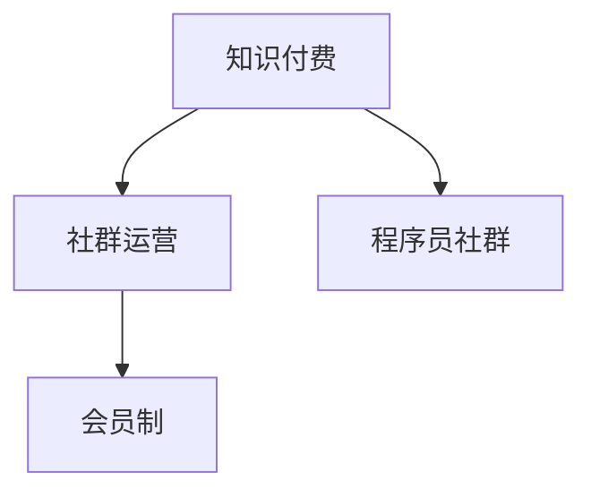

                 

# 知识付费：程序员的社群运营秘籍

> 关键词：知识付费, 社群运营, 程序员, 技术交流, 会员制, 内容创造, 变现模式

## 1. 背景介绍

### 1.1 问题由来
在数字化时代，知识与信息爆炸式增长，人们获取知识的方式也发生了翻天覆地的变化。从传统的书籍、报纸、电视到如今的在线课程、视频直播、社交媒体，知识和信息传播的渠道愈发丰富多元。然而，在信息爆炸的背后，人们面临的是信息质量参差不齐、时间精力有限等挑战。如何在海量的信息中找到自己真正需要的知识，并高效吸收应用，成为摆在我们面前的重要课题。

在此背景下，知识付费行业应运而生。知识付费以信息稀缺性和高质量为核心卖点，通过订阅、购买等付费形式，为用户提供专业、系统的知识和信息服务，在满足其个性化需求的同时，也帮助用户高效筛选和利用信息。

对于程序员这一特定群体而言，知识付费更是一剂不可多得的强心剂。作为一个持续学习、快速迭代的技术岗位，程序员需要不断更新自己的知识体系，掌握最新的技术动态，以保持竞争力。知识付费以其高效、便捷、系统化的特点，成为程序员提升自我、实现职业发展的有力工具。

## 2. 核心概念与联系

### 2.1 核心概念概述

为更好地理解知识付费和社群运营背后的原理，本节将介绍几个关键概念及其联系：

- **知识付费**：通过付费形式获取高质量的知识和信息服务，以提升个人和组织的学习效率和发展能力。知识付费强调的是内容的稀缺性、专业性和高质量。
- **社群运营**：指通过线上或线下形式，组织用户围绕共同兴趣或目标进行交流、分享、协作的过程。社群运营的核心在于建立用户间的连接，形成良性互动和知识共享的氛围。
- **程序员社群**：由程序员构成，专注于技术交流、项目合作、职业发展等议题的社群。程序员社群具有高度的专业性和多样性，涵盖各种编程语言、开发框架、技术栈等。
- **会员制**：一种用户付费获取特权、内容和服务的形式，常见于知识付费平台和专业社群。会员制能够有效筛选出真正有需求的用户，提升平台或社群的运营效率和用户体验。

这些概念之间的逻辑关系可以通过以下Mermaid流程图来展示：



这个流程图展示的知识付费和社群运营的概念及它们之间的关系：

1. 知识付费作为平台或社群的核心价值，提供高质量的知识和信息服务。
2. 社群运营作为知识付费的实现手段，通过用户互动和内容分享，形成社群氛围。
3. 程序员社群作为知识付费和社群运营的重要组成部分，具备高度专业性和多样化。
4. 会员制作为知识付费和社群运营的商业模式，筛选和激励有需求的用户。

## 3. 核心算法原理 & 具体操作步骤

### 3.1 算法原理概述

知识付费和社群运营的核心在于通过有组织、有系统的知识分享和用户互动，帮助用户高效学习和交流。其算法原理主要包括以下几个方面：

- **推荐算法**：通过分析用户行为、兴趣、历史学习记录等数据，为用户推荐其可能感兴趣的内容和社群。推荐算法能够提升用户的满意度和留存率。
- **内容分发**：将知识付费内容以课程、直播、文章等形式，合理分发至目标用户，确保内容触达率高。内容分发算法要考虑内容的时效性、相关性和互动性。
- **互动算法**：设计用户互动行为（如评论、点赞、分享等）的算法模型，分析用户间的互动模式和趋势，优化社群的运营效率。
- **会员激励**：设计会员激励机制，通过积分、优惠券、专属权限等手段，鼓励用户积极参与社群活动和内容创作，提升社群活跃度和贡献度。

### 3.2 算法步骤详解

知识付费和社群运营的实现涉及多个环节，包括用户注册、内容上传、互动交流等。以下详细介绍其主要步骤：

**Step 1: 用户注册和认证**
- 用户通过手机号、邮箱、第三方账号等方式完成注册。
- 进行身份验证，如人脸识别、邮箱验证等，确保用户身份真实可信。

**Step 2: 内容上传与审核**
- 开发者将课程、文章、视频等知识付费内容上传到平台。
- 平台对内容进行审核，确保其符合规范，不含有害信息。
- 对内容进行分类、标签等元数据标注，便于推荐和搜索。

**Step 3: 内容推荐与分发**
- 通过推荐算法分析用户行为和偏好，为用户推荐个性化的内容。
- 根据推荐结果和用户互动数据，动态调整内容分发策略，优化内容触达率。
- 设计合理的分发渠道和时机，确保内容能够及时到达目标用户。

**Step 4: 互动交流与反馈**
- 设计互动界面和算法，鼓励用户进行评论、点赞、分享等互动行为。
- 分析互动数据，识别热点话题和趋势，优化内容推荐和社群运营。
- 收集用户反馈，不断优化产品和服务。

**Step 5: 会员制与激励**
- 设计会员制度，提供专属特权、优惠、专属内容等，吸引用户付费加入。
- 通过积分、优惠券等手段，激励用户积极参与社群活动和内容创作。
- 分析会员数据，优化会员策略和运营效果。

### 3.3 算法优缺点

知识付费和社群运营的算法原理有以下优点：
1. 高效精准：通过数据分析和算法推荐，能够为用户精准推荐其感兴趣的内容，提高学习效率。
2. 互动性强：通过互动算法设计，提升用户之间的交流互动，增强社群凝聚力和用户粘性。
3. 运营灵活：算法设计能够动态调整内容分发和用户互动策略，适应变化多端的市场需求。

同时，这些算法也存在一些局限性：
1. 数据隐私：算法的推荐和分析需要大量用户数据，可能会引发隐私和数据安全问题。
2. 算法偏见：算法模型可能存在偏见，导致内容推荐结果不均衡，影响用户体验。
3. 过度商业化：过度的商业化和广告植入，可能会降低用户对内容的信任和满意度。
4. 用户依赖：过度依赖算法推荐，可能会限制用户的主动探索和创新能力。

尽管存在这些局限性，但就目前而言，算法驱动的知识付费和社群运营已经在大数据和人工智能技术的支持下，取得了显著成效。未来相关研究的重点在于如何进一步提升算法的公平性、透明性和可解释性，以及如何在保证用户隐私的同时，提升推荐和运营效果。

### 3.4 算法应用领域

知识付费和社群运营的算法原理在多个领域都有广泛应用，例如：

- 在线教育平台：如Coursera、Udemy、Codecademy等，通过算法推荐系统，为学生提供个性化课程推荐和学习路径规划。
- 技术社区和论坛：如Stack Overflow、GitHub、Slack等，通过用户互动算法，形成活跃的交流和知识共享氛围。
- 专业社群：如Kaggle、DataCamp、IT公论等，通过算法激励机制，鼓励用户积极参与项目合作和内容创作。

除了这些经典应用外，知识付费和社群运营的算法原理还被创新性地应用于更多场景中，如可控内容生成、智能问答、知识图谱构建等，为知识传播和协作提供了新的思路。

## 4. 数学模型和公式 & 详细讲解  
### 4.1 数学模型构建

本节将使用数学语言对知识付费和社群运营的算法原理进行更加严格的刻画。

记知识付费平台的用户集合为 $U=\{u_1,u_2,\ldots,u_N\}$，其中 $u_i$ 为用户 $i$。每个用户 $u_i$ 的特征向量为 $x_i \in \mathbb{R}^d$，表示其在平台上的行为和偏好。平台内容集合为 $V=\{v_1,v_2,\ldots,v_M\}$，其中 $v_j$ 为内容 $j$。内容 $v_j$ 的特征向量为 $y_j \in \mathbb{R}^d$，表示其属性和质量。

定义用户 $u_i$ 对内容 $v_j$ 的评分 $r_{i,j}$，满足 $0 \leq r_{i,j} \leq 1$。知识付费平台的目标是通过算法模型，预测用户对内容的评分 $r_{i,j}$，进而为用户推荐最感兴趣的内容。

### 4.2 公式推导过程

以协同过滤推荐算法为例，推导内容推荐的数学模型。

设 $x_i$ 和 $y_j$ 分别为用户和内容的特征向量，相似度矩阵为 $S=\{s_{i,j}\}_{i,j=1}^{N,M}$，其中 $s_{i,j}=\langle x_i, y_j \rangle / (\|x_i\|\|y_j\|)$。用户 $u_i$ 对内容 $v_j$ 的评分可以表示为：

$$
r_{i,j} = \alpha s_{i,j} + (1-\alpha) \frac{1}{k} \sum_{l=1}^k s_{l,j}
$$

其中 $\alpha$ 为相似度权重，$k$ 为取样大小。该模型通过加权相似度计算用户对内容的评分，能够捕捉用户和内容之间的交互关系。

进一步，可以将评分矩阵 $R \in \mathbb{R}^{N,M}$ 表示为用户 $u_i$ 对内容 $v_j$ 的评分，通过矩阵分解，得到用户和内容的低维表示 $X \in \mathbb{R}^{N,d_u}$ 和 $Y \in \mathbb{R}^{M,d_v}$。最终，用户 $u_i$ 对内容 $v_j$ 的评分可以表示为：

$$
\hat{r}_{i,j} = X_i^TY_j
$$

其中 $X_i$ 和 $Y_j$ 分别表示用户 $u_i$ 和内容 $v_j$ 的低维表示。通过优化 $\hat{r}_{i,j}$，可以不断更新用户和内容的低维表示，提高推荐的准确性。

### 4.3 案例分析与讲解

**案例：在线教育平台的课程推荐**

以Coursera平台为例，课程推荐系统可以根据用户历史学习行为（如浏览、注册、上课等），生成用户行为向量 $x_i$，以及课程属性向量 $y_j$，如课程名称、教师、评分等。通过协同过滤推荐算法，对用户 $u_i$ 对课程 $v_j$ 的评分进行预测，得到推荐列表。平台可以根据用户的兴趣偏好和历史行为，动态调整推荐算法参数，优化推荐结果。

此外，平台还可以利用用户间的社交关系，设计社交推荐算法，通过用户间的互动和评价，进一步提升推荐效果。

## 5. 项目实践：代码实例和详细解释说明
### 5.1 开发环境搭建

在进行知识付费和社群运营实践前，我们需要准备好开发环境。以下是使用Python进行Flask开发的环境配置流程：

1. 安装Anaconda：从官网下载并安装Anaconda，用于创建独立的Python环境。

2. 创建并激活虚拟环境：
```bash
conda create -n pay服-env python=3.8 
conda activate pay服-env
```

3. 安装Flask：通过pip安装Flask：
```bash
pip install Flask
```

4. 安装其他必要库：
```bash
pip install pandas numpy scikit-learn sqlalchemy flask-wtf
```

5. 安装数据库：例如安装PostgreSQL数据库：
```bash
pip install psycopg2-binary
```

完成上述步骤后，即可在`pay服-env`环境中开始知识付费和社群运营的开发实践。

### 5.2 源代码详细实现

下面我们以在线教育平台课程推荐系统为例，给出使用Flask和SQLAlchemy进行开发的PyTorch代码实现。

首先，定义用户和课程的数据模型：

```python
from flask_sqlalchemy import SQLAlchemy
from flask_login import UserMixin, LoginManager
from werkzeug.security import generate_password_hash, check_password_hash

app = Flask(__name__)
app.config['SQLALCHEMY_DATABASE_URI'] = 'postgresql://localhost:5432/pay服'

db = SQLAlchemy(app)
login_manager = LoginManager(app)

class User(UserMixin, db.Model):
    id = db.Column(db.Integer, primary_key=True)
    username = db.Column(db.String(50), unique=True, nullable=False)
    password_hash = db.Column(db.String(200), nullable=False)
    courses = db.relationship('Course', backref='owner', lazy='dynamic')

    def set_password(self, password):
        self.password_hash = generate_password_hash(password)

    def check_password(self, password):
        return check_password_hash(self.password_hash, password)

class Course(db.Model):
    id = db.Column(db.Integer, primary_key=True)
    title = db.Column(db.String(200), nullable=False)
    description = db.Column(db.Text, nullable=False)
    owner_id = db.Column(db.Integer, db.ForeignKey('user.id'), nullable=False)
    users = db.relationship('User', backref='courses', lazy='dynamic')
```

然后，定义用户登录和注册函数：

```python
@login_manager.user_loader
def load_user(user_id):
    return User.query.get(int(user_id))

@app.route('/login', methods=['GET', 'POST'])
def login():
    if request.method == 'POST':
        username = request.form['username']
        password = request.form['password']
        user = User.query.filter_by(username=username).first()
        if user and user.check_password(password):
            login_manager.login_user(user)
            return redirect(url_for('index'))
        else:
            flash('Invalid username or password')
            return redirect(url_for('login'))
    return render_template('login.html')
```

接着，定义课程推荐函数：

```python
def get_recommendations(user):
    user_data = User.query.filter_by(username=user).first()
    courses = user_data.courses
    all_courses = Course.query.all()
    similarities = {}
    for course in all_courses:
        if course not in courses:
            similarities[course] = {}
            for user_course in user_data.courses:
                similarities[course][user_course.id] = np.dot(course.data, user_course.data)
    sorted_courses = sorted(similarities.items(), key=lambda x: -x[1])
    recommendations = []
    for course in sorted_courses:
        if len(recommendations) == 5:
            break
        recommendations.append(course[0])
    return recommendations
```

最后，在应用层进行推荐展示：

```python
@app.route('/recommendations')
@login_required
def recommendations():
    user = current_user
    courses = get_recommendations(user)
    return render_template('recommendations.html', courses=courses)
```

以上就是使用Flask和SQLAlchemy对在线教育平台课程推荐系统进行开发的完整代码实现。可以看到，Flask和SQLAlchemy提供了简单易用的API，使得开发者能够快速搭建知识付费平台的基础框架。

### 5.3 代码解读与分析

让我们再详细解读一下关键代码的实现细节：

**User和Course模型**：
- 定义了用户和课程的基本属性，如用户名、密码、课程名称、描述等。
- 使用了SQLAlchemy的ORM框架，方便进行数据库操作。
- 定义了用户和课程之间的多对多关系，使用Flask-Login进行用户认证和权限控制。

**login和recommendations函数**：
- 通过Flask-Login的user_loader回调函数，实现了用户登录和认证机制。
- 利用SQLAlchemy查询数据库，获取用户和课程的关联数据。
- 通过协同过滤推荐算法，计算课程相似度，生成推荐列表。
- 在应用层返回推荐列表，并进行模板渲染。

**Flask框架**：
- 利用Flask构建Web应用框架，通过路由和视图函数实现业务逻辑。
- 使用Flask-WTF进行表单处理，提升用户交互体验。
- 集成SQLAlchemy，实现数据库操作和模型关联。
- 利用Flask-Login进行用户认证和权限控制。

可以看出，Flask和SQLAlchemy提供的工具和库，大大简化了知识付费平台的开发过程。开发者可以更加专注于业务逻辑和算法模型的实现，而不必过多关注底层的技术细节。

## 6. 实际应用场景
### 6.1 智能问答社区

智能问答社区作为一种新型的知识付费模式，以用户生成内容和专家解答为核心，帮助用户高效解决技术难题，提升学习效率。智能问答社区通常采用C2C（Consumer to Consumer）模式，即用户向其他用户提问，由其他用户或专家进行解答。

在智能问答社区中，推荐算法和互动算法尤为重要：
- 推荐算法根据用户的历史提问和回答行为，推荐相关问题和答案，提升用户体验。
- 互动算法通过分析用户间的互动模式和评价，优化问题分类和回答质量，增强社区活跃度。

**案例：Stack Overflow社区**

Stack Overflow作为一个成功的智能问答社区，其推荐算法和互动算法是其核心竞争力。Stack Overflow通过用户互动数据和问题标签，实现精准的问题推荐和回答排序，提升用户满意度和留存率。同时，社区还利用投票、点赞等互动机制，鼓励高质量的回答，促进知识共享和社区健康发展。

### 6.2 技术论坛

技术论坛是一种以技术讨论和分享为主要内容的知识付费模式，常见于GitHub、CSDN等平台。技术论坛通过用户生成内容，吸引技术爱好者和专业人士进行交流和分享。

技术论坛的运营和维护需要综合运用推荐算法和互动算法：
- 推荐算法通过分析用户的历史阅读和发表行为，推荐相关文章和技术贴，提升用户的参与度和满意度。
- 互动算法通过分析用户的评论、点赞和投票行为，优化内容分类和展示顺序，增强社区的活跃度和凝聚力。

**案例：CSDN论坛**

CSDN作为国内最大的开发者社区，通过技术论坛的形式，为开发者提供技术交流和资源共享的平台。CSDN论坛利用推荐算法和互动算法，实现了高效的内容分发和用户互动，吸引了大量技术爱好者和专业人士的关注和参与。

### 6.3 专业社群

专业社群是一种以专业知识和技术分享为核心内容的知识付费模式，常见于Kaggle、DataCamp等平台。专业社群通过用户生成内容和技术分享，帮助用户提升专业技能，拓展职业发展。

专业社群的运营和维护需要精心设计推荐算法和互动算法：
- 推荐算法通过分析用户的兴趣和专业背景，推荐相关课程和资源，提升用户的参与度和满意度。
- 互动算法通过分析用户的讨论和评价，优化课程和资源展示，促进知识共享和社群发展。

**案例：Kaggle平台**

Kaggle作为一个专业的数据科学社区，通过专业社群的形式，为数据科学家和机器学习爱好者提供学习和交流的平台。Kaggle平台利用推荐算法和互动算法，实现了高效的内容分发和用户互动，吸引了大量数据科学家和机器学习爱好者的关注和参与。

## 7. 工具和资源推荐
### 7.1 学习资源推荐

为了帮助开发者系统掌握知识付费和社群运营的理论基础和实践技巧，这里推荐一些优质的学习资源：

1. **《知识付费：如何运营一个成功的社群平台》**：详细介绍知识付费和社群运营的商业模式、运营策略和实践经验，为开发者提供全面的指导。
2. **《Python网络爬虫实战》**：介绍Python爬虫技术的核心原理和实现方法，为开发者提供数据采集和处理的基础技能。
3. **《机器学习实战》**：讲解机器学习算法和实践案例，帮助开发者掌握算法模型和数据处理技术。
4. **《Flask Web开发实战》**：详细介绍Flask框架的开发技巧和最佳实践，为开发者提供Web应用开发的实用指南。
5. **《SQLAlchemy实战》**：讲解SQLAlchemy ORM框架的使用方法，帮助开发者高效进行数据库操作和模型关联。

通过对这些资源的学习实践，相信你一定能够快速掌握知识付费和社群运营的核心技能，并用于解决实际的业务问题。

### 7.2 开发工具推荐

高效的开发离不开优秀的工具支持。以下是几款用于知识付费和社群运营开发的常用工具：

1. **Flask**：基于Python的轻量级Web框架，适合快速迭代和原型开发。

2. **SQLAlchemy**：Python的ORM框架，提供数据库操作的简洁API，适合数据管理和关系模型设计。

3. **Gunicorn**：Python的Web服务器，支持多进程和多线程，适合高并发Web应用。

4. **Redis**：基于内存的数据库，支持快速的数据读写操作，适合缓存和实时数据处理。

5. **PostgreSQL**：开源的关系型数据库，适合高并发和高可靠性应用。

6. **Docker**：容器化技术，适合应用的打包、部署和管理。

合理利用这些工具，可以显著提升知识付费和社群运营的开发效率，加快创新迭代的步伐。

### 7.3 相关论文推荐

知识付费和社群运营的研究源于学界的持续研究。以下是几篇奠基性的相关论文，推荐阅读：

1. **《推荐系统：算法与实现》**：介绍推荐系统的核心算法和实现方法，为开发者提供算法实现的参考。

2. **《社交网络分析：方法与实践》**：讲解社交网络分析和用户互动的原理和实现，帮助开发者优化社区运营。

3. **《数据科学中的机器学习》**：介绍机器学习算法和实践案例，为开发者提供数据建模和算法实现的基础。

4. **《Web开发模式与技术》**：介绍Web开发的模式和实践技术，帮助开发者掌握Web开发的核心技能。

5. **《数据库设计原理》**：讲解数据库设计原理和实践技巧，为开发者提供数据管理和关系模型设计的基础。

这些论文代表了大数据和人工智能技术在知识付费和社群运营领域的研究进展。通过学习这些前沿成果，可以帮助研究者把握学科前进方向，激发更多的创新灵感。

## 8. 总结：未来发展趋势与挑战

### 8.1 总结

本文对知识付费和社群运营的核心算法原理进行了全面系统的介绍。首先阐述了知识付费和社群运营的研究背景和意义，明确了推荐算法和互动算法在用户学习交流中的重要作用。其次，从原理到实践，详细讲解了知识付费和社群运营的数学模型和关键步骤，给出了知识付费平台和社群运营的代码实例。同时，本文还广泛探讨了知识付费和社群运营在智能问答、技术论坛、专业社群等多个领域的应用前景，展示了知识付费和社群运营的广阔前景。

通过本文的系统梳理，可以看到，知识付费和社群运营正在成为数字化时代的重要趋势，其算法原理和实践方法已经在各个领域得到广泛应用。未来的发展方向在于进一步提升算法的公平性、透明性和可解释性，以及如何在保证用户隐私的同时，提升推荐和运营效果。

### 8.2 未来发展趋势

展望未来，知识付费和社群运营将呈现以下几个发展趋势：

1. **智能推荐**：利用深度学习和大数据技术，实现更加精准和个性化的推荐。智能推荐算法将进一步提升用户的满意度和留存率，优化内容分发和用户互动。

2. **多模态数据融合**：结合文本、图像、语音等多模态数据，增强知识传播和用户互动的效果。多模态数据的融合，将带来更丰富的学习体验和更全面的知识表示。

3. **社交网络分析**：通过社交网络分析和用户互动数据，优化社群运营策略，提升社区活跃度和用户粘性。社交网络分析将帮助开发者深入理解用户行为和社区动态，优化社群生态。

4. **个性化服务**：利用用户行为数据和机器学习技术，提供更加个性化的内容和推荐服务。个性化服务将进一步提升用户的参与度和满意度，优化用户体验。

5. **开放平台**：构建开放的知识付费平台，吸引更多开发者和用户参与，共同构建知识共享和协作的生态系统。开放平台将提升平台的用户量和内容质量，促进知识传播和创新。

6. **跨平台运营**：通过跨平台的数据和服务整合，实现知识付费和社群运营的多渠道运营和推广。跨平台运营将帮助开发者拓展用户规模和市场范围，提升平台的市场竞争力。

### 8.3 面临的挑战

尽管知识付费和社群运营已经取得了显著成效，但在迈向更加智能化、普适化应用的过程中，仍然面临诸多挑战：

1. **数据隐私和安全**：算法的推荐和分析需要大量用户数据，可能会引发隐私和数据安全问题。如何保护用户隐私，防止数据泄露和滥用，将成为平台运营的关键问题。

2. **算法偏见和公平性**：算法模型可能存在偏见，导致内容推荐结果不均衡，影响用户体验。如何设计公平、透明和可解释的算法，提升算法的公信力和可信度，将是未来研究的重要方向。

3. **内容审核和监管**：平台需要有效管理用户生成内容，防止有害信息和虚假宣传，保障平台的健康发展。内容审核和监管需要投入大量资源，如何高效实现内容审核和违规行为检测，将是平台运营的关键问题。

4. **用户粘性和参与度**：如何吸引和保持用户长期参与，增强平台的粘性和活跃度，是知识付费和社群运营的重要课题。如何设计有效的激励机制和互动模式，提升用户的参与度和满意度，将是平台运营的关键问题。

5. **商业化和变现模式**：如何在保障用户体验的前提下，实现平台的商业化和变现，提升平台的商业模式和盈利能力，将是平台运营的关键问题。如何设计合理的定价策略和变现模式，提升平台的市场竞争力和盈利能力，将是未来研究的重点。

### 8.4 研究展望

面对知识付费和社群运营所面临的挑战，未来的研究需要在以下几个方面寻求新的突破：

1. **个性化推荐算法**：开发更加高效和精准的个性化推荐算法，提升用户的学习效率和满意度。个性化推荐算法需要综合考虑用户行为、兴趣、时间等因素，实现更加精细化的推荐。

2. **多模态融合技术**：结合文本、图像、语音等多模态数据，实现更全面和深入的用户画像和内容理解。多模态融合技术将提升推荐和互动的效果，带来更丰富的学习体验和更全面的知识表示。

3. **社交网络分析工具**：开发高效和准确的社交网络分析工具，帮助开发者深入理解用户行为和社区动态，优化社群运营策略。社交网络分析工具将提升社区活跃度和用户粘性，促进知识共享和协作。

4. **公平和透明算法**：设计公平、透明和可解释的算法，提升算法的公信力和可信度。公平和透明算法需要引入伦理和社会责任，防止算法偏见和有害行为，保障用户权益和平台健康发展。

5. **跨平台运营技术**：开发跨平台的数据和服务整合技术，实现知识付费和社群运营的多渠道运营和推广。跨平台运营技术将拓展平台的用户规模和市场范围，提升平台的市场竞争力和用户粘性。

6. **商业化和变现模式**：探索合理的商业化和变现模式，提升平台的商业模式和盈利能力。商业化和变现模式需要兼顾用户体验和商业利益，实现双赢发展。

这些研究方向将引领知识付费和社群运营技术的不断进步，为平台运营和用户体验提供新的思路和解决方案。面向未来，知识付费和社群运营技术需要与其他人工智能技术进行更深入的融合，如自然语言处理、计算机视觉、增强学习等，多路径协同发力，共同推动知识传播和协作系统的进步。

## 9. 附录：常见问题与解答

**Q1：知识付费和社群运营的核心是什么？**

A: 知识付费和社群运营的核心在于通过有组织、有系统的知识分享和用户互动，帮助用户高效学习和交流。推荐算法和互动算法是其核心技术，通过数据分析和算法模型，实现精准的内容推荐和用户互动，提升用户的学习效率和满意度。

**Q2：知识付费和社群运营的商业模式有哪些？**

A: 知识付费和社群运营的商业模式主要包括：

1. **订阅制**：用户支付固定费用，获取平台提供的会员特权和服务。订阅制模式适用于对平台依赖度高的用户，如专业社群、在线教育平台等。

2. **按需付费**：用户根据具体需求选择购买单次服务或单篇内容，按需付费。按需付费模式适用于灵活多样的知识需求，如技术论坛、智能问答社区等。

3. **打赏制**：用户自愿向内容创作者支付一定的报酬，作为对其贡献的认可和激励。打赏制模式适用于社区氛围浓厚的平台，如技术论坛、智能问答社区等。

**Q3：如何提升知识付费和社群运营的互动效果？**

A: 提升知识付费和社群运营的互动效果，可以从以下几个方面入手：

1. **设计互动界面**：通过友好的界面设计和交互方式，鼓励用户进行评论、点赞、分享等互动行为。

2. **激励机制设计**：通过积分、优惠券、专属权限等手段，鼓励用户积极参与社群活动和内容创作，提升社区活跃度。

3. **互动数据分析**：通过分析用户互动数据，识别热点话题和趋势，优化内容推荐和社群运营，增强社区凝聚力。

4. **多样化的互动形式**：结合文本、图像、语音等多种互动形式，提升用户互动体验和满意度，增强社区活力。

**Q4：知识付费和社群运营面临的主要挑战是什么？**

A: 知识付费和社群运营面临的主要挑战包括：

1. **数据隐私和安全**：算法的推荐和分析需要大量用户数据，可能会引发隐私和数据安全问题。如何保护用户隐私，防止数据泄露和滥用，是平台运营的关键问题。

2. **算法偏见和公平性**：算法模型可能存在偏见，导致内容推荐结果不均衡，影响用户体验。如何设计公平、透明和可解释的算法，提升算法的公信力和可信度，将是未来研究的重要方向。

3. **内容审核和监管**：平台需要有效管理用户生成内容，防止有害信息和虚假宣传，保障平台健康发展。内容审核和监管需要投入大量资源，如何高效实现内容审核和违规行为检测，将是平台运营的关键问题。

4. **用户粘性和参与度**：如何吸引和保持用户长期参与，增强平台的粘性和活跃度，是知识付费和社群运营的重要课题。如何设计有效的激励机制和互动模式，提升用户的参与度和满意度，将是平台运营的关键问题。

5. **商业化和变现模式**：如何在保障用户体验的前提下，实现平台的商业化和变现，提升平台的商业模式和盈利能力，将是平台运营的关键问题。如何设计合理的定价策略和变现模式，提升平台的市场竞争力和盈利能力，将是未来研究的重点。

**Q5：知识付费和社群运营的未来发展方向是什么？**

A: 知识付费和社群运营的未来发展方向包括：

1. **智能推荐**：利用深度学习和大数据技术，实现更加精准和个性化的推荐。智能推荐算法将进一步提升用户的满意度和留存率，优化内容分发和用户互动。

2. **多模态数据融合**：结合文本、图像、语音等多模态数据，增强知识传播和用户互动的效果。多模态数据的融合，将带来更丰富的学习体验和更全面的知识表示。

3. **社交网络分析**：通过社交网络分析和用户互动数据，优化社群运营策略，提升社区活跃度和用户粘性。社交网络分析将帮助开发者深入理解用户行为和社区动态，优化社群生态。

4. **个性化服务**：利用用户行为数据和机器学习技术，提供更加个性化的内容和推荐服务。个性化服务将进一步提升用户的参与度和满意度，优化用户体验。

5. **开放平台**：构建开放的知识付费平台，吸引更多开发者和用户参与，共同构建知识共享和协作的生态系统。开放平台将提升平台的用户量和内容质量，促进知识传播和创新。

6. **跨平台运营**：通过跨平台的数据和服务整合，实现知识付费和社群运营的多渠道运营和推广。跨平台运营将拓展平台的用户规模和市场范围，提升平台的市场竞争力和用户粘性。

**Q6：知识付费和社群运营的关键技术是什么？**

A: 知识付费和社群运营的关键技术包括：

1. **推荐算法**：通过分析用户行为、兴趣、历史学习记录等数据，为用户推荐其可能感兴趣的内容。推荐算法能够提升用户的满意度和留存率。

2. **内容分发**：将知识付费内容以课程、直播、文章等形式，合理分发至目标用户，确保内容触达率高。内容分发算法要考虑内容的时效性、相关性和互动性。

3. **互动算法**：设计用户互动行为（如评论、点赞、分享等）的算法模型，分析用户间的互动模式和趋势，优化社群的运营效率。

4. **会员激励**：设计会员制度，通过积分、优惠券、专属权限等手段，鼓励用户积极参与社群活动和内容创作，提升社群活跃度和贡献度。

这些关键技术将帮助知识付费和社群运营平台实现高效的内容推荐和用户互动，提升平台的价值和用户满意度。

---

作者：禅与计算机程序设计艺术 / Zen and the Art of Computer Programming

