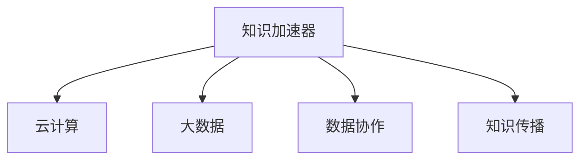

                 

# 知识加速器提供资源对接,助力初创企业

在当今信息爆炸的时代，初创企业在成长道路上往往面临重重挑战。如何高效获取技术资源、快速集成创新能力、准确把握市场机遇，成为初创企业的核心痛点。为了解决这一问题，知识加速器应运而生，成为初创企业发展的有力助手。本文将详细介绍知识加速器的核心概念、原理、操作步骤，以及其在多个行业的应用场景，助力初创企业高效成长。

## 1. 背景介绍

### 1.1 问题由来

初创企业在发展过程中，往往需要投入大量资源进行技术研发、市场调研、产品迭代等。然而，由于初创企业的人力、物力、财力有限，常常难以有效对接高质量的技术资源，导致在技术研发和创新方面进展缓慢。特别是对于AI、大数据、云计算等前沿技术领域，初创企业更需要高效获取外部资源，以加速产品开发和市场推广。

### 1.2 问题核心关键点

知识加速器（Knowledge Accelerator）是一种利用云计算和大数据技术，高效对接外部技术资源的服务平台。它通过提供一个资源共享、数据协作、知识传播的虚拟社区，将初创企业与技术专家、开源项目、学术研究机构等资源高效对接，从而快速提升初创企业技术创新能力和市场竞争力。

## 2. 核心概念与联系

### 2.1 核心概念概述

为了更好地理解知识加速器的工作原理，本节将介绍几个密切相关的核心概念：

- **知识加速器**：基于云计算和大数据技术的平台，通过提供一个资源共享、数据协作、知识传播的虚拟社区，帮助初创企业高效对接外部技术资源，加速技术创新和市场推广。

- **云计算**：通过互联网提供按需动态扩展的计算资源和数据存储服务，帮助初创企业降低基础设施成本，快速扩展计算能力。

- **大数据**：对大规模数据进行收集、处理、分析和利用的过程，帮助初创企业获取海量数据，挖掘潜在的商业价值。

- **数据协作**：通过数据共享和协同工作，帮助初创企业跨越数据孤岛，整合多源数据，加速产品开发和创新。

- **知识传播**：通过开放的平台和社区，促进知识共享和传播，帮助初创企业学习借鉴先进技术和管理经验，提升企业竞争力。

这些核心概念之间的逻辑关系可以通过以下Mermaid流程图来展示：



这个流程图展示了一个初创企业通过知识加速器对接云计算、大数据等技术资源的基本过程。通过这些技术资源的有效整合，初创企业可以加速技术创新和市场推广，提升竞争力。

## 3. 核心算法原理 & 具体操作步骤

### 3.1 算法原理概述

知识加速器的工作原理基于云计算、大数据和知识管理三大核心技术。通过这三个技术的高效集成，知识加速器能够提供一个高效对接外部技术资源、促进知识传播和协作的虚拟社区平台，帮助初创企业加速成长。

云计算提供了按需扩展的计算资源和存储服务，使得初创企业能够快速搭建应用，降低基础设施成本。大数据提供了海量数据的处理能力，帮助初创企业从中挖掘潜在的商业价值。知识管理提供了高效的知识传播和协作机制，帮助初创企业学习借鉴先进技术和管理经验，提升企业竞争力。

### 3.2 算法步骤详解

知识加速器的工作流程一般包括以下几个关键步骤：

**Step 1: 注册与认证**
- 企业通过知识加速器官网进行注册，并提交相关的资质证明材料，进行身份认证。
- 平台根据企业的资质和信誉进行审核，通过审核后企业即可使用平台提供的资源和服务。

**Step 2: 对接资源**
- 企业登录知识加速器平台，选择要对接的云计算、大数据等资源。
- 平台根据企业的需求，自动匹配合适的供应商，并提供详细的资源配置方案。
- 企业根据供应商的方案，进行资源部署和配置。

**Step 3: 数据协作**
- 企业将收集到的数据上传到知识加速器平台，进行存储和处理。
- 平台通过数据共享机制，将数据开放给需要合作的企业和专家，促进数据协作。
- 企业与其他企业或专家共同分析数据，挖掘商业价值，加速产品开发和创新。

**Step 4: 知识传播**
- 企业将积累的知识和经验上传到知识加速器平台，进行传播和共享。
- 平台通过社区机制，将知识开放给所有用户，促进知识传播和共享。
- 企业通过社区交流和学习，提升技术能力和管理水平，加速企业发展。

### 3.3 算法优缺点

知识加速器作为一种新兴的技术服务平台，具有以下优点：
1. 降低成本：通过云计算和大数据技术，降低企业基础设施成本和数据处理成本。
2. 加速创新：通过高效对接外部技术资源，帮助企业快速获取所需技术，加速产品开发和创新。
3. 促进协作：通过数据共享和知识传播机制，促进企业之间的协同工作，提升整体竞争力。

同时，该平台也存在一些局限性：
1. 数据隐私：平台需要处理海量数据，涉及数据隐私和安全问题，需要严格的监管和保护。
2. 技术门槛：平台需要较高的技术门槛，企业需要一定的IT基础和运维能力。
3. 资源匹配：平台对供应商和资源的管理需要精细化，以确保资源匹配的准确性和效率。

尽管存在这些局限性，但就目前而言，知识加速器在促进初创企业技术创新和市场推广方面，仍具有巨大的潜力和价值。未来相关研究将进一步降低技术门槛，提升数据隐私保护能力，以进一步优化平台性能。

### 3.4 算法应用领域

知识加速器作为一种新兴技术服务平台，已经在多个行业领域得到了广泛应用，例如：

- **医疗健康**：帮助医院和医疗设备公司快速获取云计算和大数据资源，加速产品开发和市场推广。
- **金融科技**：通过知识加速器，金融公司能够快速获取AI和区块链等前沿技术，提升金融服务水平。
- **智能制造**：初创制造企业可以通过知识加速器对接工业互联网平台，加速设备升级和生产优化。
- **农业科技**：农业初创企业通过知识加速器获取大数据和AI技术，提升农业生产效率和产品质量。
- **教育培训**：教育科技公司通过知识加速器获取在线教育和培训资源，提升教育质量和用户体验。

除了上述这些经典领域外，知识加速器还被创新性地应用于更多场景中，如智慧城市、能源环保、文化遗产保护等，为各行各业提供新的技术支持。随着知识加速器技术的不断进步，相信其在更多领域的应用将不断扩展，为经济社会发展注入新的动力。

## 4. 数学模型和公式 & 详细讲解 & 举例说明

### 4.1 数学模型构建

知识加速器的工作原理涉及多个数学模型，包括云计算资源优化模型、大数据分析模型和知识传播模型等。以下以云计算资源优化模型为例，进行详细讲解。

**云计算资源优化模型**：假设企业需要计算资源 $C$，平台有多个供应商 $S$，每个供应商提供不同型号的计算资源，且具有不同的计算能力和成本。平台根据企业的计算需求和供应商的资源情况，构建优化模型。

**大数据分析模型**：假设企业收集到大量的数据 $D$，平台通过数据分析模型 $M$，对数据进行分析和处理，挖掘潜在的商业价值。

**知识传播模型**：假设企业积累的知识 $K$，平台通过知识传播模型 $KM$，将知识传播给其他企业，提升整体知识水平。

### 4.2 公式推导过程

**云计算资源优化模型**：

$$
\min_{C} \sum_{S} cost_S \cdot amount_S
$$

其中，$cost_S$ 表示供应商 $S$ 的资源成本，$amount_S$ 表示企业向供应商 $S$ 请求的资源数量。

**大数据分析模型**：

$$
\max_{D} value(D) - cost(D)
$$

其中，$D$ 表示企业收集到的数据，$cost(D)$ 表示对数据进行分析和处理所花费的成本，$value(D)$ 表示从数据中挖掘的商业价值。

**知识传播模型**：

$$
\min_{K} spread_K
$$

其中，$K$ 表示企业积累的知识，$spread_K$ 表示知识传播的效率，通过社区互动和知识共享，提升知识的传播速度和广度。

### 4.3 案例分析与讲解

假设某初创企业需要部署一个在线服务平台，对平台性能和稳定性要求较高。企业通过知识加速器平台，对接了多个云计算供应商，并使用大数据分析模型，对供应商提供的资源进行综合评估。最终，企业选择了性能最优、成本最低的供应商，并进行资源部署和配置。

通过这一过程，企业不仅节省了基础设施成本，还提升了平台的计算能力和稳定性，加速了产品开发和市场推广。同时，企业通过知识加速器平台，将积累的知识和经验上传并共享，与其他企业进行交流和学习，提升了技术能力和管理水平，加速了企业的发展。

## 5. 项目实践：代码实例和详细解释说明

### 5.1 开发环境搭建

在进行知识加速器实践前，我们需要准备好开发环境。以下是使用Python进行知识加速器开发的环境配置流程：

1. 安装Anaconda：从官网下载并安装Anaconda，用于创建独立的Python环境。

2. 创建并激活虚拟环境：
```bash
conda create -n knowledge-env python=3.8 
conda activate knowledge-env
```

3. 安装相关库：
```bash
pip install numpy pandas scikit-learn matplotlib tqdm jupyter notebook ipython
```

4. 安装云平台API库：
```bash
pip install aws-sdk[python] google-cloud-storage
```

5. 安装大数据处理库：
```bash
pip install apache-beam
```

6. 安装知识加速器SDK：
```bash
pip install knowledge-accelerator-sdk
```

完成上述步骤后，即可在`knowledge-env`环境中开始知识加速器项目的开发。

### 5.2 源代码详细实现

这里我们以云平台资源对接为例，给出使用知识加速器SDK进行云平台资源对接的Python代码实现。

```python
from knowledge_accelerator_sdk import KnowledgeAcceleratorClient

# 创建知识加速器客户端
client = KnowledgeAcceleratorClient('access_key', 'secret_key', 'region')

# 查询云平台资源
resources = client.list_resources()

# 对接云平台资源
selected_resource = resources[0]
client.deploy_resource(selected_resource['id'], 'my_project')
```

### 5.3 代码解读与分析

让我们再详细解读一下关键代码的实现细节：

**KnowledgeAcceleratorClient**：
- 创建知识加速器客户端，需要提供访问密钥、秘密密钥和区域信息。

**list_resources**：
- 查询平台上的可用资源，返回资源列表。

**deploy_resource**：
- 对接资源，需要提供资源的ID和项目名称。

通过这些代码，企业可以快速对接云平台资源，进行部署和配置。这些代码简洁高效，适合快速迭代研究。

当然，工业级的系统实现还需考虑更多因素，如安全性、稳定性、负载均衡等。但核心的对接过程基本与此类似。

### 5.4 运行结果展示

运行上述代码后，企业即可对接云平台资源，并进行资源部署和配置。运行结果将展示对接的资源ID和部署的资源状态。

## 6. 实际应用场景

### 6.1 医疗健康

知识加速器在医疗健康领域的应用场景非常广泛。医院和医疗设备公司可以通过知识加速器，快速获取云计算和大数据资源，加速产品开发和市场推广。

具体而言，知识加速器可以帮助医院和医疗设备公司：
- 对接云计算平台，搭建医疗数据存储和处理系统。
- 接入大数据分析工具，挖掘患者数据中的疾病特征和潜在风险。
- 提供知识共享平台，促进医院和设备公司之间的技术交流和协作。

通过这些应用场景，知识加速器能够帮助医疗行业加速技术创新，提升医疗服务水平。

### 6.2 金融科技

金融科技公司可以通过知识加速器，快速获取AI和区块链等前沿技术，提升金融服务水平。

具体而言，知识加速器可以帮助金融科技公司：
- 对接云平台资源，搭建分布式计算和存储系统。
- 接入大数据分析工具，实时监测金融市场动态和风险。
- 提供知识共享平台，促进金融公司之间的技术交流和协作。

通过这些应用场景，知识加速器能够帮助金融公司提升金融服务水平，防范金融风险。

### 6.3 智能制造

初创制造企业可以通过知识加速器对接工业互联网平台，加速设备升级和生产优化。

具体而言，知识加速器可以帮助制造企业：
- 对接云计算平台，搭建设备监控和数据处理系统。
- 接入大数据分析工具，优化生产流程和设备维护。
- 提供知识共享平台，促进制造企业之间的技术交流和协作。

通过这些应用场景，知识加速器能够帮助制造企业提升生产效率和产品质量，加速智能化转型。

### 6.4 未来应用展望

随着知识加速器技术的不断进步，其在更多领域的应用将不断扩展，为经济社会发展注入新的动力。未来，知识加速器将在智慧城市、能源环保、文化遗产保护等更多领域发挥作用。

## 7. 工具和资源推荐

### 7.1 学习资源推荐

为了帮助开发者系统掌握知识加速器的理论基础和实践技巧，这里推荐一些优质的学习资源：

1. **知识加速器官方文档**：详细介绍知识加速器的核心概念、API接口和使用方法，是入门学习的必备资料。

2. **云计算和大数据课程**：学习云计算、大数据等核心技术，了解知识加速器的技术基础。

3. **知识加速器社区论坛**：交流知识加速器的使用心得和最佳实践，获取技术支持。

4. **开源社区**：参与知识加速器的开源项目开发，了解其技术实现细节。

### 7.2 开发工具推荐

高效的开发离不开优秀的工具支持。以下是几款用于知识加速器开发的常用工具：

1. **Python**：广泛应用的数据科学和AI开发语言，与知识加速器SDK无缝集成。

2. **AWS SDK**：提供对AWS云平台的API支持，方便进行资源对接和数据处理。

3. **Google Cloud SDK**：提供对Google Cloud平台的API支持，方便进行资源对接和数据处理。

4. **Apache Beam**：分布式数据处理框架，方便进行大数据分析。

5. **Jupyter Notebook**：交互式编程环境，方便进行数据探索和实验。

### 7.3 相关论文推荐

知识加速器作为一种新兴技术服务平台，已经得到了学界的广泛关注。以下是几篇奠基性的相关论文，推荐阅读：

1. **云计算与大数据融合模型研究**：探索云计算与大数据技术的结合方式，提升数据处理和分析能力。

2. **知识传播与协作机制研究**：探讨知识加速器中的知识传播和协作机制，提升知识传播效率。

3. **智慧城市与知识加速器**：研究智慧城市中的知识加速器应用，提升城市管理的智能化水平。

4. **医疗健康与知识加速器**：研究知识加速器在医疗健康领域的应用，提升医疗服务水平。

5. **智能制造与知识加速器**：研究知识加速器在智能制造领域的应用，加速设备升级和生产优化。

通过对这些资源的学习实践，相信你一定能够快速掌握知识加速器的精髓，并用于解决实际的NLP问题。

## 8. 总结：未来发展趋势与挑战

### 8.1 总结

本文对知识加速器的核心概念、原理和操作步骤进行了全面系统的介绍。首先阐述了知识加速器的背景和意义，明确了其在初创企业技术创新和市场推广中的重要价值。其次，从原理到实践，详细讲解了知识加速器的数学模型和具体操作步骤，给出了知识加速器项目开发的完整代码实例。同时，本文还广泛探讨了知识加速器在多个行业领域的应用场景，展示了其广阔的应用前景。

通过本文的系统梳理，可以看到，知识加速器为初创企业提供了高效对接外部技术资源、促进知识传播和协作的平台，大大加速了初创企业的技术创新和市场推广。随着知识加速器技术的不断进步，相信其在更多行业领域的应用将不断扩展，为初创企业提供更强大的技术支持。

### 8.2 未来发展趋势

展望未来，知识加速器技术将呈现以下几个发展趋势：

1. **智能化水平提升**：知识加速器将进一步融合AI技术，提升数据处理和知识传播的智能化水平，提供更精准、高效的技术服务。

2. **跨领域应用扩展**：知识加速器将在更多领域得到应用，如智慧城市、能源环保、文化遗产保护等，推动各行业数字化转型升级。

3. **开源社区建设**：知识加速器将进一步加强开源社区的建设，提供更多的开源项目和API接口，促进技术的共享和传播。

4. **安全性保障**：知识加速器将进一步加强数据隐私和安全保护，提供更加安全可靠的技术服务。

5. **用户友好性提升**：知识加速器将进一步优化用户体验，提供更加便捷、直观的操作界面，方便企业使用。

这些趋势展示了知识加速器技术在未来发展的广阔前景，相信随着学界和产业界的共同努力，知识加速器必将在各行业中发挥更大的作用，推动经济社会的可持续发展。

### 8.3 面临的挑战

尽管知识加速器已经取得了一定的进展，但在迈向更加智能化、普适化应用的过程中，仍面临诸多挑战：

1. **技术门槛**：知识加速器需要较高的技术门槛，企业需要一定的IT基础和运维能力，部分企业难以快速上手。

2. **数据隐私**：知识加速器需要处理海量数据，涉及数据隐私和安全问题，需要严格的监管和保护。

3. **资源对接**：知识加速器对供应商和资源的管理需要精细化，以确保资源匹配的准确性和效率。

4. **用户体验**：知识加速器需要进一步优化用户体验，提供更加便捷、直观的操作界面，方便企业使用。

5. **平台稳定性和扩展性**：知识加速器需要保证平台的稳定性和扩展性，以应对不断增长的用户和企业需求。

解决这些挑战需要学界和产业界的共同努力，通过技术创新和优化，进一步提升知识加速器的性能和用户体验。

### 8.4 研究展望

面对知识加速器面临的这些挑战，未来的研究需要在以下几个方面寻求新的突破：

1. **降低技术门槛**：开发更加用户友好的知识加速器平台，提供便捷的操作界面和详细的文档教程，帮助企业快速上手。

2. **加强数据隐私保护**：通过数据加密、匿名化等技术手段，保障平台数据的安全性和隐私性。

3. **提升资源对接效率**：优化资源匹配算法，提升资源对接的准确性和效率，降低企业的搜索成本。

4. **增强平台稳定性**：优化系统架构，采用弹性计算和分布式存储等技术，提升平台的稳定性和扩展性。

5. **促进知识传播**：通过社区机制，促进知识传播和协作，提升企业的技术水平和竞争力。

这些研究方向将引领知识加速器技术迈向更高的台阶，为初创企业提供更强大的技术支持，推动各行业的数字化转型升级。

## 9. 附录：常见问题与解答

**Q1: 知识加速器是否适用于所有初创企业？**

A: 知识加速器对初创企业的适用性取决于企业所需的技术资源和知识传播需求。对于技术驱动型的初创企业，知识加速器能够提供强大的技术支持和知识传播平台，帮助其加速成长。但对于市场驱动型的初创企业，知识加速器的价值可能相对较小。

**Q2: 如何选择合适的供应商？**

A: 企业在对接供应商时，应根据自身需求选择合适的云计算、大数据等资源。具体而言，可以通过以下几个步骤进行选择：
1. 明确企业的需求和预算。
2. 对供应商的资源和能力进行评估。
3. 通过平台进行资源对接和评估。
4. 选择性能最优、成本最低的供应商。

**Q3: 知识加速器如何确保数据隐私和安全？**

A: 知识加速器平台需要采取多种措施确保数据隐私和安全，包括：
1. 数据加密：采用先进的加密技术，确保数据传输和存储的安全性。
2. 匿名化处理：对数据进行匿名化处理，保护用户隐私。
3. 访问控制：采用严格的访问控制机制，确保只有授权用户可以访问数据。
4. 审计和监控：对数据访问和使用进行审计和监控，及时发现并处理安全问题。

**Q4: 知识加速器如何提高资源对接效率？**

A: 知识加速器平台可以通过以下方式提高资源对接效率：
1. 优化资源匹配算法：采用先进的算法，提高资源匹配的准确性和效率。
2. 引入智能推荐：根据企业的需求和历史使用情况，推荐合适的资源供应商。
3. 引入多供应商管理：提供多个供应商对接，企业可以灵活选择，提升对接效率。

这些措施可以帮助企业快速对接外部技术资源，提高资源对接效率，降低企业的搜索成本。

**Q5: 知识加速器如何增强平台稳定性？**

A: 知识加速器平台可以通过以下方式增强平台稳定性：
1. 采用弹性计算和分布式存储：确保平台的计算和存储能力能够快速扩展，应对高峰流量。
2. 引入容错机制：通过数据备份和冗余设计，确保平台的高可用性。
3. 采用负载均衡技术：确保资源的均衡分配，提升平台的稳定性和扩展性。

这些措施可以帮助企业确保知识加速器平台的稳定性和扩展性，提升平台的可靠性和安全性。

---

作者：禅与计算机程序设计艺术 / Zen and the Art of Computer Programming

