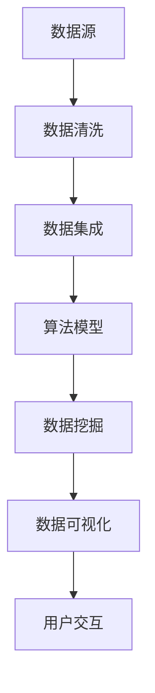

                 

# 知识发现引擎与人类认知极限的突破

## 1. 背景介绍

### 1.1 问题由来

在信息爆炸的时代，人类的认知能力面临着前所未有的挑战。尽管信息技术的发展极大地丰富了人类的知识库，但与此同时，海量数据和复杂信息也为认知过程带来了巨大的负担。如何从浩如烟海的数据中快速、准确地发现知识，是当前认知科学与人工智能领域的重要课题。

知识发现(Knowledge Discovery, KD)是指从数据中自动或半自动地发现和提取有价值信息的科学和技术。其目标是从大规模、多源、异构的数据中挖掘出蕴含的知识、模式和规律，辅助人类做出更明智的决策。知识发现引擎作为知识发现的核心工具，旨在通过算法和技术的力量，突破人类认知的极限，提升人类处理和理解复杂信息的能力。

### 1.2 问题核心关键点

知识发现引擎的核心在于其强大的数据处理能力、高效的算法模型和先进的用户交互界面。其关键点包括：

- **数据处理**：高效的数据清洗、转换和集成，确保数据的质量和一致性。
- **算法模型**：先进的机器学习和统计学习算法，用于挖掘数据中的知识模式。
- **用户交互**：直观、友好的用户界面，使非技术用户也能轻松地使用知识发现引擎，探索数据中的有趣发现。

知识发现引擎的应用范围广泛，涵盖了金融、医疗、教育、商业等多个领域。其核心能力包括：

- 数据清洗：去除数据中的噪声和缺失值，确保数据质量。
- 数据集成：将来自不同源的数据进行整合，形成统一的数据视图。
- 数据挖掘：利用先进的算法模型从数据中发现关联规则、分类模式、聚类结构等知识。
- 数据可视化：通过图表、地图等形式展示分析结果，帮助用户理解和利用知识。

## 2. 核心概念与联系

### 2.1 核心概念概述

知识发现引擎基于现代信息技术和大数据技术，通过各种算法模型从海量数据中自动发现知识。其核心概念包括：

- **数据源**：知识发现引擎的数据源可以是来自不同系统的数据，如关系型数据库、非关系型数据库、Web数据、日志数据等。
- **数据清洗**：清洗数据中的噪声、缺失值和不一致性，确保数据的质量。
- **数据集成**：将来自不同源的数据进行合并和转换，形成一个统一的数据集。
- **算法模型**：常用的算法模型包括关联规则学习、分类、聚类、回归、深度学习等。
- **数据挖掘**：从数据中发现规律、模式和关联，提取知识。
- **数据可视化**：将分析结果以图表、地图等形式展示，帮助用户理解数据。
- **用户交互**：提供友好的用户界面，使非技术用户也能使用知识发现引擎。

这些核心概念通过以下Mermaid流程图来展示其联系：



这个流程图展示了知识发现引擎的主要工作流程：

1. 从各种数据源收集数据。
2. 对数据进行清洗和集成，形成统一的数据集。
3. 使用算法模型对数据进行挖掘，发现其中的规律和模式。
4. 将挖掘结果可视化，帮助用户理解数据。
5. 提供友好的用户界面，方便用户交互和探索数据。

## 3. 核心算法原理 & 具体操作步骤

### 3.1 算法原理概述

知识发现引擎的核心算法原理是基于数据挖掘和统计学习技术的。其基本流程包括数据预处理、模型训练和结果解释三个部分：

1. **数据预处理**：包括数据清洗、数据集成和数据变换等步骤，确保数据的质量和一致性。
2. **模型训练**：使用机器学习或统计学习算法，从数据中学习模式和规律。
3. **结果解释**：将模型挖掘出的知识进行可视化展示，帮助用户理解和应用。

### 3.2 算法步骤详解

知识发现引擎的算法步骤主要包括以下几个关键步骤：

**Step 1: 数据收集和预处理**

- 收集来自不同系统的数据，如数据库、Web爬虫、传感器等。
- 清洗数据中的噪声和缺失值，确保数据质量。
- 对数据进行转换和归一化，形成统一的数据格式。

**Step 2: 数据集成**

- 使用数据集成技术，如E-R模型、数据融合算法等，将来自不同源的数据进行合并和转换。
- 处理数据冲突和不一致性，确保数据的一致性。

**Step 3: 模型训练和数据挖掘**

- 选择合适的算法模型，如分类、聚类、关联规则等，对数据进行挖掘。
- 使用训练数据集，对模型进行训练，调整模型参数以提高精度。
- 使用测试数据集，评估模型性能，确保模型的泛化能力。

**Step 4: 结果解释**

- 将挖掘出的知识进行可视化展示，如图表、地图等。
- 提供友好的用户界面，使非技术用户也能轻松理解分析结果。
- 根据用户需求，对结果进行定制化展示，帮助用户发现和利用知识。

### 3.3 算法优缺点

知识发现引擎的算法具有以下优点：

- **自动化**：通过自动化算法和工具，大幅度提高了数据挖掘的效率。
- **泛化能力**：基于先进算法模型，能够从大量数据中发现泛化的规律和模式。
- **用户友好**：友好的用户界面，使非技术用户也能轻松使用知识发现引擎，探索数据中的有趣发现。

但同时，知识发现引擎也存在一些局限性：

- **数据依赖**：需要高质量、完整的数据源，否则算法效果难以保证。
- **算法复杂**：复杂的算法模型可能需要大量计算资源和时间，难以在实时系统中应用。
- **结果解释**：复杂的分析结果可能难以直观理解，需要专业知识和技能。
- **用户门槛**：尽管用户界面友好，但仍然需要一定的技术背景才能深入使用。

### 3.4 算法应用领域

知识发现引擎在多个领域都有广泛应用，例如：

- **金融风控**：从交易数据中发现风险模式，预测欺诈行为，构建风险评估模型。
- **医疗诊断**：从病历数据中挖掘规律，辅助医生进行疾病诊断和治疗方案设计。
- **市场营销**：从客户数据中发现购买模式，进行个性化营销和精准推荐。
- **智能制造**：从生产数据中发现设备故障模式，进行预防性维护和优化生产流程。
- **自然语言处理**：从文本数据中发现关联模式，构建知识图谱和语义网络。

除了这些经典应用外，知识发现引擎还在智慧城市、环境监测、社交媒体分析等多个领域展示了强大的能力。随着技术的不断进步，其应用范围和深度将继续拓展，为人类社会带来更多的价值。

## 4. 数学模型和公式 & 详细讲解 & 举例说明

### 4.1 数学模型构建

知识发现引擎的数学模型构建主要基于统计学习理论和机器学习算法。常见的数学模型包括回归模型、分类模型、聚类模型、关联规则模型等。

以回归模型为例，其数学模型构建如下：

$$
y = \theta_0 + \sum_{i=1}^n \theta_i x_i + \epsilon
$$

其中，$y$ 为预测目标，$x_i$ 为输入特征，$\theta_i$ 为特征权重，$\epsilon$ 为误差项。

### 4.2 公式推导过程

以线性回归模型为例，其基本推导过程如下：

1. **最小二乘法**：使用最小二乘法求解模型参数 $\theta_i$，使得预测误差最小化。
2. **正则化**：在误差最小化的基础上，加入正则项，防止过拟合。
3. **模型评估**：使用测试数据集，评估模型的泛化能力，选择合适的模型参数。

### 4.3 案例分析与讲解

以金融风险预测为例，我们构建一个基于线性回归的预测模型：

假设我们有一个包含交易数据的金融数据集，其中每个样本包含多个特征，如交易金额、交易时间、交易类型等。我们希望预测这些交易是否为欺诈行为。

- **数据预处理**：对数据进行清洗和集成，确保数据质量。
- **模型训练**：使用线性回归模型，对训练集进行训练，求解模型参数。
- **结果解释**：将训练好的模型应用于测试集，评估预测结果，可视化展示。

## 5. 项目实践：代码实例和详细解释说明

### 5.1 开发环境搭建

知识发现引擎的开发通常使用Python编程语言，配合多种开源工具和库。以下是开发环境搭建的步骤：

1. 安装Python：从官网下载并安装Python 3.x版本。
2. 安装Pandas、NumPy、Scikit-Learn等数据处理和机器学习库。
3. 安装Matplotlib、Seaborn等数据可视化库。
4. 安装Jupyter Notebook或PyCharm等开发环境。

### 5.2 源代码详细实现

以下是一个简单的线性回归模型实现示例：

```python
import pandas as pd
from sklearn.linear_model import LinearRegression
import matplotlib.pyplot as plt

# 读取数据
data = pd.read_csv('transaction_data.csv')

# 数据预处理
X = data[['amount', 'time', 'type']]  # 输入特征
y = data['is_fraud']  # 输出目标

# 模型训练
model = LinearRegression()
model.fit(X, y)

# 结果解释
y_pred = model.predict(X)
plt.scatter(X['amount'], y)
plt.plot(X['amount'], y_pred, color='red')
plt.show()
```

### 5.3 代码解读与分析

**数据预处理**：
- `pd.read_csv('transaction_data.csv')`：读取交易数据。
- `X = data[['amount', 'time', 'type']]`：提取输入特征。
- `y = data['is_fraud']`：提取输出目标。

**模型训练**：
- `model = LinearRegression()`：初始化线性回归模型。
- `model.fit(X, y)`：训练模型，求解参数。

**结果解释**：
- `y_pred = model.predict(X)`：对测试集进行预测。
- `plt.scatter(X['amount'], y)`：绘制散点图。
- `plt.plot(X['amount'], y_pred, color='red')`：绘制拟合直线。

## 6. 实际应用场景

### 6.1 金融风控

在金融风控领域，知识发现引擎可以帮助银行和金融机构识别和预测欺诈行为，构建风险评估模型。通过分析交易数据，挖掘其中的规律和模式，可以构建欺诈检测模型，实时监控交易行为，及时发现和预防欺诈行为。

### 6.2 医疗诊断

在医疗诊断领域，知识发现引擎可以从病历数据中挖掘出疾病发生和发展的规律，辅助医生进行疾病诊断和治疗方案设计。通过分析患者的症状、实验室检查结果等数据，可以构建预测模型，预测疾病风险，提供个性化的诊疗建议。

### 6.3 市场营销

在市场营销领域，知识发现引擎可以帮助企业进行客户分析和个性化营销。通过分析客户购买数据、浏览行为等，可以挖掘客户的购买模式和偏好，构建个性化推荐系统，提升客户满意度和忠诚度。

### 6.4 智能制造

在智能制造领域，知识发现引擎可以从生产数据中发现设备故障模式，进行预防性维护和优化生产流程。通过分析设备运行数据，可以挖掘设备故障的规律和原因，构建故障预测模型，提高设备的可靠性和生产效率。

### 6.5 自然语言处理

在自然语言处理领域，知识发现引擎可以从文本数据中发现关联模式，构建知识图谱和语义网络。通过分析文本数据，可以挖掘出词汇之间的关系和语义，构建知识图谱，辅助自然语言理解和生成。

## 7. 工具和资源推荐

### 7.1 学习资源推荐

为了帮助开发者系统掌握知识发现引擎的理论基础和实践技巧，这里推荐一些优质的学习资源：

1. 《统计学习方法》：李航教授的经典教材，系统介绍了统计学习的基本概念和算法。
2. 《机器学习》：周志华教授的机器学习教材，涵盖了机器学习的各个方面。
3. 《Python数据科学手册》：Jake VanderPlas的著作，介绍了Python在数据科学中的应用。
4. 《RapidMiner平台教程》：RapidMiner的官方文档和教程，介绍了RapidMiner平台的使用方法和应用场景。
5. 《Kaggle数据科学竞赛》：Kaggle的数据科学竞赛平台，提供了大量实际应用场景的案例和数据集。

### 7.2 开发工具推荐

高效的开发离不开优秀的工具支持。以下是几款用于知识发现引擎开发的常用工具：

1. Python：灵活易用的编程语言，广泛用于数据处理和机器学习开发。
2. RapidMiner：直观易用的数据科学平台，提供了强大的数据挖掘和可视化工具。
3. Tableau：流行的数据可视化工具，适合非技术人员使用。
4. Jupyter Notebook：灵活的开发环境，支持代码、数据和文档的结合展示。
5. PyCharm：强大的Python开发环境，提供代码编辑、调试和测试功能。

### 7.3 相关论文推荐

知识发现引擎的研究始于20世纪90年代，经历了数十年的发展。以下是几篇奠基性的相关论文，推荐阅读：

1. J. Han, M. Kamber. Mining of Association Rules in Large Databases. 1998.
2. C. Jones, T. Bibeau. The Web as a knowledge source: Technologies and models for integrating web data into information systems. 2001.
3. J. Quinlan. Induction of decision trees. 1986.
4. G. Hinton, R. Salakhutdinov. Reducing the Dimensionality of Data with Neural Networks. 2006.
5. Y. Bengio, G. Hinton, S. Kingsbury. Generative Adversarial Nets. 2014.

这些论文代表了大规模数据挖掘和知识发现技术的早期成果，为后续的研究奠定了基础。

## 8. 总结：未来发展趋势与挑战

### 8.1 总结

本文对知识发现引擎的原理和应用进行了全面系统的介绍。首先阐述了知识发现引擎的背景和重要性，明确了其在多个领域的应用价值。其次，从原理到实践，详细讲解了知识发现引擎的算法原理和具体操作步骤，给出了实际应用中的代码实现示例。最后，本文还广泛探讨了知识发现引擎在金融风控、医疗诊断、市场营销等领域的实际应用，展示了其广泛的应用前景。

通过本文的系统梳理，可以看到，知识发现引擎作为数据驱动的关键工具，在多个领域展示了强大的能力，帮助人类突破认知极限，高效处理和利用海量数据。未来，伴随技术的发展和应用场景的拓展，知识发现引擎必将进一步发挥其重要作用，为人类社会带来更多的价值。

### 8.2 未来发展趋势

展望未来，知识发现引擎将呈现以下几个发展趋势：

1. **自动化**：随着机器学习和深度学习的发展，知识发现引擎将更加自动化，能够自动处理和分析复杂数据，减少人工干预。
2. **跨领域**：知识发现引擎将进一步跨领域应用，从单一领域的数据挖掘扩展到多领域的数据融合和知识发现。
3. **实时性**：随着实时数据分析技术的发展，知识发现引擎将具备实时分析能力，能够及时响应和处理海量数据。
4. **可解释性**：未来的知识发现引擎将更加注重结果的可解释性，通过可视化、自然语言生成等技术，使分析结果更易于理解和应用。
5. **用户友好**：更加友好的用户界面和交互方式，使非技术人员也能轻松使用知识发现引擎，探索数据中的有趣发现。

这些趋势展示了知识发现引擎未来发展的广阔前景，必将进一步推动人工智能技术和数据的融合应用，为人类社会带来更多的价值。

### 8.3 面临的挑战

尽管知识发现引擎已经取得了显著的进展，但在迈向更加智能化、普适化应用的过程中，仍面临诸多挑战：

1. **数据质量**：数据质量问题仍然是一个重要挑战，高质量、完整的数据源是知识发现引擎的核心前提。
2. **算法复杂度**：复杂的算法模型需要大量计算资源和时间，难以在实时系统中应用。
3. **结果解释**：复杂的分析结果可能难以直观理解，需要专业知识和技能。
4. **用户门槛**：尽管用户界面友好，但仍然需要一定的技术背景才能深入使用。

### 8.4 研究展望

未来的研究需要在以下几个方面寻求新的突破：

1. **自动化算法**：开发更加自动化、智能化的算法模型，减少人工干预，提高数据挖掘的效率。
2. **跨领域知识**：将不同领域的数据进行融合，挖掘跨领域的知识关联，拓展知识发现引擎的应用范围。
3. **实时分析**：开发实时数据分析技术，使知识发现引擎能够及时响应和处理海量数据。
4. **可解释性技术**：研究可解释性技术，提高分析结果的可理解性，使非技术人员也能轻松使用。
5. **用户界面优化**：设计更加友好的用户界面和交互方式，使非技术人员也能轻松使用知识发现引擎。

这些研究方向展示了知识发现引擎未来发展的方向，必将进一步推动人工智能技术和数据的融合应用，为人类社会带来更多的价值。

## 9. 附录：常见问题与解答

**Q1：知识发现引擎与数据分析有什么区别？**

A: 知识发现引擎和数据分析都是数据处理和分析的重要工具，但二者的区别在于其目标和功能。数据分析的主要目标是描述数据特征，帮助用户理解数据的基本情况；而知识发现引擎的目标是从数据中自动发现和提取有价值的信息，辅助用户做出决策。

**Q2：知识发现引擎对数据质量有哪些要求？**

A: 知识发现引擎对数据质量的要求非常高，需要确保数据的准确性、完整性和一致性。具体要求包括：

1. 数据清洗：去除数据中的噪声和缺失值。
2. 数据集成：将来自不同源的数据进行整合和转换，确保数据的一致性。
3. 数据变换：对数据进行归一化、标准化等处理，确保数据的标准化。

**Q3：知识发现引擎的核心算法是什么？**

A: 知识发现引擎的核心算法包括机器学习算法、统计学习算法和数据挖掘算法。常见的算法包括分类、聚类、回归、关联规则等。

**Q4：知识发现引擎在实际应用中有哪些局限性？**

A: 知识发现引擎在实际应用中存在一些局限性，包括：

1. 数据依赖：需要高质量、完整的数据源。
2. 算法复杂：复杂的算法模型需要大量计算资源和时间。
3. 结果解释：复杂的分析结果可能难以直观理解。
4. 用户门槛：尽管用户界面友好，但仍然需要一定的技术背景。

**Q5：如何提高知识发现引擎的实时分析能力？**

A: 提高知识发现引擎的实时分析能力，可以从以下几个方面入手：

1. 优化算法模型：使用高效的算法模型，减少计算时间和资源消耗。
2. 分布式计算：采用分布式计算技术，提高数据处理速度。
3. 数据流处理：使用数据流处理技术，实时处理和分析数据。
4. 内存计算：使用内存计算技术，提高数据处理速度和效率。

**Q6：知识发现引擎的未来发展方向是什么？**

A: 知识发现引擎的未来发展方向包括：

1. 自动化算法：开发更加自动化、智能化的算法模型，减少人工干预。
2. 跨领域知识：将不同领域的数据进行融合，挖掘跨领域的知识关联。
3. 实时分析：开发实时数据分析技术，使知识发现引擎能够及时响应和处理海量数据。
4. 可解释性技术：研究可解释性技术，提高分析结果的可理解性。
5. 用户界面优化：设计更加友好的用户界面和交互方式。

通过这些问题和解答，可以帮助读者更好地理解知识发现引擎的概念、原理和应用，把握其未来的发展方向。

