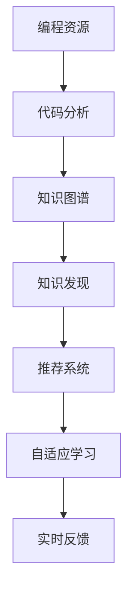
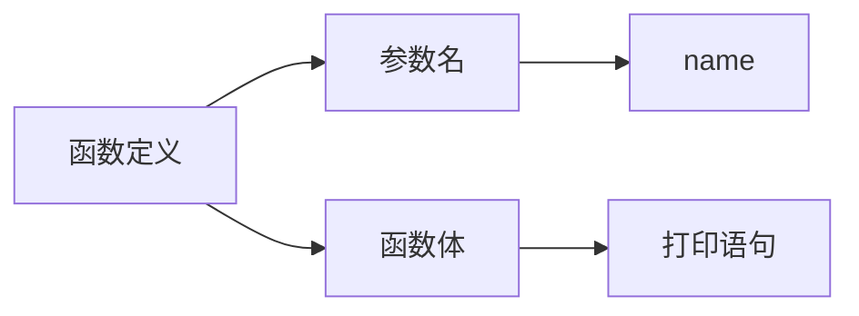
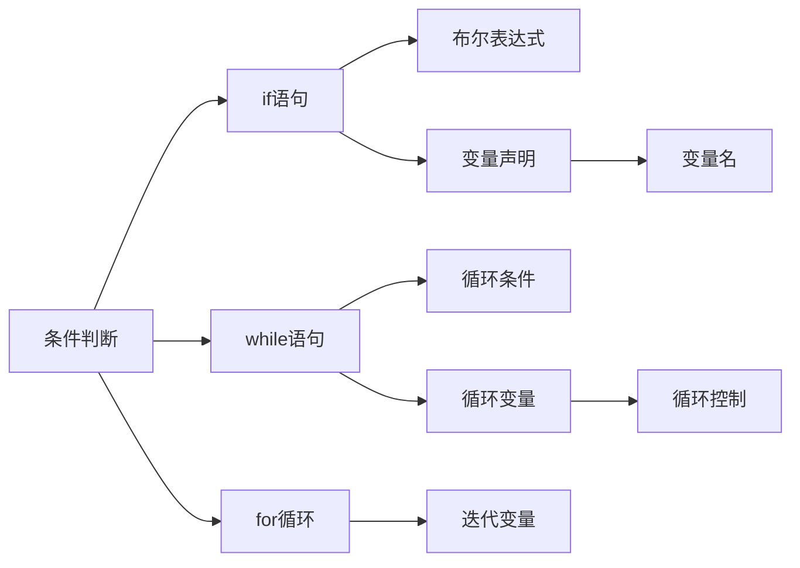

                 

# 知识发现引擎助力程序员技能提升

## 1. 背景介绍

在软件工程领域，程序设计是一项高度复杂且不断进化的技能。传统的学习方式往往依赖于静态的教学资源，如书籍、视频和教程，这种方式通常效率低下，难以适应快速变化的编程环境。为了应对这一挑战，现代知识发现引擎逐渐成为提升程序员技能的关键工具。本文将详细探讨知识发现引擎的工作原理、核心算法以及实际应用案例，帮助程序员利用这一先进技术实现技能提升。

## 2. 核心概念与联系

### 2.1 核心概念概述

- **知识发现引擎**：指通过分析和挖掘海量编程数据，自动化地发现、归纳和传播编程知识的工具。它可以基于文本分析、代码分析等技术，提取代码片段、编程技巧、常见错误和最佳实践等信息，帮助程序员学习新技能，避免重复错误。
- **编程知识**：包括编程语言的语法、语义、常见编程模式、最佳实践和最佳编码标准等。
- **自适应学习**：通过个性化的推荐和反馈，帮助程序员针对性地提升技能。
- **实时反馈**：利用代码执行分析和自动化测试工具，提供即时反馈，帮助程序员及时修正错误和优化代码。
- **知识图谱**：使用图结构组织和表示编程知识，便于发现和应用知识之间的关联。

### 2.2 核心概念原理和架构的 Mermaid 流程图



## 3. 核心算法原理 & 具体操作步骤

### 3.1 算法原理概述

知识发现引擎的核心算法主要包括以下几个方面：

1. **代码分析与模式提取**：对源代码进行静态和动态分析，提取代码片段、编程模式和反模式。
2. **知识图谱构建**：将提取出的代码片段和编程模式，映射到图谱中，形成结构化的知识体系。
3. **知识发现与关联**：通过图谱中的节点和边，发现知识间的关联和结构，实现知识的横向和纵向关联。
4. **推荐系统设计**：利用机器学习算法和统计模型，对程序员的技能需求和已有知识进行匹配，提供个性化的编程知识推荐。
5. **自适应学习与实时反馈**：通过智能算法，对程序员的编程行为进行跟踪和分析，提供个性化反馈和建议，辅助编程过程。

### 3.2 算法步骤详解

#### 步骤1：数据收集与预处理
知识发现引擎首先需要从各种编程资源中收集数据，包括代码片段、编程文档、论坛帖子、编程博客等。然后，对收集到的数据进行预处理，清洗噪声和无用信息，保留结构化和有价值的内容。

#### 步骤2：代码分析与模式提取
使用静态分析技术和动态分析技术，对源代码进行分析，识别出代码片段、编程模式和反模式。例如，可以使用抽象语法树(AST)分析技术，识别代码中的语法结构和关键模块，提取常用的编程模式。

#### 步骤3：知识图谱构建
将提取出的代码片段和编程模式，映射到图谱中，形成结构化的知识体系。图谱中的节点代表知识元素，如代码片段、编程模式、编程语言特性等；边代表知识元素之间的关系，如继承、关联、实例化等。

#### 步骤4：知识发现与关联
通过图谱中的节点和边，发现知识间的关联和结构，实现知识的横向和纵向关联。例如，通过分析图谱中的关联关系，发现特定编程模式在不同场景下的应用，或者识别出相似代码片段的共性。

#### 步骤5：推荐系统设计
利用机器学习算法和统计模型，对程序员的技能需求和已有知识进行匹配，提供个性化的编程知识推荐。推荐系统可以根据程序员的技能水平、学习历史和当前任务，动态调整推荐策略，提供最合适的知识资源。

#### 步骤6：自适应学习与实时反馈
通过智能算法，对程序员的编程行为进行跟踪和分析，提供个性化反馈和建议，辅助编程过程。例如，当程序员遇到常见编程问题时，知识发现引擎可以提供相应的解决方案和最佳实践。

### 3.3 算法优缺点

**优点**：

1. **高效性**：自动化的知识发现和推荐过程，减少了手动查找编程资源的时间，提高了学习效率。
2. **个性化**：基于程序员的技能水平和编程历史，提供个性化的知识推荐，满足了不同层次的需求。
3. **实时反馈**：利用代码执行分析和自动化测试工具，提供即时反馈，帮助程序员及时修正错误和优化代码。
4. **自适应性**：根据程序员的编程行为和反馈，动态调整推荐策略，提供最合适的知识资源。

**缺点**：

1. **数据依赖**：知识发现引擎的效果很大程度上依赖于编程资源的质量和完整性，数据的不足可能导致推荐效果不佳。
2. **复杂性**：构建知识图谱和推荐系统涉及复杂的算法和模型，需要较高的技术门槛。
3. **隐私问题**：在收集和分析编程数据时，可能涉及用户隐私和数据安全问题，需要采取相应的措施保护用户信息。

### 3.4 算法应用领域

知识发现引擎已经在多个编程领域得到应用，例如：

- **软件开发**：帮助程序员提升代码质量和编程效率，发现和修复常见错误。
- **数据分析**：提取数据处理和分析模式，提供最佳实践和解决方案。
- **测试自动化**：自动化测试过程中，发现测试用例和测试数据中的问题和模式。
- **文档编写**：提取编程语言文档中的知识，辅助编写高质量的API文档和用户手册。
- **项目管理**：识别项目中的风险和瓶颈，提供项目优化和改进的建议。

## 4. 数学模型和公式 & 详细讲解

### 4.1 数学模型构建

知识发现引擎的数学模型通常包括以下几个部分：

1. **代码表示模型**：使用抽象语法树(AST)、标记(token)序列或向量表示等方法，将源代码表示为数学模型。
2. **知识图谱模型**：使用图结构表示编程知识，包括节点和边。
3. **推荐系统模型**：使用协同过滤、基于内容的推荐、深度学习模型等方法，实现个性化推荐。

### 4.2 公式推导过程

#### 代码表示模型的推导
假设源代码 $C$ 可以表示为一个标记序列 $S=\{s_1,s_2,\dots,s_n\}$，其中 $s_i$ 表示第 $i$ 个标记。将标记序列转化为向量表示 $V=\{v_1,v_2,\dots,v_n\}$，其中 $v_i$ 表示第 $i$ 个标记的向量表示。

#### 知识图谱模型的推导
假设知识图谱中有一个节点 $N$，表示编程模式 $P$。该节点的度数为 $d$，表示与之相关联的编程模式数量。每个编程模式的向量表示为 $V_P$，则该节点在图谱中的向量表示为：

$$ V_N = \sum_{i=1}^d \alpha_i V_{P_i} $$

其中 $\alpha_i$ 为权重，表示编程模式 $P_i$ 对节点 $N$ 的重要程度。

#### 推荐系统模型的推导
假设推荐系统包含 $K$ 个编程知识资源，每个资源的向量表示为 $V_k$。程序员的技能需求向量为 $V_s$。推荐系统的目标是最小化资源与技能需求的余弦距离，即：

$$ \min_{\theta} \sum_{k=1}^K || V_k - V_s ||^2 $$

其中 $\theta$ 为资源的权重向量，满足 $\sum_{k=1}^K \theta_k = 1$。

### 4.3 案例分析与讲解

#### 案例1：代码片段提取
假设有一个代码片段：

```python
def greet(name):
    print("Hello, " + name)
```

使用AST分析技术，可以提取该代码片段的结构如下：



#### 案例2：知识图谱构建
假设有一个图谱，表示常见的编程模式和相关联的编程语言特性，如下：



通过图谱，可以发现条件判断模式在不同编程语言特性下的应用和关联。

## 5. 项目实践：代码实例和详细解释说明

### 5.1 开发环境搭建

开发知识发现引擎需要具备以下环境：

- **编程语言**：Python、Java、C++等。
- **数据分析工具**：Pandas、NumPy、Scikit-learn 等。
- **知识图谱工具**：Neo4j、Gephi 等。
- **推荐系统库**：Scikit-learn、TensorFlow、PyTorch 等。

### 5.2 源代码详细实现

以下是一个简单的Python代码片段，演示如何使用代码分析技术提取编程模式：

```python
import ast

def extract_code_pattern(code):
    tree = ast.parse(code)
    patterns = []
    for node in ast.walk(tree):
        if isinstance(node, ast.FunctionDef):
            patterns.append("函数定义")
        elif isinstance(node, ast.If):
            patterns.append("条件判断")
        elif isinstance(node, ast.For):
            patterns.append("for循环")
    return patterns
```

该代码使用了Python的抽象语法树分析库ast，对代码片段进行分析，提取出其中的编程模式。

### 5.3 代码解读与分析

**代码解读**：

- 首先导入Python的抽象语法树分析库ast。
- 定义一个函数`extract_code_pattern`，接收代码片段作为输入。
- 使用`ast.parse`方法将代码片段解析为抽象语法树。
- 遍历抽象语法树中的所有节点，判断节点的类型，提取编程模式。
- 返回提取出的编程模式列表。

**代码分析**：

- 该代码使用了Python内置的ast模块，对代码片段进行静态分析，提取其中的编程模式。
- 代码分析的过程可以进一步优化，例如使用更高级的语法分析工具，提取更细粒度的代码结构。
- 提取出的编程模式可以进一步映射到知识图谱中，构建完整的知识体系。

### 5.4 运行结果展示

运行上述代码，对以下代码片段进行分析：

```python
def greet(name):
    print("Hello, " + name)
```

输出结果为：

```python
['函数定义']
```

说明该代码片段包含一个函数定义模式。

## 6. 实际应用场景

### 6.1 软件开发

知识发现引擎可以应用于软件开发过程中，提升程序员的技能和代码质量。例如，当程序员遇到常见问题时，知识发现引擎可以提供相应的解决方案和最佳实践，帮助程序员快速解决问题。

### 6.2 数据分析

知识发现引擎可以提取数据处理和分析模式，提供最佳实践和解决方案。例如，在数据清洗和预处理过程中，发现和修复常见错误，提高数据处理效率和质量。

### 6.3 测试自动化

知识发现引擎可以自动化测试过程中，发现测试用例和测试数据中的问题和模式，提供相应的改进建议，优化测试过程。

### 6.4 文档编写

知识发现引擎可以提取编程语言文档中的知识，辅助编写高质量的API文档和用户手册，提升文档的可读性和实用性。

### 6.5 项目管理

知识发现引擎可以识别项目中的风险和瓶颈，提供项目优化和改进的建议，帮助团队高效管理项目。

## 7. 工具和资源推荐

### 7.1 学习资源推荐

- **在线课程**：Coursera、edX、Udacity 等平台上的编程语言和数据分析课程。
- **文档与教程**：Python官方文档、Java官方文档、C++官方文档等。
- **开源社区**：GitHub、Stack Overflow、Stack Exchange 等。

### 7.2 开发工具推荐

- **IDE集成工具**：Visual Studio Code、IntelliJ IDEA、Eclipse 等。
- **代码分析工具**：SonarQube、Checkstyle、PMD 等。
- **版本控制工具**：Git、SVN 等。

### 7.3 相关论文推荐

- "Mining Software Repositories for Code Quality"：研究了如何从源代码中挖掘编程模式和代码质量指标。
- "Knowledge Discovery and Mining in Software Engineering"：综述了知识发现和挖掘在软件工程中的应用。
- "Recommender Systems for Software Engineering"：介绍了如何应用推荐系统技术，提升软件开发和测试的效率。

## 8. 总结：未来发展趋势与挑战

### 8.1 未来发展趋势

未来，知识发现引擎将呈现以下几个发展趋势：

1. **智能化**：通过深度学习和自然语言处理技术，提升代码分析和知识发现的准确性和智能化水平。
2. **自适应**：根据程序员的技能水平和编程历史，动态调整推荐策略，提供个性化的知识推荐。
3. **跨平台**：支持多编程语言和平台，提供统一的编程知识库和推荐服务。
4. **实时化**：通过在线分析和推荐，实现知识发现的实时化，提升程序员的学习效率。
5. **自动化**：自动化发现、分析和推荐编程知识，减少人工干预，提高开发效率。

### 8.2 面临的挑战

1. **数据多样性**：不同编程语言和框架的代码风格和语法差异较大，需要构建统一的知识图谱和分析模型。
2. **性能瓶颈**：大规模代码分析和知识图谱构建需要高性能的计算资源，如何提高处理效率是一个重要挑战。
3. **隐私问题**：在收集和分析编程数据时，可能涉及用户隐私和数据安全问题，需要采取相应的措施保护用户信息。
4. **知识偏见**：知识图谱和推荐系统可能存在偏见，需要采取公平性和可解释性的措施，避免对某些群体的不公平对待。

### 8.3 研究展望

未来的研究可以从以下几个方向进行：

1. **多模态知识融合**：结合代码、文档、评论等多种数据源，构建更全面、丰富的知识图谱。
2. **自动化知识生成**：通过自动化生成工具，将专家知识转化为可操作的知识片段和模式。
3. **智能知识图谱构建**：使用机器学习技术，自动发现和构建知识图谱中的关联和结构。
4. **推荐系统优化**：应用更先进的推荐算法和模型，提升个性化推荐的精度和效率。
5. **自适应学习机制**：基于程序员的学习行为和反馈，动态调整学习策略，提升学习效果。

## 9. 附录：常见问题与解答

**Q1：知识发现引擎是否适用于所有编程语言和框架？**

A: 知识发现引擎需要针对不同的编程语言和框架进行适配，以构建相应的知识图谱和分析模型。目前，已经有多款知识发现引擎支持常见的编程语言和框架，但更多语言的适配还需要进一步研究。

**Q2：如何使用知识发现引擎进行编程学习？**

A: 知识发现引擎通常提供API接口，可以与开发环境集成，提供实时的编程指导和建议。具体使用方法如下：
1. 安装知识发现引擎的SDK。
2. 在开发环境中设置SDK配置。
3. 使用SDK提供的API接口，获取编程知识和建议。
4. 根据建议修改代码，提升编程技能。

**Q3：知识发现引擎在大型团队中如何使用？**

A: 知识发现引擎可以集成到团队的开发工具链中，提供统一的知识管理和推荐服务。具体使用方法如下：
1. 部署知识发现引擎的服务端。
2. 在开发工具中集成知识发现引擎的API接口。
3. 团队成员可以在开发过程中获取知识建议，提升代码质量和编程效率。
4. 定期更新知识图谱和推荐模型，优化知识服务的质量。

---

作者：禅与计算机程序设计艺术 / Zen and the Art of Computer Programming

