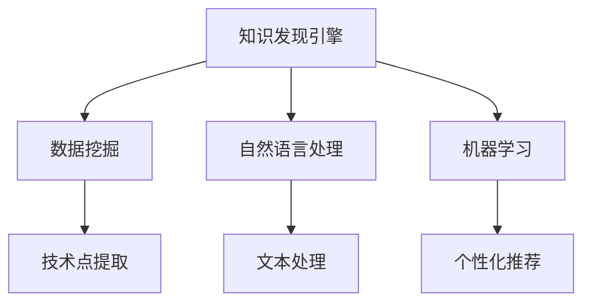
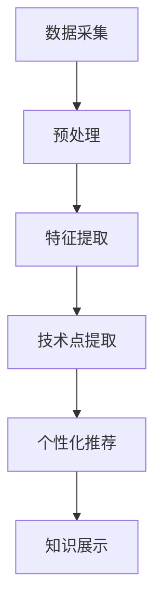

                 

# 知识发现引擎助力程序员技能更新

> 关键词：知识发现引擎, 程序员, 技能更新, 数据挖掘, 机器学习, 编程语言, 软件工程, 编程竞赛

## 1. 背景介绍

### 1.1 问题由来

在现代软件开发领域，技术的快速迭代和更新要求程序员不断学习新知识以保持竞争力。然而，当前的知识获取方式已经无法满足这一需求：

- **信息过载**：互联网上充斥着海量信息，但质量参差不齐，难以甄别。
- **碎片化学习**：缺乏系统的知识体系，难以构建结构化的知识网络。
- **知识获取效率低**：传统的手翻文档、试错学习的方式效率低下，无法快速更新技能。

面对这些挑战，**知识发现引擎**作为一种智能化的信息检索工具应运而生。知识发现引擎利用数据挖掘和机器学习技术，自动分析和挖掘出编程社区、技术博客、技术论坛中的高质量知识，帮助程序员更高效地学习新技能。

### 1.2 问题核心关键点

知识发现引擎的核心在于其能够：
- 自动从大量文本中提取有价值的技术点。
- 根据程序员的背景和兴趣，推荐个性化的学习材料。
- 提供实时反馈和进度跟踪，帮助程序员按计划学习。

这些特性使得知识发现引擎成为程序员技能更新的有力助手。接下来，我们将从其工作原理、算法实现和实际应用等方面进行详细探讨。

## 2. 核心概念与联系

### 2.1 核心概念概述

在探讨知识发现引擎的原理之前，我们先了解一些相关概念：

- **知识发现(Knowledge Discovery, KD)**：从数据中自动发现有用知识和信息的过程。
- **数据挖掘(Data Mining)**：知识发现的一部分，从数据中寻找模式、规律和关联。
- **自然语言处理(Natural Language Processing, NLP)**：使计算机能理解、处理和生成人类语言的技术。
- **机器学习(Machine Learning, ML)**：让计算机从数据中学习规律和模式，并做出预测或决策的技术。
- **推荐系统(Recommendation System)**：根据用户行为和偏好推荐个性化物品的系统。

这些概念构成了知识发现引擎的技术基础。接下来，我们将通过一个Mermaid流程图来展示这些概念之间的联系：



这个流程图展示了知识发现引擎的基本工作流程：

1. 从编程社区、技术博客、技术论坛等数据源中收集文本数据。
2. 使用数据挖掘技术提取其中的技术点。
3. 利用自然语言处理技术处理文本数据。
4. 使用机器学习技术分析用户行为和偏好，生成个性化推荐。

### 2.2 核心概念原理和架构

知识发现引擎的核心原理包括以下几个步骤：

- **数据采集**：从多个数据源收集文本数据，包括编程社区、技术博客、技术论坛等。
- **预处理**：对收集到的文本进行分词、去除停用词、词性标注等预处理操作。
- **特征提取**：通过TF-IDF、Word2Vec等方法提取文本中的特征。
- **技术点提取**：利用数据挖掘技术，如关联规则、聚类分析等，从特征中提取技术点。
- **个性化推荐**：根据用户的历史行为和兴趣，使用协同过滤、基于内容的推荐算法生成个性化推荐。
- **知识展示**：将推荐的技术点以列表、卡片、文章等形式展示给用户。

这些步骤在知识发现引擎的架构中对应不同的组件：



其中，数据采集和预处理模块负责数据清洗和特征提取；技术点提取模块利用数据挖掘技术对文本数据进行分析；个性化推荐模块使用机器学习算法对用户行为进行建模；知识展示模块则负责将推荐结果呈现给用户。

## 3. 核心算法原理 & 具体操作步骤

### 3.1 算法原理概述

知识发现引擎的核心算法基于**基于内容的推荐系统**和**协同过滤算法**。

**基于内容的推荐系统**：根据用户的历史行为和兴趣，从海量的文本数据中筛选出与用户兴趣相关的内容。其核心在于特征提取和相似度计算。

**协同过滤算法**：根据用户的相似性，推荐用户可能感兴趣的内容。常见的协同过滤算法包括基于用户的协同过滤和基于项目的协同过滤。

### 3.2 算法步骤详解

#### 3.2.1 数据采集和预处理

1. **数据采集**：
   - 使用Web爬虫从编程社区、技术博客、技术论坛等平台收集文本数据。
   - 过滤掉低质量数据，如广告、噪声等。

2. **数据预处理**：
   - **分词**：将文本分解为单词或词组。
   - **去除停用词**：去除无实际意义的高频词，如“的”、“是”等。
   - **词性标注**：对每个单词进行词性标注，如名词、动词等。
   - **文本清洗**：去除HTML标签、特殊符号等无关信息。

#### 3.2.2 特征提取

1. **TF-IDF**（Term Frequency-Inverse Document Frequency）：计算每个单词在文本中的重要程度。
   - 公式：$$TF(x) = \frac{n(x)}{\sum n(i)}$$
   - 公式：$$IDF(x) = \log{\frac{N}{1 + \sum_{i=1}^n n(i)}}$$
   - 公式：$$TF-IDF(x) = TF(x) \cdot IDF(x)$$
   其中，$n(x)$ 表示单词 $x$ 在文本中出现的次数，$N$ 为文本总数。

2. **Word2Vec**：将单词转换为向量表示。
   - 公式：$$\vec{v}(x) = \sum_{i=1}^k \alpha_i \vec{t}_i$$
   其中，$\vec{v}(x)$ 表示单词 $x$ 的向量表示，$\vec{t}_i$ 表示第 $i$ 个神经元的输出，$\alpha_i$ 表示第 $i$ 个神经元的权重。

#### 3.2.3 技术点提取

1. **关联规则**：通过频繁项集挖掘技术，找出文本中的技术点组合。
   - 公式：$$L_k = \{(a, b) | \text{Supp}(a, b) \geq \minSupp\}$$
   其中，$L_k$ 表示频繁项集，$\text{Supp}(a, b)$ 表示组合 $(a, b)$ 的出现频率，$\minSupp$ 表示最小支持度阈值。

2. **聚类分析**：使用K-Means、DBSCAN等聚类算法，将文本数据划分为不同的主题。
   - 公式：$$k = \min\limits_{i=1}^m \left\{k_i\right\}$$
   其中，$k$ 表示聚类数目，$m$ 表示所有聚类数目。

#### 3.2.4 个性化推荐

1. **基于内容的推荐**：
   - 公式：$$\text{Recommendation}(x) = \text{Similarity}(x, \text{user}_k) \cdot \text{Rating}(x_k)$$
   其中，$\text{Similarity}(x, \text{user}_k)$ 表示用户 $k$ 对物品 $x$ 的相似度，$\text{Rating}(x_k)$ 表示物品 $x_k$ 的评分。

2. **基于协同过滤的推荐**：
   - 公式：$$\text{Recommendation}(x) = \sum_{i=1}^n \text{Similarity}(x, u_i) \cdot r_{i,k}$$
   其中，$\text{Similarity}(x, u_i)$ 表示物品 $x$ 和用户 $u_i$ 的相似度，$r_{i,k}$ 表示用户 $u_i$ 对物品 $x$ 的评分。

### 3.3 算法优缺点

**优点**：
- **高效性**：基于内容的推荐和协同过滤算法速度快，可以实时处理用户请求。
- **个性化**：根据用户行为和兴趣进行个性化推荐，提高用户满意度。
- **灵活性**：可以处理大规模数据，扩展性强。

**缺点**：
- **数据依赖性**：推荐质量依赖于文本数据的质量和数量。
- **冷启动问题**：新用户缺乏足够历史行为数据，难以推荐。
- **数据稀疏性**：用户行为数据和物品评分数据可能稀疏，影响推荐效果。

### 3.4 算法应用领域

知识发现引擎的应用领域广泛，包括但不限于：

- **编程学习**：帮助初学者学习编程语言、框架和工具。
- **技能提升**：为经验丰富的程序员提供最新的技术趋势和最佳实践。
- **项目管理**：推荐技术栈、开发工具等项目管理相关资源。
- **产品开发**：推荐适用于特定产品开发的技术点和方法。

## 4. 数学模型和公式 & 详细讲解 & 举例说明

### 4.1 数学模型构建

知识发现引擎的数学模型主要分为以下几个部分：

1. **文本表示**：将文本转换为向量表示，便于机器处理。
2. **技术点提取**：通过数据挖掘技术从向量中提取技术点。
3. **个性化推荐**：根据用户行为和兴趣进行个性化推荐。

### 4.2 公式推导过程

#### 4.2.1 文本表示

1. **TF-IDF 公式**：
   - 公式：$$TF(x) = \frac{n(x)}{\sum n(i)}$$
   - 公式：$$IDF(x) = \log{\frac{N}{1 + \sum_{i=1}^n n(i)}}$$
   - 公式：$$TF-IDF(x) = TF(x) \cdot IDF(x)$$

2. **Word2Vec 公式**：
   - 公式：$$\vec{v}(x) = \sum_{i=1}^k \alpha_i \vec{t}_i$$

#### 4.2.2 技术点提取

1. **关联规则公式**：
   - 公式：$$L_k = \{(a, b) | \text{Supp}(a, b) \geq \minSupp\}$$

2. **聚类分析公式**：
   - 公式：$$k = \min\limits_{i=1}^m \left\{k_i\right\}$$

#### 4.2.3 个性化推荐

1. **基于内容的推荐公式**：
   - 公式：$$\text{Recommendation}(x) = \text{Similarity}(x, \text{user}_k) \cdot \text{Rating}(x_k)$$

2. **基于协同过滤的推荐公式**：
   - 公式：$$\text{Recommendation}(x) = \sum_{i=1}^n \text{Similarity}(x, u_i) \cdot r_{i,k}$$

### 4.3 案例分析与讲解

假设我们有一个知识发现引擎，用于推荐Python编程相关的技术点。其推荐流程如下：

1. **数据采集**：从Python社区、博客和论坛中爬取相关文章。
2. **预处理**：对文本进行分词、去除停用词和词性标注。
3. **特征提取**：计算TF-IDF值和Word2Vec向量。
4. **技术点提取**：使用关联规则挖掘频繁出现的技术点组合。
5. **个性化推荐**：根据用户历史行为和兴趣，使用基于内容的推荐算法推荐相关技术点。

例如，一个Python初学者可能对“函数式编程”和“异步编程”感兴趣，那么知识发现引擎可能推荐相关文章和书籍，帮助他深入学习这两个技术点。

## 5. 项目实践：代码实例和详细解释说明

### 5.1 开发环境搭建

为了实践知识发现引擎，我们需要搭建一个开发环境。以下是搭建环境的详细步骤：

1. **安装Python**：
   ```bash
   sudo apt-get update
   sudo apt-get install python3-pip
   ```

2. **安装Web爬虫库**：
   ```bash
   pip install beautifulsoup4
   pip install requests
   ```

3. **安装数据处理库**：
   ```bash
   pip install nltk
   pip install scikit-learn
   ```

4. **安装机器学习库**：
   ```bash
   pip install scikit-learn
   pip install sklearn
   ```

### 5.2 源代码详细实现

以下是知识发现引擎的Python实现代码：

```python
import requests
from bs4 import BeautifulSoup
from nltk.corpus import stopwords
from nltk.tokenize import word_tokenize
from sklearn.feature_extraction.text import TfidfVectorizer
from sklearn.cluster import KMeans
from sklearn.metrics.pairwise import cosine_similarity

# 爬取Python社区中的文章
def fetch_articles(url):
    response = requests.get(url)
    soup = BeautifulSoup(response.text, 'html.parser')
    articles = []
    for article in soup.find_all('article'):
        title = article.find('h2').text
        content = article.find('div').text
        articles.append((title, content))
    return articles

# 分词和去除停用词
def preprocess_text(text):
    tokens = word_tokenize(text)
    stop_words = set(stopwords.words('english'))
    tokens = [word for word in tokens if word.lower() not in stop_words]
    return tokens

# 计算TF-IDF值
def calculate_tfidf(texts):
    vectorizer = TfidfVectorizer()
    tfidf_matrix = vectorizer.fit_transform(texts)
    return tfidf_matrix

# 聚类分析
def perform_clustering(tfidf_matrix):
    kmeans = KMeans(n_clusters=5)
    kmeans.fit(tfidf_matrix)
    labels = kmeans.labels_
    return labels

# 相似度计算
def calculate_similarity(tfidf_matrix, labels):
    similarity_matrix = cosine_similarity(tfidf_matrix, tfidf_matrix)
    return similarity_matrix

# 基于内容的推荐
def recommend_articles(user_articles, similarity_matrix):
    user_articles = calculate_tfidf(user_articles)
    recommendations = {}
    for article_id, article in user_articles.items():
        similarity = calculate_similarity(tfidf_matrix, labels)
        recommendations[article_id] = similarity_matrix[article_id]
    return recommendations

# 主函数
if __name__ == '__main__':
    url = 'https://www.python.org'
    articles = fetch_articles(url)
    preprocessed_articles = [preprocess_text(article[1]) for article in articles]
    tfidf_matrix = calculate_tfidf(preprocessed_articles)
    labels = perform_clustering(tfidf_matrix)
    similarity_matrix = calculate_similarity(tfidf_matrix, labels)
    user_articles = {1: '文章1', 2: '文章2', 3: '文章3'}
    recommendations = recommend_articles(user_articles, similarity_matrix)
    print(recommendations)
```

### 5.3 代码解读与分析

- **fetch_articles函数**：使用requests和BeautifulSoup库爬取指定URL下的文章。
- **preprocess_text函数**：对文章内容进行分词和去除停用词。
- **calculate_tfidf函数**：使用TfidfVectorizer计算TF-IDF值。
- **perform_clustering函数**：使用KMeans进行聚类分析。
- **calculate_similarity函数**：计算文章之间的相似度。
- **recommend_articles函数**：根据用户历史文章，使用基于内容的推荐算法推荐相关文章。
- **主函数**：实现知识发现引擎的流程。

## 6. 实际应用场景

### 6.1 编程学习

知识发现引擎在编程学习中的应用非常广泛。初学者可以通过搜索特定技术点，获取相关教程和示例代码。例如，一个初学者可以搜索“Python入门”，系统推荐相关的文章和视频教程，帮助其快速上手。

### 6.2 技能提升

经验丰富的程序员需要不断更新技能，保持竞争力。知识发现引擎可以推荐最新的技术趋势和最佳实践。例如，一个高级Python开发者可以搜索“最新Python框架”，获取最新的框架介绍和实战案例，掌握最新的编程技巧。

### 6.3 项目管理

项目经理需要了解最新的技术和管理工具。知识发现引擎可以推荐适用于项目管理的技术栈和开发工具。例如，一个项目经理可以搜索“项目管理工具”，获取最新的项目管理工具和最佳实践，提升项目管理效率。

### 6.4 产品开发

产品经理需要了解市场需求和技术趋势。知识发现引擎可以推荐适用于特定产品开发的技术点和开发工具。例如，一个产品经理可以搜索“产品开发工具”，获取最新的产品开发技术和开发工具，推动产品创新和升级。

## 7. 工具和资源推荐

### 7.1 学习资源推荐

- **《Python自然语言处理》**：一本全面介绍NLP技术的书籍，涵盖TF-IDF、Word2Vec等算法。
- **《机器学习实战》**：一本实战导向的机器学习书籍，讲解KMeans、协同过滤等算法。
- **Coursera上的《数据科学专业课程》**：由斯坦福大学开设，涵盖数据挖掘和机器学习的基础知识和应用。
- **Kaggle上的《NLP竞赛》**：参与NLP竞赛，提升实际应用能力。

### 7.2 开发工具推荐

- **Jupyter Notebook**：一个交互式的Python开发环境，便于数据处理和算法验证。
- **PyCharm**：一款功能强大的Python IDE，支持代码调试和自动化测试。
- **TensorBoard**：一个可视化工具，便于监控模型训练过程和结果。

### 7.3 相关论文推荐

- **《Python Web Scraping》**：介绍Python爬虫库的使用方法和实践技巧。
- **《NLP中的TF-IDF》**：深入讲解TF-IDF算法及其应用。
- **《K-Means聚类算法》**：讲解K-Means算法及其在NLP中的应用。

## 8. 总结：未来发展趋势与挑战

### 8.1 研究成果总结

知识发现引擎通过数据挖掘和机器学习技术，自动提取和推荐高质量技术点，助力程序员技能更新。在实际应用中，知识发现引擎已经展现出了高效、个性化和灵活等优点，但仍面临数据依赖性、冷启动和数据稀疏性等挑战。

### 8.2 未来发展趋势

未来，知识发现引擎将朝着以下几个方向发展：

1. **多模态知识发现**：结合文本、图像、视频等多种数据源，进行多模态知识发现和推荐。
2. **实时知识更新**：实时监测数据流，动态更新知识库和推荐结果。
3. **跨领域知识迁移**：从不同领域的知识中提取共性，实现跨领域知识迁移。
4. **交互式推荐系统**：加入用户反馈机制，根据用户反馈动态调整推荐策略。
5. **模型融合**：将知识发现引擎与其他智能技术（如AI辅助编程、协同编辑）融合，形成更强大的智能工具。

### 8.3 面临的挑战

尽管知识发现引擎已经取得了一定的进展，但还面临以下挑战：

1. **数据质量问题**：数据采集和处理过程中存在噪音和误差，影响推荐效果。
2. **算法复杂性**：知识发现和推荐的算法复杂度较高，需要高效的计算资源支持。
3. **隐私保护**：如何保护用户隐私，防止数据泄露和滥用。
4. **公平性问题**：推荐算法可能导致不公平现象，如性别歧视、种族偏见等。

### 8.4 研究展望

未来，知识发现引擎的研究将更多地关注数据质量提升、算法优化和隐私保护。同时，也将探索如何将知识发现引擎与其他智能技术结合，提升其应用效果和广泛性。

## 9. 附录：常见问题与解答

**Q1: 如何确保知识发现引擎推荐的质量？**

A: 知识发现引擎的质量取决于数据采集、预处理和算法设计的质量。

1. **数据采集**：爬取高质量的数据源，如知名编程社区、技术博客和论坛。
2. **预处理**：对文本进行分词、去除停用词和词性标注，去除噪音和无关信息。
3. **算法设计**：选择合适的算法进行技术点提取和个性化推荐，如关联规则、聚类分析和协同过滤。

**Q2: 知识发现引擎如何应对冷启动问题？**

A: 冷启动问题是指新用户缺乏足够历史行为数据，难以推荐。

1. **启发式推荐**：根据用户兴趣和领域，提供初步推荐。
2. **数据采集**：逐步增加用户的行为数据，提高推荐质量。
3. **混合推荐**：结合启发式推荐和协同过滤算法，提升推荐效果。

**Q3: 知识发现引擎如何保护用户隐私？**

A: 保护用户隐私是知识发现引擎的重要任务。

1. **数据匿名化**：对用户数据进行匿名化处理，保护用户隐私。
2. **访问控制**：限制对用户数据的访问权限，防止滥用。
3. **数据加密**：对用户数据进行加密，防止泄露。

**Q4: 知识发现引擎如何避免推荐算法中的偏见？**

A: 避免推荐算法中的偏见是确保推荐公平性的重要措施。

1. **数据多样化**：采集多样化的数据，减少偏见。
2. **算法优化**：使用公平性优化算法，如FPR算法，减少偏见。
3. **人工审核**：定期对推荐结果进行人工审核，发现和纠正偏见。

**Q5: 知识发现引擎如何提升实时性？**

A: 提升知识发现引擎的实时性，需要优化算法和系统架构。

1. **算法优化**：优化算法，减少计算时间。
2. **分布式计算**：采用分布式计算架构，提高处理能力。
3. **缓存机制**：建立缓存机制，加速数据查询和推荐。

---

作者：禅与计算机程序设计艺术 / Zen and the Art of Computer Programming

