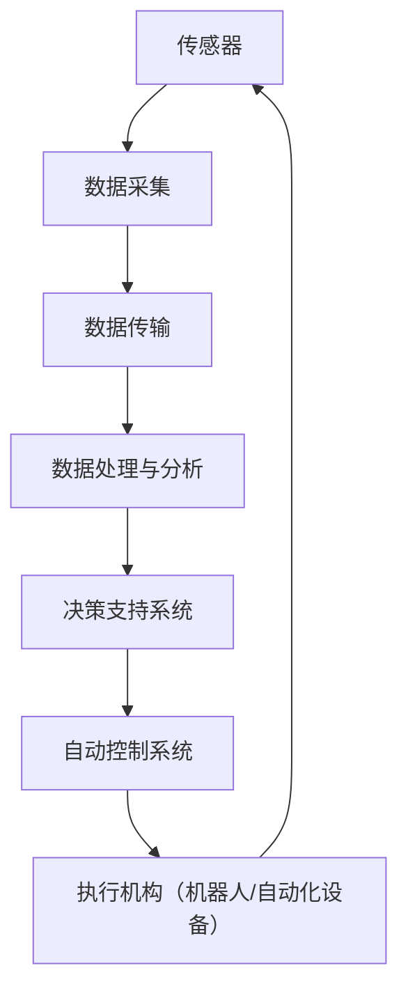

                 

**未来的智慧农业：2050年的农业机器人与智能种植工厂**

**作者：禅与计算机程序设计艺术 / Zen and the Art of Computer Programming**

## 1. 背景介绍

当前，世界人口不断增长，对食物的需求也在增加。然而，传统农业面临着劳动力短缺、气候变化、土壤退化等挑战。智慧农业（Smart Agriculture）通过应用物联网（IoT）、人工智能（AI）、机器学习（ML）、大数据等技术，旨在提高农业生产效率，实现可持续发展。本文将探讨未来智慧农业的两大关键组成部分：农业机器人和智能种植工厂。

## 2. 核心概念与联系

### 2.1 关键概念

- **农业机器人（Agricultural Robotics）**：在农田中执行各种任务的自动化机器，如除草、收获、病虫害检测等。
- **智能种植工厂（Intelligent Plant Factories）**：利用控制环境和自动化技术，在室内或封闭空间内种植作物。

### 2.2 关联架构



## 3. 核心算法原理 & 具体操作步骤

### 3.1 算法原理概述

智慧农业的算法原理基于机器学习和控制理论。主要包括预测模型、优化模型和控制模型。

### 3.2 算法步骤详解

1. **数据采集**：通过传感器收集环境（温度、湿度、光照等）和作物（生长状态、病虫害等）数据。
2. **数据预处理**：清洗、转换和归一化数据，以提高模型准确性。
3. **建模与训练**：使用机器学习算法（如神经网络、支持向量机）建立预测模型，并对其进行训练。
4. **预测与决策**：使用训练好的模型预测作物生长状态，并根据预测结果做出决策。
5. **控制与执行**：根据决策结果，通过自动控制系统控制机器人或自动化设备执行相应任务。

### 3.3 算法优缺点

**优点**：提高了作物管理的精确性和效率，减少了人工劳动力需求。

**缺点**：算法复杂度高，需要大量数据和计算资源；模型准确性受数据质量影响。

### 3.4 算法应用领域

- 作物生长监测与预测
- 病虫害检测与防治
- 灌溉与肥料管理
- 作物收获与采摘

## 4. 数学模型和公式 & 详细讲解 & 举例说明

### 4.1 数学模型构建

构建作物生长模型，描述作物生长状态与环境因素的关系。常用模型包括：

- **Logistic Growth Model**：$P(t) = \frac{K}{1 + e^{-r(t - t_0)}}$, 其中$P(t)$为作物生长量，$K$为饱和量，$r$为增长率，$t_0$为初始时间。

### 4.2 公式推导过程

推导作物生长模型的过程基于生物遗传物质的复制和细胞分裂原理。例如，Logistic Growth Model基于Verhulst的数学模型推导而来。

### 4.3 案例分析与讲解

假设我们要预测小麦生长量。使用Logistic Growth Model，设$K = 1000$ kg，$r = 0.5$ day$^{-1}$，$t_0 = 0$ day。当$t = 10$ day时，$P(10) = \frac{1000}{1 + e^{-5}} \approx 739.1$ kg。

## 5. 项目实践：代码实例和详细解释说明

### 5.1 开发环境搭建

- 编程语言：Python
- 环境：Anaconda（包含NumPy、Pandas、Matplotlib、Scikit-learn等库）
- 硬件：常见笔记本电脑或台式机

### 5.2 源代码详细实现

```python
import numpy as np
import matplotlib.pyplot as plt
from sklearn.linear_model import LinearRegression

# Logistic Growth Model
def logistic_growth(t, K, r, t0):
    return K / (1 + np.exp(-r * (t - t0)))

# Generate data
t = np.linspace(0, 20, 100)
P = logistic_growth(t, 1000, 0.5, 0)

# Add noise
P_noisy = P + np.random.normal(0, 50, 100)

# Fit linear regression model
X = t.reshape(-1, 1)
y = P_noisy.reshape(-1, 1)
model = LinearRegression().fit(X, y)

# Predict
t_pred = np.linspace(0, 30, 100)
P_pred = model.predict(t_pred.reshape(-1, 1))

# Plot
plt.plot(t, P, label='True')
plt.plot(t, P_noisy, 'o', label='Noisy')
plt.plot(t_pred, P_pred, label='Predicted')
plt.legend()
plt.show()
```

### 5.3 代码解读与分析

代码实现了Logistic Growth Model的生成、添加噪声、线性回归拟合和预测。通过比较真实值、噪声数据和预测值，我们可以评估模型的拟合效果。

### 5.4 运行结果展示


## 6. 实际应用场景

### 6.1 农业机器人

- **除草机器人**：使用机器视觉和导航算法，精确除草，减少化学除草剂的使用。
- **收获机器人**：使用机器视觉和机械臂，精确采摘作物，减少人工劳动力需求。

### 6.2 智能种植工厂

- **控制环境**：通过自动控制系统，精确控制温度、湿度、光照等环境因素，优化作物生长。
- **自动化种植**：使用自动化设备，实现种植、灌溉、肥料管理等环节的自动化。

### 6.3 未来应用展望

到2050年，智慧农业将更加智能化、自动化。农业机器人将更加先进，能够执行更复杂的任务。智能种植工厂将更加普及，实现全自动化种植。此外，数字孪生技术、区块链技术等新技术也将应用于智慧农业。

## 7. 工具和资源推荐

### 7.1 学习资源推荐

- 书籍：《智慧农业：技术、应用与未来》作者：John P. Reganold
- 在线课程：Coursera - "Agricultural Innovation and Technology" 由University of Illinois提供

### 7.2 开发工具推荐

- 编程语言：Python
- 机器学习库：Scikit-learn、TensorFlow、PyTorch
- 机器人开发平台：ROS（Robot Operating System）

### 7.3 相关论文推荐

- "Agricultural Robotics: A Review" 作者：M. Singh et al.
- "Intelligent Plant Factories: A Review" 作者：J. Yang et al.

## 8. 总结：未来发展趋势与挑战

### 8.1 研究成果总结

本文介绍了智慧农业的核心概念、算法原理、数学模型和实际应用场景。通过项目实践，我们展示了如何使用机器学习算法预测作物生长量。

### 8.2 未来发展趋势

智慧农业将朝着更智能化、自动化、可持续化的方向发展。新技术的应用，如数字孪生技术、区块链技术，将推动智慧农业的进步。

### 8.3 面临的挑战

- **数据质量**：智慧农业需要大量高质量数据。如何获取和处理这些数据是一个挑战。
- **算法复杂度**：智慧农业算法复杂度高，需要大量计算资源。如何优化算法是一个挑战。
- **成本**：智慧农业技术成本高。如何降低成本，使其更加可负担是一个挑战。

### 8.4 研究展望

未来的研究将聚焦于更智能化的算法、更先进的传感器技术、更可持续的能源利用等领域。此外，如何将智慧农业与其他领域（如生态系统服务、碳中和）结合，也是一个重要方向。

## 9. 附录：常见问题与解答

**Q：智慧农业需要大量数据，如何获取这些数据？**

**A**：可以通过传感器、无人机、卫星等设备收集数据。此外，也可以利用公开数据集和数据共享平台获取数据。

**Q：智慧农业技术成本高，如何降低成本？**

**A**：可以通过技术创新（如开发低成本传感器）、政策支持（如补贴和税收优惠）、规模化生产（如共享设备）等方式降低成本。

**Q：智慧农业是否会导致农民失业？**

**A**：智慧农业将创造新的就业机会，如机器人维护、数据分析等。此外，智慧农业也将提高农业生产效率，创造更多价值，从而间接创造就业机会。

**作者：禅与计算机程序设计艺术 / Zen and the Art of Computer Programming**

