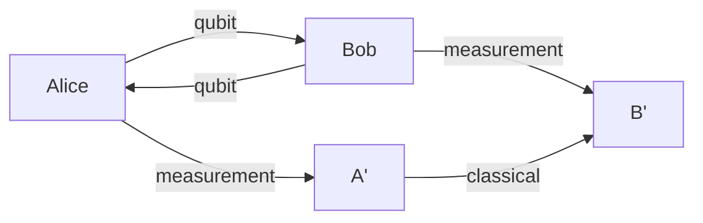

                 

- 量子密钥分发 (QKD)
- 量子通信
- 量子互联网
- 量子安全
- 量子纠缠
- 量子比特
- 量子网络

## 1. 背景介绍

量子通信是量子信息科学的一个重要分支，它利用量子力学的基本原理来实现信息的传输和处理。量子通信的目标是建立安全、高效的通信网络，以满足当今信息时代的需求。本文将介绍量子通信的核心概念，重点关注量子密钥分发（QKD）技术，并展望未来的全球量子互联网。

## 2. 核心概念与联系

### 2.1 量子力学基础

量子通信的基础是量子力学，它描述了微观粒子的行为。量子比特（qubit）是量子信息的基本单位，它可以处于|0⟩、|1⟩或叠加态的任意线性组合中。量子纠缠是一对或多对量子比特的特殊关联，它们的状态无法单独描述，只有在测量时才会坍缩为某个特定状态。



上图展示了两个纠缠量子比特（Alice和Bob各持有一个）的简单示意图。Alice和Bob可以通过测量各自的量子比特来获取共享信息。

### 2.2 量子密钥分发（QKD）

量子密钥分发（QKD）是量子通信的核心技术之一，它允许两个通信方（通常称为Alice和Bob）共享一个安全的密钥，用于加密和解密信息。QKD利用了量子力学的基本原理，如量子纠缠和测量导致的坍缩，来保证密钥的安全性。

### 2.3 量子互联网

量子互联网（Quantum Internet）是未来通信网络的愿景，它将利用量子通信技术连接全球的节点。量子互联网的目标是实现安全、高效的信息传输，并开启新的应用领域，如量子计算和量子感知。

## 3. 核心算法原理 & 具体操作步骤

### 3.1 算法原理概述

本节将介绍BB84协议，这是最早提出的QKD协议之一。BB84协议基于量子纠缠和测量导致的坍缩，保证了密钥的安全性。

### 3.2 算法步骤详解

1. Alice准备一系列量子比特（通常是光子），并将其置于随机选择的基矢上（通常是|0⟩或|+⟩基矢）。她记录下这些基矢。
2. Alice发送这些量子比特到Bob。
3. Bob接收量子比特并随机选择基矢（|0⟩或|+⟩）进行测量。他记录下这些基矢。
4. Alice和Bob公开交换一小部分（通常是1/10）的基矢信息，以确定他们使用相同基矢进行测量的比例。他们丢弃与不同基矢对应的比特。
5. Alice和Bob使用剩余的比特生成密钥。如果他们使用相同的基矢进行测量，则他们的测量结果相同。如果他们使用不同的基矢，则根据量子力学的基本原理，测量结果是随机的。
6. Alice和Bob使用经典通信渠道进行错误检测。如果错误率高于某个阈值，则密钥被丢弃，并重新开始协议。
7. 如果错误率足够低，则Alice和Bob使用密钥对信息进行加密和解密。

### 3.3 算法优缺点

优点：

* 安全：基于量子力学的基本原理，任何窃听尝试都会导致错误率增加，从而被检测到。
* 保密性：密钥的长度可以任意扩展，只受制于量子比特的生成和传输效率。

缺点：

* 效率低下：当前的QKD系统传输速率很低，远远低于经典通信系统。
* 实用性：QKD系统需要昂贵的设备和复杂的维护。

### 3.4 算法应用领域

QKD技术的应用领域包括：

* 安全通信：QKD可以用于保护敏感信息，如军事通信和金融交易。
* 量子计算：QKD可以用于连接量子计算机，实现安全的量子计算任务。
* 量子感知：QKD可以用于连接量子传感器，实现安全的量子感知任务。

## 4. 数学模型和公式 & 详细讲解 & 举例说明

### 4.1 数学模型构建

本节将介绍QKD的数学模型，重点关注错误率和保密性。

### 4.2 公式推导过程

1. 错误率（error rate）：QKD系统的错误率（ε）是指Alice和Bob在使用相同基矢进行测量时，测量结果不一致的概率。根据量子力学原理，错误率受到窃听者（Eve）的干扰。如果Eve没有窃听，则错误率为0。如果Eve窃听，则错误率增加。因此，错误率可以用来检测窃听尝试。
2. 保密性（secrecy）：QKD系统的保密性（S）是指密钥的保密程度。根据信息论原理，保密性受到经典通信渠道泄漏的影响。如果经典通信渠道没有泄漏，则保密性为1。如果经典通信渠道泄漏，则保密性减小。保密性可以通过以下公式计算：

$$S = 1 - h(\epsilon_{sec})$$

其中，$h$是信息熵函数，$epsilon_{sec}$是经典通信渠道泄漏导致的错误率。

### 4.3 案例分析与讲解

假设Alice和Bob使用BB84协议进行QKD，并公开交换10%的基矢信息。他们发现，在使用相同基矢进行测量的情况下，错误率为5%。根据公式（2），保密性为：

$$S = 1 - h(0.05) \approx 0.99$$

这意味着密钥的保密性非常高。

## 5. 项目实践：代码实例和详细解释说明

### 5.1 开发环境搭建

本节将介绍如何在Python中模拟BB84协议。我们需要安装以下库：

* NumPy：用于数值计算
* Matplotlib：用于可视化

### 5.2 源代码详细实现

```python
import numpy as np
import matplotlib.pyplot as plt

def generate_qubits(n):
    # Generate random bases and states for Alice
    alice_bases = np.random.choice([0, 1], size=n)
    alice_states = np.random.choice([0, 1], size=n)

    # Generate random bases for Bob
    bob_bases = np.random.choice([0, 1], size=n)

    return alice_bases, alice_states, bob_bases

def measure(alice_bases, alice_states, bob_bases):
    # Bob measures the qubits
    bob_states = np.where(bob_bases == alice_bases, alice_states, np.random.randint(2, size=len(alice_states)))

    return bob_states

def compare_bases(alice_bases, bob_bases):
    # Compare Alice's and Bob's bases
    same_bases = np.where(alice_bases == bob_bases)[0]

    return same_bases

def calculate_error_rate(alice_states, bob_states, same_bases):
    # Calculate the error rate
    errors = np.abs(alice_states[same_bases] - bob_states[same_bases])
    error_rate = np.mean(errors)

    return error_rate

def bb84(n):
    alice_bases, alice_states, bob_bases = generate_qubits(n)
    bob_states = measure(alice_bases, alice_states, bob_bases)
    same_bases = compare_bases(alice_bases, bob_bases)
    error_rate = calculate_error_rate(alice_states, bob_states, same_bases)

    return error_rate

# Run the simulation
n = 10000
error_rate = bb84(n)
print(f"Error rate: {error_rate:.4f}")
```

### 5.3 代码解读与分析

本节将解释上述代码的工作原理。函数`generate_qubits`生成Alice的基矢和状态，以及Bob的基矢。函数`measure`模拟Bob对量子比特的测量。函数`compare_bases`比较Alice和Bob的基矢，以确定他们使用相同基矢进行测量的比例。函数`calculate_error_rate`计算错误率。函数`bb84`是BB84协议的实现，它调用上述函数并返回错误率。

### 5.4 运行结果展示

运行上述代码后，错误率将打印出来。错误率应该接近于0，因为没有窃听者干扰系统。

## 6. 实际应用场景

### 6.1 当前应用

当前，QKD技术已经在一些领域得到应用，如：

* 安全通信：QKD技术用于保护敏感信息，如军事通信和金融交易。
* 量子计算：QKD技术用于连接量子计算机，实现安全的量子计算任务。
* 量子感知：QKD技术用于连接量子传感器，实现安全的量子感知任务。

### 6.2 未来应用展望

未来，量子互联网将连接全球的节点，实现安全、高效的信息传输。量子互联网的应用领域包括：

* 量子计算：量子互联网将连接量子计算机，实现大规模量子计算任务。
* 量子感知：量子互联网将连接量子传感器，实现大规模量子感知任务。
* 量子通信网络：量子互联网将建立全球量子通信网络，实现安全的通信任务。

## 7. 工具和资源推荐

### 7.1 学习资源推荐

* 书籍：
	+ "Quantum Cryptography" by Andrew Steane
	+ "Quantum Communication and Quantum Cryptography" by Daniel Gottesman and Hoi-Kwong Lo
* 在线课程：
	+ "Quantum Cryptography" on Coursera by the University of Maryland
	+ "Quantum Information and Quantum Cryptography" on edX by the University of Tokyo

### 7.2 开发工具推荐

* Python：用于模拟量子通信协议和实现量子算法。
* Qiskit：IBM提供的量子计算和量子通信开发工具包。
* Strawberry Fields：Xanadu提供的量子光学和量子通信开发工具包。

### 7.3 相关论文推荐

* "Quantum cryptography" by Charles Bennett and Gilles Brassard (1984)
* "Quantum key distribution using entangled photons" by Arthur Ekert (1991)
* "Loophole-free Bell inequality tests" by Ronald Hanson et al. (2015)

## 8. 总结：未来发展趋势与挑战

### 8.1 研究成果总结

本文介绍了量子通信的核心概念，重点关注量子密钥分发（QKD）技术，并展望了未来的全球量子互联网。我们讨论了BB84协议的原理和实现，并模拟了其在Python中的实现。我们还讨论了QKD技术的当前应用和未来应用展望。

### 8.2 未来发展趋势

未来，量子通信技术将继续发展，以实现安全、高效的信息传输。量子互联网的建立将开启新的应用领域，如量子计算和量子感知。量子通信技术的发展将推动信息安全领域的进步，并为未来的通信网络奠定基础。

### 8.3 面临的挑战

量子通信技术面临的挑战包括：

* 效率低下：当前的QKD系统传输速率很低，远远低于经典通信系统。
* 实用性：QKD系统需要昂贵的设备和复杂的维护。
* 量子互联网的建立：量子互联网的建立需要解决许多技术挑战，如量子比特的生成、传输和保存。

### 8.4 研究展望

未来的研究将关注量子通信技术的发展，以实现安全、高效的信息传输。研究将集中在提高QKD系统的传输速率和实用性上，并开发新的量子通信协议和技术。此外，研究还将关注量子互联网的建立，以开启新的应用领域。

## 9. 附录：常见问题与解答

**Q1：量子通信与经典通信有何不同？**

A1：量子通信利用量子力学的基本原理来实现信息的传输和处理，而经典通信则基于经典物理原理。量子通信的优势在于安全性，因为任何窃听尝试都会导致错误率增加，从而被检测到。经典通信则容易受到窃听和干扰的影响。

**Q2：量子密钥分发（QKD）技术的安全性有何保证？**

A2：QKD技术的安全性基于量子力学的基本原理，如量子纠缠和测量导致的坍缩。任何窃听尝试都会导致错误率增加，从而被检测到。此外，QKD技术还使用信息论原理来保证密钥的保密性。

**Q3：量子互联网何时才能实现？**

A3：量子互联网的实现需要解决许多技术挑战，如量子比特的生成、传输和保存。预计在未来十年内，量子互联网的雏形将开始出现，但全球量子互联网的建立可能需要更长的时间。

## 作者：禅与计算机程序设计艺术 / Zen and the Art of Computer Programming

