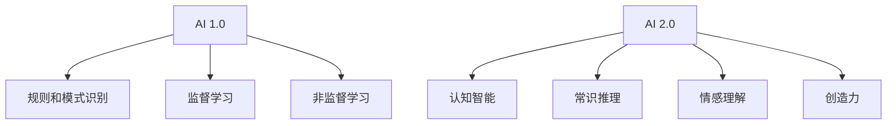

                 

**AI 2.0 时代的商业价值**

## 1. 背景介绍

在人工智能（AI）领域，我们正处于一个转折点，从AI 1.0过渡到AI 2.0。AI 1.0主要关注于规则和模式识别，而AI 2.0则是指向更高层次的认知智能，包括常识推理、情感理解和创造力。本文将探讨AI 2.0在商业领域的价值，以及它如何帮助企业提高效率、创新和竞争力。

## 2. 核心概念与联系

### 2.1 AI 1.0 vs AI 2.0

AI 1.0和AI 2.0的区别可以用下面的Mermaid流程图表示：



### 2.2 AI 2.0的特点

AI 2.0的特点包括：

- **认知智能**：AI 2.0模仿人类的认知过程，包括理解、学习和推理。
- **常识推理**：AI 2.0可以利用外部知识库和上下文信息进行推理，从而理解常识。
- **情感理解**：AI 2.0可以理解和表达情感，从而更好地与人类互动。
- **创造力**：AI 2.0可以生成新颖的想法和创意，从而推动创新。

## 3. 核心算法原理 & 具体操作步骤

### 3.1 算法原理概述

AI 2.0的核心算法包括知识图谱、情感分析和创造性算法。这些算法结合了深度学习、自然语言处理和知识表示等技术。

### 3.2 算法步骤详解

#### 3.2.1 知识图谱构建

1. **信息收集**：收集领域相关的文本数据，如维基百科条目。
2. **实体提取**：使用 Named Entity Recognition (NER)算法提取实体。
3. **关系抽取**：使用关系抽取算法提取实体之间的关系。
4. **图谱构建**：将实体和关系表示为图谱。

#### 3.2.2 情感分析

1. **文本预处理**：清洗文本，去除停用词，进行分词和标记化。
2. **特征提取**：使用Bag-of-Words、TF-IDF或Word2Vec等方法提取特征。
3. **分类**：使用分类算法（如SVM、随机森林或神经网络）进行情感分类。

#### 3.2.3 创造性算法

1. **输入**：提供一个起始想法或问题。
2. **生成**：使用生成模型（如Seq2Seq或Transformer）生成新的想法或解决方案。
3. **评估**：使用评估指标（如BLEU或ROUGE）评估生成结果的质量。

### 3.3 算法优缺点

**优点**：

- AI 2.0算法可以处理复杂的任务，如常识推理和创造力。
- 它们可以学习和理解新的领域，从而不断改进。

**缺点**：

- AI 2.0算法需要大量的数据和计算资源。
- 它们可能会产生不准确或不合理的结果，需要人类审核。

### 3.4 算法应用领域

AI 2.0算法可以应用于各种领域，包括：

- **客户服务**：提供更好的客户互动和支持。
- **创新**：帮助企业生成新颖的想法和产品。
- **决策支持**：提供更准确和全面的决策支持。

## 4. 数学模型和公式 & 详细讲解 & 举例说明

### 4.1 数学模型构建

知识图谱可以表示为无向图$G=(V, E)$, 其中$V$是实体集合，$E$是关系集合。每条边$(v, r, v') \in E$表示实体$v$与实体$v'$之间存在关系$r$.

### 4.2 公式推导过程

情感分析可以表示为分类问题，假设输入文本$x$属于类别$y$, 则目标是学习映射$f: x \rightarrow y$. 使用交叉熵损失函数，则目标是最小化$L(f(x), y) = -\log P(y|x)$.

### 4.3 案例分析与讲解

例如，在客户服务领域，AI 2.0可以帮助企业理解客户的情感，并提供个性化的回复。假设客户发送消息"我今天很不开心，因为我的包裹还没有送到。"，AI 2.0可以识别出客户的情感是负面的，并理解包裹送达是导致客户不开心的原因。然后，AI 2.0可以生成个性化的回复，如"我们很抱歉听到您今天不开心。我们会立即调查您的包裹送达情况，并尽快与您联系。"

## 5. 项目实践：代码实例和详细解释说明

### 5.1 开发环境搭建

- **硬件**：一台配有NVIDIA GPU的计算机。
- **软件**：Python 3.7+, TensorFlow 2.0+, SpaCy 2.0+, PyTorch 1.0+。

### 5.2 源代码详细实现

以下是一个简单的情感分析示例：

```python
import tensorflow as tf
from tensorflow.keras.preprocessing.text import Tokenizer
from tensorflow.keras.preprocessing.sequence import pad_sequences

# 假设我们有以下文本数据
texts = ["我今天很开心", "我今天很不开心"]
labels = [1, 0]  # 1表示正面情感，0表示负面情感

# 文本预处理
tokenizer = Tokenizer()
tokenizer.fit_on_texts(texts)
sequences = tokenizer.texts_to_sequences(texts)
padded = pad_sequences(sequences, maxlen=100)

# 构建模型
model = tf.keras.Sequential([
    tf.keras.layers.Embedding(input_dim=len(tokenizer.word_index)+1, output_dim=128),
    tf.keras.layers.Bidirectional(tf.keras.layers.LSTM(64)),
    tf.keras.layers.Dense(1, activation="sigmoid")
])

# 编译模型
model.compile(loss="binary_crossentropy", optimizer="adam", metrics=["accuracy"])

# 训练模型
model.fit(padded, labels, epochs=10, batch_size=32)
```

### 5.3 代码解读与分析

- 我们首先使用Tokenizer将文本转换为序列，然后使用pad_sequences将序列填充为固定长度。
- 我们构建了一个简单的LSTM模型，使用Embedding层将单词转换为向量，然后使用Bidirectional LSTM层进行序列建模。
- 我们使用binary_crossentropy作为损失函数，因为这是一个二分类问题。

### 5.4 运行结果展示

在训练完成后，模型可以预测新文本的情感。例如，输入文本"我今天很不开心"，模型可以预测情感为负面。

## 6. 实际应用场景

### 6.1 客户服务

AI 2.0可以帮助企业提供更好的客户服务。例如，它可以理解客户的情感，并提供个性化的回复。它还可以帮助企业预测客户的需求，从而提供更好的服务。

### 6.2 创新

AI 2.0可以帮助企业生成新颖的想法和产品。例如，它可以分析市场趋势，并生成新的产品idea。它还可以帮助企业优化现有的产品，从而提高竞争力。

### 6.3 未来应用展望

未来，AI 2.0将会更广泛地应用于商业领域。它将帮助企业提高效率，创新和竞争力。它还将帮助企业更好地理解和满足客户需求。

## 7. 工具和资源推荐

### 7.1 学习资源推荐

- **书籍**："Artificial Intelligence: A Modern Approach" by Stuart Russell and Peter Norvig
- **在线课程**：Stanford University's CS221 Artificial Intelligence: Principles and Techniques

### 7.2 开发工具推荐

- **开发环境**：Jupyter Notebook
- **深度学习框架**：TensorFlow, PyTorch
- **自然语言处理库**：SpaCy, NLTK

### 7.3 相关论文推荐

- "Attention Is All You Need" by Vaswani et al.
- "BERT: Pre-training of Deep Bidirectional Transformers for Language Understanding" by Jacob Devlin and Ming-Wei Chang

## 8. 总结：未来发展趋势与挑战

### 8.1 研究成果总结

AI 2.0在商业领域具有巨大的潜力。它可以帮助企业提高效率，创新和竞争力。它还可以帮助企业更好地理解和满足客户需求。

### 8.2 未来发展趋势

未来，AI 2.0将会更广泛地应用于商业领域。它将帮助企业提高效率，创新和竞争力。它还将帮助企业更好地理解和满足客户需求。

### 8.3 面临的挑战

AI 2.0面临的挑战包括：

- **数据隐私**：AI 2.0需要大量的数据，但收集和使用数据可能会侵犯客户隐私。
- **解释性AI**：AI 2.0的决策过程可能很难解释，这可能会导致不信任和质疑。
- **道德和伦理问题**：AI 2.0可能会导致道德和伦理问题，如就业问题和歧视问题。

### 8.4 研究展望

未来的研究将关注于解决AI 2.0面临的挑战，如数据隐私、解释性AI和道德和伦理问题。研究还将关注于开发更强大和更通用的AI 2.0算法。

## 9. 附录：常见问题与解答

**Q：AI 2.0和AI 1.0有什么区别？**

A：AI 1.0主要关注于规则和模式识别，而AI 2.0则是指向更高层次的认知智能，包括常识推理、情感理解和创造力。

**Q：AI 2.0在商业领域有什么价值？**

A：AI 2.0可以帮助企业提高效率，创新和竞争力。它还可以帮助企业更好地理解和满足客户需求。

**Q：AI 2.0面临的挑战是什么？**

A：AI 2.0面临的挑战包括数据隐私、解释性AI和道德和伦理问题。

---

作者：禅与计算机程序设计艺术 / Zen and the Art of Computer Programming

