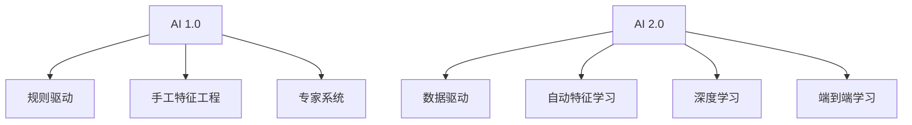

                 

**AI 2.0 时代的开发者**

## 1. 背景介绍

在人工智能（AI）领域，我们正处于一个转型的关键时期。从 AI 1.0 到 AI 2.0，我们见证了 AI 技术从规则驱动到数据驱动的转变。AI 1.0 时代，我们主要依靠手工设计特定领域的规则和模型来实现 AI。然而，随着大数据和强大的计算资源的出现，AI 进入了 AI 2.0 时代，我们开始依赖数据驱动的学习算法，如深度学习，来自动学习和优化模型。

作为 AI 开发者，我们需要理解 AI 2.0 的核心概念，掌握关键算法，并学习如何应用这些技术来解决实际问题。本文将深入探讨 AI 2.0 的核心概念，详细介绍关键算法，并提供项目实践和工具资源推荐。

## 2. 核心概念与联系

### 2.1 AI 1.0 与 AI 2.0 的对比



在 AI 1.0 时代，我们主要依赖于专家知识和手工设计的特征来构建 AI 模型。而在 AI 2.0 时代，我们转向了数据驱动的学习算法，这些算法可以自动学习和优化模型。深度学习是 AI 2.0 的关键技术，它允许我们构建端到端的学习系统，从原始数据到最终决策。

### 2.2 AI 2.0 的核心概念

- **数据驱动**：AI 2.0 依赖于大量的数据来学习和优化模型。
- **自动特征学习**：AI 2.0 算法可以自动学习和提取特征，无需手工设计。
- **端到端学习**：AI 2.0 算法可以直接从原始数据学习到最终决策，无需中间的特征工程步骤。
- **深度学习**：深度学习是 AI 2.0 的关键技术，它允许我们构建具有多层非线性变换的模型。

## 3. 核心算法原理 & 具体操作步骤

### 3.1 算法原理概述

深度学习是 AI 2.0 的关键算法，它允许我们构建具有多层非线性变换的模型。深度学习模型通常由输入层、隐藏层和输出层组成。每层都包含多个神经元，神经元之间通过权重连接。模型学习的过程就是优化这些权重的过程。

### 3.2 算法步骤详解

1. **前向传播**：输入数据通过模型的各层，生成输出。
2. **误差计算**：计算输出与真实值之间的误差。
3. **反向传播**：计算每层神经元的梯度，更新模型的权重。
4. **重复步骤 1-3**：直到模型收敛，即误差小于阈值。

### 3.3 算法优缺点

**优点**：

- 自动特征学习：深度学习模型可以自动学习和提取特征。
- 端到端学习：深度学习模型可以直接从原始数据学习到最终决策。
- 表达能力强：深度学习模型可以表示复杂的非线性关系。

**缺点**：

- 计算资源需求高：深度学习模型需要大量的计算资源来训练。
- 训练时间长：深度学习模型的训练过程通常需要很长时间。
- 缺乏解释性：深度学习模型通常是黑箱模型，很难解释其决策过程。

### 3.4 算法应用领域

深度学习在计算机视觉、自然语言处理、语音识别等领域取得了巨大成功。此外，深度学习还被应用于医疗影像分析、金融风险预测、自动驾驶等领域。

## 4. 数学模型和公式 & 详细讲解 & 举例说明

### 4.1 数学模型构建

深度学习模型通常可以表示为以下形式：

$$y = f(x; W) = \sigma(z) = \sigma(Wx + b)$$

其中，$x$ 是输入，$y$ 是输出，$W$ 是权重，$b$ 是偏置，$z = Wx + b$ 是线性变换，$σ$ 是激活函数。

### 4.2 公式推导过程

模型学习的过程就是优化权重 $W$ 和偏置 $b$ 的过程。我们通常使用梯度下降法来优化这些参数。梯度下降法的目标是最小化误差函数 $L(y, \hat{y})$，其中 $y$ 是真实值， $\hat{y}$ 是模型的预测值。

### 4.3 案例分析与讲解

例如，在图像分类任务中，输入 $x$ 是图像的像素值，输出 $y$ 是图像的类别。我们可以使用 softmax 函数来生成概率分布：

$$\hat{y} = softmax(z) = \frac{e^{z}}{\sum_{j=1}^{K}e^{z_{j}}}$$

其中，$K$ 是类别数，$z_{j} = W_{j}x + b_{j}$ 是第 $j$ 个神经元的输出。

## 5. 项目实践：代码实例和详细解释说明

### 5.1 开发环境搭建

我们将使用 Python 和 TensorFlow 来实现一个简单的深度学习模型。您需要安装 Python、TensorFlow、NumPy 和 Matplotlib。

### 5.2 源代码详细实现

```python
import numpy as np
import tensorflow as tf
import matplotlib.pyplot as plt

# 定义模型参数
n_input = 784  # 输入层神经元数量
n_hidden = 500  # 隐藏层神经元数量
n_output = 10  # 输出层神经元数量

# 定义权重和偏置
W1 = tf.Variable(tf.random.normal([n_input, n_hidden]))
b1 = tf.Variable(tf.zeros([n_hidden]))
W2 = tf.Variable(tf.random.normal([n_hidden, n_output]))
b2 = tf.Variable(tf.zeros([n_output]))

# 定义模型
def model(x):
    layer1 = tf.nn.relu(tf.matmul(x, W1) + b1)
    layer2 = tf.matmul(layer1, W2) + b2
    return layer2

# 定义损失函数和优化器
loss = tf.reduce_mean(tf.nn.softmax_cross_entropy_with_logits(logits=model(X), labels=y))
optimizer = tf.train.GradientDescentOptimizer(learning_rate=0.5).minimize(loss)

# 训练模型
for epoch in range(1000):
    with tf.GradientTape() as tape:
        loss = optimizer.minimize(loss, tape=tape)
    if epoch % 100 == 0:
        print(f"Epoch {epoch}, Loss {loss.numpy()}")
```

### 5.3 代码解读与分析

我们定义了一个简单的全连接神经网络模型，它由一个隐藏层和一个输出层组成。我们使用 ReLU 激活函数和 softmax 函数来生成模型的输出。我们使用交叉熵损失函数和梯度下降优化器来优化模型的参数。

### 5.4 运行结果展示

在训练过程中，我们每 100 个 epoch 打印一次损失值。随着训练的进行，损失值应该会下降，直到模型收敛。

## 6. 实际应用场景

### 6.1 当前应用

深度学务在计算机视觉、自然语言处理、语音识别等领域取得了巨大成功。例如，在图像分类任务中，深度学习模型可以达到人类水平的准确率。

### 6.2 未来应用展望

未来，深度学习将继续在更多领域得到应用，如医疗影像分析、金融风险预测、自动驾驶等。此外，我们将看到更多的端到端学习系统，这些系统可以直接从原始数据学习到最终决策。

## 7. 工具和资源推荐

### 7.1 学习资源推荐

- **书籍**："Deep Learning" 由 Ian Goodfellow、Yoshua Bengio 和 Aaron Courville 合著。
- **在线课程**：Coursera 上的 "Deep Learning Specialization" 由 Andrew Ng 讲授。
- **博客**：Distill.pub（<https://distill.pub/>）提供了大量深度学习的优秀教程。

### 7.2 开发工具推荐

- **Python**：Python 是深度学习开发的首选语言。
- **TensorFlow**：TensorFlow 是 Google 开发的深度学习框架。
- **PyTorch**：PyTorch 是 Facebook 开发的深度学习框架，它提供了动态计算图和更灵活的 API。

### 7.3 相关论文推荐

- **LeCun, Y., Bengio, Y., & Hinton, G. (2015). Deep learning.** Nature, 521(7553), 436-444.
- **Goodfellow, I., Bengio, Y., & Courville, A. (2016). Deep learning.** MIT press.

## 8. 总结：未来发展趋势与挑战

### 8.1 研究成果总结

深度学习在计算机视觉、自然语言处理、语音识别等领域取得了巨大成功。然而，我们仍然面临着许多挑战，如缺乏解释性、计算资源需求高、训练时间长等。

### 8.2 未来发展趋势

未来，我们将看到更多的端到端学习系统，这些系统可以直接从原始数据学习到最终决策。此外，我们将看到更多的自监督学习和少样本学习的方法，这些方法可以帮助我们处理小样本和无标签数据。

### 8.3 面临的挑战

- **缺乏解释性**：深度学习模型通常是黑箱模型，很难解释其决策过程。
- **计算资源需求高**：深度学习模型需要大量的计算资源来训练。
- **训练时间长**：深度学习模型的训练过程通常需要很长时间。

### 8.4 研究展望

未来的研究将侧重于开发更有解释性的模型，优化模型的训练过程，并开发新的学习方法来处理小样本和无标签数据。

## 9. 附录：常见问题与解答

**Q：什么是 AI 2.0？**

A：AI 2.0 是人工智能的一个新时代，它依赖于数据驱动的学习算法，如深度学习，来自动学习和优化模型。

**Q：什么是深度学习？**

A：深度学习是一种人工神经网络，它由多层非线性变换组成。深度学习模型可以自动学习和提取特征，无需手工设计。

**Q：什么是端到端学习？**

A：端到端学习是一种学习方法，它可以直接从原始数据学习到最终决策，无需中间的特征工程步骤。

**Q：什么是自动特征学习？**

A：自动特征学习是一种学习方法，它可以自动学习和提取特征，无需手工设计。

## 作者：禅与计算机程序设计艺术 / Zen and the Art of Computer Programming

**END**

