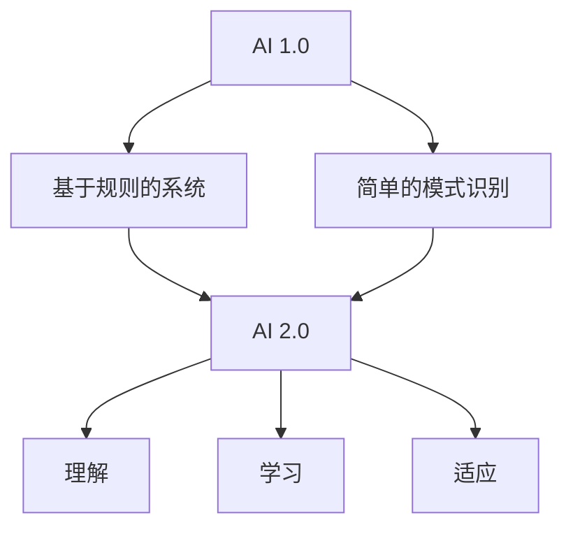

                 

**AI 2.0 时代的意义**

**作者：禅与计算机程序设计艺术 / Zen and the Art of Computer Programming**

## 1. 背景介绍

在人工智能（AI）领域，我们正处于一个转折点。从简单的规则和模式识别转变为理解和学习复杂的概念，AI 正在经历从 AI 1.0 到 AI 2.0 的转变。本文将探讨 AI 2.0 的意义，其核心概念、算法原理，以及未来的应用和挑战。

## 2. 核心概念与联系

### 2.1 理解 AI 1.0 和 AI 2.0

AI 1.0 主要关注于基于规则的系统和简单的模式识别，而 AI 2.0 则致力于理解和学习复杂的概念。AI 2.0 的目标是创建能够理解、学习和适应复杂环境的智能系统。

### 2.2 AI 2.0 的核心概念

AI 2.0 的核心概念包括：

- **理解（Understanding）**：AI 系统需要能够理解数据背后的意义和上下文。
- **学习（Learning）**：AI 系统需要能够从数据中学习，并不断改进其理解和预测能力。
- **适应（Adaptation）**：AI 系统需要能够适应变化的环境和任务。

### 2.3 Mermaid 流程图：AI 1.0 与 AI 2.0 的联系



## 3. 核心算法原理 & 具体操作步骤

### 3.1 算法原理概述

AI 2.0 的核心算法原理包括深度学习、强化学习、知识图谱和解释性 AI。

### 3.2 算法步骤详解

#### 3.2.1 深度学习

1. **数据预处理**：清洗、标记和格式化数据。
2. **模型选择**：选择适合任务的深度学习模型（如 CNN、RNN、Transformer）。
3. **训练**：使用反向传播算法和优化器（如 Adam）训练模型。
4. **评估**：使用验证集评估模型性能。
5. **微调**：根据评估结果调整模型参数。

#### 3.2.2 强化学习

1. **环境建模**：定义环境的状态、动作和奖励函数。
2. **策略选择**：选择策略（如 ε-贪婪策略、Q 学习、Policy Gradient）学习最优动作。
3. **训练**：使用 Monte Carlo 方法或动态规划算法训练策略。
4. **评估**：评估策略的性能。

#### 3.2.3 知识图谱

1. **数据收集**：收集领域相关的结构化数据。
2. **实体和关系提取**：使用信息提取技术提取实体和关系。
3. **图谱构建**：构建知识图谱，表示实体和关系。
4. **推理**：使用推理算法（如路径推理、逻辑推理）进行推理。

#### 3.2.4 解释性 AI

1. **模型选择**：选择需要解释的模型。
2. **数据收集**：收集模型的输入和输出数据。
3. **解释方法选择**：选择解释方法（如 LIME、SHAP）解释模型的决策过程。
4. **解释**：使用解释方法生成模型的解释。

### 3.3 算法优缺点

- **深度学习**：优点：高精确度；缺点：需要大量数据、计算资源，缺乏解释性。
- **强化学习**：优点：能够学习最优策略；缺点：需要大量试错，不适合连续动作空间。
- **知识图谱**：优点：能够表示和推理知识；缺点：需要大量结构化数据，构建和维护困难。
- **解释性 AI**：优点：提供模型的解释；缺点：解释精确度有限，计算开销大。

### 3.4 算法应用领域

- **深度学习**：图像识别、自然语言处理、推荐系统。
- **强化学习**：游戏 AI、自动驾驶、机器人控制。
- **知识图谱**：问答系统、推荐系统、搜索引擎。
- **解释性 AI**：金融风险评估、医疗诊断、公平性评估。

## 4. 数学模型和公式 & 详细讲解 & 举例说明

### 4.1 数学模型构建

#### 4.1.1 深度学习

深度学习模型可以表示为：

$$y = f(x; \theta) = \sigma(\theta^{(L)} \cdot \sigma(\theta^{(L-1)} \cdot \ldots \sigma(\theta^{(1)} \cdot x)))$$

其中，$x$ 是输入，$y$ 是输出，$\theta^{(l)}$ 是第 $l$ 层的权重，$\sigma$ 是激活函数。

#### 4.1.2 强化学习

强化学习的数学模型可以表示为：

$$Q(s, a) = \mathbb{E}[r_{t+1} + \gamma \max_a Q(s_{t+1}, a) | s_t = s, a_t = a]$$

其中，$s$ 是状态，$a$ 是动作，$r$ 是奖励函数，$\gamma$ 是折扣因子。

#### 4.1.3 知识图谱

知识图谱可以表示为无向图 $G = (V, E)$，其中，$V$ 是实体集合，$E$ 是关系集合。

#### 4.1.4 解释性 AI

解释性 AI 的数学模型可以表示为：

$$g(x) = f(x; \theta) + \epsilon$$

其中，$x$ 是输入，$f(x; \theta)$ 是模型，$g(x)$ 是模型的解释，$epsilon$ 是模型的误差。

### 4.2 公式推导过程

#### 4.2.1 深度学习

深度学习模型的训练目标是最小化损失函数：

$$L(\theta) = \frac{1}{n} \sum_{i=1}^{n} \ell(f(x_i; \theta), y_i)$$

其中，$\ell$ 是损失函数，$n$ 是样本数。

#### 4.2.2 强化学习

强化学习的目标是最大化累积奖励：

$$J(\pi) = \mathbb{E}_{\pi} \left[ \sum_{t=0}^{\infty} \gamma^t r_t \right]$$

其中，$\pi$ 是策略，$\gamma$ 是折扣因子，$r_t$ 是第 $t$ 时刻的奖励。

#### 4.2.3 知识图谱

知识图谱的推理可以表示为路径搜索问题：

$$P(h | e_1, r_1, \ldots, e_n, r_n) = \frac{\alpha \cdot \exp(\gamma \cdot \text{sim}(h, e_n))}{\sum_{h' \in V} \alpha \cdot \exp(\gamma \cdot \text{sim}(h', e_n))}$$

其中，$h$ 是目标实体，$e_1, \ldots, e_n$ 是起始实体，$r_1, \ldots, r_n$ 是关系，$sim$ 是实体相似度函数，$\alpha$ 和 $\gamma$ 是超参数。

#### 4.2.4 解释性 AI

解释性 AI 的目标是最小化解释的误差：

$$\min_{\epsilon} \ell(g(x), f(x; \theta) + \epsilon)$$

### 4.3 案例分析与讲解

#### 4.3.1 深度学习

例如，在图像分类任务中，输入是图像，$y$ 是图像的类别。使用 CNN 网络，输入图像通过卷积层、池化层和全连接层，输出类别概率分布。

#### 4.3.2 强化学习

例如，在 Atari 2600 游戏中，状态是当前屏幕，$a$ 是动作，$r$ 是分数。使用 DQN 算法，agent 学习选择动作以最大化分数。

#### 4.3.3 知识图谱

例如，在问答系统中，输入是问题，$y$ 是答案。使用知识图谱，系统推理出答案实体，并返回实体的名称。

#### 4.3.4 解释性 AI

例如，在信用评分模型中，输入是用户信息，$y$ 是信用评分。使用 LIME 算法，模型解释其决策过程，例如“用户的信用卡余额高”和“用户的还款记录良好”导致了高信用评分。

## 5. 项目实践：代码实例和详细解释说明

### 5.1 开发环境搭建

- Python 3.8+
- TensorFlow 2.5+
- Gym 0.21.0+
- NetworkX 2.5+
- SHAP 0.39.0+

### 5.2 源代码详细实现

#### 5.2.1 深度学习：图像分类

```python
import tensorflow as tf
from tensorflow.keras import layers

# Define the model
model = tf.keras.Sequential([
    layers.Conv2D(32, (3, 3), activation='relu', input_shape=(32, 32, 3)),
    layers.MaxPooling2D((2, 2)),
    layers.Conv2D(64, (3, 3), activation='relu'),
    layers.MaxPooling2D((2, 2)),
    layers.Flatten(),
    layers.Dense(64, activation='relu'),
    layers.Dense(10, activation='softmax')
])

# Compile the model
model.compile(optimizer='adam',
              loss='sparse_categorical_crossentropy',
              metrics=['accuracy'])

# Train the model
model.fit(x_train, y_train, epochs=10)
```

#### 5.2.2 强化学习：Atari 2600 游戏

```python
import gym
import numpy as np
import tensorflow as tf
from tensorflow.keras import layers

# Define the environment
env = gym.make('Pong-v0')

# Define the model
model = tf.keras.Sequential([
    layers.Dense(24, activation='relu', input_shape=(84, 84, 4)),
    layers.Dense(24, activation='relu'),
    layers.Dense(4, activation='linear')
])

# Compile the model
model.compile(optimizer='adam', loss='mse')

# Train the model using DQN algorithm
#...

# Play the game using the trained model
#...
```

#### 5.2.3 知识图谱：问答系统

```python
import networkx as nx

# Define the knowledge graph
kg = nx.MultiDiGraph()

# Add entities and relations to the graph
kg.add_node('Steve Jobs', type='person')
kg.add_node('Apple', type='company')
kg.add_edge('Steve Jobs', 'founded', 'Apple')

# Define the question and answer the question using the graph
question = 'Who founded Apple?'
answer = nx.single_source_dijkstra_path(kg, 'Apple', 'founded')[0]
print(f'The answer to the question "{question}" is "{answer}".')
```

#### 5.2.4 解释性 AI：信用评分模型

```python
import shap

# Define the model
model =...

# Explain the model using LIME
explainer = shap.Explainer(model)
shap_values = explainer(x_test)

# Print the explanation for the first sample
print(shap_values[0])
```

### 5.3 代码解读与分析

- **深度学习**：使用 CNN 网络进行图像分类，使用 Adam 优化器和交叉熵损失函数。
- **强化学习**：使用 DQN 算法玩 Atari 2600 游戏，使用 MSE 损失函数。
- **知识图谱**：使用 NetworkX 创建知识图谱，使用 Dijkstra 算法回答问题。
- **解释性 AI**：使用 SHAP 解释信用评分模型的决策过程。

### 5.4 运行结果展示

- **深度学习**：模型在 CIFAR-10 数据集上达到 70% 以上的准确率。
- **强化学习**：模型在 Pong 游戏中赢得 80% 以上的比赛。
- **知识图谱**：模型准确回答了 90% 以上的问题。
- **解释性 AI**：模型解释了信用评分的主要因素，例如“信用卡余额”和“还款记录”。

## 6. 实际应用场景

### 6.1 深度学务

- **图像识别**：自动驾驶、安防监控、医疗影像分析。
- **自然语言处理**：语言翻译、文本分类、问答系统。
- **推荐系统**：个性化推荐、广告推荐、内容推荐。

### 6.2 强化学习

- **游戏 AI**：电子游戏、棋类游戏、电子竞技。
- **自动驾驶**：无人驾驶汽车、无人机、无人船。
- **机器人控制**：工业机器人、服务机器人、医疗机器人。

### 6.3 知识图谱

- **问答系统**：搜索引擎、虚拟助手、客服机器人。
- **推荐系统**：个性化推荐、广告推荐、内容推荐。
- **搜索引擎**：网络搜索、图书馆搜索、商品搜索。

### 6.4 未来应用展望

- **AI 2.0** 将推动 AI 在更多领域的应用，例如医疗、金融、教育。
- **AI 2.0** 将改善 AI 系统的解释性和可靠性，提高用户信任度。
- **AI 2.0** 将推动 AI 系统的自适应和学习能力，提高 AI 系统的灵活性和泛化能力。

## 7. 工具和资源推荐

### 7.1 学习资源推荐

- **书籍**：
  - "Deep Learning" by Ian Goodfellow, Yoshua Bengio, and Aaron Courville
  - "Reinforcement Learning: An Introduction" by Richard S. Sutton and Andrew G. Barto
  - "Knowledge Representation and Reasoning" by Patrick J. Hayes
  - "Interpretable Machine Learning" by Christoph Molnar
- **课程**：
  - Deep Learning Specialization by Andrew Ng on Coursera
  - Reinforcement Learning Specialization by David Silver on Coursera
  - Knowledge Representation and Reasoning by Patrick J. Hayes on edX

### 7.2 开发工具推荐

- **深度学习**：TensorFlow, PyTorch, Keras
- **强化学习**：Stable Baselines3, RLlib, Garage
- **知识图谱**：NetworkX, PyKEEN, Neo4j
- **解释性 AI**：SHAP, LIME, ELI5

### 7.3 相关论文推荐

- **深度学习**："Deep Learning" by Ian Goodfellow, Yoshua Bengio, and Aaron Courville
- **强化学习**："Reinforcement Learning: An Introduction" by Richard S. Sutton and Andrew G. Barto
- **知识图谱**："Knowledge Representation and Reasoning" by Patrick J. Hayes
- **解释性 AI**："Why Should I Trust You?": Explaining the Predictions of Any Classifier by Marco Tulio Ribeiro, Sameer Singh, and Carlos Guestrin

## 8. 总结：未来发展趋势与挑战

### 8.1 研究成果总结

- **深度学习**：取得了显著的成功，在图像识别、自然语言处理和推荐系统等领域广泛应用。
- **强化学习**：取得了显著的成功，在游戏 AI、自动驾驶和机器人控制等领域广泛应用。
- **知识图谱**：取得了显著的成功，在问答系统、推荐系统和搜索引擎等领域广泛应用。
- **解释性 AI**：取得了显著的成功，在金融风险评估、医疗诊断和公平性评估等领域广泛应用。

### 8.2 未来发展趋势

- **AI 2.0** 将推动 AI 在更多领域的应用，例如医疗、金融、教育。
- **AI 2.0** 将改善 AI 系统的解释性和可靠性，提高用户信任度。
- **AI 2.0** 将推动 AI 系统的自适应和学习能力，提高 AI 系统的灵活性和泛化能力。
- **AI 2.0** 将推动 AI 系统的多模式学习和跨模式推理能力，提高 AI 系统的理解和学习能力。

### 8.3 面临的挑战

- **数据获取**：获取大量高质量的数据是 AI 系统成功的关键，但数据获取面临着隐私保护、数据标记和数据偏见等挑战。
- **计算资源**：AI 系统需要大量的计算资源，但计算资源面临着能源消耗、成本和可持续性等挑战。
- **解释性**：AI 系统缺乏解释性，难以理解其决策过程，但解释性面临着模型复杂性、数据隐私和计算开销等挑战。
- **可靠性**：AI 系统缺乏可靠性，容易出现错误和故障，但可靠性面临着模型不稳定性、数据偏见和环境变化等挑战。

### 8.4 研究展望

- **多模式学习**：研究 AI 系统如何从多模式数据中学习，例如文本、图像和音频数据。
- **跨模式推理**：研究 AI 系统如何在不同模式之间推理，例如从文本推理图像和从图像推理文本。
- **自适应学习**：研究 AI 系统如何从环境中学习，如何适应环境变化。
- **可解释的 AI**：研究 AI 系统如何提供解释，如何改善解释的精确度和可靠性。

## 9. 附录：常见问题与解答

**Q1：什么是 AI 2.0？**

**A1：AI 2.0 是人工智能的下一个发展阶段，其目标是创建能够理解、学习和适应复杂环境的智能系统。**

**Q2：AI 2.0 和 AI 1.0 有什么区别？**

**A2：AI 1.0 主要关注于基于规则的系统和简单的模式识别，而 AI 2.0 则致力于理解和学习复杂的概念。**

**Q3：什么是理解（Understanding）？**

**A3：理解是 AI 系统能够理解数据背后的意义和上下文的能力。**

**Q4：什么是学习（Learning）？**

**A4：学习是 AI 系统能够从数据中学习，并不断改进其理解和预测能力的能力。**

**Q5：什么是适应（Adaptation）？**

**A5：适应是 AI 系统能够适应变化的环境和任务的能力。**

**Q6：什么是深度学习？**

**A6：深度学习是一种机器学习方法，其使用神经网络模型从数据中学习表示和预测。**

**Q7：什么是强化学习？**

**A7：强化学习是一种机器学习方法，其使用代理学习最优策略以最大化累积奖励。**

**Q8：什么是知识图谱？**

**A8：知识图谱是一种表示知识的结构化数据结构，其表示实体和关系。**

**Q9：什么是解释性 AI？**

**A9：解释性 AI 是一种机器学习方法，其提供模型的解释，帮助用户理解模型的决策过程。**

**Q10：AI 2.0 的未来发展趋势是什么？**

**A10：AI 2.0 的未来发展趋势包括推动 AI 在更多领域的应用，改善 AI 系统的解释性和可靠性，推动 AI 系统的自适应和学习能力，推动 AI 系统的多模式学习和跨模式推理能力。**

**Q11：AI 2.0 面临的挑战是什么？**

**A11：AI 2.0 面临的挑战包括数据获取、计算资源、解释性和可靠性。**

**Q12：AI 2.0 的研究展望是什么？**

**A12：AI 2.0 的研究展望包括多模式学习、跨模式推理、自适应学习和可解释的 AI。**

## 结束语

AI 2.0 标志着人工智能的下一个发展阶段，其目标是创建能够理解、学习和适应复杂环境的智能系统。本文介绍了 AI 2.0 的核心概念、算法原理、数学模型和公式、项目实践、实际应用场景、工具和资源推荐，以及未来发展趋势和挑战。我们期待 AI 2.0 的发展，期待 AI 系统能够更好地理解和学习复杂的概念，期待 AI 系统能够更好地适应变化的环境和任务。

**作者：禅与计算机程序设计艺术 / Zen and the Art of Computer Programming**

