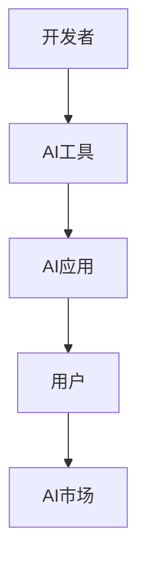

                 

**关键词：**AI应用、市场分析、苹果、人工智能、机器学习、深度学习、算法、数据、隐私、创新

## 1. 背景介绍

自从2017年发布了面向开发者的Core ML以来，苹果公司一直在努力将人工智能（AI）整合到其生态系统中。最近，苹果在其WWDC大会上发布了新的AI应用和技术，进一步巩固了其在AI领域的地位。本文将分析苹果在AI应用市场的策略，并讨论其技术创新如何影响AI行业的未来。

## 2. 核心概念与联系

### 2.1 AI应用市场的现状

AI应用市场正在迅速扩张，预计到2025年，全球AI市场规模将达到1903亿美元。然而，市场上充斥着各种AI应用，从简单的图像分类到复杂的自然语言处理（NLP），开发者和用户都面临着选择困难的问题。苹果通过提供一套简单易用的AI工具，帮助开发者构建高质量的AI应用，从而填补了市场空白。



### 2.2 苹果的AI策略

苹果的AI策略可以总结为以下几点：

1. **隐私第一：**苹果始终强调隐私保护，其AI技术旨在保护用户数据，避免将数据上传到云端进行处理。
2. **简单易用：**苹果提供的AI工具旨在使开发者能够轻松构建AI应用，无需深入了解AI算法的细节。
3. **创新技术：**苹果不断推出新的AI技术，以保持其在AI领域的领先地位。

## 3. 核心算法原理 & 具体操作步骤

### 3.1 算法原理概述

苹果的Core ML和Create ML框架支持各种AI算法，包括支持向量机（SVM）、决策树、神经网络等。其中，神经网络是最常用的算法，用于图像分类、物体检测、语音识别等任务。

### 3.2 算法步骤详解

1. **数据收集：**收集与任务相关的数据，如图像、文本、音频等。
2. **数据预处理：**清洗、标记和格式化数据，以便输入到AI模型中。
3. **模型训练：**使用Create ML或其他工具训练AI模型，使其能够从数据中学习。
4. **模型优化：**调整模型参数，以提高其准确性和效率。
5. **模型部署：**将模型集成到应用中，并进行测试和部署。

### 3.3 算法优缺点

**优点：**

* 简单易用，无需深入了解AI算法细节。
* 保护用户隐私，数据处理在设备本地进行。
* 支持各种AI算法，适用于不同的任务。

**缺点：**

* 相对于云端AI服务，本地AI处理能力有限。
* 创建高质量AI模型需要大量数据和计算资源。

### 3.4 算法应用领域

苹果的AI算法广泛应用于图像分类、物体检测、语音识别、自然语言处理等领域。例如，在图像分类任务中，开发者可以使用Core ML构建的模型来识别图像中的物体，并提供相应的标签。

## 4. 数学模型和公式 & 详细讲解 & 举例说明

### 4.1 数学模型构建

神经网络是一种通用的AI模型，其数学模型可以表示为：

$$y = f(wx + b)$$

其中，$x$是输入向量，$w$和$b$是模型参数，$f$是激活函数，$y$是输出。

### 4.2 公式推导过程

神经网络的训练过程涉及到梯度下降算法，其目标是最小化损失函数：

$$L = \frac{1}{n}\sum_{i=1}^{n}l(y_i, \hat{y}_i)$$

其中，$l$是损失函数，$y_i$是真实标签，$\hat{y}_i$是模型预测的标签，$n$是样本数。

### 4.3 案例分析与讲解

例如，在图像分类任务中，输入向量$x$可以表示为图像的像素值，输出向量$y$可以表示为各类别的概率。开发者可以使用Create ML工具训练一个神经网络模型，并使用Core ML将其集成到应用中。

## 5. 项目实践：代码实例和详细解释说明

### 5.1 开发环境搭建

要构建AI应用，开发者需要安装Xcode和Create ML工具。此外，还需要收集与任务相关的数据，并对其进行预处理。

### 5.2 源代码详细实现

以下是使用Create ML构建图像分类模型的示例代码：

```swift
import CreateMLDataTable

// Load the data
let (trainingData, testingData) = try MLDataTable(contentsOf: URL(fileURLWithPath: "/path/to/data.csv"))

// Create a model
let (trainingInput, trainingOutput) = (try MLDataTable(trainingData: trainingData), MLDataTable(trainingData: trainingData))
let (testingInput, testingOutput) = (try MLDataTable(trainingData: testingData), MLDataTable(trainingData: testingData))

let (model, trainingDescription) = try MLRegressor.train(using: trainingInput, target: trainingOutput)

// Evaluate the model
let evaluation = try model.evaluation(using: testingInput, target: testingOutput)
print("Evaluation: \(evaluation)")
```

### 5.3 代码解读与分析

上述代码首先加载数据，然后创建一个回归模型，并使用训练数据对其进行训练。最后，使用测试数据对模型进行评估，并打印出评估结果。

### 5.4 运行结果展示

运行上述代码后，开发者可以在控制台中看到模型的评估结果，例如准确率、精确度、召回率等指标。

## 6. 实际应用场景

### 6.1 当前应用场景

苹果的AI应用已经广泛应用于其生态系统中，例如：

* **图像分类：**在照片应用中，AI用于自动标记照片中的物体和场景。
* **语音识别：**在Siri中，AI用于识别用户的语音指令。
* **自然语言处理：**在邮件应用中，AI用于自动分类和组织邮件。

### 6.2 未来应用展望

随着AI技术的不断发展，苹果的AI应用将会扩展到更多领域，例如：

* **自动驾驶：**AI可以帮助汽车感知环境，并做出决策。
* **医疗保健：**AI可以帮助医生分析病人的症状，并提供诊断建议。
* **虚拟现实：**AI可以帮助创建更真实的虚拟环境，并提供更好的用户体验。

## 7. 工具和资源推荐

### 7.1 学习资源推荐

* **官方文档：**[Apple Developer Documentation](https://developer.apple.com/documentation/)
* **在线课程：**[Stanford University's CS221: Machine Learning](https://online.stanford.edu/courses/cs221-machine-learning)
* **书籍：**[Hands-On Machine Learning with Scikit-Learn, Keras, and TensorFlow](https://www.oreilly.com/library/view/hands-on-machine-learning/9781492032632/)

### 7.2 开发工具推荐

* **Xcode：**[Xcode](https://developer.apple.com/xcode/)
* **Create ML：**[Create ML](https://developer.apple.com/machine-learning/)
* **Core ML：**[Core ML](https://developer.apple.com/machine-learning/core-ml/)

### 7.3 相关论文推荐

* **神经网络：**[Deep Learning](https://www.deeplearningbook.org/)
* **支持向量机：**[Support Vector Machines](https://www.csie.ntu.edu.tw/~cjlin/papers/guide/guide.pdf)
* **决策树：**[Decision Trees and Random Forests](https://www.stat.berkeley.edu/~breiman/RandomForests/cc_home.htm)

## 8. 总结：未来发展趋势与挑战

### 8.1 研究成果总结

苹果在AI应用市场的策略已经取得了显著的成功，其AI技术已经广泛应用于其生态系统中。然而，苹果面临着来自云端AI服务提供商的激烈竞争，例如Google、Amazon和Microsoft。

### 8.2 未来发展趋势

未来，苹果将继续在AI领域投资，并推出新的AI技术和应用。此外，苹果还将继续强调隐私保护，以区别于云端AI服务提供商。

### 8.3 面临的挑战

苹果面临的挑战包括：

* **算力限制：**本地AI处理能力有限，无法与云端AI服务提供商竞争。
* **数据获取：**构建高质量AI模型需要大量数据，但获取数据的成本高昂。
* **隐私保护：**虽然苹果强调隐私保护，但仍然面临着用户数据泄露的风险。

### 8.4 研究展望

未来，苹果将继续在AI领域进行研究，以推出新的AI技术和应用。此外，苹果还将继续强调隐私保护，并寻求与其他公司合作，共同推动AI技术的发展。

## 9. 附录：常见问题与解答

**Q1：苹果的AI技术与云端AI服务提供商有何不同？**

A1：苹果的AI技术旨在保护用户隐私，数据处理在设备本地进行。相比之下，云端AI服务提供商通常需要将数据上传到云端进行处理。

**Q2：如何构建高质量的AI模型？**

A2：构建高质量的AI模型需要大量数据和计算资源。开发者需要收集与任务相关的数据，并对其进行预处理。然后，开发者需要选择合适的AI算法，并对模型进行训练和优化。

**Q3：苹果的AI技术在哪些领域得到应用？**

A3：苹果的AI技术广泛应用于图像分类、语音识别、自然语言处理等领域。此外，苹果还在自动驾驶、医疗保健和虚拟现实等领域进行研究。

## 作者：禅与计算机程序设计艺术 / Zen and the Art of Computer Programming

