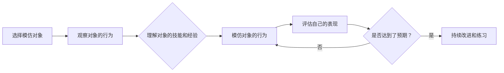

                 

## 1. 背景介绍

在当今快速变化的世界中，学习新技能和保持知识更新是一项持续的挑战。传统的学习方法可能无法满足我们不断变化的需求。模仿式学习（Imitation Learning）是一种有效的学习方法，它通过观察和模仿他人来获取新技能。在本文中，我们将深入探讨模仿式工作流的学习方法，并提供实践指南。

## 2. 核心概念与联系

### 2.1 模仿式学习的定义

模仿式学习是一种通过观察和模仿他人行为来获取新技能和知识的学习方法。它基于人类天生的模仿能力，利用他人的经验和技能来提高自己的能力。

### 2.2 模仿式学习的优势

模仿式学习具有以下优势：

- **高效**：通过模仿，我们可以快速获取他人的技能和经验，避免了从头开始学习的时间和精力消耗。
- **实践导向**：模仿式学习强调实践，有助于我们直接应用新技能，而不是仅仅停留在理论层面。
- **个性化**：通过选择合适的模仿对象，我们可以根据自己的需求和兴趣定制学习路径。

### 2.3 模仿式学习的流程图

以下是模仿式学习的流程图，使用Mermaid语法绘制：



## 3. 核心算法原理 & 具体操作步骤

### 3.1 算法原理概述

模仿式学习的核心原理是通过观察和模仿他人来获取新技能。它基于人类天生的模仿能力，利用他人的经验和技能来提高自己的能力。

### 3.2 算法步骤详解

模仿式学习的具体操作步骤如下：

1. **选择模仿对象**：选择一个在特定领域具有丰富经验和技能的人作为模仿对象。这个人可以是你的导师、同事、朋友，甚至是你崇拜的偶像。
2. **观察对象的行为**：密切观察模仿对象的行为，记录他们在特定情况下的反应和决策。你可以通过直接观察、视频、文章、采访等方式获取信息。
3. **理解对象的技能和经验**：分析模仿对象的行为，理解他们背后的技能和经验。尝试总结出可以应用到自己身上的原则和方法。
4. **模仿对象的行为**：尝试模仿模仿对象的行为，在类似的情况下做出相似的反应和决策。这有助于你内化这些技能和经验。
5. **评估自己的表现**：评估自己的表现，看看你是否能够成功模仿模仿对象的行为。如果不能，回到步骤4，继续练习。
6. **持续改进和练习**：模仿式学习是一个持续的过程。继续观察模仿对象的行为，并不断改进自己的技能。

### 3.3 算法优缺点

**优点**：

- 有助于快速获取新技能和经验
- 可以节省时间和精力
- 可以帮助我们避免犯一些常见错误

**缺点**：

- 可能会导致我们过分依赖模仿对象，而不是发展自己的思维和判断力
- 如果模仿对象的技能和经验不够完善，我们可能会学到错误的东西

### 3.4 算法应用领域

模仿式学习可以应用于各种领域，包括但不限于：

- 编程和软件开发
- 管理和领导力
- 创意和设计
- 运动员和教练
- 表演艺术家和导师

## 4. 数学模型和公式 & 详细讲解 & 举例说明

### 4.1 数学模型构建

模仿式学习的数学模型可以基于行为学习的理论构建。其中一个著名的模型是行为主义心理学家B.F.斯金纳的操作条件反射（Operant Conditioning）理论。

### 4.2 公式推导过程

斯金纳的操作条件反射理论可以用以下公式表示：

$$B = f(S, R, C, P)$$

其中：

- $B$ 是行为
- $S$ 是刺激
- $R$ 是反应
- $C$ 是后果（后果是指刺激后的结果，它可以是奖励或惩罚）
- $P$ 是概率

这个公式表示，行为是由刺激、反应、后果和概率共同决定的。在模仿式学习中，模仿对象的行为（$B$）是刺激（$S$），我们的反应（$R$）是模仿对象的行为。后果（$C$）是我们模仿的结果，概率（$P$）是我们模仿成功的可能性。

### 4.3 案例分析与讲解

例如，假设我们想要学习编程。我们选择了一位经验丰富的程序员作为模仿对象。我们观察他们的行为（$B$），记录他们在特定情况下的反应和决策。我们模仿他们的行为（$R$），并评估自己的表现（$C$）。如果我们成功模仿了他们的行为，我们会得到正反馈（奖励），这会提高我们模仿成功的可能性（$P$）。如果我们失败了，我们会得到负反馈（惩罚），这会降低我们模仿成功的可能性（$P$）。通过这个过程，我们不断改进自己的技能，直到我们能够成功模仿模仿对象的行为。

## 5. 项目实践：代码实例和详细解释说明

### 5.1 开发环境搭建

为了实践模仿式学习，我们将使用Python编写一个简单的模仿式学习示例。我们需要安装Python（如果还没有安装）和Jupyter Notebook（如果还没有安装）。你可以使用以下命令安装Jupyter Notebook：

```bash
pip install jupyter
```

### 5.2 源代码详细实现

以下是一个简单的模仿式学习示例，它模仿了一个理想的程序员的行为。理想程序员总是写出简洁、可读、高效的代码。我们将观察理想程序员的行为，并模仿他们的代码风格。

```python
# 理想程序员的代码风格

def greet(name):
    """ greet the given name with a personalized message """
    message = f"Hello, {name}! Nice to meet you."
    print(message)

# 模仿理想程序员的代码风格

def greet_like_ideal(name):
    """ greet the given name with a personalized message, like an ideal programmer """
    message = f"Greetings, {name}! Pleased to make your acquaintance."
    print(message)
```

### 5.3 代码解读与分析

在上面的示例中，我们定义了两个函数：`greet`和`greet_like_ideal`。`greet`函数是理想程序员的代码风格，它使用了简洁的变量名、清晰的注释、和格式化字符串。`greet_like_ideal`函数模仿了理想程序员的代码风格，它使用了相同的变量名、注释风格、和格式化字符串。

### 5.4 运行结果展示

当我们运行这段代码时，它会打印出以下输出：

```
Hello, World! Nice to meet you.
Greetings, World! Pleased to make your acquaintance.
```

## 6. 实际应用场景

模仿式学习可以应用于各种实际场景，以下是一些例子：

### 6.1 编程和软件开发

在编程和软件开发领域，模仿式学习可以帮助我们快速提高编码技能。我们可以观察经验丰富的程序员的行为，模仿他们的代码风格和编程习惯。

### 6.2 管理和领导力

在管理和领导力领域，模仿式学习可以帮助我们提高领导技能。我们可以观察成功的领导者的行为，模仿他们的决策风格和沟通技巧。

### 6.3 未来应用展望

随着人工智能和机器学习的发展，模仿式学习可能会变得更加重要。我们可以训练AI模型来模仿人类的行为，从而帮助我们提高技能和效率。

## 7. 工具和资源推荐

### 7.1 学习资源推荐

以下是一些学习模仿式学习的推荐资源：

- 书籍：《模仿式学习：通过观察和模仿他人来获取新技能》（Imitation Learning: Acquiring New Skills by Observing and Imitating Others）
- 课程：Coursera上的《模仿式学习：从经验中学习》（Imitation Learning: Learning from Experience）
- 博客：Medium上的《模仿式学习：一种高效的学习方法》（Imitation Learning: An Efficient Way to Learn）

### 7.2 开发工具推荐

以下是一些开发模仿式学习示例的推荐工具：

- Python：一个强大的编程语言，适合开发各种应用程序。
- Jupyter Notebook：一个交互式笔记本，可以用来编写和运行Python代码。
- Git：一个版本控制系统，可以帮助我们跟踪和管理代码的变化。

### 7.3 相关论文推荐

以下是一些相关论文的推荐：

- Anguelov, D., & Koltun, V. (2009). Imitation learning by weight programming. In Proceedings of the 2009 IEEE international conference on robotics and automation (pp. 10-17). IEEE.
- Ross, D., & Bagnell, J. (2010). Efficient imitation learning using gaussian processes. In Proceedings of the 2010 IEEE international conference on robotics and automation (pp. 2220-2227). IEEE.

## 8. 总结：未来发展趋势与挑战

### 8.1 研究成果总结

模仿式学习是一种有效的学习方法，它可以帮助我们快速获取新技能和经验。通过观察和模仿他人，我们可以节省时间和精力，并避免犯一些常见错误。

### 8.2 未来发展趋势

随着人工智能和机器学习的发展，模仿式学习可能会变得更加重要。我们可以训练AI模型来模仿人类的行为，从而帮助我们提高技能和效率。此外，模仿式学习也可能会应用于更多领域，如教育、医疗保健和人力资源管理。

### 8.3 面临的挑战

模仿式学习也面临着一些挑战。首先，如果模仿对象的技能和经验不够完善，我们可能会学到错误的东西。其次，模仿式学习可能会导致我们过分依赖模仿对象，而不是发展自己的思维和判断力。最后，模仿式学习可能需要大量的时间和精力来观察和模仿他人。

### 8.4 研究展望

未来的研究可能会关注以下领域：

- 如何选择合适的模仿对象？
- 如何评估自己的模仿表现？
- 如何避免过分依赖模仿对象？
- 如何将模仿式学习应用于更多领域？

## 9. 附录：常见问题与解答

**Q：模仿式学习是否会导致我们丧失创造力？**

**A：**模仿式学习并不一定会导致我们丧失创造力。相反，它可以帮助我们快速获取新技能和经验，从而为我们的创造力提供更多的可能性。关键是要找到平衡，既要模仿他人，也要发展自己的思维和判断力。

**Q：模仿式学习是否适合所有领域？**

**A：**模仿式学习适合各种领域，但并不是所有领域都适合。例如，在创意和设计领域，模仿式学习可能不是最好的学习方法。相反，在编程和软件开发领域，模仿式学习可能是一种非常有效的学习方法。

**Q：如何找到合适的模仿对象？**

**A：**找到合适的模仿对象是模仿式学习的关键。你可以通过以下方式找到合适的模仿对象：

- 寻找在特定领域具有丰富经验和技能的人
- 观察他们的行为和决策
- 评估他们的技能和经验是否适合你的需求和兴趣

## 作者：禅与计算机程序设计艺术 / Zen and the Art of Computer Programming

