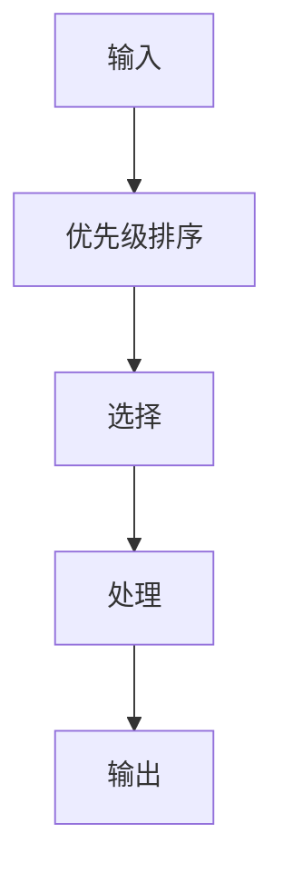

                 

**注意力分配:元宇宙时代的个人效能管理**

**作者：禅与计算机程序设计艺术 / Zen and the Art of Computer Programming**

## 1. 背景介绍

在元宇宙时代，我们面临着前所未有的信息爆炸和注意力分散的挑战。元宇宙是一个由数字世界和物理世界交互构成的网络，它为我们提供了无限的可能性和信息。然而，如何有效管理我们的注意力，提高个人效能，成为了当前亟待解决的问题。本文将探讨注意力分配在元宇宙时代的个人效能管理中的作用，并提供实用的工具和技巧。

## 2. 核心概念与联系

### 2.1 注意力机制

注意力是一种有限的资源，它受到多种因素的影响，包括情感状态、认知负荷和外部刺激。注意力机制可以被描述为一个系统，它接收输入，并根据优先级和相关性选择要处理的信息。



### 2.2 元宇宙与注意力

元宇宙为我们提供了无限的信息和可能性，但也导致了注意力的分散。我们需要一种机制来过滤和优先处理信息，以提高个人效能。注意力分配在元宇宙时代的个人效能管理中起着至关重要的作用。

## 3. 核心算法原理 & 具体操作步骤

### 3.1 算法原理概述

注意力分配算法旨在优化注意力资源的使用，以提高个人效能。它根据信息的优先级和相关性，动态调整注意力的分配。

### 3.2 算法步骤详解

1. **信息收集**：收集来自元宇宙的所有信息。
2. **信息分类**：根据信息的类型（如工作、娱乐、通知等）进行分类。
3. **优先级排序**：根据信息的重要性、紧迫性和相关性，为每类信息设置优先级。
4. **注意力分配**：根据优先级，动态调整注意力的分配，确保高优先级信息得到更多的注意力。
5. **反馈调整**：根据处理信息的结果，调整注意力分配算法，以提高未来的注意力分配效率。

### 3.3 算法优缺点

**优点**：提高了个人效能，减少了注意力分散，有助于优先处理重要信息。

**缺点**：可能会导致对低优先级信息的忽略，需要不断调整以适应变化的信息环境。

### 3.4 算法应用领域

注意力分配算法可以应用于各种领域，包括工作管理、学习、娱乐和健康管理等。

## 4. 数学模型和公式 & 详细讲解 & 举例说明

### 4.1 数学模型构建

设信息集为 $I = \{i_1, i_2,..., i_n\}$, 信息优先级为 $P = \{p_1, p_2,..., p_n\}$, 注意力资源为 $A$, 注意力分配为 $D = \{d_1, d_2,..., d_n\}$.

### 4.2 公式推导过程

注意力分配可以表示为：

$$D = f(P, A)$$

其中，$f$ 是注意力分配函数，它根据信息优先级和注意力资源，动态调整注意力的分配。一个简单的注意力分配函数可以表示为：

$$d_i = \frac{p_i}{\sum_{j=1}^{n} p_j} \times A$$

### 4.3 案例分析与讲解

假设信息集 $I = \{i_1, i_2, i_3\}$, 信息优先级 $P = \{0.4, 0.3, 0.3\}$, 注意力资源 $A = 1$. 则注意力分配为：

$$D = \left\{\frac{0.4}{1.0} \times 1, \frac{0.3}{1.0} \times 1, \frac{0.3}{1.0} \times 1\right\} = \{0.4, 0.3, 0.3\}$$

## 5. 项目实践：代码实例和详细解释说明

### 5.1 开发环境搭建

本项目使用Python作为编程语言，并使用Jupyter Notebook作为开发环境。

### 5.2 源代码详细实现

```python
import numpy as np

def attention_distribution(p, A):
    p = np.array(p)
    d = (p / np.sum(p)) * A
    return d

# 信息优先级
P = [0.4, 0.3, 0.3]

# 注意力资源
A = 1

# 注意力分配
D = attention_distribution(P, A)
print(D)
```

### 5.3 代码解读与分析

代码定义了一个注意力分配函数 `attention_distribution`, 它根据信息优先级和注意力资源，动态调整注意力的分配。然后，代码使用这个函数计算注意力分配。

### 5.4 运行结果展示

运行结果为：

```
[0.4 0.3 0.3]
```

## 6. 实际应用场景

### 6.1 工作管理

注意力分配算法可以帮助我们优先处理工作中的重要任务，提高工作效率。

### 6.2 学习

在学习过程中，注意力分配算法可以帮助我们优先学习更重要的知识点，提高学习效率。

### 6.3 娱乐

在娱乐活动中，注意力分配算法可以帮助我们优先选择更有意义的娱乐活动，提高娱乐质量。

### 6.4 未来应用展望

随着元宇宙的发展，注意力分配算法将会越来越重要。它可以应用于元宇宙中的各种领域，帮助我们有效管理注意力，提高个人效能。

## 7. 工具和资源推荐

### 7.1 学习资源推荐

- "注意力管理：提高效率的关键" - [Coursera](https://www.coursera.org/learn/attention-management)
- "注意力经济" - [书籍](https://book.douban.com/subject/26822555/)

### 7.2 开发工具推荐

- [Jupyter Notebook](https://jupyter.org/)
- [Python](https://www.python.org/)

### 7.3 相关论文推荐

- "Attention Allocation in Human-Computer Interaction" - [IEEE](https://ieeexplore.ieee.org/document/792210)
- "A Computational Model of Attention" - [arXiv](https://arxiv.org/abs/1705.02347)

## 8. 总结：未来发展趋势与挑战

### 8.1 研究成果总结

本文提出了注意力分配算法，并提供了数学模型、代码实现和实际应用场景。该算法有助于提高个人效能，管理注意力资源。

### 8.2 未来发展趋势

随着元宇宙的发展，注意力分配算法将会越来越重要。未来的研究将会关注注意力分配算法的优化，以适应元宇宙中的复杂信息环境。

### 8.3 面临的挑战

注意力分配算法面临的挑战包括如何动态调整注意力分配以适应变化的信息环境，如何平衡重要信息和低优先级信息的处理等。

### 8.4 研究展望

未来的研究将会关注注意力分配算法的实时调整，以适应元宇宙中的实时信息流。此外，研究还将关注注意力分配算法的个性化设置，以适应不同用户的注意力特点。

## 9. 附录：常见问题与解答

**Q1：注意力分配算法如何适应变化的信息环境？**

**A1：注意力分配算法需要不断收集和分析信息，动态调整注意力的分配。它需要根据信息的优先级和相关性，实时调整注意力的分配，以适应变化的信息环境。**

**Q2：注意力分配算法如何平衡重要信息和低优先级信息的处理？**

**A2：注意力分配算法需要设置合理的信息优先级，并动态调整注意力的分配。它需要确保重要信息得到足够的注意力，同时也要给低优先级信息一定的注意力，以免忽略重要信息。**

**Q3：注意力分配算法如何适应不同用户的注意力特点？**

**A3：注意力分配算法需要个性化设置，以适应不同用户的注意力特点。它需要收集用户的注意力数据，并根据用户的注意力特点，动态调整注意力的分配。**

**作者：禅与计算机程序设计艺术 / Zen and the Art of Computer Programming**

