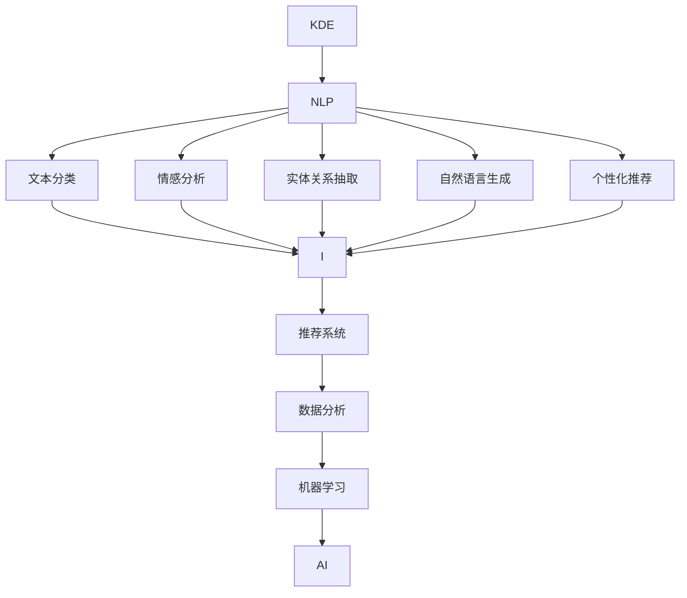

                 

# 知识发现引擎在语言学习中的应用

> 关键词：知识发现引擎, 语言学习, 自然语言处理(NLP), 机器学习, 数据分析, 推荐系统, 人工智能(AI)

## 1. 背景介绍

### 1.1 问题由来
知识发现引擎(Knowledge Discovery Engine, KDE)，也称为数据挖掘(Data Mining)，是指通过智能算法从大量数据中提取和发现有用的知识的过程。在当前的知识经济时代，如何从海量数据中高效地挖掘出有价值的知识，是一个至关重要的问题。语言学习作为知识发现的重要领域之一，其核心在于对语言数据的分析和挖掘，以揭示语言背后的规律和模式，并指导语言学习。

### 1.2 问题核心关键点
知识发现引擎在语言学习中的应用，主要集中在以下几个方面：

1. 自动文本分类与情感分析：通过机器学习算法对文本进行分类和情感判断，了解文本的情感倾向和主题。
2. 自然语言生成(NLG)：基于文本数据自动生成新的语言表达，如摘要生成、机器翻译等。
3. 知识抽取与关联：从文本数据中抽取实体、关系等知识，并将其关联起来，构建知识图谱。
4. 个性化推荐：根据用户的学习历史和偏好，推荐合适的学习材料。
5. 自动评估：使用智能算法对学习效果进行评估和反馈，提升学习效果。

### 1.3 问题研究意义
知识发现引擎在语言学习中的应用，有助于提升学习效率和效果，减少学习资源浪费，促进个性化学习，具有重要意义：

1. 提升学习效率：通过自动化处理大量文本数据，节省学习者时间，提高学习效率。
2. 个性化学习：根据用户特点和学习历史，推荐合适的学习资源，促进因材施教。
3. 辅助教师：为教师提供科学的数据支持，辅助教学设计和管理。
4. 数据驱动决策：基于数据分析结果，优化学习策略和资源配置。

## 2. 核心概念与联系

### 2.1 核心概念概述

为更好地理解知识发现引擎在语言学习中的应用，本节将介绍几个关键概念：

- 知识发现引擎(KDE)：通过数据挖掘算法从大量数据中发现知识，包括自动文本分类、情感分析、实体关系抽取等。
- 自然语言处理(NLP)：涉及计算机与人类语言互动的领域，旨在使计算机能够理解、解释和生成人类语言。
- 机器学习(ML)：指使用算法和统计模型，通过训练数据来让计算机自动改进任务性能。
- 数据分析(Analytics)：通过收集、处理和分析数据，发现有用信息和知识的过程。
- 推荐系统(Recommender Systems)：通过分析用户行为和偏好，推荐合适物品或内容。
- 人工智能(AI)：使计算机系统能够执行通常需要人类智能的任务。

这些核心概念之间的逻辑关系可以通过以下Mermaid流程图来展示：



这个流程图展示了知识发现引擎在语言学习中的应用路径：

1. 知识发现引擎从大量文本数据中挖掘出有用的知识。
2. 这些知识通过自然语言处理技术转化为可理解的形式。
3. 使用机器学习算法对文本进行分类、情感分析等，进行实体关系抽取。
4. 基于这些处理结果，进行自然语言生成和个性化推荐。
5. 数据分析和机器学习进一步提升推荐系统性能，辅助人工智能实现。

## 3. 核心算法原理 & 具体操作步骤
### 3.1 算法原理概述

知识发现引擎在语言学习中的应用，主要基于以下算法原理：

- 监督学习与非监督学习：从大量标注数据中学习模型，或从未标注数据中挖掘模式和知识。
- 深度学习：使用神经网络模型处理文本数据，提取高层次的特征表示。
- 自然语言处理技术：包括词向量、Transformer等模型，进行文本向量化和理解。
- 推荐系统算法：如协同过滤、矩阵分解、内容推荐等，推荐合适的学习材料。

### 3.2 算法步骤详解

基于知识发现引擎的语言学习应用，一般包括以下几个关键步骤：

**Step 1: 数据准备与预处理**
- 收集并清洗语言学习相关的数据集，如课程讲义、习题、论坛帖子等。
- 进行文本分词、去停用词、词性标注等预处理，准备好数据输入。

**Step 2: 特征提取与选择**
- 使用TF-IDF、词向量、BERT等方法对文本进行特征提取和降维。
- 选择有效的特征子集，减少维度，提高模型效率。

**Step 3: 模型训练与优化**
- 选择合适的机器学习算法或深度学习模型，如SVM、KNN、BERT等。
- 使用监督学习或非监督学习算法，进行模型训练。
- 根据验证集评估模型性能，使用正则化、dropout等技术优化模型。

**Step 4: 结果解释与应用**
- 对模型输出结果进行解释，如展示分类结果、情感倾向、实体关系等。
- 根据分析结果，推荐合适的学习材料或调整学习策略。

**Step 5: 评估与反馈**
- 对学习效果进行评估，如使用标准化测试或自主评估系统。
- 根据反馈结果，调整学习策略和推荐系统。

### 3.3 算法优缺点

知识发现引擎在语言学习中的应用具有以下优点：
1. 自动化处理大量数据，节省人力和时间。
2. 利用大数据发现潜在的知识和规律，提升学习效果。
3. 个性化推荐系统可以根据用户特点推荐合适的学习材料。
4. 通过自动评估和反馈，优化学习策略。

同时，该方法也存在一定的局限性：
1. 对数据质量依赖较大，数据收集和清洗可能耗时耗力。
2. 算法复杂度高，需要较强的技术储备。
3. 结果解释性较差，难以直观展示和理解。
4. 对于长尾领域和特定领域的数据挖掘能力较弱。

尽管存在这些局限性，但就目前而言，知识发现引擎在语言学习中的应用仍是大数据挖掘领域的重要方向。未来相关研究的重点在于如何进一步提升算法的效率和效果，改进推荐系统，并加强结果解释和可视化。

### 3.4 算法应用领域

知识发现引擎在语言学习中的应用，已经广泛应用于以下几个领域：

- 在线教育：自动分类和推荐课程、习题、阅读材料等。
- 智能答疑：自动分析学生提问，提供准确解答和建议。
- 语言评测：自动评估学生语言水平，提供反馈和改进建议。
- 个性化学习路径规划：根据学习历史和兴趣，推荐合适的学习路径。
- 研究论文分析：自动挖掘和提取论文中的关键知识，辅助科研工作。

这些应用领域展示了知识发现引擎在语言学习中的巨大潜力和广泛应用。

## 4. 数学模型和公式 & 详细讲解 & 举例说明（备注：数学公式请使用latex格式，latex嵌入文中独立段落使用 $$，段落内使用 $)
### 4.1 数学模型构建

本节将使用数学语言对知识发现引擎在语言学习中的应用进行严格刻划。

记输入为 $X=\{x_1, x_2, ..., x_n\}$，其中 $x_i$ 表示一个文本实例，$x_i=\{w_1, w_2, ..., w_m\}$ 表示文本实例的词向量表示。设模型 $M$ 将输入映射为 $y$，其中 $y$ 可以是分类标签、情感分数等。

知识发现引擎的目标是最小化预测误差，即：

$$
\min_{M} L(y, M(X))
$$

其中 $L(y, M(X))$ 表示模型 $M$ 在输入 $X$ 上的损失函数，如交叉熵损失、平方误差等。

### 4.2 公式推导过程

以下我们以文本分类任务为例，推导交叉熵损失函数及其梯度计算公式。

假设模型 $M$ 在输入 $x_i$ 上的输出为 $\hat{y}=M(x_i) \in [0,1]$，表示样本属于正类的概率。真实标签 $y \in \{0,1\}$。则二分类交叉熵损失函数定义为：

$$
L(y, \hat{y}) = -[y\log \hat{y} + (1-y)\log (1-\hat{y})]
$$

将其代入经验风险公式，得：

$$
\mathcal{L}(X) = -\frac{1}{N}\sum_{i=1}^N [y_i\log M(x_i)+(1-y_i)\log(1-M(x_i))]
$$

根据链式法则，损失函数对模型参数 $\theta$ 的梯度为：

$$
\frac{\partial \mathcal{L}(X)}{\partial \theta} = -\frac{1}{N}\sum_{i=1}^N (\frac{y_i}{M(x_i)}-\frac{1-y_i}{1-M(x_i)}) \frac{\partial M(x_i)}{\partial \theta}
$$

其中 $\frac{\partial M(x_i)}{\partial \theta}$ 可进一步递归展开，利用自动微分技术完成计算。

在得到损失函数的梯度后，即可带入模型参数更新公式，完成模型的迭代优化。重复上述过程直至收敛，最终得到适应文本分类任务的最优模型 $M_{\theta}$。

## 5. 项目实践：代码实例和详细解释说明
### 5.1 开发环境搭建

在进行知识发现引擎实践前，我们需要准备好开发环境。以下是使用Python进行TensorFlow开发的环境配置流程：

1. 安装Anaconda：从官网下载并安装Anaconda，用于创建独立的Python环境。

2. 创建并激活虚拟环境：
```bash
conda create -n tf-env python=3.8 
conda activate tf-env
```

3. 安装TensorFlow：根据CUDA版本，从官网获取对应的安装命令。例如：
```bash
conda install tensorflow tensorflow-gpu=cuda11.1 -c pytorch -c conda-forge
```

4. 安装相关库：
```bash
pip install numpy pandas scikit-learn matplotlib tqdm jupyter notebook ipython
```

完成上述步骤后，即可在`tf-env`环境中开始知识发现引擎的实践。

### 5.2 源代码详细实现

这里我们以文本分类任务为例，给出使用TensorFlow进行KNN算法分类模型的PyTorch代码实现。

首先，定义文本分类任务的数据处理函数：

```python
import tensorflow as tf
from sklearn.feature_extraction.text import TfidfVectorizer
from sklearn.model_selection import train_test_split

def preprocess_data(texts, labels):
    vectorizer = TfidfVectorizer(stop_words='english')
    X = vectorizer.fit_transform(texts)
    y = labels
    return X.toarray(), y
```

然后，定义模型和优化器：

```python
from tensorflow.keras.models import Sequential
from tensorflow.keras.layers import Dense
from sklearn.metrics import accuracy_score

model = Sequential()
model.add(Dense(32, input_dim=100, activation='relu'))
model.add(Dense(1, activation='sigmoid'))

model.compile(loss='binary_crossentropy', optimizer='adam', metrics=['accuracy'])
```

接着，定义训练和评估函数：

```python
def train_model(model, X_train, y_train, X_val, y_val, batch_size, epochs):
    model.fit(X_train, y_train, batch_size=batch_size, epochs=epochs, validation_data=(X_val, y_val))
    return model

def evaluate_model(model, X_test, y_test):
    y_pred = model.predict(X_test)
    y_pred = (y_pred > 0.5).astype(int)
    acc = accuracy_score(y_test, y_pred)
    return acc
```

最后，启动训练流程并在测试集上评估：

```python
X_train, X_test, y_train, y_test = train_test_split(X, y, test_size=0.2, random_state=42)

model = train_model(model, X_train, y_train, X_test, y_test, batch_size=32, epochs=10)
acc = evaluate_model(model, X_test, y_test)
print(f"Accuracy: {acc:.2f}")
```

以上就是使用TensorFlow进行文本分类任务的知识发现引擎的完整代码实现。可以看到，TensorFlow提供了丰富的模型和工具，使代码实现更加简洁高效。

### 5.3 代码解读与分析

让我们再详细解读一下关键代码的实现细节：

**preprocess_data函数**：
- 对文本进行TF-IDF向量化，去除停用词。
- 使用sklearn的train_test_split函数将数据集划分为训练集和测试集。

**train_model函数**：
- 定义神经网络模型，包含一个输入层、一个隐藏层和一个输出层。
- 使用binary_crossentropy损失函数和adam优化器进行模型训练。
- 在验证集上评估模型性能，根据性能决定是否提前停止训练。

**evaluate_model函数**：
- 在测试集上评估模型性能，计算准确率。
- 将模型预测结果与真实标签进行比较，计算准确率。

**训练流程**：
- 划分数据集，在训练集上训练模型。
- 在测试集上评估模型性能，输出准确率。

可以看到，TensorFlow使得知识发现引擎在语言学习中的应用更加方便和高效。开发者可以专注于模型设计和优化，而不必过多关注底层实现细节。

## 6. 实际应用场景
### 6.1 在线教育平台

在线教育平台通过知识发现引擎，能够自动分类和推荐适合学生的学习资源，提高学习效率和效果。平台可以收集学生的在线学习行为数据，如浏览记录、答题情况、讨论内容等，通过自然语言处理技术进行文本向量化和分析，发现学生的学习模式和偏好。基于这些信息，知识发现引擎可以自动推荐适合的学习材料，帮助学生快速掌握知识点。

### 6.2 智能答疑系统

智能答疑系统通过知识发现引擎，能够自动理解和解答学生的提问，提供准确和及时的答案。系统可以收集学生的提问数据，使用自然语言处理技术进行文本向量化和分类，找到相似问题的解法。基于这些解法，知识发现引擎可以自动生成响应，帮助学生解决问题。

### 6.3 语言评测系统

语言评测系统通过知识发现引擎，能够自动评估学生的语言水平，提供详细的反馈和改进建议。系统可以收集学生的作文、口语、听力等文本数据，使用自然语言处理技术进行情感分析、风格分析等，发现学生的弱点和优势。基于这些信息，知识发现引擎可以自动生成评价报告，指导学生改进。

### 6.4 未来应用展望

随着知识发现引擎和自然语言处理技术的不断发展，其在语言学习中的应用将进一步拓展，展现出广阔的前景：

- 自动学习路径规划：根据学生的学习历史和兴趣，推荐合适的学习路径，优化学习过程。
- 学习效果评估与反馈：通过自动评估和反馈，优化学习策略和推荐系统，提升学习效果。
- 多语言学习支持：支持多种语言学习，提供多样化的学习资源和评估标准。
- 跨领域知识关联：在语言学习过程中，关联其他领域的知识，如数学、物理等，增强学习深度和广度。

这些应用场景展示了知识发现引擎在语言学习中的巨大潜力和广泛应用。

## 7. 工具和资源推荐
### 7.1 学习资源推荐

为了帮助开发者系统掌握知识发现引擎在语言学习中的应用，这里推荐一些优质的学习资源：

1. 《深度学习》系列博文：由TensorFlow团队撰写，涵盖深度学习模型的基础知识和应用实践。

2. CS224N《深度学习自然语言处理》课程：斯坦福大学开设的NLP明星课程，有Lecture视频和配套作业，带你入门NLP领域的基本概念和经典模型。

3. 《Natural Language Processing with TensorFlow》书籍：TensorFlow官方出版，全面介绍了如何使用TensorFlow进行NLP任务开发，包括知识发现引擎在内的多个范式。

4. Kaggle数据集：包含大量文本分类、情感分析等任务的公开数据集，供开发者进行实践和研究。

5. HuggingFace官方文档：Transformer库的官方文档，提供了海量预训练模型和完整的知识发现引擎样例代码，是上手实践的必备资料。

通过对这些资源的学习实践，相信你一定能够快速掌握知识发现引擎在语言学习中的应用，并用于解决实际的NLP问题。
###  7.2 开发工具推荐

高效的开发离不开优秀的工具支持。以下是几款用于知识发现引擎开发常用的工具：

1. TensorFlow：基于Python的开源深度学习框架，灵活动态的计算图，适合快速迭代研究。大部分自然语言处理模型都有TensorFlow版本的实现。

2. PyTorch：基于Python的开源深度学习框架，灵活性高，适合科研和实验。

3. Scikit-learn：基于Python的机器学习库，包含大量常用的机器学习算法和工具。

4. NLTK：自然语言处理工具包，提供了丰富的文本处理功能。

5. spaCy：自然语言处理库，提供了高效的文本向量化和分析功能。

6. Weights & Biases：模型训练的实验跟踪工具，可以记录和可视化模型训练过程中的各项指标，方便对比和调优。与主流深度学习框架无缝集成。

合理利用这些工具，可以显著提升知识发现引擎在语言学习中的应用开发效率，加快创新迭代的步伐。

### 7.3 相关论文推荐

知识发现引擎在语言学习中的应用，源于学界的持续研究。以下是几篇奠基性的相关论文，推荐阅读：

1. "Knowledge Discovery in Databases" by Han and Kamber：知识发现领域的经典教材，全面介绍了知识发现的方法和应用。

2. "A Text Mining Approach to Knowledge Discovery" by Qiang Yang and Mian Sun：展示了基于文本挖掘的知识发现方法。

3. "Sentiment Analysis for Smartphones Review with Sentiment-aware Factorization Machines" by Tian Xie and Bing Su：介绍了一种基于情感分析的知识发现方法。

4. "Machine Learning for Natural Language Processing" by Yoshua Bengio：深度学习在自然语言处理中的广泛应用，包括知识发现引擎在内。

5. "Deep Learning for Text Classification: A Review" by Li Dong, Li Qiang and Yichuan Xu：全面综述了深度学习在文本分类中的应用，包括知识发现引擎在内。

这些论文代表了大语言模型微调技术的发展脉络。通过学习这些前沿成果，可以帮助研究者把握学科前进方向，激发更多的创新灵感。

## 8. 总结：未来发展趋势与挑战
### 8.1 总结

本文对知识发现引擎在语言学习中的应用进行了全面系统的介绍。首先阐述了知识发现引擎和语言学习的核心概念，明确了知识发现引擎在语言学习中的重要地位。其次，从原理到实践，详细讲解了知识发现引擎在语言学习中的应用过程，给出了知识发现引擎任务开发的完整代码实例。同时，本文还广泛探讨了知识发现引擎在在线教育、智能答疑、语言评测等多个领域的应用前景，展示了知识发现引擎在语言学习中的巨大潜力和广泛应用。

通过本文的系统梳理，可以看到，知识发现引擎在语言学习中的应用前景广阔，有助于提升学习效率和效果，推动教育公平，具有重要意义。未来，伴随知识发现引擎和自然语言处理技术的持续演进，相信语言学习技术必将得到更广泛的应用，为知识经济时代的教育提供有力支持。

### 8.2 未来发展趋势

展望未来，知识发现引擎在语言学习中的应用将呈现以下几个发展趋势：

1. 数据规模持续增大：随着大数据技术的发展，知识发现引擎将能够处理更大规模的语言数据，发现更丰富的知识。
2. 模型结构更加复杂：知识发现引擎将使用更先进的深度学习模型，如Transformer、BERT等，提取高层次的语言特征。
3. 实时性不断提高：知识发现引擎将支持实时处理和推荐，提供更加个性化和即时的学习体验。
4. 多语言支持更加广泛：知识发现引擎将支持更多语言的学习，拓展语言学习的边界。
5. 跨领域知识关联更加紧密：知识发现引擎将结合其他领域的知识，增强语言学习的深度和广度。

以上趋势凸显了知识发现引擎在语言学习中的广阔前景。这些方向的探索发展，必将进一步提升语言学习系统的性能和应用范围，为知识经济时代的教育提供有力支持。

### 8.3 面临的挑战

尽管知识发现引擎在语言学习中的应用取得了瞩目成就，但在迈向更加智能化、普适化应用的过程中，它仍面临着诸多挑战：

1. 数据隐私和安全问题：在处理大量个人数据时，如何保护用户隐私和数据安全，是一个重要问题。
2. 算法透明性和可解释性：知识发现引擎的模型复杂度高，难以解释其内部工作机制和决策逻辑，需要改进算法透明性和可解释性。
3. 数据质量与多样性：知识发现引擎的性能很大程度上依赖于数据质量，如何获取多样、高质量的数据，是一个重要挑战。
4. 计算资源与效率：知识发现引擎的计算复杂度高，需要高效优化算法和资源配置。
5. 模型的鲁棒性和泛化性：在面对不同领域和语言环境时，知识发现引擎的鲁棒性和泛化性需要进一步提升。

这些挑战需要在未来的研究和实践中不断克服，才能使知识发现引擎在语言学习中发挥更大的作用。

### 8.4 研究展望

面对知识发现引擎在语言学习中面临的挑战，未来的研究需要在以下几个方面寻求新的突破：

1. 提升数据隐私和安全：开发数据保护技术，如差分隐私、联邦学习等，保护用户隐私。

2. 改进算法透明性和可解释性：引入可解释性技术，如LIME、SHAP等，增强模型的透明性和可解释性。

3. 提高数据质量和多样性：开发自动数据清洗和增强技术，获取高质量、多样化的语言数据。

4. 优化计算资源与效率：采用分布式计算、模型压缩等技术，优化知识发现引擎的计算效率。

5. 增强模型的鲁棒性和泛化性：开发鲁棒性增强技术，如对抗训练、元学习等，提升知识发现引擎的泛化能力。

这些研究方向将推动知识发现引擎在语言学习中的应用，为知识经济时代的教育提供有力支持。

## 9. 附录：常见问题与解答
----------------------------------------------------------------

**Q1：知识发现引擎在语言学习中是否适用于所有学习者？**

A: 知识发现引擎在语言学习中的应用，可以根据学生的学习历史和兴趣，自动推荐合适的学习资源和路径，适用于大部分学生。但对于某些有特殊需求的学生，如学习障碍、认知差异等，可能需要结合其他辅助手段，才能更好地满足其学习需求。

**Q2：知识发现引擎如何进行文本分类和情感分析？**

A: 知识发现引擎通过自然语言处理技术，对文本进行向量化，使用监督学习算法进行分类和情感分析。如使用TF-IDF向量化文本，使用SVM、KNN等算法进行分类，使用情感分析模型（如LSTM、BERT等）进行情感评分。

**Q3：知识发现引擎在实时推荐系统中如何处理数据流？**

A: 知识发现引擎在实时推荐系统中，通常使用流式数据处理技术，如Kafka、Flink等，处理数据流。在实时训练过程中，使用在线学习算法，如在线梯度下降、随机梯度下降等，不断更新模型参数，适应数据流变化。

**Q4：知识发现引擎在多语言学习中的应用难点有哪些？**

A: 知识发现引擎在多语言学习中的应用，面临以下难点：
1. 数据采集与清洗：不同语言的数据来源、格式和质量差异较大，需要单独处理。
2. 模型融合与迁移：不同语言模型需要单独训练，且难以迁移。
3. 跨语言知识关联：不同语言的知识体系差异较大，难以进行跨语言关联。

这些难点需要在未来的研究中加以解决，才能使知识发现引擎在多语言学习中发挥更大的作用。

**Q5：知识发现引擎在在线教育中的应用前景如何？**

A: 知识发现引擎在在线教育中的应用前景非常广阔，可以自动推荐合适的学习资源和路径，提高学习效率和效果。通过收集学生的学习行为数据，可以发现学生的学习模式和偏好，个性化推荐学习资源，提升学习效果。随着在线教育平台的普及，知识发现引擎的应用将越来越广泛，为教育公平和优质教育资源的普及提供有力支持。

---

作者：禅与计算机程序设计艺术 / Zen and the Art of Computer Programming

