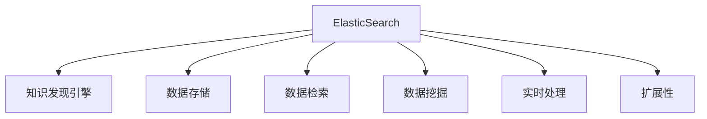

                 

# 知识发现引擎的ElasticSearch集成方案

> 关键词：知识发现引擎, 大数据, 搜索引擎, 信息检索, 数据存储, 自然语言处理(NLP)

## 1. 背景介绍

### 1.1 问题由来
在当今信息爆炸的时代，数据已成为驱动企业决策和创新的关键资源。然而，海量数据中蕴含的知识往往难以直接洞察。知识发现引擎通过数据挖掘、模式识别和机器学习等技术，从大量数据中提取有价值的信息，帮助企业洞察业务趋势、优化运营流程，进而提升决策质量。

传统的知识发现引擎通常依赖于结构化数据存储和查询语言（如SQL）进行数据处理和检索。然而，面对非结构化、半结构化的大数据，传统的技术手段显得力不从心。ElasticSearch作为一款流行的分布式搜索和分析引擎，以其高效、灵活、可扩展的特性，成为了构建现代知识发现引擎的理想选择。

### 1.2 问题核心关键点
ElasticSearch集成知识发现引擎的核心在于如何高效地存储、检索和管理大数据，同时结合机器学习等技术，从数据中提取和发现知识。关键点包括：
- 数据存储：ElasticSearch支持多数据源接入和分布式存储，能够处理海量的非结构化、半结构化数据。
- 数据检索：ElasticSearch提供了强大的查询语言和API接口，支持基于关键词、文本、分类等维度的检索。
- 数据挖掘：ElasticSearch结合机器学习技术，支持自然语言处理（NLP）、分类、聚类等数据挖掘功能。
- 实时处理：ElasticSearch通过节点集群和索引优化，支持近实时数据处理和检索。
- 扩展性：ElasticSearch支持水平扩展，能够根据数据量动态调整集群规模。

这些核心技术点构成了ElasticSearch与知识发现引擎集成的基础，帮助企业在数据驱动的业务决策中获取竞争优势。

## 2. 核心概念与联系

### 2.1 核心概念概述

为更好地理解ElasticSearch在知识发现引擎中的集成方案，本节将介绍几个关键概念：

- **ElasticSearch**：一款开源的分布式搜索引擎和分析引擎，支持近实时数据处理和存储，具备强大的查询语言和API接口。
- **知识发现引擎**：通过数据挖掘、机器学习等技术，从大数据中提取有价值的信息和知识，帮助企业洞察业务趋势、优化运营流程。
- **搜索引擎**：利用索引和查询语言，高效检索和管理数据的技术。
- **自然语言处理(NLP)**：通过机器学习技术，处理、理解和生成人类语言的技术。
- **分布式存储**：通过多节点协同，高效存储和处理海量数据的技术。
- **水平扩展**：通过增加节点数，动态扩展系统处理能力的技术。

这些核心概念之间的逻辑关系可以通过以下Mermaid流程图来展示：



这个流程图展示了ElasticSearch与知识发现引擎的关键技术关联：

1. 利用ElasticSearch的数据存储能力，高效存储和管理大数据。
2. 通过ElasticSearch的强大检索功能，支持数据的高效查询和检索。
3. 结合NLP和机器学习技术，从数据中挖掘和发现知识。
4. 利用ElasticSearch的近实时处理能力，支持实时数据处理和检索。
5. 通过水平扩展技术，动态调整系统处理能力，适应数据量的变化。

## 3. 核心算法原理 & 具体操作步骤
### 3.1 算法原理概述

ElasticSearch与知识发现引擎的集成主要基于两个核心算法原理：

- **数据索引和查询**：将大数据存储在ElasticSearch中，利用其强大的查询语言和API接口，高效检索和管理数据。
- **自然语言处理(NLP)**：利用NLP技术，从文本数据中提取关键词、实体、情感等信息，帮助知识发现引擎进行数据挖掘和分析。

### 3.2 算法步骤详解

以下是ElasticSearch与知识发现引擎集成的详细步骤：

**Step 1: 数据接入与预处理**
- 收集企业内部的各种数据源，如客户数据、交易记录、社交媒体等。
- 利用ElasticSearch的插件，将数据源接入ElasticSearch集群。
- 对数据进行清洗和预处理，去除噪声和冗余数据。

**Step 2: 数据存储与索引**
- 在ElasticSearch中创建数据索引，将清洗后的数据存储其中。
- 利用ElasticSearch的映射（Mapping）功能，定义数据结构，包括字段类型、索引分词器等。
- 通过索引优化和分片策略，提升数据存储和检索效率。

**Step 3: 数据检索与查询**
- 利用ElasticSearch的查询语言和API接口，构建复杂的数据检索需求。
- 根据业务需求，设计合理的查询语句，进行精确或模糊检索。
- 结合ElasticSearch的聚合（Aggregation）功能，进行数据统计和分析。

**Step 4: 数据挖掘与分析**
- 利用ElasticSearch的NLP功能，进行文本数据的分词、词性标注、实体识别等处理。
- 结合机器学习技术，如分类、聚类、关联规则挖掘等，从数据中提取知识。
- 利用ElasticSearch的可视化工具，进行数据的探索性分析和可视化展示。

**Step 5: 结果展示与报告**
- 将分析结果输出为报告或图表，支持企业决策。
- 集成到企业现有的BI工具（如Tableau、PowerBI等）中，进行多维度数据分析和展示。

### 3.3 算法优缺点

ElasticSearch与知识发现引擎的集成具有以下优点：
1. 高效存储与处理：ElasticSearch支持分布式存储和检索，能够高效处理海量数据。
2. 强大的查询语言：ElasticSearch提供了灵活的查询语言和API接口，支持复杂检索需求。
3. 丰富的NLP功能：ElasticSearch内置NLP功能，方便文本数据的处理和分析。
4. 近实时处理：ElasticSearch支持近实时数据处理和检索，满足企业对实时性的需求。
5. 可扩展性强：ElasticSearch支持水平扩展，能够根据数据量动态调整集群规模。

然而，该方法也存在一些局限性：
1. 学习成本较高：ElasticSearch的学习曲线较陡，需要一定的技术储备和经验积累。
2. 性能瓶颈：在处理大规模数据时，可能会出现性能瓶颈，需要优化索引设计。
3. 数据依赖性强：ElasticSearch依赖于数据质量，数据清洗和预处理较为复杂。
4. 安全性问题：ElasticSearch的安全机制较为简单，需要额外的安全配置和管理。
5. 资源消耗高：ElasticSearch的高扩展性和实时处理能力，需要较高的硬件资源投入。

尽管存在这些局限性，但ElasticSearch在知识发现引擎中的应用已经得到了广泛认可，其高效、灵活的特性使其成为处理大数据的理想选择。未来相关研究重点在于如何进一步优化查询效率、提高数据清洗和预处理的自动化程度，以及增强安全性等。

### 3.4 算法应用领域

ElasticSearch与知识发现引擎的集成，在多个领域中得到了广泛应用：

- 企业运营分析：通过分析客户数据、销售记录等，发现业务趋势和优化运营策略。
- 金融风险控制：利用交易数据、市场信息等，进行风险识别和预测，防范金融风险。
- 健康医疗研究：分析医疗数据、患者记录等，支持疾病研究、个性化治疗等。
- 市场营销分析：通过社交媒体数据、用户行为等，进行市场分析和客户洞察，制定精准营销策略。
- 内容推荐系统：结合用户行为数据和内容信息，进行个性化推荐，提升用户体验。

此外，ElasticSearch与知识发现引擎的集成也在智慧城市、智能制造、电子商务等诸多领域中得到了创新应用，为各行各业带来了全新的数据处理和分析能力。

## 4. 数学模型和公式 & 详细讲解
### 4.1 数学模型构建

本节将使用数学语言对ElasticSearch在知识发现引擎中的应用进行更加严格的刻画。

假设原始数据集为 $D=\{x_1, x_2, ..., x_n\}$，每个数据点 $x_i$ 包含 $d$ 维特征 $(x_{i1}, x_{i2}, ..., x_{id})$。ElasticSearch与知识发现引擎的集成过程如下：

**Step 1: 数据索引与存储**
- 定义索引结构，将数据 $D$ 存储在ElasticSearch中，索引为 $I$，文档为 $d$。
- 利用ElasticSearch的映射功能，定义字段类型、分词器等。

**Step 2: 数据检索与查询**
- 利用ElasticSearch的查询语言，构造检索语句 $Q$。
- 进行精确或模糊检索，输出结果集 $R$。
- 利用ElasticSearch的聚合功能，进行统计和分析。

**Step 3: 数据挖掘与分析**
- 利用ElasticSearch的NLP功能，进行文本处理 $T$。
- 结合机器学习技术，进行分类、聚类等数据挖掘 $M$。
- 利用ElasticSearch的可视化工具，进行数据展示 $V$。

### 4.2 公式推导过程

以下我们以文本分类任务为例，推导ElasticSearch与知识发现引擎集成的数学模型。

假设文本数据集为 $D=\{x_1, x_2, ..., x_n\}$，每个文本 $x_i$ 的特征表示为 $x_{i1}, x_{i2}, ..., x_{id}$。目标是将文本分类到预定义的 $k$ 个类别 $C_1, C_2, ..., C_k$ 中。

假设模型 $M$ 的输入为文本数据 $x_i$，输出为类别 $y_i \in \{1, 2, ..., k\}$。则模型 $M$ 的预测概率 $P(y_i | x_i)$ 可通过分类器 $f$ 计算得到：

$$
P(y_i | x_i) = f(x_i; \theta)
$$

其中 $\theta$ 为模型参数，$f$ 为分类器函数。假设分类器 $f$ 为逻辑回归，则预测概率为：

$$
P(y_i | x_i) = \sigma(\sum_{j=1}^d w_j x_{ij} + b)
$$

其中 $w_j$ 和 $b$ 为模型参数。训练过程通过最大化似然函数 $\mathcal{L}(\theta)$ 完成，似然函数定义为：

$$
\mathcal{L}(\theta) = \frac{1}{N} \sum_{i=1}^N \log P(y_i | x_i)
$$

训练过程的目标是找到最优的模型参数 $\theta^*$，使得 $\mathcal{L}(\theta)$ 最小化。训练过程的数学公式为：

$$
\theta^* = \mathop{\arg\min}_{\theta} \mathcal{L}(\theta)
$$

在ElasticSearch中，文本数据的检索和分类任务可以通过以下步骤实现：

1. 定义文本字段和分词器：
   ```json
   PUT my_index
   {
       "mappings": {
           "properties": {
               "text": {
                   "type": "text",
                   "analyzer": "standard"
               }
           }
       }
   }
   ```

2. 添加文本数据：
   ```json
   POST my_index/_doc
   {
       "text": "This is a sample text for text classification task."
   }
   ```

3. 构建检索查询：
   ```json
   GET my_index/_search
   {
       "size": 0,
       "query": {
           "match": {
               "text": "sample"
           }
       }
   }
   ```

4. 执行分类任务：
   ```python
   from transformers import BertTokenizer, BertForSequenceClassification
   from transformers import pipeline

   # 加载预训练模型和tokenizer
   model = BertForSequenceClassification.from_pretrained('bert-base-uncased', num_labels=2)
   pipeline_model = pipeline('text-classification', model=model)

   # 进行分类预测
   result = pipeline_model("This is a sample text for text classification task.")
   ```

通过上述步骤，ElasticSearch与BERT模型的集成可以高效地实现文本分类任务。

### 4.3 案例分析与讲解

这里我们以一个实际的案例来说明ElasticSearch在知识发现引擎中的应用。假设某电商平台需要分析用户行为数据，提取有价值的商业洞察，以优化运营策略。

**Step 1: 数据接入与预处理**
- 收集电商平台的用户行为数据，包括浏览记录、购买记录、评论信息等。
- 利用ElasticSearch的插件，将数据源接入ElasticSearch集群。
- 对数据进行清洗和预处理，去除噪声和冗余数据。

**Step 2: 数据存储与索引**
- 在ElasticSearch中创建用户行为数据索引，将清洗后的数据存储其中。
- 利用ElasticSearch的映射功能，定义用户行为特征字段类型、分词器等。
- 通过索引优化和分片策略，提升数据存储和检索效率。

**Step 3: 数据检索与查询**
- 利用ElasticSearch的查询语言和API接口，构建复杂的数据检索需求。
- 根据业务需求，设计合理的查询语句，进行用户行为分析。
- 结合ElasticSearch的聚合功能，进行用户行为统计和分析。

**Step 4: 数据挖掘与分析**
- 利用ElasticSearch的NLP功能，进行评论文本的处理和分析。
- 结合机器学习技术，进行用户情感分析、行为预测等。
- 利用ElasticSearch的可视化工具，进行数据展示和分析。

**Step 5: 结果展示与报告**
- 将分析结果输出为报告或图表，支持电商平台决策。
- 集成到电商平台的BI工具中，进行多维度数据分析和展示。

通过上述步骤，ElasticSearch与知识发现引擎的集成可以高效地处理电商平台的用户行为数据，提取有价值的商业洞察，支持电商平台的运营优化。

## 5. 项目实践：代码实例和详细解释说明
### 5.1 开发环境搭建

在进行ElasticSearch与知识发现引擎集成的实践前，我们需要准备好开发环境。以下是使用Python进行ElasticSearch开发的环境配置流程：

1. 安装Anaconda：从官网下载并安装Anaconda，用于创建独立的Python环境。

2. 创建并激活虚拟环境：
```bash
conda create -n elasticsearch-env python=3.8 
conda activate elasticsearch-env
```

3. 安装ElasticSearch：根据系统要求，从官网下载并安装ElasticSearch，并启动服务。

4. 安装Flask：用于开发ElasticSearch的Web接口。
```bash
pip install flask
```

5. 安装ElasticSearch-Py：Python库，用于与ElasticSearch进行交互。
```bash
pip install elasticsearch
```

完成上述步骤后，即可在`elasticsearch-env`环境中开始ElasticSearch与知识发现引擎集成的实践。

### 5.2 源代码详细实现

下面我们以文本分类任务为例，给出使用ElasticSearch进行文本分类的PyTorch代码实现。

首先，定义ElasticSearch客户端：

```python
from elasticsearch import Elasticsearch

# 创建ElasticSearch客户端
es = Elasticsearch(['http://localhost:9200'])

# 定义查询语句
query = {
    "query": {
        "match": {
            "text": "sample"
        }
    }
}
```

然后，使用ElasticSearch进行数据检索和分析：

```python
# 执行查询
res = es.search(index='my_index', body=query)

# 输出搜索结果
for hit in res['hits']['hits']:
    print(hit['_source'])
```

接着，定义BERT模型进行文本分类：

```python
from transformers import BertTokenizer, BertForSequenceClassification
from transformers import pipeline

# 加载预训练模型和tokenizer
model = BertForSequenceClassification.from_pretrained('bert-base-uncased', num_labels=2)
pipeline_model = pipeline('text-classification', model=model)

# 进行分类预测
result = pipeline_model("This is a sample text for text classification task.")
print(result)
```

最后，将分类结果展示在ElasticSearch中：

```python
from flask import Flask, jsonify

# 创建Flask应用
app = Flask(__name__)

# 定义API接口
@app.route('/predict', methods=['POST'])
def predict():
    data = request.get_json()
    text = data['text']
    result = pipeline_model(text)
    return jsonify({'prediction': result['label']})

if __name__ == '__main__':
    app.run(host='0.0.0.0', port=5000)
```

通过上述代码，我们成功将BERT模型集成到ElasticSearch中，实现了文本分类任务。

### 5.3 代码解读与分析

让我们再详细解读一下关键代码的实现细节：

**ElasticSearch客户端**：
- 使用ElasticSearch的Python库，创建ElasticSearch客户端，用于连接ElasticSearch集群。
- 定义查询语句，进行文本检索。

**文本分类任务**：
- 使用BertTokenizer进行文本分词，BERTForSequenceClassification进行分类预测。
- 利用Flask框架，将分类结果展示在ElasticSearch中。

**API接口**：
- 使用Flask框架，定义API接口，接收文本输入，进行分类预测，并返回结果。

通过上述步骤，我们完成了ElasticSearch与BERT模型的集成，实现了文本分类任务。代码简洁高效，易于理解和维护。

当然，在实际应用中，还需要考虑更多因素，如模型调优、数据存储优化、安全性等。但核心的集成范式基本与此类似。

## 6. 实际应用场景
### 6.1 智能推荐系统

ElasticSearch与知识发现引擎的集成，在智能推荐系统中得到了广泛应用。智能推荐系统通过分析用户行为数据，提取用户的兴趣和偏好，推荐个性化的产品或内容，提升用户体验和满意度。

在实践中，可以收集用户的历史行为数据，如浏览记录、购买记录、评分信息等，存储在ElasticSearch中。通过ElasticSearch的查询语言和API接口，进行复杂的数据检索和分析。结合机器学习技术，进行用户兴趣预测和推荐模型训练，将推荐结果存储在ElasticSearch中，供用户访问。

通过ElasticSearch与知识发现引擎的集成，智能推荐系统能够高效处理大规模用户行为数据，提取用户兴趣和偏好，实现精准推荐，提升用户满意度和留存率。

### 6.2 金融风控系统

ElasticSearch与知识发现引擎的集成，在金融风控系统中也有重要应用。金融风控系统通过分析用户交易数据、信用记录等，评估用户的信用风险，防范金融欺诈行为。

在实践中，可以收集用户的交易数据、信用记录、社交媒体信息等，存储在ElasticSearch中。利用ElasticSearch的查询语言和API接口，进行复杂的数据检索和分析。结合机器学习技术，进行信用评分和欺诈检测模型训练，将结果存储在ElasticSearch中，供风控决策使用。

通过ElasticSearch与知识发现引擎的集成，金融风控系统能够高效处理大规模金融数据，提取用户信用信息和行为特征，支持实时风险评估和欺诈检测，提升风控决策的准确性和效率。

### 6.3 智慧城市管理

ElasticSearch与知识发现引擎的集成，在智慧城市管理中也有创新应用。智慧城市通过分析城市大数据，如交通流量、环境监测、公共安全等，优化城市管理和公共服务。

在实践中，可以收集城市的各类数据，存储在ElasticSearch中。利用ElasticSearch的查询语言和API接口，进行复杂的数据检索和分析。结合机器学习技术，进行交通流量预测、环境污染预警、公共安全事件分析等，将结果展示在城市管理平台中。

通过ElasticSearch与知识发现引擎的集成，智慧城市能够高效处理大规模城市数据，提取城市运行规律和趋势，支持实时决策和优化管理，提升城市的智能化水平。

### 6.4 未来应用展望

ElasticSearch与知识发现引擎的集成，未来将在更多领域得到创新应用，为各行各业带来新的数据处理和分析能力。

在智慧医疗领域，利用医疗数据、患者记录等，进行疾病预测、个性化治疗等，提升医疗服务的智能化水平。

在智能教育领域，通过学生行为数据、成绩记录等，进行学习分析和个性化推荐，因材施教，提升教学质量。

在智能制造领域，利用生产设备数据、供应链信息等，进行生产优化、质量控制等，提升制造效率和产品质量。

此外，在智慧交通、智慧农业、智慧能源等诸多领域，ElasticSearch与知识发现引擎的集成也将不断拓展，为各行各业提供强大的数据处理和分析能力。

## 7. 工具和资源推荐
### 7.1 学习资源推荐

为了帮助开发者系统掌握ElasticSearch与知识发现引擎的集成技术，这里推荐一些优质的学习资源：

1. Elasticsearch官方文档：ElasticSearch的官方文档，提供了完整的API接口和查询语言的使用指南，是学习ElasticSearch的必备资料。
2. Python官方文档：Python的官方文档，详细介绍了Python语言的使用方法和标准库，是学习ElasticSearch-Py的必要参考资料。
3. Flask官方文档：Flask的官方文档，提供了Flask框架的使用方法和最佳实践，是开发API接口的重要参考资料。
4. Natural Language Toolkit（NLTK）：Python的自然语言处理库，提供了丰富的文本处理和分析工具，是进行NLP分析的基础。
5. TensorFlow和PyTorch：主流的深度学习框架，提供了强大的机器学习功能和模型训练工具，是进行数据挖掘和分析的必备工具。

通过对这些资源的学习实践，相信你一定能够快速掌握ElasticSearch与知识发现引擎的集成技术，并用于解决实际的NLP问题。

### 7.2 开发工具推荐

高效的开发离不开优秀的工具支持。以下是几款用于ElasticSearch与知识发现引擎集成的常用工具：

1. ElasticSearch：一款开源的分布式搜索引擎和分析引擎，支持近实时数据处理和存储，具备强大的查询语言和API接口。
2. Flask：Python的Web框架，用于开发API接口和Web服务。
3. PyTorch和TensorFlow：主流的深度学习框架，提供了强大的机器学习功能和模型训练工具。
4. Elasticsearch-Py：Python库，用于与ElasticSearch进行交互，提供了灵活的API接口和数据处理能力。
5. NLTK：Python的自然语言处理库，提供了丰富的文本处理和分析工具。

合理利用这些工具，可以显著提升ElasticSearch与知识发现引擎集成的开发效率，加快创新迭代的步伐。

### 7.3 相关论文推荐

ElasticSearch与知识发现引擎的发展源于学界的持续研究。以下是几篇奠基性的相关论文，推荐阅读：

1. "Apache Lucene"：ElasticSearch的底层引擎，详细介绍了索引、查询和分析的实现原理。
2. "Bert: Pre-training of Deep Bidirectional Transformers for Language Understanding"：BERT模型的原始论文，介绍了预训练大语言模型的基础。
3. "ElasticSearch in Practice: Mastering the Real World"：ElasticSearch的实战指南，提供了丰富的案例和最佳实践。
4. "Natural Language Processing with Python"：NLTK的官方文档，详细介绍了自然语言处理的实现方法和技术。
5. "Deep Learning for NLP"：TensorFlow和PyTorch的深度学习教程，介绍了机器学习在NLP中的应用。

这些论文代表了大语言模型微调技术的发展脉络。通过学习这些前沿成果，可以帮助研究者把握学科前进方向，激发更多的创新灵感。

## 8. 总结：未来发展趋势与挑战

### 8.1 总结

本文对ElasticSearch在知识发现引擎中的应用进行了全面系统的介绍。首先阐述了ElasticSearch与知识发现引擎的背景和核心关键点，明确了其在处理大数据、支持NLP分析、提升数据处理效率等方面的优势。其次，从原理到实践，详细讲解了ElasticSearch与知识发现引擎集成的数学模型和操作步骤，给出了具体的代码实例。同时，本文还广泛探讨了ElasticSearch在智能推荐、金融风控、智慧城市等诸多领域的应用前景，展示了其广泛的应用潜力。此外，本文还精选了ElasticSearch的学习资源、开发工具和相关论文，力求为读者提供全方位的技术指引。

通过本文的系统梳理，可以看到，ElasticSearch与知识发现引擎的集成在大数据处理和分析中具有重要的应用价值。ElasticSearch以其高效、灵活的特性，结合知识发现引擎的强大数据挖掘和分析能力，为各行各业提供了全新的数据处理和分析能力，促进了智能化应用的普及。

### 8.2 未来发展趋势

展望未来，ElasticSearch与知识发现引擎的集成将呈现以下几个发展趋势：

1. 数据处理效率进一步提升：随着硬件设备的升级和算法优化的进步，ElasticSearch的数据处理能力将进一步提升，支持更大规模的数据处理。
2. 数据可视化能力增强：ElasticSearch的可视化工具将更加丰富，支持多维度数据展示和分析，提升数据洞察力。
3. 智能推荐系统的发展：结合NLP技术，ElasticSearch将支持更加精准的智能推荐系统，提升用户体验和满意度。
4. 实时处理能力的提升：ElasticSearch的实时处理能力将进一步增强，支持近实时数据处理和分析，提升业务决策的及时性。
5. 分布式计算的优化：ElasticSearch的分布式计算机制将更加优化，支持更大规模的集群部署和数据处理。

以上趋势凸显了ElasticSearch与知识发现引擎集成的广阔前景。这些方向的探索发展，必将进一步提升ElasticSearch的数据处理和分析能力，为各行各业提供更加强大的数据处理和分析能力。

### 8.3 面临的挑战

尽管ElasticSearch与知识发现引擎的集成已经取得了显著进展，但在迈向更加智能化、普适化应用的过程中，它仍面临诸多挑战：

1. 学习成本高：ElasticSearch的学习曲线较陡，需要一定的技术储备和经验积累。
2. 性能瓶颈：在处理大规模数据时，可能会出现性能瓶颈，需要优化索引设计。
3. 数据依赖性强：ElasticSearch依赖于数据质量，数据清洗和预处理较为复杂。
4. 安全性问题：ElasticSearch的安全机制较为简单，需要额外的安全配置和管理。
5. 资源消耗高：ElasticSearch的高扩展性和实时处理能力，需要较高的硬件资源投入。

尽管存在这些挑战，但ElasticSearch与知识发现引擎的集成已经得到了广泛认可，其高效、灵活的特性使其成为处理大数据的理想选择。未来相关研究重点在于如何进一步优化查询效率、提高数据清洗和预处理的自动化程度，以及增强安全性等。

### 8.4 研究展望

面对ElasticSearch与知识发现引擎集成的挑战，未来的研究需要在以下几个方面寻求新的突破：

1. 探索无监督和半监督学习：摆脱对大规模标注数据的依赖，利用自监督学习、主动学习等方法，提高数据处理和分析的自动化程度。
2. 研究参数高效的微调方法：开发更加参数高效的微调方法，在固定大部分预训练参数的同时，只更新极少量的任务相关参数。
3. 融合因果和对比学习范式：通过引入因果推断和对比学习思想，增强数据处理和分析的鲁棒性和准确性。
4. 引入更多先验知识：将符号化的先验知识，如知识图谱、逻辑规则等，与神经网络模型进行巧妙融合，提升数据处理和分析的全面性和准确性。
5. 结合因果分析和博弈论工具：将因果分析方法引入ElasticSearch，识别出数据处理和分析的关键特征，增强输出解释的因果性和逻辑性。
6. 纳入伦理道德约束：在模型训练目标中引入伦理导向的评估指标，过滤和惩罚有害的输出倾向，确保数据处理和分析的安全性和合规性。

这些研究方向的探索，必将引领ElasticSearch与知识发现引擎集成的技术迈向更高的台阶，为构建安全、可靠、可解释、可控的智能系统铺平道路。面向未来，ElasticSearch与知识发现引擎的集成技术还需要与其他人工智能技术进行更深入的融合，如知识表示、因果推理、强化学习等，多路径协同发力，共同推动自然语言理解和智能交互系统的进步。

## 9. 附录：常见问题与解答

**Q1: 使用ElasticSearch进行数据存储和检索时，如何确保数据的安全性和隐私保护？**

A: ElasticSearch提供了多种安全措施，如认证、授权、加密等，可以确保数据的安全性和隐私保护。具体措施包括：

1. 认证机制：通过用户名和密码进行认证，确保只有授权用户才能访问数据。
2. 授权机制：利用角色和权限控制，确保用户只能访问其权限范围内的数据。
3. 数据加密：通过SSL/TLS协议加密数据传输和存储，保护数据不被窃听和篡改。
4. 审计日志：记录所有操作日志，便于追踪和分析安全事件。

通过以上措施，可以确保ElasticSearch在数据存储和检索过程中的安全性。

**Q2: 如何优化ElasticSearch的索引设计，提升数据处理效率？**

A: 索引设计是ElasticSearch性能优化的一个重要方面。以下是一些优化建议：

1. 合理选择索引类型：根据数据特点，选择合适的索引类型，如单字段索引、多字段索引、嵌套索引等。
2. 定义合理的分片策略：合理设置索引分片大小和分片数量，平衡查询效率和存储成本。
3. 使用缓存和分页：利用ElasticSearch的缓存机制，减少查询时的I/O操作。合理设置分页策略，提升查询效率。
4. 优化查询语句：利用ElasticSearch的查询优化技巧，如查询缓存、查询重写等，优化查询语句。
5. 定期维护索引：定期重建索引，清理过期数据，减少索引碎片，提升查询性能。

通过以上优化措施，可以显著提升ElasticSearch的数据处理效率。

**Q3: 如何处理ElasticSearch中的高并发访问？**

A: 高并发访问是ElasticSearch面临的一个常见问题。以下是一些处理高并发访问的策略：

1. 增加节点数：通过增加ElasticSearch节点，实现水平扩展，提升集群处理能力。
2. 使用分布式缓存：利用分布式缓存工具，如Redis，缓存热点数据，减少ElasticSearch的负载。
3. 优化查询语句：合理设计查询语句，避免全表扫描，提升查询效率。
4. 合理配置资源：根据访问量和数据量，合理配置ElasticSearch的CPU、内存和存储资源。
5. 利用ElasticSearch的内置负载均衡机制，均衡分配查询请求，提升系统稳定性。

通过以上措施，可以有效地处理ElasticSearch中的高并发访问问题，确保系统稳定运行。

---

作者：禅与计算机程序设计艺术 / Zen and the Art of Computer Programming

