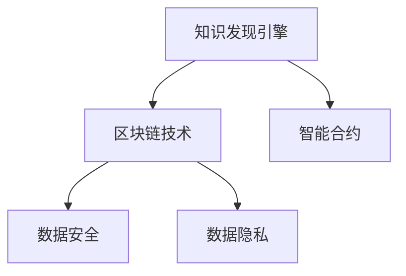

                 

# 知识发现引擎的区块链技术应用

> 关键词：知识发现引擎, 区块链技术, 数据安全, 透明性, 智能合约

## 1. 背景介绍

随着大数据、人工智能等技术的迅猛发展，各行各业对数据驱动决策的需求日益增长。如何从海量数据中挖掘出有价值的知识，成为了推动企业智能化转型的关键。在这样的背景下，知识发现引擎(Knowledge Discovery Engine, KDE)应运而生，成为数据驱动决策的重要工具。

知识发现引擎是一种利用先进的数据挖掘和分析技术，从原始数据中自动发现规律、模式、异常和知识的软件系统。其核心目标是从大规模数据集中抽取有价值的信息，支持企业的决策支持和业务优化。然而，在数据获取、存储、传输和处理的过程中，数据安全和隐私保护成为了知识发现引擎面临的重要挑战。

区块链技术的出现为知识发现引擎提供了全新的解决方案。区块链去中心化、不可篡改、透明等特性，为数据的安全存储和智能合约的自动化执行提供了保障，能够有效解决传统知识发现引擎面临的数据安全和隐私问题。因此，将区块链技术应用到知识发现引擎中，已经成为当前研究的热点之一。

## 2. 核心概念与联系

### 2.1 核心概念概述

为了深入理解区块链技术在知识发现引擎中的应用，本节将介绍几个密切相关的核心概念：

- 知识发现引擎(Knowledge Discovery Engine, KDE)：利用数据挖掘、机器学习等技术，从数据中提取有价值知识的软件系统。其核心组件包括数据预处理、模型选择、模型训练、结果验证等。

- 区块链技术(Blockchain Technology)：一种去中心化、公开透明、不可篡改的分布式账本技术。基于密码学原理，实现数据的安全存储和智能合约的自动化执行。

- 智能合约(Smart Contract)：一种基于区块链技术的自动化合约，通过代码实现合约条款和逻辑，无需第三方干预即可自动执行。

- 数据安全(Data Security)：保护数据在存储、传输和处理过程中不被非法访问、篡改和泄露。

- 数据隐私(Data Privacy)：保护个人或组织的敏感信息不被未授权的访问和使用，确保数据处理过程中隐私保护。

这些核心概念之间的逻辑关系可以通过以下Mermaid流程图来展示：



这个流程图展示了知识发现引擎与区块链技术、智能合约、数据安全、数据隐私等概念之间的联系。

## 3. 核心算法原理 & 具体操作步骤

### 3.1 算法原理概述

基于区块链技术的知识发现引擎，利用区块链的分布式存储和智能合约的自动执行特性，实现了数据的透明性和智能合约的自动化，提升了知识发现过程的安全性和效率。其核心算法原理可以总结如下：

1. 数据分布式存储：将数据分为多个数据块，分别存储在区块链的各个节点上，实现数据的分布式存储和冗余备份，提高了数据的安全性和可靠性。

2. 智能合约自动执行：通过编写智能合约代码，实现知识发现的自动化流程，如数据预处理、模型训练、结果验证等，确保知识发现过程的透明度和可追溯性。

3. 数据隐私保护：利用区块链的去中心化和加密技术，保护数据隐私，防止数据泄露和滥用。

4. 透明性保障：区块链的公开透明特性，使得知识发现过程的每个步骤都可以在区块链上记录和审计，确保了知识发现过程的透明性和可信性。

### 3.2 算法步骤详解

基于区块链技术的知识发现引擎通常包括以下几个关键步骤：

1. 数据预处理：对原始数据进行清洗、归一化、特征工程等预处理操作，准备知识发现算法所需的数据。

2. 数据上链：将预处理后的数据分块，通过加密和哈希函数处理后，存储到区块链上。

3. 模型选择：根据数据特点和业务需求，选择合适的知识发现算法，如决策树、神经网络、关联规则等。

4. 智能合约编写：编写智能合约代码，定义知识发现的流程和逻辑，包括数据预处理、模型训练、结果验证等。

5. 智能合约部署：将智能合约部署到区块链上，并设置自动触发条件，确保智能合约在满足条件时自动执行。

6. 知识发现：根据智能合约的执行结果，从区块链上获取知识发现结果，进行分析和使用。

7. 结果验证：对知识发现结果进行验证和评估，确保其准确性和可靠性。

### 3.3 算法优缺点

基于区块链技术的知识发现引擎具有以下优点：

1. 数据安全：利用区块链的分布式存储和加密技术，确保数据在存储、传输和处理过程中的安全性。

2. 透明性：区块链的公开透明特性，使得知识发现过程的每个步骤都可以在区块链上记录和审计，确保了知识发现过程的透明性和可信性。

3. 智能合约自动化：通过编写智能合约代码，实现知识发现的自动化流程，提升了知识发现过程的效率和精度。

4. 去中心化：区块链的去中心化特性，避免了单点故障和数据篡改，提高了知识发现过程的可靠性和稳定性。

然而，该方法也存在一些局限性：

1. 高计算成本：区块链共识机制和高加密算法的运行需要消耗大量的计算资源，增加了知识发现的计算成本。

2. 复杂性：智能合约的编写和部署过程相对复杂，需要一定的区块链和编程知识。

3. 数据冗余：虽然区块链的分布式存储提高了数据的冗余备份，但也增加了数据的存储和传输成本。

4. 隐私泄露风险：虽然区块链技术提供了数据隐私保护，但如果智能合约代码编写不当，仍可能存在隐私泄露的风险。

尽管存在这些局限性，但区块链技术的应用为知识发现引擎带来了新的思路和手段，能够在数据安全和隐私保护方面提供更强大的保障。未来，随着区块链技术的不断发展和成熟，基于区块链的知识发现引擎将有更广泛的应用前景。

### 3.4 算法应用领域

基于区块链技术的知识发现引擎已经在金融、医疗、供应链等多个领域得到了应用，为这些行业带来了显著的效益：

- 金融领域：利用区块链技术进行反洗钱、交易监管、信用评估等操作，提升了金融系统的安全性和透明度。

- 医疗领域：通过区块链技术进行医疗数据的存储和共享，实现了医疗信息的透明性和隐私保护，提升了医疗服务的质量和效率。

- 供应链管理：利用区块链技术进行供应链的透明化管理和溯源操作，确保了供应链的可靠性和可追溯性。

此外，基于区块链技术的知识发现引擎还在智能合约、物联网、数据共享等多个领域得到了广泛应用，推动了相关行业的数字化转型。

## 4. 数学模型和公式 & 详细讲解 & 举例说明

### 4.1 数学模型构建

为了更好地理解基于区块链技术的知识发现引擎，本节将介绍几个关键的数学模型：

- 数据加密模型：利用公钥和私钥对数据进行加密和解密，确保数据在存储和传输过程中的安全性。

- 数据哈希模型：利用哈希函数对数据进行加密，确保数据的完整性和一致性。

- 智能合约执行模型：利用智能合约代码实现知识发现的自动化流程，确保知识发现过程的透明度和可追溯性。

- 知识发现算法模型：如决策树、神经网络、关联规则等，用于从数据中提取有价值的知识。

### 4.2 公式推导过程

以下是一些关键数学模型的公式推导过程：

1. 数据加密模型：

- 公钥加密算法：$C = E(K_e, M)$
- 私钥解密算法：$M = D(K_d, C)$

其中，$K_e$为公钥，$K_d$为私钥，$M$为原始数据，$C$为加密后的数据。

2. 数据哈希模型：

- 哈希函数：$H(M) = h_0 || h_1 || \cdots || h_n$
- 数据完整性验证：$H(M_{\text{解密}}) = H(M_{\text{加密}})$

其中，$M_{\text{加密}}$和$M_{\text{解密}}$分别为加密和解密后的数据，$H(M)$为数据的哈希值。

3. 智能合约执行模型：

- 智能合约代码：`if (condition) { execute.action(); }`
- 自动执行流程：`if (condition) { execute.action(); }` -> 执行`action()`

其中，`condition`为智能合约的触发条件，`action()`为智能合约的执行操作。

### 4.3 案例分析与讲解

以智能合约在金融领域的应用为例，详细解释基于区块链技术的知识发现引擎的工作原理：

1. 数据预处理：收集金融市场交易数据，并进行清洗、归一化和特征工程等预处理操作。

2. 数据上链：将预处理后的数据分块，通过公钥加密和哈希函数处理后，存储到区块链上。

3. 模型选择：根据数据特点，选择回归模型进行信用评估。

4. 智能合约编写：编写智能合约代码，定义信用评估的流程和逻辑，包括数据预处理、模型训练、结果验证等。

5. 智能合约部署：将智能合约部署到区块链上，并设置自动触发条件，确保智能合约在满足条件时自动执行。

6. 知识发现：根据智能合约的执行结果，从区块链上获取信用评估结果，进行分析和使用。

7. 结果验证：对信用评估结果进行验证和评估，确保其准确性和可靠性。

## 5. 项目实践：代码实例和详细解释说明

### 5.1 开发环境搭建

在进行区块链技术应用的知识发现引擎开发前，需要先准备好开发环境。以下是使用Python和Ethereum智能合约进行开发的环境配置流程：

1. 安装Python：从官网下载并安装Python，用于智能合约的开发和测试。

2. 安装Truffle：Truffle是一款基于Solidity语言开发智能合约的IDE，从官网下载并安装。

3. 安装Ganache：Ganache是一款本地区块链网络模拟器，用于开发和测试智能合约。

4. 安装Web3.py：Web3.py是一款Python SDK，用于连接和操作区块链网络，从官网下载并安装。

完成上述步骤后，即可在本地环境搭建好区块链开发所需工具。

### 5.2 源代码详细实现

以下是一个简单的智能合约代码示例，用于实现基本的信用评估功能：

```python
from web3 import Web3

# 连接Ganache测试网络
ganache_url = "http://127.0.0.1:8545"
web3 = Web3(Web3.HTTPProvider(ganache_url))

# 定义智能合约接口
class CreditScoreContract(Web3.EthContract):
    def __init__(self):
        super().__init__()

    def calculateScore(self, creditHistory):
        # 对信用历史进行预处理和分析
        # ...

        # 计算信用得分
        score = self.calculateScore(creditHistory)
        self.setScore(score)

    def setScore(self, score):
        self.setScore(score)

# 创建智能合约实例
contract = CreditScoreContract(deployed=False)

# 设置智能合约代码
bytecode = "..."

# 部署智能合约
contract.deploy(bytecode)

# 调用智能合约函数
contract.calculateScore(creditHistory)
```

以上代码实现了一个基本的智能合约，用于计算用户的信用得分。通过调用智能合约的函数，可以实现信用评估的自动化和透明化。

### 5.3 代码解读与分析

让我们再详细解读一下关键代码的实现细节：

- `web3.EthContract`：定义智能合约的接口，用于编写和调用智能合约函数。

- `deploy(bytecode)`：部署智能合约，将智能合约代码部署到区块链上。

- `calculateScore(creditHistory)`：计算用户的信用得分，传入用户的历史信用记录作为参数。

- `setScore(score)`：设置用户的信用得分，传入计算得到的信用得分作为参数。

通过上述代码实现，可以初步了解基于区块链技术的知识发现引擎的工作原理，即利用智能合约实现知识发现的自动化和透明化。

## 6. 实际应用场景

### 6.1 金融信用评估

基于区块链技术的知识发现引擎，可以应用于金融领域的信用评估和风险控制。传统信用评估依赖人工审核和数据筛选，耗时耗力且效率低下。而通过智能合约和区块链技术，可以实现信用评估的自动化和透明化，提升了评估的效率和精度。

具体而言，可以收集用户的信用历史数据，通过智能合约自动计算信用得分，并在区块链上记录和审计。用户可以根据智能合约的结果申请贷款或信用卡，金融机构可以根据智能合约的结果进行决策和风控，确保了信用评估的公平性和可信性。

### 6.2 医疗病历共享

基于区块链技术的知识发现引擎，可以应用于医疗领域的病历共享和分析。医疗数据涉及隐私和安全，传统方式难以实现数据共享和分析。而通过区块链技术，可以实现医疗数据的透明性和隐私保护，提升了医疗数据的共享和分析效率。

具体而言，可以将患者的病历数据加密和哈希处理后，存储到区块链上。医生和其他医疗人员可以通过智能合约获得授权，查询和分析患者的病历数据，提升了医疗服务的质量和效率。

### 6.3 供应链溯源

基于区块链技术的知识发现引擎，可以应用于供应链的透明化和溯源。传统供应链管理依赖人工记录和数据输入，容易出现数据丢失和篡改。而通过区块链技术，可以实现供应链的透明化和可追溯性，提升了供应链的可靠性和透明度。

具体而言，可以将供应链的每一个环节的信息记录在区块链上，通过智能合约自动触发验证和审计。供应链各方可以根据智能合约的结果进行溯源和验证，确保了供应链的可靠性和安全性。

### 6.4 未来应用展望

随着区块链技术的不断发展和成熟，基于区块链的知识发现引擎将在更多领域得到应用，为各行各业带来变革性影响：

- 物联网：通过区块链技术实现设备的透明化和溯源，提升了物联网系统的安全和可靠性。

- 数据共享：利用区块链技术实现数据的去中心化共享，提升了数据共享的效率和可信性。

- 智能合约：通过编写智能合约代码，实现更多的自动化流程，提升了企业的运营效率和决策质量。

- 数字身份：通过区块链技术实现数字身份的透明化和隐私保护，提升了数字身份的安全性和可靠性。

未来，伴随区块链技术的进一步发展和应用，基于区块链的知识发现引擎将有更广泛的应用前景，推动各行业的数字化转型和智能化升级。

## 7. 工具和资源推荐

### 7.1 学习资源推荐

为了帮助开发者系统掌握区块链技术在知识发现引擎中的应用，这里推荐一些优质的学习资源：

1. 《区块链技术与智能合约编程》系列博文：由区块链技术专家撰写，深入浅出地介绍了区块链技术、智能合约的原理和编程方法。

2. 《Blockchain Basics》课程：Coursera提供的区块链入门课程，涵盖了区块链的基本概念、工作原理和应用场景。

3. 《Ethereum Smart Contracts》书籍：以太坊官方文档，全面介绍了以太坊智能合约的编写和部署方法，是智能合约开发的重要参考资料。

4. 《Smart Contracts: A Hands-On Guide with Solidity》书籍：介绍Solidity语言和智能合约的开发实践，适合初学者入门。

5. 《Blockchain Revolution: How the Technology Behind Bitcoin Is Changing Money, Business, and the World》书籍：全面介绍了区块链技术对社会和经济的影响，帮助读者理解区块链技术的潜力和应用前景。

通过对这些资源的学习实践，相信你一定能够快速掌握区块链技术在知识发现引擎中的应用，并用于解决实际的区块链问题。

### 7.2 开发工具推荐

高效的开发离不开优秀的工具支持。以下是几款用于区块链技术应用的知识发现引擎开发的常用工具：

1. Truffle：一款基于Solidity语言开发智能合约的IDE，提供了丰富的开发工具和环境支持。

2. Ganache：一款本地区块链网络模拟器，用于开发和测试智能合约。

3. Web3.py：一款Python SDK，用于连接和操作区块链网络，提供了丰富的API接口。

4. MetaMask：一款浏览器插件，支持以太坊智能合约的交互和交易操作。

5. Remix：一款智能合约编辑器，提供了丰富的开发和调试工具，适合快速开发智能合约。

合理利用这些工具，可以显著提升区块链技术应用的知识发现引擎开发效率，加快创新迭代的步伐。

### 7.3 相关论文推荐

区块链技术在知识发现引擎中的应用已经成为当前研究的热点之一。以下是几篇奠基性的相关论文，推荐阅读：

1. "Blockchain Technology: A Review and Future Prospects"：对区块链技术的现状和未来发展进行了全面的综述。

2. "Smart Contracts: A Brief Survey"：对智能合约技术的发展和应用进行了介绍，提供了智能合约开发的实用建议。

3. "A Survey on Blockchain for Data Sharing and Privacy Protection"：对区块链在数据共享和隐私保护方面的应用进行了研究综述。

4. "Blockchain-Based Knowledge Discovery: An Overview"：对区块链在知识发现中的应用进行了研究综述，提供了知识发现系统的架构和设计方法。

5. "A Survey on Blockchain for Business Applications"：对区块链在企业应用中的现状和未来发展进行了综述，提供了区块链应用的最佳实践。

这些论文代表了大规模区块链应用研究的发展脉络。通过学习这些前沿成果，可以帮助研究者把握学科前进方向，激发更多的创新灵感。

## 8. 总结：未来发展趋势与挑战

### 8.1 总结

本文对基于区块链技术的知识发现引擎进行了全面系统的介绍。首先阐述了区块链技术在知识发现引擎中的应用背景和意义，明确了区块链技术在提升数据安全和隐私保护方面的独特价值。其次，从原理到实践，详细讲解了区块链技术在知识发现过程中的核心算法和操作步骤，给出了区块链技术应用的知识发现引擎的完整代码实现。同时，本文还广泛探讨了区块链技术在金融、医疗、供应链等多个行业领域的应用前景，展示了区块链技术在提升数据安全和隐私保护方面的巨大潜力。最后，本文精选了区块链技术的各类学习资源，力求为读者提供全方位的技术指引。

通过本文的系统梳理，可以看到，基于区块链技术的知识发现引擎为数据驱动决策提供了新的解决方案，能够在数据安全和隐私保护方面提供更强大的保障。伴随区块链技术的不断发展和应用，基于区块链的知识发现引擎必将在各行业得到更广泛的应用，推动各行业的数字化转型和智能化升级。

### 8.2 未来发展趋势

展望未来，基于区块链技术的知识发现引擎将呈现以下几个发展趋势：

1. 去中心化程度提升：随着区块链技术的发展，去中心化程度将进一步提升，提升系统的安全和可靠性。

2. 智能合约自动化程度提高：未来智能合约将更加自动化和高效，减少人工干预，提升知识发现过程的效率和精度。

3. 数据隐私保护技术发展：未来的区块链系统将更加注重数据隐私保护，通过零知识证明、同态加密等技术，提升数据隐私保护的力度。

4. 跨链互操作性增强：未来的区块链系统将更加注重跨链互操作性，实现不同区块链之间的数据共享和协同工作。

5. 智能合约可扩展性增强：未来的智能合约将更加可扩展，支持更多的复杂操作和高级功能，提升系统的灵活性和实用性。

6. 知识发现算法创新：未来的知识发现算法将更加高效和智能化，利用机器学习、深度学习等技术，提升知识发现的准确性和泛化能力。

以上趋势凸显了基于区块链技术的知识发现引擎的发展潜力和广阔前景。这些方向的探索发展，必将进一步提升知识发现过程的安全性和效率，推动各行业的数字化转型和智能化升级。

### 8.3 面临的挑战

尽管基于区块链技术的知识发现引擎已经取得了瞩目成就，但在迈向更加智能化、普适化应用的过程中，它仍面临着诸多挑战：

1. 高计算成本：区块链共识机制和高加密算法的运行需要消耗大量的计算资源，增加了知识发现的计算成本。

2. 智能合约复杂性：智能合约的编写和部署过程相对复杂，需要一定的区块链和编程知识。

3. 数据冗余问题：虽然区块链的分布式存储提高了数据的冗余备份，但也增加了数据的存储和传输成本。

4. 隐私泄露风险：虽然区块链技术提供了数据隐私保护，但如果智能合约代码编写不当，仍可能存在隐私泄露的风险。

5. 跨链互操作性：不同区块链之间的互操作性尚未完全解决，数据共享和协同工作仍存在困难。

6. 智能合约安全性：智能合约的安全性问题仍需进一步研究和解决，防止智能合约被攻击和篡改。

尽管存在这些挑战，但区块链技术的应用为知识发现引擎带来了新的思路和手段，能够在数据安全和隐私保护方面提供更强大的保障。未来，随着区块链技术的不断发展和成熟，基于区块链的知识发现引擎将有更广泛的应用前景。

### 8.4 研究展望

面对区块链技术在知识发现引擎中面临的挑战，未来的研究需要在以下几个方面寻求新的突破：

1. 探索无中心化的知识发现机制：通过分布式计算和共识机制，实现知识发现的自动化和透明化，提升系统的安全性和效率。

2. 研究智能合约的安全性和可靠性：开发更加安全可靠的智能合约，防止智能合约被攻击和篡改，提升系统的可信性。

3. 引入数据隐私保护技术：通过零知识证明、同态加密等技术，提升数据隐私保护的力度，防止数据泄露和滥用。

4. 引入知识发现算法的创新：利用机器学习、深度学习等技术，提升知识发现的准确性和泛化能力，增强系统的智能性和灵活性。

5. 研究跨链互操作性：通过区块链联盟和技术标准，实现不同区块链之间的数据共享和协同工作，提升系统的互操作性。

6. 引入分布式账本技术：通过分布式账本技术，实现数据的去中心化存储和处理，提升系统的安全和可靠性。

这些研究方向的探索，必将引领区块链技术在知识发现引擎中的应用迈向更高的台阶，为构建安全、可靠、智能的知识发现系统铺平道路。面向未来，区块链技术的应用将更加广泛和深入，推动各行业的数字化转型和智能化升级。

## 9. 附录：常见问题与解答

**Q1：区块链技术在知识发现引擎中有什么应用优势？**

A: 区块链技术在知识发现引擎中的应用优势主要体现在以下几个方面：

1. 数据安全和隐私保护：利用区块链的去中心化和加密技术，确保数据在存储、传输和处理过程中的安全性。

2. 透明性保障：区块链的公开透明特性，使得知识发现过程的每个步骤都可以在区块链上记录和审计，确保了知识发现过程的透明性和可信性。

3. 智能合约自动化：通过编写智能合约代码，实现知识发现的自动化流程，提升了知识发现过程的效率和精度。

4. 去中心化：区块链的去中心化特性，避免了单点故障和数据篡改，提高了知识发现过程的可靠性和稳定性。

5. 可追溯性：区块链的不可篡改特性，使得知识发现过程的每个步骤都可以在区块链上记录和审计，确保了知识发现过程的可追溯性。

6. 自动化：智能合约的自动执行特性，减少了人工干预，提升了知识发现过程的效率和精度。

综上所述，区块链技术在知识发现引擎中的应用优势主要在于数据安全和隐私保护、透明性保障、智能合约自动化、去中心化、可追溯性和自动化等方面。

**Q2：如何选择合适的智能合约语言？**

A: 选择合适的智能合约语言需要考虑以下几个因素：

1. 开发难度：智能合约语言的学习曲线和开发难度，需要考虑开发者的技术水平和经验。

2. 社区支持：智能合约语言社区的支持程度，需要考虑社区的活跃度和资源共享。

3. 平台兼容性：智能合约语言与区块链平台的兼容性，需要考虑不同区块链平台的特性和功能。

4. 扩展性：智能合约语言的可扩展性，需要考虑未来的技术发展趋势和应用需求。

5. 安全性：智能合约语言的安全性，需要考虑智能合约的安全性和可靠性。

目前，以太坊平台主要使用Solidity语言，Hyperledger平台主要使用Go和JavaScript语言，EOS平台主要使用C++语言。根据具体的应用需求和平台特点，选择合适的智能合约语言，才能实现最佳的开发效果。

**Q3：智能合约的编写和部署需要注意哪些问题？**

A: 智能合约的编写和部署需要注意以下几个问题：

1. 安全性：智能合约的编写需要考虑安全性和可靠性，防止智能合约被攻击和篡改。

2. 可扩展性：智能合约的编写需要考虑可扩展性，支持更多的复杂操作和高级功能。

3. 数据存储：智能合约的编写需要考虑数据存储和处理，确保数据的完整性和一致性。

4. 自动化：智能合约的编写需要考虑自动化，实现知识发现的自动化流程。

5. 可追溯性：智能合约的编写需要考虑可追溯性，确保知识发现过程的可追溯性。

6. 交互性：智能合约的编写需要考虑交互性，支持与其他系统的协同工作。

7. 性能：智能合约的编写需要考虑性能，确保智能合约的执行效率和资源消耗。

综上所述，智能合约的编写和部署需要注意安全性、可扩展性、数据存储、自动化、可追溯性、交互性和性能等问题。

**Q4：区块链技术的优势和局限性是什么？**

A: 区块链技术的优势主要体现在以下几个方面：

1. 去中心化：区块链的去中心化特性，避免了单点故障和数据篡改，提高了系统的安全和可靠性。

2. 不可篡改：区块链的不可篡改特性，确保了数据的完整性和一致性，提升了系统的可信性。

3. 透明性：区块链的公开透明特性，使得系统的操作和决策过程透明可追溯，提升了系统的透明度。

4. 智能合约：区块链的智能合约特性，实现了自动化的流程和逻辑，提升了系统的效率和精度。

5. 数据隐私保护：区块链的去中心化和加密技术，确保了数据在存储和传输过程中的安全性。

6. 可追溯性：区块链的不可篡改特性，确保了数据的完整性和一致性，提升了系统的可追溯性。

然而，区块链技术也存在一些局限性：

1. 高计算成本：区块链共识机制和高加密算法的运行需要消耗大量的计算资源，增加了系统的计算成本。

2. 智能合约复杂性：智能合约的编写和部署过程相对复杂，需要一定的区块链和编程知识。

3. 数据冗余问题：虽然区块链的分布式存储提高了数据的冗余备份，但也增加了数据的存储和传输成本。

4. 隐私泄露风险：虽然区块链技术提供了数据隐私保护，但如果智能合约代码编写不当，仍可能存在隐私泄露的风险。

5. 跨链互操作性：不同区块链之间的互操作性尚未完全解决，数据共享和协同工作仍存在困难。

6. 智能合约安全性：智能合约的安全性问题仍需进一步研究和解决，防止智能合约被攻击和篡改。

尽管存在这些局限性，但区块链技术的应用为知识发现引擎带来了新的思路和手段，能够在数据安全和隐私保护方面提供更强大的保障。未来，随着区块链技术的不断发展和成熟，基于区块链的知识发现引擎将有更广泛的应用前景。

**Q5：如何提升区块链技术的性能？**

A: 提升区块链技术的性能需要考虑以下几个方面：

1. 优化共识机制：选择更适合的共识机制，如PoS、DPoS等，提升区块链的性能和扩展性。

2. 优化存储和计算资源：通过分布式存储和计算资源优化，减少智能合约的执行时间和计算成本。

3. 引入侧链和分片技术：通过侧链和分片技术，将大规模的数据和计算任务分散到不同的区块链上，提升系统的扩展性和性能。

4. 引入跨链互操作性：通过区块链联盟和技术标准，实现不同区块链之间的数据共享和协同工作，提升系统的互操作性和性能。

5. 引入分布式账本技术：通过分布式账本技术，实现数据的去中心化存储和处理，提升系统的安全和可靠性。

综上所述，提升区块链技术的性能需要优化共识机制、存储和计算资源、引入侧链和分片技术、引入跨链互操作性和引入分布式账本技术等方面的改进。

---

作者：禅与计算机程序设计艺术 / Zen and the Art of Computer Programming

