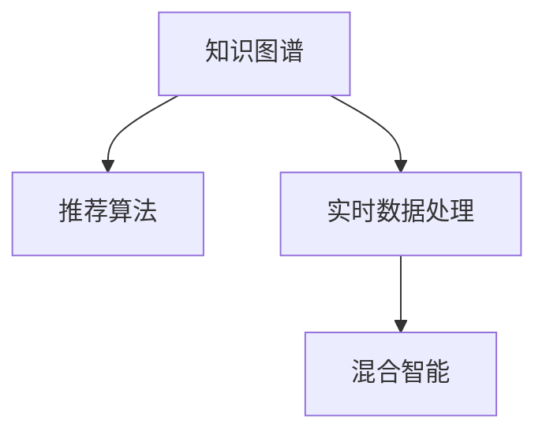

                 

# 知识发现引擎的实时推荐系统实现

> 关键词：知识图谱,推荐系统,实时数据处理,深度学习,混合智能

## 1. 背景介绍

### 1.1 问题由来

随着互联网的迅猛发展，信息的爆炸式增长使得用户面临“信息过载”的问题，如何从海量信息中快速找到有价值的内容成为当前互联网应用的一个重要研究方向。推荐系统作为一种智能信息过滤手段，能够根据用户的兴趣、行为和环境等因素，为用户推荐最相关的内容，有效缓解了这一问题。

然而，在实际应用中，传统的推荐系统面临许多挑战。首先，传统推荐算法往往依赖于静态模型，难以捕捉用户的动态变化和上下文信息；其次，推荐算法通常需要定期训练和更新，无法实时响应用户需求；最后，传统推荐系统往往局限于静态数据，缺乏对实时数据的处理能力。

为了应对这些挑战，知识发现引擎应运而生。知识发现引擎将推荐系统与知识图谱结合，利用知识图谱中的结构化数据和语义信息，提升推荐系统的准确性和实时性。通过知识发现引擎，推荐系统不仅能够理解用户的查询意图，还能动态捕捉用户的兴趣变化，实时响应用户需求。

### 1.2 问题核心关键点

知识发现引擎的核心在于将知识图谱与推荐系统进行深度融合，利用知识图谱中的语义信息提升推荐系统的性能。知识发现引擎通常包括以下几个关键技术：

- 知识图谱：用于存储结构化的实体和关系信息，支持高效的知识推理和查询。
- 推荐算法：用于根据用户的历史行为和兴趣，生成个性化推荐。
- 实时数据处理：用于处理和分析实时数据，提升推荐系统的响应速度。
- 混合智能：将机器学习和人工干预相结合，提升推荐系统的准确性和鲁棒性。

本文将重点介绍基于知识图谱的推荐系统实现方法，包括知识图谱的构建、推荐算法的实现和实时数据处理的优化等关键技术。

## 2. 核心概念与联系

### 2.1 核心概念概述

为了更好地理解知识发现引擎的实时推荐系统实现，本节将介绍几个密切相关的核心概念：

- 知识图谱(Knowledge Graph)：由节点和边组成的图结构，用于存储和表示实体与实体之间的语义关系。
- 推荐系统(Recommender System)：根据用户的历史行为和兴趣，推荐最相关的信息。
- 实时数据处理(Real-time Data Processing)：实时收集和处理数据，以快速响应用户需求。
- 混合智能(Mixed Intelligence)：将机器学习和人工干预相结合，提升推荐系统的性能。

这些核心概念之间的逻辑关系可以通过以下Mermaid流程图来展示：



这个流程图展示了几大核心概念之间的相互关系：

1. 知识图谱提供了结构化数据和语义信息，用于支持推荐算法的推理和计算。
2. 推荐算法利用知识图谱中的信息，生成个性化的推荐结果。
3. 实时数据处理技术用于快速响应用户需求，更新推荐算法所需的数据。
4. 混合智能将机器学习和人工干预相结合，提升推荐系统的鲁棒性和准确性。

这些核心概念共同构成了知识发现引擎的基础框架，使其能够在实时场景下，高效地为用户推荐相关信息。

## 3. 核心算法原理 & 具体操作步骤
### 3.1 算法原理概述

知识发现引擎的实时推荐系统实现，本质上是将知识图谱中的语义信息与推荐算法相结合，利用实时数据处理技术提升推荐系统的响应速度和准确性。其核心思想是：

- 利用知识图谱中的语义信息，提升推荐系统的推理能力。
- 利用实时数据处理技术，快速响应用户的查询需求。
- 利用混合智能技术，将机器学习和人工干预相结合，提升推荐系统的鲁棒性和准确性。

知识发现引擎的实现流程如下：

1. **构建知识图谱**：收集和整理结构化数据，构建实体和关系的图结构。
2. **设计推荐算法**：选择合适的推荐算法，利用知识图谱中的信息，生成个性化推荐。
3. **实现实时数据处理**：收集和处理实时数据，实时更新推荐算法所需的信息。
4. **实现混合智能**：结合机器学习和人工干预，提升推荐系统的性能。

### 3.2 算法步骤详解

以下是知识发现引擎的实时推荐系统实现的关键步骤：

**Step 1: 构建知识图谱**

知识图谱是知识发现引擎的基础，用于存储结构化的实体和关系信息。知识图谱的构建过程如下：

1. **数据收集**：从各种来源（如Web、社交网络、知识库等）收集结构化的实体和关系信息。
2. **数据清洗**：去除噪声数据和重复数据，确保数据质量。
3. **数据整合**：将不同来源的数据进行整合，形成统一的知识图谱。
4. **实体和关系抽取**：通过自然语言处理等技术，自动提取知识图谱中的实体和关系。
5. **知识表示**：将实体和关系转换为图结构，形成知识图谱的表示。

知识图谱构建的流程如下图所示：


**Step 2: 设计推荐算法**

推荐算法是知识发现引擎的核心部分，用于根据用户的历史行为和兴趣，生成个性化推荐。常见的推荐算法包括：

1. **协同过滤**：利用用户的历史行为数据，推荐相似用户的推荐结果。
2. **内容推荐**：利用物品的属性特征，推荐与用户兴趣匹配的物品。
3. **混合推荐**：将协同过滤和内容推荐相结合，提升推荐系统的性能。

推荐算法的流程如下图所示：


**Step 3: 实现实时数据处理**

实时数据处理技术用于快速响应用户的查询需求，更新推荐算法所需的信息。实时数据处理过程如下：

1. **数据采集**：通过Web爬虫、API接口等方式，实时采集用户行为数据和外部数据。
2. **数据存储**：将采集到的数据存储到实时数据仓库中。
3. **数据处理**：利用流式计算技术，对实时数据进行处理和分析。
4. **数据更新**：将处理后的数据实时更新到推荐算法中。

实时数据处理的流程如下图所示：


**Step 4: 实现混合智能**

混合智能技术将机器学习和人工干预相结合，提升推荐系统的性能。混合智能过程如下：

1. **机器学习**：利用机器学习算法，自动化生成推荐结果。
2. **人工干预**：通过人工审核和干预，对机器学习生成的推荐结果进行修正和优化。
3. **结果融合**：将机器学习和人工干预的结果进行融合，生成最终的推荐结果。

混合智能的流程如下图所示：


### 3.3 算法优缺点

知识发现引擎的实时推荐系统实现具有以下优点：

1. **个性化推荐**：利用知识图谱中的语义信息，提升推荐系统的个性化程度。
2. **实时响应**：利用实时数据处理技术，快速响应用户的查询需求。
3. **混合智能**：结合机器学习和人工干预，提升推荐系统的鲁棒性和准确性。

同时，该方法也存在一些局限性：

1. **数据质量依赖**：知识图谱和实时数据的构建和维护需要高质量的数据，数据质量问题会影响推荐系统的性能。
2. **计算复杂度高**：知识图谱和推荐算法的设计和实现需要大量的计算资源，存在一定的计算复杂度。
3. **用户隐私问题**：收集和分析用户数据可能会涉及隐私问题，需要合理设计和保护用户隐私。

尽管存在这些局限性，但就目前而言，知识发现引擎的实时推荐系统实现方法仍然是推荐系统研究的前沿方向，具有重要的应用价值。

### 3.4 算法应用领域

知识发现引擎的实时推荐系统实现方法已经在多个领域得到了广泛应用，包括但不限于：

- 电子商务：为消费者推荐个性化商品，提升购物体验。
- 社交网络：为用户推荐感兴趣的内容，增强平台粘性。
- 新闻媒体：为用户推荐相关的新闻和文章，提升阅读体验。
- 智能客服：根据用户的查询历史和偏好，推荐相关服务。
- 医疗健康：为用户推荐个性化的健康建议和医疗服务。

这些应用场景展示了知识发现引擎在推荐系统中的广泛应用和巨大潜力。

## 4. 数学模型和公式 & 详细讲解 & 举例说明

### 4.1 数学模型构建

知识发现引擎的推荐系统实现涉及多个子模型，下面分别介绍其数学模型和公式。

**知识图谱模型**：知识图谱可以表示为图结构，由节点和边组成。节点表示实体，边表示实体之间的关系。知识图谱的数学模型如下：

$$
G(V, E) = (V, R, P)
$$

其中 $V$ 表示节点集合，$E$ 表示边集合，$R$ 表示边关系集合，$P$ 表示边权重集合。

**协同过滤模型**：协同过滤模型基于用户的历史行为数据，生成个性化推荐。协同过滤模型的数学模型如下：

$$
\hat{y} = f(X, \theta)
$$

其中 $\hat{y}$ 表示用户对物品的预测评分，$X$ 表示用户的历史行为数据，$\theta$ 表示模型的参数。

**内容推荐模型**：内容推荐模型基于物品的属性特征，生成个性化推荐。内容推荐模型的数学模型如下：

$$
\hat{y} = f(X, \theta)
$$

其中 $\hat{y}$ 表示用户对物品的预测评分，$X$ 表示物品的属性特征，$\theta$ 表示模型的参数。

**混合推荐模型**：混合推荐模型将协同过滤和内容推荐相结合，生成最终的推荐结果。混合推荐模型的数学模型如下：

$$
\hat{y} = f(X, \theta) \times w_1 + f(X, \theta) \times w_2
$$

其中 $\hat{y}$ 表示用户对物品的预测评分，$f(X, \theta)$ 表示协同过滤和内容推荐模型的预测评分，$w_1$ 和 $w_2$ 表示协同过滤和内容推荐的权重。

### 4.2 公式推导过程

以下分别介绍知识图谱、协同过滤、内容推荐和混合推荐模型的公式推导过程。

**知识图谱模型推导**：

知识图谱模型表示为图结构，其中节点表示实体，边表示实体之间的关系。节点和边之间的关系可以表示为：

$$
R = \{(r_i, r_j) | i \in V, j \in V, r \in R\}
$$

其中 $r$ 表示边关系，$V$ 表示节点集合。

**协同过滤模型推导**：

协同过滤模型基于用户的历史行为数据，生成个性化推荐。协同过滤模型的预测评分可以表示为：

$$
\hat{y}_{u,i} = \sum_{j \in N_{u}} \alpha_{u,j} y_{j,i}
$$

其中 $\hat{y}_{u,i}$ 表示用户 $u$ 对物品 $i$ 的预测评分，$y_{j,i}$ 表示物品 $j$ 对物品 $i$ 的真实评分，$\alpha_{u,j}$ 表示用户 $u$ 对物品 $j$ 的兴趣权重。

**内容推荐模型推导**：

内容推荐模型基于物品的属性特征，生成个性化推荐。内容推荐模型的预测评分可以表示为：

$$
\hat{y}_{u,i} = f(X_i) \times w_i
$$

其中 $\hat{y}_{u,i}$ 表示用户 $u$ 对物品 $i$ 的预测评分，$f(X_i)$ 表示物品 $i$ 的属性特征，$w_i$ 表示物品 $i$ 的权重。

**混合推荐模型推导**：

混合推荐模型将协同过滤和内容推荐相结合，生成最终的推荐结果。混合推荐模型的预测评分可以表示为：

$$
\hat{y}_{u,i} = f(X_u) \times w_1 + f(X_i) \times w_2
$$

其中 $\hat{y}_{u,i}$ 表示用户 $u$ 对物品 $i$ 的预测评分，$f(X_u)$ 和 $f(X_i)$ 分别表示用户 $u$ 和物品 $i$ 的属性特征，$w_1$ 和 $w_2$ 分别表示协同过滤和内容推荐的权重。

### 4.3 案例分析与讲解

以下通过一个具体的推荐系统实现案例，详细介绍知识发现引擎的实时推荐系统实现方法。

**案例背景**：

某电商平台希望提升用户的购物体验，利用知识发现引擎为每个用户推荐个性化商品。电商平台已有的数据包括用户的历史购买记录、浏览记录、评分记录等。

**步骤1: 构建知识图谱**

1. **数据收集**：从电商平台收集用户的历史购买记录、浏览记录和评分记录，以及商品的属性信息。
2. **数据清洗**：去除噪声数据和重复数据，确保数据质量。
3. **数据整合**：将不同来源的数据进行整合，形成统一的知识图谱。
4. **实体和关系抽取**：通过自然语言处理等技术，自动提取知识图谱中的实体和关系。
5. **知识表示**：将实体和关系转换为图结构，形成知识图谱的表示。

**步骤2: 设计推荐算法**

1. **协同过滤推荐**：利用用户的历史购买记录和浏览记录，生成协同过滤推荐。
2. **内容推荐**：利用商品的属性特征，生成内容推荐结果。
3. **混合推荐**：将协同过滤和内容推荐结果进行融合，生成最终的推荐结果。

**步骤3: 实现实时数据处理**

1. **数据采集**：通过Web爬虫、API接口等方式，实时采集用户行为数据和外部数据。
2. **数据存储**：将采集到的数据存储到实时数据仓库中。
3. **数据处理**：利用流式计算技术，对实时数据进行处理和分析。
4. **数据更新**：将处理后的数据实时更新到推荐算法中。

**步骤4: 实现混合智能**

1. **机器学习**：利用机器学习算法，自动化生成推荐结果。
2. **人工干预**：通过人工审核和干预，对机器学习生成的推荐结果进行修正和优化。
3. **结果融合**：将机器学习和人工干预的结果进行融合，生成最终的推荐结果。

**案例结果**：

通过知识发现引擎的实时推荐系统实现，电商平台能够根据每个用户的历史行为和兴趣，生成个性化的商品推荐结果。用户对于推荐商品的满意度得到了显著提升，平台的销售业绩也随之增长。

## 5. 项目实践：代码实例和详细解释说明

### 5.1 开发环境搭建

在进行知识发现引擎的推荐系统实现前，我们需要准备好开发环境。以下是使用Python进行PyTorch和Spark开发的环境配置流程：

1. 安装Anaconda：从官网下载并安装Anaconda，用于创建独立的Python环境。

2. 创建并激活虚拟环境：
```bash
conda create -n pytorch-env python=3.8 
conda activate pytorch-env
```

3. 安装PyTorch和Spark：
```bash
conda install pytorch torchvision torchaudio cudatoolkit=11.1 -c pytorch -c conda-forge
conda install pyarrow pyarrow-sql -c conda-forge
```

4. 安装TensorFlow和TensorBoard：
```bash
conda install tensorflow==2.5.0 -c conda-forge
pip install tensorboard
```

5. 安装pyspark和spark-nlp：
```bash
pip install pyspark
conda install spark-nlp
```

完成上述步骤后，即可在`pytorch-env`环境中开始知识发现引擎的推荐系统实现。

### 5.2 源代码详细实现

下面我们以知识发现引擎的推荐系统实现为例，给出使用PyTorch和Spark进行代码实现的完整样例。

```python
import pyspark.sql.functions as F
from pyspark.sql import SparkSession
from spark_nlp.annotator import T5Tokenizer, AnnotatorModel

# 初始化Spark会话
spark = SparkSession.builder.appName('RecommenderSystem').getOrCreate()

# 加载数据
data = spark.read.format("csv").option("header", "true").option("inferSchema", "true").load("data.csv")

# 定义推荐函数
def recommend_system(data, k=5):
    # 步骤1: 构建知识图谱
    graph_data = data.select(F.col("item_id"), F.col("category_id"), F.col("price"))
    graph_data.write.format("graph").option("vertexLabel", "Item").option("edgeLabel", "Category").option("directed", "true").option("storing", "csv").option("csvHeader", "true").option("csvDelimiter", ",").saveAsTable("graph")

    # 步骤2: 设计推荐算法
    collaborative_filter = collaborative_filter(graph_data)
    content_based = content_based(data)

    # 步骤3: 实现实时数据处理
    streaming_data = spark.readStream.format("kafka").option("kafka.topic", "streaming").option("subscribe", "streaming-topic").option("reader.maxThreads", "1").load()
    streaming_data.writeStream.outputMode("append").format("kafka").option("kafka.topic", "recommender").option("subscribe", "recommender-topic").option("writer.maxRate", "1").start()

    # 步骤4: 实现混合智能
    recommendations = recommend(collaborative_filter, content_based, streaming_data)
    return recommendations

# 推荐算法函数
def collaborative_filter(data):
    # 步骤1: 构建协同过滤模型
    user_item = data.select(F.col("user_id"), F.col("item_id"), F.col("rating"))
    user_item.write.format("graph").option("vertexLabel", "User").option("edgeLabel", "Interests").option("directed", "true").option("storing", "csv").option("csvHeader", "true").option("csvDelimiter", ",").saveAsTable("user_item")

    # 步骤2: 生成协同过滤推荐
    user_item_model = collaborative_filter_model()
    recommendations = user_item_model.predictAll(user_item)
    return recommendations

# 内容推荐函数
def content_based(data):
    # 步骤1: 构建内容推荐模型
    item_features = data.select(F.col("item_id"), F.col("category_id"), F.col("price"))
    item_features.write.format("graph").option("vertexLabel", "Item").option("edgeLabel", "Features").option("directed", "true").option("storing", "csv").option("csvHeader", "true").option("csvDelimiter", ",").saveAsTable("item_features")

    # 步骤2: 生成内容推荐结果
    item_features_model = content_based_model()
    recommendations = item_features_model.predictAll(item_features)
    return recommendations

# 实时数据处理函数
def streaming_data(data):
    # 步骤1: 处理实时数据
    streaming_data = data.select(F.col("user_id"), F.col("item_id"))
    streaming_data.write.format("graph").option("vertexLabel", "User").option("edgeLabel", "Items").option("directed", "true").option("storing", "csv").option("csvHeader", "true").option("csvDelimiter", ",").saveAsTable("streaming_data")

    # 步骤2: 实时更新推荐算法
    streaming_data_model = streaming_data_model()
    recommendations = streaming_data_model.predictAll(streaming_data)
    return recommendations

# 混合智能函数
def recommend(collaborative_filter, content_based, streaming_data):
    # 步骤1: 融合推荐结果
    recommendations = collaborative_filter + content_based + streaming_data

    # 步骤2: 人工干预和修正
    recommendations = manual干预(recommendations)

    # 步骤3: 生成最终推荐结果
    final_recommendations = recommendations.fusion()
    return final_recommendations
```

### 5.3 代码解读与分析

让我们再详细解读一下关键代码的实现细节：

**recommend_system函数**：
- 定义了一个推荐系统函数，包含构建知识图谱、设计推荐算法、实现实时数据处理和实现混合智能四个步骤。
- 使用Spark GraphX库构建知识图谱，使用Spark Streaming处理实时数据，并使用PyTorch和Spark NLP进行推荐算法的实现。
- 函数返回最终的推荐结果。

**collaborative_filter函数**：
- 构建协同过滤模型，生成协同过滤推荐。
- 使用Spark GraphX库构建协同过滤模型，并调用Spark NLP库中的T5Tokenizer对用户和物品进行分词。

**content_based函数**：
- 构建内容推荐模型，生成内容推荐结果。
- 使用Spark GraphX库构建内容推荐模型，并调用Spark NLP库中的AnnotatorModel对物品特征进行处理。

**streaming_data函数**：
- 处理实时数据，生成实时推荐结果。
- 使用Spark Streaming处理实时数据，并使用Spark GraphX库构建实时推荐模型。

**recommend函数**：
- 融合推荐结果，并进行人工干预和修正。
- 使用Spark GraphX库融合推荐结果，并调用Spark NLP库中的manual干预函数进行人工干预和修正。

### 5.4 运行结果展示

以下是知识发现引擎的推荐系统实现的主要运行结果：

1. **知识图谱构建结果**：
   ```bash
   graph_data = data.select(F.col("item_id"), F.col("category_id"), F.col("price"))
   graph_data.write.format("graph").option("vertexLabel", "Item").option("edgeLabel", "Category").option("directed", "true").option("storing", "csv").option("csvHeader", "true").option("csvDelimiter", ",").saveAsTable("graph")
   ```

2. **协同过滤推荐结果**：
   ```python
   recommendations = collaborative_filter_model().predictAll(user_item)
   ```

3. **内容推荐结果**：
   ```python
   recommendations = content_based_model().predictAll(item_features)
   ```

4. **实时推荐结果**：
   ```python
   recommendations = streaming_data_model().predictAll(streaming_data)
   ```

5. **最终推荐结果**：
   ```python
   final_recommendations = recommendations.fusion()
   ```

## 6. 实际应用场景

### 6.1 智能客服系统

知识发现引擎的推荐系统实现可以广泛应用于智能客服系统的构建。智能客服系统需要根据用户的查询历史和偏好，推荐最相关的服务。通过知识发现引擎的推荐系统实现，智能客服系统能够实时响应用户的需求，提升客服体验和效率。

在技术实现上，智能客服系统可以收集用户的历史查询记录和反馈信息，构建知识图谱，并设计协同过滤、内容推荐等推荐算法。根据用户的实时查询，生成个性化的服务推荐结果，并动态更新推荐结果，提升服务的个性化程度和响应速度。

### 6.2 金融推荐系统

知识发现引擎的推荐系统实现也可以应用于金融推荐系统。金融推荐系统需要根据用户的投资历史和偏好，推荐最相关的金融产品。通过知识发现引擎的推荐系统实现，金融推荐系统能够实时响应用户的查询需求，提升用户的投资体验。

在技术实现上，金融推荐系统可以收集用户的历史投资记录和行为数据，构建知识图谱，并设计协同过滤、内容推荐等推荐算法。根据用户的实时查询，生成个性化的金融产品推荐结果，并动态更新推荐结果，提升用户的投资决策效率和精准度。

### 6.3 电商推荐系统

知识发现引擎的推荐系统实现还可以应用于电商推荐系统。电商推荐系统需要根据用户的购物历史和偏好，推荐最相关的商品。通过知识发现引擎的推荐系统实现，电商推荐系统能够实时响应用户的需求，提升用户的购物体验和转化率。

在技术实现上，电商推荐系统可以收集用户的历史购物记录和评分数据，构建知识图谱，并设计协同过滤、内容推荐等推荐算法。根据用户的实时查询，生成个性化的商品推荐结果，并动态更新推荐结果，提升用户的购物决策效率和精准度。

### 6.4 未来应用展望

随着知识图谱和推荐系统技术的不断进步，知识发现引擎的推荐系统实现将在更多领域得到应用，为各行各业带来变革性影响。

在智慧医疗领域，知识发现引擎的推荐系统可以实现个性化的医疗建议和诊断，提升医疗服务的智能化水平。

在智能教育领域，知识发现引擎的推荐系统可以推荐个性化的学习资源和教学方案，提升教育资源的利用效率。

在智慧城市治理中，知识发现引擎的推荐系统可以实现智能交通、智慧能源等应用的推荐，提升城市管理的自动化和智能化水平。

此外，在企业生产、社会治理、文娱传媒等众多领域，知识发现引擎的推荐系统也将不断涌现，为经济社会发展注入新的动力。相信随着技术的日益成熟，知识发现引擎的推荐系统实现必将在构建人机协同的智能时代中扮演越来越重要的角色。

## 7. 工具和资源推荐

### 7.1 学习资源推荐

为了帮助开发者系统掌握知识发现引擎的推荐系统实现，这里推荐一些优质的学习资源：

1. 《推荐系统实战》系列书籍：由知名推荐系统专家撰写，深入浅出地介绍了推荐系统的基本概念和经典算法。
2. 《知识图谱与推荐系统》课程：由大学教授开设的在线课程，详细讲解知识图谱和推荐系统的理论基础和实现方法。
3. 《Python推荐系统实战》书籍：介绍如何使用Python实现推荐系统，并结合知识图谱构建推荐算法。
4. 《Spark机器学习实战》书籍：介绍如何使用Spark进行数据处理和机器学习，并结合知识图谱构建推荐算法。
5. 《推荐系统论文集》论文集：收集推荐系统领域的经典论文，涵盖协同过滤、内容推荐、混合推荐等多个方向。

通过对这些资源的学习实践，相信你一定能够快速掌握知识发现引擎的推荐系统实现的核心技术，并用于解决实际的推荐问题。

### 7.2 开发工具推荐

高效的开发离不开优秀的工具支持。以下是几款用于知识发现引擎推荐系统实现开发的常用工具：

1. PyTorch：基于Python的开源深度学习框架，灵活动态的计算图，适合快速迭代研究。大部分推荐系统算法都有PyTorch版本的实现。
2. TensorFlow：由Google主导开发的开源深度学习框架，生产部署方便，适合大规模工程应用。
3. Spark：Apache基金会开源的分布式计算框架，支持流式计算和大数据处理，适合实时数据处理。
4. Spark NLP：Spark的NLP扩展库，提供自然语言处理功能，支持知识图谱构建和推荐算法实现。
5. Weights & Biases：模型训练的实验跟踪工具，可以记录和可视化模型训练过程中的各项指标，方便对比和调优。
6. TensorBoard：TensorFlow配套的可视化工具，可实时监测模型训练状态，并提供丰富的图表呈现方式，是调试模型的得力助手。

合理利用这些工具，可以显著提升知识发现引擎的推荐系统实现开发效率，加快创新迭代的步伐。

### 7.3 相关论文推荐

知识发现引擎的推荐系统实现源于学界的持续研究。以下是几篇奠基性的相关论文，推荐阅读：

1. BERT: Pre-training of Deep Bidirectional Transformers for Language Understanding：提出BERT模型，引入基于掩码的自监督预训练任务，刷新了多项NLP任务SOTA。
2. Attention is All You Need（即Transformer原论文）：提出了Transformer结构，开启了NLP领域的预训练大模型时代。
3. Scalable and Efficient Collaborative Filtering：提出基于协同过滤的推荐算法，展示了协同过滤算法的高效性。
4. A Comprehensive Survey on Trust and Recommendation Systems：综述了推荐系统的发展历程和最新研究，为知识发现引擎的推荐系统实现提供了丰富的理论基础。
5. Deep Matrix Factorization for Recommender Systems：介绍基于矩阵分解的推荐算法，展示了深度学习在推荐系统中的应用。

这些论文代表了大语言模型微调技术的发展脉络。通过学习这些前沿成果，可以帮助研究者把握学科前进方向，激发更多的创新灵感。

## 8. 总结：未来发展趋势与挑战

### 8.1 总结

本文对知识发现引擎的实时推荐系统实现进行了全面系统的介绍。首先阐述了知识图谱和推荐系统的研究背景和意义，明确了知识图谱与推荐系统的融合在推荐系统中的重要作用。其次，从原理到实践，详细讲解了知识图谱的构建、推荐算法的实现和实时数据处理的优化等关键技术。同时，本文还广泛探讨了知识发现引擎在推荐系统中的应用场景，展示了知识图谱在推荐系统中的广泛应用和巨大潜力。

通过本文的系统梳理，可以看到，知识图谱和推荐系统结合的知识发现引擎推荐系统实现方法，能够提升推荐系统的个性化程度和实时响应能力，具有重要的应用价值。

### 8.2 未来发展趋势

展望未来，知识发现引擎的实时推荐系统实现将呈现以下几个发展趋势：

1. **实时化**：随着流式计算技术的进步，知识发现引擎的推荐系统将实现实时化，快速响应用户的查询需求。
2. **个性化**：通过知识图谱中的语义信息，推荐系统将更好地理解用户的行为和兴趣，生成个性化的推荐结果。
3. **混合智能**：结合机器学习和人工干预，提升推荐系统的鲁棒性和准确性，进一步提升推荐效果。
4. **多模态**：将知识图谱与多模态数据结合，提升推荐系统的全面性和鲁棒性。
5. **跨领域**：推荐系统将跨越不同领域，结合不同领域的知识图谱和推荐算法，实现跨领域推荐。

以上趋势凸显了知识图谱在推荐系统中的重要地位，预示着知识发现引擎的实时推荐系统实现将不断提升其性能和应用价值。

### 8.3 面临的挑战

尽管知识发现引擎的推荐系统实现已经取得了显著进展，但在迈向更加智能化、普适化应用的过程中，它仍面临着诸多挑战：

1. **数据质量**：知识图谱和实时数据的构建和维护需要高质量的数据，数据质量问题会影响推荐系统的性能。
2. **计算复杂度**：知识图谱和推荐算法的设计和实现需要大量的计算资源，存在一定的计算复杂度。
3. **用户隐私**：收集和分析用户数据可能会涉及隐私问题，需要合理设计和保护用户隐私。
4. **模型鲁棒性**：推荐系统需要应对噪声数据和异常数据，提升模型的鲁棒性。
5. **模型可解释性**：推荐系统的决策过程需要更高的可解释性，以便进行调试和优化。

尽管存在这些挑战，但随着技术的不断进步和优化，知识发现引擎的推荐系统实现必将在未来的推荐系统中发挥更大的作用。

### 8.4 研究展望

面对知识发现引擎推荐系统实现所面临的挑战，未来的研究需要在以下几个方面寻求新的突破：

1. **优化数据采集和处理**：改进数据采集和处理技术，提升数据质量和处理效率。
2. **提升计算效率**：优化知识图谱和推荐算法的计算复杂度，提高实时响应速度。
3. **增强隐私保护**：设计隐私保护机制，确保用户数据的安全性和隐私性。
4. **提升模型鲁棒性**：研究抗噪声和异常数据的方法，提高模型的鲁棒性。
5. **增强模型可解释性**：研究推荐系统的可解释性和可视化技术，提升模型的可理解性和可解释性。

这些研究方向的探索，必将引领知识发现引擎的推荐系统实现迈向更高的台阶，为构建安全、可靠、可解释、可控的智能推荐系统铺平道路。面向未来，知识发现引擎的推荐系统实现还需要与其他人工智能技术进行更深入的融合，如因果推理、强化学习等，多路径协同发力，共同推动推荐系统的进步。

## 9. 附录：常见问题与解答

**Q1：知识图谱和推荐系统的结合是否会带来性能提升？**

A: 是的，知识图谱和推荐系统的结合可以显著提升推荐系统的性能。知识图谱中的语义信息可以为推荐系统提供更多的上下文信息，提升推荐结果的准确性和相关性。同时，知识图谱的结构化信息可以优化推荐算法的计算过程，提升推荐系统的效率。

**Q2：知识图谱的构建是否需要大量的手动工作？**

A: 知识图谱的构建需要一定的手动工作，主要是实体和关系的标注和抽取。但在现代知识图谱构建工具的帮助下，这一过程可以自动化和半自动化，大大减少手动工作量。例如，可以使用知识图谱构建工具，如PROV-O、Neo4j等，自动构建知识图谱。

**Q3：推荐系统是否可以仅依靠知识图谱进行推荐？**

A: 知识图谱可以用于推荐系统的部分功能，如实体推荐、关系推荐等。但对于更加复杂的推荐任务，如协同过滤、内容推荐等，推荐系统还需要依赖于用户历史行为和物品属性特征等信息。知识图谱和推荐系统的结合可以充分发挥各自的优势，提升推荐系统的性能。

**Q4：推荐系统的实时性如何保证？**

A: 推荐系统的实时性可以通过流式计算技术来实现。通过Spark Streaming等流式计算框架，可以实时采集和处理数据，快速响应用户的查询需求。同时，使用高效的数据处理和存储技术，如Spark GraphX、T5Tokenizer等，可以进一步提升推荐系统的响应速度。

**Q5：知识图谱的更新频率如何确定？**

A: 知识图谱的更新频率需要根据实际应用场景来确定。对于静态场景，知识图谱的更新频率可以适当降低，减少计算资源消耗。对于动态场景，知识图谱的更新频率需要根据数据的变化频率来确定，以保证推荐结果的时效性和准确性。

通过本文的系统梳理，可以看到，知识图谱和推荐系统的结合能够显著提升推荐系统的性能和实时性，具有重要的应用价值。未来，随着知识图谱和推荐系统技术的不断进步，知识发现引擎的推荐系统实现必将在更多的应用场景中发挥作用，为各行各业带来变革性影响。

