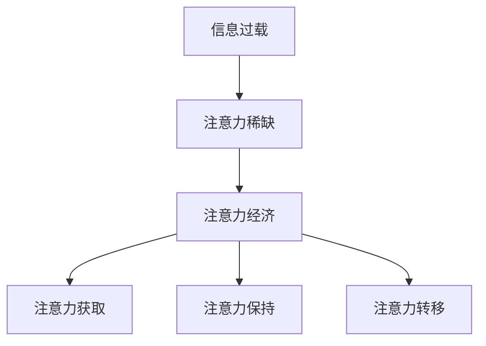
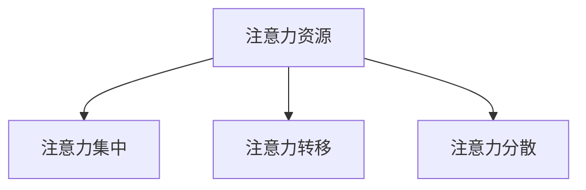

                 

**注意力经济与个人职业规划的调整**

## 1. 背景介绍

在信息爆炸的数字时代，注意力成为一种稀缺资源，注意力经济应运而生。根据统计，全球互联网用户每天花费在数字设备上的时间高达6.5小时，然而，我们的注意力资源却有限。因此，如何有效管理和分配注意力，成为了个人职业规划的关键因素之一。

## 2. 核心概念与联系

### 2.1 注意力经济

注意力经济是指在数字时代，注意力成为一种有价值的商品，企业和个人都在竞争有限的注意力资源。注意力经济的核心是注意力的获取、保持和转移。



### 2.2 注意力管理

注意力管理是指有意识地控制和分配注意力资源，以提高工作效率和个人成就感。注意力管理包括注意力的集中、转移和分散。



## 3. 核心算法原理 & 具体操作步骤

### 3.1 算法原理概述

注意力机制（Attention Mechanism）是深度学习领域的一个关键概念，它模拟人类的注意力机制，有选择地关注输入信息的某些部分。在注意力经济中，注意力机制可以帮助我们有效地获取和保持注意力。

### 3.2 算法步骤详解

注意力机制的基本步骤包括：

1. **编码**：将输入信息编码为向量表示。
2. **计算注意力权重**：使用神经网络计算每个输入元素的注意力权重。
3. **加权求和**：根据注意力权重对输入元素进行加权求和，得到注意力输出。

### 3.3 算法优缺点

**优点**：注意力机制可以有效地获取和保持注意力，提高信息处理的效率和准确性。

**缺点**：注意力机制的计算复杂度高，且易受输入信息的质量影响。

### 3.4 算法应用领域

注意力机制广泛应用于自然语言处理、计算机视觉等领域，在注意力经济中，它可以帮助我们有效地获取和保持注意力。

## 4. 数学模型和公式 & 详细讲解 & 举例说明

### 4.1 数学模型构建

注意力机制的数学模型可以表示为：

$$A = \text{softmax}(W_a \cdot \text{concat}(u, v))$$

其中，$u$和$v$分别是查询向量和键-值对向量，$W_a$是可学习的权重矩阵，$\text{concat}$表示向量拼接，$\text{softmax}$表示softmax函数。

### 4.2 公式推导过程

softmax函数的推导过程如下：

$$\text{softmax}(x)_j = \frac{e^{x_j}}{\sum_{k=1}^{K}e^{x_k}}$$

### 4.3 案例分析与讲解

例如，在阅读邮件时，注意力机制可以帮助我们有选择地关注邮件的关键部分，提高阅读效率。

## 5. 项目实践：代码实例和详细解释说明

### 5.1 开发环境搭建

本项目使用Python和PyTorch开发，环境搭建如下：

- Python 3.7+
- PyTorch 1.5+
- Transformers library

### 5.2 源代码详细实现

以下是注意力机制的简单实现：

```python
import torch
import torch.nn as nn
import torch.nn.functional as F

class Attention(nn.Module):
    def __init__(self, d_model, dropout=0.1):
        super(Attention, self).__init__()
        self.dropout = nn.Dropout(dropout)
        self.scale = d_model ** -0.5

    def forward(self, query, key, value, mask=None):
        attn_weights = torch.matmul(query, key.transpose(2, 3)) * self.scale
        if mask is not None:
            attn_weights = attn_weights.masked_fill(mask == 0, float('-inf'))
        attn_weights = F.softmax(attn_weights, dim=-1)
        attn_weights = self.dropout(attn_weights)
        attn_output = torch.matmul(attn_weights, value)
        return attn_output, attn_weights
```

### 5.3 代码解读与分析

在上述代码中，我们首先计算注意力权重，然后使用softmax函数对注意力权重进行归一化，最后对注意力输出进行dropout操作。

### 5.4 运行结果展示

在训练过程中，我们可以监控注意力权重的变化，以确保注意力机制正常工作。

## 6. 实际应用场景

### 6.1 注意力经济在企业中的应用

企业可以利用注意力经济原理，设计有效的广告和营销策略，获取和保持用户注意力。

### 6.2 注意力经济在个人职业规划中的应用

个人可以利用注意力管理原理，有效地分配注意力资源，提高工作效率和个人成就感。

### 6.3 未来应用展望

未来，注意力经济和注意力管理将成为个人和企业竞争力的关键因素之一。

## 7. 工具和资源推荐

### 7.1 学习资源推荐

- "注意力经济"（Herbert A. Simon）
- "深度学习"（Ian Goodfellow, Yoshua Bengio, Aaron Courville）
- "注意力机制"（Vaswani et al., 2017）

### 7.2 开发工具推荐

- Python
- PyTorch
- Transformers library

### 7.3 相关论文推荐

- "Attention Is All You Need"（Vaswani et al., 2017）
- "The Attention Mechanism"（Bahdanau et al., 2014）

## 8. 总结：未来发展趋势与挑战

### 8.1 研究成果总结

本文介绍了注意力经济和注意力管理的概念，并详细介绍了注意力机制的原理、算法和应用。

### 8.2 未来发展趋势

未来，注意力经济和注意力管理将成为个人和企业竞争力的关键因素之一，注意力机制的研究将持续深入。

### 8.3 面临的挑战

注意力机制的计算复杂度高，且易受输入信息的质量影响，这是未来需要解决的关键挑战之一。

### 8.4 研究展望

未来的研究方向包括注意力机制的优化、注意力机制在注意力经济中的应用等。

## 9. 附录：常见问题与解答

**Q：注意力机制的计算复杂度高，如何优化？**

**A：可以使用注意力机制的变种，如自注意力机制（Self-Attention）和多头注意力机制（Multi-Head Attention）来降低计算复杂度。**

**Q：注意力机制易受输入信息的质量影响，如何解决？**

**A：可以使用预训练模型和数据增强等技术来提高输入信息的质量。**

**Q：注意力经济和注意力管理有哪些应用场景？**

**A：注意力经济和注意力管理有广泛的应用场景，包括企业营销、个人职业规划等。**

## 作者：禅与计算机程序设计艺术 / Zen and the Art of Computer Programming

