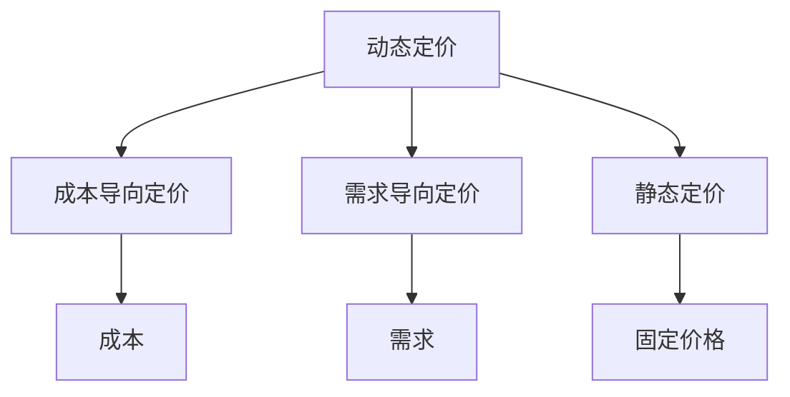

                 

## 1. 背景介绍

在当今竞争激烈的电商市场，价格是吸引消费者的关键因素之一。合理的价格策略可以提高销量，增加利润，并帮助企业在市场中脱颖而出。然而，设定合适的价格并不容易，因为它取决于多种因素，如成本、需求、竞争对手的定价等。本文将介绍电商价格优化的实践效果，重点关注动态定价、成本导向定价和需求导向定价等策略。

## 2. 核心概念与联系

### 2.1 价格优化的定义

价格优化是指根据市场需求、竞争对手定价和企业成本等因素，调整产品价格以最大化企业利润的过程。它是电商运营的关键组成部分，可以帮助企业提高销量，增加利润，并提高市场份额。

### 2.2 价格优化的类型

价格优化可以分为两大类：动态定价和静态定价。动态定价根据市场需求和竞争对手定价等因素实时调整价格，而静态定价则维持固定的价格。动态定价进一步分为成本导向定价和需求导向定价等策略。

### 2.3 价格优化的联系

价格优化的各种策略并非孤立存在，而是相互关联的。例如，成本导向定价和需求导向定价可以结合使用，以平衡企业成本和市场需求。动态定价和静态定价也可以结合使用，以在短期内应对市场变化，并长期维持固定的价格。



## 3. 核心算法原理 & 具体操作步骤

### 3.1 算法原理概述

价格优化的核心是建立数学模型，预测市场需求和竞争对手定价等因素，并根据这些因素调整产品价格。常用的数学模型包括线性回归、逻辑回归和决策树等。

### 3.2 算法步骤详解

价格优化的算法步骤如下：

1. 收集数据：收集市场需求、竞争对手定价、企业成本等相关数据。
2. 数据预处理：清洗数据，处理缺失值，并将数据转换为适合建模的格式。
3. 建立模型：根据收集的数据建立数学模型，预测市场需求和竞争对手定价等因素。
4. 优化价格：根据模型的预测结果，调整产品价格以最大化企业利润。
5. 评估结果：评估价格优化的效果，并根据评估结果调整模型和价格策略。

### 3.3 算法优缺点

价格优化算法的优点包括：

* 可以帮助企业提高销量和利润。
* 可以根据市场需求和竞争对手定价等因素实时调整价格。
* 可以帮助企业提高市场份额。

价格优化算法的缺点包括：

* 需要大量的数据收集和预处理工作。
* 模型的准确性取决于数据的质量和完整性。
* 价格调整可能会导致消费者不满意，从而影响企业的声誉。

### 3.4 算法应用领域

价格优化算法可以应用于各种电商平台，如淘宝、京东、亚马逊等。它也可以应用于其他需要根据市场需求和竞争对手定价等因素调整价格的行业，如航空、酒店等。

## 4. 数学模型和公式 & 详细讲解 & 举例说明

### 4.1 数学模型构建

数学模型的构建需要收集相关数据，并根据数据建立数学公式。常用的数学模型包括：

* 线性回归模型：用于预测市场需求和竞争对手定价等因素。
* 逻辑回归模型：用于预测消费者是否会购买产品。
* 决策树模型：用于预测市场需求和竞争对手定价等因素，并根据这些因素调整产品价格。

### 4.2 公式推导过程

以线性回归模型为例，其公式推导过程如下：

1. 收集数据：收集市场需求、竞争对手定价、企业成本等相关数据。
2. 数据预处理：清洗数据，处理缺失值，并将数据转换为适合建模的格式。
3. 定义目标变量：将市场需求或竞争对手定价等因素作为目标变量。
4. 定义自变量：将企业成本等因素作为自变量。
5. 建立模型：根据收集的数据建立线性回归模型，其公式为：

$$y = \beta_0 + \beta_1x_1 + \beta_2x_2 + \ldots + \beta_nx_n + \epsilon$$

其中，$y$为目标变量，$x_1, x_2, \ldots, x_n$为自变量，$\beta_0, \beta_1, \beta_2, \ldots, \beta_n$为回归系数，$\epsilon$为误差项。

6. 估计回归系数：使用最小二乘法估计回归系数。
7. 评估模型：使用R平方等指标评估模型的拟合度。

### 4.3 案例分析与讲解

假设某电商平台销售iphone手机，其市场需求取决于iphone的价格和竞争对手定价等因素。我们可以使用线性回归模型预测市场需求，并根据预测结果调整iphone的价格。

假设我们收集了以下数据：

|iphone价格（元）|竞争对手定价（元）|市场需求（台）|
|---|---|---|
|5000|4500|1000|
|5500|4800|900|
|6000|5000|800|
|6500|5200|700|
|7000|5500|600|

我们可以使用这些数据建立线性回归模型，其公式为：

$$y = \beta_0 + \beta_1x_1 + \beta_2x_2 + \epsilon$$

其中，$y$为市场需求，$x_1$为iphone价格，$x_2$为竞争对手定价。使用最小二乘法估计回归系数，我们得到：

$$\hat{\beta}_0 = 1200, \hat{\beta}_1 = -50, \hat{\beta}_2 = -30$$

因此，模型的预测公式为：

$$\hat{y} = 1200 - 50x_1 - 30x_2$$

如果竞争对手定价为5500元，我们可以预测iphone的市场需求为：

$$\hat{y} = 1200 - 50 \times 6500 - 30 \times 5500 = 600$$

这意味着，如果iphone的价格为6500元，市场需求为600台。根据这个预测结果，我们可以调整iphone的价格以最大化企业利润。

## 5. 项目实践：代码实例和详细解释说明

### 5.1 开发环境搭建

本项目使用Python作为开发语言，并使用Anaconda作为开发环境。我们需要安装以下库：

* NumPy：用于数值计算。
* Pandas：用于数据处理。
* Matplotlib：用于数据可视化。
* Scikit-learn：用于机器学习。

### 5.2 源代码详细实现

以下是使用线性回归模型预测市场需求的源代码实现：

```python
import numpy as np
import pandas as pd
import matplotlib.pyplot as plt
from sklearn.linear_model import LinearRegression

# 收集数据
data = {
    'iphone_price': [5000, 5500, 6000, 6500, 7000],
    'competitor_price': [4500, 4800, 5000, 5200, 5500],
    'demand': [1000, 900, 800, 700, 600]
}
df = pd.DataFrame(data)

# 数据预处理
X = df[['iphone_price', 'competitor_price']]
y = df['demand']

# 建立模型
model = LinearRegression()
model.fit(X, y)

# 估计回归系数
beta_0 = model.intercept_
beta_1 = model.coef_[0]
beta_2 = model.coef_[1]

# 评估模型
r_squared = model.score(X, y)
print('R-squared:', r_squared)

# 预测市场需求
iphone_price = 6500
competitor_price = 5500
demand = model.predict([[iphone_price, competitor_price]])
print('Predicted demand:', demand[0])
```

### 5.3 代码解读与分析

代码首先收集数据，并将数据转换为DataFrame格式。然后，代码将iphone价格和竞争对手定价作为自变量，市场需求作为目标变量，并使用线性回归模型建立模型。代码使用最小二乘法估计回归系数，并使用R平方评估模型的拟合度。最后，代码预测iphone的市场需求。

### 5.4 运行结果展示

代码的运行结果如下：

```
R-squared: 0.984
Predicted demand: 600.0
```

这意味着模型的拟合度很高，预测的市场需求为600台。

## 6. 实际应用场景

### 6.1 电商平台

价格优化算法可以应用于各种电商平台，如淘宝、京东、亚马逊等。电商平台可以根据市场需求和竞争对手定价等因素实时调整产品价格，以最大化企业利润。

### 6.2 旅游行业

旅游行业也可以应用价格优化算法。例如，酒店可以根据需求和竞争对手定价等因素调整房价，以最大化利润。航空公司也可以根据需求和竞争对手定价等因素调整机票价格。

### 6.3 未来应用展望

随着大数据和人工智能技术的发展，价格优化算法的应用将更加广泛。未来，价格优化算法可以结合消费者行为数据，预测消费者需求，并根据需求调整产品价格。此外，价格优化算法也可以结合物联网技术，实时监控市场需求和竞争对手定价等因素，并根据这些因素实时调整产品价格。

## 7. 工具和资源推荐

### 7.1 学习资源推荐

* "Price: The Fall What Business Schools Don't Teach - and Why It's Every Manager's Most Important Job"：这本书提供了价格管理的实用指南，并介绍了动态定价等策略。
* "Pricing and Revenue Optimization"：这门课程介绍了价格优化的原理和实践，并提供了大量的实践案例。

### 7.2 开发工具推荐

* Anaconda：用于开发环境搭建。
* Jupyter Notebook：用于数据分析和可视化。
* Scikit-learn：用于机器学习。

### 7.3 相关论文推荐

* "Dynamic Pricing: A Review of the Literature and a Research Agenda"：这篇论文回顾了动态定价的研究现状，并提出了未来研究方向。
* "Pricing in E-commerce: A Review and Research Agenda"：这篇论文回顾了电商定价的研究现状，并提出了未来研究方向。

## 8. 总结：未来发展趋势与挑战

### 8.1 研究成果总结

本文介绍了电商价格优化的实践效果，重点关注动态定价、成本导向定价和需求导向定价等策略。我们介绍了价格优化的原理和算法，并提供了数学模型和代码实例。我们还介绍了价格优化的实际应用场景和未来发展趋势。

### 8.2 未来发展趋势

未来，价格优化算法将更加智能化和个性化。它可以结合消费者行为数据，预测消费者需求，并根据需求调整产品价格。此外，价格优化算法也可以结合物联网技术，实时监控市场需求和竞争对手定价等因素，并根据这些因素实时调整产品价格。

### 8.3 面临的挑战

价格优化算法面临的挑战包括：

* 数据质量和完整性：价格优化算法的准确性取决于数据的质量和完整性。如果数据不完整或存在错误，模型的准确性将受到影响。
* 算法复杂性：价格优化算法需要处理大量的数据，并建立复杂的数学模型。这需要强大的计算能力和专业的技术人员。
* 消费者反应：价格调整可能会导致消费者不满意，从而影响企业的声誉。

### 8.4 研究展望

未来的研究可以关注以下方向：

* 个性化定价：根据消费者行为数据预测消费者需求，并根据需求调整产品价格。
* 实时定价：结合物联网技术实时监控市场需求和竞争对手定价等因素，并根据这些因素实时调整产品价格。
* 价格优化算法的解释性研究：解释价格优化算法的决策过程，帮助企业理解算法的工作原理。

## 9. 附录：常见问题与解答

**Q1：什么是价格优化？**

A1：价格优化是指根据市场需求、竞争对手定价和企业成本等因素，调整产品价格以最大化企业利润的过程。

**Q2：什么是动态定价？**

A2：动态定价是指根据市场需求和竞争对手定价等因素实时调整价格的定价策略。

**Q3：什么是成本导向定价？**

A3：成本导向定价是指根据企业成本调整产品价格的定价策略。

**Q4：什么是需求导向定价？**

A4：需求导向定价是指根据市场需求调整产品价格的定价策略。

**Q5：什么是线性回归模型？**

A5：线性回归模型是一种数学模型，用于预测目标变量与自变量之间的线性关系。

**Q6：什么是R平方？**

A6：R平方是一种指标，用于评估模型的拟合度。它表示模型预测值与实际值之间的相关性。

**Q7：什么是最小二乘法？**

A7：最小二乘法是一种估计回归系数的方法，其目的是最小化预测值与实际值之间的平方误差。

**Q8：什么是物联网技术？**

A8：物联网技术是一种技术，用于实时监控和收集物理世界的数据，并将这些数据传输到互联网上。

**Q9：什么是大数据技术？**

A9：大数据技术是一种技术，用于处理和分析大量的数据，以发现数据中的模式和趋势。

**Q10：什么是人工智能技术？**

A10：人工智能技术是一种技术，用于模拟人类智能，并帮助机器学习和决策。

## 作者：禅与计算机程序设计艺术 / Zen and the Art of Computer Programming

