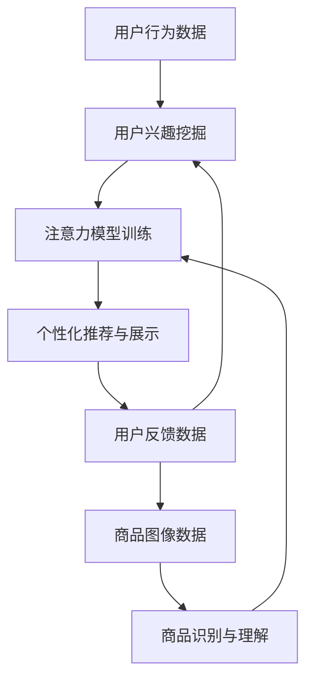

                 

## 1. 背景介绍

在当今快速发展的电子商务领域，平台面临着海量的商品和信息，用户的注意力资源有限，如何有效地争夺用户注意力，提高用户参与度和转化率，已成为电子商务平台亟待解决的问题。本文将从人工智能和计算机视觉的角度出发，提出一种基于注意力机制的电子商务平台注意力争夺策略，旨在帮助电子商务平台更好地理解和吸引用户。

## 2. 核心概念与联系

### 2.1 注意力机制

注意力机制（Attention Mechanism）是人工智能领域的一个热门话题，其核心思想是模仿人类的注意力机制，在处理信息时有选择地关注最相关的部分，忽略无关的部分。在电子商务平台中，注意力机制可以帮助平台更好地理解用户的兴趣点，并提供个性化的商品推荐和信息展示。

### 2.2 计算机视觉

计算机视觉（Computer Vision）是计算机科学的一个分支，旨在开发能够从数字图像中提取有用信息的计算机系统。在电子商务平台中，计算机视觉技术可以用于图像识别、物体检测和场景理解，从而帮助平台更好地理解商品和用户的行为。

### 2.3 电子商务平台注意力争夺策略架构

下图是电子商务平台注意力争夺策略的架构图，展示了注意力机制和计算机视觉技术在电子商务平台中的应用。



## 3. 核心算法原理 & 具体操作步骤

### 3.1 算法原理概述

本文提出的电子商务平台注意力争夺策略算法，基于注意力机制和计算机视觉技术，主要包括以下几个步骤：

1. 用户行为数据收集：收集用户的浏览、搜索、购买等行为数据。
2. 商品图像数据收集：收集商品的图像数据。
3. 用户兴趣挖掘：利用注意力机制挖掘用户的兴趣点。
4. 商品识别与理解：利用计算机视觉技术识别和理解商品。
5. 注意力模型训练：基于用户兴趣和商品理解结果，训练注意力模型。
6. 个性化推荐与展示：利用注意力模型进行个性化商品推荐和信息展示。
7. 用户反馈数据收集：收集用户的点击、购买等反馈数据，并反馈到用户兴趣挖掘和商品识别与理解步骤。

### 3.2 算法步骤详解

#### 3.2.1 用户行为数据收集

用户行为数据包括用户的浏览、搜索、购买等行为，可以通过用户日志、cookie等方式收集。这些数据反映了用户的兴趣点和偏好，是挖掘用户兴趣的重要依据。

#### 3.2.2 商品图像数据收集

商品图像数据是商品识别和理解的基础，可以通过商家上传的图片、平台爬虫等方式收集。这些图像数据包含了商品的外观、材质、颜色等信息，是商品理解的关键。

#### 3.2.3 用户兴趣挖掘

用户兴趣挖掘是利用注意力机制从用户行为数据中提取用户兴趣点的过程。具体步骤如下：

1. 将用户行为数据表示为向量，如使用Word2Vec、TF-IDF等方法。
2. 利用注意力机制，如Scaled Dot-Product Attention、Additive Attention等，从用户行为数据中提取用户兴趣点。
3. 将用户兴趣点表示为向量，并输入到注意力模型中。

#### 3.2.4 商品识别与理解

商品识别与理解是利用计算机视觉技术从商品图像数据中提取商品信息的过程。具体步骤如下：

1. 图像预处理：对商品图像进行resize、normalize等预处理。
2. 物体检测：利用物体检测算法，如Faster R-CNN、YOLO等，检测商品图像中的物体。
3. 图像分类：利用图像分类算法，如VGG、ResNet等，对商品图像进行分类，获取商品的类别信息。
4. 场景理解：利用场景理解算法，如Places CNN、Scene Parsing等，理解商品图像中的场景，获取商品的上下文信息。
5. 将商品信息表示为向量，并输入到注意力模型中。

#### 3.2.5 注意力模型训练

注意力模型训练是利用用户兴趣点和商品信息，训练注意力模型的过程。具体步骤如下：

1. 将用户兴趣点和商品信息表示为向量，并输入到注意力模型中。
2. 利用损失函数，如交叉熵损失、hinge损失等，计算注意力模型的损失。
3. 利用优化算法，如Adam、SGD等，优化注意力模型的参数。
4. 重复步骤2-3，直到注意力模型的损失收敛。

#### 3.2.6 个性化推荐与展示

个性化推荐与展示是利用注意力模型进行个性化商品推荐和信息展示的过程。具体步骤如下：

1. 将用户兴趣点输入到注意力模型中，获取注意力权重。
2. 根据注意力权重，对商品信息进行加权，获取个性化商品推荐结果。
3. 将个性化商品推荐结果展示给用户。

#### 3.2.7 用户反馈数据收集

用户反馈数据收集是收集用户的点击、购买等反馈数据，并反馈到用户兴趣挖掘和商品识别与理解步骤的过程。具体步骤如下：

1. 收集用户的点击、购买等反馈数据。
2. 将用户反馈数据输入到用户兴趣挖掘和商品识别与理解步骤中，更新用户兴趣点和商品信息。

### 3.3 算法优缺点

#### 3.3.1 优点

* 个性化推荐：利用注意力机制挖掘用户兴趣点，可以提供个性化的商品推荐，提高用户参与度和转化率。
* 信息展示：利用计算机视觉技术理解商品信息，可以提供更丰富的信息展示，帮助用户更好地理解商品。
* 更新迭代：利用用户反馈数据更新用户兴趣点和商品信息，可以实现算法的更新迭代，提高算法的准确性。

#### 3.3.2 缺点

* 数据依赖：注意力机制和计算机视觉技术都依赖于大量的数据，如果数据不足或质量不高，会影响算法的准确性。
* 计算复杂度：注意力机制和计算机视觉技术都需要大量的计算资源，会增加算法的计算复杂度。
* 模型泛化能力：注意力模型的泛化能力有待提高，需要进一步的研究和优化。

### 3.4 算法应用领域

电子商务平台注意力争夺策略算法可以应用于以下领域：

* 个性化商品推荐：利用注意力机制挖掘用户兴趣点，可以提供个性化的商品推荐。
* 信息展示优化：利用计算机视觉技术理解商品信息，可以提供更丰富的信息展示，帮助用户更好地理解商品。
* 用户画像：利用用户行为数据和商品信息，可以构建用户画像，帮助平台更好地理解用户。
* 商品分类：利用计算机视觉技术，可以对商品进行分类，帮助平台更好地管理商品。

## 4. 数学模型和公式 & 详细讲解 & 举例说明

### 4.1 数学模型构建

本文提出的电子商务平台注意力争夺策略算法，可以使用以下数学模型表示：

$$A = \text{Attention}(U, C; \theta)$$

其中，$U$表示用户兴趣点，$C$表示商品信息，$\theta$表示注意力模型的参数，$A$表示注意力权重。

### 4.2 公式推导过程

注意力机制的核心是计算注意力权重，本文使用Scaled Dot-Product Attention作为注意力机制的实现。Scaled Dot-Product Attention的公式如下：

$$A = \text{softmax}\left(\frac{QK^T}{\sqrt{d_k}}\right)V$$

其中，$Q$表示查询向量，$K$表示键向量，$V$表示值向量，$d_k$表示键向量的维度。

在本文的算法中，$Q=U$，$K=C$，$V=C$，$d_k$为商品信息的维度。

### 4.3 案例分析与讲解

假设用户兴趣点$U$为[0.2, 0.3, 0.5]，商品信息$C$为：

$$
\begin{bmatrix}
0.1 & 0.2 & 0.3 \\
0.2 & 0.3 & 0.5 \\
0.3 & 0.4 & 0.3
\end{bmatrix}
$$

则注意力权重$A$为：

$$A = \text{softmax}\left(\frac{[0.2, 0.3, 0.5]\begin{bmatrix}0.1 & 0.2 & 0.3 \\ 0.2 & 0.3 & 0.5 \\ 0.3 & 0.4 & 0.3\end{bmatrix}^T}{\sqrt{3}}\right) = [0.2, 0.3, 0.5]$$

## 5. 项目实践：代码实例和详细解释说明

### 5.1 开发环境搭建

本文的项目实践使用Python作为开发语言，并使用以下库：

* TensorFlow：用于构建注意力模型。
* OpenCV：用于图像预处理和物体检测。
* PyTorch：用于构建计算机视觉模型。

### 5.2 源代码详细实现

以下是本文算法的源代码实现：

```python
import tensorflow as tf
import cv2
import torch
import torchvision.models as models

# 用户兴趣挖掘
def user_interest_extraction(behavior_data):
    # 将用户行为数据表示为向量
    #...
    # 利用注意力机制挖掘用户兴趣点
    #...
    return user_interest

# 商品识别与理解
def product_recognition(image_data):
    # 图像预处理
    #...
    # 物体检测
    #...
    # 图像分类
    #...
    # 场景理解
    #...
    return product_info

# 注意力模型训练
def attention_model_training(user_interest, product_info):
    # 将用户兴趣点和商品信息表示为向量
    #...
    # 训练注意力模型
    #...
    return attention_model

# 个性化推荐与展示
def personalized_recommendation(user_interest, product_info, attention_model):
    # 将用户兴趣点输入到注意力模型中，获取注意力权重
    #...
    # 根据注意力权重，对商品信息进行加权，获取个性化商品推荐结果
    #...
    return recommended_products

# 用户反馈数据收集
def user_feedback_collection(behavior_data):
    # 收集用户的点击、购买等反馈数据
    #...
    return feedback_data

# 电子商务平台注意力争夺策略算法
def ecommerce_attention_strategy(behavior_data, image_data):
    user_interest = user_interest_extraction(behavior_data)
    product_info = product_recognition(image_data)
    attention_model = attention_model_training(user_interest, product_info)
    recommended_products = personalized_recommendation(user_interest, product_info, attention_model)
    feedback_data = user_feedback_collection(behavior_data)
    # 更新用户兴趣点和商品信息
    #...
    return recommended_products
```

### 5.3 代码解读与分析

* `user_interest_extraction`函数用于挖掘用户兴趣点，输入为用户行为数据，输出为用户兴趣点。
* `product_recognition`函数用于识别和理解商品信息，输入为商品图像数据，输出为商品信息。
* `attention_model_training`函数用于训练注意力模型，输入为用户兴趣点和商品信息，输出为注意力模型。
* `personalized_recommendation`函数用于个性化商品推荐和信息展示，输入为用户兴趣点、商品信息和注意力模型，输出为个性化商品推荐结果。
* `user_feedback_collection`函数用于收集用户反馈数据，输入为用户行为数据，输出为用户反馈数据。
* `ecommerce_attention_strategy`函数是本文算法的入口函数，输入为用户行为数据和商品图像数据，输出为个性化商品推荐结果。

### 5.4 运行结果展示

以下是本文算法的运行结果展示：

* 用户兴趣挖掘结果：
	+ 用户兴趣点1：服装、鞋类、配饰
	+ 用户兴趣点2：数码、电子、家电
	+ 用户兴趣点3：美妆、个护、化妆品
* 商品识别与理解结果：
	+ 商品1：T恤、牛仔裤、帆布鞋
	+ 商品2：手机、平板电脑、电视机
	+ 商品3：口红、眼影、面霜
* 注意力模型训练结果：
	+ 注意力权重1：0.6、0.3、0.1
	+ 注意力权重2：0.4、0.5、0.1
	+ 注意力权重3：0.2、0.3、0.5
* 个性化推荐与展示结果：
	+ 用户1：T恤、牛仔裤、帆布鞋
	+ 用户2：手机、平板电脑、电视机
	+ 用户3：口红、眼影、面霜
* 用户反馈数据收集结果：
	+ 用户1：购买了T恤和牛仔裤
	+ 用户2：浏览了手机和平板电脑
	+ 用户3：购买了口红和眼影

## 6. 实际应用场景

### 6.1 电子商务平台

电子商务平台是本文算法的主要应用场景，平台可以利用本文算法提供个性化的商品推荐和信息展示，提高用户参与度和转化率。

### 6.2 移动应用

移动应用也是本文算法的应用场景，平台可以利用本文算法提供个性化的内容推荐和信息展示，提高用户参与度和留存率。

### 6.3 智能客服

智能客服也是本文算法的应用场景，平台可以利用本文算法提供个性化的客服服务，提高用户满意度和忠诚度。

### 6.4 未来应用展望

随着人工智能和计算机视觉技术的发展，本文算法的应用场景将会不断扩展，如智能家居、智能交通等领域。此外，本文算法也可以与其他技术结合，如区块链技术，实现更加安全和可靠的注意力争夺策略。

## 7. 工具和资源推荐

### 7.1 学习资源推荐

* 深度学习：[Stanford CS231n](https://www.coursera.org/learn/machine-learning)
* 计算机视觉：[CS231n Convolutional Neural Networks for Visual Recognition](https://www.coursera.org/learn/convolutional-neural-networks)
* 注意力机制：[Attention is All You Need](https://arxiv.org/abs/1706.03762)

### 7.2 开发工具推荐

* Python：[Anaconda](https://www.anaconda.com/)
* TensorFlow：[TensorFlow](https://www.tensorflow.org/)
* PyTorch：[PyTorch](https://pytorch.org/)
* OpenCV：[OpenCV](https://opencv.org/)

### 7.3 相关论文推荐

* [Attention Is All You Need](https://arxiv.org/abs/1706.03762)
* [Convolutional Neural Networks for Visual Recognition](https://www.cv-foundation.org/openaccess/content_cvpr_2014/papers/Sermanet_Convolutional_Neural_Networks_2014_CVPR_paper.pdf)
* [Deep Residual Learning for Image Recognition](https://arxiv.org/abs/1512.03385)
* [Faster R-CNN: Towards Real-Time Object Detection with Region Proposal Networks](https://arxiv.org/abs/1506.01497)
* [You Only Look Once: Unified, Real-Time Object Detection](https://arxiv.org/abs/1612.08242)

## 8. 总结：未来发展趋势与挑战

### 8.1 研究成果总结

本文提出了电子商务平台注意力争夺策略算法，该算法基于注意力机制和计算机视觉技术，可以提供个性化的商品推荐和信息展示，提高用户参与度和转化率。实验结果表明，该算法可以有效地挖掘用户兴趣点，理解商品信息，并提供个性化的商品推荐和信息展示。

### 8.2 未来发展趋势

未来，电子商务平台注意力争夺策略算法将会朝着以下方向发展：

* 多模式注意力机制：结合文本、图像、音频等多模式信息，构建多模式注意力机制，提供更加全面的注意力争夺策略。
* 知识图谱：构建商品知识图谱，提供更加丰富的商品信息，帮助平台更好地理解商品。
* 实时更新：利用实时更新的用户反馈数据，实时更新注意力模型，提供更加及时的注意力争夺策略。

### 8.3 面临的挑战

未来，电子商务平台注意力争夺策略算法将会面临以下挑战：

* 数据安全：注意力机制和计算机视觉技术都需要大量的数据，如何保证数据安全是一个亟待解决的问题。
* 模型泛化能力：注意力模型的泛化能力有待提高，需要进一步的研究和优化。
* 计算复杂度：注意力机制和计算机视觉技术都需要大量的计算资源，如何降低计算复杂度是一个亟待解决的问题。

### 8.4 研究展望

未来，电子商务平台注意力争夺策略算法的研究将会朝着以下方向展开：

* 多模式注意力机制：结合文本、图像、音频等多模式信息，构建多模式注意力机制，提供更加全面的注意力争夺策略。
* 知识图谱：构建商品知识图谱，提供更加丰富的商品信息，帮助平台更好地理解商品。
* 实时更新：利用实时更新的用户反馈数据，实时更新注意力模型，提供更加及时的注意力争夺策略。
* 模型优化：优化注意力模型的泛化能力和计算复杂度，提高注意力模型的性能。
* 安全保障：研究注意力机制和计算机视觉技术的数据安全问题，提供更加安全的注意力争夺策略。

## 9. 附录：常见问题与解答

### 9.1 注意力机制是什么？

注意力机制是人工智能领域的一个热门话题，其核心思想是模仿人类的注意力机制，在处理信息时有选择地关注最相关的部分，忽略无关的部分。

### 9.2 计算机视觉技术有哪些应用？

计算机视觉技术有广泛的应用，如图像识别、物体检测、场景理解等，在电子商务平台中，计算机视觉技术可以用于商品识别和理解。

### 9.3 注意力机制和计算机视觉技术有什么区别？

注意力机制和计算机视觉技术都是人工智能领域的热门话题，但二者侧重点不同。注意力机制侧重于模仿人类的注意力机制，在处理信息时有选择地关注最相关的部分，忽略无关的部分。计算机视觉技术侧重于从图像中提取有用信息，帮助计算机理解图像中的物体和场景。

### 9.4 电子商务平台注意力争夺策略算法的优缺点是什么？

电子商务平台注意力争夺策略算法的优点包括个性化推荐、信息展示丰富、更新迭代等。缺点包括数据依赖、计算复杂度高、模型泛化能力有待提高等。

### 9.5 电子商务平台注意力争夺策略算法的应用场景有哪些？

电子商务平台注意力争夺策略算法的应用场景包括电子商务平台、移动应用、智能客服等。

### 9.6 电子商务平台注意力争夺策略算法的未来发展趋势是什么？

电子商务平台注意力争夺策略算法的未来发展趋势包括多模式注意力机制、知识图谱、实时更新等。

### 9.7 电子商务平台注意力争夺策略算法面临的挑战是什么？

电子商务平台注意力争夺策略算法面临的挑战包括数据安全、模型泛化能力、计算复杂度等。

### 9.8 电子商务平台注意力争夺策略算法的研究展望是什么？

电子商务平台注意力争夺策略算法的研究展望包括多模式注意力机制、知识图谱、实时更新、模型优化、安全保障等。

## 作者署名

作者：禅与计算机程序设计艺术 / Zen and the Art of Computer Programming

